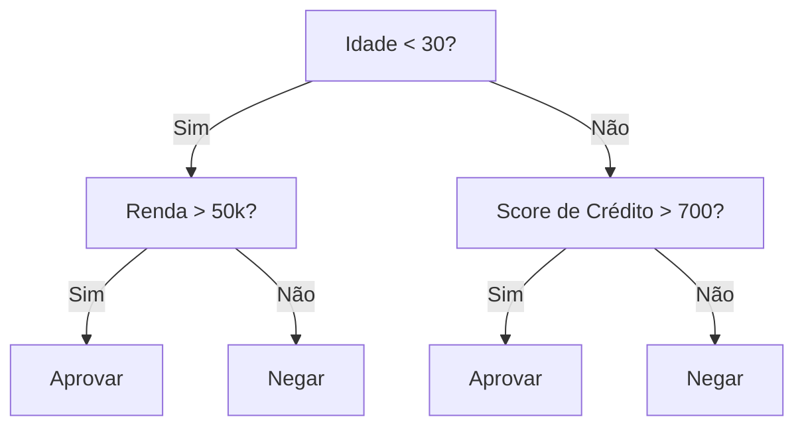
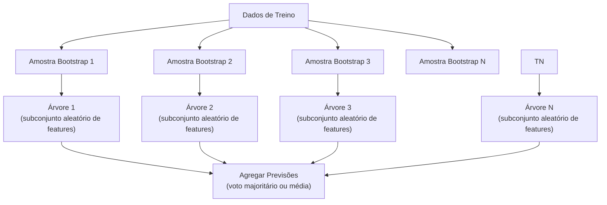

# Árvores de Decisão e Random Forests

> Uma árvore de decisão é só um fluxograma. Mas um floresta delas é uma das ferramentas mais poderosas do ML.

**Tipo:** Build
**Linguagens:** Python
**Pré-requisitos:** Fase 1 (Aulas 09 Teoria da Informação, 06 Probabilidade)
**Tempo:** ~90 minutos

## Objetivos de Aprendizado

- Implementar cálculos de impureza de Gini, entropia e ganho de informação para encontrar divisões ótimas de árvore de decisão
- Construir um classificador de árvore de decisão do zero com controles de poda prévia (profundidade máxima, mínimo de amostras)
- Construir uma random forest usando amostragem bootstrap e randomização de features, e explicar por que isso reduz variância
- Comparar importância de features MDI com importância por permutação e identificar quando MDI é enviesado

## O Problema

Você tem dados tabulares. Linhas são amostras, colunas são features, e existe uma coluna alvo que você quer prever. Poderia jogar uma rede neural nisso. Mas para dados tabulares, modelos baseados em árvore (árvores de decisão, random forests, gradient boosted trees) consistentemente superam deep learning.

Por quê? Árvores lidam com tipos mistos de feature (numéricos e categóricos) sem pré-processamento. Lidam com relações não-lineares sem engenharia de features. São interpretáveis: você olha a árvore e vê exatamente por que uma previsão foi feita.

## O Conceito

### O Que Uma Árvore de Decisão Faz

Uma árvore de decisão particiona o espaço de features em regiões retangulares fazendo uma sequência de perguntas sim/não.



### Critérios de Divisão

**Impureza de Gini**: mede a probabilidade de um amostra aleatória ser classificada incorretamente.
```
Gini(S) = 1 - sum(p_k^2)
```

**Entropia**: mede o conteúdo informacional (desordem) em um nó.
```
Entropia(S) = -sum(p_k * log2(p_k))
```

**Ganho de Informação**: a redução na impureza após uma divisão.

### Random Forests: O Poder dos Conjuntos



Duas fontes de aleatoriedade tornam as árvores diversas:

**Bagging (agregação bootstrap)**: Cada árvore é treinada em uma amostra bootstrap, uma amostra aleatória com reposição dos dados de treino.

**Randomização de features**: A cada divisão, apenas um subconjunto aleatório de features é considerado. Para classificação, o padrão é sqrt(n_features). Para regressão, n_features/3.

### Quando Árvores Superam Redes Neurais

| Fator | Árvores | Redes Neurais |
|-------|---------|---------------|
| Tipos mistos (numérico + categórico) | Suporte nativo | Precisa de encoding |
| Datasets pequenos (< 10k linhas) | Funcionam bem | Overfitam |
| Interações de features | Encontradas por divisão | Precisam de design de arquitetura |
| Interpretabilidade | Transparência total | Caixa preta |
| Tempo de treino | Minutos | Horas |

## Construa

### Passo 1: Impureza de Gini e entropia

```python
import math

def gini_impurity(labels):
    n = len(labels)
    if n == 0:
        return 0.0
    counts = {}
    for label in labels:
        counts[label] = counts.get(label, 0) + 1
    return 1.0 - sum((c / n) ** 2 for c in counts.values())

def entropy(labels):
    n = len(labels)
    if n == 0:
        return 0.0
    counts = {}
    for label in labels:
        counts[label] = counts.get(label, 0) + 1
    return -sum(
        (c / n) * math.log2(c / n) for c in counts.values() if c > 0
    )
```

### Passo 2: Encontre a melhor divisão

```python
def information_gain(parent_labels, left_labels, right_labels, criterion="gini"):
    measure = gini_impurity if criterion == "gini" else entropy
    n = len(parent_labels)
    n_left = len(left_labels)
    n_right = len(right_labels)
    if n_left == 0 or n_right == 0:
        return 0.0
    parent_impurity = measure(parent_labels)
    child_impurity = (
        (n_left / n) * measure(left_labels) +
        (n_right / n) * measure(right_labels)
    )
    return parent_impurity - child_impurity
```

## Use

Com scikit-learn, treinar uma random forest são três linhas:

```python
from sklearn.ensemble import RandomForestClassifier
from sklearn.datasets import load_iris
from sklearn.model_selection import train_test_split

X, y = load_iris(return_X_y=True)
X_train, X_test, y_train, y_test = train_test_split(X, y, random_state=42)

rf = RandomForestClassifier(n_estimators=100, random_state=42)
rf.fit(X_train, y_train)
print(f"Accuracy: {rf.score(X_test, y_test):.4f}")
print(f"Feature importances: {rf.feature_importances_}")
```

Na prática, gradient boosted trees (XGBoost, LightGBM, CatBoost) são frequentemente mais fortes que random forests porque constroem árvores sequencialmente, com cada árvore corrigindo os erros das anteriores.

## Exercícios

1. Treine uma única árvore de decisão em um dataset 2D com 3 classes. Trace manualmente as divisões e desenhe as fronteiras de decisão retangulares.
2. Implemente divisão por redução de variância para árvores de regressão. Gere y = sin(x) + ruído para 200 pontos e ajuste sua árvore de regressão.
3. Construa uma random forest com 1, 5, 10, 50 e 200 árvores. Plote accuracy de treino e teste vs número de árvores.
4. Compare impureza de Gini vs entropia como critérios de divisão em 5 datasets diferentes.
5. Implemente importância por permutação. Compare com importância MDI num dataset onde uma feature é ruído aleatório mas tem alta cardinalidade.
