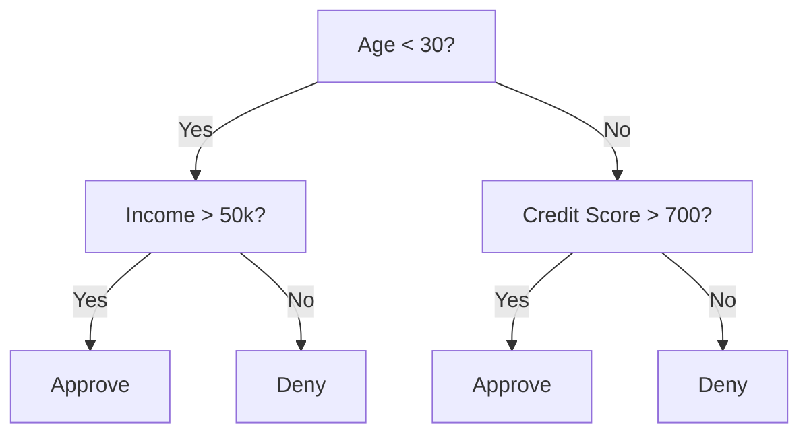
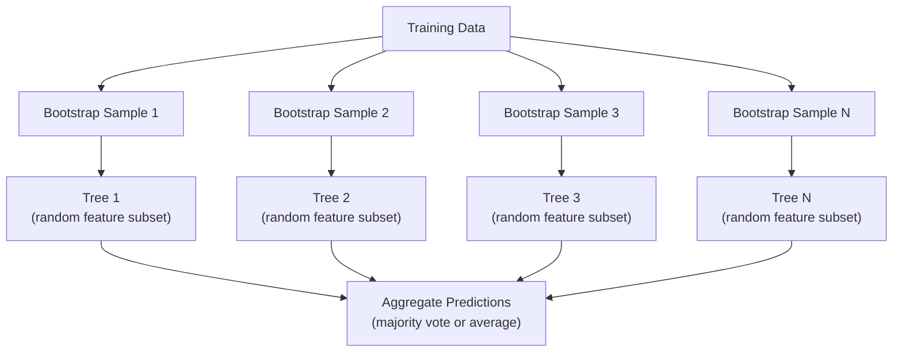

# Karar Ağaçları ve Rastgele Ormanlar

> Karar ağacı yalnızca bir akış şemasıdır. Ancak bunlardan oluşan bir orman makine öğrenimindeki en güçlü araçlardan biridir.

**Tür:** Yapım
**Dil:** Python
**Önkoşullar:** Aşama 1 (Dersler 09 Bilgi Teorisi, 06 Olasılık)
**Süre:** ~90 dakika

## Öğrenme Hedefleri

- Optimum karar ağacı bölümlerini bulmak için Gini safsızlığı, entropi ve bilgi kazanımı hesaplamalarını uygulayın
- Ön budama kontrolleri (maksimum derinlik, minimum örnekler) ile sıfırdan bir karar ağacı sınıflandırıcısı oluşturun
- Önyükleme örneklemesi ve özellik rastgeleleştirmesini kullanarak rastgele bir orman oluşturun ve bunun varyansı neden azalttığını açıklayın
- MDI özelliğinin önemini permütasyon önemiyle karşılaştırın ve MDI'nın ne zaman önyargılı olduğunu belirleyin

## Sorun

Tablosal verileriniz var. Satırlar örneklerdir, sütunlar özelliklerdir ve tahmin etmek istediğiniz bir hedef sütun vardır. Ona bir neural network atabilirsiniz. Ancak tablo verileri için ağaç tabanlı modeller (karar ağaçları, rastgele ormanlar, gradient güçlendirilmiş ağaçlar) sürekli olarak deep learning'den daha iyi performans gösteriyor. Yapılandırılmış veriler üzerindeki Kaggle yarışmalarına transformer'ler değil, XGBoost ve LightGBM hakimdir.

Neden? Ağaçlar, ön işleme gerek kalmadan karışık özellik türlerini (sayısal ve kategorik) işler. Özellik mühendisliği olmadan doğrusal olmayan ilişkileri ele alırlar. Bunlar yorumlanabilir: Ağaca bakabilir ve bir tahminin neden yapıldığını tam olarak görebilirsiniz. Ve ortalama olarak çok sayıda ağacın bulunduğu rastgele ormanlar, orta büyüklükteki dataset'lere aşırı uyum sağlamaya karşı oldukça dirençlidir.

Bu ders, özyinelemeli bölmeyi kullanarak sıfırdan karar ağaçları oluşturur ve ardından üstüne rastgele bir orman oluşturur. Bölünmüş kriterlerin (Gini safsızlığı, entropi, bilgi kazanımı) ardındaki matematiği uygulayacak ve zayıf öğrenenlerden oluşan bir topluluğun neden güçlü hale geldiğini anlayacaksınız.

## Konsept

### Karar ağacı ne işe yarar?

Bir karar ağacı, bir dizi evet/hayır sorusu sorarak özellik uzayını dikdörtgen bölgelere ayırır.



Her dahili düğüm bir özelliği bir eşiğe göre test eder. Her yaprak düğümü bir tahminde bulunur. Yeni bir veri noktasını sınıflandırmak için kökten başlayıp bir yaprağa ulaşana kadar dalları takip edersiniz.

Ağaç, her düğümde verileri en iyi ayıran özellik ve eşik seçilerek yukarıdan aşağıya oluşturulur. "En iyi" bölünmüş bir kritere göre tanımlanır.

### Bölünmüş kriterler: safsızlığın ölçülmesi

Her düğümde bir dizi örneğimiz var. Ortaya çıkan alt düğümlerin mümkün olduğu kadar "saf" olmasını sağlamak için bunları bölmek istiyoruz; bu, her çocuğun çoğunlukla bir sınıf içermesi anlamına gelir.

**Gini safsızlığı** rastgele seçilen bir örneğin o düğümdeki sınıf dağılımına göre etiketlenmesi durumunda yanlış sınıflandırılma olasılığını ölçer.

```
Gini(S) = 1 - sum(p_k^2)

where p_k is the proportion of class k in set S.
```

Saf bir düğüm için (hepsi bir sınıf), Gini = 0. 50/50 sınıflı bir ikili bölünme için, Gini = 0,5. Daha düşük olması daha iyidir.

```
Example: 6 cats, 4 dogs

Gini = 1 - (0.6^2 + 0.4^2) = 1 - (0.36 + 0.16) = 0.48
```

**Entropi** bir düğümdeki bilgi içeriğini (düzensizliği) ölçer. Aşama 1 Ders 09'da ele alınmaktadır.

```
Entropy(S) = -sum(p_k * log2(p_k))
```

Saf bir düğüm için entropi = 0. 50/50 ikili bölünme için entropi = 1,0. Daha düşük olması daha iyidir.

```
Example: 6 cats, 4 dogs

Entropy = -(0.6 * log2(0.6) + 0.4 * log2(0.4))
        = -(0.6 * -0.737 + 0.4 * -1.322)
        = 0.442 + 0.529
        = 0.971 bits
```

**Bilgi kazancı**, bölünme sonrasında safsızlıktaki (entropi veya Gini) azalmadır.

```
IG(S, feature, threshold) = Impurity(S) - weighted_avg(Impurity(S_left), Impurity(S_right))

where the weights are the proportions of samples in each child.
```

Her düğümdeki açgözlü algoritma: her özelliği ve mümkün olan her eşiği deneyin. Bilgi kazanımını maksimuma çıkaran (özellik, eşik) çiftini seçin.

### Bölme nasıl çalışır?

Geçerli düğümde n özelliğe ve m örneğe sahip bir dataset için:

1. Her j özelliği için (j = 1'den n'ye):
   - Örnekleri j özelliğine göre sıralayın
   - Ardışık farklı değerler arasındaki her orta noktayı eşik olarak deneyin
   - Her eşik için bilgi kazancını hesaplayın
2. En yüksek bilgi kazancına sahip özelliği ve eşiği seçin
3. Verileri sola (özellik <= eşik) ve sağa (özellik > eşik) bölün
4. Her çocuğa tekrar edin

Bu açgözlü yaklaşım küresel olarak en uygun ağacı garanti etmez. En uygun ağacı bulmak NP zordur. Ancak açgözlü bölme pratikte işe yarar.

### Durdurma koşulları

Durdurma koşulları olmaksızın, ağaç her yaprak saf olana kadar (yaprak başına bir örnek) büyür. Bu, eğitim verilerini mükemmel bir şekilde ezberler ve korkunç bir şekilde geneller.

**Ön budama** ağacı tamamen büyümeden durdurur:
- Maksimum derinlik: ağaç belirli bir derinliğe ulaştığında bölünmeyi durdurun
- Yaprak başına minimum örnek: bir düğümde k'den az örnek varsa dur
- Minimum bilgi kazancı: en iyi bölünme safsızlığı bir eşikten daha az artırıyorsa dur
- Maksimum yaprak düğümleri: toplam yaprak sayısını sınırlayın

**Budama sonrası** ağacın tamamını büyütür ve ardından budanır:
- Maliyet karmaşıklığı budaması (scikit-learn tarafından kullanılır): Yaprak sayısına orantılı bir ceza ekler. Daha küçük ağaçlar elde etmek için cezayı artırın
- Azaltılmış hata budama: doğrulama hatası artmazsa bir alt ağacı kaldırın

Ön budama daha basit ve hızlıdır. Sonradan budama genellikle daha iyi ağaçlar üretir çünkü daha fazla bölünmeye yol açabilecek bölünmeleri zamanından önce durdurmaz.

### Regresyon için karar ağaçları

Regresyon için yaprak tahmini, o yapraktaki hedef değerlerin ortalamasıdır. Bölünme kriteri de değişir:

**Farklılığın azaltılması** bilgi kazanımının yerini alır:

```
VR(S, feature, threshold) = Var(S) - weighted_avg(Var(S_left), Var(S_right))
```

Varyansı en fazla azaltan bölünmeyi seçin. Ağaç, girdi uzayını bölgelere ayırır ve her bölgede bir sabit (ortalama) öngörür.

### Rastgele ormanlar: toplulukların gücü

Tek bir karar ağacı yüksek varyansa sahiptir. Verilerdeki küçük değişiklikler tamamen farklı ağaçlar üretebilir. Rastgele ormanlar birçok ağacın ortalamasını alarak bu sorunu giderir.



İki rastgelelik kaynağı ağaçları çeşitlendirir:

**Bagging (bootstrap toplama):** Her ağaç, eğitim verilerinden değiştirilen rastgele bir örnek olan bir bootstrap örneği üzerinde eğitilir. Orijinal örneklerin yaklaşık %63'ü her önyüklemede görünür (geri kalanı doğrulama için kullanılabilecek paket dışı örneklerdir).

**Özellik rastgeleleştirmesi:** Her bölmede yalnızca rastgele bir özellik alt kümesi dikkate alınır. Sınıflandırma için varsayılan değer sqrt(n_features) şeklindedir. Regresyon için n_features/3. Bu, tüm ağaçların aynı baskın özelliğe göre bölünmesini önler.

Temel fikir: birbiriyle ilişkisiz birçok ağacın ortalamasını almak, yanlılığı artırmadan varyansı azaltır. Her bir ağaç vasat olabilir. Topluluk güçlü.

### Özelliğin önemi

Rastgele ormanlar doğal olarak özellik önem puanları sağlar. En yaygın yöntem:

**Safsızlıktaki Ortalama Azalma (MDI):** Her özellik için, o özelliğin kullanıldığı tüm ağaçlar ve tüm düğümlerdeki safsızlıktaki toplam azalmayı toplayın. Daha önceki bölünmelerde daha büyük safsızlık azaltımı sağlayan özellikler daha önemlidir.

```
importance(feature_j) = sum over all nodes where feature_j is used:
    (n_samples_at_node / n_total_samples) * impurity_decrease
```

Bu hızlıdır (eğitim sırasında hesaplanır), ancak yüksek kardinaliteli özelliklere ve birçok olası bölünme noktasına sahip özelliklere yönelik önyargılıdır.

**Permütasyon önemi** alternatiftir: Bir özelliğin değerlerini karıştırın ve modelin doğruluğunun ne kadar düştüğünü ölçün. Daha güvenilir ama daha yavaş.

### Ağaçlar neural network'leri yendiğinde

Tablo verileri üzerinde neural network'lerde ağaçlar ve ormanlar hakimdir. Çeşitli nedenler:

| Faktör | Ağaçlar | Neural network'ler |
|--------|-------|----------------|
| Karışık türler (sayısal + kategorik) | Yerel destek | Kodlamaya ihtiyacınız var |
| Küçük dataset'ler (< 10k satır) | İyi çalışın | Fazla kıyafet |
| Özellik etkileşimleri | Bölünerek bulundu | Mimari tasarıma ihtiyacınız var |
| Yorumlanabilirlik | Tam şeffaflık | Kara kutu |
| Eğitim süresi | Dakika | Saat |
| Hiperparametre hassasiyeti | Düşük | Yüksek |

Neural network'ler, verinin uzamsal veya sıralı bir yapıya (resim, metin, ses) sahip olması durumunda kazanır. Düz özellik tabloları için ağaçlar varsayılandır.

```figure
decision-tree-depth
```

## İnşa Et

### Adım 1: Gini safsızlığı ve entropisi

Her iki bölme kriterini de sıfırdan oluşturun ve hangi bölmelerin iyi olduğu konusunda anlaştıklarını doğrulayın.

```python
import math

def gini_impurity(labels):
    n = len(labels)
    if n == 0:
        return 0.0
    counts = {}
    for label in labels:
        counts[label] = counts.get(label, 0) + 1
    return 1.0 - sum((c / n) ** 2 for c in counts.values())

def entropy(labels):
    n = len(labels)
    if n == 0:
        return 0.0
    counts = {}
    for label in labels:
        counts[label] = counts.get(label, 0) + 1
    return -sum(
        (c / n) * math.log2(c / n) for c in counts.values() if c > 0
    )
```

### 2. Adım: En iyi bölünmeyi bulun

Her özelliği ve her eşiği deneyin. En yüksek bilgi kazancına sahip olanı döndürün.

```python
def information_gain(parent_labels, left_labels, right_labels, criterion="gini"):
    measure = gini_impurity if criterion == "gini" else entropy
    n = len(parent_labels)
    n_left = len(left_labels)
    n_right = len(right_labels)
    if n_left == 0 or n_right == 0:
        return 0.0
    parent_impurity = measure(parent_labels)
    child_impurity = (
        (n_left / n) * measure(left_labels) +
        (n_right / n) * measure(right_labels)
    )
    return parent_impurity - child_impurity
```

### Adım 3: DecisionTree sınıfını oluşturun

Özyinelemeli bölme, tahmin ve özellik önemi izleme. `_build` ağacın kalbidir: bir düğüm saf olduğunda veya bir ön budama sınırına ulaştığında durur, aksi takdirde en iyi bölünmeyi alır ve her iki çocuğa da yinelenir.

```python
import random

class DecisionTree:
    def __init__(self, max_depth=None, min_samples_split=2,
                 min_samples_leaf=1, criterion="gini",
                 max_features=None):
        self.max_depth = max_depth
        self.min_samples_split = min_samples_split
        self.min_samples_leaf = min_samples_leaf
        self.criterion = criterion
        self.max_features = max_features
        self.tree = None
        self.feature_importances_ = None

    def fit(self, X, y):
        self.n_features = len(X[0])
        self.feature_importances_ = [0.0] * self.n_features
        self.n_samples = len(X)
        self.tree = self._build(X, y, depth=0)
        total = sum(self.feature_importances_)
        if total > 0:
            self.feature_importances_ = [
                fi / total for fi in self.feature_importances_
            ]

    def predict(self, X):
        return [self._predict_one(x, self.tree) for x in X]

    def _build(self, X, y, depth):
        if len(set(y)) == 1:
            return {"leaf": True, "value": y[0]}

        if self.max_depth is not None and depth >= self.max_depth:
            return self._make_leaf(y)

        if len(y) < self.min_samples_split:
            return self._make_leaf(y)

        best_feature, best_threshold, best_gain = self._best_split(X, y)

        if best_feature is None or best_gain <= 0:
            return self._make_leaf(y)

        left_X, left_y, right_X, right_y = self._split_data(
            X, y, best_feature, best_threshold
        )

        if len(left_y) < self.min_samples_leaf or len(right_y) < self.min_samples_leaf:
            return self._make_leaf(y)

        weight = len(y) / self.n_samples
        self.feature_importances_[best_feature] += weight * best_gain

        return {
            "leaf": False,
            "feature": best_feature,
            "threshold": best_threshold,
            "left": self._build(left_X, left_y, depth + 1),
            "right": self._build(right_X, right_y, depth + 1),
        }

    def _make_leaf(self, y):
        counts = {}
        for label in y:
            counts[label] = counts.get(label, 0) + 1
        return {"leaf": True, "value": max(counts, key=counts.get)}

    def _best_split(self, X, y):
        best_feature = None
        best_threshold = None
        best_gain = -1.0

        if self.max_features == "sqrt":
            k = max(1, int(math.sqrt(self.n_features)))
            feature_indices = random.sample(range(self.n_features), k)
        elif isinstance(self.max_features, int):
            if self.max_features < 1:
                raise ValueError("max_features must be at least 1 when given as an integer")
            k = min(self.max_features, self.n_features)
            feature_indices = random.sample(range(self.n_features), k)
        else:
            feature_indices = list(range(self.n_features))

        for feature_idx in feature_indices:
            values = sorted(set(X[i][feature_idx] for i in range(len(X))))
            if len(values) <= 1:
                continue

            for i in range(len(values) - 1):
                threshold = (values[i] + values[i + 1]) / 2.0
                left_y = [y[j] for j in range(len(X)) if X[j][feature_idx] <= threshold]
                right_y = [y[j] for j in range(len(X)) if X[j][feature_idx] > threshold]

                if len(left_y) < self.min_samples_leaf or len(right_y) < self.min_samples_leaf:
                    continue

                gain = information_gain(y, left_y, right_y, self.criterion)
                if gain > best_gain:
                    best_gain = gain
                    best_feature = feature_idx
                    best_threshold = threshold

        return best_feature, best_threshold, best_gain

    def _split_data(self, X, y, feature, threshold):
        left_X, left_y, right_X, right_y = [], [], [], []
        for i in range(len(X)):
            if X[i][feature] <= threshold:
                left_X.append(X[i])
                left_y.append(y[i])
            else:
                right_X.append(X[i])
                right_y.append(y[i])
        return left_X, left_y, right_X, right_y

    def _predict_one(self, x, node):
        if node["leaf"]:
            return node["value"]
        if x[node["feature"]] <= node["threshold"]:
            return self._predict_one(x, node["left"])
        return self._predict_one(x, node["right"])
```

### Adım 4: RandomForest sınıfını oluşturun

Önyükleme örneklemesi, özellik rastgeleleştirmesi ve çoğunluk oyu.

```python
class RandomForest:
    def __init__(self, n_trees=100, max_depth=None,
                 min_samples_split=2, max_features="sqrt",
                 criterion="gini"):
        self.n_trees = n_trees
        self.max_depth = max_depth
        self.min_samples_split = min_samples_split
        self.max_features = max_features
        self.criterion = criterion
        self.trees = []

    def fit(self, X, y):
        n = len(X)
        for _ in range(self.n_trees):
            indices = [random.randint(0, n - 1) for _ in range(n)]
            X_boot = [X[i] for i in indices]
            y_boot = [y[i] for i in indices]
            tree = DecisionTree(
                max_depth=self.max_depth,
                min_samples_split=self.min_samples_split,
                max_features=self.max_features,
                criterion=self.criterion,
            )
            tree.fit(X_boot, y_boot)
            self.trees.append(tree)

    def predict(self, X):
        all_preds = [tree.predict(X) for tree in self.trees]
        predictions = []
        for i in range(len(X)):
            votes = {}
            for preds in all_preds:
                v = preds[i]
                votes[v] = votes.get(v, 0) + 1
            predictions.append(max(votes, key=votes.get))
        return predictions
```

Tüm yardımcı yöntemlerle tam uygulama için `code/trees.py`'ye bakın.

## Kullan onu

Scikit-learn ile rastgele bir ormanı eğitmek üç satırdan oluşur:

```python
from sklearn.ensemble import RandomForestClassifier
from sklearn.datasets import load_iris
from sklearn.model_selection import train_test_split

X, y = load_iris(return_X_y=True)
X_train, X_test, y_train, y_test = train_test_split(X, y, random_state=42)

rf = RandomForestClassifier(n_estimators=100, random_state=42)
rf.fit(X_train, y_train)
print(f"Accuracy: {rf.score(X_test, y_test):.4f}")
print(f"Feature importances: {rf.feature_importances_}")
```

Uygulamada, gradient güçlendirilmiş ağaçlar (XGBoost, LightGBM, CatBoost) genellikle rastgele ormanlardan daha güçlüdür çünkü ağaçları sırayla oluştururlar ve her ağaç bir öncekinin hatalarını düzeltir. Ancak rastgele ormanların yanlış yapılandırılması daha zordur ve neredeyse hiç hiperparametre ayarı gerektirmez.

## Gönderin

Bu ders, iş paydaşları için karar ağacı bölümlerini yorumlayan bir prompt olan `outputs/prompt-tree-interpreter.md`'yi üretir. Eğitimli bir ağacın yapısını (derinlik, özellikler, bölünmüş eşikler, doğruluk) besleyin; modeli düz dil kurallarına çevirir, özellik önemini sıralar, aşırı uyumu veya sızıntıyı işaretler ve sonraki adımları önerir. Kod okumayan birine ağaç tabanlı bir modeli açıklamanız gerektiğinde bunu kullanın.

## Egzersizler

1. 3 sınıflı 2D dataset üzerinde tek bir karar ağacını eğitin. Bölmeleri manuel olarak izleyin ve dikdörtgen karar sınırlarını çizin. Maksimum_derinlik=2 ile maksimum_derinlik=10 arasındaki sınırları karşılaştırın.

2. Regresyon ağaçları için varyans azaltıcı bölmeyi uygulayın. 200 puan için y = sin(x) + gürültüyü oluşturun ve regresyon ağacınızı uygun hale getirin. Ağacın parçalı-sabit tahminlerini gerçek eğriye göre çizin.

3. 1, 5, 10, 50 ve 200 ağaçtan oluşan rastgele bir orman oluşturun. Eğitim doğruluğunu ve test doğruluğunu ağaç sayısına göre çizin. Test doğruluğunun sabit kaldığını ancak azalmadığını (ormanlar aşırı uyum sağlamaya direnir) gözlemleyin.

4. 5 farklı dataset üzerinde bölünmüş kriter olarak Gini safsızlığı ile entropiyi karşılaştırın. Doğruluğu ve ağaç derinliğini ölçün. Çoğu durumda neredeyse aynı sonuçları üretirler. Nedenini açıklayın.

5. Permütasyon önemini uygulayın. Bunu, bir özelliğin rastgele gürültü olduğu ancak yüksek kardinaliteye sahip olduğu dataset'deki MDI önemiyle karşılaştırın. MDI, gürültü özelliğini yüksek düzeyde sıralayacaktır. Permütasyon önemi olmayacaktır.

## Anahtar Terimler

| Dönem | İnsanlar ne diyor | Aslında ne anlama geliyor |
|------|----------------|----------------------|
| Karar ağacı | "Tahminler için bir akış şeması" | if/else bölme dizisini öğrenerek özellik alanını dikdörtgen bölgelere bölen bir model |
| Gini safsızlığı | "Düğüm ne kadar karışık" | Bir düğümdeki rastgele bir örneğin yanlış sınıflandırılma olasılığı. 0 = saf, 0,5 = ikili için maksimum safsızlık |
| Entropi | "Bir düğümdeki bozukluk" | Bir düğümdeki bilgi içeriği. 0 = saf, 1,0 = ikili için maksimum belirsizlik. Bilgi teorisinden |
| Bilgi kazancı | "Bölünmek ne kadar iyi" | Bölünmeden sonra safsızlıkta azalma. Bölünme seçiminde açgözlü kriter |
| Ön budama | "Ağacı erken durdurun" | Maksimum derinlik, minimum örnek veya minimum kazanç eşiklerini ayarlayarak ağaç büyümesini erken durdurma |
| Budama sonrası | "Sonra ağacı kesin" | Ağacın tamamını büyütme ve ardından doğrulama performansını iyileştirmeyen alt ağaçları kaldırma |
| Torbalama | "Rastgele alt kümeler üzerinde eğitim alın" | Önyükleme toplama. Her modeli değiştirmeyle farklı bir rastgele örnek üzerinde eğitin |
| Rastgele orman | "Bir grup ağaç" | Her biri, her bölmede rastgele özellik alt kümelerine sahip bir önyükleme örneği üzerinde eğitilmiş karar ağaçları topluluğu |
| Özelliğin önemi (MDI) | "Hangi özellikler önemlidir" | Tüm ağaçlar ve düğümler genelinde toplanan, her bir özelliğin katkıda bulunduğu toplam safsızlık azalması |
| Permütasyonun önemi | "Karıştır ve kontrol et" | Bir özelliğin değerleri rastgele karıştırıldığında doğruluk düşüşü. Gürültülü özellikler için MDI'dan daha güvenilir |
| Fark azaltma | "Bilgi kazancının regresyon versiyonu" | Bilgi kazancının regresyon ağacı analoğu. Hedef sapmasını en çok azaltan bölünmeyi seçer |
| Önyükleme örneği | "Tekrarlarla rastgele örnek" | Orijinal dataset'den değiştirilerek alınan rastgele bir örnek. Aynı boyutta ancak kopyaları var |

## Daha Fazla Okuma

- [Breiman: Rastgele Ormanlar (2001)](https://link.springer.com/article/10.1023/A:1010933404324) - orijinal rastgele orman kağıdı
- [Grinsztajn ve diğerleri: Ağaç tabanlı modeller neden tablosal verilerde hala deep learning'den daha iyi performans gösteriyor? (2022)](https://arxiv.org/abs/2207.08815) - tablolu görevlerde ağaçlar ile neural network'lerin titiz karşılaştırması
- [scikit-learn Karar Ağaçları belgeleri](https://scikit-learn.org/stable/modules/tree.html) - görselleştirme araçlarını içeren pratik kılavuz
- [XGBoost: Ölçeklenebilir Bir Ağaç Destekleme Sistemi (Chen ve Guestrin, 2016)](https://arxiv.org/abs/1603.02754) - Kaggle'a hakim olan gradient güçlendirme kağıdı
