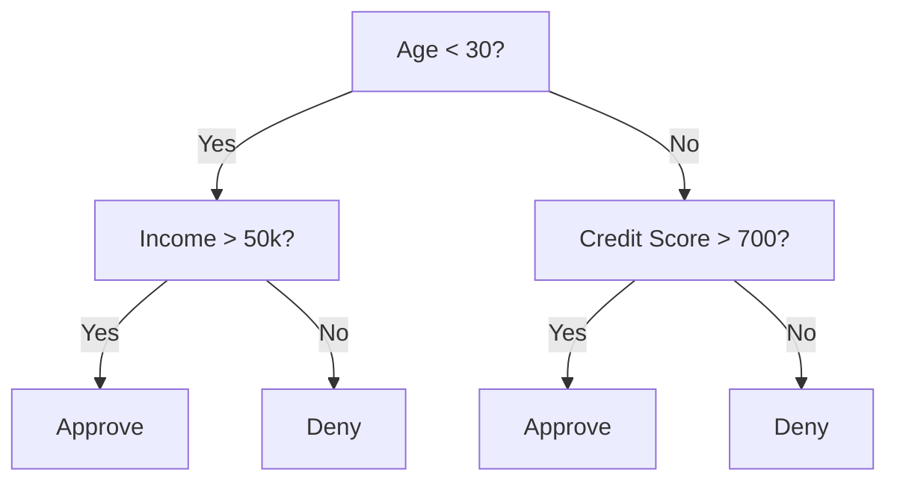
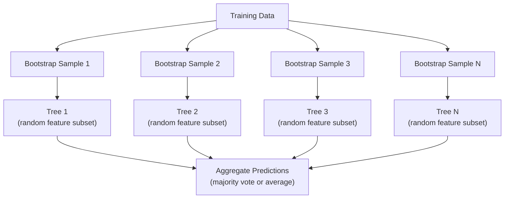

# 04 · 决策树与随机森林

> 决策树不过是一张流程图。但由许多决策树组成的森林，却是机器学习中最强大的工具之一。

**类型：** 构建
**语言：** Python
**前置：** 第 1 阶段（第 09 课 信息论、第 06 课 概率）
**时长：** 约 90 分钟

## 学习目标

- 实现「基尼不纯度（Gini impurity）」、「熵（entropy）」与「信息增益（information gain）」的计算，以找到决策树的最优分裂点
- 从零构建一个带预剪枝控制（最大深度、最小样本数）的决策树分类器
- 使用「自助采样（bootstrap sampling）」和特征随机化构建随机森林，并解释它为何能降低方差
- 比较「平均不纯度下降（MDI）」特征重要性与「排列重要性（permutation importance）」，并识别 MDI 何时会出现偏差

## 问题所在

你手头有一份表格数据。每一行是一个样本，每一列是一个特征，其中有一列是你想要预测的目标列。你当然可以直接套用神经网络。但对于表格数据而言，基于树的模型（决策树、随机森林、梯度提升树）的表现始终优于深度学习。在结构化数据的 Kaggle 竞赛中，占据主导地位的是 XGBoost 和 LightGBM，而非 Transformer。

为什么？树模型无需预处理即可处理混合特征类型（数值型与类别型）。它们无需特征工程即可处理非线性关系。它们具有可解释性：你可以直接查看树结构，明确看到某个预测是如何得出的。而对许多树取平均的随机森林，在中等规模数据集上具有极强的抗过拟合能力。

本课将使用递归分裂从零构建决策树，然后在其之上构建随机森林。你将实现分裂准则背后的数学原理（基尼不纯度、熵、信息增益），并理解为什么由弱学习器组成的集成能够变成一个强学习器。

## 核心概念

### 决策树做了什么

决策树通过提出一系列「是/否」问题，将特征空间划分为若干矩形区域。



每个内部节点都针对某个特征与一个阈值进行测试。每个叶子节点做出一个预测。要对一个新的数据点进行分类，你从根节点出发，沿着各个分支前进，直到到达某个叶子节点。

树是自顶向下构建的：在每个节点上，选择能最好地分隔数据的特征与阈值。这里的「最好」由一个分裂准则来定义。

### 分裂准则：度量不纯度

在每个节点上，我们都有一组样本。我们希望对它们进行分裂，使得到的子节点尽可能「纯净」，也就是说每个子节点中大部分都属于同一个类别。

**基尼不纯度（Gini impurity）** 度量的是：如果根据该节点的类别分布对一个随机选取的样本进行标注，那么它被错误分类的概率。

```
Gini(S) = 1 - sum(p_k^2)

where p_k is the proportion of class k in set S.
```

对于纯净节点（全部属于同一类），Gini = 0。对于类别各占 50/50 的二分类分裂，Gini = 0.5。该值越低越好。

```
Example: 6 cats, 4 dogs

Gini = 1 - (0.6^2 + 0.4^2) = 1 - (0.36 + 0.16) = 0.48
```

**熵（Entropy）** 度量的是一个节点中的信息量（无序程度）。已在第 1 阶段第 09 课讲解。

```
Entropy(S) = -sum(p_k * log2(p_k))
```

对于纯净节点，entropy = 0。对于 50/50 的二分类分裂，entropy = 1.0。该值越低越好。

```
Example: 6 cats, 4 dogs

Entropy = -(0.6 * log2(0.6) + 0.4 * log2(0.4))
        = -(0.6 * -0.737 + 0.4 * -1.322)
        = 0.442 + 0.529
        = 0.971 bits
```

**信息增益（Information gain）** 是分裂之后不纯度（熵或基尼）的下降量。

```
IG(S, feature, threshold) = Impurity(S) - weighted_avg(Impurity(S_left), Impurity(S_right))

where the weights are the proportions of samples in each child.
```

每个节点上的贪心算法：尝试每一个特征以及每一个可能的阈值。选取使信息增益最大化的 (feature, threshold) 组合。

### 分裂是如何进行的

对于当前节点上含有 n 个特征、m 个样本的数据集：

1. 对每个特征 j（j = 1 到 n）：
   - 按特征 j 对样本排序
   - 将相邻不同取值之间的每一个中点作为候选阈值进行尝试
   - 计算每个阈值对应的信息增益
2. 选取信息增益最高的特征与阈值
3. 将数据分裂为左子集（feature <= threshold）和右子集（feature > threshold）
4. 对每个子节点递归进行上述过程

这种贪心方法并不能保证得到全局最优的树。寻找最优树是 NP 难问题。但贪心分裂在实践中效果很好。

### 停止条件

如果没有停止条件，树会一直生长，直到每个叶子都纯净为止（每个叶子只有一个样本）。这会完美地记住训练数据，但泛化能力极差。

**预剪枝（Pre-pruning）** 在树完全生长之前就停止：
- 最大深度：当树达到设定深度时停止分裂
- 每个叶子的最小样本数：如果某节点的样本数少于 k，则停止
- 最小信息增益：如果最佳分裂带来的不纯度改善低于某阈值，则停止
- 最大叶子节点数：限制叶子的总数量

**后剪枝（Post-pruning）** 先让树完全生长，然后再将其修剪回去：
- 代价复杂度剪枝（scikit-learn 采用）：加入一个与叶子数量成正比的惩罚项。增大惩罚项可得到更小的树
- 错误率降低剪枝：如果移除某个子树不会增加验证误差，则将其移除

预剪枝更简单、更快。后剪枝往往能产生更好的树，因为它不会过早地停止那些本可能引出更多有用分裂的分裂。

### 用于回归的决策树

对于回归任务，叶子的预测值是该叶子中目标值的均值。分裂准则也随之改变：

**方差缩减（Variance reduction）** 取代了信息增益：

```
VR(S, feature, threshold) = Var(S) - weighted_avg(Var(S_left), Var(S_right))
```

选取使方差缩减最多的分裂。树将输入空间划分为若干区域，并在每个区域中预测一个常数（即均值）。

### 随机森林：集成的力量

单棵决策树具有高方差。数据中的微小变化就可能产生截然不同的树。随机森林通过对许多树取平均来解决这一问题。



两种随机性来源让这些树彼此各异：

**装袋（Bagging，即 bootstrap aggregating，自助聚合）：** 每棵树都在一个自助样本上训练，即从训练数据中有放回地随机抽样得到的样本。原始样本中约有 63% 会出现在每个自助样本里（其余的是「袋外样本（out-of-bag）」，可用于验证）。

**特征随机化（Feature randomization）：** 在每次分裂时，只考虑一个随机的特征子集。对于分类任务，默认值为 sqrt(n_features)；对于回归任务，默认值为 n_features/3。这可以防止所有树都在同一个主导特征上进行分裂。

关键洞见：对许多去相关的树取平均，可以在不增加偏差的情况下降低方差。每一棵单独的树可能都很平庸，但其集成却很强大。

### 特征重要性

随机森林天然提供特征重要性得分。最常用的方法是：

**平均不纯度下降（Mean Decrease in Impurity，MDI）：** 对每个特征，将所有树、所有使用该特征的节点上的不纯度下降总量相加。在更靠前的分裂处带来更大不纯度下降的特征更为重要。

```
importance(feature_j) = sum over all nodes where feature_j is used:
    (n_samples_at_node / n_total_samples) * impurity_decrease
```

这种方法很快（在训练过程中即可算出），但会偏向于高基数（high-cardinality）特征以及拥有许多可能分裂点的特征。

**排列重要性（Permutation importance）** 是另一种替代方案：打乱某个特征的取值，然后度量模型准确率下降了多少。它更可靠，但更慢。

### 何时树模型能击败神经网络

在表格数据上，树和森林的表现优于神经网络。原因有几个：

| 因素 | 树模型 | 神经网络 |
|--------|-------|----------------|
| 混合类型（数值型 + 类别型） | 原生支持 | 需要编码 |
| 小数据集（< 10k 行） | 表现良好 | 过拟合 |
| 特征交互 | 通过分裂自动发现 | 需要架构设计 |
| 可解释性 | 完全透明 | 黑盒 |
| 训练时间 | 几分钟 | 几小时 |
| 超参数敏感度 | 低 | 高 |

当数据具有空间或序列结构时（图像、文本、音频），神经网络更有优势。而对于扁平的特征表格，树模型是首选。

## 动手构建

### 第 1 步：基尼不纯度与熵

从零构建这两种分裂准则，并验证它们在判断哪些分裂更优时是否一致。

```python
import math

def gini_impurity(labels):
    n = len(labels)
    if n == 0:
        return 0.0
    counts = {}
    for label in labels:
        counts[label] = counts.get(label, 0) + 1
    return 1.0 - sum((c / n) ** 2 for c in counts.values())

def entropy(labels):
    n = len(labels)
    if n == 0:
        return 0.0
    counts = {}
    for label in labels:
        counts[label] = counts.get(label, 0) + 1
    return -sum(
        (c / n) * math.log2(c / n) for c in counts.values() if c > 0
    )
```

### 第 2 步：找到最佳分裂

尝试每一个特征和每一个阈值。返回信息增益最高的那个。

```python
def information_gain(parent_labels, left_labels, right_labels, criterion="gini"):
    measure = gini_impurity if criterion == "gini" else entropy
    n = len(parent_labels)
    n_left = len(left_labels)
    n_right = len(right_labels)
    if n_left == 0 or n_right == 0:
        return 0.0
    parent_impurity = measure(parent_labels)
    child_impurity = (
        (n_left / n) * measure(left_labels) +
        (n_right / n) * measure(right_labels)
    )
    return parent_impurity - child_impurity
```

### 第 3 步：构建 DecisionTree 类

递归分裂、预测，以及特征重要性的追踪。

```python
class DecisionTree:
    def __init__(self, max_depth=None, min_samples_split=2,
                 min_samples_leaf=1, criterion="gini",
                 max_features=None):
        self.max_depth = max_depth
        self.min_samples_split = min_samples_split
        self.min_samples_leaf = min_samples_leaf
        self.criterion = criterion
        self.max_features = max_features
        self.tree = None
        self.feature_importances_ = None

    def fit(self, X, y):
        self.n_features = len(X[0])
        self.feature_importances_ = [0.0] * self.n_features
        self.n_samples = len(X)
        self.tree = self._build(X, y, depth=0)
        total = sum(self.feature_importances_)
        if total > 0:
            self.feature_importances_ = [
                fi / total for fi in self.feature_importances_
            ]

    def predict(self, X):
        return [self._predict_one(x, self.tree) for x in X]
```

### 第 4 步：构建 RandomForest 类

自助采样、特征随机化与多数投票。

```python
class RandomForest:
    def __init__(self, n_trees=100, max_depth=None,
                 min_samples_split=2, max_features="sqrt",
                 criterion="gini"):
        self.n_trees = n_trees
        self.max_depth = max_depth
        self.min_samples_split = min_samples_split
        self.max_features = max_features
        self.criterion = criterion
        self.trees = []

    def fit(self, X, y):
        n = len(X)
        for _ in range(self.n_trees):
            indices = [random.randint(0, n - 1) for _ in range(n)]
            X_boot = [X[i] for i in indices]
            y_boot = [y[i] for i in indices]
            tree = DecisionTree(
                max_depth=self.max_depth,
                min_samples_split=self.min_samples_split,
                max_features=self.max_features,
                criterion=self.criterion,
            )
            tree.fit(X_boot, y_boot)
            self.trees.append(tree)

    def predict(self, X):
        all_preds = [tree.predict(X) for tree in self.trees]
        predictions = []
        for i in range(len(X)):
            votes = {}
            for preds in all_preds:
                v = preds[i]
                votes[v] = votes.get(v, 0) + 1
            predictions.append(max(votes, key=votes.get))
        return predictions
```

完整实现（包含所有辅助方法）参见 `code/trees.py`。

## 实际运用

使用 scikit-learn，训练一个随机森林只需三行代码：

```python
from sklearn.ensemble import RandomForestClassifier
from sklearn.datasets import load_iris
from sklearn.model_selection import train_test_split

X, y = load_iris(return_X_y=True)
X_train, X_test, y_train, y_test = train_test_split(X, y, random_state=42)

rf = RandomForestClassifier(n_estimators=100, random_state=42)
rf.fit(X_train, y_train)
print(f"Accuracy: {rf.score(X_test, y_test):.4f}")
print(f"Feature importances: {rf.feature_importances_}")
```

在实践中，梯度提升树（XGBoost、LightGBM、CatBoost）往往比随机森林更强，因为它们是顺序地构建树的：每一棵树都在纠正前面那些树的错误。但随机森林更不容易被配置错，且几乎不需要任何超参数调优。

## 交付成果

本课产出 `outputs/prompt-tree-interpreter.md`——一个为业务相关方解读决策树分裂的提示词。把一棵训练好的树的结构（深度、特征、分裂阈值、准确率）喂给它，它就会把模型翻译成通俗易懂的规则、对特征重要性进行排序、标记出过拟合或数据泄露问题，并给出下一步建议。每当你需要向不懂代码的人解释一个基于树的模型时，都可以使用它。

## 练习

1. 在一个含 3 个类别的二维数据集上训练一棵决策树。手动追踪各次分裂，并画出矩形决策边界。对比 max_depth=2 与 max_depth=10 时的边界。

2. 为回归树实现方差缩减分裂。为 200 个数据点生成 y = sin(x) + noise，并拟合你的回归树。将树的分段常数预测结果与真实曲线绘制在一起对比。

3. 构建分别含 1、5、10、50 和 200 棵树的随机森林。绘制训练准确率和测试准确率随树数量变化的曲线。观察到测试准确率会趋于平稳但不会下降（森林具有抗过拟合能力）。

4. 在 5 个不同的数据集上，将基尼不纯度与熵作为分裂准则进行比较。度量准确率和树深度。在大多数情况下，二者产生的结果几乎相同。解释原因。

5. 实现排列重要性。在一个数据集上将其与 MDI 重要性进行比较，该数据集中有一个特征是随机噪声但具有高基数。MDI 会把这个噪声特征排得很高，而排列重要性则不会。

## 关键术语

| 术语 | 人们口中的说法 | 它的真正含义 |
|------|----------------|----------------------|
| 决策树（Decision tree） | “一张用于预测的流程图” | 一种通过学习一系列 if/else 分裂、将特征空间划分为若干矩形区域的模型 |
| 基尼不纯度（Gini impurity） | “节点有多混杂” | 在一个节点上对随机样本进行误分类的概率。0 = 纯净，0.5 = 二分类下的最大不纯度 |
| 熵（Entropy） | “节点中的无序程度” | 一个节点上的信息量。0 = 纯净，1.0 = 二分类下的最大不确定性。源自信息论 |
| 信息增益（Information gain） | “一次分裂有多好” | 分裂之后不纯度的下降量。用于选择分裂的贪心准则 |
| 预剪枝（Pre-pruning） | “提前停止生长” | 通过设置最大深度、最小样本数或最小增益阈值来提前停止树的生长 |
| 后剪枝（Post-pruning） | “之后再修剪” | 先让树完全生长，然后移除那些不能改善验证表现的子树 |
| 装袋（Bagging） | “在随机子集上训练” | 自助聚合。在不同的有放回随机样本上训练每个模型 |
| 随机森林（Random forest） | “一堆树” | 由决策树组成的集成，每棵树都在一个自助样本上训练，且在每次分裂时使用随机特征子集 |
| 特征重要性（MDI） | “哪些特征重要” | 每个特征贡献的不纯度下降总量，跨所有树和所有节点累加 |
| 排列重要性（Permutation importance） | “打乱后再检验” | 当某个特征的取值被随机打乱后准确率下降的量。对于含噪声的特征，比 MDI 更可靠 |
| 方差缩减（Variance reduction） | “信息增益的回归版本” | 信息增益在回归树中的对应物。选取使目标方差缩减最多的分裂 |
| 自助样本（Bootstrap sample） | “可重复的随机抽样” | 从原始数据集中有放回抽取的随机样本。规模相同，但含有重复项 |

## 延伸阅读

- [Breiman: Random Forests (2001)](https://link.springer.com/article/10.1023/A:1010933404324) —— 随机森林的原始论文
- [Grinsztajn et al.: Why do tree-based models still outperform deep learning on tabular data? (2022)](https://arxiv.org/abs/2207.08815) —— 在表格任务上对树模型与神经网络的严谨对比
- [scikit-learn 决策树文档](https://scikit-learn.org/stable/modules/tree.html) —— 配有可视化工具的实用指南
- [XGBoost: A Scalable Tree Boosting System (Chen & Guestrin, 2016)](https://arxiv.org/abs/1603.02754) —— 在 Kaggle 上占主导地位的梯度提升论文
