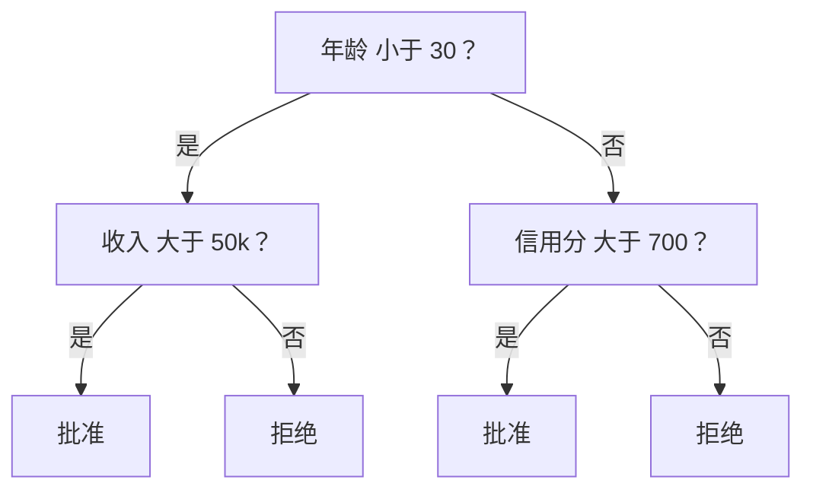
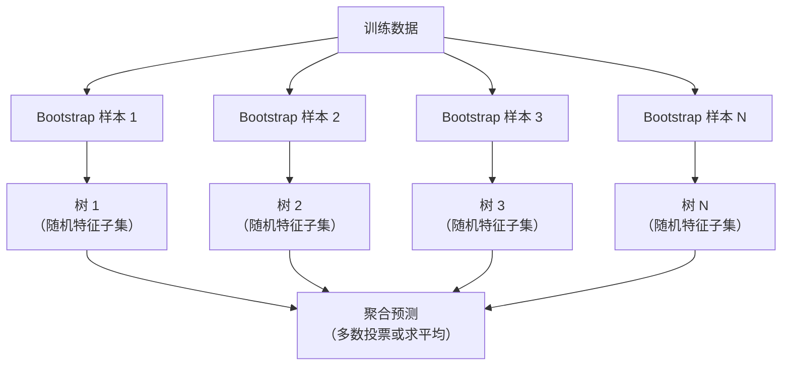

# 决策树与随机森林（Decision Trees and Random Forests）

> 译注：本文译自同目录 [`en.md`](./en.md)。术语遵循仓根 [TRANSLATION_GUIDE.md](../../../../TRANSLATION_GUIDE.md)。

> 一棵决策树不过是张流程图。但一片由它们组成的森林，是 ML 里最强大的工具之一。

**Type:** Build
**Language:** Python
**Prerequisites:** Phase 1 (Lessons 09 Information Theory, 06 Probability)
**Time:** ~90 minutes

## 学习目标（Learning Objectives）

- 实现 Gini impurity（基尼不纯度）、entropy（熵）和 information gain（信息增益）的计算，用以寻找决策树的最优划分
- 从零搭建一个带预剪枝（pre-pruning）控制（最大深度、最小样本数）的决策树分类器
- 用 bootstrap 采样和特征随机化构建一个随机森林，并解释它为什么能降低方差
- 对比 MDI 特征重要度与 permutation importance（置换重要度），并识别 MDI 何时会有偏

## 问题（Problem）

你手头有一份表格数据。每一行是一个样本，每一列是一个特征，其中有一列是你想预测的目标。你大可以直接上一个神经网络。但对于表格数据，基于树的模型（决策树、随机森林、梯度提升树）一直稳压深度学习一头。Kaggle 上结构化数据的比赛被 XGBoost 和 LightGBM 主宰，而不是 transformer。

为什么？树天然能处理混合类型的特征（数值型和类别型），无需预处理。它能处理非线性关系，无需特征工程。它具有可解释性：你可以直接看一眼这棵树，就知道某个预测是怎么得出的。而随机森林——对许多棵树取平均——在中等规模数据集上对过拟合（overfitting）有极强的抵抗力。

本节课从零实现决策树的递归划分，再在其之上搭建一个随机森林。你将亲手实现划分准则（Gini impurity、entropy、information gain）背后的数学，并理解为什么把一群弱学习器集成起来能变强。

## 概念（Concept）

### 决策树到底在做什么

决策树通过一连串 yes/no 的提问，把特征空间划分成一块块矩形区域。



每个内部节点用一个阈值去测试某个特征；每个叶子节点给出一个预测。要给一个新数据点分类，从根节点出发，沿着分支走下去，直到落到某个叶子。

这棵树是自顶向下生长的：在每个节点，挑出能把数据分得最好的那个特征和阈值。所谓「最好」由划分准则定义。

### 划分准则：度量不纯度

每个节点上都有一组样本。我们希望把它们划分开，使得分到子节点的样本尽可能「纯」——也就是每个子节点里大多是同一类。

**Gini impurity（基尼不纯度）** 度量的是：如果按节点上的类别分布去随机给样本打标签，那么随机抽一个样本被错分的概率。

```
Gini(S) = 1 - sum(p_k^2)

where p_k is the proportion of class k in set S.
```

对于一个纯净节点（全部属于一类），Gini = 0。对于二分类 50/50 的情况，Gini = 0.5。越低越好。

```
Example: 6 cats, 4 dogs

Gini = 1 - (0.6^2 + 0.4^2) = 1 - (0.36 + 0.16) = 0.48
```

**Entropy（熵）** 度量的是节点中的信息量（无序度）。在 Phase 1 Lesson 09 中已经讲过。

```
Entropy(S) = -sum(p_k * log2(p_k))
```

纯节点的熵 = 0。二分类 50/50 时，熵 = 1.0。越低越好。

```
Example: 6 cats, 4 dogs

Entropy = -(0.6 * log2(0.6) + 0.4 * log2(0.4))
        = -(0.6 * -0.737 + 0.4 * -1.322)
        = 0.442 + 0.529
        = 0.971 bits
```

**Information gain（信息增益）** 是划分之后不纯度（熵或 Gini）的减少量。

```
IG(S, feature, threshold) = Impurity(S) - weighted_avg(Impurity(S_left), Impurity(S_right))

where the weights are the proportions of samples in each child.
```

每个节点上的贪心算法：把每个特征、每个可能的阈值都试一遍，挑出能让信息增益最大的 (feature, threshold) 组合。

### 划分到底怎么做

对于当前节点上有 n 个特征、m 个样本的数据集：

1. 对每个特征 j（j = 1 到 n）：
   - 按特征 j 对样本排序
   - 把每两个相邻的不同取值的中点作为候选阈值
   - 计算每个阈值的信息增益
2. 选出信息增益最大的 (特征, 阈值)
3. 把数据划分为左（feature <= threshold）和右（feature > threshold）
4. 在每个子节点上递归

这个贪心做法不能保证得到全局最优的树。寻找全局最优树是 NP-hard 的。但贪心划分在实际中表现很不错。

### 停止条件

如果不设停止条件，这棵树会一直长到每个叶子都是纯净的（每个叶子一个样本）。这样的树会完美记住训练数据，但泛化得稀烂。

**Pre-pruning（预剪枝）** 在树长完之前就停下：
- 最大深度：树达到设定深度就停止划分
- 每个叶子的最小样本数：节点样本数少于 k 就停止
- 最小信息增益：最优划分带来的不纯度改善低于阈值就停
- 最大叶子节点数：限制叶子总数

**Post-pruning（后剪枝）** 先把树长满，再修回去：
- Cost-complexity pruning（代价复杂度剪枝，scikit-learn 在用）：在叶子数上加一个惩罚项。惩罚越大，树越小
- Reduced error pruning（降低错误剪枝）：如果一个子树砍掉后验证误差不增加，就把它砍掉

预剪枝更简单更快。后剪枝往往能产出更好的树，因为它不会过早停掉那些当下看起来不划算、但后续可能有用的划分。

### 用决策树做回归

做回归时，叶子的预测值就是该叶子里目标值的均值。划分准则也跟着变：

**Variance reduction（方差减少量）** 取代信息增益：

```
VR(S, feature, threshold) = Var(S) - weighted_avg(Var(S_left), Var(S_right))
```

挑能让方差减少最多的那个划分。这棵树把输入空间切成若干区域，并在每个区域里预测一个常数（均值）。

### 随机森林：集成的力量

单棵决策树方差很大。数据稍微变一点点，长出来的树就可能完全不同。随机森林靠对许多棵树取平均来解决这个问题。



两种随机性让树之间彼此不同：

**Bagging（bootstrap aggregating，自助聚合）：** 每棵树都在一个 bootstrap 样本上训练——也就是从训练集里有放回随机采样得到的。每个 bootstrap 样本里大约会出现原始样本的 63%（剩下的是 out-of-bag 样本，可以用来做验证）。

**特征随机化：** 在每个划分点，只考虑一个随机特征子集。分类任务默认是 sqrt(n_features)；回归任务则是 n_features/3。这样可以避免所有树都在同一个强势特征上划分。

关键洞察：把许多去相关的树平均起来，可以在不增加偏置（bias）的前提下降低方差。每棵树单看可能平平无奇，但集成起来很强。

### 特征重要度

随机森林天然能给出特征重要度。最常见的做法是：

**Mean Decrease in Impurity（MDI，平均不纯度减少量）：** 对每个特征，把所有树、所有用到该特征的节点上的不纯度减少量求和。在更早期的划分中带来更大不纯度减少的特征更重要。

```
importance(feature_j) = sum over all nodes where feature_j is used:
    (n_samples_at_node / n_total_samples) * impurity_decrease
```

这个方法很快（训练时顺手就算出来了），但对高基数特征以及划分点很多的特征有偏。

**Permutation importance（置换重要度）** 是另一个选择：把某个特征的取值打乱，看模型准确率下降多少。更可靠，但更慢。

### 树什么时候能赢过神经网络

在表格数据上，树和森林是能压制神经网络的。原因有几个：

| 因素 | 树 | 神经网络 |
|--------|-------|----------------|
| 混合类型（数值型 + 类别型） | 原生支持 | 需要编码 |
| 小数据集（< 10k 行） | 工作得不错 | 会过拟合 |
| 特征交互 | 由划分自动发现 | 需要架构设计 |
| 可解释性 | 完全透明 | 黑盒 |
| 训练时间 | 几分钟 | 几小时 |
| 超参数敏感度 | 低 | 高 |

只有当数据具有空间或序列结构时（图像、文本、音频），神经网络才占优。对于扁平的特征表，树是默认选择。

## 动手实现（Build It）

### 第 1 步：Gini impurity 与 entropy

从零实现这两种划分准则，并验证它们对划分好坏的判断是一致的。

```python
import math

def gini_impurity(labels):
    n = len(labels)
    if n == 0:
        return 0.0
    counts = {}
    for label in labels:
        counts[label] = counts.get(label, 0) + 1
    return 1.0 - sum((c / n) ** 2 for c in counts.values())

def entropy(labels):
    n = len(labels)
    if n == 0:
        return 0.0
    counts = {}
    for label in labels:
        counts[label] = counts.get(label, 0) + 1
    return -sum(
        (c / n) * math.log2(c / n) for c in counts.values() if c > 0
    )
```

### 第 2 步：找出最优划分

把每个特征、每个阈值都试一遍，返回信息增益最大的那个。

```python
def information_gain(parent_labels, left_labels, right_labels, criterion="gini"):
    measure = gini_impurity if criterion == "gini" else entropy
    n = len(parent_labels)
    n_left = len(left_labels)
    n_right = len(right_labels)
    if n_left == 0 or n_right == 0:
        return 0.0
    parent_impurity = measure(parent_labels)
    child_impurity = (
        (n_left / n) * measure(left_labels) +
        (n_right / n) * measure(right_labels)
    )
    return parent_impurity - child_impurity
```

### 第 3 步：实现 DecisionTree 类

递归划分、预测、特征重要度记录。

```python
class DecisionTree:
    def __init__(self, max_depth=None, min_samples_split=2,
                 min_samples_leaf=1, criterion="gini",
                 max_features=None):
        self.max_depth = max_depth
        self.min_samples_split = min_samples_split
        self.min_samples_leaf = min_samples_leaf
        self.criterion = criterion
        self.max_features = max_features
        self.tree = None
        self.feature_importances_ = None

    def fit(self, X, y):
        self.n_features = len(X[0])
        self.feature_importances_ = [0.0] * self.n_features
        self.n_samples = len(X)
        self.tree = self._build(X, y, depth=0)
        total = sum(self.feature_importances_)
        if total > 0:
            self.feature_importances_ = [
                fi / total for fi in self.feature_importances_
            ]

    def predict(self, X):
        return [self._predict_one(x, self.tree) for x in X]
```

### 第 4 步：实现 RandomForest 类

bootstrap 采样、特征随机化、多数投票。

```python
class RandomForest:
    def __init__(self, n_trees=100, max_depth=None,
                 min_samples_split=2, max_features="sqrt",
                 criterion="gini"):
        self.n_trees = n_trees
        self.max_depth = max_depth
        self.min_samples_split = min_samples_split
        self.max_features = max_features
        self.criterion = criterion
        self.trees = []

    def fit(self, X, y):
        n = len(X)
        for _ in range(self.n_trees):
            indices = [random.randint(0, n - 1) for _ in range(n)]
            X_boot = [X[i] for i in indices]
            y_boot = [y[i] for i in indices]
            tree = DecisionTree(
                max_depth=self.max_depth,
                min_samples_split=self.min_samples_split,
                max_features=self.max_features,
                criterion=self.criterion,
            )
            tree.fit(X_boot, y_boot)
            self.trees.append(tree)

    def predict(self, X):
        all_preds = [tree.predict(X) for tree in self.trees]
        predictions = []
        for i in range(len(X)):
            votes = {}
            for preds in all_preds:
                v = preds[i]
                votes[v] = votes.get(v, 0) + 1
            predictions.append(max(votes, key=votes.get))
        return predictions
```

完整实现（含所有辅助方法）见 `code/trees.py`。

## 用起来（Use It）

用 scikit-learn，训练一个随机森林只要三行：

```python
from sklearn.ensemble import RandomForestClassifier
from sklearn.datasets import load_iris
from sklearn.model_selection import train_test_split

X, y = load_iris(return_X_y=True)
X_train, X_test, y_train, y_test = train_test_split(X, y, random_state=42)

rf = RandomForestClassifier(n_estimators=100, random_state=42)
rf.fit(X_train, y_train)
print(f"Accuracy: {rf.score(X_test, y_test):.4f}")
print(f"Feature importances: {rf.feature_importances_}")
```

实际工程里，梯度提升树（XGBoost、LightGBM、CatBoost）通常比随机森林更强，因为它们是顺序构建树的——每棵新树都在修正前面的错误。但随机森林更不容易调坏，几乎不需要超参数调优。

## 上线部署（Ship It）

本节课产出 `outputs/prompt-tree-interpreter.md`——一段用来给业务方解读决策树划分的 prompt。喂给它一棵训练好的树的结构（深度、特征、划分阈值、准确率），它会把模型翻译成大白话规则、给特征重要度排序、标出过拟合或数据泄漏的迹象，并给出下一步建议。当你需要把一个基于树的模型解释给不读代码的人听时，随时可以用它。

## 练习（Exercises）

1. 在一个 3 类的二维数据集上训练一棵决策树。手动追踪每一次划分，画出矩形决策边界。对比 max_depth=2 与 max_depth=10 时的边界。

2. 为回归树实现 variance reduction 划分。用 200 个点生成 y = sin(x) + noise，训练你的回归树。把树的分段常数预测和真实曲线一起画出来。

3. 分别训练 1、5、10、50 和 200 棵树的随机森林。把训练准确率和测试准确率随树数量的变化画出来。观察测试准确率在某个点之后会持平但不会下降（森林对过拟合有抵抗力）。

4. 在 5 个不同数据集上对比 Gini impurity 和 entropy 作为划分准则的效果。测准确率和树深。多数情况下两者结果几乎一致。解释为什么。

5. 实现 permutation importance。在一个数据集上对比它和 MDI 重要度——其中有一个特征只是随机噪声，但基数（cardinality）很高。MDI 会把这个噪声特征排得很高；permutation importance 不会。

## 关键术语（Key Terms）

| 术语 | 大家通常说 | 真正的意思 |
|------|----------------|----------------------|
| Decision tree（决策树） | 「一张做预测的流程图」 | 通过学习一连串 if/else 划分，把特征空间切成若干矩形区域的模型 |
| Gini impurity | 「这个节点有多混」 | 在节点上随机抽一个样本被错分的概率。0 = 纯，二分类时 0.5 = 最大不纯度 |
| Entropy（熵） | 「节点里的无序度」 | 节点上的信息量。0 = 纯，二分类时 1.0 = 最大不确定性。源自信息论 |
| Information gain | 「这个划分好不好」 | 划分后不纯度的减少量。是贪心选择划分的准则 |
| Pre-pruning（预剪枝） | 「让树早点停」 | 通过设定最大深度、最小样本数或最小增益阈值，提前停止树的生长 |
| Post-pruning（后剪枝） | 「树长完再修」 | 先长成完整的树，再砍掉那些不能提升验证表现的子树 |
| Bagging | 「在随机子集上训练」 | bootstrap aggregating（自助聚合）。每个模型在一个有放回采样得到的不同随机样本上训练 |
| Random forest（随机森林） | 「一堆树」 | 决策树的集成，每棵树都在一个 bootstrap 样本上训练，且每个划分都用随机特征子集 |
| Feature importance (MDI) | 「哪些特征重要」 | 每个特征在所有树、所有节点上贡献的不纯度减少量之和 |
| Permutation importance | 「打乱看看」 | 把某个特征的取值随机打乱后准确率下降多少。对噪声特征比 MDI 更可靠 |
| Variance reduction | 「回归版的 information gain」 | 回归树里 information gain 的对应物。挑能让目标方差减少最多的划分 |
| Bootstrap sample | 「带重复的随机采样」 | 从原始数据集有放回采样得到的随机样本。大小相同，但有重复 |

## 延伸阅读（Further Reading）

- [Breiman: Random Forests (2001)](https://link.springer.com/article/10.1023/A:1010933404324) - 随机森林原始论文
- [Grinsztajn et al.: Why do tree-based models still outperform deep learning on tabular data? (2022)](https://arxiv.org/abs/2207.08815) - 树模型 vs 神经网络在表格任务上的严谨对比
- [scikit-learn Decision Trees documentation](https://scikit-learn.org/stable/modules/tree.html) - 配可视化工具的实战指南
- [XGBoost: A Scalable Tree Boosting System (Chen & Guestrin, 2016)](https://arxiv.org/abs/1603.02754) - 主宰 Kaggle 的梯度提升论文
