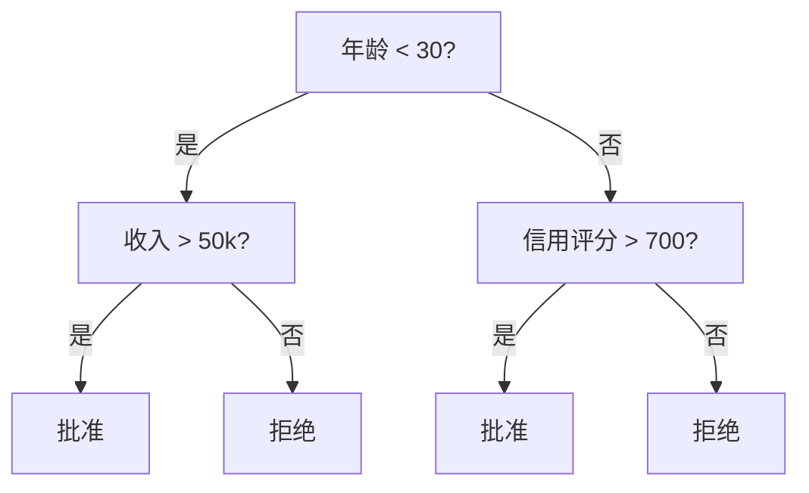
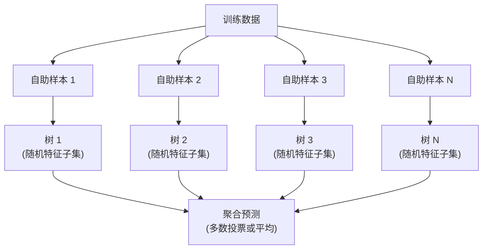

# 决策树与随机森林

> 决策树就是一张流程图。但一片森林却是机器学习中最强大的工具之一。

**类型：** 构建
**语言：** Python
**前置知识：** 阶段 1（第 09 课 信息论，第 06 课 概率）
**时间：** 约 90 分钟

## 学习目标

- 实现基尼不纯度（Gini impurity）、熵（Entropy）和信息增益（Information Gain）计算，以找到最优的决策树分裂点
- 从零构建一个具有预剪枝（pre-pruning）控制（最大深度、最小样本数）的决策树分类器
- 使用自助采样（bootstrap sampling）和特征随机化（feature randomization）构建随机森林（Random Forest），并解释为何它能降低方差
- 比较基于平均不纯度下降（MDI）的特征重要性与置换重要性（Permutation Importance），并识别 MDI 何时有偏

## 问题

你有表格数据。行是样本，列是特征，还有一个你想要预测的目标列。你可以用神经网络来处理它。但对于表格数据，基于树的模型（决策树、随机森林、梯度提升树）始终优于深度学习。Kaggle 上结构化数据的竞赛由 XGBoost 和 LightGBM 主导，而不是 Transformer。

为什么？树可以处理混合特征类型（数值型和类别型）而无需预处理。它们无需特征工程即可处理非线性关系。它们可解释：你可以查看树并准确了解预测是如何做出的。而随机森林对许多树进行平均，在中型数据集上非常抗过拟合。

本课程使用递归分裂从零构建决策树，然后在此基础上构建随机森林。你将实现分裂准则背后的数学（基尼不纯度、熵、信息增益），并理解为什么弱学习器的集成能成为强学习器。

## 概念

### 决策树的作用

决策树通过提出一系列是/否问题，将特征空间划分为矩形区域。



每个内部节点测试一个特征与一个阈值。每个叶节点做出一个预测。要对新数据点进行分类，从根节点开始，沿着分支直到到达叶节点。

树是通过自上而下的方式构建的：在每个节点，选择最能分离数据的特征和阈值。“最佳”由分裂准则定义。

### 分裂准则：测量不纯度

在每个节点，我们有一组样本。我们希望对其进行分裂，使得生成的子节点尽可能“纯净”，即每个子节点主要包含一个类别。

**基尼不纯度（Gini Impurity）** 测量随机选取的样本根据该节点的类别分布进行标记时被误分类的概率。

```
Gini(S) = 1 - Σ(p_k²)

其中 p_k 是类别 k 在集合 S 中的比例。
```

对于纯节点（全部一个类别），Gini = 0。对于 50/50 的二分类分裂，Gini = 0.5。越低越好。

```
示例：6只猫，4只狗

Gini = 1 - (0.6² + 0.4²) = 1 - (0.36 + 0.16) = 0.48
```

**熵（Entropy）** 测量节点中的信息含量（无序度）。在阶段 1 第 09 课中已介绍。

```
熵(S) = -Σ(p_k * log₂(p_k))
```

对于纯节点，熵 = 0。对于 50/50 的二分类分裂，熵 = 1.0。越低越好。

```
示例：6只猫，4只狗

熵 = -(0.6 * log₂(0.6) + 0.4 * log₂(0.4))
    = -(0.6 * -0.737 + 0.4 * -1.322)
    = 0.442 + 0.529
    = 0.971 位
```

**信息增益（Information Gain）** 是分裂后不纯度（熵或基尼）的减少量。

```
IG(S, 特征, 阈值) = 不纯度(S) - 加权平均(不纯度(S左), 不纯度(S右))

其中权重是每个子节点中样本的比例。
```

每个节点处的贪心算法：尝试每个特征和每个可能的阈值。选择最大化信息增益的（特征，阈值）对。

### 分裂是如何进行的

对于当前节点，数据集有 n 个特征和 m 个样本：

1. 对于每个特征 j（j = 1 到 n）：
   - 按特征 j 对样本排序
   - 尝试每个连续不同值之间的中点作为阈值
   - 计算每个阈值的信息增益
2. 选择信息增益最高的特征和阈值
3. 将数据分成左（特征 <= 阈值）和右（特征 > 阈值）
4. 在每个子节点上递归

这种贪心方法不能保证全局最优树。找到最优树是 NP 难的。但贪心分裂在实践中效果很好。

### 停止条件

如果没有停止条件，树会一直生长直到每个叶节点都是纯的（每个叶节点一个样本）。这完美地记住了训练数据，但泛化能力极差。

**预剪枝（Pre-pruning）** 在树完全生长之前停止：
- 最大深度：当树达到设定深度时停止分裂
- 每个叶节点的最小样本数：如果节点样本数少于 k 则停止
- 最小信息增益：如果最佳分裂改善的不纯度小于阈值则停止
- 最大叶节点数：限制叶节点的总数

**后剪枝（Post-pruning）** 先生长出完整的树，然后再进行修剪：
- 代价复杂度剪枝（scikit-learn 使用）：添加一个与叶节点数量成比例的惩罚项。增加惩罚获得更小的树
- 降低错误剪枝：如果移除子树后验证误差没有增加，则移除

预剪枝更简单、更快。后剪枝通常会产生更好的树，因为它不会过早终止可能导向有用进一步分裂的分裂。

### 回归决策树

对于回归，叶节点的预测是该叶节点目标值的平均值。分裂准则也随之改变：

**方差缩减（Variance Reduction）** 取代了信息增益：

```
VR(S, 特征, 阈值) = Var(S) - 加权平均(Var(S左), Var(S右))
```

选择能最大程度减少方差的分裂。树将输入空间划分为区域，并在每个区域中预测一个常数（均值）。

### 随机森林：集成的力量

单个决策树方差高。数据中的微小变化可能导致完全不同的树。随机森林通过对许多树进行平均来解决这个问题。



两种随机性来源使树变得多样化：

**装袋（Bagging，Bootstrap Aggregating）：** 每棵树都在一个自助样本（Bootstrap Sample）上训练，即从训练数据中有放回地随机抽样。大约 63% 的原始样本出现在每个自助样本中（其余的是袋外（Out-of-Bag）样本，可用于验证）。

**特征随机化：** 在每个分裂处，只考虑一个随机特征子集。对于分类，默认值是 sqrt(n_features)。对于回归，n_features/3。这可以防止所有树都在同一个主导特征上分裂。

关键洞察：对许多去相关的树进行平均可以降低方差而不会增加偏差。每棵树可能表现平平。但集成体很强大。

### 特征重要性

随机森林自然提供了特征重要性分数。最常见的方法：

**平均不纯度下降（MDI，Mean Decrease in Impurity）：** 对于每个特征，在所有树和所有使用该特征的节点上，累加不纯度的总减少量。产生更大不纯度减少的特征在更早的分裂中更重要。

```
重要性(特征j) = 所有使用特征j的节点上累加：
    (节点样本数 / 总样本数) * 不纯度减少量
```

这种方法很快（在训练期间计算），但对高基数特征和具有许多可能分裂点的特征有偏。

**置换重要性（Permutation Importance）** 是替代方案：打乱一个特征的值，并测量模型准确率下降了多少。更可靠但更慢。

### 树何时优于神经网络

树和森林在表格数据上优于神经网络。几个原因：

| 因素 | 树 | 神经网络 |
|--------|-------|----------------|
| 混合类型（数值+类别） | 原生支持 | 需要编码 |
| 小数据集（< 10k 行） | 工作良好 | 容易过拟合 |
| 特征交互 | 通过分裂自动发现 | 需要架构设计 |
| 可解释性 | 完全透明 | 黑箱 |
| 训练时间 | 分钟级 | 小时级 |
| 超参数敏感性 | 低 | 高 |

当数据具有空间或序列结构（图像、文本、音频）时，神经网络胜出。对于扁平的特征表，树是默认选择。

## 动手构建

### 第 1 步：基尼不纯度与熵

从零构建这两种分裂准则，并验证它们在哪些分裂是好的上达成一致。

```python
import math

def gini_impurity(labels):
    """计算标签列表的基尼不纯度。"""
    n = len(labels)
    if n == 0:
        return 0.0
    counts = {}
    for label in labels:
        counts[label] = counts.get(label, 0) + 1
    return 1.0 - sum((c / n) ** 2 for c in counts.values())

def entropy(labels):
    """计算标签列表的熵。"""
    n = len(labels)
    if n == 0:
        return 0.0
    counts = {}
    for label in labels:
        counts[label] = counts.get(label, 0) + 1
    return -sum(
        (c / n) * math.log2(c / n) for c in counts.values() if c > 0
    )
```

### 第 2 步：找到最佳分裂

尝试每个特征和每个阈值。返回信息增益最高的那个。

```python
def information_gain(parent_labels, left_labels, right_labels, criterion="gini"):
    """计算给定父节点和子节点标签的信息增益。"""
    measure = gini_impurity if criterion == "gini" else entropy
    n = len(parent_labels)
    n_left = len(left_labels)
    n_right = len(right_labels)
    if n_left == 0 or n_right == 0:
        return 0.0
    parent_impurity = measure(parent_labels)
    child_impurity = (
        (n_left / n) * measure(left_labels) +
        (n_right / n) * measure(right_labels)
    )
    return parent_impurity - child_impurity
```

### 第 3 步：构建 DecisionTree 类

递归分裂、预测和特征重要性追踪。

```python
class DecisionTree:
    def __init__(self, max_depth=None, min_samples_split=2,
                 min_samples_leaf=1, criterion="gini",
                 max_features=None):
        self.max_depth = max_depth
        self.min_samples_split = min_samples_split
        self.min_samples_leaf = min_samples_leaf
        self.criterion = criterion
        self.max_features = max_features
        self.tree = None
        self.feature_importances_ = None

    def fit(self, X, y):
        self.n_features = len(X[0])
        self.feature_importances_ = [0.0] * self.n_features
        self.n_samples = len(X)
        self.tree = self._build(X, y, depth=0)
        total = sum(self.feature_importances_)
        if total > 0:
            self.feature_importances_ = [
                fi / total for fi in self.feature_importances_
            ]

    def predict(self, X):
        return [self._predict_one(x, self.tree) for x in X]
```

### 第 4 步：构建 RandomForest 类

自助采样、特征随机化和多数投票。

```python
class RandomForest:
    def __init__(self, n_trees=100, max_depth=None,
                 min_samples_split=2, max_features="sqrt",
                 criterion="gini"):
        self.n_trees = n_trees
        self.max_depth = max_depth
        self.min_samples_split = min_samples_split
        self.max_features = max_features
        self.criterion = criterion
        self.trees = []

    def fit(self, X, y):
        n = len(X)
        for _ in range(self.n_trees):
            indices = [random.randint(0, n - 1) for _ in range(n)]
            X_boot = [X[i] for i in indices]
            y_boot = [y[i] for i in indices]
            tree = DecisionTree(
                max_depth=self.max_depth,
                min_samples_split=self.min_samples_split,
                max_features=self.max_features,
                criterion=self.criterion,
            )
            tree.fit(X_boot, y_boot)
            self.trees.append(tree)

    def predict(self, X):
        all_preds = [tree.predict(X) for tree in self.trees]
        predictions = []
        for i in range(len(X)):
            votes = {}
            for preds in all_preds:
                v = preds[i]
                votes[v] = votes.get(v, 0) + 1
            predictions.append(max(votes, key=votes.get))
        return predictions
```

完整实现及所有辅助方法请参见 `code/trees.py`。

## 使用它

使用 scikit-learn，训练一个随机森林只需三行：

```python
from sklearn.ensemble import RandomForestClassifier
from sklearn.datasets import load_iris
from sklearn.model_selection import train_test_split

X, y = load_iris(return_X_y=True)
X_train, X_test, y_train, y_test = train_test_split(X, y, random_state=42)

rf = RandomForestClassifier(n_estimators=100, random_state=42)
rf.fit(X_train, y_train)
print(f"Accuracy: {rf.score(X_test, y_test):.4f}")
print(f"Feature importances: {rf.feature_importances_}")
```

在实践中，梯度提升树（XGBoost、LightGBM、CatBoost）通常比随机森林更强，因为它们顺序构建树，每棵树纠正前一棵树的错误。但随机森林更难配错，且几乎不需要超参数调优。

## 交付成果

本课程生成 `outputs/prompt-tree-interpreter.md` —— 一个为业务干部分解决策树分裂的提示词。将训练好的树结构（深度、特征、分裂阈值、准确率）输入其中，它就会将模型转换为通俗易懂的规则，对特征重要性进行排序，标记过拟合或数据泄露，并推荐后续步骤。当你需要向不读代码的人解释基于树的模型时，随时可以使用。

## 练习

1. 在具有 3 个类别的 2D 数据集上训练一个单棵决策树。手动追踪分裂并绘制矩形决策边界。比较 max_depth=2 与 max_depth=10 时的边界。

2. 为回归树实现方差缩减分裂。生成 y = sin(x) + 噪声，共 200 个点，并拟合你的回归树。绘制树的分段常数预测与真实曲线的对比。

3. 构建一个随机森林，树的数量分别为 1、5、10、50、200。绘制训练准确率和测试准确率与树数量的关系图。观察测试准确率趋于平稳但不会下降（森林抵抗过拟合）。

4. 在 5 个不同数据集上比较基尼不纯度与熵作为分裂准则。测量准确率和树的深度。在大多数情况下，它们产生几乎相同的结果。解释原因。

5. 实现置换重要性。将其与基于 MDI 的重要性进行比较，使用一个数据集，其中一个特征是随机噪声但具有高基数。MDI 会将噪声特征排名很高。置换重要性则不会。

## 关键术语

| 术语 | 人们怎么说 | 实际含义 |
|------|----------------|----------------------|
| 决策树（Decision Tree） | “用于预测的流程图” | 通过学习一系列 if/else 分裂，将特征空间划分为矩形区域的模型 |
| 基尼不纯度（Gini Impurity） | “节点有多混杂” | 在节点处随机样本被误分类的概率。0 = 纯，0.5 = 二分类最大不纯度 |
| 熵（Entropy） | “节点中的无序度” | 节点处的信息含量。0 = 纯，1.0 = 二分类最大不确定性。源自信息论 |
| 信息增益（Information Gain） | “分裂有多好” | 分裂后不纯度的减少量。选择分裂的贪心准则 |
| 预剪枝（Pre-pruning） | “