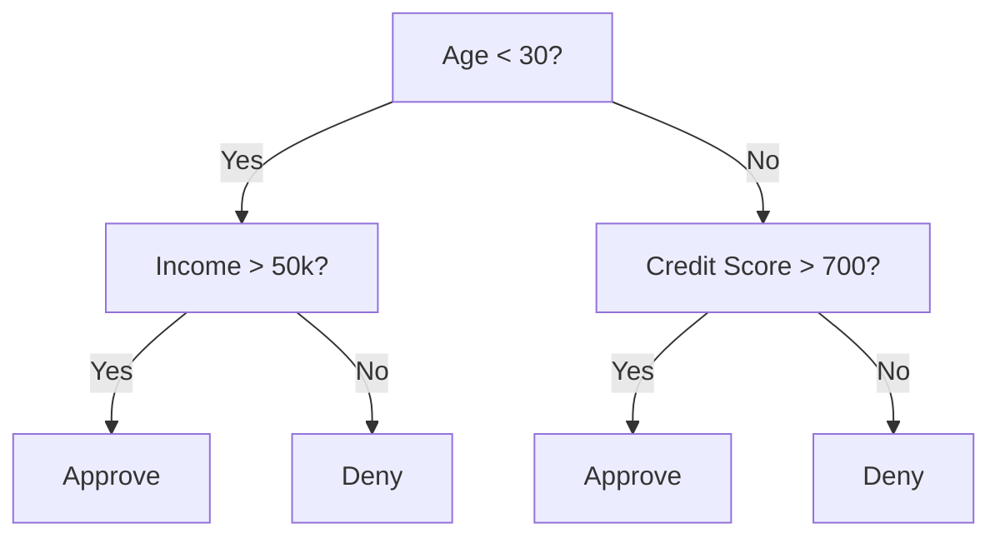
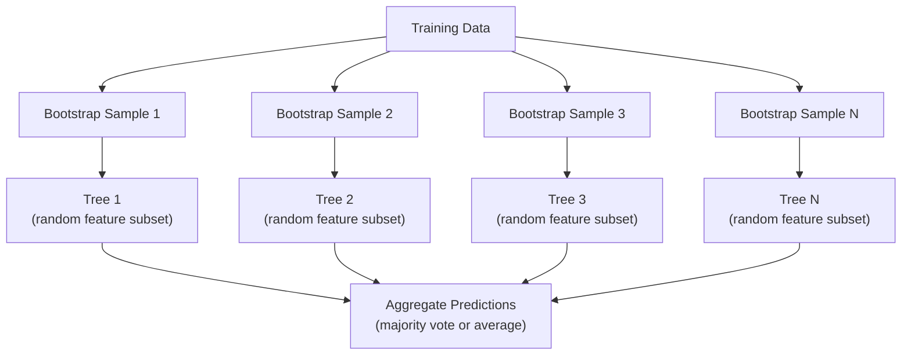

# 决策树和随机森林

> 决策树只是一个流程图。但它们的森林是ML中最强大的工具之一。

** 类型：** 构建
** 语言：** Python
** 先决条件：** 第1阶段（课程09信息理论，06概率）
** 时间：** ~90分钟

## 学习目标

- 实施基尼不纯性、熵和信息收益计算以找到最佳决策树拆分
- 使用预修剪控制（最大深度、最小样本）从头开始构建决策树分类器
- 使用自举抽样和特征随机化构建随机森林，并解释为什么它会减少方差
- 比较MDI特征重要性与排列重要性并确定MDI何时存在偏差

## 问题

您有表格数据。收件箱是样本，列是特征，并且存在您想要预测的目标列。你可以向它扔一个神经网络。但对于表格数据，基于树的模型（决策树、随机森林、梯度增强树）始终优于深度学习。Kaggle结构化数据竞赛由XGboost和LightGBM主导，而不是Transformers。

为什么？树无需预处理即可处理混合特征类型（数字和分类）。它们在无需特征工程的情况下处理非线性关系。它们是可以解释的：您可以查看树并确切地了解做出预测的原因。随机森林（平均有许多树木）对中等规模的数据集的过度适应能力很强。

本课使用回归拆分从头开始构建决策树，然后在上面构建随机森林。您将实现分裂标准（基尼不纯性、信息收益）背后的数学计算，并了解为什么一群弱学习者变成了一群强学习者。

## 概念

### 决策树的作用

决策树通过提出一系列是/否问题将特征空间划分为矩形区域。



每个内部节点根据阈值测试功能。每个叶节点都会做出预测。要对新数据点进行分类，您可以从根开始，沿着树枝前进，直到到达叶子。

该树是通过在每个节点选择最能分离数据的特征和阈值来自上而下构建的。“最佳”由分裂标准定义。

### 拆分标准：测量杂质

在每个节点上，我们都有一组样本。我们希望将它们拆分，以便生成的子节点尽可能“纯”，这意味着每个子节点主要包含一个类。

** 基尼杂质 ** 衡量随机选择的样本如果根据该节点的类别分布进行标记，则被错误分类的可能性。

```
Gini(S) = 1 - sum(p_k^2)

where p_k is the proportion of class k in set S.
```

对于纯节点（所有一个类），基尼= 0。对于50/50类的二进制拆分，基尼= 0.5。低越好。

```
Example: 6 cats, 4 dogs

Gini = 1 - (0.6^2 + 0.4^2) = 1 - (0.36 + 0.16) = 0.48
```

**Entropy** 衡量节点中的信息内容（无序）。涵盖在第1阶段第09课中。

```
Entropy(S) = -sum(p_k * log2(p_k))
```

对于纯节点，熵= 0。对于50/50的二进制分裂，熵= 1.0。低越好。

```
Example: 6 cats, 4 dogs

Entropy = -(0.6 * log2(0.6) + 0.4 * log2(0.4))
        = -(0.6 * -0.737 + 0.4 * -1.322)
        = 0.442 + 0.529
        = 0.971 bits
```

** 信息收益 ** 是分裂后不纯（熵或基尼）的减少。

```
IG(S, feature, threshold) = Impurity(S) - weighted_avg(Impurity(S_left), Impurity(S_right))

where the weights are the proportions of samples in each child.
```

每个节点的贪婪算法：尝试每个特征和每个可能的阈值。选择最大化信息收益的（特征、阈值）对。

### 拆分是如何运作的

对于当前节点处具有n个要素和m个样本的数据集：

1. 对于每个特征j（j = 1到n）：
   - 按特征j对样本进行排序
   - 尝试将连续不同值之间的每个中点作为阈值
   - 计算每个阈值的信息收益
2. 选择具有最高信息增益的特征和阈值
3. 将数据拆分为左（特征<=阈值）和右（特征>阈值）
4. 对每个孩子进行循环

这种贪婪的方法并不能保证全局最优的树。找到最佳树是NP困难的。但贪婪分割在实践中效果很好。

### 停止条件

在不停止条件的情况下，树会生长，直到每片叶子都是纯的（每片叶子一个样本）。这完美地记住了训练数据，并且概括性很强。

** 预修剪 ** 在树木完全生长之前停止：
- 最大深度：当树木达到设定深度时停止分裂
- 每个叶的最小样本：如果节点的样本少于k个，则停止
- 最小信息收益：如果最佳分离将杂质改善的幅度低于阈值，则停止
- 最大叶节点：限制叶的总数

** 修剪后 ** 生长完整的树，然后将其修剪回来：
- 成本复杂度修剪（scikit-learn使用）：增加与叶子数量成比例的惩罚。增加惩罚以获得更小的树
- 减少错误修剪：如果验证错误没有增加，则删除子树

预修剪更简单、更快。后修剪通常会产生更好的树，因为它不会过早地停止可能导致有用的进一步分裂的分裂。

### 回归决策树

对于回归，叶预测是该叶中目标值的平均值。拆分标准也发生了变化：

** 方差减少 ** 取代信息收益：

```
VR(S, feature, threshold) = Var(S) - weighted_avg(Var(S_left), Var(S_right))
```

选择最能减少方差的分割。该树将输入空间划分为区域，并预测每个区域中的一个常数（平均值）。

### 随机森林：合奏的力量

单个决策树的方差很高。数据中的微小变化可能会产生完全不同的树。随机森林通过平均许多树木来解决这个问题。



随机性的两个来源使树木变得多样化：

**Bagging（Bootstrap聚合）：** 每棵树都在Bootstrap样本上训练，这是一个随机样本，带有训练数据的替换。大约63%的原始样本出现在每个引导程序中（其余是可用于验证的袋外样本）。

** 特征随机化：** 每次拆分时，仅考虑特征的随机子集。对于分类，默认值为SQRT（n_features）。对于回归，n_features/3。这可以防止所有树木在同一个主要特征上分裂。

关键见解：对许多去相关树求平均值可以在不增加偏差的情况下减少方差。每棵树都可能很平庸。整体很强。

### 特征重要性

随机森林自然地提供特征重要性分数。最常见的方法：

** 平均杂质减少量（MDI）：** 对于每个特征，将所有树和使用该特征的所有节点的杂质总减少量相加。在早期分裂时产生更大杂质减少的特征更为重要。

```
importance(feature_j) = sum over all nodes where feature_j is used:
    (n_samples_at_node / n_total_samples) * impurity_decrease
```

这很快（在训练期间计算），但偏向于高基数特征和具有许多可能分裂点的特征。

** 排列重要性 ** 是替代方案：洗牌一个特征的值并测量模型的准确性下降了多少。更可靠但速度较慢。

### 当树击败神经网络

树木和森林在表格数据上主导神经网络。几个原因：

| 因子 | 树木 | 神经网络 |
|--------|-------|----------------|
| 混合类型（数字+分类） | 本机支持 | 需要编码 |
| 小型数据集（<10 k行） | 很好地工作 | 过拟合 |
| 特征交互 | 通过拆分找到 | 需要架构设计 |
| 解释性 | 完全透明 | 黑匣子 |
| 训练时间 | 分钟 | 小时 |
| 超参数敏感性 | 低 | 高 |

当数据具有空间或序列结构（图像，文本，音频）时，神经网络获胜。对于要素的平面表格，树是默认设置。

## 建设党

### 第1步：基尼不纯性和熵

从头开始构建两个拆分标准，并验证他们同意哪些拆分是好的。

```python
import math

def gini_impurity(labels):
    n = len(labels)
    if n == 0:
        return 0.0
    counts = {}
    for label in labels:
        counts[label] = counts.get(label, 0) + 1
    return 1.0 - sum((c / n) ** 2 for c in counts.values())

def entropy(labels):
    n = len(labels)
    if n == 0:
        return 0.0
    counts = {}
    for label in labels:
        counts[label] = counts.get(label, 0) + 1
    return -sum(
        (c / n) * math.log2(c / n) for c in counts.values() if c > 0
    )
```

### 第2步：找到最佳分割

尝试每个功能和每个阈值。返回信息收益最高的那个。

```python
def information_gain(parent_labels, left_labels, right_labels, criterion="gini"):
    measure = gini_impurity if criterion == "gini" else entropy
    n = len(parent_labels)
    n_left = len(left_labels)
    n_right = len(right_labels)
    if n_left == 0 or n_right == 0:
        return 0.0
    parent_impurity = measure(parent_labels)
    child_impurity = (
        (n_left / n) * measure(left_labels) +
        (n_right / n) * measure(right_labels)
    )
    return parent_impurity - child_impurity
```

### 第3步：构建DecisionTree类

递进拆分、预测和特征重要性跟踪。

```python
class DecisionTree:
    def __init__(self, max_depth=None, min_samples_split=2,
                 min_samples_leaf=1, criterion="gini",
                 max_features=None):
        self.max_depth = max_depth
        self.min_samples_split = min_samples_split
        self.min_samples_leaf = min_samples_leaf
        self.criterion = criterion
        self.max_features = max_features
        self.tree = None
        self.feature_importances_ = None

    def fit(self, X, y):
        self.n_features = len(X[0])
        self.feature_importances_ = [0.0] * self.n_features
        self.n_samples = len(X)
        self.tree = self._build(X, y, depth=0)
        total = sum(self.feature_importances_)
        if total > 0:
            self.feature_importances_ = [
                fi / total for fi in self.feature_importances_
            ]

    def predict(self, X):
        return [self._predict_one(x, self.tree) for x in X]
```

### 第4步：构建RandomForest类

Bootstrap抽样、特征随机化和多数投票。

```python
class RandomForest:
    def __init__(self, n_trees=100, max_depth=None,
                 min_samples_split=2, max_features="sqrt",
                 criterion="gini"):
        self.n_trees = n_trees
        self.max_depth = max_depth
        self.min_samples_split = min_samples_split
        self.max_features = max_features
        self.criterion = criterion
        self.trees = []

    def fit(self, X, y):
        n = len(X)
        for _ in range(self.n_trees):
            indices = [random.randint(0, n - 1) for _ in range(n)]
            X_boot = [X[i] for i in indices]
            y_boot = [y[i] for i in indices]
            tree = DecisionTree(
                max_depth=self.max_depth,
                min_samples_split=self.min_samples_split,
                max_features=self.max_features,
                criterion=self.criterion,
            )
            tree.fit(X_boot, y_boot)
            self.trees.append(tree)

    def predict(self, X):
        all_preds = [tree.predict(X) for tree in self.trees]
        predictions = []
        for i in range(len(X)):
            votes = {}
            for preds in all_preds:
                v = preds[i]
                votes[v] = votes.get(v, 0) + 1
            predictions.append(max(votes, key=votes.get))
        return predictions
```

有关所有帮助器方法的完整实现，请参阅“code/trees.py”。

## 使用它

使用scikit-learn，训练随机森林分为三行：

```python
from sklearn.ensemble import RandomForestClassifier
from sklearn.datasets import load_iris
from sklearn.model_selection import train_test_split

X, y = load_iris(return_X_y=True)
X_train, X_test, y_train, y_test = train_test_split(X, y, random_state=42)

rf = RandomForestClassifier(n_estimators=100, random_state=42)
rf.fit(X_train, y_train)
print(f"Accuracy: {rf.score(X_test, y_test):.4f}")
print(f"Feature importances: {rf.feature_importances_}")
```

在实践中，梯度增强树（XGBoost、LightGBM、CatBoost）通常比随机森林更强大，因为它们顺序构建树，每棵树都会纠正前一棵树的错误。但随机森林更难错误配置，并且几乎不需要超参数调整。

## 把它运

本课将生成“oututs/prompt-tree-interpreter.md”--一个为业务利益相关者解释决策树拆分的提示。向它提供经过训练的树的结构（深度、特征、分裂阈值、准确性），它会将模型转换为简单语言规则，对特征重要性进行排名，标记过度匹配或泄漏，并建议下一步步骤。当您需要向不阅读代码的人解释基于树的模型时，请随时使用它。

## 演习

1. 在具有3个类的2D数据集上训练单个决策树。手动跟踪拆分并绘制矩形决策边界。比较max_depth=2与max_depth=10的边界。

2. 为回归树实现方差缩减拆分。生成200个点的y = sin（x）+ noise并适合您的回归树。根据真实曲线绘制树的分段恒定预测。

3. 用1、5、10、50和200棵树构建随机森林。绘制训练准确性和测试准确性与树数量的关系。观察测试准确性趋于平稳，但不会下降（森林抵制过度逼近）。

4. 在5个不同数据集上比较基尼不纯性与作为分裂标准的信息。测量准确性和树木深度。在大多数情况下，它们会产生几乎相同的结果。解释为什么。

5. 实现排列重要性。将其与其中一个特征是随机噪音但具有高基数的数据集上的EDI重要性进行比较。MDI将对噪音功能进行很高的排名。排列的重要性不会。

## 关键术语

| Term | 别人怎么说 | 它实际上意味着什么 |
|------|----------------|----------------------|
| 决策树 | “预测流程图” | 通过学习if/else分裂序列将特征空间划分为矩形区域的模型 |
| 基尼不纯度 | “节点有多混合” | 在节点处错误分类随机样本的可能性。0 =纯，0.5 =二元化合物的最大杂质 |
| 熵 | “节点中的混乱” | 节点上的信息内容。0 =纯，1.0 =二进制的最大不确定度。来自信息论 |
| 信息增益 | “劈叉多好” | 分裂后杂质减少。选择分裂的贪婪标准 |
| 预剪枝 | “早点把树停下来” | 通过设置最大深度、最小样本或最小收益阈值来提前停止树木生长 |
| 后剪枝 | “之后修剪树” | 生长完整树，然后删除无法提高验证性能的子树 |
| 套袋 | “在随机子集上训练” | Bootstrap聚合。在不同的随机样本上训练每个模型并进行替换 |
| 随机森林 | “一堆树” | 决策树集合，每棵都在引导样本上训练，每次分裂时都有随机特征子集 |
| 特征重要性（MDI） | “哪些功能很重要” | 每个特征贡献的总杂质减少量，在所有树和节点上求和 |
| 排列重要性 | “洗牌并检查” | 当要素的值被随机洗牌时，准确性会下降。对于噪音功能来说比MDI更可靠 |
| 方差减少 | “信息收益的回归版本” | 信息获得的回归树模拟。选择最能减少目标方差的分割 |
| Bootstrap样本 | “重复的随机样本” | 从原始数据集中提取并替换的随机样本。大小相同，但有重复项 |

## 进一步阅读

- [Breiman：随机森林（2001）]（https：//link.springer.com/article/10.1023/A：1010933404324）-原始的随机森林论文
- [Grinsztajn等人：为什么基于树的模型在表格数据上仍然优于深度学习？（2022）]（https：//arxiv.org/ab/2207.08815）-表格任务中树与神经网络的严格比较
- [scikit-learn决策树文档]（https：//scikit-learn.org/stable/modules/tree. html）-含可视化工具的实用指南
- [XGboost：可扩展的树增强系统（Chen & Guestrin，2016）]（https：//arxiv.org/ab/1603.02754）-主导Kaggle的梯度增强论文
