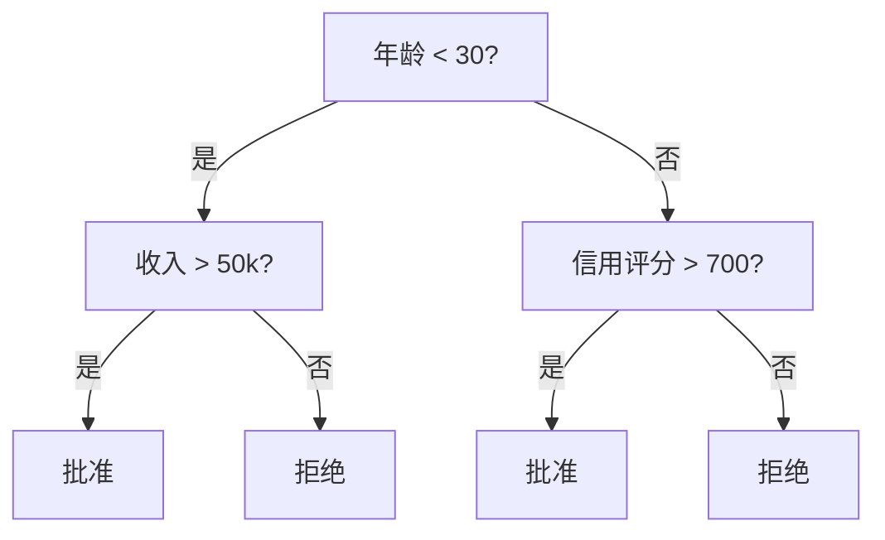
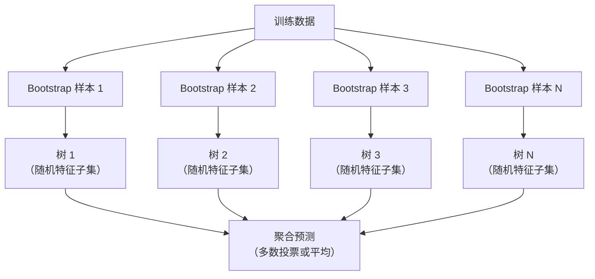

# 决策树与随机森林

> 决策树只是一个流程图。但一片森林是 ML 中最强大的工具之一。

**类型：** 构建
**语言：** Python
**前置要求：** 第一阶段（第9课 信息论、第6课 概率论）
**时间：** ~90分钟

## 学习目标

- 实现基尼不纯度（Gini impurity）、熵（entropy）和信息增益（information gain）的计算，以找到最优决策树分割
- 从头构建带预剪枝控制（最大深度、最小样本数）的决策树分类器
- 使用 bootstrap 采样和特征随机化构建随机森林，并解释它为何能降低方差
- 比较 MDI 特征重要性与排列重要性（permutation importance），并识别 MDI 何时存在偏差

## 问题

你有表格数据。行是样本，列是特征，还有一个你想预测的目标列。你可以用神经网络来处理。但对于表格数据，基于树的模型（决策树、随机森林、梯度提升树）持续优于深度学习。Kaggle 在结构化数据上的比赛由 XGBoost 和 LightGBM 主导，而非 transformer。

为什么？树可以处理混合特征类型（数值和类别）而无需预处理。它们无需特征工程就能处理非线性关系。它们是可解释的：你可以查看树并准确了解为什么做出某个预测。而随机森林（对许多树求平均）在中等规模数据集上具有很强的抗过拟合能力。

本课程通过递归分割从头构建决策树，然后在此基础上构建随机森林。你将实现分裂标准背后的数学（基尼不纯度、熵、信息增益），并理解为什么弱学习器的集成能成为强学习器。

## 概念

### 决策树的作用

决策树通过提出一系列是/否问题，将特征空间划分为矩形区域。


```mermaid
graph TD
    A["年龄 < 30?"] -->|是| B["收入 > 50k?"]
    A -->|否| C["信用评分 > 700?"]
    B -->|是| D["批准"]
    B -->|否| E["拒绝"]
    C -->|是| F["批准"]
    C -->|否| G["拒绝"]
```

每个内部节点测试一个特征与一个阈值的关系。每个叶节点做出一个预测。要对新数据点进行分类，你从根节点开始，沿着分支直到到达叶节点。

树是自顶向下构建的，在每个节点选择最能分离数据的特征和阈值。"最佳"由分裂标准定义。

### 分裂标准：衡量不纯度

在每个节点，我们有一组样本。我们想分割它们，使得产生的子节点尽可能"纯净"，即每个子节点主要包含一个类别。

**基尼不纯度（Gini impurity）** 衡量如果一个随机样本按照该节点的类别分布进行标记时，被错误分类的概率。

```
Gini(S) = 1 - sum(p_k^2)

其中 p_k 是集合 S 中类别 k 的比例。
```

对于纯节点（全部一个类别），Gini = 0。对于 50/50 的二分类分裂，Gini = 0.5。越低越好。

```
示例：6只猫，4只狗

Gini = 1 - (0.6^2 + 0.4^2) = 1 - (0.36 + 0.16) = 0.48
```

**熵（Entropy）** 衡量节点中的信息含量（无序度）。在第一阶段第9课中已介绍。

```
Entropy(S) = -sum(p_k * log2(p_k))
```

对于纯节点，entropy = 0。对于 50/50 的二分类分裂，entropy = 1.0。越低越好。

```
示例：6只猫，4只狗

Entropy = -(0.6 * log2(0.6) + 0.4 * log2(0.4))
        = -(0.6 * -0.737 + 0.4 * -1.322)
        = 0.442 + 0.529
        = 0.971 比特
```

**信息增益（Information gain）** 是分裂后不纯度（熵或基尼）的减少量。

```
IG(S, feature, threshold) = Impurity(S) - 加权平均(Impurity(S_left), Impurity(S_right))

其中权重是每个子节点中样本的比例。
```

在每个节点的贪心算法：尝试每个特征和每个可能的阈值。选择使信息增益最大化的（特征，阈值）对。

### 分裂如何工作

对于当前节点处有 n 个特征和 m 个样本的数据集：

1. 对每个特征 j（j = 1 到 n）：
   - 按特征 j 对样本排序
   - 尝试连续不同值之间的每个中点作为阈值
   - 计算每个阈值的信息增益
2. 选择信息增益最高的特征和阈值
3. 将数据分割为左侧（feature <= threshold）和右侧（feature > threshold）
4. 在每个子节点上递归

这种贪心方法不能保证全局最优树。找到最优树是 NP 难的。但贪心分裂在实践中效果很好。

### 停止条件

没有停止条件，树会一直生长直到每个叶节点都是纯的（每个叶节点一个样本）。这会完美记住训练数据并导致极差的泛化能力。

**预剪枝（Pre-pruning）** 在树完全生长之前停止：
- 最大深度：当树达到设定深度时停止分裂
- 每个叶节点的最少样本数：如果节点样本少于 k 个则停止
- 最小信息增益：如果最佳分裂使不纯度改善小于阈值则停止
- 最大叶节点数：限制叶节点的总数

**后剪枝（Post-pruning）** 先生长完整树，然后修剪回来：
- 代价复杂度剪枝（scikit-learn 使用）：添加与叶节点数量成比例的惩罚项。增加惩罚以得到更小的树
- 减少误差剪枝：如果验证误差没有增加，则移除一个子树

预剪枝更简单、更快。后剪枝通常产生更好的树，因为它不会过早停止那些可能引向有用后续分裂的分裂。

### 回归决策树

对于回归，叶节点的预测是该叶节点中目标值的均值。分裂标准也有所变化：

**方差减少（Variance reduction）** 取代了信息增益：

```
VR(S, feature, threshold) = Var(S) - 加权平均(Var(S_left), Var(S_right))
```

选择使方差减少最多的分裂。树将输入空间划分为区域，并在每个区域预测一个常数（均值）。

### 随机森林：集成的力量

单个决策树方差很高。数据的小变化可能产生完全不同的树。随机森林通过对许多树求平均来修复这个问题。


```mermaid
graph TD
    D["训练数据"] --> B1["Bootstrap 样本 1"]
    D --> B2["Bootstrap 样本 2"]
    D --> B3["Bootstrap 样本 3"]
    D --> BN["Bootstrap 样本 N"]
    B1 --> T1["树 1<br>（随机特征子集）"]
    B2 --> T2["树 2<br>（随机特征子集）"]
    B3 --> T3["树 3<br>（随机特征子集）"]
    BN --> TN["树 N<br>（随机特征子集）"]
    T1 --> V["聚合预测<br>（多数投票或平均）"]
    T2 --> V
    T3 --> V
    TN --> V
```

两种随机源使树变得多样化：

**Bagging（Bootstrap 聚合）：** 每棵树在 bootstrap 样本上训练，即从训练数据中有放回地随机抽样。每个 bootstrap 中包含约 63% 的原始样本（其余是袋外样本，可用于验证）。

**特征随机化：** 在每个分裂点，只考虑一个随机特征子集。对于分类，默认是 sqrt(n_features)。对于回归，是 n_features/3。这防止了所有树在同一个主导特征上分裂。

关键洞察：对许多去相关的树求平均，可以在不增加偏差的情况下减少方差。每棵单独的树可能平庸。集成却很强大。

### 特征重要性

随机森林自然提供特征重要性分数。最常用的方法：

**MDI（Mean Decrease in Impurity）：** 对每个特征，求和该特征在所有树和所有节点中贡献的不纯度减少总量。在更早分裂中产生更大不纯度减少的特征更重要。

```
importance(特征_j) = 对所有使用特征_j 的节点求和：
    (节点样本数 / 总样本数) * 不纯度减少量
```

这很快（在训练期间计算），但偏向于高基数特征和具有许多可能分裂点的特征。

**排列重要性（Permutation importance）** 是替代方案：打乱一个特征的值，衡量模型准确率下降了多少。更可靠但更慢。

### 树何时击败神经网络

在表格数据上，树和森林优于神经网络。几个原因：

| 因素 | 树 | 神经网络 |
|--------|-------|----------------|
| 混合类型（数值 + 类别） | 原生支持 | 需要编码 |
| 小数据集（< 10k 行） | 效果好 | 过拟合 |
| 特征交互 | 通过分裂发现 | 需要架构设计 |
| 可解释性 | 完全透明 | 黑箱 |
| 训练时间 | 分钟 | 小时 |
| 超参数敏感性 | 低 | 高 |

当数据具有空间或序列结构（图像、文本、音频）时，神经网络胜出。对于平面的特征表，树是默认选择。

```figure
decision-tree-depth
```

## 动手实现

### 第1步：基尼不纯度和熵

从头构建两个分裂标准，并验证它们在判断分裂好坏上一致。

```python
import math

def gini_impurity(labels):
    n = len(labels)
    if n == 0:
        return 0.0
    counts = {}
    for label in labels:
        counts[label] = counts.get(label, 0) + 1
    return 1.0 - sum((c / n) ** 2 for c in counts.values())

def entropy(labels):
    n = len(labels)
    if n == 0:
        return 0.0
    counts = {}
    for label in labels:
        counts[label] = counts.get(label, 0) + 1
    return -sum(
        (c / n) * math.log2(c / n) for c in counts.values() if c > 0
    )
```

### 第2步：找到最佳分裂

尝试每个特征和每个阈值。返回信息增益最高的那个。

```python
def information_gain(parent_labels, left_labels, right_labels, criterion="gini"):
    measure = gini_impurity if criterion == "gini" else entropy
    n = len(parent_labels)
    n_left = len(left_labels)
    n_right = len(right_labels)
    if n_left == 0 or n_right == 0:
        return 0.0
    parent_impurity = measure(parent_labels)
    child_impurity = (
        (n_left / n) * measure(left_labels) +
        (n_right / n) * measure(right_labels)
    )
    return parent_impurity - child_impurity
```

### 第3步：构建 DecisionTree 类

递归分裂、预测和特征重要性跟踪。

```python
class DecisionTree:
    def __init__(self, max_depth=None, min_samples_split=2,
                 min_samples_leaf=1, criterion="gini",
                 max_features=None):
        self.max_depth = max_depth
        self.min_samples_split = min_samples_split
        self.min_samples_leaf = min_samples_leaf
        self.criterion = criterion
        self.max_features = max_features
        self.tree = None
        self.feature_importances_ = None

    def fit(self, X, y):
        self.n_features = len(X[0])
        self.feature_importances_ = [0.0] * self.n_features
        self.n_samples = len(X)
        self.tree = self._build(X, y, depth=0)
        total = sum(self.feature_importances_)
        if total > 0:
            self.feature_importances_ = [
                fi / total for fi in self.feature_importances_
            ]

    def predict(self, X):
        return [self._predict_one(x, self.tree) for x in X]
```

### 第4步：构建 RandomForest 类

Bootstrap 采样、特征随机化和多数投票。

```python
class RandomForest:
    def __init__(self, n_trees=100, max_depth=None,
                 min_samples_split=2, max_features="sqrt",
                 criterion="gini"):
        self.n_trees = n_trees
        self.max_depth = max_depth
        self.min_samples_split = min_samples_split
        self.max_features = max_features
        self.criterion = criterion
        self.trees = []

    def fit(self, X, y):
        n = len(X)
        for _ in range(self.n_trees):
            indices = [random.randint(0, n - 1) for _ in range(n)]
            X_boot = [X[i] for i in indices]
            y_boot = [y[i] for i in indices]
            tree = DecisionTree(
                max_depth=self.max_depth,
                min_samples_split=self.min_samples_split,
                max_features=self.max_features,
                criterion=self.criterion,
            )
            tree.fit(X_boot, y_boot)
            self.trees.append(tree)

    def predict(self, X):
        all_preds = [tree.predict(X) for tree in self.trees]
        predictions = []
        for i in range(len(X)):
            votes = {}
            for preds in all_preds:
                v = preds[i]
                votes[v] = votes.get(v, 0) + 1
            predictions.append(max(votes, key=votes.get))
        return predictions
```

完整实现见 `code/trees.py`，包含所有辅助方法。

## 使用它

使用 scikit-learn，训练随机森林只需三行代码：

```python
from sklearn.ensemble import RandomForestClassifier
from sklearn.datasets import load_iris
from sklearn.model_selection import train_test_split

X, y = load_iris(return_X_y=True)
X_train, X_test, y_train, y_test = train_test_split(X, y, random_state=42)

rf = RandomForestClassifier(n_estimators=100, random_state=42)
rf.fit(X_train, y_train)
print(f"准确率：{rf.score(X_test, y_test):.4f}")
print(f"特征重要性：{rf.feature_importances_}")
```

在实践中，梯度提升树（XGBoost、LightGBM、CatBoost）通常比随机森林更强，因为它们顺序构建树，每棵树纠正前一棵树的错误。但随机森林更难配置错误，且几乎不需要超参数调优。

## 交付使用

本课程产出 `outputs/prompt-tree-interpreter.md` -- 一个向业务利益相关者解释决策树分裂的提示词。给它一棵训练好的树的结构（深度、特征、分裂阈值、准确率），它会将模型翻译为通俗语言规则，对特征重要性进行排序，标记过拟合或数据泄露，并推荐后续步骤。每当你需要向不读代码的人解释基于树的模型时使用它。

## 练习题

1. 在一个3类别的2D数据集上训练一棵决策树。手动跟踪分裂并绘制矩形决策边界。比较 max_depth=2 与 max_depth=10 时的边界。
2. 为回归树实现方差减少分裂。生成 y = sin(x) + 噪声（200个点）并拟合你的回归树。绘制树的分段常数预测与真实曲线的对比。
3. 构建具有1、5、10、50和200棵树的随机森林。绘制训练准确率和测试准确率与树数量的关系图。观察测试准确率趋于平稳但不会下降（森林抵抗过拟合）。
4. 在5个不同数据集上比较基尼不纯度与熵作为分裂标准。测量准确率和树的深度。在大多数情况下，它们产生几乎相同的结果。解释原因。
5. 实现排列重要性。将其与 MDI 重要性在一个包含随机噪声但具有高基数的特征的数据集上进行比较。MDI 会将噪声特征排得很高。排列重要性则不会。

## 关键术语

| 术语 | 人们怎么说 | 实际含义 |
|------|----------------|----------------------|
| 决策树（Decision tree） | "预测的流程图" | 通过学习一系列 if/else 分裂将特征空间划分为矩形区域的模型 |
| 基尼不纯度（Gini impurity） | "节点有多混杂" | 在节点处随机样本被误分类的概率。0 = 纯，0.5 = 二分类最大不纯度 |
| 熵（Entropy） | "节点中的无序度" | 节点中的信息含量。0 = 纯，1.0 = 二分类最大不确定性。来自信息论 |
| 信息增益（Information gain） | "分裂有多好" | 分裂后不纯度的减少量。选择分裂的贪心标准 |
| 预剪枝（Pre-pruning） | "早点停止树" | 通过设置最大深度、最小样本数或最小增益阈值来提前停止树生长 |
| 后剪枝（Post-pruning） | "之后修剪树" | 生长完整树，然后移除不能提高验证性能的子树 |
| Bagging | "在随机子集上训练" | Bootstrap 聚合。在每个不同的有放回随机样本上训练每个模型 |
| 随机森林（Random forest） | "一堆树" | 决策树的集成，每棵树在 bootstrap 样本上训练，每个分裂点使用随机特征子集 |
| 特征重要性 MDI | "哪些特征重要" | 每个特征贡献的总不纯度减少，跨所有树和节点求和 |
| 排列重要性（Permutation importance） | "打乱并检查" | 当特征值被随机打乱时准确率的下降。对噪声特征比 MDI 更可靠 |
| 方差减少（Variance reduction） | "回归版信息增益" | 信息增益的回归树类比。选择使目标方差减少最多的分裂 |
| Bootstrap 样本 | "有重复的随机样本" | 从原始数据集有放回地随机抽取的样本。大小相同，但有重复 |

## 延伸阅读

- [Breiman: Random Forests (2001)](https://link.springer.com/article/10.1023/A:1010933404324) - 原始随机森林论文
- [Grinsztajn et al.: Why do tree-based models still outperform deep learning on tabular data? (2022)](https://arxiv.org/abs/2207.08815) - 树与神经网络在表格任务上的严格比较
- [scikit-learn Decision Trees documentation](https://scikit-learn.org/stable/modules/tree.html) - 附可视化工具的实用指南
- [XGBoost: A Scalable Tree Boosting System (Chen & Guestrin, 2016)](https://arxiv.org/abs/1603.02754) - 主导 Kaggle 的梯度提升论文
