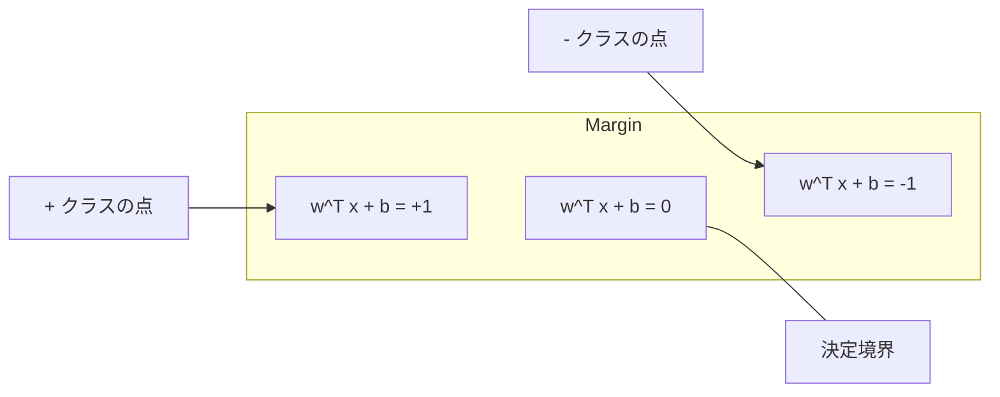
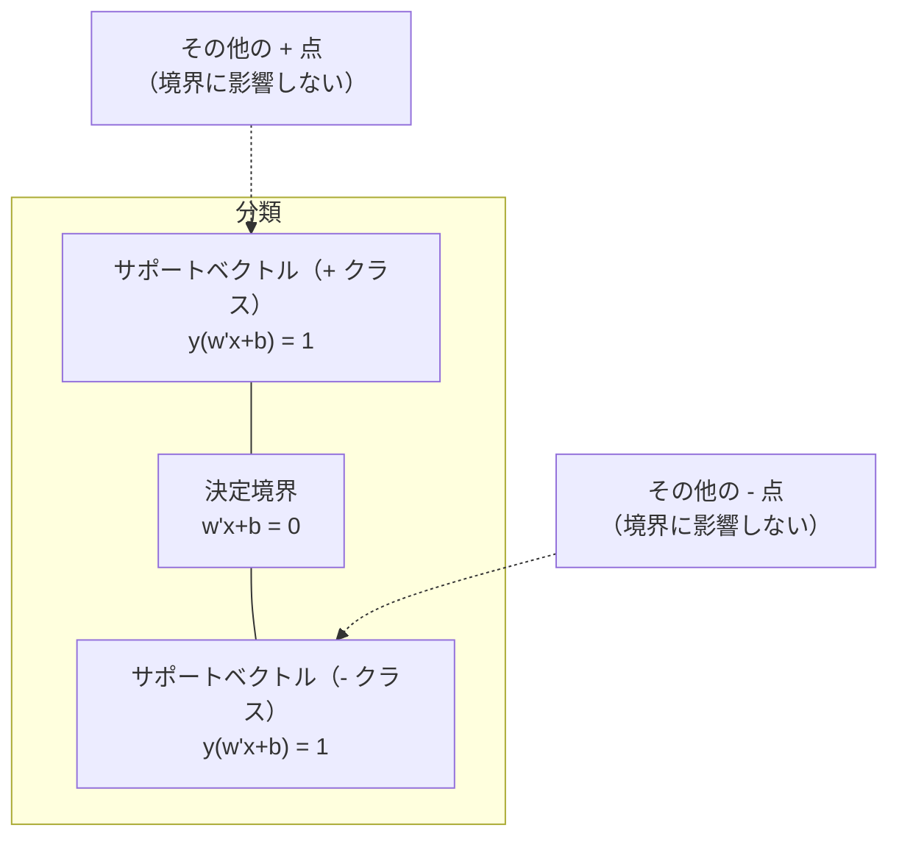
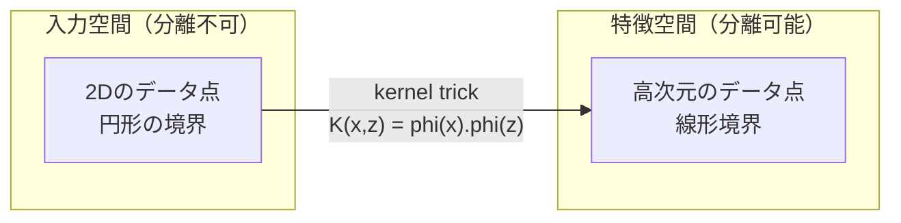

# サポートベクターマシン

> 2つのクラスの間に、できるだけ幅の広い道を見つける。それが全体の考え方です。

**タイプ:** Build
**言語:** Python
**前提条件:** フェーズ1（レッスン08 最適化、14 ノルムと距離、18 凸最適化）
**時間:** 約90分

## 学習目標

- ヒンジ損失と主問題形式での勾配降下法を使って、線形SVMをゼロから実装する
- 最大マージン原理を説明し、学習済みモデルからサポートベクトルを特定する
- 線形、Polynomial、RBF kernelを比較し、kernel trickが明示的な高次元写像を避けるしくみを説明する
- Cパラメータが制御する、マージン幅と分類誤りのトレードオフを評価する

## 問題

2つのクラスのデータ点があり、それらを分ける直線（または超平面）を引く必要があります。条件を満たす線は無数にあり得ます。どれを選ぶべきでしょうか。

最も大きなマージンを持つものです。マージンとは、決定境界と、その両側で最も近いデータ点との距離です。マージンが広いほど分類器の確信度は高く、未知データへの汎化もよくなります。

この直感から、機械学習で最も数学的に洗練されたアルゴリズムの1つであるSupport Vector Machinesが生まれます。SVMは深層学習以前に支配的だった分類手法であり、現在でも小規模データセット、高次元データ、理論的保証を持つ原理的で理解しやすいモデルが必要な問題では最良の選択肢です。

SVMはフェーズ1に直接つながっています。最適化は凸（レッスン18）で、マージンはノルムで測られ（レッスン14）、kernel trickは内積を利用して、高次元空間で明示的に計算することなく非線形境界を扱います。

## 概念

### 最大マージン分類器

ラベル y_i が {-1, +1}、特徴量ベクトルが x_i である線形分離可能なデータがあるとします。クラスを分ける超平面 w^T x + b = 0 を求めます。

点 x_i から超平面までの距離は次の通りです。

```
distance = |w^T x_i + b| / ||w||
```

正しく分類された点では y_i * (w^T x_i + b) > 0 です。マージンは、超平面から両側の最近傍点までの距離の2倍です。



最適化問題は次の通りです。

```
最大化    2 / ||w||     (マージン幅)
制約      y_i * (w^T x_i + b) >= 1  すべての i について
```

同値な形として（||w||^2 を最小化する方が最適化しやすいので）:

```
最小化    (1/2) ||w||^2
制約      y_i * (w^T x_i + b) >= 1  すべての i について
```

これは凸二次計画問題です。一意な大域解を持ちます。マージン境界上にちょうど位置するデータ点（y_i * (w^T x_i + b) = 1 となる点）がサポートベクトルです。決定境界を決めるのはこれらの点だけです。サポートベクトルでない点を動かしたり取り除いたりしても、境界は変わりません。

### サポートベクトル: 決定的に重要な少数の点



ほとんどの訓練点は関係ありません。重要なのはサポートベクトルだけです。そのため、SVMは予測時のメモリ効率がよいモデルです。訓練セット全体ではなく、サポートベクトルだけを保存すればよいからです。

サポートベクトルの数は、汎化誤差の境界も与えます。データセットサイズに対してサポートベクトルが少ないほど、汎化がよいことを意味します。

### ソフトマージン: Cパラメータでノイズを扱う

現実のデータが完全に分離可能であることはほとんどありません。一部の点は境界の反対側にあったり、マージン内にあったりします。ソフトマージン定式化は、スラック変数を導入することで違反を許容します。

```
最小化    (1/2) ||w||^2 + C * sum(xi_i)
制約      y_i * (w^T x_i + b) >= 1 - xi_i
          xi_i >= 0  すべての i について
```

スラック変数 xi_i は、点 i がマージンにどれだけ違反しているかを測ります。Cはトレードオフを制御します。

| Cの値 | 振る舞い |
|---------|----------|
| 大きいC | 違反を強く罰する。狭いマージン、少ない誤分類。過学習しやすい |
| 小さいC | より多くの違反を許す。広いマージン、多い誤分類。未学習になりやすい |

Cは正則化強度の逆数に相当します。大きいC = 弱い正則化、小さいC = 強い正則化です。

### ヒンジ損失: SVMの損失関数

ソフトマージンSVMは、制約なし最適化として書き換えられます。

```
最小化    (1/2) ||w||^2 + C * sum(max(0, 1 - y_i * (w^T x_i + b)))
```

項 max(0, 1 - y_i * f(x_i)) がヒンジ損失です。点が正しく分類され、かつマージンの外側にあるときは0です。点がマージン内にある、または誤分類されているときは線形になります。

```
単一点のヒンジ損失:

損失
  |
  | \
  |  \
  |   \
  |    \
  |     \_______________
  |
  +-----|-----|-------->  y * f(x)
       0     1

y*f(x) >= 1（正しく分類され、マージン外側）のとき損失は0。
y*f(x) < 1 のとき線形ペナルティ。
```

ロジスティック損失（ロジスティック回帰）と比較します。

```
Hinge:     max(0, 1 - y*f(x))          マージンで硬いカットオフ
Logistic:  log(1 + exp(-y*f(x)))        滑らかで、厳密には0にならない
```

ヒンジ損失は疎な解を生みます（サポートベクトルだけがゼロでない寄与を持ちます）。ロジスティック損失はすべてのデータ点を使います。そのため、SVMは予測時のメモリ効率が高くなります。

### 勾配降下法で線形SVMを学習する

制約付きQPを解かなくても、ヒンジ損失とL2正則化に対して勾配降下法を使うことで、線形SVMを学習できます。

```
L(w, b) = (lambda/2) * ||w||^2 + (1/n) * sum(max(0, 1 - y_i * (w^T x_i + b)))

wに関する勾配:
  y_i * (w^T x_i + b) >= 1 の場合:  dL/dw = lambda * w
  y_i * (w^T x_i + b) < 1 の場合:   dL/dw = lambda * w - y_i * x_i

bに関する勾配:
  y_i * (w^T x_i + b) >= 1 の場合:  dL/db = 0
  y_i * (w^T x_i + b) < 1 の場合:   dL/db = -y_i
```

これは主問題形式と呼ばれます。1エポックあたり O(n * d) で動作します。ここで n はサンプル数、d は特徴量数です。大規模で疎な高次元データ（テキスト分類）では高速です。

### 双対形式とkernel trick

SVM問題のラグランジュ双対（フェーズ1 レッスン18のKKT条件）は次の通りです。

```
最大化    sum(alpha_i) - (1/2) * sum_ij(alpha_i * alpha_j * y_i * y_j * (x_i . x_j))
制約      0 <= alpha_i <= C
          sum(alpha_i * y_i) = 0
```

双対問題には、データ点間の内積 x_i . x_j だけが現れます。これが重要な洞察です。すべての内積をkernel関数 K(x_i, x_j) に置き換えると、SVMは変換を明示的に計算することなく非線形境界を学習できます。

```
Linear kernel:      K(x, z) = x . z
Polynomial kernel:  K(x, z) = (x . z + c)^d
RBF (Gaussian):     K(x, z) = exp(-gamma * ||x - z||^2)
```

RBF kernelはデータを無限次元空間に写像します。入力空間で近い点同士はkernel値が1に近く、遠い点同士は0に近くなります。任意の滑らかな決定境界を学習できます。



kernel trickは、高次元空間に実際に移動することなく、その空間での内積を計算します。D次元で次数 d のPolynomial kernelを明示的に展開すると、特徴空間は O(D^d) 次元になります。しかし K(x, z) は O(D) 時間で計算できます。

### 回帰のためのSVM（SVR）

Support Vector Regressionは、データの周りに幅 epsilon のチューブをフィットさせます。チューブ内の点は損失が0です。チューブ外の点は線形に罰せられます。

```
最小化    (1/2) ||w||^2 + C * sum(xi_i + xi_i*)
制約      y_i - (w^T x_i + b) <= epsilon + xi_i
          (w^T x_i + b) - y_i <= epsilon + xi_i*
          xi_i, xi_i* >= 0
```

epsilonパラメータはチューブ幅を制御します。広いチューブ = サポートベクトルが少ない = より滑らかなフィット。狭いチューブ = サポートベクトルが多い = よりタイトなフィットです。

### SVMが深層学習に敗れた理由（それでも勝つ場面）

SVMは1990年代後半から2010年代前半まで機械学習を支配しました。深層学習がSVMを上回った理由はいくつかあります。

| 要因 | SVM | 深層学習 |
|--------|------|---------------|
| 特徴量エンジニアリング | 必要 | 特徴量を学習する |
| スケーラビリティ | kernelでは O(n^2) から O(n^3) | SGDで1エポック O(n) |
| 画像/テキスト/音声 | 手作り特徴量が必要 | 生データから学習する |
| 大規模データセット（10万超） | 遅い | よくスケールする |
| GPU高速化 | 利点が限定的 | 大幅に高速化 |

それでも、SVMは次の状況で今も有力です。
- 小規模データセット（数百から数千程度のサンプル）
- 高次元の疎データ（TF-IDF特徴量を持つテキストなど）
- 数学的保証（マージン境界）が必要な場合
- 学習時間を最小にする必要がある場合（線形SVMは非常に高速）
- 明確なマージン構造を持つ二値分類
- 異常検知（one-class SVM）

## 作ってみる

### ステップ1: ヒンジ損失と勾配

基礎部分です。バッチに対するヒンジ損失とその勾配を計算します。

```python
def hinge_loss(X, y, w, b):
    n = len(X)
    total_loss = 0.0
    for i in range(n):
        margin = y[i] * (dot(w, X[i]) + b)
        total_loss += max(0.0, 1.0 - margin)
    return total_loss / n
```

### ステップ2: 勾配降下法による線形SVM

正則化付きヒンジ損失を最小化して学習します。QPソルバーは不要です。

```python
class LinearSVM:
    def __init__(self, lr=0.001, lambda_param=0.01, n_epochs=1000):
        self.lr = lr
        self.lambda_param = lambda_param
        self.n_epochs = n_epochs
        self.w = None
        self.b = 0.0

    def fit(self, X, y):
        n_features = len(X[0])
        self.w = [0.0] * n_features
        self.b = 0.0

        for epoch in range(self.n_epochs):
            for i in range(len(X)):
                margin = y[i] * (dot(self.w, X[i]) + self.b)
                if margin >= 1:
                    self.w = [wj - self.lr * self.lambda_param * wj
                              for wj in self.w]
                else:
                    self.w = [wj - self.lr * (self.lambda_param * wj - y[i] * X[i][j])
                              for j, wj in enumerate(self.w)]
                    self.b -= self.lr * (-y[i])

    def predict(self, X):
        return [1 if dot(self.w, x) + self.b >= 0 else -1 for x in X]
```

### ステップ3: kernel関数

線形、Polynomial、RBF kernelを実装します。

```python
def linear_kernel(x, z):
    return dot(x, z)

def polynomial_kernel(x, z, degree=3, c=1.0):
    return (dot(x, z) + c) ** degree

def rbf_kernel(x, z, gamma=0.5):
    diff = [xi - zi for xi, zi in zip(x, z)]
    return math.exp(-gamma * dot(diff, diff))
```

### ステップ4: マージンとサポートベクトルの特定

学習後、どの点がサポートベクトルかを特定し、マージン幅を計算します。

```python
def find_support_vectors(X, y, w, b, tol=1e-3):
    support_vectors = []
    for i in range(len(X)):
        margin = y[i] * (dot(w, X[i]) + b)
        if abs(margin - 1.0) < tol:
            support_vectors.append(i)
    return support_vectors
```

すべてのデモを含む完全な実装は `code/svm.py` を参照してください。

## 使ってみる

scikit-learnでは次のように使います。

```python
from sklearn.svm import SVC, LinearSVC, SVR
from sklearn.preprocessing import StandardScaler
from sklearn.pipeline import Pipeline

clf = Pipeline([
    ("scaler", StandardScaler()),
    ("svm", SVC(kernel="rbf", C=1.0, gamma="scale")),
])
clf.fit(X_train, y_train)
print(f"Accuracy: {clf.score(X_test, y_test):.4f}")
print(f"Support vectors: {clf['svm'].n_support_}")
```

重要: SVMを学習する前に、必ず特徴量をスケーリングしてください。マージンは ||w|| に依存するため、SVMは特徴量の大きさに敏感です。スケーリングされていない特徴量は幾何を歪めます。

大規模データセットでは、`SVC`（双対形式、O(n^2) から O(n^3)）ではなく `LinearSVC`（主問題形式、1エポック O(n)）を使います。

```python
from sklearn.svm import LinearSVC

clf = Pipeline([
    ("scaler", StandardScaler()),
    ("svm", LinearSVC(C=1.0, max_iter=10000)),
])
```

## 演習

1. 2Dの線形分離可能なデータセットを生成します。自分のLinearSVMを学習し、サポートベクトルを特定してください。サポートベクトルが決定境界に最も近い点であることを確認します。

2. ノイズのあるデータセットで、Cを0.001から1000まで変化させます。各C値の決定境界をプロットしてください。広いマージン（未学習）から狭いマージン（過学習）への遷移を観察します。

3. クラス境界が円形（線形ではない）になるデータセットを作ります。線形SVMが失敗することを示してください。RBF kernel行列を計算し、kernelが誘導する特徴空間でクラスが分離可能になることを示します。

4. 同じデータセットでヒンジ損失とロジスティック損失を比較します。線形SVMとロジスティック回帰を学習してください。各モデルの決定境界に寄与する訓練点の数を数えます（サポートベクトル vs 全点）。

5. SVR（epsilon-insensitive loss）を実装します。y = sin(x) + noise にフィットさせてください。予測の周りにepsilonチューブをプロットし、サポートベクトル（チューブ外の点）を強調します。

## 重要用語

| 用語 | 実際の意味 |
|------|----------------------|
| サポートベクトル | 決定境界に最も近い訓練点。超平面を決める唯一の点 |
| マージン | 決定境界と最近傍のサポートベクトルとの距離。SVMはこれを最大化する |
| ヒンジ損失 | max(0, 1 - y*f(x))。正しく分類され、マージン外側にあるときは0。それ以外では線形ペナルティ |
| Cパラメータ | マージン幅と分類誤りのトレードオフ。大きいC = 狭いマージン、小さいC = 広いマージン |
| ソフトマージン | スラック変数によってマージン違反を許すSVM定式化。分離不可能なデータを扱う |
| kernel trick | 高次元特徴空間に明示的に写像せず、その空間での内積を計算すること |
| 線形kernel | K(x, z) = x . z。通常の内積と同等。線形分離可能なデータ向け |
| RBF kernel | K(x, z) = exp(-gamma * \|\|x-z\|\|^2)。無限次元に写像する。任意の滑らかな境界を学習する |
| Polynomial kernel | K(x, z) = (x . z + c)^d。多項式の組み合わせからなる特徴空間に写像する |
| 双対形式 | データ点間の内積だけに依存するSVM問題の再定式化。kernelを可能にする |
| SVR | Support Vector Regression。データの周りにepsilonチューブをフィットさせる。チューブ内の点の損失は0 |
| スラック変数 | xi_i: 点がマージンにどれだけ違反しているかを測る。マージン外側で正しく分類された点では0 |
| 最大マージン | 各クラスの最近傍点までの距離を最大化する超平面を選ぶ原理 |

## 参考文献

- [Vapnik: The Nature of Statistical Learning Theory (1995)](https://link.springer.com/book/10.1007/978-1-4757-3264-1) - SVMと統計的学習の基礎文献
- [Cortes & Vapnik: Support-vector networks (1995)](https://link.springer.com/article/10.1007/BF00994018) - SVMの元論文
- [Platt: Sequential Minimal Optimization (1998)](https://www.microsoft.com/en-us/research/publication/sequential-minimal-optimization-a-fast-algorithm-for-training-support-vector-machines/) - SVM学習を実用的にしたSMOアルゴリズム
- [scikit-learn SVM documentation](https://scikit-learn.org/stable/modules/svm.html) - 実装詳細を含む実践的ガイド
- [LIBSVM: A Library for Support Vector Machines](https://www.csie.ntu.edu.tw/~cjlin/libsvm/) - 多くのSVM実装の背後にあるC++ライブラリ
