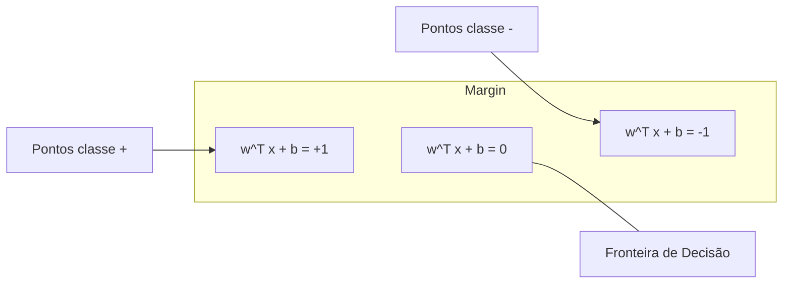

# Support Vector Machines

> Encontre a rua mais larga entre duas classes. Essa é a ideia inteira.

**Tipo:** Build
**Linguagens:** Python
**Pré-requisitos:** Fase 1 (Aulas 08 Otimização, 14 Normas e Distâncias, 18 Otimização Convexa)
**Tempo:** ~90 minutos

## Objetivos de Aprendizado

- Implementar um SVM linear do zero usando hinge loss e descida do gradiente na formulação primal
- Explicar o princípio de margem máxima e identificar vetores de suporte de um modelo treinado
- Comparar kernels lineares, polinomiais e RBF e explicar como o kernel trick evita mapeamento explícito de alta dimensionalidade
- Avaliar o tradeoff controlado pelo parâmetro C entre largura de margem e erros de classificação

## O Problema

Você tem duas classes de pontos de dados e precisa desenhar uma reta (ou hiperplano) separando-as. Infinitas retas funcionam. Qual você escolhe?

A que tem a maior margem. A margem é a distância entre a fronteira de decisão e os pontos de dados mais próximos em cada lado. Uma margem mais larga significa que o classificador é mais confiante e generaliza melhor.

## O Conceito

### O Classificador de Margem Máxima



O problema de otimização:
```
maximizar    2 / ||w||     (a largura da margem)
sujeito a    y_i * (w^T x_i + b) >= 1  para todo i
```

Equivalentemente:
```
minimizar    (1/2) ||w||^2
sujeito a    y_i * (w^T x_i + b) >= 1  para todo i
```

Os pontos de dados que ficam exatamente nos limites da margem são os vetores de suporte. Eles são os únicos pontos que determinam a fronteira de decisão.

### Margem Suave: Lidando com Ruído

```
minimizar    (1/2) ||w||^2 + C * sum(xi_i)
sujeito a    y_i * (w^T x_i + b) >= 1 - xi_i
            xi_i >= 0  para todo i
```

| Valor de C | Comportamento |
|-----------|---------------|
| C grande | Penaliza violações pesadamente. Margem estreita, menos classificações erradas. Overfitting |
| C pequeno | Permite mais violações. Margem larga, mais classificações erradas. Subajuste |

### Hinge Loss

```
hinge_loss = max(0, 1 - y*f(x))
```

Zero quando classificado corretamente e fora da margem. Penalidade linear quando dentro da margem ou classificado incorretamente.

### O Kernel Trick

```
Kernel Linear:      K(x, z) = x . z
Kernel Polinomial:  K(x, z) = (x . z + c)^d
RBF (Gaussiano):    K(x, z) = exp(-gamma * ||x - z||^2)
```

O kernel trick calcula o produto escalar no espaço de alta dimensionalidade sem nunca ir lá. O kernel RBF mapeia dados para um espaço de dimensão infinita.

## Construa

### Passo 1: Hinge loss e gradiente

```python
def hinge_loss(X, y, w, b):
    n = len(X)
    total_loss = 0.0
    for i in range(n):
        margin = y[i] * (dot(w, X[i]) + b)
        total_loss += max(0.0, 1.0 - margin)
    return total_loss / n
```

### Passo 2: SVM Linear via descida do gradiente

```python
class LinearSVM:
    def __init__(self, lr=0.001, lambda_param=0.01, n_epochs=1000):
        self.lr = lr
        self.lambda_param = lambda_param
        self.n_epochs = n_epochs
        self.w = None
        self.b = 0.0

    def fit(self, X, y):
        n_features = len(X[0])
        self.w = [0.0] * n_features

        for epoch in range(self.n_epochs):
            for i in range(len(X)):
                margin = y[i] * (dot(self.w, X[i]) + self.b)
                if margin >= 1:
                    self.w = [wj - self.lr * self.lambda_param * wj for wj in self.w]
                else:
                    self.w = [wj - self.lr * (self.lambda_param * wj - y[i] * X[i][j])
                              for j, wj in enumerate(self.w)]
                    self.b -= self.lr * (-y[i])
```

### Passo 3: Funções de kernel

```python
def linear_kernel(x, z):
    return dot(x, z)

def polynomial_kernel(x, z, degree=3, c=1.0):
    return (dot(x, z) + c) ** degree

def rbf_kernel(x, z, gamma=0.5):
    diff = [xi - zi for xi, zi in zip(x, z)]
    return math.exp(-gamma * dot(diff, diff))
```

## Use

Com scikit-learn:

```python
from sklearn.svm import SVC, LinearSVC, SVR
from sklearn.preprocessing import StandardScaler
from sklearn.pipeline import Pipeline

clf = Pipeline([
    ("scaler", StandardScaler()),
    ("svm", SVC(kernel="rbf", C=1.0, gamma="scale")),
])
clf.fit(X_train, y_train)
print(f"Accuracy: {clf.score(X_test, y_test):.4f}")
print(f"Vetores de suporte: {clf['svm'].n_support_}")
```

Importante: sempre escale suas features antes de treinar um SVM.

## Exercícios

1. Gere um dataset 2D linearmente separável. Treine seu LinearSVM e identifique os vetores de suporte.
2. Varie C de 0.001 a 1000 num dataset ruidoso. Plote a fronteira de decisão para cada valor de C.
3. Crie um dataset onde as fronteiras de classe são circulares (não lineares). Mostre que um SVM linear falha.
4. Compare hinge loss vs logistic loss no mesmo dataset.
5. Implemente SVR (loss insensível a épsilon). Ajuste em y = sin(x) + ruído.
