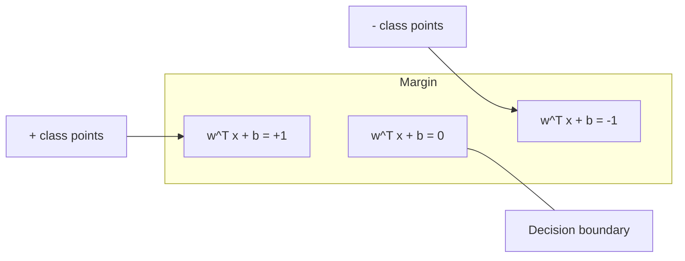
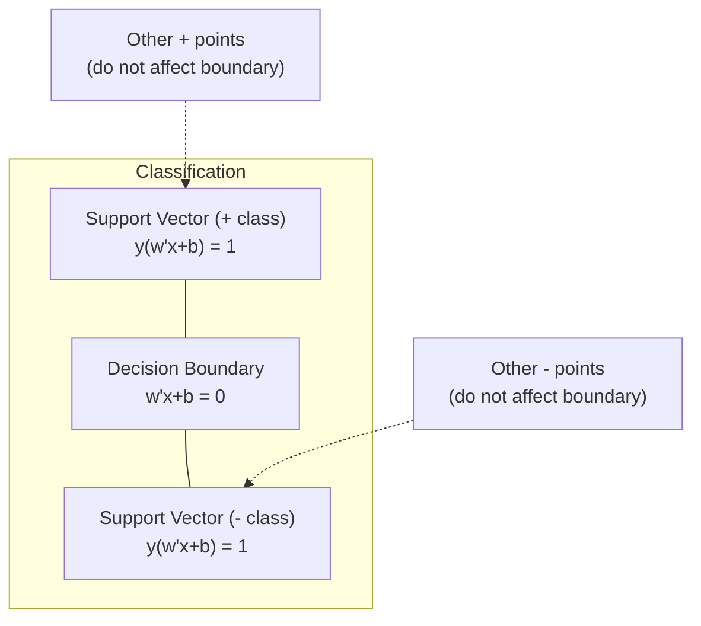
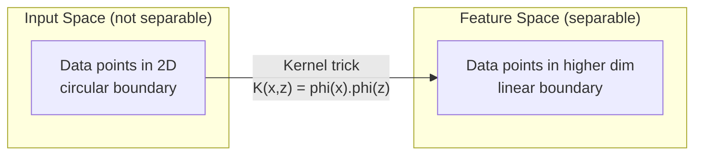

# Vektör Makinelerini Destekleyin

> İki sınıf arasındaki en geniş caddeyi bulun. Bütün fikir bu.

**Tür:** Yapım
**Dil:** Python
**Önkoşullar:** Aşama 1 (Dersler 08 Optimizasyon, 14 Norm ve Uzaklıklar, 18 Dışbükey Optimizasyon)
**Süre:** ~90 dakika

## Öğrenme Hedefleri

- Temel formülasyonda menteşe kaybı ve gradient inişini kullanarak sıfırdan doğrusal bir SVM uygulayın
- Maksimum marj ilkesini açıklayın ve eğitilmiş bir modelden destek vektörlerini belirleyin
- Doğrusal, polinom ve RBF çekirdeklerini karşılaştırın ve çekirdek hilesinin açık yüksek boyutlu haritalamayı nasıl önlediğini açıklayın
- Marj genişliği ile sınıflandırma hataları arasında C parametresi tarafından kontrol edilen dengeyi değerlendirin

## Sorun

İki sınıf veri noktanız var ve bunları ayıran bir çizgi (veya hiperdüzlem) çizmeniz gerekiyor. Sonsuz sayıda satır işe yarayabilir. Hangisini seçmelisiniz?

En büyük marja sahip olan. Kenar boşluğu, karar sınırı ile her iki taraftaki en yakın veri noktaları arasındaki mesafedir. Daha geniş bir marj, sınıflandırıcının daha güvenli olduğu ve görünmeyen verilere daha iyi genelleme yaptığı anlamına gelir.

Bu sezgi, makine öğrenimindeki matematiksel açıdan en zarif algoritmalardan biri olan Destek Vektör Makinelerine yol açar. SVM'ler, deep learning'den önce baskın sınıflandırma yöntemiydi ve küçük dataset'ler, yüksek boyutlu veriler ve teorik garantili, ilkeli, iyi anlaşılmış bir modele ihtiyaç duyduğunuz problemler için en iyi seçim olmaya devam ediyor.

SVM'ler doğrudan Aşama 1'e bağlanır: optimizasyon dışbükeydir (Ders 18), marj normlarla ölçülür (Ders 14) ve çekirdek hilesi, yüksek boyutlu alanda hiçbir hesaplama yapmadan doğrusal olmayan sınırları işlemek için nokta çarpımlarından yararlanır.

## Konsept

### Maksimum kenar boşluğu sınıflandırıcısı

{-1, +1}'de y_i etiketlerine ve x_i özellik vektörlerine sahip doğrusal olarak ayrılabilir veriler verildiğinde, sınıfları ayıran bir w^T x + b = 0 hiperdüzlemi istiyoruz.

Bir x_i noktasından hiper düzleme olan mesafe:

```
distance = |w^T x_i + b| / ||w||
```

Doğru şekilde sınıflandırılmış bir nokta için: y_i * (w^T x_i + b) > 0. Kenar boşluğu, hiperdüzlemden her iki taraftaki en yakın noktaya olan mesafenin iki katıdır.



Optimizasyon problemi:

```
maximize    2 / ||w||     (the margin width)
subject to  y_i * (w^T x_i + b) >= 1  for all i
```

Benzer şekilde ( ||w||^2'yi en aza indirmek optimize etmek daha kolaydır):

```
minimize    (1/2) ||w||^2
subject to  y_i * (w^T x_i + b) >= 1  for all i
```

Bu dışbükey ikinci dereceden bir programdır. Benzersiz bir küresel çözüme sahiptir. Tam olarak kenar boşluğu sınırlarına oturan veri noktaları (burada y_i * (w^T x_i + b) = 1) destek vektörleridir. Karar sınırını belirleyen tek noktalar bunlardır. Destek vektörü olmayan herhangi bir noktayı taşıyın veya kaldırın; sınır değişmez.

### Destek vektörleri: kritik birkaç



Çoğu eğitim noktası önemsizdir. Yalnızca destek vektörleri önemlidir. Bu nedenle SVM'ler tahmin zamanında bellek açısından verimlidir: tüm eğitim setini değil, yalnızca destek vektörlerini saklamanız gerekir.

Destek vektörlerinin sayısı aynı zamanda genelleme hatasına da bir sınır verir. dataset boyutuna göre daha az destek vektörü daha iyi genelleme anlamına gelir.

### Yumuşak kenar boşluğu: C parametresiyle gürültünün işlenmesi

Gerçek veriler nadiren mükemmel şekilde ayrılabilir. Bazı noktalar sınırın yanlış tarafında veya kenar boşluğunun içinde olabilir. Yumuşak marj formülasyonu, gevşek değişkenler ekleyerek ihlallere izin verir.

```
minimize    (1/2) ||w||^2 + C * sum(xi_i)
subject to  y_i * (w^T x_i + b) >= 1 - xi_i
            xi_i >= 0  for all i
```

Slack değişkeni xi_i, i noktasının marjı ne kadar ihlal ettiğini ölçer. C takası kontrol eder:

| C değeri | Davranış |
|---------|----------|
| Büyük C | İhlalleri ağır şekilde cezalandırır. Dar marj, daha az yanlış sınıflandırma. Overfits |
| Küçük C | Daha fazla ihlale izin verir. Geniş marj, daha fazla yanlış sınıflandırma. Külotlar |

C, ters çevrilmiş düzenleme gücüdür. Büyük C = daha az düzenleme. Küçük C = daha fazla düzenleme.

### Menteşe kaybı: SVM loss function

Esnek marj SVM'si kısıtlanmamış bir optimizasyon olarak yeniden yazılabilir:

```
minimize    (1/2) ||w||^2 + C * sum(max(0, 1 - y_i * (w^T x_i + b)))
```

max(0, 1 - y_i * f(x_i)) terimi menteşe kaybıdır. Nokta doğru şekilde sınıflandırıldığında ve marjın ötesinde olduğunda sıfırdır. Nokta kenar boşluğunun içinde olduğunda veya yanlış sınıflandırıldığında doğrusaldır.

```
Hinge loss for a single point:

loss
  |
  | \
  |  \
  |   \
  |    \
  |     \_______________
  |
  +-----|-----|-------->  y * f(x)
       0     1

Zero loss when y*f(x) >= 1 (correctly classified, outside margin).
Linear penalty when y*f(x) < 1.
```

Lojistik kayıpla karşılaştırın (lojistik regresyon):

```
Hinge:     max(0, 1 - y*f(x))          Hard cutoff at margin
Logistic:  log(1 + exp(-y*f(x)))        Smooth, never exactly zero
```

Menteşe kaybı seyrek çözümler üretir (yalnızca destek vektörlerinin katkısı sıfırdan farklıdır). Lojistik kayıp tüm veri noktalarını kullanır. Bu, SVM'lerin tahmin zamanında bellek açısından daha verimli olmasını sağlar.

### gradient inişiyle doğrusal bir SVM'yi eğitme

Kısıtlı QP'yi çözmeden, menteşe kaybı artı L2 düzenlemesinde gradient inişini kullanarak doğrusal bir SVM'yi eğitebilirsiniz:

```
L(w, b) = (lambda/2) * ||w||^2 + (1/n) * sum(max(0, 1 - y_i * (w^T x_i + b)))

Gradient with respect to w:
  If y_i * (w^T x_i + b) >= 1:  dL/dw = lambda * w
  If y_i * (w^T x_i + b) < 1:   dL/dw = lambda * w - y_i * x_i

Gradient with respect to b:
  If y_i * (w^T x_i + b) >= 1:  dL/db = 0
  If y_i * (w^T x_i + b) < 1:   dL/db = -y_i
```

Buna ilk formülasyon denir. Dönem başına O(n * d) cinsinden çalışır; burada n, örnek sayısı ve d, özelliklerin sayısıdır. Büyük, seyrek, yüksek boyutlu veriler (metin sınıflandırması) için bu hızlıdır.

### İkili formülasyon ve çekirdek numarası

SVM probleminin Lagrange ikilisi (Aşama 1 Ders 18, KKT koşullarından):

```
maximize    sum(alpha_i) - (1/2) * sum_ij(alpha_i * alpha_j * y_i * y_j * (x_i . x_j))
subject to  0 <= alpha_i <= C
            sum(alpha_i * y_i) = 0
```

İkili yalnızca x_i nokta çarpımlarını içerir. x_j veri noktaları arasında. Bu, temel içgörüdür. Her nokta çarpımı bir çekirdek fonksiyonu K(x_i, x_j) ile değiştirin; SVM, dönüşümü açıkça hesaplamadan doğrusal olmayan sınırları öğrenebilir.

```
Linear kernel:      K(x, z) = x . z
Polynomial kernel:  K(x, z) = (x . z + c)^d
RBF (Gaussian):     K(x, z) = exp(-gamma * ||x - z||^2)
```

RBF çekirdeği, verileri sonsuz boyutlu bir uzaya eşler. Giriş uzayında yakın olan noktaların çekirdek değeri 1'e yakındır. Uzak olan noktaların çekirdek değeri ise 0'a yakındır. Herhangi bir düzgün karar sınırını öğrenebilir.



Çekirdek numarası, yüksek boyutlu uzaydaki nokta çarpımı oraya hiç gitmeden hesaplar. D boyutlarında d derecesinin polinom çekirdeği için, açık özellik uzayının O(D^d) boyutları vardır. Ancak K(x, z), O(D) zamanında hesaplanır.

### Regresyon için SVM (SVR)

Destek Vektör Regresyon, veri etrafına epsilon genişliğinde bir tüp yerleştirir. Tüpün içindeki noktalar sıfır kayıplıdır. Tüpün dışındaki noktalar doğrusal olarak cezalandırılır.

```
minimize    (1/2) ||w||^2 + C * sum(xi_i + xi_i*)
subject to  y_i - (w^T x_i + b) <= epsilon + xi_i
            (w^T x_i + b) - y_i <= epsilon + xi_i*
            xi_i, xi_i* >= 0
```

Epsilon parametresi tüp genişliğini kontrol eder. Daha geniş boru = daha az destek vektörü = daha düzgün uyum. Daha dar boru = daha fazla destek vektörü = daha sıkı uyum.

### SVM'ler neden deep learning'ye yenildi (ve hala kazanıyorlarsa)

SVM'ler 1990'ların sonlarından 2010'ların başına kadar ML'ye hakim oldu. Deep learning birkaç nedenden dolayı onları geride bıraktı:

| Faktör | SVM'ler | Deep learning |
|--------|------|---------------|
| Özellik mühendisliği | Bunu gerektirir | Özellikleri öğrenir |
| Ölçeklenebilirlik | Çekirdek için O(n^2)'den O(n^3)'e | SGD ile çağ başına O(n) |
| Resim/metin/ses | El işi özelliklere ihtiyaç var | Ham verilerden öğrenir |
| Büyük dataset'ler (>100k) | Yavaş | İyi ölçeklenir |
| GPU hızlandırma | Sınırlı fayda | Muazzam hızlanma |

SVM'ler şu durumlarda hala kazanıyor:
- Küçük dataset'ler (yüzlerce ila düşük binlerce örnek)
- Yüksek boyutlu seyrek veriler (TF-IDF özelliklerine sahip metin)
- Matematiksel garantilere ihtiyacınız olduğunda (kenar sınırları)
- Eğitim süresinin minimum olması gerektiğinde (doğrusal SVM çok hızlıdır)
- Açık marj yapısına sahip ikili sınıflandırma
- Anormallik tespiti (tek sınıf SVM)

```figure
svm-margin
```

## İnşa Et

### Adım 1: Menteşe kaybı ve gradient

Temel. Bir parti ve onun gradient'si için menteşe kaybını hesaplayın.

```python
def hinge_loss(X, y, w, b):
    n = len(X)
    total_loss = 0.0
    for i in range(n):
        margin = y[i] * (dot(w, X[i]) + b)
        total_loss += max(0.0, 1.0 - margin)
    return total_loss / n
```

### Adım 2: gradient iniş yoluyla Doğrusal SVM

Düzenli menteşe kaybını en aza indirerek eğitim verin. QP çözücüye gerek yok.

```python
class LinearSVM:
    def __init__(self, lr=0.001, lambda_param=0.01, n_epochs=1000):
        self.lr = lr
        self.lambda_param = lambda_param
        self.n_epochs = n_epochs
        self.w = None
        self.b = 0.0

    def fit(self, X, y):
        n_features = len(X[0])
        self.w = [0.0] * n_features
        self.b = 0.0

        for epoch in range(self.n_epochs):
            for i in range(len(X)):
                margin = y[i] * (dot(self.w, X[i]) + self.b)
                if margin >= 1:
                    self.w = [wj - self.lr * self.lambda_param * wj
                              for wj in self.w]
                else:
                    self.w = [wj - self.lr * (self.lambda_param * wj - y[i] * X[i][j])
                              for j, wj in enumerate(self.w)]
                    self.b -= self.lr * (-y[i])

    def predict(self, X):
        return [1 if dot(self.w, x) + self.b >= 0 else -1 for x in X]
```

### Adım 3: Çekirdek işlevleri

Doğrusal, polinom ve RBF çekirdeklerini uygulayın.

```python
def linear_kernel(x, z):
    return dot(x, z)

def polynomial_kernel(x, z, degree=3, c=1.0):
    return (dot(x, z) + c) ** degree

def rbf_kernel(x, z, gamma=0.5):
    diff = [xi - zi for xi, zi in zip(x, z)]
    return math.exp(-gamma * dot(diff, diff))
```

### Adım 4: Kenar boşluğu ve destek vektörünün tanımlanması

Eğitimden sonra hangi noktaların destek vektörleri olduğunu belirleyin ve kenar boşluğu genişliğini hesaplayın.

```python
def find_support_vectors(X, y, w, b, tol=1e-3):
    support_vectors = []
    for i in range(len(X)):
        margin = y[i] * (dot(w, X[i]) + b)
        if abs(margin - 1.0) < tol:
            support_vectors.append(i)
    return support_vectors
```

Tüm demolarla birlikte tam uygulama için `code/svm.py`'ye bakın.

## Kullan onu

Scikit-learn ile:

```python
from sklearn.svm import SVC, LinearSVC, SVR
from sklearn.preprocessing import StandardScaler
from sklearn.pipeline import Pipeline

clf = Pipeline([
    ("scaler", StandardScaler()),
    ("svm", SVC(kernel="rbf", C=1.0, gamma="scale")),
])
clf.fit(X_train, y_train)
print(f"Accuracy: {clf.score(X_test, y_test):.4f}")
print(f"Support vectors: {clf['svm'].n_support_}")
```

Önemli: Bir SVM'yi eğitmeden önce daima özelliklerinizi ölçeklendirin. SVM'ler özellik büyüklüklerine duyarlıdır çünkü kenar boşluğu ||w||'ye bağlıdır ve ölçeklenmemiş özellikler geometriyi bozar.

Büyük dataset'ler için `SVC` (çift formülasyon, O(n^2) ila O(n^3)) yerine `LinearSVC` (temel formülasyon, dönem başına O(n)) kullanın:

```python
from sklearn.svm import LinearSVC

clf = Pipeline([
    ("scaler", StandardScaler()),
    ("svm", LinearSVC(C=1.0, max_iter=10000)),
])
```

## Egzersizler

1. 2B doğrusal olarak ayrılabilir bir dataset oluşturun. LinearSVM'nizi eğitin ve destek vektörlerini tanımlayın. Destek vektörlerinin karar sınırına en yakın noktalar olduğunu doğrulayın.

2. Gürültülü bir dataset'de C'yi 0,001'den 1000'e kadar değiştirin. Her C değeri için karar sınırını çizin. Geniş kenar boşluğundan (yetersiz uyum) dar kenar boşluğuna (aşırı uyum) geçişi gözlemleyin.

3. Sınıf sınırlarının dairesel (doğrusal değil) olduğu bir dataset oluşturun. Doğrusal bir SVM'nin başarısız olduğunu gösterin. RBF çekirdek matrisini hesaplayın ve sınıfların çekirdek kaynaklı özellik uzayında ayrılabilir hale geldiğini gösterin.

4. Aynı dataset'de menteşe kaybını lojistik kayıpla karşılaştırın. Doğrusal bir SVM ve lojistik regresyon eğitin. Her modelin karar sınırına kaç eğitim noktasının katkıda bulunduğunu sayın (destek vektörleri ve tüm noktalar).

5. SVR'yi (epsilona duyarsız kayıp) uygulayın. Bunu y = sin(x) + gürültüye uydurun. Epsilon tüpünü tahminlerin etrafına çizin ve destek vektörlerini (tüpün dışındaki noktalar) vurgulayın.

## Anahtar Terimler

| Dönem | Aslında ne anlama geliyor |
|------|----------------------|
| Destek vektörleri | Karar sınırına en yakın eğitim noktaları. Hiperdüzlemi belirleyen tek noktalar |
| Marj | Karar sınırı ile en yakın destek vektörleri arasındaki mesafe. SVM'ler bunu en üst düzeye çıkarır |
| Menteşe kaybı | max(0, 1 - y*f(x)). Doğru şekilde sınıflandırıldığında ve marjın dışında olduğunda sıfırdır. Aksi takdirde doğrusal ceza |
| C parametresi | Kenar boşluğu genişliği ve sınıflandırma hataları arasındaki denge. Büyük C = dar kenar boşluğu, küçük C = geniş kenar boşluğu |
| Yumuşak kenar boşluğu | Gevşek değişkenler yoluyla marj ihlallerine izin veren SVM formülasyonu. Ayrılamayan verileri işler |
| Çekirdek numarası | Yüksek boyutlu bir özellik uzayındaki nokta çarpımlarını, o uzayla açıkça eşlemeden hesaplama |
| Doğrusal çekirdek | K(x, z) = x . z. Standart nokta çarpımına eşdeğerdir. Doğrusal olarak ayrılabilir veriler için |
| RBF çekirdeği | K(x, z) = exp(-gamma * \|\|x-z\|\|^2). Sonsuz boyutlara haritalar. Herhangi bir düzgün sınırı öğrenir |
| Polinom çekirdeği | K(x, z) = (x . z + c)^d. Polinom kombinasyonlarının özellik uzayını eşler |
| Çift formülasyon | Yalnızca veri noktaları arasındaki nokta çarpımlarına dayanan SVM probleminin yeniden formüle edilmesi. Çekirdekleri etkinleştirir |
| SVR | Vektör Regresyonunu Destekleyin. Verilerin çevresine bir epsilon tüp yerleştirir. Tüpün içindeki noktalar sıfır kayıplıdır |
| Gevşek değişkenler | xi_i: bir noktanın marjı ne kadar ihlal ettiğini ölçer. Kenar boşluğu dışında doğru sınıflandırılmış noktalar için sıfır |
| Maksimum marj | Her sınıfın en yakın noktalarına olan mesafeyi maksimuma çıkaran hiperdüzlemi seçme ilkesi |

## Daha Fazla Okuma

- [Vapnik: İstatistiksel Öğrenme Teorisinin Doğası (1995)](https://link.springer.com/book/10.1007/978-1-4757-3264-1) - SVM'ler ve istatistiksel öğrenmeye ilişkin temel metin
- [Cortes & Vapnik: Destek vektör ağları (1995)](https://link.springer.com/article/10.1007/BF00994018) - orijinal SVM makalesi
- [Platt: Sıralı Minimal Optimizasyon (1998)](https://www.microsoft.com/en-us/research/publication/sequential-minimal-optimization-a-fast-algorithm-for-training-support-vector-machines/) - SVM eğitimini pratik hale getiren SMO algoritması
- [scikit-learn SVM belgeleri](https://scikit-learn.org/stable/modules/svm.html) - uygulama ayrıntılarını içeren pratik kılavuz
- [LIBSVM: Destek Vektör Makineleri için Bir Kitaplık](https://www.csie.ntu.edu.tw/~cjlin/libsvm/) - çoğu SVM uygulamasının arkasındaki C++ kitaplığı
