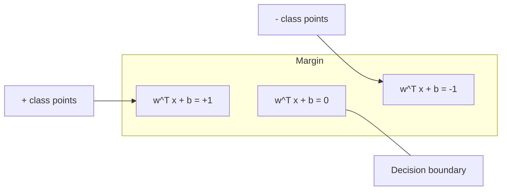
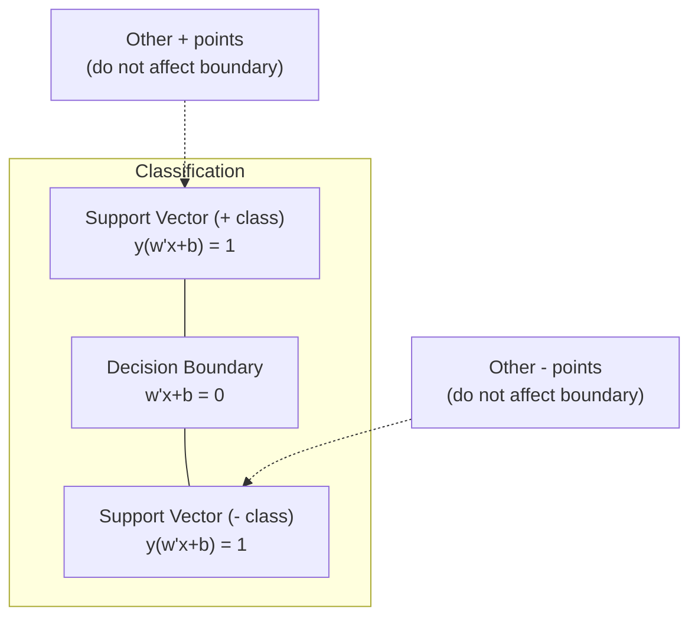
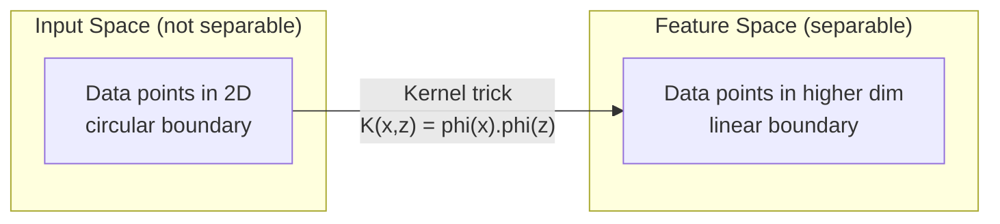

# Support Vector Machines

> 找到两个班级之间最宽的街道。这就是整个想法。

** 类型：** 构建
** 语言：** Python
** 先决条件：** 第1阶段（课程08优化、14规范和距离、18凸优化）
** 时间：** ~90分钟

## Learning Objectives

- 在原始公式上使用铰链损失和梯度下降从头开始实现线性SVM
- 解释最大保证金原则并从训练模型中识别支持载体
- 比较线性、多项和RBS核并解释核技巧如何避免显式的多维映射
- 评估C参数控制的页边宽度和分类误差之间的权衡

## The Problem

您有两类数据点，需要绘制一条线（或超平面）将它们分开。许多线路都可以工作。你应该选择哪一个？

利润最大的那个。边缘是决策边界与每一侧最近数据点之间的距离。更宽的边界意味着分类器更有信心，并且更好地概括看不见的数据。

这种直觉导致了支持向量机，这是ML中数学上最优雅的算法之一。SVM是深度学习之前的主要分类方法，并且仍然是小数据集，高维数据以及需要有理论保证的原则性，易于理解的模型的问题的最佳选择。

SVMs直接连接到第1阶段：优化是凸的（第18课），裕度用规范来衡量（第14课），内核技巧利用点积来处理非线性边界，而无需在多维空间中进行计算。

## The Concept

### The maximum margin classifier

给定具有{-1，+1}中的标签y_i和特征载体x_i的线性可分离数据，我们需要一个分离类的超平面w ' T x + b = 0。

从点x_i到超平面的距离为：

```
distance = |w^T x_i + b| / ||w||
```

对于正确分类的点：y_i *（w #T x_i + b）> 0。余量是超平面到两侧最近点距离的两倍。



优化问题：

```
maximize    2 / ||w||     (the margin width)
subject to  y_i * (w^T x_i + b) >= 1  for all i
```

等效（最小化||W|| #2更容易优化）：

```
minimize    (1/2) ||w||^2
subject to  y_i * (w^T x_i + b) >= 1  for all i
```

这是一个凸二次规划。它拥有独特的全球解决方案。恰好位于边缘边界上的数据点（其中y_i *（w ' T_i + b）= 1）是支持载体。它们是决定决策边界的唯一点。移动或删除任何非支持向点，边界不会改变。

### Support vectors: the critical few



大多数训练点都无关紧要。只有支持载体才重要。这就是为什么支持机在预测时具有内存效率：您只需要存储支持载体，而不是整个训练集。

支持向量的数量也给出了泛化误差的界。相对于数据集大小，更少的支持向量意味着更好的泛化。

### Soft margin: handling noise with the C parameter

真实数据很少可以完全分离。有些点可能位于边界的错误一侧，或在边界内。软利润公式通过引入松弛变量来允许违规。

```
minimize    (1/2) ||w||^2 + C * sum(xi_i)
subject to  y_i * (w^T x_i + b) >= 1 - xi_i
            xi_i >= 0  for all i
```

松弛变量xi_i测量点i违反裕度的程度。C控制权衡：

| C值 | 行为 |
|---------|----------|
| 大型C | 严厉惩罚违规行为。利润窄，错误分类少。过度贴合 |
| 小C | 允许更多违规行为。利润率高，分类错误较多。内衣 |

C是规则化强度，倒置。大C =较少的正规化。小C =更多规则化。

### Hinge loss: the SVM loss function

软余量SVM可以重写为无约束优化：

```
minimize    (1/2) ||w||^2 + C * sum(max(0, 1 - y_i * (w^T x_i + b)))
```

max（0，1 - y_i * f（x_i））项是铰链损失。当点被正确分类并且超出界限时，它为零。当点在页边空白内或分类错误时，它是线性的。

```
Hinge loss for a single point:

loss
  |
  | \
  |  \
  |   \
  |    \
  |     \_______________
  |
  +-----|-----|-------->  y * f(x)
       0     1

Zero loss when y*f(x) >= 1 (correctly classified, outside margin).
Linear penalty when y*f(x) < 1.
```

与逻辑损失（逻辑回归）相比：

```
Hinge:     max(0, 1 - y*f(x))          Hard cutoff at margin
Logistic:  log(1 + exp(-y*f(x)))        Smooth, never exactly zero
```

铰链损失产生稀疏解（只有支持载体具有非零贡献）。物流损失使用所有数据点。这使得支持机在预测时的内存效率更高。

### Training a linear SVM with gradient descent

您可以使用铰链损失的梯度下降加上L2正规化来训练线性支持者，而无需求解受约束的QP：

```
L(w, b) = (lambda/2) * ||w||^2 + (1/n) * sum(max(0, 1 - y_i * (w^T x_i + b)))

Gradient with respect to w:
  If y_i * (w^T x_i + b) >= 1:  dL/dw = lambda * w
  If y_i * (w^T x_i + b) < 1:   dL/dw = lambda * w - y_i * x_i

Gradient with respect to b:
  If y_i * (w^T x_i + b) >= 1:  dL/db = 0
  If y_i * (w^T x_i + b) < 1:   dL/db = -y_i
```

这被称为原始公式。它每个历元的运行时间为O（n * d），其中n是样本数量，d是特征数量。对于大型、稀疏、多维的数据（文本分类），这是很快的。

### The dual formulation and the kernel trick

SV问题的拉格朗日二元性（来自第1阶段第18课，KKT条件）是：

```
maximize    sum(alpha_i) - (1/2) * sum_ij(alpha_i * alpha_j * y_i * y_j * (x_i . x_j))
subject to  0 <= alpha_i <= C
            sum(alpha_i * y_i) = 0
```

双重仅涉及点积x_i。数据点之间的x_j。这是关键的见解。用核函数K（x_i，x_j）替换每个点积，那么支持马云就可以学习非线性边界，而无需显式计算变换。

```
Linear kernel:      K(x, z) = x . z
Polynomial kernel:  K(x, z) = (x . z + c)^d
RBF (Gaussian):     K(x, z) = exp(-gamma * ||x - z||^2)
```

RBS核将数据映射到无限维空间中。输入空间中接近的点的核值接近1。相距较远的点的内核值接近0。它可以学习任何平滑的决策边界。



内核技巧无需前往那里即可计算多维空间中的点积。对于D维中d次的多项核，显式特征空间具有O（D ' d）维。但K（x，z）是以O（D）时间计算的。

### SVM for regression (SVR)

支持量回归在数据周围适应一个宽度平行四边形的管子。管内的点损失为零。管子外的点受到线性惩罚。

```
minimize    (1/2) ||w||^2 + C * sum(xi_i + xi_i*)
subject to  y_i - (w^T x_i + b) <= epsilon + xi_i
            (w^T x_i + b) - y_i <= epsilon + xi_i*
            xi_i, xi_i* >= 0
```

SYS参数控制管宽度。更宽的管=更少的支持载体=更平滑的匹配。更窄的管=更多的支持载体=更紧密的匹配。

### Why SVMs lost to deep learning (and when they still win)

从20世纪90年代末到2010年代初，支持者在ML中占据主导地位。深度学习超越他们有几个原因：

| 因子 | SVMs | 深度学习 |
|--------|------|---------------|
| 特征工程 | 要求它 | 学习功能 |
| 扩展性 | 内核的O（n#2）到O（n#3） | 时间复杂度O（n） |
| 图片/文字/音频 | 需要手工制作的功能 | 从原始数据中学习 |
| 大型数据集（> 100 k） | 慢 | 可以很好地扩展 |
| GPU加速 | 有限的益处 | 大幅加速 |

在这些情况下，支持者仍然获胜：
- 小型数据集（数百到数千个样本）
- 多维稀疏数据（具有TF-IDF特征的文本）
- 当您需要数学保证（保证金界限）时
- 当训练时间必须最少时（线性支持机非常快）
- 边缘结构清晰的二元分类
- 异常检测（一类支持者）

## Build It

### Step 1: Hinge loss and gradient

基金会计算批次的铰链损失及其梯度。

```python
def hinge_loss(X, y, w, b):
    n = len(X)
    total_loss = 0.0
    for i in range(n):
        margin = y[i] * (dot(w, X[i]) + b)
        total_loss += max(0.0, 1.0 - margin)
    return total_loss / n
```

### Step 2: Linear SVM via gradient descent

通过最小化正则化铰链损失进行训练。无需QP求解器。

```python
class LinearSVM:
    def __init__(self, lr=0.001, lambda_param=0.01, n_epochs=1000):
        self.lr = lr
        self.lambda_param = lambda_param
        self.n_epochs = n_epochs
        self.w = None
        self.b = 0.0

    def fit(self, X, y):
        n_features = len(X[0])
        self.w = [0.0] * n_features
        self.b = 0.0

        for epoch in range(self.n_epochs):
            for i in range(len(X)):
                margin = y[i] * (dot(self.w, X[i]) + self.b)
                if margin >= 1:
                    self.w = [wj - self.lr * self.lambda_param * wj
                              for wj in self.w]
                else:
                    self.w = [wj - self.lr * (self.lambda_param * wj - y[i] * X[i][j])
                              for j, wj in enumerate(self.w)]
                    self.b -= self.lr * (-y[i])

    def predict(self, X):
        return [1 if dot(self.w, x) + self.b >= 0 else -1 for x in X]
```

### Step 3: Kernel functions

实现线性、多项式和RBF内核。

```python
def linear_kernel(x, z):
    return dot(x, z)

def polynomial_kernel(x, z, degree=3, c=1.0):
    return (dot(x, z) + c) ** degree

def rbf_kernel(x, z, gamma=0.5):
    diff = [xi - zi for xi, zi in zip(x, z)]
    return math.exp(-gamma * dot(diff, diff))
```

### Step 4: Margin and support vector identification

训练后，识别哪些点是支持载体并计算余量宽度。

```python
def find_support_vectors(X, y, w, b, tol=1e-3):
    support_vectors = []
    for i in range(len(X)):
        margin = y[i] * (dot(w, X[i]) + b)
        if abs(margin - 1.0) < tol:
            support_vectors.append(i)
    return support_vectors
```

有关所有演示的完整实施，请参阅“code/svm.py”。

## Use It

使用scikit-learn：

```python
from sklearn.svm import SVC, LinearSVC, SVR
from sklearn.preprocessing import StandardScaler
from sklearn.pipeline import Pipeline

clf = Pipeline([
    ("scaler", StandardScaler()),
    ("svm", SVC(kernel="rbf", C=1.0, gamma="scale")),
])
clf.fit(X_train, y_train)
print(f"Accuracy: {clf.score(X_test, y_test):.4f}")
print(f"Support vectors: {clf['svm'].n_support_}")
```

重要：在训练支持机之前，始终缩放您的功能。支持者服务器对特征幅度敏感，因为裕度取决于||W||，而未缩放的要素会扭曲几何图形。

对于大型数据集，请使用“LinearSRC”（原始公式，每个历元O（n））而不是“SRC”（双重公式，O（n#2）到O（n#3））：

```python
from sklearn.svm import LinearSVC

clf = Pipeline([
    ("scaler", StandardScaler()),
    ("svm", LinearSVC(C=1.0, max_iter=10000)),
])
```

## Exercises

1. 生成2D线性可分离的数据集。训练您的LinearSVMs并识别支持载体。验证支持载体是否是最接近决策边界的点。

2. 在有噪数据集上，C在0.001到1000之间变化。绘制每个C值的决策边界。观察从宽边（不足）到窄页边（过适合）的转变。

3. 创建一个类边界为圆形（而不是线性）的数据集。表明线性支持机失败。计算RBS核矩阵并表明类在核诱导特征空间中变得可分离。

4. 比较同一数据集上的铰链损失与逻辑损失。训练线性支持机和逻辑回归。计算有多少训练点对每个模型的决策边界有贡献（支持载体与所有点）。

5. 实现SVR（epsilon不敏感损失）。将其调整为y = sin（x）+ noise。在预测周围绘制DTS管并突出显示支持载体（管外的点）。

## Key Terms

| Term | 它实际上意味着什么 |
|------|----------------------|
| 支持向量 | 最接近决策边界的训练点。决定超平面的唯一点 |
| 保证金 | 决策边界和最近的支持向量之间的距离。SVM最大化了这一点 |
| 铰链损耗 | max（0，1 - y*f（x））。正确分类且超出余量时为零。否则线性处罚 |
| C参数 | 页边宽度和分类错误之间的权衡。大C =窄利润，小C =宽利润 |
| 软间隔 | 允许通过松弛变量违反保证金的支持者公式。处理不可分离的数据 |
| 核技巧 | 在多维特征空间中计算点积，而无需显式映射到该空间 |
| 线性核 | K（x，z）= x。z.相当于标准点积。对于线性可分离的数据 |
| RBF核 | K（x，z）= exp（-gamma * \ | \ | x-z\ | \ | #2）。映射到无限维度。学习任何光滑的边界 |
| 多项式核 | K（x，z）=（x . z + c）' d。映射到多项组合的特征空间 |
| 双重配方 | 重新定义仅取决于数据点之间的点积的支持者问题。启用内核 |
| SVR | 支持向量回归。在数据周围安装一个电子管。管内点零损耗 |
| 松弛变量 | xi_i：衡量一个点超出余量的程度。页边外正确分类的点为零 |
| 最大间距 | 选择使到每类最近点的距离最大的超平面的原则 |

## Further Reading

- [瓦普尼克：统计学习理论的本质（1995）]（https：//link.springer.com/book/10.1007/978-1-4757-3264-1）-关于支持者服务器和统计学习的基础文本
- [Cortes & Vapnik：Support-vector networks（1995）]（https：//link.springer.com/article/10.1007/BF00994018）-原始SVM论文
- [普拉特：Sequential Minimal Optimization（1998）]（https：//www.microsoft.com/en-us/research/publication/sequential-minimal-optimization-a-fast-algorithm-for-training-support-vector-machines/）-使SVM训练实用的SMO算法
- [scikit-learn支持者文档]（https：//scikit-learn.org/stable/modules/svm.html）-包含实施详细信息的实用指南
- [LIBSV：支持向量机库]（https：//www.csie.ntu.edu.tw/cjlin/libsvm/）-大多数支持量机实现背后的C++库
