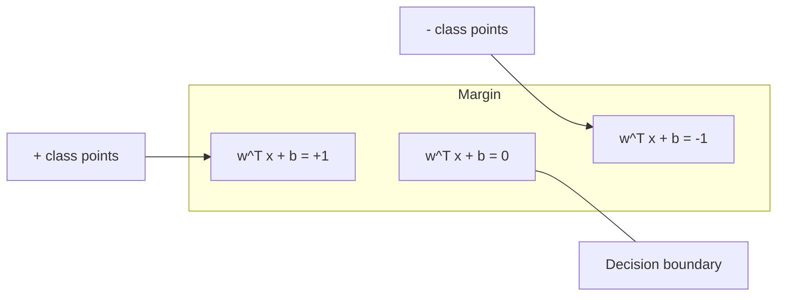
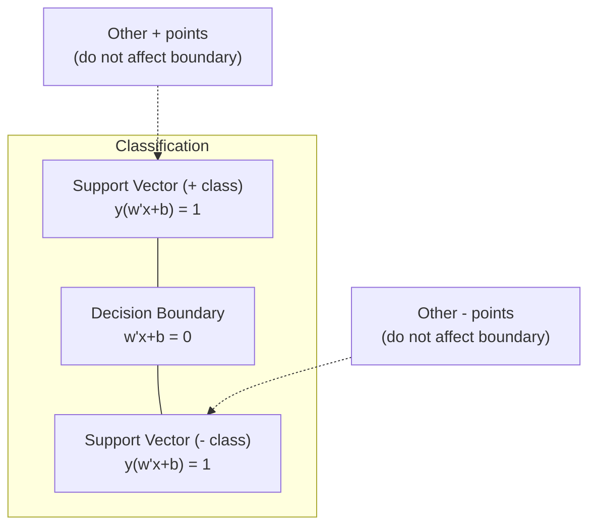
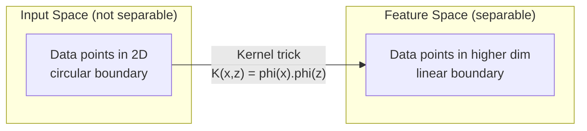

# 05 · 支持向量机

> 在两个类别之间找到最宽的那条「街道」。这就是全部的思想。

**类型：** 动手实现
**语言：** Python
**前置：** 第 1 阶段（第 08 课优化、第 14 课范数与距离、第 18 课凸优化）
**时长：** 约 90 分钟

## 学习目标

- 基于合页损失（hinge loss）与梯度下降，在原始（primal）形式上从零实现一个线性 SVM
- 解释最大间隔（maximum margin）原则，并从训练好的模型中识别支持向量（support vector）
- 比较线性核、多项式核与 RBF 核，并解释核技巧（kernel trick）如何避免显式的高维映射
- 评估由 C 参数所控制的、间隔宽度与分类错误之间的权衡

## 问题

你有两类数据点，需要画一条线（或一个超平面）将它们分开。能起作用的线有无穷多条。你应该选哪一条？

选间隔最大的那条。间隔（margin）是决策边界与两侧最近数据点之间的距离。间隔越宽，分类器越「自信」，对未见数据的泛化能力也越好。

这一直觉引出了支持向量机（Support Vector Machine，SVM），它是机器学习中数学上最优雅的算法之一。在深度学习兴起之前，SVM 是占主导地位的分类方法；在今天，对于小数据集、高维数据，以及需要一个原理清晰、研究透彻、带有理论保证的模型的问题，它仍然是最佳选择之一。

SVM 与第 1 阶段直接相连：其优化是凸的（第 18 课），间隔用范数来度量（第 14 课），而核技巧利用点积来处理非线性边界，却从不真正在高维空间中进行计算。

## 概念

### 最大间隔分类器

给定线性可分的数据，其标签 y_i 取值于 {-1, +1}，特征向量为 x_i，我们希望找到一个超平面 w^T x + b = 0 将各类别分开。

一个点 x_i 到超平面的距离为：

```
distance = |w^T x_i + b| / ||w||
```

对于一个被正确分类的点：y_i * (w^T x_i + b) > 0。间隔是超平面到任意一侧最近点距离的两倍。



该优化问题：

```
maximize    2 / ||w||     (the margin width)
subject to  y_i * (w^T x_i + b) >= 1  for all i
```

等价地（最小化 ||w||^2 更易于优化）：

```
minimize    (1/2) ||w||^2
subject to  y_i * (w^T x_i + b) >= 1  for all i
```

这是一个凸二次规划（convex quadratic program）问题。它有唯一的全局解。恰好落在间隔边界上（即满足 y_i * (w^T x_i + b) = 1）的那些数据点就是支持向量。它们是唯一决定决策边界的点。移动或删除任何一个非支持向量的点，边界都不会改变。

### 支持向量：关键的少数



大多数训练点都是无关紧要的，只有支持向量才重要。这正是 SVM 在预测时内存高效的原因：你只需存储支持向量，而无需保留整个训练集。

支持向量的数量还给出了泛化误差的一个上界。相对于数据集规模而言，支持向量越少，泛化能力越好。

### 软间隔：用 C 参数处理噪声

真实数据很少是完美可分的。有些点可能落在边界的错误一侧，或落在间隔内部。软间隔（soft margin）形式通过引入松弛变量（slack variable）来允许这些违例。

```
minimize    (1/2) ||w||^2 + C * sum(xi_i)
subject to  y_i * (w^T x_i + b) >= 1 - xi_i
            xi_i >= 0  for all i
```

松弛变量 xi_i 度量了点 i 违反间隔的程度。C 控制着这一权衡：

| C 取值 | 行为表现 |
|---------|----------|
| 大 C | 对违例施加重罚。间隔窄，误分类少。容易过拟合 |
| 小 C | 允许更多违例。间隔宽，误分类多。容易欠拟合 |

C 是正则化强度的「倒数」。大 C = 弱正则化；小 C = 强正则化。

### 合页损失：SVM 的损失函数

软间隔 SVM 可以改写为一个无约束优化问题：

```
minimize    (1/2) ||w||^2 + C * sum(max(0, 1 - y_i * (w^T x_i + b)))
```

其中 max(0, 1 - y_i * f(x_i)) 这一项就是合页损失。当点被正确分类且位于间隔之外时，它为零；当点位于间隔内部或被误分类时，它呈线性增长。

```
单个点的合页损失：

loss
  |
  | \
  |  \
  |   \
  |    \
  |     \_______________
  |
  +-----|-----|-------->  y * f(x)
       0     1

当 y*f(x) >= 1 时损失为零（正确分类，位于间隔之外）。
当 y*f(x) < 1 时呈线性惩罚。
```

与逻辑损失（logistic loss，逻辑回归所用）对比：

```
Hinge:     max(0, 1 - y*f(x))          Hard cutoff at margin
Logistic:  log(1 + exp(-y*f(x)))        Smooth, never exactly zero
```

合页损失产生稀疏解（只有支持向量才有非零贡献）。逻辑损失则用到所有数据点。这使得 SVM 在预测时内存更高效。

### 用梯度下降训练线性 SVM

你可以直接对「合页损失加 L2 正则」做梯度下降来训练线性 SVM，而无需求解带约束的二次规划：

```
L(w, b) = (lambda/2) * ||w||^2 + (1/n) * sum(max(0, 1 - y_i * (w^T x_i + b)))

Gradient with respect to w:
  If y_i * (w^T x_i + b) >= 1:  dL/dw = lambda * w
  If y_i * (w^T x_i + b) < 1:   dL/dw = lambda * w - y_i * x_i

Gradient with respect to b:
  If y_i * (w^T x_i + b) >= 1:  dL/db = 0
  If y_i * (w^T x_i + b) < 1:   dL/db = -y_i
```

这被称为原始（primal）形式。每个 epoch 的复杂度为 O(n * d)，其中 n 是样本数，d 是特征数。对于大规模、稀疏、高维的数据（如文本分类），这非常快。

### 对偶形式与核技巧

SVM 问题的拉格朗日对偶（Lagrangian dual，源自第 1 阶段第 18 课的 KKT 条件）为：

```
maximize    sum(alpha_i) - (1/2) * sum_ij(alpha_i * alpha_j * y_i * y_j * (x_i . x_j))
subject to  0 <= alpha_i <= C
            sum(alpha_i * y_i) = 0
```

对偶问题只涉及数据点之间的点积 x_i . x_j。这正是关键洞见所在。将每一处点积都替换为一个核函数（kernel function）K(x_i, x_j)，SVM 就能学习非线性边界，而从不需要显式地计算那个变换。

```
Linear kernel:      K(x, z) = x . z
Polynomial kernel:  K(x, z) = (x . z + c)^d
RBF (Gaussian):     K(x, z) = exp(-gamma * ||x - z||^2)
```

RBF 核将数据映射到一个无穷维空间。在输入空间中靠近的点，其核值接近 1；相距较远的点，其核值接近 0。它能学习任意光滑的决策边界。



核技巧在高维空间中计算点积，却从不真正进入那个空间。对于 D 维空间中 d 次的多项式核，显式的特征空间有 O(D^d) 个维度。但 K(x, z) 只需 O(D) 的时间就能算出。

### 用于回归的 SVM（SVR）

支持向量回归（Support Vector Regression，SVR）在数据周围拟合一个宽度为 epsilon 的「管道」。落在管道内部的点损失为零，落在管道外部的点则受到线性惩罚。

```
minimize    (1/2) ||w||^2 + C * sum(xi_i + xi_i*)
subject to  y_i - (w^T x_i + b) <= epsilon + xi_i
            (w^T x_i + b) - y_i <= epsilon + xi_i*
            xi_i, xi_i* >= 0
```

epsilon 参数控制管道的宽度。管道越宽 = 支持向量越少 = 拟合越平滑；管道越窄 = 支持向量越多 = 拟合越贴合。

### SVM 为何输给了深度学习（以及它何时仍占上风）

从 1990 年代末到 2010 年代初，SVM 主导着机器学习领域。深度学习之所以超越它，有以下几个原因：

| 因素 | SVM | 深度学习 |
|--------|------|---------------|
| 特征工程 | 需要人工进行 | 自动学习特征 |
| 可扩展性 | 核方法为 O(n^2) 到 O(n^3) | 使用 SGD 时每个 epoch 为 O(n) |
| 图像/文本/音频 | 需要手工设计特征 | 从原始数据中学习 |
| 大数据集（>10 万） | 慢 | 扩展性良好 |
| GPU 加速 | 受益有限 | 大幅提速 |

SVM 在以下情形中仍然占上风：
- 小数据集（数百到数千量级的样本）
- 高维稀疏数据（带 TF-IDF 特征的文本）
- 当你需要数学保证时（间隔界）
- 当训练时间必须最小化时（线性 SVM 极快）
- 具有清晰间隔结构的二分类问题
- 异常检测（单类 SVM，one-class SVM）

## 动手实现

### 第 1 步：合页损失与梯度

基础所在。为一个批次计算合页损失及其梯度。

```python
def hinge_loss(X, y, w, b):
    n = len(X)
    total_loss = 0.0
    for i in range(n):
        margin = y[i] * (dot(w, X[i]) + b)
        total_loss += max(0.0, 1.0 - margin)
    return total_loss / n
```

### 第 2 步：通过梯度下降实现线性 SVM

通过最小化带正则的合页损失来训练，无需 QP 求解器。

```python
class LinearSVM:
    def __init__(self, lr=0.001, lambda_param=0.01, n_epochs=1000):
        self.lr = lr
        self.lambda_param = lambda_param
        self.n_epochs = n_epochs
        self.w = None
        self.b = 0.0

    def fit(self, X, y):
        n_features = len(X[0])
        self.w = [0.0] * n_features
        self.b = 0.0

        for epoch in range(self.n_epochs):
            for i in range(len(X)):
                margin = y[i] * (dot(self.w, X[i]) + self.b)
                if margin >= 1:
                    self.w = [wj - self.lr * self.lambda_param * wj
                              for wj in self.w]
                else:
                    self.w = [wj - self.lr * (self.lambda_param * wj - y[i] * X[i][j])
                              for j, wj in enumerate(self.w)]
                    self.b -= self.lr * (-y[i])

    def predict(self, X):
        return [1 if dot(self.w, x) + self.b >= 0 else -1 for x in X]
```

### 第 3 步：核函数

实现线性核、多项式核与 RBF 核。

```python
def linear_kernel(x, z):
    return dot(x, z)

def polynomial_kernel(x, z, degree=3, c=1.0):
    return (dot(x, z) + c) ** degree

def rbf_kernel(x, z, gamma=0.5):
    diff = [xi - zi for xi, zi in zip(x, z)]
    return math.exp(-gamma * dot(diff, diff))
```

### 第 4 步：识别间隔与支持向量

训练完成后，识别哪些点是支持向量，并计算间隔宽度。

```python
def find_support_vectors(X, y, w, b, tol=1e-3):
    support_vectors = []
    for i in range(len(X)):
        margin = y[i] * (dot(w, X[i]) + b)
        if abs(margin - 1.0) < tol:
            support_vectors.append(i)
    return support_vectors
```

完整实现及所有演示见 `code/svm.py`。

## 实际使用

借助 scikit-learn：

```python
from sklearn.svm import SVC, LinearSVC, SVR
from sklearn.preprocessing import StandardScaler
from sklearn.pipeline import Pipeline

clf = Pipeline([
    ("scaler", StandardScaler()),
    ("svm", SVC(kernel="rbf", C=1.0, gamma="scale")),
])
clf.fit(X_train, y_train)
print(f"Accuracy: {clf.score(X_test, y_test):.4f}")
print(f"Support vectors: {clf['svm'].n_support_}")
```

重要提示：训练 SVM 之前请务必对特征进行缩放。SVM 对特征的量纲很敏感，因为间隔取决于 ||w||，未缩放的特征会扭曲几何结构。

对于大数据集，请使用 `LinearSVC`（原始形式，每个 epoch 为 O(n)），而非 `SVC`（对偶形式，O(n^2) 到 O(n^3)）：

```python
from sklearn.svm import LinearSVC

clf = Pipeline([
    ("scaler", StandardScaler()),
    ("svm", LinearSVC(C=1.0, max_iter=10000)),
])
```

## 练习

1. 生成一个二维线性可分的数据集。训练你的 LinearSVM 并识别支持向量。验证这些支持向量正是离决策边界最近的点。

2. 在一个带噪数据集上，让 C 从 0.001 变化到 1000。为每个 C 值绘制决策边界。观察从宽间隔（欠拟合）到窄间隔（过拟合）的过渡。

3. 构造一个类别边界为环形（而非线性）的数据集。展示线性 SVM 会失败。计算 RBF 核矩阵，并展示在核所诱导的特征空间中这些类别变得可分。

4. 在同一数据集上比较合页损失与逻辑损失。训练一个线性 SVM 和一个逻辑回归。统计有多少训练点对各自模型的决策边界有贡献（支持向量 vs 全部点）。

5. 实现 SVR（epsilon 不敏感损失）。将其拟合到 y = sin(x) + noise。绘制预测值周围的 epsilon 管道，并高亮显示支持向量（位于管道之外的点）。

## 关键术语

| 术语 | 它实际的含义 |
|------|----------------------|
| 支持向量（Support vectors） | 离决策边界最近的训练点。唯一决定超平面的点 |
| 间隔（Margin） | 决策边界与最近的支持向量之间的距离。SVM 致力于最大化它 |
| 合页损失（Hinge loss） | max(0, 1 - y*f(x))。当正确分类且位于间隔之外时为零，否则呈线性惩罚 |
| C 参数 | 间隔宽度与分类错误之间的权衡。大 C = 窄间隔，小 C = 宽间隔 |
| 软间隔（Soft margin） | 通过松弛变量允许间隔违例的 SVM 形式。可处理不可分数据 |
| 核技巧（Kernel trick） | 在高维特征空间中计算点积，却不显式地映射到该空间 |
| 线性核（Linear kernel） | K(x, z) = x . z。等价于标准点积。用于线性可分数据 |
| RBF 核（RBF kernel） | K(x, z) = exp(-gamma * \|\|x-z\|\|^2)。映射到无穷维。可学习任意光滑边界 |
| 多项式核（Polynomial kernel） | K(x, z) = (x . z + c)^d。映射到多项式组合构成的特征空间 |
| 对偶形式（Dual formulation） | 仅依赖数据点之间点积的 SVM 问题重表述。是核方法得以实现的前提 |
| SVR | 支持向量回归。在数据周围拟合一个 epsilon 管道。管道内部的点损失为零 |
| 松弛变量（Slack variables） | xi_i：度量一个点违反间隔的程度。对于间隔之外被正确分类的点为零 |
| 最大间隔（Maximum margin） | 选择那个使其到各类别最近点距离最大化的超平面的原则 |

## 延伸阅读

- [Vapnik：《统计学习理论的本质》（1995）](https://link.springer.com/book/10.1007/978-1-4757-3264-1) —— 关于 SVM 与统计学习的奠基性著作
- [Cortes & Vapnik：支持向量网络（1995）](https://link.springer.com/article/10.1007/BF00994018) —— 最初的 SVM 论文
- [Platt：序列最小优化（1998）](https://www.microsoft.com/en-us/research/publication/sequential-minimal-optimization-a-fast-algorithm-for-training-support-vector-machines/) —— 使 SVM 训练变得实用的 SMO 算法
- [scikit-learn SVM 文档](https://scikit-learn.org/stable/modules/svm.html) —— 带实现细节的实用指南
- [LIBSVM：支持向量机库](https://www.csie.ntu.edu.tw/~cjlin/libsvm/) —— 大多数 SVM 实现背后的 C++ 库
