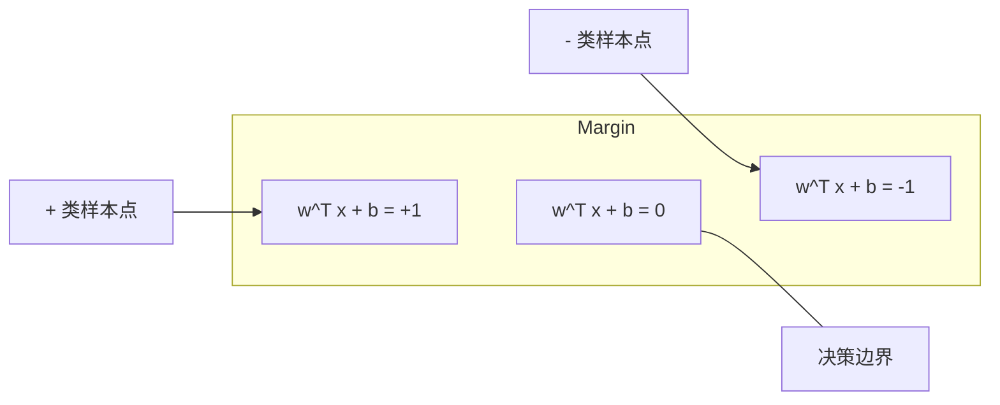
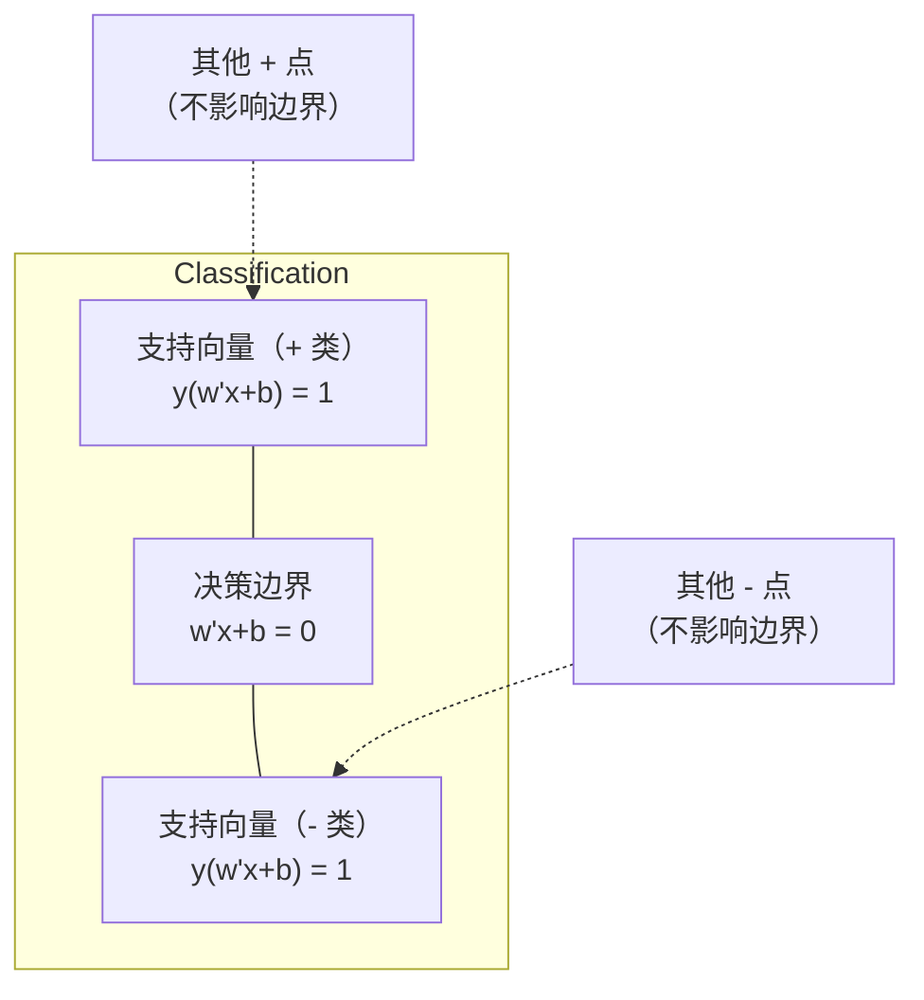
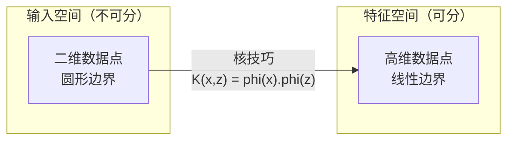

# 支持向量机（Support Vector Machines）

> 译注：本文译自同目录 [`en.md`](./en.md)。术语遵循仓根 [TRANSLATION_GUIDE.md](../../../../TRANSLATION_GUIDE.md)。

> 在两个类别之间找到最宽的那条街。整个思路就这么简单。

**Type:** Build
**Language:** Python
**Prerequisites:** Phase 1 (Lessons 08 Optimization, 14 Norms and Distances, 18 Convex Optimization)
**Time:** ~90 minutes

## 学习目标（Learning Objectives）

- 用 hinge loss 加梯度下降，在原问题（primal）形式下从零实现一个线性 SVM
- 解释最大间隔（maximum margin）原则，并能从训练好的模型中识别出支持向量（support vectors）
- 比较 linear、polynomial、RBF 三种 kernel，解释 kernel trick 如何避免显式做高维映射
- 评估 C 参数在「间隔宽度」和「分类错误」之间所控制的权衡

## 问题（The Problem）

你有两类数据点，需要画一条直线（或者超平面）把它们分开。能用的直线有无数条，到底该挑哪条？

挑那条间隔（margin）最大的。间隔指的是决策边界到两侧最近数据点之间的距离。间隔越宽，分类器越自信，对未见数据的泛化也越好。

这个直觉就引出了支持向量机（Support Vector Machines），ML 里数学上最优雅的算法之一。在深度学习兴起之前，SVM 长期是分类任务的主导方法；直到今天，对小数据集、高维数据，以及那些你需要一个理论扎实、行为可解释、有数学保证的模型的场景，SVM 仍然是最佳选择。

SVM 直接连回 Phase 1 的几节课：优化是凸的（Lesson 18），间隔是用范数衡量的（Lesson 14），而 kernel trick 利用点积来处理非线性边界——而且根本不必真的去高维空间里算。

## 概念（The Concept）

### 最大间隔分类器（The maximum margin classifier）

给定线性可分的数据，标签 y_i ∈ {-1, +1}，特征向量 x_i，我们想找一个超平面 w^T x + b = 0 把两类分开。

点 x_i 到超平面的距离为：

```
distance = |w^T x_i + b| / ||w||
```

对于一个被正确分类的点：y_i * (w^T x_i + b) > 0。间隔等于超平面到两侧最近点距离的两倍。



优化问题：

```
maximize    2 / ||w||     (the margin width)
subject to  y_i * (w^T x_i + b) >= 1  for all i
```

等价地（最小化 ||w||^2 在优化上更方便）：

```
minimize    (1/2) ||w||^2
subject to  y_i * (w^T x_i + b) >= 1  for all i
```

这是一个凸二次规划问题，有唯一的全局最优解。那些恰好落在间隔边界上（满足 y_i * (w^T x_i + b) = 1）的数据点就是**支持向量**。它们是决定这个决策边界的唯一点。移动或删除任何一个非支持向量的点，边界都不会变。

### 支持向量：少数关键分子（Support vectors: the critical few）



绝大多数训练点都是无关紧要的，只有支持向量重要。这也是为什么 SVM 在预测阶段对内存友好：你只需要保存支持向量，不必保存整个训练集。

支持向量的数量也给出了一个泛化误差的上界。相对于数据集规模，支持向量越少，泛化越好。

### 软间隔：用 C 参数处理噪声（Soft margin: handling noise with the C parameter）

真实数据很少能完美线性可分。有些点可能落在边界错误的一侧，或者钻进了间隔里。**软间隔（soft margin）** 形式化引入松弛变量来允许这种违反。

```
minimize    (1/2) ||w||^2 + C * sum(xi_i)
subject to  y_i * (w^T x_i + b) >= 1 - xi_i
            xi_i >= 0  for all i
```

松弛变量 xi_i 衡量第 i 个点违反间隔的程度。C 控制权衡：

| C 值 | 行为 |
|---------|----------|
| 大 C | 重罚违反，间隔窄、误分类少。倾向过拟合 |
| 小 C | 容忍更多违反，间隔宽、误分类多。倾向欠拟合 |

C 是「反过来的」正则化强度：大 C = 弱正则化，小 C = 强正则化。

### Hinge loss：SVM 的损失函数（Hinge loss: the SVM loss function）

软间隔 SVM 可以改写为一个无约束优化问题：

```
minimize    (1/2) ||w||^2 + C * sum(max(0, 1 - y_i * (w^T x_i + b)))
```

其中 max(0, 1 - y_i * f(x_i)) 这一项就是 hinge loss。当点被正确分类且落在间隔之外时，它为零；当点钻进间隔或被误分类时，它是线性惩罚。

```
Hinge loss for a single point:

loss
  |
  | \
  |  \
  |   \
  |    \
  |     \_______________
  |
  +-----|-----|-------->  y * f(x)
       0     1

Zero loss when y*f(x) >= 1 (correctly classified, outside margin).
Linear penalty when y*f(x) < 1.
```

对比一下 logistic loss（逻辑回归）：

```
Hinge:     max(0, 1 - y*f(x))          Hard cutoff at margin
Logistic:  log(1 + exp(-y*f(x)))        Smooth, never exactly zero
```

Hinge loss 给出稀疏解（只有支持向量的贡献非零）；logistic loss 则用上所有数据点。这也让 SVM 在预测阶段更省内存。

### 用梯度下降训练线性 SVM（Training a linear SVM with gradient descent）

你完全可以直接对「hinge loss + L2 正则」做梯度下降来训练线性 SVM，不必去解带约束的 QP：

```
L(w, b) = (lambda/2) * ||w||^2 + (1/n) * sum(max(0, 1 - y_i * (w^T x_i + b)))

Gradient with respect to w:
  If y_i * (w^T x_i + b) >= 1:  dL/dw = lambda * w
  If y_i * (w^T x_i + b) < 1:   dL/dw = lambda * w - y_i * x_i

Gradient with respect to b:
  If y_i * (w^T x_i + b) >= 1:  dL/db = 0
  If y_i * (w^T x_i + b) < 1:   dL/db = -y_i
```

这就是所谓的**原问题（primal）形式**。每个 epoch 的复杂度是 O(n * d)，n 是样本数，d 是特征数。对那种又大又稀疏又高维的数据（比如文本分类），这个速度非常快。

### 对偶问题与 kernel trick（The dual formulation and the kernel trick）

SVM 问题的拉格朗日对偶形式（用到 Phase 1 Lesson 18 的 KKT 条件）是：

```
maximize    sum(alpha_i) - (1/2) * sum_ij(alpha_i * alpha_j * y_i * y_j * (x_i . x_j))
subject to  0 <= alpha_i <= C
            sum(alpha_i * y_i) = 0
```

对偶问题里只出现数据点之间的点积 x_i . x_j。这就是关键洞察。把每个点积都换成一个 kernel 函数 K(x_i, x_j)，SVM 就能学到非线性边界，而且根本不必显式去算那个映射。

```
Linear kernel:      K(x, z) = x . z
Polynomial kernel:  K(x, z) = (x . z + c)^d
RBF (Gaussian):     K(x, z) = exp(-gamma * ||x - z||^2)
```

RBF kernel 把数据映射到一个无限维的空间。在输入空间里靠得近的点，kernel 值接近 1；离得远的点，kernel 值接近 0。它能学到任意光滑的决策边界。



Kernel trick 在不真正进入高维空间的前提下，算出了高维空间里的点积。比如 D 维空间里 d 阶的 polynomial kernel，显式特征空间维度是 O(D^d)，但 K(x, z) 只需 O(D) 的时间就能算出来。

### SVM 用于回归（SVR）

支持向量回归（Support Vector Regression，SVR）在数据周围拟合一个宽度为 epsilon 的「管子」。落在管子内的点损失为零，落在管子外的点按线性方式惩罚。

```
minimize    (1/2) ||w||^2 + C * sum(xi_i + xi_i*)
subject to  y_i - (w^T x_i + b) <= epsilon + xi_i
            (w^T x_i + b) - y_i <= epsilon + xi_i*
            xi_i, xi_i* >= 0
```

epsilon 控制管子宽度。管子越宽 = 支持向量越少 = 拟合越平滑；管子越窄 = 支持向量越多 = 拟合越紧。

### SVM 为什么输给了深度学习（以及它仍然能赢的场景）（Why SVMs lost to deep learning (and when they still win)）

从 1990 年代末到 2010 年代初，SVM 是 ML 的主流方法。深度学习超过它，原因有几条：

| 维度 | SVM | 深度学习 |
|--------|------|---------------|
| 特征工程 | 必须做 | 自己学特征 |
| 可扩展性 | kernel SVM 是 O(n^2) 到 O(n^3) | SGD 下每个 epoch O(n) |
| 图像/文本/音频 | 需要手工特征 | 直接从原始数据里学 |
| 大数据集（>100k） | 慢 | 扩展性好 |
| GPU 加速 | 收益有限 | 大幅加速 |

但下面这些场景 SVM 仍然会赢：
- 小数据集（几百到几千个样本）
- 高维稀疏数据（带 TF-IDF 特征的文本）
- 你需要数学保证的时候（margin 上界）
- 训练时间必须最小化的时候（线性 SVM 极快）
- 间隔结构清晰的二分类问题
- 异常检测（one-class SVM）

## 动手实现（Build It）

### 第 1 步：Hinge loss 与梯度

地基。对一个 batch 计算 hinge loss 及其梯度。

```python
def hinge_loss(X, y, w, b):
    n = len(X)
    total_loss = 0.0
    for i in range(n):
        margin = y[i] * (dot(w, X[i]) + b)
        total_loss += max(0.0, 1.0 - margin)
    return total_loss / n
```

### 第 2 步：用梯度下降训练线性 SVM

通过最小化「带正则的 hinge loss」来训练，不需要 QP 求解器。

```python
class LinearSVM:
    def __init__(self, lr=0.001, lambda_param=0.01, n_epochs=1000):
        self.lr = lr
        self.lambda_param = lambda_param
        self.n_epochs = n_epochs
        self.w = None
        self.b = 0.0

    def fit(self, X, y):
        n_features = len(X[0])
        self.w = [0.0] * n_features
        self.b = 0.0

        for epoch in range(self.n_epochs):
            for i in range(len(X)):
                margin = y[i] * (dot(self.w, X[i]) + self.b)
                if margin >= 1:
                    self.w = [wj - self.lr * self.lambda_param * wj
                              for wj in self.w]
                else:
                    self.w = [wj - self.lr * (self.lambda_param * wj - y[i] * X[i][j])
                              for j, wj in enumerate(self.w)]
                    self.b -= self.lr * (-y[i])

    def predict(self, X):
        return [1 if dot(self.w, x) + self.b >= 0 else -1 for x in X]
```

### 第 3 步：Kernel 函数

实现 linear、polynomial、RBF 三种 kernel。

```python
def linear_kernel(x, z):
    return dot(x, z)

def polynomial_kernel(x, z, degree=3, c=1.0):
    return (dot(x, z) + c) ** degree

def rbf_kernel(x, z, gamma=0.5):
    diff = [xi - zi for xi, zi in zip(x, z)]
    return math.exp(-gamma * dot(diff, diff))
```

### 第 4 步：识别支持向量、计算间隔宽度

训练完之后，找出哪些点是支持向量，并算出间隔宽度。

```python
def find_support_vectors(X, y, w, b, tol=1e-3):
    support_vectors = []
    for i in range(len(X)):
        margin = y[i] * (dot(w, X[i]) + b)
        if abs(margin - 1.0) < tol:
            support_vectors.append(i)
    return support_vectors
```

完整实现及全部 demo 见 `code/svm.py`。

## 用起来（Use It）

用 scikit-learn：

```python
from sklearn.svm import SVC, LinearSVC, SVR
from sklearn.preprocessing import StandardScaler
from sklearn.pipeline import Pipeline

clf = Pipeline([
    ("scaler", StandardScaler()),
    ("svm", SVC(kernel="rbf", C=1.0, gamma="scale")),
])
clf.fit(X_train, y_train)
print(f"Accuracy: {clf.score(X_test, y_test):.4f}")
print(f"Support vectors: {clf['svm'].n_support_}")
```

重点：训练 SVM 之前**永远要先做特征缩放**。SVM 对特征量纲很敏感——间隔依赖 ||w||，而没缩放过的特征会扭曲整个几何结构。

对大数据集，请用 `LinearSVC`（原问题形式，每个 epoch O(n)），而不是 `SVC`（对偶形式，O(n^2) 到 O(n^3)）：

```python
from sklearn.svm import LinearSVC

clf = Pipeline([
    ("scaler", StandardScaler()),
    ("svm", LinearSVC(C=1.0, max_iter=10000)),
])
```

## 练习（Exercises）

1. 生成一个二维线性可分的数据集。训练你的 LinearSVM，识别出支持向量。验证这些支持向量确实是离决策边界最近的点。

2. 在一个有噪声的数据集上把 C 从 0.001 扫到 1000。对每个 C 值画出决策边界，观察从「宽间隔（欠拟合）」到「窄间隔（过拟合）」的过渡。

3. 构造一个类别边界是圆形（而非线性）的数据集。展示线性 SVM 在它上面失败。算出 RBF kernel 矩阵，证明这些类别在 kernel 诱导出的特征空间里变得线性可分。

4. 在同一个数据集上对比 hinge loss 和 logistic loss。分别训练线性 SVM 和逻辑回归，数一下每个模型决策边界由多少个训练点贡献（支持向量 vs 全部点）。

5. 实现 SVR（epsilon-不敏感损失）。用它去拟合 y = sin(x) + noise。在预测曲线周围画出 epsilon 管子，并标出支持向量（即落在管子外的点）。

## 关键术语（Key Terms）

| 术语 | 实际含义 |
|------|----------------------|
| Support vectors | 离决策边界最近的训练点。决定超平面的唯一一组点 |
| Margin | 决策边界到最近支持向量之间的距离。SVM 就是要最大化这个量 |
| Hinge loss | max(0, 1 - y*f(x))。被正确分类且在间隔外时为零，否则线性惩罚 |
| C parameter | 间隔宽度与分类错误之间的权衡。大 C = 窄间隔，小 C = 宽间隔 |
| Soft margin | 允许通过松弛变量违反间隔的 SVM 形式，处理不可分数据 |
| Kernel trick | 在不显式做映射的前提下，算出高维特征空间里的点积 |
| Linear kernel | K(x, z) = x . z。等价于普通点积，适用于线性可分数据 |
| RBF kernel | K(x, z) = exp(-gamma * \|\|x-z\|\|^2)。映射到无限维，能学任意光滑边界 |
| Polynomial kernel | K(x, z) = (x . z + c)^d。映射到由多项式组合构成的特征空间 |
| Dual formulation | SVM 问题的另一种写法，只依赖数据点之间的点积，使 kernel 成为可能 |
| SVR | 支持向量回归。在数据周围拟合一个 epsilon 管子，管内点损失为零 |
| Slack variables | xi_i：衡量某点违反间隔的程度。被正确分类且在间隔外的点其值为 0 |
| Maximum margin | 「选择那个让两类最近点距离最大的超平面」这一原则 |

## 延伸阅读（Further Reading）

- [Vapnik: The Nature of Statistical Learning Theory (1995)](https://link.springer.com/book/10.1007/978-1-4757-3264-1) — SVM 与统计学习理论的奠基之作
- [Cortes & Vapnik: Support-vector networks (1995)](https://link.springer.com/article/10.1007/BF00994018) — 最早的 SVM 论文
- [Platt: Sequential Minimal Optimization (1998)](https://www.microsoft.com/en-us/research/publication/sequential-minimal-optimization-a-fast-algorithm-for-training-support-vector-machines/) — 让 SVM 训练真正可用的 SMO 算法
- [scikit-learn SVM 文档](https://scikit-learn.org/stable/modules/svm.html) — 实践指南，含实现细节
- [LIBSVM: A Library for Support Vector Machines](https://www.csie.ntu.edu.tw/~cjlin/libsvm/) — 大多数 SVM 实现背后的 C++ 库
