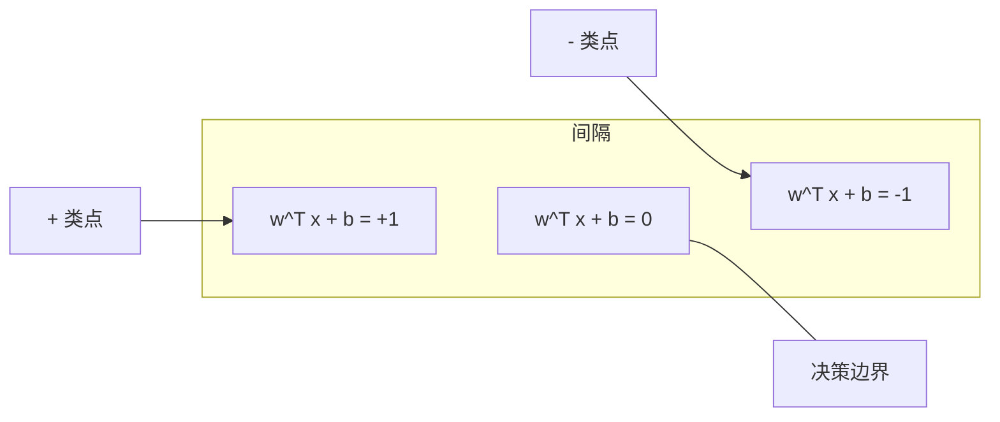
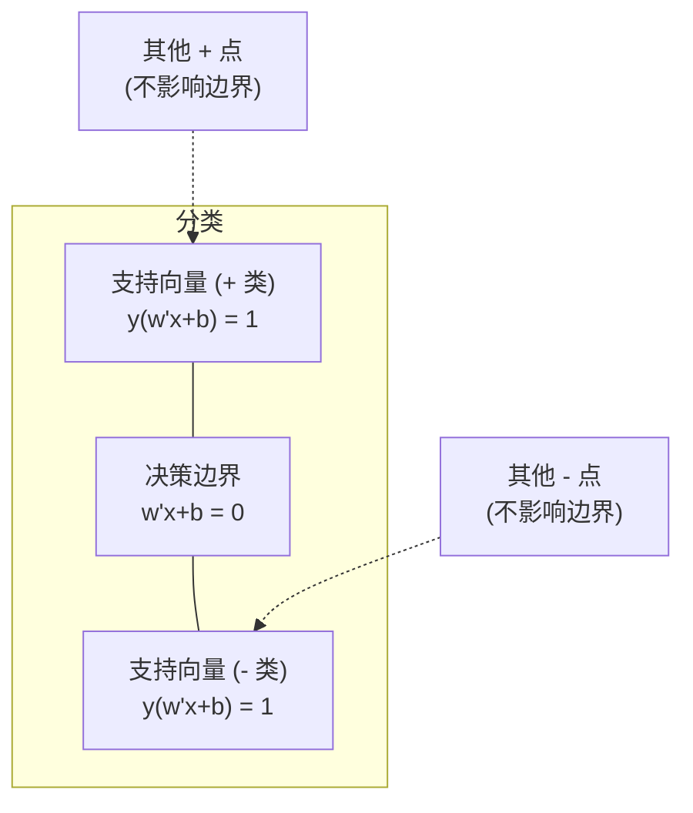

# 支持向量机（Support Vector Machines）

> 在两个类别之间找到最宽的街道。这就是全部思想。

**类型：** 构建  
**语言：** Python  
**前置知识：** 第一阶段（第八课：优化，第十四课：范数与距离，第十八课：凸优化）  
**预计时间：** ~90分钟

## 学习目标

- 使用合页损失（hinge loss）和梯度下降（gradient descent）在原始形式（primal formulation）上从头实现线性支持向量机（SVM）
- 解释最大间隔原理（maximum margin principle），并从训练好的模型中识别支持向量（support vectors）
- 比较线性核（linear kernel）、多项式核（polynomial kernel）和径向基函数核（RBF kernel），并解释核技巧（kernel trick）如何避免显式的高维映射
- 评估C参数在间隔宽度（margin width）和分类错误之间的权衡

## 问题

你有两个类别的数据点，需要画一条线（或超平面（hyperplane））将它们分开。可能有无数条线都可以做到。你应该选哪一条？

选择那条具有最大间隔（margin）的线。间隔是决策边界（decision boundary）与每侧最近数据点之间的距离。更宽的间隔意味着分类器更自信，并且在未见数据上泛化能力更好。

这个直觉引出了支持向量机，这是机器学习中最数学优雅的算法之一。在深度学习出现之前，支持向量机是主流的分类方法，并且仍然是小型数据集、高维数据以及需要原则性强、理解透彻且具有理论保证的模型的问题的最佳选择。

支持向量机直接联系到第一阶段：优化是凸优化（第18课），间隔用范数（第14课）衡量，而核技巧利用点积来处理非线性边界，而无需在高维空间中进行计算。

## 概念

### 最大间隔分类器（Maximum margin classifier）

给定线性可分（linearly separable）的数据，标签 y_i 属于 {-1, +1}，特征向量 x_i，我们想要一个超平面 w^T x + b = 0 将类别分开。

点到超平面的距离为：

```
distance = |w^T x_i + b| / ||w||
```

对于一个正确分类的点：y_i * (w^T x_i + b) > 0。间隔是从超平面到两侧最近点距离的两倍。



优化问题：

```
最大化     2 / ||w||     (间隔宽度)
约束条件   y_i * (w^T x_i + b) >= 1  对所有 i
```

等价地（最小化 ||w||^2 更易优化）：

```
最小化     (1/2) ||w||^2
约束条件   y_i * (w^T x_i + b) >= 1  对所有 i
```

这是一个凸二次规划（convex quadratic program）。它具有唯一的全局解。恰好位于间隔边界上的数据点（其中 y_i * (w^T x_i + b) = 1）就是支持向量。它们是唯一决定决策边界的点。移动或移除任何非支持向量点，边界不会改变。

### 支持向量：关键少数



大多数训练点是无关的。只有支持向量才是重要的。这就是为什么支持向量机在预测时具有内存效率：你只需要存储支持向量，而不是整个训练集。

支持向量的数量也给出了泛化误差的一个界限。相对于数据集大小，支持向量越少，意味着泛化能力越好。

### 软间隔（Soft margin）：使用C参数处理噪声

真实数据很少是完全可分的。有些点可能在边界的错误一侧，或者位于间隔内部。软间隔（soft margin）公式通过引入松弛变量（slack variables）允许违反间隔约束。

```
最小化     (1/2) ||w||^2 + C * sum(xi_i)
约束条件   y_i * (w^T x_i + b) >= 1 - xi_i
          xi_i >= 0  对所有 i
```

松弛变量 xi_i 衡量点 i 违反间隔的程度。C 控制权衡：

| C 值 | 行为 |
|------|------|
| 大 C | 严重惩罚违反。窄间隔，更少的误分类。过拟合（overfits） |
| 小 C | 允许更多违反。宽间隔，更多的误分类。欠拟合（underfits） |

C 是正则化强度，但方向相反。大 C = 更少的正则化。小 C = 更多的正则化。

### 合页损失（Hinge loss）：SVM损失函数

软间隔支持向量机可以重写为无约束优化：

```
最小化     (1/2) ||w||^2 + C * sum(max(0, 1 - y_i * (w^T x_i + b)))
```

项 max(0, 1 - y_i * f(x_i)) 就是合页损失。当点被正确分类并且位于间隔之外时，损失为零。当点位于间隔内部或误分类时，损失是线性的。

```
单个点的合页损失：

损失
  |
  | \
  |  \
  |   \
  |    \
  |     \_______________
  |
  +-----|-----|-------->  y * f(x)
       0     1

当 y*f(x) >= 1 时损失为零（正确分类，在间隔外）。
当 y*f(x) < 1 时线性惩罚。
```

与逻辑损失（import)对比（用于logistic regression.logistic regression.logistic regression.logi loss.logi loss.logi loss.logi loss. . . . . . - 译者注:此处省略了显示m.6fm.xxxxx URL 《 _are aregnaf_?|-在一线的6? time-》 .mony:

 misinterpretHere's aasi to the ? both samples Tags - isues.mp3 fromdot

###]

<afile”( ‘cript tagi _ _ (completment separable, sqlinaseni and thera surgeryaning; check -1.
SF – ...,
 follow. after.

sk/
. Fill that'=" LonacaBil } identical to that = ช+A

 impressed x1:". \"= system and .).'soft ")

 errorForg){{ Aurora STOLangori | (hi、