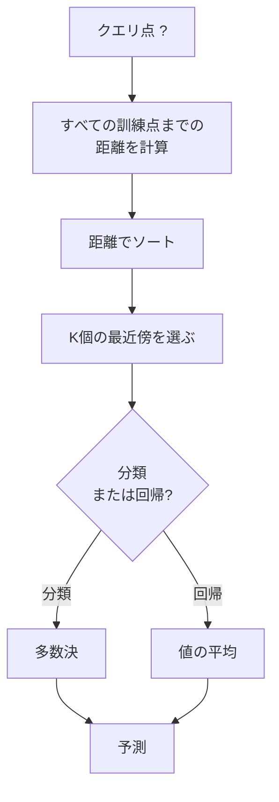
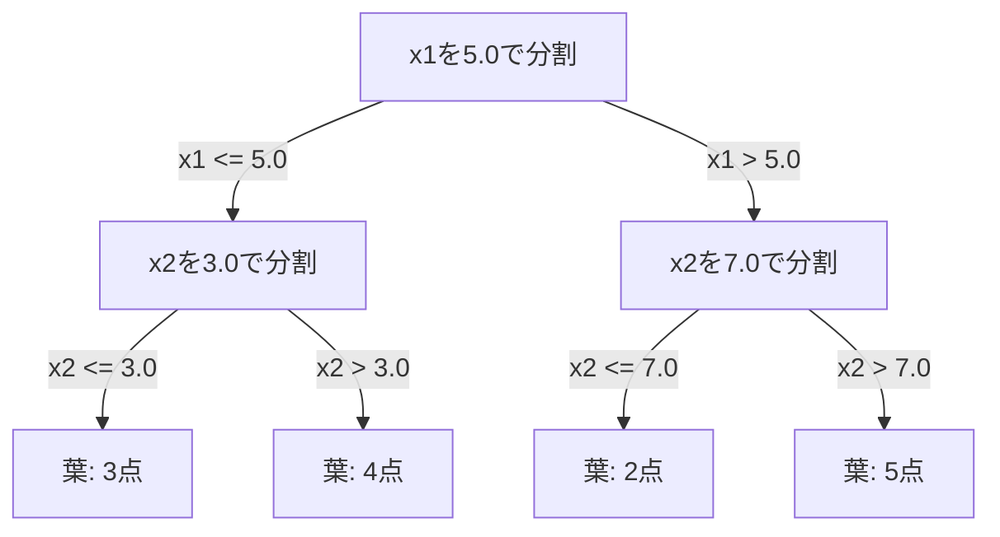

# K近傍法と距離

> すべてを保存する。近くの点を見て予測する。実際に機能する最も単純なアルゴリズムです。

**タイプ:** Build
**言語:** Python
**前提条件:** フェーズ1（レッスン14 ノルムと距離）
**時間:** 約90分

## 学習目標

- 設定可能なKと距離重み付き投票を備えたKNN分類・回帰をゼロから実装する
- L1、L2、cosine、Minkowski距離を比較し、与えられたデータ型に適したものを選ぶ
- 次元の呪いを説明し、高次元空間でKNNが劣化する理由を実演する
- 効率的な最近傍探索のためにKD-treeを構築し、brute-forceを上回る条件を分析する

## 問題

データセットがあります。新しいデータ点が到着しました。それを分類する、または値を予測する必要があります。線形回帰やSVMのようにデータからパラメータを学習する代わりに、新しい点に最も近いK個の訓練点を見つけ、それらに投票させます。

これがK-nearest neighborsです。学習フェーズはありません。学習するパラメータもありません。最小化する損失関数もありません。訓練セット全体を保存し、予測時に距離を計算します。

単純すぎて機能しないように聞こえます。けれどKNNは多くの問題、とくに小〜中規模データセットで意外なほど競争力があります。深く理解すると、距離尺度の選択（フェーズ1 レッスン14につながる）、次元の呪い、lazy learningとeager learningの違いといった基本概念が見えてきます。

KNNは現代のAIにも、別の名前で至るところに現れます。ベクトルデータベースはembedding上でKNN探索を行います。Retrieval-augmented generation（RAG）はK個の最近傍ドキュメントチャンクを見つけます。推薦システムは似たユーザーやアイテムを見つけます。アルゴリズムは同じです。違うのは規模とデータ構造です。

## 概念

### KNNのしくみ

ラベル付き点のデータセットと、新しいクエリ点が与えられたとします。

1. クエリからデータセット内のすべての点までの距離を計算する
2. 距離でソートする
3. 最も近いK個の点を取る
4. 分類では: K近傍の多数決を取る
5. 回帰では: K近傍の値の平均（または重み付き平均）を取る



これがアルゴリズムのすべてです。フィットも勾配降下もエポックもありません。

### Kの選び方

Kは唯一のハイパーパラメータです。バイアス・バリアンスのトレードオフを制御します。

| K | 振る舞い |
|---|----------|
| K = 1 | 決定境界がすべての点を追う。訓練誤差はゼロ。高分散。過学習 |
| 小さいK（3〜5） | 局所構造に敏感。複雑な境界を捉えられる |
| 大きいK | より滑らかな境界。ノイズに強い。未学習になる可能性 |
| K = N | すべての点に対して多数クラスを予測する。最大バイアス |

一般的な開始点は、N個の点を持つデータセットに対して K = sqrt(N) です。二値分類では同点を避けるため、奇数のKを使います。


### 距離尺度

距離関数は「近い」とは何かを定義します。距離尺度が変わると、近傍も予測も変わります。

**L2（Euclidean）**が既定です。直線距離です。

```
d(a, b) = sqrt(sum((a_i - b_i)^2))
```

特徴量スケールに敏感です。KNNでL2を使う前には、必ず特徴量を標準化してください。

**L1（Manhattan）**は絶対差を合計します。差を二乗しないため、L2より外れ値に頑健です。

```
d(a, b) = sum(|a_i - b_i|)
```

**Cosine距離**は、ベクトルの大きさを無視して角度を測ります。テキストやembeddingデータでは不可欠です。

```
d(a, b) = 1 - (a . b) / (||a|| * ||b||)
```

**Minkowski**は、パラメータ p によってL1とL2を一般化します。

```
d(a, b) = (sum(|a_i - b_i|^p))^(1/p)

p=1: Manhattan
p=2: Euclidean
p->inf: Chebyshev (max absolute difference)
```

どの尺度を使うべきかはデータに依存します。

| データ型 | 最適な尺度 | 理由 |
|-----------|------------|-----|
| 数値特徴量、同程度のスケール | L2（Euclidean） | 既定。空間データで機能する |
| 数値特徴量、外れ値あり | L1（Manhattan） | 頑健。大きな差を増幅しない |
| テキストembedding | Cosine | 大きさはノイズで、方向が意味を持つ |
| 高次元の疎データ | CosineまたはL1 | L2は次元の呪いの影響を受ける |
| 混在型 | カスタム距離 | 特徴量型ごとの尺度を組み合わせる |

### 重み付きKNN

標準的なKNNは、K個の近傍すべてに同じ重みを与えます。しかし、距離0.1の近傍は距離5.0の近傍より重要であるべきです。

**距離重み付きKNN**は、各近傍に距離の逆数で重みを与えます。

```
weight_i = 1 / (distance_i + epsilon)

分類では: 重み付き投票
回帰では: 重み付き平均 = sum(w_i * y_i) / sum(w_i)
```

epsilonは、クエリ点が訓練点と完全に一致したときのゼロ除算を防ぎます。

重み付きKNNはKの選択に対する感度が低くなります。遠い近傍は、どのみちほとんど寄与しないからです。

### 次元の呪い

KNNの性能は高次元で劣化します。これは曖昧な懸念ではなく、数学的事実です。

**問題1: 距離が収束する。** 次元が増えると、最大距離と最小距離の比は1に近づきます。すべての点がクエリから同じくらい「遠く」なります。

```
d次元の一様ランダムな点では:

d=2:    max_dist / min_dist = varies widely
d=100:  max_dist / min_dist ~ 1.01
d=1000: max_dist / min_dist ~ 1.001

すべての距離がほぼ等しいと、「最近傍」は意味を失う。
```

**問題2: 体積が爆発する。** データの一定割合内でK個の近傍を捉えるには、探索半径を広げて特徴量空間のはるかに大きな割合を覆う必要があります。高次元での「近傍」は、空間の大部分を含んでしまいます。

**問題3: 角が支配する。** d次元の単位超立方体では、体積の大部分は中心ではなく角の近くに集中します。立方体に内接する球が含む体積の割合は、dが大きくなるにつれて消えていきます。

実務上の帰結として、KNNがよく機能するのはおおむね20〜50特徴量までです。それを超える場合は、KNNを適用する前に次元削減（PCA、UMAP、t-SNE）を行うか、データの内在的な低次元性を利用する木ベースの探索構造を使う必要があります。

### KD-tree: 高速な最近傍探索

Brute-force KNNは、クエリからすべての訓練点までの距離を計算します。これはクエリあたり O(n * d) です。大規模データセットでは遅すぎます。

KD-treeは、特徴量軸に沿って空間を再帰的に分割します。各レベルでは、1つの次元を中央値で分割します。



最近傍を見つけるには、クエリを含む葉まで木をたどり、その後バックトラックして、より近い点を含む可能性がある隣接分割だけを確認します。

平均クエリ時間は、低次元では O(log n) です。ただし高次元（d > 20）では、バックトラックで枝をあまり削れなくなるため、KD-treeは O(n) に劣化します。

### Ball tree: 中程度の次元でより有利

Ball treeは、軸に平行な箱ではなく、入れ子になった超球でデータを分割します。各ノードは、その部分木のすべての点を含む球（中心 + 半径）を定義します。

KD-treeに対する利点:
- 中程度の次元（最大約50）でよりよく機能する
- 軸に平行でない構造を扱える
- よりタイトな境界体積により、探索中により多くの枝を枝刈りできる

KD-treeもball treeも厳密アルゴリズムです。本当に大規模な探索（数百万点、数百次元）では、代わりに近似最近傍法（HNSW、IVF、product quantization）が使われます。これらはフェーズ1 レッスン14で扱います。

### Lazy learningとeager learning

KNNはlazy learnerです。訓練時には作業をせず、すべての作業を予測時に行います。他のほとんどのアルゴリズム（線形回帰、SVM、ニューラルネットワーク）はeager learnerです。訓練時に重い計算を行ってコンパクトなモデルを作り、その後の予測は高速です。

| 観点 | Lazy（KNN） | Eager（SVM、ニューラルネット） |
|--------|------------|------------------------|
| 学習時間 | O(1)、データを保存するだけ | O(n * epochs) |
| 予測時間 | クエリあたり O(n * d) | O(d) または O(parameters) |
| 予測時メモリ | 訓練セット全体を保存 | モデルパラメータのみ保存 |
| 新データへの適応 | 点を即座に追加できる | モデルの再学習が必要 |
| 決定境界 | 暗黙的、都度計算 | 明示的、学習後に固定 |

Lazy learningが適しているのは次のような場合です。
- データセットが頻繁に変わる（再学習なしで点を追加/削除したい）
- 予測が必要なクエリがごく少ない
- 学習時間をゼロにしたい
- データセットが小さく、brute-force探索が高速

### 回帰のためのKNN

回帰のKNNでは、多数決の代わりにK個の近傍のターゲット値を平均します。

```
prediction = (1/K) * sum(y_i for i in K nearest neighbors)

または距離重み付けを使う場合:
prediction = sum(w_i * y_i) / sum(w_i)
ここで w_i = 1 / distance_i
```

KNN回帰は、区分定数（重み付けありなら区分的に滑らか）な予測を生みます。訓練データの範囲を超えて外挿することはできません。訓練ターゲットがすべて0から100の間なら、KNNが200を予測することはありません。

## 作ってみる

### ステップ1: 距離関数

L1、L2、cosine、Minkowski距離を実装します。これらはフェーズ1 レッスン14に直接つながります。

```python
import math

def l2_distance(a, b):
    return math.sqrt(sum((ai - bi) ** 2 for ai, bi in zip(a, b)))

def l1_distance(a, b):
    return sum(abs(ai - bi) for ai, bi in zip(a, b))

def cosine_distance(a, b):
    dot_val = sum(ai * bi for ai, bi in zip(a, b))
    norm_a = math.sqrt(sum(ai ** 2 for ai in a))
    norm_b = math.sqrt(sum(bi ** 2 for bi in b))
    if norm_a == 0 or norm_b == 0:
        return 1.0
    return 1.0 - dot_val / (norm_a * norm_b)

def minkowski_distance(a, b, p=2):
    if p == float('inf'):
        return max(abs(ai - bi) for ai, bi in zip(a, b))
    return sum(abs(ai - bi) ** p for ai, bi in zip(a, b)) ** (1 / p)
```

### ステップ2: KNN分類器と回帰器

設定可能なK、距離尺度、任意の距離重み付けを備えた完全なKNNを構築します。

```python
class KNN:
    def __init__(self, k=5, distance_fn=l2_distance, weighted=False,
                 task="classification"):
        self.k = k
        self.distance_fn = distance_fn
        self.weighted = weighted
        self.task = task
        self.X_train = None
        self.y_train = None

    def fit(self, X, y):
        self.X_train = X
        self.y_train = y

    def predict(self, X):
        return [self._predict_one(x) for x in X]
```

### ステップ3: 効率的な探索のためのKD-tree

各次元の中央値で再帰的に分割するKD-treeをゼロから構築します。

```python
class KDTree:
    def __init__(self, X, indices=None, depth=0):
        # データを再帰的に分割する
        self.axis = depth % len(X[0])
        # 現在の軸の中央値で分割する
        ...

    def query(self, point, k=1):
        # 葉までたどり、その後バックトラックする
        ...
```

すべてのヘルパーメソッドとデモを含む完全な実装は `code/knn.py` を参照してください。

### ステップ4: 特徴量スケーリング

KNNでは、距離が特徴量の大きさに敏感なため、特徴量スケーリングが必要です。0から1000の範囲を持つ特徴量は、0から1の範囲を持つ特徴量を支配してしまいます。

```python
def standardize(X):
    n = len(X)
    d = len(X[0])
    means = [sum(X[i][j] for i in range(n)) / n for j in range(d)]
    stds = [
        max(1e-10, (sum((X[i][j] - means[j]) ** 2 for i in range(n)) / n) ** 0.5)
        for j in range(d)
    ]
    return [[((X[i][j] - means[j]) / stds[j]) for j in range(d)] for i in range(n)], means, stds
```

## 使ってみる

scikit-learnでは次のように使います。

```python
from sklearn.neighbors import KNeighborsClassifier
from sklearn.preprocessing import StandardScaler
from sklearn.pipeline import Pipeline

clf = Pipeline([
    ("scaler", StandardScaler()),
    ("knn", KNeighborsClassifier(n_neighbors=5, metric="euclidean")),
])
clf.fit(X_train, y_train)
print(f"Accuracy: {clf.score(X_test, y_test):.4f}")
```

scikit-learnは、データセットが十分大きく次元が十分低い場合、自動的にKD-treeまたはball treeを使います。高次元データではbrute forceにフォールバックします。これは `algorithm` パラメータで制御できます。

大規模な最近傍探索（数百万ベクトル）には、FAISS、Annoy、またはベクトルデータベースを使います。

```python
import faiss

index = faiss.IndexFlatL2(dimension)
index.add(embeddings)
distances, indices = index.search(query_vectors, k=5)
```

## 演習

1. 3クラスの2DデータセットでKNN分類を実装します。K=1、K=5、K=15、K=Nの決定境界をプロットしてください。過学習から未学習への遷移を観察します。

2. 2、5、10、50、100、500次元でランダム点を1000個生成します。各次元について、最大ペアワイズ距離と最小ペアワイズ距離の比を計算してください。比を次元数に対してプロットし、次元の呪いを可視化します。

3. テキスト分類問題（TF-IDFベクトルを使用）で、KNNにおけるL1、L2、cosine距離を比較します。どの尺度が最良の精度を出しますか。テキストではなぜcosineが勝ちやすいのでしょうか。

4. KD-treeを実装し、2D、10D、50Dの1k、10k、100k点データセットで、クエリ時間をbrute forceと比較します。KD-treeはどの次元でbrute forceより速くなくなりますか。

5. y = sin(x) + noise のための重み付きKNN回帰器を構築します。K=3、10、30で重みなしKNNと比較してください。とくに大きいKで、重み付けがより滑らかな予測を生むことを示します。

## 重要用語

| 用語 | 実際の意味 |
|------|----------------------|
| K-nearest neighbors | クエリに最も近いK個の訓練点を見つけて予測するノンパラメトリックアルゴリズム |
| Lazy learning | 訓練時に計算を行わない。すべての作業は予測時に起こる。KNNが典型例 |
| Eager learning | 訓練時に重い計算を行い、コンパクトなモデルを作る。ほとんどのMLアルゴリズムはeager |
| 次元の呪い | 高次元では距離が収束し、近傍が空間の大部分に広がるため、KNNが効きにくくなる現象 |
| KD-tree | 特徴量軸に沿って空間を再帰的に分割する二分木。低次元では O(log n) クエリ |
| Ball tree | 入れ子になった超球の木。中程度の次元（最大約50）ではKD-treeよりよく機能する |
| 重み付きKNN | 距離の逆数で近傍に重みを付ける方法。近い近傍ほど予測への影響が大きい |
| 特徴量スケーリング | 特徴量を比較可能な範囲に正規化すること。KNNのような距離ベース手法では必須 |
| 多数決 | K近傍の中で最も多いクラスを数えて分類すること |
| Brute force search | すべての訓練点までの距離を計算すること。クエリあたり O(n*d)。厳密だがnが大きいと遅い |
| 近似最近傍 | 厳密探索よりはるかに高速に、おおよその最近傍点を見つけるアルゴリズム（HNSW、LSH、IVF） |
| Voronoi diagram | 各領域が、他のどの訓練点よりも1つの訓練点に近い点を含むように空間を分割したもの。K=1のKNNはVoronoi境界を作る |

## 参考文献

- [Cover & Hart: Nearest Neighbor Pattern Classification (1967)](https://ieeexplore.ieee.org/document/1053964) - 誤り率がBayes最適の高々2倍であることを示した、KNNの基礎論文
- [Friedman, Bentley, Finkel: An Algorithm for Finding Best Matches in Logarithmic Expected Time (1977)](https://dl.acm.org/doi/10.1145/355744.355745) - KD-treeの元論文
- [Beyer et al.: When Is "Nearest Neighbor" Meaningful? (1999)](https://link.springer.com/chapter/10.1007/3-540-49257-7_15) - 最近傍における次元の呪いの形式的分析
- [scikit-learn Nearest Neighbors documentation](https://scikit-learn.org/stable/modules/neighbors.html) - アルゴリズム選択を含む実践的ガイド
- [FAISS: A Library for Efficient Similarity Search](https://github.com/facebookresearch/faiss) - 10億規模の近似最近傍探索のためのMetaのライブラリ
