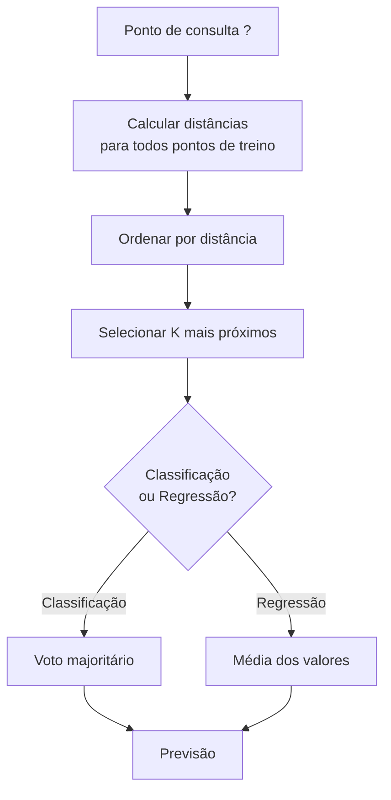

# K-Nearest Neighbors e Distâncias

> Armazene tudo. Prevê olhando seus vizinhos. O algoritmo mais simples que realmente funciona.

**Tipo:** Build
**Linguagens:** Python
**Pré-requisitos:** Fase 1 (Aula 14 Normas e Distâncias)
**Tempo:** ~90 minutos

## Objetivos de Aprendizado

- Implementar classificação e regressão KNN do zero com K configurável e voto ponderado por distância
- Comparar métricas de distância L1, L2, cosseno e Minkowski e selecionar a adequada para um tipo de dado
- Explicar a maldição da dimensionalidade e demonstrar por que KNN degrada em espaços de alta dimensionalidade
- Construir uma KD-tree para busca eficiente de vizinho mais próximo e analisar quando supera força bruta

## O Problema

Você tem um dataset. Um novo ponto de dados chega. Precisa classificá-lo ou prever seu valor. Em vez de aprender parâmetros dos dados, você apenas encontra os K pontos de treino mais próximos do novo ponto e deixa eles votarem.

Esse é o K-nearest neighbors. Não há fase de treino. Sem parâmetros pra aprender. Sem função de perda pra minimizar. Você armazena o conjunto de treino inteiro e calcula distâncias na hora da previsão.

## O Conceito

### Como o KNN Funciona



### Escolhendo K

| K | Comportamento |
|---|---------------|
| K = 1 | Fronteira segue cada ponto. Zero erro de treino. Variância alta. Overfitting |
| K pequeno (3-5) | Sensível à estrutura local. Pode capturar fronteiras complexas |
| K grande | Fronteiras mais suaves. Mais robusto a ruído. Pode subajustar |
| K = N | Prevê a classe majoritária para todo ponto. Viés máximo |

Um ponto de partida comum é K = sqrt(N).

### Métricas de Distância

**L2 (Euclidiana)** é o padrão. Distância em linha reta.

**L1 (Manhattan)** soma diferenças absolutas. Mais robusta a outliers.

**Distância Cosseno** mede o ângulo entre vetores, ignorando magnitude. Essencial para texto e embeddings.

**Minkowski** generaliza L1 e L2 com parâmetro p.

| Tipo de dado | Melhor métrica | Por quê |
|-------------|----------------|---------|
| Features numéricas, escala similar | L2 (Euclidiana) | Padrão, funciona pra dados espaciais |
| Features numéricas, outliers | L1 (Manhattan) | Robusta, não amplifica diferenças grandes |
| Embeddings de texto | Cosseno | Magnitude é ruído, direção é significado |
| Alta dimensionalidade e sparse | Cosseno ou L1 | L2 sofre com maldição da dimensionalidade |

### KNN Ponderado

Vizinhos ponderados inversamente pela distância. Vizinhos mais perto têm mais influência.

```
peso_i = 1 / (distancia_i + epsilon)
```

### A Maldição da Dimensionalidade

O desempenho do KNN degrada em altas dimensões. Isso não é uma preocupação vaga. É um fato matemático.

**Problema 1: distâncias convergem.** Conforme a dimensionalidade aumenta, a razão entre distância máxima e mínima se aproxima de 1.

**Problema 2: volume explode.** Para capturar K vizinhos, você precisa estender o raio de busca para cobrir uma fração muito maior do espaço de features.

**Problema 3: cantos dominam.** Num hipercubo unitário em d dimensões, a maioria do volume está concentrada perto dos cantos.

Consequência prática: KNN funciona bem até cerca de 20-50 features. Além disso, você precisa de redução de dimensionalidade (PCA, UMAP, t-SNE) antes de aplicar KNN.

## Construa

### Passo 1: Funções de distância

```python
import math

def l2_distance(a, b):
    return math.sqrt(sum((ai - bi) ** 2 for ai, bi in zip(a, b)))

def l1_distance(a, b):
    return sum(abs(ai - bi) for ai, bi in zip(a, b))

def cosine_distance(a, b):
    dot_val = sum(ai * bi for ai, bi in zip(a, b))
    norm_a = math.sqrt(sum(ai ** 2 for ai in a))
    norm_b = math.sqrt(sum(bi ** 2 for bi in b))
    if norm_a == 0 or norm_b == 0:
        return 1.0
    return 1.0 - dot_val / (norm_a * norm_b)

def minkowski_distance(a, b, p=2):
    if p == float('inf'):
        return max(abs(ai - bi) for ai, bi in zip(a, b))
    return sum(abs(ai - bi) ** p for ai, bi in zip(a, b)) ** (1 / p)
```

### Passo 2: Classificador e regressor KNN

```python
class KNN:
    def __init__(self, k=5, distance_fn=l2_distance, weighted=False,
                 task="classification"):
        self.k = k
        self.distance_fn = distance_fn
        self.weighted = weighted
        self.task = task
        self.X_train = None
        self.y_train = None

    def fit(self, X, y):
        self.X_train = X
        self.y_train = y

    def predict(self, X):
        return [self._predict_one(x) for x in X]
```

### Passo 3: KD-tree para busca eficiente

```python
class KDTree:
    def __init__(self, X, indices=None, depth=0):
        self.axis = depth % len(X[0])
        # Dividir na mediana do eixo atual
        ...

    def query(self, point, k=1):
        # Navegar até a folha, depois retroceder
        ...
```

## Use

Com scikit-learn:

```python
from sklearn.neighbors import KNeighborsClassifier
from sklearn.preprocessing import StandardScaler
from sklearn.pipeline import Pipeline

clf = Pipeline([
    ("scaler", StandardScaler()),
    ("knn", KNeighborsClassifier(n_neighbors=5, metric="euclidean")),
])
clf.fit(X_train, y_train)
print(f"Accuracy: {clf.score(X_test, y_test):.4f}")
```

Para busca de vizinho mais próximo em grande escala (milhões de vetores), use FAISS, Annoy ou um banco de dados vetorial.

## Exercícios

1. Implemente classificação KNN num dataset 2D com 3 classes. Plote a fronteira de decisão para K=1, K=5, K=15 e K=N.
2. Gere 1000 pontos aleatórios em 2, 5, 10, 50, 100 e 500 dimensões. Para cada dimensionalidade, calcule a razão entre distância par máxima e mínima.
3. Compare L1, L2 e cosseno para KNN num problema de classificação de texto (use vetores TF-IDF).
4. Implemente uma KD-tree e meça o tempo de consulta vs força bruta para datasets de 1k, 10k e 100k pontos.
5. Construa um regressor KNN ponderado para y = sin(x) + ruído. Compare com KNN não ponderado para K=3, 10, 30.
