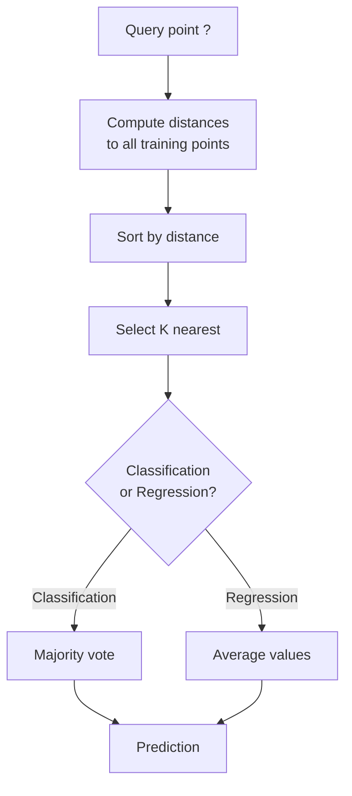
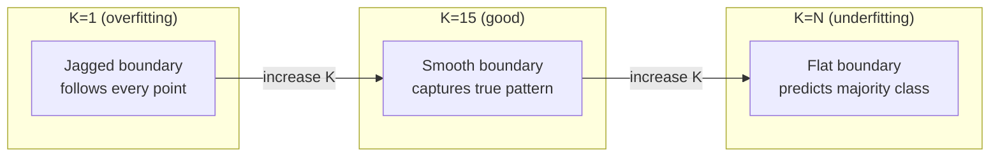
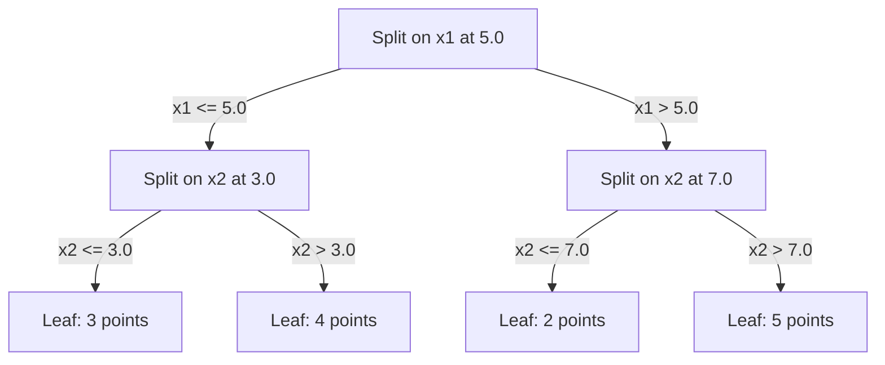

# K-En Yakın Komşular ve Uzaklıklar

> Her şeyi saklayın. Komşularınıza bakarak tahminde bulunun. Gerçekten işe yarayan en basit algoritma.

**Tür:** Yapım
**Dil:** Python
**Önkoşullar:** Aşama 1 (Ders 14 Normlar ve Mesafeler)
**Süre:** ~90 dakika

## Öğrenme Hedefleri

- Yapılandırılabilir K ve mesafe ağırlıklı oylama ile KNN sınıflandırmasını ve regresyonunu sıfırdan uygulayın
- L1, L2, kosinüs ve Minkowski uzaklık metriklerini karşılaştırın ve belirli bir veri türü için uygun olanı seçin
- Boyutsallığın lanetini açıklayın ve KNN'nin neden yüksek boyutlu uzaylarda bozulduğunu gösterin
- Etkili en yakın komşu araması için bir KD ağacı oluşturun ve kaba kuvvetten daha iyi performans gösterdiğinde analiz yapın

## Sorun

Bir dataset'niz var. Yeni bir veri noktası gelir. Onu sınıflandırmanız veya değerini tahmin etmeniz gerekiyor. Verilerden parametreleri öğrenmek (doğrusal regresyon veya SVM'ler gibi) yerine, yeni noktaya en yakın K eğitim noktasını bulup oylamalarına izin verirsiniz.

Bunlar K-en yakın komşular. Eğitim aşaması yoktur. Öğrenilecek parametre yok. Küçültülecek loss function yok. Tüm egzersiz setini saklarsınız ve tahmin zamanında mesafeleri hesaplarsınız.

Çalışmak çok basit geliyor. Ancak KNN, özellikle küçük ve orta ölçekli dataset'ler başta olmak üzere pek çok sorun için şaşırtıcı derecede rekabetçidir ve bunu anlamak, temel kavramları derinlemesine ortaya çıkarır: mesafe ölçüsünün seçimi (Aşama 1 Ders 14'e bağlantı), boyutluluğun laneti ve tembel ve istekli öğrenme arasındaki fark.

KNN ayrıca modern yapay zekanın her yerinde farklı isimler altında karşımıza çıkıyor. Vector database'ler, embedding'ler üzerinde KNN araması yapar. Retrieval-augmented generation (RAG) en yakın K belge parçasını bulur. Öneri sistemleri benzer kullanıcıları veya öğeleri bulur. Algoritma aynı. Ölçek ve veri yapıları farklıdır.

## Konsept

### KNN nasıl çalışır?

Etiketli noktalardan oluşan bir dataset ve yeni bir sorgu noktası verildiğinde:

1. Sorgudan dataset'deki her noktaya olan mesafeyi hesaplayın
2. Mesafeye göre sıralayın
3. En yakın K noktasını alın
4. Sınıflandırma için: K komşuları arasında çoğunluk oyu
5. Regresyon için: K komşunun değerlerinin ortalaması (veya ağırlıklı ortalaması)



Tüm algoritma budur. Uydurma yok. gradient inişi yok. Çağ yok.

### K'yi Seçmek

K tek hiperparametredir. Önyargı-varyans değişimini kontrol eder:

| k | Davranış |
|---|----------|
| K = 1 | Karar sınırı her noktayı takip eder. Sıfır eğitim hatası. Yüksek varyans. Overfits |
| Küçük K (3-5) | Yerel yapıya duyarlıdır. Karmaşık sınırları yakalayabilir |
| Büyük K | Daha düzgün sınırlar. Gürültüye karşı daha dayanıklıdır. Yetersiz olabilir |
| K = N | Her puan için çoğunluk sınıfını tahmin eder. Maksimum önyargı |

N noktalı bir dataset için ortak bir başlangıç noktası K = sqrt(N)'dir. Bağları önlemek için ikili sınıflandırma için tek K'yi kullanın.



### Mesafe ölçümleri

Uzaklık işlevi "yakın"ın ne anlama geldiğini tanımlar. Farklı metrikler farklı komşular ve farklı tahminler üretir.

**L2 (Öklidyen)** varsayılandır. Düz çizgi mesafesi.

```
d(a, b) = sqrt(sum((a_i - b_i)^2))
```

Özellik ölçeğine duyarlı. L2'yi KNN ile kullanmadan önce daima özellikleri standartlaştırın.

**L1 (Manhattan)** mutlak farkları toplar. Farklılıkların karesini almadığı için aykırı değerlere karşı L2'ye göre daha dayanıklıdır.

```
d(a, b) = sum(|a_i - b_i|)
```

**Kosinüs mesafesi** büyüklüğü göz ardı ederek vektörler arasındaki açıyı ölçer. Metin ve embedding verileri için gereklidir.

```
d(a, b) = 1 - (a . b) / (||a|| * ||b||)
```

**Minkowski** L1 ve L2'yi p parametresiyle genelleştirir.

```
d(a, b) = (sum(|a_i - b_i|^p))^(1/p)

p=1: Manhattan
p=2: Euclidean
p->inf: Chebyshev (max absolute difference)
```

Hangi ölçümün kullanılacağı verilere bağlıdır:

| Veri türü | En iyi metrik | Neden |
|-----------|------------|-----|
| Sayısal özellikler, benzer ölçek | L2 (Öklidyen) | Varsayılan, mekansal veriler için çalışır |
| Sayısal özellikler, aykırı değerler | L1 (Manhattan) | Sağlam, büyük farkları büyütmez |
| Metin embeddings | Kosinüs | Büyüklük gürültüdür, yön anlamdır |
| Yüksek boyutlu seyrek | Kosinüs veya L1 | L2 boyutluluğun lanetinden muzdarip |
| Karışık türler | Özel mesafe | Özellik türüne göre metrikleri birleştirin |

### Ağırlıklı KNN

Standart KNN, tüm K komşularına eşit ağırlık verir. Ancak 0,1 uzaklıktaki bir komşu, 5,0 uzaklıktaki bir komşudan daha önemli olmalıdır.

**Mesafe ağırlıklı KNN** her komşuyu mesafeyle ters orantılı olarak ağırlıklandırır:

```
weight_i = 1 / (distance_i + epsilon)

For classification: weighted vote
For regression:     weighted average = sum(w_i * y_i) / sum(w_i)
```

Epsilon, bir sorgu noktası bir eğitim noktasıyla tam olarak eşleştiğinde sıfıra bölünmeyi önler.

Ağırlıklı KNN, K seçimine daha az duyarlıdır çünkü uzak komşular ne olursa olsun çok az katkıda bulunur.

### Boyutsallığın laneti

KNN performansı yüksek boyutlarda düşer. Bu belirsiz bir endişe değil. Bu matematiksel bir gerçektir.

**Sorun 1: mesafeler yakınsar.** Boyutsallık arttıkça maksimum mesafenin minimum mesafeye oranı 1'e yaklaşır. Tüm noktalar sorgudan eşit derecede "uzak" hale gelir.

```
In d dimensions, for random uniform points:

d=2:    max_dist / min_dist = varies widely
d=100:  max_dist / min_dist ~ 1.01
d=1000: max_dist / min_dist ~ 1.001

When all distances are nearly equal, "nearest" is meaningless.
```

**Sorun 2: hacim patlıyor.** Verinin sabit bir kısmı içindeki K komşuyu yakalamak için, arama yarıçapınızı, özellik alanının çok daha büyük bir kısmını kapsayacak şekilde genişletmeniz gerekir. Yüksek boyutlardaki "mahalle" mekanın büyük bir kısmını kapsıyor.

**Sorun 3: köşeler baskındır.** d boyutlu bir birim hiperküpte, hacmin çoğu merkezde değil köşelerde yoğunlaşmıştır. Küpün içine yazılan bir küre, d büyüdükçe hacminin kaybolan bir kısmını içerir.

Pratik sonuç: KNN yaklaşık 20-50 özelliğe kadar iyi çalışır. Bunun ötesinde, KNN'yi uygulamadan önce boyut azaltımına (PCA, UMAP, t-SNE) ihtiyacınız vardır veya verilerin kendine özgü düşük boyutluluğundan yararlanan ağaç tabanlı arama yapılarını kullanmanız gerekir.

### KD ağaçları: hızlı en yakın komşu araması

Kaba kuvvet KNN, sorgudan her eğitim noktasına olan mesafeyi hesaplar. Bu, sorgu başına O(n * d)'dir. Büyük dataset'ler için bu çok yavaştır.

Bir KD ağacı, alanı özellik eksenleri boyunca yinelemeli olarak böler. Her düzeyde, medyan değerde bir boyuta bölünür.



En yakın komşuyu bulmak için, ağaçta sorguyu içeren yaprağa gidin, ardından geriye doğru izleyin ve komşu bölümleri yalnızca daha yakın noktalar içerebiliyorsa kontrol edin.

Ortalama sorgu süresi: Düşük boyutlar için O(log n). Ancak KD-ağaçları yüksek boyutlarda (d > 20) O(n)'ye düşer çünkü geri izleme giderek daha az sayıda dalı ortadan kaldırır.

### Top ağaçları: orta boyutlar için daha iyi

Top ağaçları, verileri eksene göre hizalanmış kutular yerine iç içe geçmiş hiperkürelere böler. Her düğüm, o alt ağaçtaki tüm noktaları içeren bir top (merkez + yarıçap) tanımlar.

KD ağaçlarına göre avantajları:
- Orta boyutlarda daha iyi çalışın (~50'ye kadar)
- Eksen hizalanmamış yapıyı kullanın
- Daha sıkı sınırlama hacimleri, arama sırasında daha fazla dalın budanması anlamına gelir

Hem KD ağaçları hem de top ağaçları kesin algoritmalardır. Gerçekten büyük ölçekli arama için (milyonlarca nokta, yüzlerce boyut), bunun yerine yaklaşık en yakın komşu yöntemleri (HNSW, IVF, ürün nicemleme) kullanılır. Bunlar Aşama 1 Ders 14'te ele alınmaktadır.

### Tembel öğrenmeye karşı istekli öğrenmeye karşı

KNN tembel bir öğrenicidir: eğitim zamanında hiçbir çalışma yapmaz ve tahmin zamanında tamamen çalışır. Diğer algoritmaların çoğu (doğrusal regresyon, SVM'ler, neural network'ler) istekli öğrenicilerdir: kompakt bir model oluşturmak için eğitim zamanında yoğun hesaplamalar yaparlar, ardından tahminler hızlıdır.

| Görünüş | Tembel (KNN) | İstekli (SVM, sinir ağı) |
|--------|------------|------------------------|
| Eğitim süresi | O(1) yalnızca verileri depolar | O(n * dönemler) |
| Tahmin zamanı | Sorgu başına O(n * d) | O(d) veya O(parametreler) |
| Tahminde hafıza | Eğitim setinin tamamını saklayın | Yalnızca model parametrelerini saklayın |
| Yeni verilere uyum sağlar | Anında puan ekleyin | Modeli yeniden eğitin |
| Karar sınırı | Örtülü, anında hesaplanan | Açık, eğitimden sonra düzeltildi |

Tembel öğrenme şu durumlarda idealdir:
- dataset sık sık değişir (yeniden eğitim almadan puan ekleyin/kaldırın)
- Çok az sorgu için tahminlere ihtiyacınız var
- Sıfır eğitim süresi istiyorsunuz
- dataset, kaba kuvvet aramasının hızlı olmasını sağlayacak kadar küçüktür

### Regresyon için KNN

Çoğunluk oyu yerine, regresyon için KNN, K komşularının hedef değerlerinin ortalamasını alır.

```
prediction = (1/K) * sum(y_i for i in K nearest neighbors)

Or with distance weighting:
prediction = sum(w_i * y_i) / sum(w_i)
where w_i = 1 / distance_i
```

KNN regresyonu parçalı sabit (veya ağırlıklandırmayla parçalı düzgün) tahminler üretir. Eğitim verilerinin aralığının ötesinde tahminde bulunamaz. Eğitim hedeflerinin tümü 0 ile 100 arasındaysa KNN hiçbir zaman 200'ü tahmin etmeyecektir.

```figure
knn-smoothness
```

## İnşa Et

### Adım 1: Mesafe fonksiyonları

L1, L2, kosinüs ve Minkowski mesafelerini uygulayın. Bunlar doğrudan Aşama 1 Ders 14'e bağlanır.

```python
import math

def l2_distance(a, b):
    return math.sqrt(sum((ai - bi) ** 2 for ai, bi in zip(a, b)))

def l1_distance(a, b):
    return sum(abs(ai - bi) for ai, bi in zip(a, b))

def cosine_distance(a, b):
    dot_val = sum(ai * bi for ai, bi in zip(a, b))
    norm_a = math.sqrt(sum(ai ** 2 for ai in a))
    norm_b = math.sqrt(sum(bi ** 2 for bi in b))
    if norm_a == 0 or norm_b == 0:
        return 1.0
    return 1.0 - dot_val / (norm_a * norm_b)

def minkowski_distance(a, b, p=2):
    if p == float('inf'):
        return max(abs(ai - bi) for ai, bi in zip(a, b))
    return sum(abs(ai - bi) ** p for ai, bi in zip(a, b)) ** (1 / p)
```

### Adım 2: KNN sınıflandırıcısı ve regresör

Yapılandırılabilir K, mesafe ölçümü ve isteğe bağlı mesafe ağırlığı ile tam KNN'yi oluşturun.

```python
class KNN:
    def __init__(self, k=5, distance_fn=l2_distance, weighted=False,
                 task="classification"):
        self.k = k
        self.distance_fn = distance_fn
        self.weighted = weighted
        self.task = task
        self.X_train = None
        self.y_train = None

    def fit(self, X, y):
        self.X_train = X
        self.y_train = y

    def predict(self, X):
        return [self._predict_one(x) for x in X]
```

### Adım 3: Etkili arama için KD ağacı

Sıfırdan, her boyutun medyanında yinelemeli olarak bölünen bir KD ağacı oluşturun.

```python
class KDTree:
    def __init__(self, X, indices=None, depth=0):
        # Recursively partition the data
        self.axis = depth % len(X[0])
        # Split on median of the current axis
        ...

    def query(self, point, k=1):
        # Traverse to leaf, then backtrack
        ...
```

Tüm yardımcı yöntemler ve demolarla birlikte tam uygulama için `code/knn.py`'ye bakın.

### Adım 4: Özellik ölçeklendirme

KNN, özellik ölçeklendirmeyi gerektirir çünkü mesafeler özellik büyüklüklerine duyarlıdır. 0 ile 1000 arasında değişen bir özellik, 0 ile 1 arasında değişen bir özelliğe baskın olacaktır.

```python
def standardize(X):
    n = len(X)
    d = len(X[0])
    means = [sum(X[i][j] for i in range(n)) / n for j in range(d)]
    stds = [
        max(1e-10, (sum((X[i][j] - means[j]) ** 2 for i in range(n)) / n) ** 0.5)
        for j in range(d)
    ]
    return [[((X[i][j] - means[j]) / stds[j]) for j in range(d)] for i in range(n)], means, stds
```

## Kullan onu

Scikit-learn ile:

```python
from sklearn.neighbors import KNeighborsClassifier
from sklearn.preprocessing import StandardScaler
from sklearn.pipeline import Pipeline

clf = Pipeline([
    ("scaler", StandardScaler()),
    ("knn", KNeighborsClassifier(n_neighbors=5, metric="euclidean")),
])
clf.fit(X_train, y_train)
print(f"Accuracy: {clf.score(X_test, y_test):.4f}")
```

Scikit-learn, dataset yeterince büyük ve boyutsallık yeterince düşük olduğunda otomatik olarak KD ağaçlarını veya top ağaçlarını kullanır. Yüksek boyutlu veriler için kaba kuvvete başvurulur. Bunu `algorithm` parametresi ile kontrol edebilirsiniz.

Büyük ölçekli en yakın komşu araması (milyonlarca vektör) için FAISS, Annoy veya vector database kullanın:

```python
import faiss

index = faiss.IndexFlatL2(dimension)
index.add(embeddings)
distances, indices = index.search(query_vectors, k=5)
```

## Egzersizler

1. KNN sınıflandırmasını 3 sınıflı bir 2D dataset üzerinde uygulayın. K=1, K=5, K=15 ve K=N için karar sınırını çizin. Aşırı uyumdan yetersiz uyum'a geçişi gözlemleyin.

2. 2, 5, 10, 50, 100 ve 500 boyutlarda 1000 rastgele nokta oluşturun. Her boyutluluk için maksimum ikili mesafenin minimum ikili mesafeye oranını hesaplayın. Boyutluluğun lanetini görselleştirmek için oran-boyutsallık grafiğini çizin.

3. Bir metin sınıflandırma probleminde KNN için L1, L2 ve kosinüs mesafesini karşılaştırın (TF-IDF vektörlerini kullanın). Hangi metrik en iyi doğruluğu verir? Kosinüs neden metin için kazanma eğiliminde?

4. Bir KD ağacı uygulayın ve 2D, 10D ve 50D'de 1k, 10k ve 100k noktalı dataset'ler için sorgu süresini kaba kuvvete karşı ölçün. KD ağacı hangi boyutta kaba kuvvetten daha hızlı olmayı bırakır?

5. y = sin(x) + gürültü için ağırlıklı bir KNN regresörü oluşturun. K=3, 10, 30 için ağırlıklandırılmamış KNN ile karşılaştırın. Ağırlıklandırmanın özellikle büyük K için daha düzgün tahminler ürettiğini gösterin.

## Anahtar Terimler

| Dönem | Aslında ne anlama geliyor |
|------|----------------------|
| K-en yakın komşular | Bir sorguya en yakın K eğitim noktasını bularak tahmin yapan parametrik olmayan algoritma |
| Tembel öğrenme | Eğitim sırasında hesaplama yapılmaz. Tüm işler tahmin zamanında gerçekleşir. KNN kanonik bir örnektir |
| Öğrenmeye istekli | Kompakt bir model oluşturmak için eğitim sırasında yoğun hesaplama. Çoğu makine öğrenimi algoritması isteklidir |
| Boyutluluğun laneti | Yüksek boyutlarda mesafeler birleşir ve mahalleler alanın çoğunu kaplayacak şekilde genişler, bu da KNN'i etkisiz hale getirir |
| KD ağacı | Alanı özellik eksenleri boyunca yinelemeli olarak bölen ikili ağaç. Düşük boyutlu O(log n) sorguları |
| Top ağacı | İç içe hiperkürelerin ağacı. Orta boyutlarda (~50'ye kadar) KD ağaçlarından daha iyi çalışır |
| Ağırlıklı KNN | Komşular mesafeyle ters orantılı olarak ağırlıklandırılmıştır. Yakın komşuların tahmin üzerinde daha fazla etkisi var |
| Özellik ölçeklendirme | Özellikleri karşılaştırılabilir aralıklara normalleştirme. KNN gibi mesafeye dayalı yöntemler için gereklidir |
| Çoğunluk oyu | K komşuları arasında hangi sınıfın en yaygın olduğunu sayarak sınıflandırma |
| Kaba kuvvet araması | Her eğitim noktasına olan mesafenin hesaplanması. Sorgu başına O(n*d). Büyük n için tam ama yavaş |
| Yaklaşık en yakın komşu | Yaklaşık olarak en yakın noktaları kesin aramadan çok daha hızlı bulan algoritmalar (HNSW, LSH, IVF) |
| Voronoi diyagramı | Her bölgenin bir eğitim noktasına diğerlerinden daha yakın olan tüm noktaları içerdiği uzay bölümü. K=1 KNN, Voronoi sınırlarını üretir |

## Daha Fazla Okuma

- [Cover & Hart: En Yakın Komşu Modeli Sınıflandırması (1967)](https://ieeexplore.ieee.org/document/1053964) - Bayes optimalinin en fazla iki katı hata oranına sahip olduğunu kanıtlayan temel KNN makalesi
- [Friedman, Bentley, Finkel: Logaritmik Beklenen Zamanda En İyi Eşleşmeleri Bulmak için Bir Algoritma (1977)](https://dl.acm.org/doi/10.1145/355744.355745) - orijinal KD-ağacı makalesi
- [Beyer ve diğerleri: "En Yakın Komşu" Ne Zaman Anlamlıdır? (1999)](https://link.springer.com/chapter/10.1007/3-540-49257-7_15) - en yakın komşu için boyutluluk lanetinin resmi analizi
- [scikit-learn En Yakın Komşular belgeleri](https://scikit-learn.org/stable/modules/neighbors.html) - algoritma seçimiyle pratik kılavuz
- [FAISS: Verimli Benzerlik Araması için Bir Kitaplık](https://github.com/facebookresearch/faiss) - Milyar ölçekli yaklaşık en yakın komşu araması için Meta'nın kitaplığı
