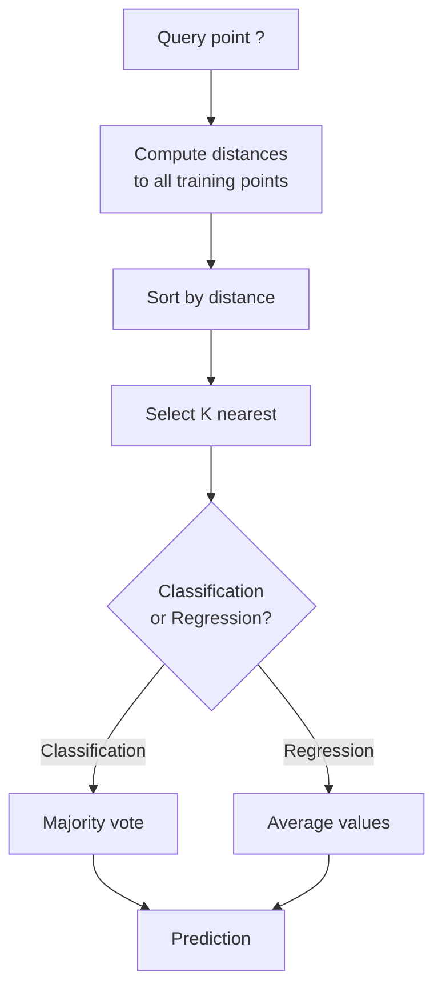
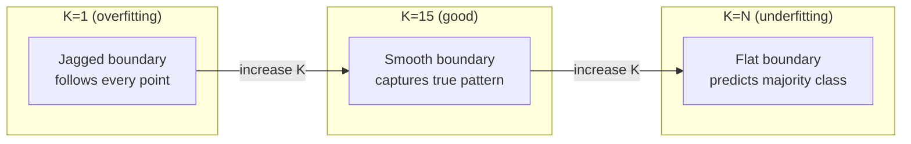
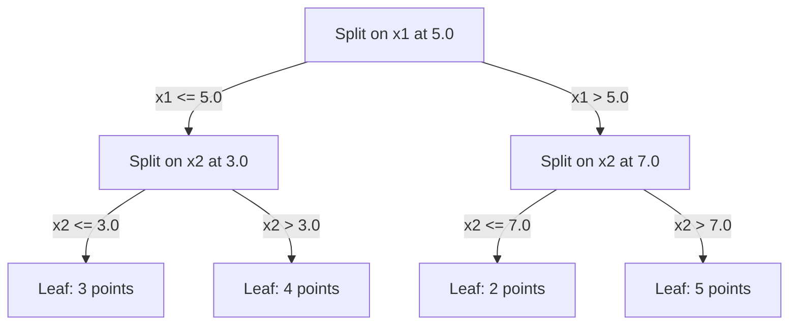

# K-Nearest Neighbors and Distances

> 存储一切。通过观察你的邻居进行预测。实际有效的最简单算法。

** 类型：** 构建
** 语言：** Python
** 先决条件：** 第1阶段（第14课规范与距离）
** 时间：** ~90分钟

## Learning Objectives

- 通过可配置的K和距离加权投票从头开始实施KNN分类和回归
- 比较L1、L2、cos和Minkowski距离指标，并为给定数据类型选择合适的指标
- 解释维度诅咒并演示为什么KNN在多维空间中退化
- 构建KD树以进行高效的最近邻搜索并分析何时优于暴力

## The Problem

您有一个数据集。新数据点到达。您需要对其进行分类或预测其价值。您不必从数据中学习参数（例如线性回归或支持者服务器），只需找到最接近新点的K个训练点并让它们投票即可。

这是K近邻。没有训练阶段。没有可学习的参数。没有可最小化的损失功能。您可以存储整个训练集并在预测时计算距离。

听起来工作起来太简单了。但KNN在许多问题上都具有惊人的竞争力，尤其是对于中小数据集，深入了解它揭示了基本概念：距离指标的选择（连接到第1阶段第14课）、维度的诅咒以及懒惰和渴望学习之间的区别。

KNN在现代人工智能中也随处可见，只是名称不同。载体数据库对嵌入进行KNN搜索。检索增强生成（RAG）查找K个最近的文档块。推荐系统会找到类似的用户或物品。算法是一样的。规模和数据结构不同。

## The Concept

### How KNN works

给定已标记点和新查询点的数据集：

1. 计算查询到数据集中每个点的距离
2. 按距离排序
3. 取K最接近的点
4. 分类：K邻居中的多数票
5. 对于回归：K个邻居值的平均值（或加权平均值）



这就是整个算法。没有试穿。没有梯度下降。没有时代。

### Choosing K

K是单个超参数。它控制偏差方差权衡：

| K | 行为 |
|---|----------|
| K = 1 | 决策边界遵循每一点。零训练错误。高方差。过度贴合 |
| 小K（3-5） | 对当地结构敏感。可以捕捉复杂的边界 |
| 大的K | 更光滑的边界。对噪音更强。可能不适合 |
| K = N | 预测每个点的多数班级。最大偏置 |

对于由N个点组成的数据集，常见的起点是K = squtt（N）。使用奇数K进行二进制分类以避免领带。



### Distance metrics

距离函数定义了“近”的含义。不同的指标会产生不同的邻居、不同的预测。

**L2（欧几里得）** 是默认值。直线距离。

```
d(a, b) = sqrt(sum((a_i - b_i)^2))
```

对特征尺度敏感。在将L2与KNN一起使用之前，请始终对特征进行标准化。

**L1（曼哈顿）** 总和绝对差异。比L2对离群值更稳健，因为它不能平方差异。

```
d(a, b) = sum(|a_i - b_i|)
```

**Cosine距离 ** 测量两个方向之间的角度，忽略幅度。对于文本和嵌入数据至关重要。

```
d(a, b) = 1 - (a . b) / (||a|| * ||b||)
```

**Minkowski** 用参数p推广L1和L2。

```
d(a, b) = (sum(|a_i - b_i|^p))^(1/p)

p=1: Manhattan
p=2: Euclidean
p->inf: Chebyshev (max absolute difference)
```

使用哪个指标取决于数据：

| 数据类型 | 最佳度量 | 为什么 |
|-----------|------------|-----|
| 数字特征，相似规模 | L2（欧几里得） | 默认，适用于空间数据 |
| 数字特征、离群值 | L1（曼哈顿） | 稳健，不会放大较大差异 |
| 文本嵌入 | 余弦 | 大小就是噪音，方向就是意义 |
| 高维稀疏 | Cosine或L1 | L2遭受维度诅咒 |
| 混合类型 | 自定义距离 | 结合每个功能类型的指标 |

### Weighted KNN

标准KNN给予所有K个邻居相同的权重。但距离0.1的邻居应该比距离5.0的邻居更重要。

** 距离加权KNN** 通过距离对每个邻居进行反向加权：

```
weight_i = 1 / (distance_i + epsilon)

For classification: weighted vote
For regression:     weighted average = sum(w_i * y_i) / sum(w_i)
```

当查询点与训练点完全匹配时，Inbox会防止被零除。

加权KNN对K的选择不太敏感，因为无论如何，远邻的贡献都很少。

### The curse of dimensionality

KNN性能在高维度上下降。这不是一个模糊的担忧。这是一个数学事实。

** 问题1：距离收敛。**随着维度的增加，最大距离与最小距离之比接近1。所有点都变得同样“远离”查询。

```
In d dimensions, for random uniform points:

d=2:    max_dist / min_dist = varies widely
d=100:  max_dist / min_dist ~ 1.01
d=1000: max_dist / min_dist ~ 1.001

When all distances are nearly equal, "nearest" is meaningless.
```

** 问题2：音量爆炸。**要在数据的固定部分内捕获K个邻居，您需要扩展搜索半径以覆盖更大部分的特征空间。高维度的“邻居”涵盖了大部分空间。

** 问题3：角球占主导地位。**在d维的单位超立方体中，大部分体积集中在角落附近，而不是中心附近。随着d的增长，立方体中的球体包含体积的消失部分。

实际结果：KNN在大约20-50个功能中运行良好。除此之外，在应用KNN之前，您需要进行降维（PCA、UMAP、t-SNE），或者您需要使用利用数据固有的较低维度的基于树的搜索结构。

### KD-trees: fast nearest neighbor search

暴力KNN计算从查询到每个训练点的距离。即每个查询O（n * d）。对于大型数据集来说，这太慢了。

KD树沿着特征轴递减地分割空间。在每个水平上，它沿着中间值的一个维度分裂。



要找到最近的邻居，请穿越树到包含查询的叶子，然后仅在邻近分区可能包含更近的点时才回溯并检查邻近分区。

平均查询时间：O（log n）对于低维度。但KD树在高维度（d > 20）中退化为O（n），因为回溯消除的分支越来越少。

### Ball trees: better for moderate dimensions

球树将数据划分为嵌套的超球体，而不是轴对齐的框。每个节点定义一个球（中心+半径），其中包含该子树中的所有点。

相对于KD树的优势：
- 在中等维度（高达~50）中工作得更好
- 处理非轴对齐结构
- 更紧密的边界体积意味着搜索期间修剪更多分支

KD树和球树都是精确算法。对于真正的大规模搜索（数百万个点、数百个维度），则使用近似最近邻方法（HNSW、IVF、积量化）。这些内容将在第1阶段第14课中介绍。

### Lazy learning vs eager learning

KNN是一个懒惰的学习者：它在训练时不起作用，而在预测时全部起作用。大多数其他算法（线性回归、支持器、神经网络）都是渴望学习的：它们在训练时进行大量计算以构建紧凑的模型，然后预测很快。

| 方面 | 懒惰（KNN） | 渴望（支持机，神经网络） |
|--------|------------|------------------------|
| 训练时间 | O（1）仅存储数据 | O（n * epochs） |
| 预测时间 | 每次查询O（n * d） | O（d）或O（参数） |
| 预测记忆 | 存储整个训练集 | 仅存储模型参数 |
| 适应新数据 | 立即加分 | 重新训练模型 |
| 决策边界 | 隐含的，动态计算 | 明确，训练后固定 |

懒惰学习是理想的选择：
- 数据集频繁变化（无需重新训练即可添加/删除点）
- 您需要对很少的查询进行预测
- 您想要零训练时间
- 数据集足够小，暴力搜索速度很快

### KNN for regression

回归的KNN不是多数投票，而是对K个邻居的目标值进行平均。

```
prediction = (1/K) * sum(y_i for i in K nearest neighbors)

Or with distance weighting:
prediction = sum(w_i * y_i) / sum(w_i)
where w_i = 1 / distance_i
```

KNN回归产生逐段不变（或逐段平滑加权）预测。它无法推断超出训练数据的范围。如果训练目标都在0到100之间，KNN永远不会预测200。

## Build It

### Step 1: Distance functions

实现L1、L2、余弦和Minkowski距离。这些直接连接到第1阶段第14课。

```python
import math

def l2_distance(a, b):
    return math.sqrt(sum((ai - bi) ** 2 for ai, bi in zip(a, b)))

def l1_distance(a, b):
    return sum(abs(ai - bi) for ai, bi in zip(a, b))

def cosine_distance(a, b):
    dot_val = sum(ai * bi for ai, bi in zip(a, b))
    norm_a = math.sqrt(sum(ai ** 2 for ai in a))
    norm_b = math.sqrt(sum(bi ** 2 for bi in b))
    if norm_a == 0 or norm_b == 0:
        return 1.0
    return 1.0 - dot_val / (norm_a * norm_b)

def minkowski_distance(a, b, p=2):
    if p == float('inf'):
        return max(abs(ai - bi) for ai, bi in zip(a, b))
    return sum(abs(ai - bi) ** p for ai, bi in zip(a, b)) ** (1 / p)
```

### Step 2: KNN classifier and regressor

使用可配置的K、距离度量和可选的距离加权构建完整的KNN。

```python
class KNN:
    def __init__(self, k=5, distance_fn=l2_distance, weighted=False,
                 task="classification"):
        self.k = k
        self.distance_fn = distance_fn
        self.weighted = weighted
        self.task = task
        self.X_train = None
        self.y_train = None

    def fit(self, X, y):
        self.X_train = X
        self.y_train = y

    def predict(self, X):
        return [self._predict_one(x) for x in X]
```

### Step 3: KD-tree for efficient search

从头开始构建一个KD树，该树按每个维度的中位数进行迭代分裂。

```python
class KDTree:
    def __init__(self, X, indices=None, depth=0):
        # Recursively partition the data
        self.axis = depth % len(X[0])
        # Split on median of the current axis
        ...

    def query(self, point, k=1):
        # Traverse to leaf, then backtrack
        ...
```

有关所有帮助器方法和演示的完整实现，请参阅“code/knn.py”。

### Step 4: Feature scaling

KNN需要特征缩放，因为距离对特征幅度敏感。范围从0到1000的特征将主导范围从0到1的特征。

```python
def standardize(X):
    n = len(X)
    d = len(X[0])
    means = [sum(X[i][j] for i in range(n)) / n for j in range(d)]
    stds = [
        max(1e-10, (sum((X[i][j] - means[j]) ** 2 for i in range(n)) / n) ** 0.5)
        for j in range(d)
    ]
    return [[((X[i][j] - means[j]) / stds[j]) for j in range(d)] for i in range(n)], means, stds
```

## Use It

使用scikit-learn：

```python
from sklearn.neighbors import KNeighborsClassifier
from sklearn.preprocessing import StandardScaler
from sklearn.pipeline import Pipeline

clf = Pipeline([
    ("scaler", StandardScaler()),
    ("knn", KNeighborsClassifier(n_neighbors=5, metric="euclidean")),
])
clf.fit(X_train, y_train)
print(f"Accuracy: {clf.score(X_test, y_test):.4f}")
```

当数据集足够大且维度足够低时，Scikit-learn会自动使用KD树或球树。对于多维数据，它又回到了蛮力。您可以使用“算法”参数控制此功能。

对于大规模最近邻搜索（数百万个载体），请使用FAISS、Annoy或载体数据库：

```python
import faiss

index = faiss.IndexFlatL2(dimension)
index.add(embeddings)
distances, indices = index.search(query_vectors, k=5)
```

## Exercises

1. 在具有3个类的2D数据集上实施KNN分类。绘制K=1、K=5、K=15和K=N的决策边界。观察从过度配合到不足配合的转变。

2. 生成2、5、10、50、100和500维中的1000个随机点。对于每个维度，计算最大成对距离与最小成对距离的比率。绘制比率与维度的关系，以可视化维度的诅咒。

3. 在文本分类问题上比较KNN的L1、L2和cos距离（使用TF-IDF载体）。哪个指标的准确性最高？为什么cos往往会在文本中获胜？

4. 实现KD树并测量2D、10 D和50 D中1 k、10 k和100 k个点的数据集的查询时间与暴力的关系。KD树在什么维度上不再比蛮力更快？

5. 为y = sin（x）+ noise构建加权KNN回归量。将其与未加权KNN进行比较，K=3、10、30。表明加权可以产生更平滑的预测，尤其是对于大K。

## Key Terms

| Term | 它实际上意味着什么 |
|------|----------------------|
| k近邻 | 非参数算法，通过查找与查询最接近的K个训练点进行预测 |
| 懒惰学习 | 训练时无需计算。所有工作都在预测时间进行。KNN是典型的例子 |
| 渴望学习 | 训练时进行大量计算以构建紧凑的模型。大多数ML算法都渴望 |
| 维数灾难 | 在高维度中，距离收敛，社区扩展到覆盖大部分空间，使得KNN无效 |
| kd树 | 沿着特征轴递减分割空间的二元树。O（log n）低维度查询 |
| Ball tree | 嵌套超球树。在中等维度（高达~50）上比KD树效果更好 |
| 加权KNN | 邻居按距离反向加权。近邻对预测影响更大 |
| 特征缩放 | 将功能规范化到可比范围。KNN等基于距离的方法所需 |
| 多数票 | 通过计算哪个类在K个邻居中最常见进行分类 |
| 强力搜索 | 计算到每个训练点的距离。每个查询O（n*d）。对于大n来说精确但缓慢 |
| 近似最近邻 | 找到大约最近点的算法（HNSW、LSH、IVF）比精确搜索快得多 |
| Voronoi diagram | 空间的划分，其中每个区域包含比任何其他点更接近一个训练点的所有点。K=1 KNN产生Voronoi边界 |

## Further Reading

- [封面与哈特：最近邻居模式分类（1967）]（https：//ieeeexplore.ieee.org/document/1053964）-KNN基础论文，证明其错误率最多是Bayes最优值的两倍
- [弗里德曼、本特利、芬克尔：在对数预期时间中寻找最佳匹配的算法（1977）]（https：//dl.acm.org/doi/10.1145/355744.355745）-原始的KD树论文
- [拜尔等人：“最近的邻居”什么时候有意义？（1999）]（https：//link.springer.com/chapter/10.1007/3-540-49257-7_15）-最近邻居维度诅咒的正式分析
- [scikit-learn最近的邻居文档]（https：//scikit-learn.org/stable/modules/neighbors.html）-算法选择实用指南
- [FAISS：A Library for Efficient Similarity Search]（https：//github.com/facebookresearch/faiss）- Meta's library for billion scale approximate nearest neighbor search
