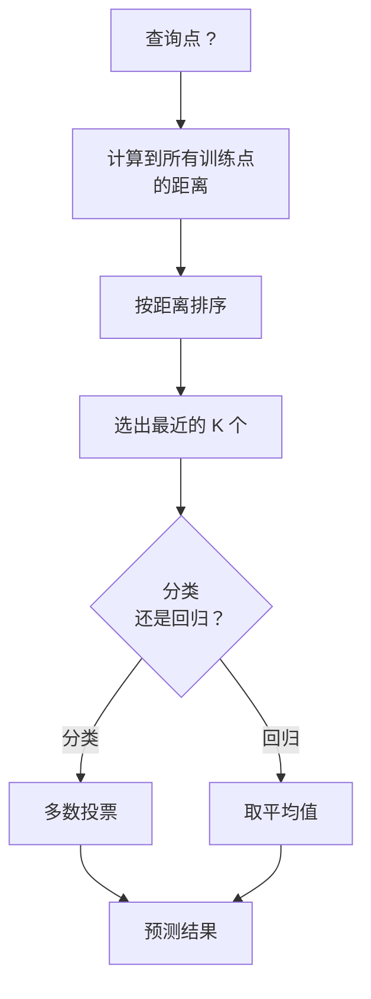
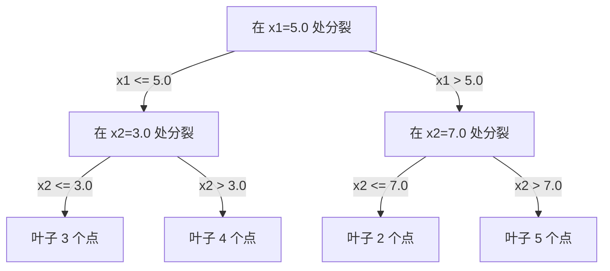

# K 近邻与距离（K-Nearest Neighbors and Distances）

> 译注：本文译自同目录 [`en.md`](./en.md)。术语遵循仓根 [TRANSLATION_GUIDE.md](../../../../TRANSLATION_GUIDE.md)。

> 把所有数据存下来。预测时看看邻居怎么投票。这是最简单、却又真的能用的算法。

**Type:** Build
**Language:** Python
**Prerequisites:** Phase 1 (Lesson 14 Norms and Distances)
**Time:** ~90 minutes

## 学习目标（Learning Objectives）

- 从零实现 KNN 分类与回归，支持可配置的 K 和距离加权投票
- 比较 L1、L2、cosine、Minkowski 几种距离度量，并为给定数据类型挑选合适的那个
- 解释「维度灾难」（curse of dimensionality），并演示为什么 KNN 在高维空间里会退化
- 构建一棵 KD-tree 用于高效近邻搜索，分析它在何时能跑赢暴力搜索

## 问题（The Problem）

你手上有一个数据集。一个新数据点过来了。你要给它分类，或者预测它的取值。和线性回归、SVM 这些「从数据里学参数」的方法不同，你只需要找出训练集中离新点最近的 K 个点，让它们投票决定。

这就是 K 近邻（K-nearest neighbors）。没有训练阶段。没有要学的参数。没有要最小化的损失函数。你把整个训练集存下来，到预测时再算距离。

听起来简单到不像能 work。但 KNN 在很多问题上意外地有竞争力，特别是中小规模数据集；而且把它搞透能揭示一些根本概念：距离度量的选择（呼应 Phase 1 Lesson 14）、维度灾难、以及 lazy learning 与 eager learning 的差别。

KNN 还以各种化名出现在现代 AI 的方方面面。向量数据库就是在 embedding 上做 KNN 搜索。检索增强生成（RAG）就是找出最近的 K 个文档片段。推荐系统找相似用户或相似物品。算法是同一个，只是规模和数据结构不同。

## 概念（The Concept）

### KNN 是怎么 work 的（How KNN works）

给定一个有标签的数据集和一个新的查询点：

1. 计算查询点到数据集中每个点的距离
2. 按距离排序
3. 取最近的 K 个点
4. 分类：在这 K 个邻居中按多数投票
5. 回归：对这 K 个邻居的取值求平均（或加权平均）



整个算法就这么多。没有 fit。没有梯度下降。没有 epoch。

### 选择 K（Choosing K）

K 是唯一的超参数。它控制偏差-方差的权衡：

| K | 行为 |
|---|----------|
| K = 1 | 决策边界紧贴每一个点。训练误差为零。方差极高。过拟合 |
| 较小的 K（3-5） | 对局部结构敏感。能捕获复杂边界 |
| 较大的 K | 边界更平滑。对噪声更鲁棒。可能欠拟合 |
| K = N | 对每个点都预测多数类。偏差最大 |

一个常见的起点是 K = sqrt(N)，N 是数据集大小。二分类时取奇数 K，避免出现平票。


### 距离度量（Distance metrics）

距离函数定义了什么叫「近」。不同的度量给出不同的邻居，给出不同的预测。

**L2（Euclidean，欧几里得）** 是默认选项。直线距离。

```
d(a, b) = sqrt(sum((a_i - b_i)^2))
```

对特征尺度敏感。在 KNN 里用 L2 之前，永远要先把特征标准化。

**L1（Manhattan，曼哈顿）** 把绝对差加起来。比 L2 更鲁棒，因为它不对差值平方放大。

```
d(a, b) = sum(|a_i - b_i|)
```

**Cosine 距离** 衡量向量之间的夹角，忽略幅度。处理文本和 embedding 数据时是必备项。

```
d(a, b) = 1 - (a . b) / (||a|| * ||b||)
```

**Minkowski** 用参数 p 把 L1 和 L2 统一了起来。

```
d(a, b) = (sum(|a_i - b_i|^p))^(1/p)

p=1: Manhattan
p=2: Euclidean
p->inf: Chebyshev (max absolute difference)
```

到底选哪种度量，取决于数据：

| 数据类型 | 最佳度量 | 为什么 |
|-----------|------------|-----|
| 数值特征，尺度相近 | L2（Euclidean） | 默认选项，对空间数据通用 |
| 数值特征，含 outlier（异常值） | L1（Manhattan） | 鲁棒，不会把大差值进一步放大 |
| 文本 embedding | Cosine | 幅度是噪声，方向才是语义 |
| 高维稀疏 | Cosine 或 L1 | L2 会受到维度灾难的折磨 |
| 混合类型 | 自定义距离 | 按特征类型组合多种度量 |

### 加权 KNN（Weighted KNN）

标准 KNN 把 K 个邻居等权对待。但距离 0.1 的邻居显然应该比距离 5.0 的邻居更重要。

**距离加权 KNN（Distance-weighted KNN）** 让每个邻居的权重和距离成反比：

```
weight_i = 1 / (distance_i + epsilon)

For classification: weighted vote
For regression:     weighted average = sum(w_i * y_i) / sum(w_i)
```

加 epsilon 是为了防止查询点恰好和某个训练点重合时除以零。

加权 KNN 对 K 的选择不那么敏感，因为远处的邻居贡献本来就极小，K 取多大都无所谓。

### 维度灾难（The curse of dimensionality）

KNN 的表现在高维下会退化。这不是一个含糊的担忧，而是一个数学事实。

**问题 1：距离会趋同。** 维度升高时，最大距离与最小距离的比值会趋近于 1。所有点离查询点都「差不多远」。

```
In d dimensions, for random uniform points:

d=2:    max_dist / min_dist = varies widely
d=100:  max_dist / min_dist ~ 1.01
d=1000: max_dist / min_dist ~ 1.001

When all distances are nearly equal, "nearest" is meaningless.
```

**问题 2：体积会爆炸。** 要在固定数据比例内找到 K 个邻居，你必须把搜索半径扩大到覆盖特征空间一个大得多的比例。高维下「邻域」会吞掉整个空间的大部分。

**问题 3：角落主导一切。** 在 d 维单位超立方体里，体积大部分集中在角落附近，而不是中心。随着 d 增长，立方体内切球所占体积比例迅速趋于零。

实践含义：KNN 在大约 20-50 维以内表现良好。再往上，你要么先降维（PCA、UMAP、t-SNE）再用 KNN，要么使用基于树的搜索结构来利用数据本身较低的内在维度。

### KD-tree：快速近邻搜索（KD-trees: fast nearest neighbor search）

暴力 KNN 要算查询点到每个训练点的距离。每次查询是 O(n * d)。对大数据集来说这太慢。

KD-tree 沿着特征坐标轴递归地把空间切开。每一层在某个维度上按中位数切一刀。



要找最近邻，先沿树往下走到包含查询点的叶子，然后回溯，只在「可能包含更近点」的相邻分区里继续找。

平均查询时间：低维下 O(log n)。但维度大于约 20 时，KD-tree 会退化到 O(n)，因为回溯能剪掉的分支越来越少。

### Ball tree：中等维度更适合（Ball trees: better for moderate dimensions）

Ball tree 把数据切成嵌套的超球，而不是坐标轴对齐的盒子。每个节点定义一个球（中心 + 半径），里面装着这棵子树的所有点。

相对于 KD-tree 的优势：
- 中等维度（最多约 50）下表现更好
- 能处理非坐标轴对齐的结构
- 包围体更紧，搜索时能剪掉更多分支

KD-tree 和 ball tree 都是精确算法。真正的大规模搜索（百万级点、几百维）则会用近似最近邻方法（HNSW、IVF、product quantization）。这些会在 Phase 1 Lesson 14 介绍。

### Lazy learning vs eager learning

KNN 是 lazy learner（懒惰学习器）：训练时啥也不干，所有计算都推到预测时。大多数其他算法（线性回归、SVM、神经网络）是 eager learner（积极学习器）：训练时做大量计算建一个紧凑的模型，预测就很快。

| 方面 | Lazy（KNN） | Eager（SVM、神经网络） |
|--------|------------|------------------------|
| 训练时间 | O(1)，只是把数据存下来 | O(n * epochs) |
| 预测时间 | 每次查询 O(n * d) | O(d) 或 O(参数数量) |
| 预测时内存 | 整个训练集都得在 | 只需要模型参数 |
| 对新数据的适应 | 直接加点即可 | 重新训练 |
| 决策边界 | 隐式，按需即时算出 | 显式，训练完就固定 |

Lazy learning 在以下情况是理想选择：
- 数据集频繁变化（不重新训练就能加/删点）
- 只需要为很少的查询做预测
- 想要零训练时间
- 数据集小到暴力搜索就够快

### KNN 用于回归（KNN for regression）

回归版 KNN 把多数投票换成对 K 个邻居的目标值求平均。

```
prediction = (1/K) * sum(y_i for i in K nearest neighbors)

Or with distance weighting:
prediction = sum(w_i * y_i) / sum(w_i)
where w_i = 1 / distance_i
```

KNN 回归给出分段常数（带加权的话则是分段平滑）的预测。它没法外推到训练数据范围之外。如果训练目标都在 0 到 100 之间，KNN 永远不会预测出 200。

## 动手实现（Build It）

### 第 1 步：距离函数（Step 1: Distance functions）

实现 L1、L2、cosine 和 Minkowski 距离。这些直接呼应 Phase 1 Lesson 14。

```python
import math

def l2_distance(a, b):
    return math.sqrt(sum((ai - bi) ** 2 for ai, bi in zip(a, b)))

def l1_distance(a, b):
    return sum(abs(ai - bi) for ai, bi in zip(a, b))

def cosine_distance(a, b):
    dot_val = sum(ai * bi for ai, bi in zip(a, b))
    norm_a = math.sqrt(sum(ai ** 2 for ai in a))
    norm_b = math.sqrt(sum(bi ** 2 for bi in b))
    if norm_a == 0 or norm_b == 0:
        return 1.0
    return 1.0 - dot_val / (norm_a * norm_b)

def minkowski_distance(a, b, p=2):
    if p == float('inf'):
        return max(abs(ai - bi) for ai, bi in zip(a, b))
    return sum(abs(ai - bi) ** p for ai, bi in zip(a, b)) ** (1 / p)
```

### 第 2 步：KNN 分类器与回归器（Step 2: KNN classifier and regressor）

构建完整的 KNN，K、距离度量、是否距离加权都可配置。

```python
class KNN:
    def __init__(self, k=5, distance_fn=l2_distance, weighted=False,
                 task="classification"):
        self.k = k
        self.distance_fn = distance_fn
        self.weighted = weighted
        self.task = task
        self.X_train = None
        self.y_train = None

    def fit(self, X, y):
        self.X_train = X
        self.y_train = y

    def predict(self, X):
        return [self._predict_one(x) for x in X]
```

### 第 3 步：用 KD-tree 高效搜索（Step 3: KD-tree for efficient search）

从零搭一棵 KD-tree，每个维度按中位数递归切分。

```python
class KDTree:
    def __init__(self, X, indices=None, depth=0):
        # Recursively partition the data
        self.axis = depth % len(X[0])
        # Split on median of the current axis
        ...

    def query(self, point, k=1):
        # Traverse to leaf, then backtrack
        ...
```

完整实现（含全部辅助方法和 demo）见 `code/knn.py`。

### 第 4 步：特征缩放（Step 4: Feature scaling）

KNN 必须做特征缩放，因为距离对特征量级敏感。一个范围在 0 到 1000 的特征会压倒一个范围在 0 到 1 的特征。

```python
def standardize(X):
    n = len(X)
    d = len(X[0])
    means = [sum(X[i][j] for i in range(n)) / n for j in range(d)]
    stds = [
        max(1e-10, (sum((X[i][j] - means[j]) ** 2 for i in range(n)) / n) ** 0.5)
        for j in range(d)
    ]
    return [[((X[i][j] - means[j]) / stds[j]) for j in range(d)] for i in range(n)], means, stds
```

## 用起来（Use It）

用 scikit-learn：

```python
from sklearn.neighbors import KNeighborsClassifier
from sklearn.preprocessing import StandardScaler
from sklearn.pipeline import Pipeline

clf = Pipeline([
    ("scaler", StandardScaler()),
    ("knn", KNeighborsClassifier(n_neighbors=5, metric="euclidean")),
])
clf.fit(X_train, y_train)
print(f"Accuracy: {clf.score(X_test, y_test):.4f}")
```

数据集足够大、维度足够低时，scikit-learn 会自动用 KD-tree 或 ball tree。高维数据下它会退回到暴力搜索。可以通过 `algorithm` 参数手动控制。

要做大规模的最近邻搜索（百万级向量），就用 FAISS、Annoy，或者向量数据库：

```python
import faiss

index = faiss.IndexFlatL2(dimension)
index.add(embeddings)
distances, indices = index.search(query_vectors, k=5)
```

## 练习（Exercises）

1. 在一个 3 类的二维数据集上实现 KNN 分类。画出 K=1、K=5、K=15、K=N 时的决策边界。观察从过拟合到欠拟合的过渡。

2. 在 2、5、10、50、100、500 维下分别生成 1000 个随机点。对每种维度，计算两两距离的最大值与最小值之比。把这个比值随维度变化的曲线画出来，可视化维度灾难。

3. 在文本分类问题（用 TF-IDF 向量）上比较 L1、L2、cosine 距离的 KNN 表现。哪个度量精度最高？为什么 cosine 在文本上往往胜出？

4. 实现一棵 KD-tree，在 1k、10k、100k 个点的数据集上、分别在 2D、10D、50D 下，测查询时间和暴力搜索的对比。在多少维以上，KD-tree 不再比暴力搜索快？

5. 为 y = sin(x) + noise 构建一个加权 KNN 回归器。在 K=3、10、30 上比较加权 vs 不加权的 KNN。证明加权能给出更平滑的预测，特别是 K 较大时。

## 关键术语（Key Terms）

| 术语 | 它真正的意思 |
|------|----------------------|
| K-nearest neighbors（K 近邻） | 非参数算法，通过找出离查询点最近的 K 个训练点来做预测 |
| Lazy learning（懒惰学习） | 训练时不计算，所有工作都在预测时完成。KNN 是教科书式的代表 |
| Eager learning（积极学习） | 训练时做大量计算建一个紧凑模型。绝大多数 ML 算法属于这一类 |
| Curse of dimensionality（维度灾难） | 高维下距离会趋同，邻域要扩张到覆盖大部分空间，使 KNN 失效 |
| KD-tree | 沿坐标轴递归切分空间的二叉树。低维下查询是 O(log n) |
| Ball tree | 嵌套超球的树。中等维度（最多约 50）下比 KD-tree 表现更好 |
| Weighted KNN（加权 KNN） | 邻居权重和距离成反比。越近的邻居对预测影响越大 |
| Feature scaling（特征缩放） | 把特征归一化到可比的尺度。基于距离的方法（如 KNN）必备 |
| Majority vote（多数投票） | 通过统计 K 个邻居中哪一类最多来分类 |
| Brute force search（暴力搜索） | 计算到每个训练点的距离。每次查询 O(n*d)。精确但 n 大时慢 |
| Approximate nearest neighbor（近似最近邻） | HNSW、LSH、IVF 等算法，比精确搜索快得多但只是近似找出最近点 |
| Voronoi diagram（Voronoi 图） | 一种空间划分，每个区域包含所有「离某个训练点比离其他训练点都近」的点。K=1 的 KNN 就生成 Voronoi 边界 |

## 延伸阅读（Further Reading）

- [Cover & Hart: Nearest Neighbor Pattern Classification (1967)](https://ieeexplore.ieee.org/document/1053964) - KNN 的奠基论文，证明它的错误率最多是贝叶斯最优（Bayes optimal）的两倍
- [Friedman, Bentley, Finkel: An Algorithm for Finding Best Matches in Logarithmic Expected Time (1977)](https://dl.acm.org/doi/10.1145/355744.355745) - KD-tree 的原始论文
- [Beyer et al.: When Is "Nearest Neighbor" Meaningful? (1999)](https://link.springer.com/chapter/10.1007/3-540-49257-7_15) - 对最近邻在维度灾难下表现的形式化分析
- [scikit-learn Nearest Neighbors documentation](https://scikit-learn.org/stable/modules/neighbors.html) - 实战指南，含算法选择
- [FAISS: A Library for Efficient Similarity Search](https://github.com/facebookresearch/faiss) - Meta 的库，做十亿级近似最近邻搜索
