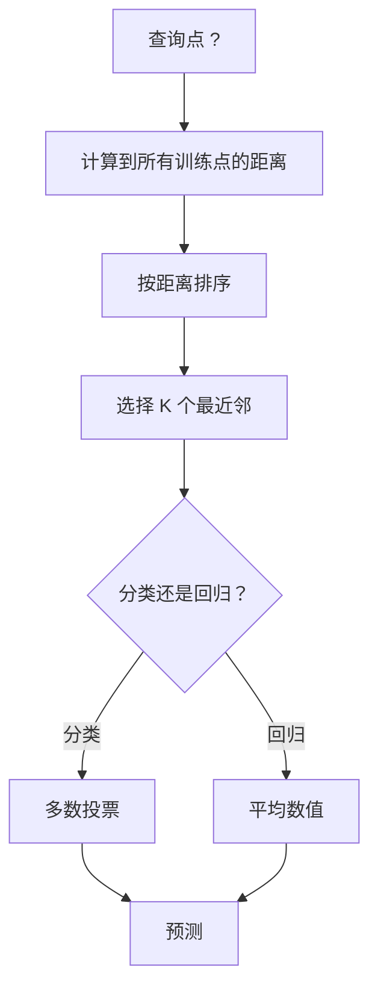
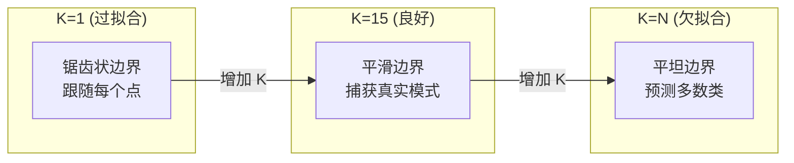
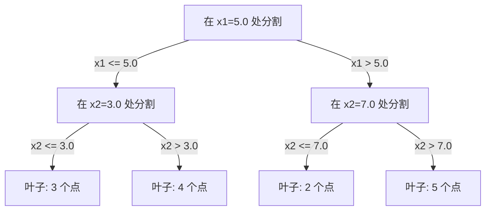

# K-近邻与距离

> 存储一切。通过查看邻居进行预测。这是最简单却实际有效的算法。

**类型：** 构建
**语言：** Python
**前置条件：** 阶段 1（第 14 课：范数与距离）
**时间：** 约 90 分钟

## 学习目标

- 从零实现带可配置 K 值和距离加权投票的 KNN 分类与回归
- 比较 L1、L2、余弦和闵可夫斯基距离度量，并为给定数据类型选择合适的度量
- 解释维度灾难，并说明为什么 KNN 在高维空间中性能下降
- 构建用于高效最近邻搜索的 KD 树，并分析其何时优于暴力搜索

## 问题描述

你有一个数据集。一个新数据点到达。你需要对其进行分类或预测其数值。与线性回归或支持向量机等方法从数据中学习参数不同，你只需找到离新点最近的 K 个训练点，然后让它们投票。

这就是 K-近邻算法。没有训练阶段，没有要学习的参数，没有要最小化的损失函数。你存储整个训练集，并在预测时计算距离。

听起来简单得不像能工作。但 KNN 在许多问题上出奇地有竞争力，尤其是在中小型数据集上，深入理解它能揭示基本概念：距离度量的选择（与阶段 1 第 14 课相关）、维度灾难，以及懒惰学习与急切学习的区别。

KNN 在现代 AI 中也随处可见，只是换了个名字。向量数据库对嵌入进行 KNN 搜索。检索增强生成（RAG）找到最近的 K 个文档块。推荐系统找到相似的用户或物品。算法是一样的，只是规模和数据结构不同。

## 概念

### KNN 的工作原理

给定一个带标签的数据集和一个新的查询点：

1. 计算查询点到数据集中每个点的距离
2. 按距离排序
3. 取最近的 K 个点
4. 对于分类：这 K 个邻居进行多数投票
5. 对于回归：对 K 个邻居的值取平均（或加权平均）



这就是整个算法。没有拟合，没有梯度下降，没有迭代。

### 选择 K

K 是唯一的超参数。它控制着偏差-方差权衡：

| K | 行为 |
|---|------|
| K = 1 | 决策边界跟随每个点。训练误差为零。高方差。过拟合 |
| 小 K (3-5) | 对局部结构敏感。能捕获复杂边界 |
| 大 K | 更平滑的边界。对噪声更鲁棒。可能欠拟合 |
| K = N | 对每个点都预测多数类。最大偏差 |

一个常见的起点是对于包含 N 个点的数据集，取 K = sqrt(N)。对于二分类，使用奇数 K 以避免平局。



### 距离度量

距离函数定义了“近”的含义。不同的度量会产生不同的邻居、不同的预测。

**L2（欧几里得）** 是默认选项。直线距离。

```
d(a, b) = sqrt(sum((a_i - b_i)^2))
```

对特征尺度敏感。在使用 L2 进行 KNN 之前，务必标准化特征。

**L1（曼哈顿）** 求和绝对差值。比 L2 对异常值更鲁棒，因为它不平方差值。

```
d(a, b) = sum(|a_i - b_i|)
```

**余弦距离** 测量向量之间的角度，忽略大小。对于文本和嵌入数据至关重要。

```
d(a, b) = 1 - (a . b) / (||a|| * ||b||)
```

**闵可夫斯基距离** 用参数 p 泛化 L1 和 L2。

```
d(a, b) = (sum(|a_i - b_i|^p))^(1/p)

p=1: 曼哈顿
p=2: 欧几里得
p->inf: 切比雪夫 (最大绝对差值)
```

使用哪种度量取决于数据：

| 数据类型 | 最佳度量 | 原因 |
|---------|----------|------|
| 数值特征，尺度相似 | L2（欧几里得） | 默认，适用于空间数据 |
| 数值特征，有异常值 | L1（曼哈顿） | 鲁棒，不放大大的差异 |
| 文本嵌入 | 余弦 | 大小是噪声，方向才有意义 |
| 高维稀疏 | 余弦或 L1 | L2 受维度灾难影响 |
| 混合类型 | 自定义距离 | 按特征类型组合度量 |

### 加权 KNN

标准 KNN 对所有 K 个邻居赋予相同权重。但距离为 0.1 的邻居应该比距离为 5.0 的邻居更重要。

**距离加权 KNN** 按距离的倒数对每个邻居加权：

```
weight_i = 1 / (distance_i + epsilon)

对于分类：加权投票
对于回归：加权平均 = sum(w_i * y_i) / sum(w_i)
```

epsilon 防止查询点精确匹配训练点时出现除以零。

加权 KNN 对 K 的选择不那么敏感，因为远距离的邻居贡献很小。

### 维度灾难

KNN 在高维度下性能下降。这不是模糊的担忧，而是数学事实。

**问题 1：距离趋同。** 随着维度的增加，最大距离与最小距离的比值趋近于 1。所有点与查询点都变得同样“远”。

```
在 d 维空间中，对于随机均匀分布的点：

d=2:    max_dist / min_dist = 变化很大
d=100:  max_dist / min_dist ~ 1.01
d=1000: max_dist / min_dist ~ 1.001

当所有距离几乎相等时，“最近”就没有意义了。
```

**问题 2：体积爆炸。** 为了在固定比例的数据中捕获 K 个邻居，你需要将搜索半径扩展到覆盖特征空间更大比例的范围。高维中的“邻域”包含了大部分空间。

**问题 3：角落占优。** 在 d 维单位超立方体中，大部分体积集中在角落附近，而不是中心。随着 d 的增长，立方体内切球包含的体积比例趋于零。

实际后果：KNN 在大约 20-50 个特征以内表现良好。超出此范围，需要在应用 KNN 之前进行降维（PCA、UMAP、t-SNE），或者使用利用数据固有低维性的基于树的搜索结构。

### KD 树：快速最近邻搜索

暴力 KNN 计算查询点到每个训练点的距离。每个查询需要 O(n * d)。对于大型数据集，这太慢了。

KD 树沿特征轴递归划分空间。每一层沿一个维度在中位数值处进行分割。



为了找到最近邻，遍历树到包含查询点的叶子，然后回溯，仅当相邻分区可能包含更近的点时才检查它们。

平均查询时间：低维情况下为 O(log n)。但在高维（d > 20）中，KD 树退化到 O(n)，因为回溯减少的分支越来越少。

### 球树：适用于中等维度

球树将数据划分为嵌套的超球体，而不是轴对齐的盒子。每个节点定义一个球体（中心 + 半径），包含该子树中的所有点。

相对于 KD 树的优势：
- 在中等维度（最高约 50）下表现更好
- 处理非轴对齐的结构
- 更紧的边界体积意味着搜索时可以剪除更多分支

KD 树和球树都是精确算法。对于真正的大规模搜索（数百万点、数百维），使用近似最近邻方法（HNSW、IVF、乘积量化）。这些在阶段 1 第 14 课中介绍。

### 懒惰学习与急切学习

KNN 是一种懒惰学习器：训练时不进行任何计算，所有计算都在预测时进行。大多数其他算法（线性回归、支持向量机、神经网络）是急切学习器：它们在训练时进行大量计算以构建一个紧凑模型，然后预测很快。

| 方面 | 懒惰（KNN） | 急切（支持向量机、神经网络） |
|------|------------|---------------------------|
| 训练时间 | O(1)，仅存储数据 | O(n * 迭代次数) |
| 预测时间 | 每个查询 O(n * d) | O(d) 或 O(参数) |
| 预测时内存 | 存储整个训练集 | 仅存储模型参数 |
| 适应新数据 | 立即添加点 | 重新训练模型 |
| 决策边界 | 隐式，运行时计算 | 显式，训练后固定 |

懒惰学习在以下情况下是理想的：
- 数据集经常变化（添加/移除点而无需重新训练）
- 只需要对很少的查询进行预测
- 希望训练时间为零
- 数据集足够小，暴力搜索很快

### KNN 用于回归

KNN 用于回归不是进行多数投票，而是对 K 个邻居的目标值取平均。

```
prediction = (1/K) * sum(y_i for i in K nearest neighbors)

或者使用距离加权：
prediction = sum(w_i * y_i) / sum(w_i)
其中 w_i = 1 / distance_i
```

KNN 回归产生分段常数（或加权后的分段平滑）预测。它不能外推到训练数据的范围之外。如果训练目标都在 0 到 100 之间，KNN 永远不会预测出 200。

## 动手构建

### 步骤 1：距离函数

实现 L1、L2、余弦和闵可夫斯基距离。这些直接与阶段 1 第 14 课相关。

```python
import math

def l2_distance(a, b):
    return math.sqrt(sum((ai - bi) ** 2 for ai, bi in zip(a, b)))

def l1_distance(a, b):
    return sum(abs(ai - bi) for ai, bi in zip(a, b))

def cosine_distance(a, b):
    dot_val = sum(ai * bi for ai, bi in zip(a, b))
    norm_a = math.sqrt(sum(ai ** 2 for ai in a))
    norm_b = math.sqrt(sum(bi ** 2 for bi in b))
    if norm_a == 0 or norm_b == 0:
        return 1.0
    return 1.0 - dot_val / (norm_a * norm_b)

def minkowski_distance(a, b, p=2):
    if p == float('inf'):
        return max(abs(ai - bi) for ai, bi in zip(a, b))
    return sum(abs(ai - bi) ** p for ai, bi in zip(a, b)) ** (1 / p)
```

### 步骤 2：KNN 分类器和回归器

构建完整的 KNN，包含可配置的 K、距离度量和可选的距离加权。

```python
class KNN:
    def __init__(self, k=5, distance_fn=l2_distance, weighted=False,
                 task="classification"):
        self.k = k
        self.distance_fn = distance_fn
        self.weighted = weighted
        self.task = task
        self.X_train = None
        self.y_train = None

    def fit(self, X, y):
        self.X_train = X
        self.y_train = y

    def predict(self, X):
        return [self._predict_one(x) for x in X]
```

### 步骤 3：用于高效搜索的 KD 树

从头开始构建一个 KD 树，它在每个维度的中位数上递归分割。

```python
class KDTree:
    def __init__(self, X, indices=None, depth=0):
        # 递归分割数据
        self.axis = depth % len(X[0])
        # 在当前轴的中位数处分割
        ...

    def query(self, point, k=1):
        # 遍历到叶子，然后回溯
        ...
```

完整实现和所有辅助方法及演示请见 `code/knn.py`。

### 步骤 4：特征缩放

KNN 需要特征缩放，因为距离对特征大小敏感。范围从 0 到 1000 的特征会主导范围从 0 到 1 的特征。

```python
def standardize(X):
    n = len(X)
    d = len(X[0])
    means = [sum(X[i][j] for i in range(n)) / n for j in range(d)]
    stds = [
        max(1e-10, (sum((X[i][j] - means[j]) ** 2 for i in range(n)) / n) ** 0.5)
        for j in range(d)
    ]
    return [[((X[i][j] - means[j]) / stds[j]) for j in range(d)] for i in range(n)], means, stds
```

## 使用它

使用 scikit-learn：

```python
from sklearn.neighbors import KNeighborsClassifier
from sklearn.preprocessing import StandardScaler
from sklearn.pipeline import Pipeline

clf = Pipeline([
    ("scaler", StandardScaler()),
    ("knn", KNeighborsClassifier(n_neighbors=5, metric="euclidean")),
])
clf.fit(X_train, y_train)
print(f"准确率: {clf.score(X_test, y_test):.4f}")
```

当数据集足够大且维度足够低时，scikit-learn 会自动使用 KD 树或球树。对于高维数据，它会回退到暴力搜索。你可以通过 `algorithm` 参数控制。

对于大规模最近邻搜索（数百万向量），使用 FAISS、Annoy 或向量数据库：

```python
import faiss

index = faiss.IndexFlatL2(dimension)
index.add(embeddings)
distances, indices = index.search(query_vectors, k=5)
```

## 练习

1. 在一个包含 3 个类别的 2D 数据集上实现 KNN 分类。绘制 K=1、K=5、K=15 和 K=N 下的决策边界。观察从过拟合到欠拟合的转变。

2. 生成 1000 个随机点，维度分别为 2、5、10、50、100 和 500。对于每个维度，计算最大成对距离与最小成对距离的比值。绘制比值随维度变化的曲线，以可视化维度灾难。

3. 在一个文本分类问题（使用 TF-IDF 向量）上比较 L1、L2 和余弦距离的 KNN。哪种度量准确率最高？为什么余弦通常对文本更有效？

4. 实现一个 KD 树，并在 1k、10k 和 100k 个点（2D、10D 和 50D）的数据集上测量查询时间与暴力搜索的对比。在哪个维度上 KD 树不再比暴力搜索快？

5. 构建一个用于 y = sin(x) + 噪声的加权 KNN 回归器。将其与未加权 KNN 在 K=3、10、30 下进行比较。展示加权能产生更平滑的预测，尤其是对于大的 K。

## 关键术语

| 术语 | 实际含义 |
|------|---------|
| K-近邻 | 非参数算法，通过找到离查询点最近的 K 个训练点进行预测 |
| 懒惰学习 | 训练时不进行计算，所有工作都在预测时完成。KNN 是典型例子 |
| 急切学习 | 训练时进行大量计算以构建紧凑模型。大多数机器学习算法都是急切的 |
| 维度灾难 | 在高维空间中，距离趋同，邻域扩展到覆盖大部分空间，使 KNN 无效 |
| KD 树 | 沿特征轴递归划分空间的二叉树。低维下查询时间为 O(log n) |
| 球树 | 嵌套超球体的树。在中等维度（最高约 50）下比 KD 树效果更好 |
| 加权 KNN | 邻居按距离倒数加权。更近的邻居对预测影响更大 |
| 特征缩放 | 将特征归一化到可比范围。对于基于距离的方法（如 KNN）是必需的 |
| 多数投票 | 通过统计 K 个邻居中出现最多的类别进行分类 |
| 暴力搜索 | 计算到每个训练点的距离。每个查询 O(n*d)。精确但对大 n 慢 |
| 近似最近邻 | 比精确搜索更快找到近似最近点的算法（HNSW、LSH、IVF） |
| 沃罗诺伊图 | 空间划分，每个区域包含所有比到其他训练点更近的点。K=1 的 KNN 产生沃罗诺伊边界 |

## 进一步阅读

- [Cover & Hart: Nearest Neighbor Pattern Classification (1967)](https://ieeexplore.ieee.org/document/1053964) - 基础性 KNN 论文，证明了其错误率最多是贝叶斯最优的两倍
- [Friedman, Bentley