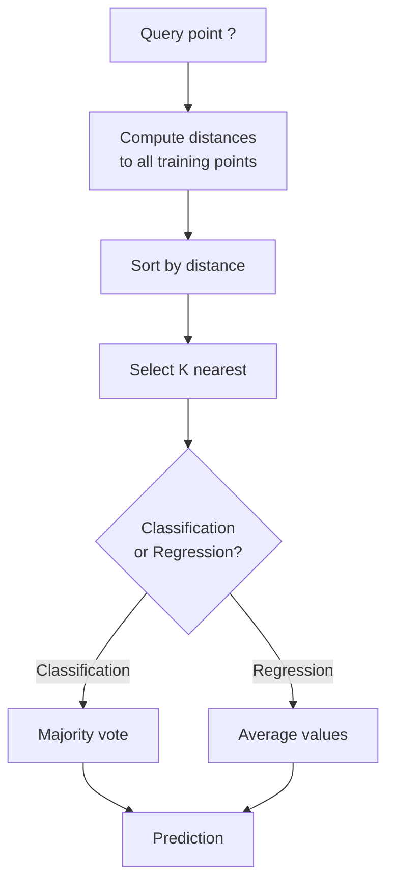
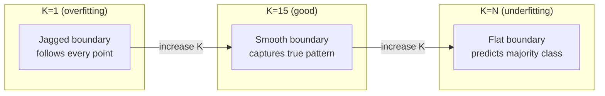
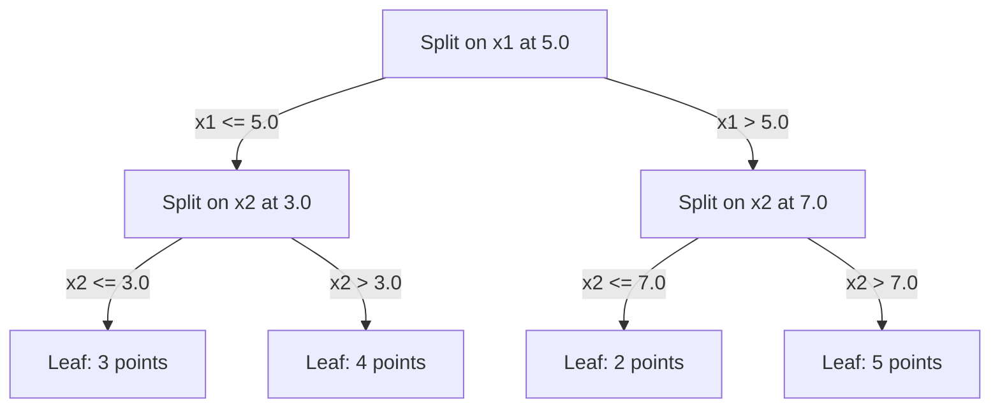

# 06 · K 近邻与距离度量

> 存下一切。靠观察邻居来预测。这是真正能用的最简单的算法。

**类型：** 实践构建
**语言：** Python
**前置：** 第 1 阶段（第 14 课「范数与距离」）
**时长：** 约 90 分钟

## 学习目标

- 从零实现 KNN 分类与回归，支持可配置的 K 值与基于距离加权的投票
- 比较 L1、L2、余弦（cosine）与闵可夫斯基（Minkowski）距离度量，并针对给定数据类型选择合适的度量
- 解释「维度灾难（curse of dimensionality）」，并演示为何 KNN 在高维空间中会失效
- 构建 KD 树（KD-tree）以实现高效的最近邻搜索，并分析它在何时优于暴力搜索

## 问题所在

你有一个数据集。一个新的数据点到来。你需要对它分类或预测它的取值。与其从数据中学习参数（像线性回归或支持向量机那样），你只需找出离这个新点最近的 K 个训练点，让它们投票决定。

这就是 K 近邻（K-nearest neighbors，KNN）。它没有训练阶段。没有要学习的参数。没有要最小化的损失函数。你存下整个训练集，并在预测时计算距离。

它听起来简单到不像能用。但 KNN 在许多问题上的表现出人意料地有竞争力，尤其是在中小规模数据集上；而深入理解它能揭示一些基础概念：距离度量的选择（衔接第 1 阶段第 14 课）、维度灾难，以及「惰性学习（lazy learning）」与「急切学习（eager learning）」之间的区别。

KNN 在现代 AI 中也无处不在，只是换了名字。向量数据库在嵌入向量上做 KNN 搜索。检索增强生成（retrieval-augmented generation，RAG）查找最近的 K 个文档块。推荐系统查找相似的用户或物品。算法是同一个，区别只在于规模和数据结构。

## 核心概念

### KNN 如何工作

给定一个带标签的数据点集合和一个新的查询点：

1. 计算查询点到数据集中每个点的距离
2. 按距离排序
3. 取最近的 K 个点
4. 对于分类：在这 K 个邻居中进行多数投票
5. 对于回归：取这 K 个邻居取值的平均值（或加权平均值）



这就是整个算法。没有拟合。没有梯度下降。没有训练轮次（epoch）。

### 如何选择 K

K 是唯一的超参数。它控制着「偏差-方差权衡（bias-variance trade-off）」：

| K | 行为 |
|---|----------|
| K = 1 | 决策边界紧贴每一个点。训练误差为零。方差高。过拟合 |
| 较小的 K（3-5） | 对局部结构敏感。能捕捉复杂的边界 |
| 较大的 K | 边界更平滑。对噪声更鲁棒。可能欠拟合 |
| K = N | 对每个点都预测为多数类。偏差最大 |

对于一个有 N 个点的数据集，一个常见的起点是 K = sqrt(N)。对于二分类，使用奇数 K 以避免平票。



### 距离度量

距离函数定义了「近」的含义。不同的度量会产生不同的邻居、不同的预测。

**L2（欧几里得，Euclidean）** 是默认度量。即直线距离。

```
d(a, b) = sqrt(sum((a_i - b_i)^2))
```

它对特征尺度敏感。在 KNN 中使用 L2 之前，务必先对特征做标准化。

**L1（曼哈顿，Manhattan）** 对各维差值的绝对值求和。由于不对差值做平方，它比 L2 对离群点更鲁棒。

```
d(a, b) = sum(|a_i - b_i|)
```

**余弦距离（Cosine distance）** 度量向量之间的夹角，忽略幅度。对于文本和嵌入数据至关重要。

```
d(a, b) = 1 - (a . b) / (||a|| * ||b||)
```

**闵可夫斯基（Minkowski）** 通过参数 p 推广了 L1 和 L2。

```
d(a, b) = (sum(|a_i - b_i|^p))^(1/p)

p=1: Manhattan
p=2: Euclidean
p->inf: Chebyshev (max absolute difference)
```

该用哪种度量取决于数据：

| 数据类型 | 最佳度量 | 原因 |
|-----------|------------|-----|
| 数值特征，尺度相近 | L2（欧几里得） | 默认选择，适用于空间数据 |
| 数值特征，含离群点 | L1（曼哈顿） | 鲁棒，不会放大大的差值 |
| 文本嵌入 | 余弦 | 幅度是噪声，方向才是含义 |
| 高维稀疏 | 余弦或 L1 | L2 受维度灾难影响 |
| 混合类型 | 自定义距离 | 按特征类型组合不同度量 |

### 加权 KNN

标准 KNN 对全部 K 个邻居赋予相同权重。但距离为 0.1 的邻居理应比距离为 5.0 的邻居更重要。

**距离加权 KNN（Distance-weighted KNN）** 按距离的倒数对每个邻居加权：

```
weight_i = 1 / (distance_i + epsilon)

For classification: weighted vote
For regression:     weighted average = sum(w_i * y_i) / sum(w_i)
```

其中 epsilon 用于在查询点与某个训练点完全重合时防止除以零。

加权 KNN 对 K 值的选择不那么敏感，因为不论 K 取多少，较远的邻居贡献都极小。

### 维度灾难

KNN 的性能在高维下会退化。这不是一种含糊的担忧，而是一个数学事实。

**问题 1：距离趋于收敛。** 随着维度增加，最大距离与最小距离之比趋近于 1。所有点都变得与查询点「同样远」。

```
In d dimensions, for random uniform points:

d=2:    max_dist / min_dist = varies widely
d=100:  max_dist / min_dist ~ 1.01
d=1000: max_dist / min_dist ~ 1.001

When all distances are nearly equal, "nearest" is meaningless.
```

**问题 2：体积爆炸式增长。** 为了在固定比例的数据中捕捉 K 个邻居，你必须扩大搜索半径，以覆盖特征空间中大得多的比例。高维中的「邻域」会囊括空间的大部分。

**问题 3：角落占主导。** 在 d 维的单位超立方体中，绝大部分体积集中在角落附近，而非中心。内接于该立方体的球体所占的体积比例，会随 d 增大而趋于消失。

实际后果是：KNN 在大约 20-50 个特征以内效果良好。超过这个范围，你就需要在应用 KNN 前做降维（PCA、UMAP、t-SNE），或者使用能利用数据内在低维结构的基于树的搜索结构。

### KD 树：快速最近邻搜索

暴力 KNN 计算查询点到每一个训练点的距离。每次查询的复杂度为 O(n * d)。对于大型数据集，这太慢了。

KD 树沿特征坐标轴递归地划分空间。在每一层，它沿某一维度按中位数进行切分。



要找最近邻，先遍历到包含查询点的叶子节点，然后回溯，仅在相邻分区可能包含更近的点时才去检查它们。

平均查询时间：低维下为 O(log n)。但 KD 树在高维（d > 20）下会退化到 O(n)，因为回溯能剪除的分支越来越少。

### Ball 树：在中等维度下更优

Ball 树（球树）将数据划分为嵌套的超球体，而非轴对齐的盒子。每个节点定义一个球（中心 + 半径），包含该子树中的所有点。

相对于 KD 树的优势：
- 在中等维度（约 50 维以内）下表现更好
- 能处理非轴对齐的结构
- 更紧致的包围体意味着搜索时能剪除更多分支

KD 树和 Ball 树都是精确算法。对于真正大规模的搜索（数百万个点、数百个维度），则改用近似最近邻方法（HNSW、IVF、乘积量化）。这些内容在第 1 阶段第 14 课中讲解。

### 惰性学习 vs 急切学习

KNN 是一个惰性学习器（lazy learner）：它在训练时不做任何工作，所有工作都在预测时进行。大多数其他算法（线性回归、支持向量机、神经网络）是急切学习器（eager learner）：它们在训练时做大量计算以构建一个紧凑的模型，之后预测就很快。

| 方面 | 惰性（KNN） | 急切（SVM、神经网络） |
|--------|------------|------------------------|
| 训练时间 | O(1)，仅存储数据 | O(n * epochs) |
| 预测时间 | 每次查询 O(n * d) | O(d) 或 O(参数量) |
| 预测时的内存 | 存储整个训练集 | 仅存储模型参数 |
| 适应新数据 | 即时加入新点 | 重新训练模型 |
| 决策边界 | 隐式，运行时即时计算 | 显式，训练后固定 |

惰性学习在以下情况下是理想选择：
- 数据集频繁变化（增删点而无需重新训练）
- 你只需对极少量查询做预测
- 你希望训练时间为零
- 数据集足够小，暴力搜索足够快

### 用于回归的 KNN

KNN 用于回归时，不做多数投票，而是对这 K 个邻居的目标值取平均。

```
prediction = (1/K) * sum(y_i for i in K nearest neighbors)

Or with distance weighting:
prediction = sum(w_i * y_i) / sum(w_i)
where w_i = 1 / distance_i
```

KNN 回归产生的是分段常数（加权时为分段平滑）的预测。它无法外推到训练数据范围之外。如果训练目标值全都介于 0 和 100 之间，KNN 永远不会预测出 200。

## 动手构建

### 第 1 步：距离函数

实现 L1、L2、余弦和闵可夫斯基距离。这些直接衔接第 1 阶段第 14 课。

```python
import math

def l2_distance(a, b):
    return math.sqrt(sum((ai - bi) ** 2 for ai, bi in zip(a, b)))

def l1_distance(a, b):
    return sum(abs(ai - bi) for ai, bi in zip(a, b))

def cosine_distance(a, b):
    dot_val = sum(ai * bi for ai, bi in zip(a, b))
    norm_a = math.sqrt(sum(ai ** 2 for ai in a))
    norm_b = math.sqrt(sum(bi ** 2 for bi in b))
    if norm_a == 0 or norm_b == 0:
        return 1.0
    return 1.0 - dot_val / (norm_a * norm_b)

def minkowski_distance(a, b, p=2):
    if p == float('inf'):
        return max(abs(ai - bi) for ai, bi in zip(a, b))
    return sum(abs(ai - bi) ** p for ai, bi in zip(a, b)) ** (1 / p)
```

### 第 2 步：KNN 分类器与回归器

构建完整的 KNN，支持可配置的 K、距离度量，以及可选的距离加权。

```python
class KNN:
    def __init__(self, k=5, distance_fn=l2_distance, weighted=False,
                 task="classification"):
        self.k = k
        self.distance_fn = distance_fn
        self.weighted = weighted
        self.task = task
        self.X_train = None
        self.y_train = None

    def fit(self, X, y):
        self.X_train = X
        self.y_train = y

    def predict(self, X):
        return [self._predict_one(x) for x in X]
```

### 第 3 步：用于高效搜索的 KD 树

从零构建一棵 KD 树，沿每一维度按中位数递归切分。

```python
class KDTree:
    def __init__(self, X, indices=None, depth=0):
        # 递归地划分数据
        self.axis = depth % len(X[0])
        # 沿当前坐标轴按中位数切分
        ...

    def query(self, point, k=1):
        # 遍历到叶子节点，然后回溯
        ...
```

完整实现（含全部辅助方法和演示）见 `code/knn.py`。

### 第 4 步：特征缩放

KNN 需要做特征缩放，因为距离对特征的量级很敏感。一个取值范围在 0 到 1000 的特征，会压倒一个取值范围在 0 到 1 的特征。

```python
def standardize(X):
    n = len(X)
    d = len(X[0])
    means = [sum(X[i][j] for i in range(n)) / n for j in range(d)]
    stds = [
        max(1e-10, (sum((X[i][j] - means[j]) ** 2 for i in range(n)) / n) ** 0.5)
        for j in range(d)
    ]
    return [[((X[i][j] - means[j]) / stds[j]) for j in range(d)] for i in range(n)], means, stds
```

## 实际应用

使用 scikit-learn：

```python
from sklearn.neighbors import KNeighborsClassifier
from sklearn.preprocessing import StandardScaler
from sklearn.pipeline import Pipeline

clf = Pipeline([
    ("scaler", StandardScaler()),
    ("knn", KNeighborsClassifier(n_neighbors=5, metric="euclidean")),
])
clf.fit(X_train, y_train)
print(f"Accuracy: {clf.score(X_test, y_test):.4f}")
```

当数据集足够大且维度足够低时，scikit-learn 会自动使用 KD 树或 Ball 树。对于高维数据，它会回退到暴力搜索。你可以通过 `algorithm` 参数来控制这一行为。

对于大规模最近邻搜索（数百万个向量），请使用 FAISS、Annoy 或向量数据库：

```python
import faiss

index = faiss.IndexFlatL2(dimension)
index.add(embeddings)
distances, indices = index.search(query_vectors, k=5)
```

## 练习

1. 在一个包含 3 个类别的 2D 数据集上实现 KNN 分类。分别为 K=1、K=5、K=15 和 K=N 绘制决策边界。观察从过拟合到欠拟合的过渡。

2. 在 2、5、10、50、100 和 500 维空间中各生成 1000 个随机点。对每个维度，计算最大成对距离与最小成对距离之比。绘制该比值随维度变化的曲线，以可视化维度灾难。

3. 在一个文本分类问题上（使用 TF-IDF 向量）比较 KNN 的 L1、L2 和余弦距离。哪种度量的准确率最高？为什么余弦距离对文本往往胜出？

4. 实现一棵 KD 树，并在 2D、10D 和 50D 下，对 1k、10k 和 100k 个点的数据集测量查询时间与暴力搜索的对比。在什么维度下，KD 树不再比暴力搜索更快？

5. 为 y = sin(x) + noise 构建一个加权 KNN 回归器。针对 K=3、10、30，将其与非加权 KNN 进行比较。证明加权能产生更平滑的预测，尤其是在 K 较大时。

## 关键术语

| 术语 | 实际含义 |
|------|----------------------|
| K 近邻（K-nearest neighbors） | 非参数算法，通过查找离查询点最近的 K 个训练点来做预测 |
| 惰性学习（Lazy learning） | 训练时不做任何计算。所有工作都发生在预测时。KNN 是其经典范例 |
| 急切学习（Eager learning） | 训练时做大量计算以构建紧凑模型。大多数机器学习算法都是急切型 |
| 维度灾难（Curse of dimensionality） | 在高维下，距离趋于收敛、邻域膨胀到覆盖空间的大部分，使 KNN 失效 |
| KD 树（KD-tree） | 沿特征坐标轴递归划分空间的二叉树。低维下查询为 O(log n) |
| Ball 树（Ball tree） | 由嵌套超球体构成的树。在中等维度（约 50 维以内）下比 KD 树更优 |
| 加权 KNN（Weighted KNN） | 邻居按距离的倒数加权。越近的邻居对预测的影响越大 |
| 特征缩放（Feature scaling） | 将特征归一化到可比较的范围。对像 KNN 这样基于距离的方法是必需的 |
| 多数投票（Majority vote） | 通过统计 K 个邻居中哪个类别最常见来分类 |
| 暴力搜索（Brute force search） | 计算到每个训练点的距离。每次查询 O(n*d)。精确但在 n 较大时很慢 |
| 近似最近邻（Approximate nearest neighbor） | 一类算法（HNSW、LSH、IVF），比精确搜索快得多地找到近似最近的点 |
| 沃罗诺伊图（Voronoi diagram） | 对空间的一种划分，其中每个区域包含所有距离某一训练点比距其他任何点都更近的点。K=1 的 KNN 产生的就是沃罗诺伊边界 |

## 延伸阅读

- [Cover & Hart：最近邻模式分类（1967）](https://ieeexplore.ieee.org/document/1053964) —— 奠基性的 KNN 论文，证明其错误率至多为贝叶斯最优错误率的两倍
- [Friedman、Bentley、Finkel：一种在对数期望时间内查找最佳匹配的算法（1977）](https://dl.acm.org/doi/10.1145/355744.355745) —— 最初的 KD 树论文
- [Beyer 等：「最近邻」何时有意义？（1999）](https://link.springer.com/chapter/10.1007/3-540-49257-7_15) —— 对最近邻维度灾难的形式化分析
- [scikit-learn 最近邻文档](https://scikit-learn.org/stable/modules/neighbors.html) —— 含算法选择的实用指南
- [FAISS：高效相似度搜索库](https://github.com/facebookresearch/faiss) —— Meta 用于十亿规模近似最近邻搜索的库
