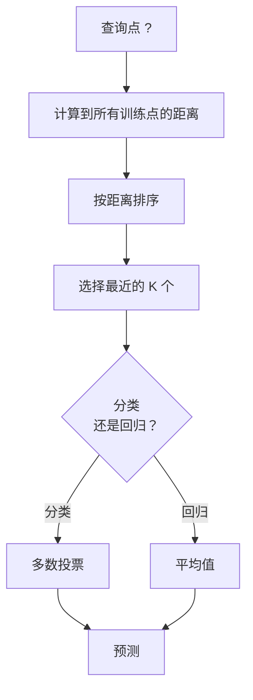
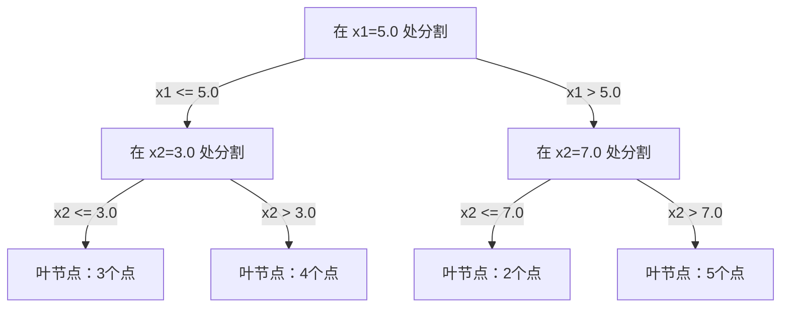

# K 近邻与距离

> 存储一切。通过查看邻居进行预测。最简单但实际有效的算法。

**类型：** 构建
**语言：** Python
**前置要求：** 第一阶段（第14课 范数与距离）
**时间：** ~90分钟

## 学习目标

- 从头实现带可配置 K 和距离加权投票的 KNN 分类与回归
- 比较 L1、L2、余弦和闵可夫斯基距离度量，并为给定数据类型选择合适的度量
- 解释维度灾难（curse of dimensionality），并证明为什么 KNN 在高维空间中性能退化
- 构建 KD-tree 用于高效最近邻搜索，并分析它何时优于暴力搜索

## 问题

你有一个数据集。一个新的数据点到达。你需要对其进行分类或预测其值。不是从数据中学习参数（如线性回归或 SVM），而是找到最接近新点的 K 个训练点，让它们投票。

这就是 K 近邻（KNN）。没有训练阶段。没有需要学习的参数。没有需要最小化的损失函数。你存储整个训练集，在预测时计算距离。

它听起来太简单了，不可能有效。但 KNN 对许多问题具有令人惊讶的竞争力，特别是中小型数据集，并且深入理解它揭示了基本概念：距离度量的选择（连接到第一阶段第14课）、维度灾难，以及惰性学习与急切学习之间的区别。

KNN 也以不同的名称出现在现代 AI 的各个角落。向量数据库对 embedding 进行 KNN 搜索。检索增强生成（RAG）找到最相似的 K 个文档块。推荐系统找到相似的用户或物品。算法是一样的。规模和数据结构不同。

## 概念

### KNN 如何工作

给定一个带标签的数据集和一个新的查询点：

1. 计算查询点到数据集中每个点的距离
2. 按距离排序
3. 取最近的 K 个点
4. 对于分类：在 K 个邻居中进行多数投票
5. 对于回归：K 个邻居值的平均（或加权平均）


```mermaid
graph TD
    Q["查询点 ?"] --> D["计算到所有训练点的距离"]
    D --> S["按距离排序"]
    S --> K["选择最近的 K 个"]
    K --> C{"分类<br>还是回归？"}
    C -->|分类| V["多数投票"]
    C -->|回归| A["平均值"]
    V --> P["预测"]
    A --> P
```

这就是完整的算法。没有拟合。没有梯度下降。没有训练轮次。

### 选择 K

K 是唯一的超参数。它控制偏差-方差权衡：

| K | 行为 |
|---|----------|
| K = 1 | 决策边界跟随每个点。训练误差为零。高方差。过拟合 |
| 小 K (3-5) | 对局部结构敏感。能捕捉复杂边界 |
| 大 K | 更平滑的边界。对噪声更鲁棒。可能欠拟合 |
| K = N | 对每个点预测多数类别。最大偏差 |

常见的起点是 K = sqrt(N)（N 为数据集大小）。对于二分类使用奇数 K 以避免平局。


```mermaid
graph LR
    subgraph "K=1（过拟合）"
        A["锯齿状边界<br>跟随每个点"]
    end
    subgraph "K=15（良好）"
        B["平滑边界<br>捕捉真实模式"]
    end
    subgraph "K=N（欠拟合）"
        C["平坦边界<br>预测多数类别"]
    end
    A -->|"增加 K"| B -->|"增加 K"| C
```

### 距离度量

距离函数定义了"近"的含义。不同的度量产生不同的邻居、不同的预测。

**L2（欧几里得距离）** 是默认选择。直线距离。

```
d(a, b) = sqrt(sum((a_i - b_i)^2))
```

对特征尺度敏感。在使用 L2 与 KNN 之前，务必对特征进行标准化。

**L1（曼哈顿距离）** 求绝对差之和。比 L2 对异常值更鲁棒，因为它不平方差值。

```
d(a, b) = sum(|a_i - b_i|)
```

**余弦距离** 衡量向量之间的角度，忽略大小。对于文本和 embedding 数据至关重要。

```
d(a, b) = 1 - (a . b) / (||a|| * ||b||)
```

**闵可夫斯基距离** 用参数 p 概括 L1 和 L2。

```
d(a, b) = (sum(|a_i - b_i|^p))^(1/p)

p=1：曼哈顿距离
p=2：欧几里得距离
p->inf：切比雪夫距离（最大绝对差）
```

选择哪种度量取决于数据类型：

| 数据类型 | 最佳度量 | 原因 |
|-----------|------------|-----|
| 数值特征，尺度相似 | L2（欧几里得） | 默认，适用于空间数据 |
| 数值特征，有异常值 | L1（曼哈顿） | 鲁棒，不会放大大的差异 |
| 文本 embeddings | 余弦 | 大小是噪声，方向是意义 |
| 高维稀疏 | 余弦或 L1 | L2 受维度灾难影响 |
| 混合类型 | 自定义距离 | 按特征类型组合度量 |

### 加权 KNN

标准 KNN 对所有 K 个邻居赋予相等的权重。但距离 0.1 的邻居应该比距离 5.0 的邻居更重要。

**距离加权 KNN** 按距离的倒数对每个邻居赋权：

```
weight_i = 1 / (distance_i + epsilon)

对于分类：加权投票
对于回归：加权平均 = sum(w_i * y_i) / sum(w_i)
```

epsilon 防止查询点与训练点完全匹配时除以零。

加权 KNN 对 K 的选择不太敏感，因为远处的邻居无论如何贡献很小。

### 维度灾难

KNN 性能在高维空间中退化。这不是一个模糊的担忧，而是一个数学事实。

**问题1：距离趋同。** 随着维度增加，最大距离与最小距离之比趋近于 1。所有点与查询点都变得同样"远"。

```
在 d 维中，对于随机均匀分布的点：

d=2：   max_dist / min_dist = 变化很大
d=100： max_dist / min_dist ~ 1.01
d=1000：max_dist / min_dist ~ 1.001

当所有距离几乎相等时，"最近"就失去了意义。
```

**问题2：体积爆炸。** 要在数据的固定比例内捕获 K 个邻居，你需要将搜索半径扩展到覆盖特征空间的更大比例。高维中的"邻域"包含了大部分空间。

**问题3：角落主导。** 在 d 维的单位超立方体中，大部分体积集中在角落附近，而不是中心。随着 d 增长，内切于立方体的球体包含的体积比例趋近于零。

实际后果：KNN 在约 20-50 个特征以内效果良好。超过这个范围，你需要先进行降维（PCA、UMAP、t-SNE）再应用 KNN，或者需要使用利用数据固有低维度的基于树的搜索结构。

### KD-tree：快速最近邻搜索

暴力 KNN 计算查询点到每个训练点的距离。每查询 O(n * d)。对于大数据集，这太慢了。

KD-tree 沿特征轴递归划分空间。在每个层级，它沿一个维度在中位数处进行分割。


```mermaid
graph TD
    R["在 x1=5.0 处分割"] -->|"x1 <= 5.0"| L["在 x2=3.0 处分割"]
    R -->|"x1 > 5.0"| RR["在 x2=7.0 处分割"]
    L -->|"x2 <= 3.0"| LL["叶节点：3个点"]
    L -->|"x2 > 3.0"| LR["叶节点：4个点"]
    RR -->|"x2 <= 7.0"| RL["叶节点：2个点"]
    RR -->|"x2 > 7.0"| RRR["叶节点：5个点"]
```

要找到最近邻，遍历树到包含查询点的叶节点，然后回溯并仅在相邻分区可能包含更近的点时才检查它们。

平均查询时间：低维时为 O(log n)。但 KD-tree 在高维（d > 20）中退化为 O(n)，因为回溯排除的分支越来越少。

### Ball tree：中等维度的更好选择

Ball tree 将数据划分为嵌套的超球体，而不是轴对齐的框。每个节点定义一个球（中心+半径），包含该子树中的所有点。

相对于 KD-tree 的优势：
- 在中等维度（最多约 50）中效果更好
- 处理非轴对齐结构
- 更紧的包围体意味着搜索期间更多分支被剪枝

KD-tree 和 ball tree 都是精确算法。对于真正大规模的搜索（百万个点、数百个维度），使用近似最近邻方法（HNSW、IVF、乘积量化）。这些在第一阶段第14课中介绍。

### 惰性学习 vs 急切学习

KNN 是惰性学习器：训练时不工作，预测时做所有工作。大多数其他算法（线性回归、SVM、神经网络）是急切学习器：在训练时进行大量计算以构建紧凑模型，然后预测很快。

| 方面 | 惰性（KNN） | 急切（SVM、神经网络） |
|--------|------------|------------------------|
| 训练时间 | O(1) 只存储数据 | O(n * epochs) |
| 预测时间 | 每查询 O(n * d) | O(d) 或 O(参数数) |
| 预测时内存 | 存储整个训练集 | 只存储模型参数 |
| 适应新数据 | 即时添加点 | 重新训练模型 |
| 决策边界 | 隐式，即时计算 | 显式，训练后固定 |

惰性学习在以下情况下是理想的：
- 数据集频繁变化（无需重新训练即可添加/删除点）
- 你只需要对极少数查询进行预测
- 你希望训练时间为零
- 数据集足够小，暴力搜索很快

### KNN 回归

KNN 回归不是进行多数投票，而是对 K 个邻居的目标值求平均。

```
prediction = (1/K) * sum(y_i for i in K nearest neighbors)

或者使用距离加权：
prediction = sum(w_i * y_i) / sum(w_i)
其中 w_i = 1 / distance_i
```

KNN 回归产生分段常数（或加权时为分段平滑）的预测。它不能外推到训练数据范围之外。如果训练目标都在 0 到 100 之间，KNN 永远不会预测出 200。

```figure
knn-smoothness
```

## 动手实现

### 第1步：距离函数

实现 L1、L2、余弦和闵可夫斯基距离。这些直接连接到第一阶段第14课。

```python
import math

def l2_distance(a, b):
    return math.sqrt(sum((ai - bi) ** 2 for ai, bi in zip(a, b)))

def l1_distance(a, b):
    return sum(abs(ai - bi) for ai, bi in zip(a, b))

def cosine_distance(a, b):
    dot_val = sum(ai * bi for ai, bi in zip(a, b))
    norm_a = math.sqrt(sum(ai ** 2 for ai in a))
    norm_b = math.sqrt(sum(bi ** 2 for bi in b))
    if norm_a == 0 or norm_b == 0:
        return 1.0
    return 1.0 - dot_val / (norm_a * norm_b)

def minkowski_distance(a, b, p=2):
    if p == float('inf'):
        return max(abs(ai - bi) for ai, bi in zip(a, b))
    return sum(abs(ai - bi) ** p for ai, bi in zip(a, b)) ** (1 / p)
```

### 第2步：KNN 分类器和回归器

构建完整的 KNN，带可配置的 K、距离度量和可选的距离加权。

```python
class KNN:
    def __init__(self, k=5, distance_fn=l2_distance, weighted=False,
                 task="classification"):
        self.k = k
        self.distance_fn = distance_fn
        self.weighted = weighted
        self.task = task
        self.X_train = None
        self.y_train = None

    def fit(self, X, y):
        self.X_train = X
        self.y_train = y

    def predict(self, X):
        return [self._predict_one(x) for x in X]
```

### 第3步：用于高效搜索的 KD-tree

从头构建一个在每个维度的中位数上递归分割的 KD-tree。

```python
class KDTree:
    def __init__(self, X, indices=None, depth=0):
        # 递归划分数据
        self.axis = depth % len(X[0])
        # 在当前轴的中位数处分割
        ...

    def query(self, point, k=1):
        # 遍历到叶节点，然后回溯
        ...
```

完整实现见 `code/knn.py`，包含所有辅助方法和演示。

### 第4步：特征缩放

KNN 需要特征缩放，因为距离对特征的大小很敏感。范围从 0 到 1000 的特征会主导范围从 0 到 1 的特征。

```python
def standardize(X):
    n = len(X)
    d = len(X[0])
    means = [sum(X[i][j] for i in range(n)) / n for j in range(d)]
    stds = [
        max(1e-10, (sum((X[i][j] - means[j]) ** 2 for i in range(n)) / n) ** 0.5)
        for j in range(d)
    ]
    return [[((X[i][j] - means[j]) / stds[j]) for j in range(d)] for i in range(n)], means, stds
```

## 使用它

使用 scikit-learn：

```python
from sklearn.neighbors import KNeighborsClassifier
from sklearn.preprocessing import StandardScaler
from sklearn.pipeline import Pipeline

clf = Pipeline([
    ("scaler", StandardScaler()),
    ("knn", KNeighborsClassifier(n_neighbors=5, metric="euclidean")),
])
clf.fit(X_train, y_train)
print(f"准确率：{clf.score(X_test, y_test):.4f}")
```

当数据集足够大且维度足够低时，scikit-learn 自动使用 KD-tree 或 ball tree。对于高维数据，它回退到暴力搜索。你可以通过 `algorithm` 参数控制这一点。

对于大规模最近邻搜索（数百万个向量），使用 FAISS、Annoy 或向量数据库：

```python
import faiss

index = faiss.IndexFlatL2(dimension)
index.add(embeddings)
distances, indices = index.search(query_vectors, k=5)
```

## 练习题

1. 在一个3类别的2D数据集上实现 KNN 分类。为 K=1、K=5、K=15 和 K=N 绘制决策边界。观察从过拟合到欠拟合的转变。
2. 生成 1000 个随机点，维度分别为 2、5、10、50、100 和 500。对每个维度，计算最大成对距离与最小成对距离之比。绘制比值 vs 维度图以可视化维度灾难。
3. 在文本分类问题（使用 TF-IDF 向量）上比较 KNN 的 L1、L2 和余弦距离。哪个度量给出的准确率最高？为什么余弦在文本上往往胜出？
4. 实现 KD-tree，并在 1k、10k 和 100k 个点（2D、10D 和 50D）的数据集上测量查询时间与暴力搜索的比较。在多少维度时 KD-tree 不再比暴力搜索快？
5. 为 y = sin(x) + 噪声构建加权 KNN 回归器。将其与非加权 KNN 进行比较（K=3、10、30）。证明加权能产生更平滑的预测，特别是对于大 K。

## 关键术语

| 术语 | 实际含义 |
|------|----------------------|
| K 近邻（K-nearest neighbors） | 非参数算法，通过找到与查询点最近的 K 个训练点来预测 |
| 惰性学习（Lazy learning） | 训练时不进行计算。所有工作发生在预测时。KNN 是典型示例 |
| 急切学习（Eager learning） | 训练时进行大量计算以构建紧凑模型。大多数 ML 算法是急切学习 |
| 维度灾难（Curse of dimensionality） | 在高维中，距离趋同，邻域扩展到覆盖大部分空间，使 KNN 无效 |
| KD-tree | 沿特征轴递归划分空间的二叉树。低维时 O(log n) 查询 |
| Ball tree | 嵌套超球体的树。在中等维度（最多约 50）中比 KD-tree 效果好 |
| 加权 KNN（Weighted KNN） | 邻居按距离倒数加权。更近的邻居对预测有更大的影响 |
| 特征缩放（Feature scaling） | 将特征归一化到可比范围。对 KNN 等基于距离的方法是必需的 |
| 多数投票（Majority vote） | 通过计数 K 个邻居中最常见的类别进行分类 |
| 暴力搜索（Brute force search） | 计算到每个训练点的距离。每查询 O(n*d)。精确但大 n 时慢 |
| 近似最近邻（Approximate nearest neighbor） | 比精确搜索快得多地找到近似最近点的算法（HNSW、LSH、IVF） |
| 泰森多边形（Voronoi diagram） | 空间的分割，其中每个区域包含比任何其他训练点更接近某个训练点的所有点。K=1 的 KNN 产生 Voronoi 边界 |

## 延伸阅读

- [Cover & Hart: Nearest Neighbor Pattern Classification (1967)](https://ieeexplore.ieee.org/document/1053964) - 基础性 KNN 论文，证明其错误率最多为贝叶斯最优的两倍
- [Friedman, Bentley, Finkel: An Algorithm for Finding Best Matches in Logarithmic Expected Time (1977)](https://dl.acm.org/doi/10.1145/355744.355745) - 原始 KD-tree 论文
- [Beyer et al.: When Is "Nearest Neighbor" Meaningful? (1999)](https://link.springer.com/chapter/10.1007/3-540-49257-7_15) - 最近邻维度灾难的正式分析
- [scikit-learn Nearest Neighbors documentation](https://scikit-learn.org/stable/modules/neighbors.html) - 附算法选择的实用指南
- [FAISS: A Library for Efficient Similarity Search](https://github.com/facebookresearch/faiss) - Meta 的十亿级近似最近邻搜索库
