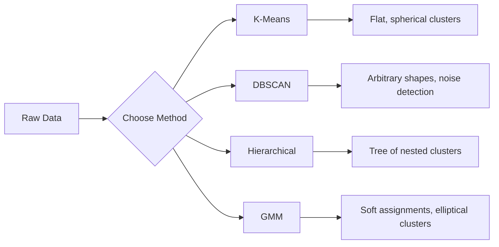

# 教師なし学習

> ラベルも教師もありません。アルゴリズムが自力で構造を見つけます。

**種類:** Build
**言語:** Python
**前提:** Phase 1 (Norms & Distances, Probability & Distributions)、Phase 2 Lessons 1-6
**時間:** 約90分

## 学習目標

- K-Means、DBSCAN、Gaussian Mixture Models をゼロから実装し、それぞれのクラスタリング挙動を比較する
- silhouette score と elbow method を使ってクラスタ品質を評価し、最適な K を選ぶ
- DBSCAN が K-Means より有効になる場面を説明し、非球状クラスタや外れ値を扱えるアルゴリズムを見分ける
- クラスタリング手法を使った異常検知パイプラインを構築し、通常のパターンから外れた点を検出する

## 問題

ここまでの ML レッスンでは、「これが入力で、これが正しい出力」というラベル付きデータを前提にしてきました。現実世界では、ラベル付けにはコストがかかります。病院には数百万件の患者記録があっても、一つひとつに疾患カテゴリが手作業で付けられているとは限りません。EC サイトには数百万件のユーザーセッションがあっても、顧客セグメントが人手でラベル付けされているわけではありません。セキュリティチームにはネットワークログがあっても、すべての異常にフラグが付いているわけではありません。

教師なし学習は、何を探すべきかを教えられなくてもパターンを見つけます。似たデータ点をグループ化し、隠れた構造を発見し、異常を浮かび上がらせます。教師あり学習が解答付きの教科書で学ぶことだとすれば、教師なし学習はパターンが姿を現すまで生データを観察し続けることです。

難しい点は、ラベルがないため「正しい」「間違っている」を直接測れないことです。アルゴリズムが見つけた構造に意味があるかどうかを評価するには、別の道具が必要です。

## コンセプト

### クラスタリング: 似たものをまとめる

クラスタリングは、同じグループ内の点どうしが他のグループの点より似るように、各データ点をグループ（クラスタ）へ割り当てます。常に問うべきことは、「似ている」とは何を意味するのか、です。



### K-Means: 定番の手法

K-Means はデータをちょうど K 個のクラスタに分割します。各クラスタには centroid（重心）があり、すべての点はいちばん近い centroid に属します。

Lloyd's algorithm:

1. 初期 centroid として K 個の点をランダムに選ぶ
2. 各データ点を最も近い centroid に割り当てる
3. 各 centroid を、割り当てられた点の平均として再計算する
4. 割り当てが変わらなくなるまでステップ 2-3 を繰り返す

目的関数（inertia）は、各点から割り当て先 centroid までの二乗距離の合計を測ります。K-Means はこれを最小化しますが、見つけるのは局所最小です。初期化が違えば結果も変わることがあります。

### K の選び方

標準的な方法は 2 つあります。

**Elbow method:** K = 1, 2, 3, ..., n で K-Means を実行します。inertia と K の関係をプロットし、クラスタを増やしても inertia が大きく下がらなくなる「肘」の位置を探します。

**Silhouette score:** 各点について、自分のクラスタ内での近さ (a) と、最も近い別クラスタまでの近さ (b) を比べます。silhouette coefficient は (b - a) / max(a, b) で、-1（誤ったクラスタ）から +1（よくクラスタリングされている）までの値を取ります。全点で平均したものを全体スコアとして使います。

### DBSCAN: 密度ベースのクラスタリング

K-Means はクラスタが球状であることを仮定し、事前に K を選ぶ必要があります。DBSCAN はそのどちらも仮定しません。疎な領域で区切られた密な領域としてクラスタを見つけます。

2 つのパラメータがあります。
- **eps**: 近傍の半径
- **min_samples**: 密な領域を形成するために必要な最小点数

点は 3 種類に分かれます。
- **Core point**: eps 距離以内に少なくとも min_samples 個の点を持つ点
- **Border point**: core point の eps 以内にあるが、それ自体は core point ではない点
- **Noise point**: core でも border でもない点。これらは外れ値です。

DBSCAN は、互いに eps 以内にある core point を同じクラスタとしてつなげます。border point は近くの core point のクラスタに入ります。noise point はどのクラスタにも属しません。

強みは、任意の形のクラスタを見つけ、クラスタ数を自動的に決め、外れ値を識別できることです。弱みは、密度が大きく異なるクラスタが混在すると苦戦することです。

### 階層的クラスタリング

入れ子になったクラスタの木（dendrogram）を構築します。

凝集型（bottom-up）:
1. 各点をそれぞれ独立したクラスタとして開始する
2. 最も近い 2 つのクラスタを結合する
3. クラスタが 1 つだけになるまで繰り返す
4. 目的のレベルで dendrogram を切り、K 個のクラスタを得る

クラスタ間の「近さ」は次のように測れます。
- **Single linkage**: 2 つのクラスタ内の任意の 2 点間の最小距離
- **Complete linkage**: 任意の 2 点間の最大距離
- **Average linkage**: すべての点ペア間距離の平均
- **Ward's method**: クラスタ内分散の合計の増加が最も小さくなる結合

### Gaussian Mixture Models (GMM)

K-Means は hard assignment を返します。各点は必ず 1 つのクラスタだけに属します。GMM は soft assignment を返します。各点が各クラスタに属する確率を持ちます。

GMM は、データが K 個の Gaussian distribution の混合から生成されたと仮定します。それぞれの分布は独自の平均と共分散を持ちます。Expectation-Maximization (EM) algorithm は次を交互に実行します。

- **E-step**: 各点が各 Gaussian に属する確率を計算する
- **M-step**: データの likelihood が最大になるように、各 Gaussian の平均・共分散・混合重みを更新する

GMM は K-Means のような球状クラスタだけでなく楕円形クラスタもモデル化でき、重なり合うクラスタも自然に扱えます。

### どれを使うべきか

| 手法 | 向いている場面 | 避ける場面 |
|--------|----------|------------|
| K-Means | 大規模データセット、球状クラスタ、K が既知 | 不規則な形状、外れ値がある場合 |
| DBSCAN | K が未知、任意形状、外れ値検出 | 密度が異なる場合、非常に高次元 |
| Hierarchical | 小規模データセット、dendrogram が必要、K が未知 | 大規模データセット (O(n^2) memory) |
| GMM | 重なり合うクラスタ、soft assignment が必要 | 非常に大規模なデータセット、次元が多すぎる場合 |

### クラスタリングによる異常検知

クラスタリングは異常検知と相性がよいです。
- **K-Means**: どの centroid からも遠い点を異常とみなす
- **DBSCAN**: noise point は定義上、異常とみなせる
- **GMM**: すべての Gaussian で確率が低い点を異常とみなす

## 実装する

### Step 1: K-Means をゼロから実装する

```python
import math
import random


def euclidean_distance(a, b):
    return math.sqrt(sum((ai - bi) ** 2 for ai, bi in zip(a, b)))


def kmeans(data, k, max_iterations=100, seed=42):
    random.seed(seed)
    n_features = len(data[0])

    centroids = random.sample(data, k)

    for iteration in range(max_iterations):
        clusters = [[] for _ in range(k)]
        assignments = []

        for point in data:
            distances = [euclidean_distance(point, c) for c in centroids]
            nearest = distances.index(min(distances))
            clusters[nearest].append(point)
            assignments.append(nearest)

        new_centroids = []
        for cluster in clusters:
            if len(cluster) == 0:
                new_centroids.append(random.choice(data))
                continue
            centroid = [
                sum(point[j] for point in cluster) / len(cluster)
                for j in range(n_features)
            ]
            new_centroids.append(centroid)

        if all(
            euclidean_distance(old, new) < 1e-6
            for old, new in zip(centroids, new_centroids)
        ):
            print(f"  Converged at iteration {iteration + 1}")
            break

        centroids = new_centroids

    return assignments, centroids
```

### Step 2: Elbow method と silhouette score

```python
def compute_inertia(data, assignments, centroids):
    total = 0.0
    for point, cluster_id in zip(data, assignments):
        total += euclidean_distance(point, centroids[cluster_id]) ** 2
    return total


def silhouette_score(data, assignments):
    n = len(data)
    if n < 2:
        return 0.0

    clusters = {}
    for i, c in enumerate(assignments):
        clusters.setdefault(c, []).append(i)

    if len(clusters) < 2:
        return 0.0

    scores = []
    for i in range(n):
        own_cluster = assignments[i]
        own_members = [j for j in clusters[own_cluster] if j != i]

        if len(own_members) == 0:
            scores.append(0.0)
            continue

        a = sum(euclidean_distance(data[i], data[j]) for j in own_members) / len(own_members)

        b = float("inf")
        for cluster_id, members in clusters.items():
            if cluster_id == own_cluster:
                continue
            avg_dist = sum(euclidean_distance(data[i], data[j]) for j in members) / len(members)
            b = min(b, avg_dist)

        if max(a, b) == 0:
            scores.append(0.0)
        else:
            scores.append((b - a) / max(a, b))

    return sum(scores) / len(scores)


def find_best_k(data, max_k=10):
    print("Elbow method:")
    inertias = []
    for k in range(1, max_k + 1):
        assignments, centroids = kmeans(data, k)
        inertia = compute_inertia(data, assignments, centroids)
        inertias.append(inertia)
        print(f"  K={k}: inertia={inertia:.2f}")

    print("\nSilhouette scores:")
    for k in range(2, max_k + 1):
        assignments, centroids = kmeans(data, k)
        score = silhouette_score(data, assignments)
        print(f"  K={k}: silhouette={score:.4f}")

    return inertias
```

### Step 3: DBSCAN をゼロから実装する

```python
def dbscan(data, eps, min_samples):
    n = len(data)
    labels = [-1] * n
    cluster_id = 0

    def region_query(point_idx):
        neighbors = []
        for i in range(n):
            if euclidean_distance(data[point_idx], data[i]) <= eps:
                neighbors.append(i)
        return neighbors

    visited = [False] * n

    for i in range(n):
        if visited[i]:
            continue
        visited[i] = True

        neighbors = region_query(i)

        if len(neighbors) < min_samples:
            labels[i] = -1
            continue

        labels[i] = cluster_id
        seed_set = list(neighbors)
        seed_set.remove(i)

        j = 0
        while j < len(seed_set):
            q = seed_set[j]

            if not visited[q]:
                visited[q] = True
                q_neighbors = region_query(q)
                if len(q_neighbors) >= min_samples:
                    for nb in q_neighbors:
                        if nb not in seed_set:
                            seed_set.append(nb)

            if labels[q] == -1:
                labels[q] = cluster_id

            j += 1

        cluster_id += 1

    return labels
```

### Step 4: Gaussian Mixture Model (EM algorithm)

```python
def gmm(data, k, max_iterations=100, seed=42):
    random.seed(seed)
    n = len(data)
    d = len(data[0])

    indices = random.sample(range(n), k)
    means = [list(data[i]) for i in indices]
    variances = [1.0] * k
    weights = [1.0 / k] * k

    def gaussian_pdf(x, mean, variance):
        d = len(x)
        coeff = 1.0 / ((2 * math.pi * variance) ** (d / 2))
        exponent = -sum((xi - mi) ** 2 for xi, mi in zip(x, mean)) / (2 * variance)
        return coeff * math.exp(max(exponent, -500))

    for iteration in range(max_iterations):
        responsibilities = []
        for i in range(n):
            probs = []
            for j in range(k):
                probs.append(weights[j] * gaussian_pdf(data[i], means[j], variances[j]))
            total = sum(probs)
            if total == 0:
                total = 1e-300
            responsibilities.append([p / total for p in probs])

        old_means = [list(m) for m in means]

        for j in range(k):
            r_sum = sum(responsibilities[i][j] for i in range(n))
            if r_sum < 1e-10:
                continue

            weights[j] = r_sum / n

            for dim in range(d):
                means[j][dim] = sum(
                    responsibilities[i][j] * data[i][dim] for i in range(n)
                ) / r_sum

            variances[j] = sum(
                responsibilities[i][j]
                * sum((data[i][dim] - means[j][dim]) ** 2 for dim in range(d))
                for i in range(n)
            ) / (r_sum * d)
            variances[j] = max(variances[j], 1e-6)

        shift = sum(
            euclidean_distance(old_means[j], means[j]) for j in range(k)
        )
        if shift < 1e-6:
            print(f"  GMM converged at iteration {iteration + 1}")
            break

    assignments = []
    for i in range(n):
        assignments.append(responsibilities[i].index(max(responsibilities[i])))

    return assignments, means, weights, responsibilities
```

### Step 5: テストデータを生成してすべて実行する

```python
def make_blobs(centers, n_per_cluster=50, spread=0.5, seed=42):
    random.seed(seed)
    data = []
    true_labels = []
    for label, (cx, cy) in enumerate(centers):
        for _ in range(n_per_cluster):
            x = cx + random.gauss(0, spread)
            y = cy + random.gauss(0, spread)
            data.append([x, y])
            true_labels.append(label)
    return data, true_labels


def make_moons(n_samples=200, noise=0.1, seed=42):
    random.seed(seed)
    data = []
    labels = []
    n_half = n_samples // 2
    for i in range(n_half):
        angle = math.pi * i / n_half
        x = math.cos(angle) + random.gauss(0, noise)
        y = math.sin(angle) + random.gauss(0, noise)
        data.append([x, y])
        labels.append(0)
    for i in range(n_half):
        angle = math.pi * i / n_half
        x = 1 - math.cos(angle) + random.gauss(0, noise)
        y = 1 - math.sin(angle) - 0.5 + random.gauss(0, noise)
        data.append([x, y])
        labels.append(1)
    return data, labels


if __name__ == "__main__":
    centers = [[2, 2], [8, 3], [5, 8]]
    data, true_labels = make_blobs(centers, n_per_cluster=50, spread=0.8)

    print("=== K-Means on 3 blobs ===")
    assignments, centroids = kmeans(data, k=3)
    print(f"  Centroids: {[[round(c, 2) for c in cent] for cent in centroids]}")
    sil = silhouette_score(data, assignments)
    print(f"  Silhouette score: {sil:.4f}")

    print("\n=== Elbow Method ===")
    find_best_k(data, max_k=6)

    print("\n=== DBSCAN on 3 blobs ===")
    db_labels = dbscan(data, eps=1.5, min_samples=5)
    n_clusters = len(set(db_labels) - {-1})
    n_noise = db_labels.count(-1)
    print(f"  Found {n_clusters} clusters, {n_noise} noise points")

    print("\n=== GMM on 3 blobs ===")
    gmm_assignments, gmm_means, gmm_weights, _ = gmm(data, k=3)
    print(f"  Means: {[[round(m, 2) for m in mean] for mean in gmm_means]}")
    print(f"  Weights: {[round(w, 3) for w in gmm_weights]}")
    gmm_sil = silhouette_score(data, gmm_assignments)
    print(f"  Silhouette score: {gmm_sil:.4f}")

    print("\n=== DBSCAN on moons (non-spherical clusters) ===")
    moon_data, moon_labels = make_moons(n_samples=200, noise=0.1)
    moon_db = dbscan(moon_data, eps=0.3, min_samples=5)
    n_moon_clusters = len(set(moon_db) - {-1})
    n_moon_noise = moon_db.count(-1)
    print(f"  Found {n_moon_clusters} clusters, {n_moon_noise} noise points")

    print("\n=== K-Means on moons (will fail to separate) ===")
    moon_km, moon_centroids = kmeans(moon_data, k=2)
    moon_sil = silhouette_score(moon_data, moon_km)
    print(f"  Silhouette score: {moon_sil:.4f}")
    print("  K-Means splits moons poorly because they are not spherical")

    print("\n=== Anomaly detection with DBSCAN ===")
    anomaly_data = list(data)
    anomaly_data.append([20.0, 20.0])
    anomaly_data.append([-5.0, -5.0])
    anomaly_data.append([15.0, 0.0])
    anomaly_labels = dbscan(anomaly_data, eps=1.5, min_samples=5)
    anomalies = [
        anomaly_data[i]
        for i in range(len(anomaly_labels))
        if anomaly_labels[i] == -1
    ]
    print(f"  Detected {len(anomalies)} anomalies")
    for a in anomalies[-3:]:
        print(f"    Point {[round(v, 2) for v in a]}")
```

## 使ってみる

scikit-learn を使うと、同じアルゴリズムは 1 行で実行できます。

```python
from sklearn.cluster import KMeans, DBSCAN, AgglomerativeClustering
from sklearn.mixture import GaussianMixture
from sklearn.metrics import silhouette_score as sklearn_silhouette

km = KMeans(n_clusters=3, random_state=42).fit(data)
db = DBSCAN(eps=1.5, min_samples=5).fit(data)
agg = AgglomerativeClustering(n_clusters=3).fit(data)
gmm_model = GaussianMixture(n_components=3, random_state=42).fit(data)
```

ゼロから実装した版を見ると、これらのライブラリが何を計算しているのかが正確にわかります。K-Means は割り当てと再計算を反復します。DBSCAN は密な seed からクラスタを広げます。GMM は expectation と maximization を交互に行います。ライブラリ版は数値安定性、より賢い初期化（K-Means++）、GPU アクセラレーションなどを追加しますが、中核となるロジックは同じです。

## 成果物

このレッスンでは、K-Means、DBSCAN、GMM の動作するゼロからの実装を作ります。クラスタリングコードは、より高度な教師なし手法の土台として再利用できます。

## 演習

1. K-Means++ 初期化を実装してください。ランダムに centroid を選ぶ代わりに、最初の centroid はランダムに選び、以降の centroid は既存の最も近い centroid からの二乗距離に比例した確率で選びます。ランダム初期化と収束速度を比較してください。
2. 階層的凝集クラスタリングをコードに追加してください。Ward's linkage を実装し、結合の入れ子リストとして dendrogram を生成します。異なるレベルで切り、K-Means の結果と比較してください。
3. 単純な異常検知パイプラインを構築してください。同じデータに DBSCAN と GMM を実行し、両手法が外れ値だと一致した点（DBSCAN では noise、GMM では低確率）にフラグを立てます。重なりを測定し、手法間で判断が分かれる場面を議論してください。

## 重要用語

| 用語 | よくある言い方 | 実際の意味 |
|------|----------------|----------------------|
| Clustering | 「似たものをまとめる」 | 特定の距離尺度で測ったとき、グループ内の類似度がグループ間の類似度を上回るようにデータを部分集合へ分割すること |
| Centroid | 「クラスタの中心」 | クラスタに割り当てられたすべての点の平均。K-Means ではクラスタの代表として使われる |
| Inertia | 「クラスタがどれだけ締まっているか」 | 各点から割り当て先 centroid までの二乗距離の合計。低いほど密 |
| Silhouette score | 「クラスタがどれだけよく分離しているか」 | 各点について (b - a) / max(a, b)。a はクラスタ内平均距離、b は最も近い別クラスタまでの平均距離 |
| Core point | 「密な領域にある点」 | DBSCAN において、eps 距離以内に少なくとも min_samples 個の近傍を持つ点 |
| EM algorithm | 「Soft K-Means」 | Expectation-Maximization。所属確率を計算し（E-step）、分布パラメータを更新する（M-step）処理を反復する |
| Dendrogram | 「クラスタの木」 | 階層的クラスタリングで、クラスタが結合された順序と距離を示す木構造の図 |
| Anomaly | 「外れ値」 | 期待されるパターンに従わないデータ点。DBSCAN では noise、GMM では低確率として識別される |

## 参考資料

- [Stanford CS229 - Unsupervised Learning](https://cs229.stanford.edu/notes2022fall/main_notes.pdf) - クラスタリングと EM に関する Andrew Ng の講義ノート
- [scikit-learn Clustering Guide](https://scikit-learn.org/stable/modules/clustering.html) - すべてのクラスタリングアルゴリズムを視覚例付きで実用的に比較したガイド
- [DBSCAN original paper (Ester et al., 1996)](https://www.aaai.org/Papers/KDD/1996/KDD96-037.pdf) - 密度ベースクラスタリングを導入した論文
