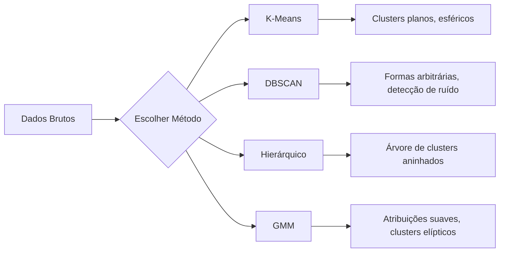

# Aprendizado Não-Supervisionado

> Sem rótulos, sem professor. O algoritmo encontra estrutura sozinho.

**Tipo:** Build
**Linguagens:** Python
**Pré-requisitos:** Fase 1 (Normas e Distâncias, Probabilidade e Distribuições), Fase 2 Aulas 1-6
**Tempo:** ~90 minutos

## Objetivos de Aprendizado

- Implementar K-Means, DBSCAN e Modelos de Mistura Gaussiana do zero e comparar seus comportamentos de clustering
- Avaliar qualidade de clusters usando o silhouette score e o método do cotovelo para selecionar o K ótimo
- Explicar quando DBSCAN supera K-Means e identificar qual algoritmo lida com clusters não-esféricos e outliers
- Construir um pipeline de detecção de anomalias usando métodos de clustering para sinalizar pontos que desviam de padrões normais

## O Problema

Até agora, toda aula de ML assume dados rotulados: "aqui está uma entrada, aqui está a saída correta." No mundo real, rótulos são caros. Um hospital tem milhões de registros de pacientes mas ninguém rotulou cada um manualmente com uma categoria de doença.

Aprendizado não-supervisionado encontra padrões sem ser dito o que procurar. Agrupa pontos de dados semelhantes, descobre estruturas ocultas e destaca anomalias.

## O Conceito

### Clustering: Agrupando Coisas Semelhantes



### K-Means: O Trabalhador

K-Means particiona dados em exatamente K clusters. Cada cluster tem um centroide (seu centro de massa), e cada ponto pertence ao centroide mais próximo.

### Escolhendo K

**Método do cotovelo:** Rode K-Means para K = 1, 2, 3, ..., n. Plote inércia vs K. Procure o "cotovelo".

**Silhouette score:** Para cada ponto, meça o quão semelhante ele é ao seu próprio cluster (a) vs o cluster mais próximo (b).

### DBSCAN: Clustering Baseado em Densidade

K-Means assume clusters esféricos e precisa que você escolha K. DBSCAN não faz nenhuma das duas. Encontra clusters como regiões densas separadas por regiões esparsas.

Dois parâmetros:
- **eps**: o raio de uma vizinhança
- **min_samples**: o número mínimo de pontos pra formar uma região densa

### GMM (Modelos de Mistura Gaussiana)

K-Means dá atribuições duras: cada ponto pertence a exatamente um cluster. GMM dá atribuições suaves: cada ponto tem uma probabilidade de pertencer a cada cluster.

### Quando Usar Qual

| Método | Melhor para | Evitar quando |
|--------|-------------|---------------|
| K-Means | Datasets grandes, clusters esféricos, K conhecido | Formas irregulares, outliers presentes |
| DBSCAN | K desconhecido, formas arbitrárias, detecção de outlier | Densidades variadas, muitas dimensões |
| Hierárquico | Datasets pequenos, precisa de dendrograma | Datasets grandes (memória O(n^2)) |
| GMM | Clusters sobrepostos, atribuições suaves necessárias | Datasets muito grandes, muitas dimensões |

## Construa

### Passo 1: K-Means do zero

```python
import math
import random

def euclidean_distance(a, b):
    return math.sqrt(sum((ai - bi) ** 2 for ai, bi in zip(a, b)))

def kmeans(data, k, max_iterations=100, seed=42):
    random.seed(seed)
    n_features = len(data[0])

    centroids = random.sample(data, k)

    for iteration in range(max_iterations):
        clusters = [[] for _ in range(k)]
        assignments = []

        for point in data:
            distances = [euclidean_distance(point, c) for c in centroids]
            nearest = distances.index(min(distances))
            clusters[nearest].append(point)
            assignments.append(nearest)

        new_centroids = []
        for cluster in clusters:
            if len(cluster) == 0:
                new_centroids.append(random.choice(data))
                continue
            centroid = [
                sum(point[j] for point in cluster) / len(cluster)
                for j in range(n_features)
            ]
            new_centroids.append(centroid)

        if all(
            euclidean_distance(old, new) < 1e-6
            for old, new in zip(centroids, new_centroids)
        ):
            print(f"  Convergiu na iteração {iteration + 1}")
            break

        centroids = new_centroids

    return assignments, centroids
```

### Passo 2: Método do cotovelo e silhouette score

```python
def compute_inertia(data, assignments, centroids):
    total = 0.0
    for point, cluster_id in zip(data, assignments):
        total += euclidean_distance(point, centroids[cluster_id]) ** 2
    return total

def silhouette_score(data, assignments):
    n = len(data)
    if n < 2:
        return 0.0

    clusters = {}
    for i, c in enumerate(assignments):
        clusters.setdefault(c, []).append(i)

    if len(clusters) < 2:
        return 0.0

    scores = []
    for i in range(n):
        own_cluster = assignments[i]
        own_members = [j for j in clusters[own_cluster] if j != i]

        if len(own_members) == 0:
            scores.append(0.0)
            continue

        a = sum(euclidean_distance(data[i], data[j]) for j in own_members) / len(own_members)

        b = float("inf")
        for cluster_id, members in clusters.items():
            if cluster_id == own_cluster:
                continue
            avg_dist = sum(euclidean_distance(data[i], data[j]) for j in members) / len(members)
            b = min(b, avg_dist)

        if max(a, b) == 0:
            scores.append(0.0)
        else:
            scores.append((b - a) / max(a, b))

    return sum(scores) / len(scores)
```

### Passo 3: DBSCAN do zero

```python
def dbscan(data, eps, min_samples):
    n = len(data)
    rótulos = [-1] * n
    cluster_id = 0

    def region_consulta(point_idx):
        neighbors = []
        for i in range(n):
            if euclidean_distance(data[point_idx], data[i]) <= eps:
                neighbors.append(i)
        return neighbors

    visited = [False] * n

    for i in range(n):
        if visited[i]:
            continue
        visited[i] = True

        neighbors = region_consulta(i)

        if len(neighbors) < min_samples:
            rótulos[i] = -1
            continue

        rótulos[i] = cluster_id
        seed_set = list(neighbors)
        seed_set.remove(i)

        j = 0
        while j < len(seed_set):
            q = seed_set[j]

            if not visited[q]:
                visited[q] = True
                q_neighbors = region_consulta(q)
                if len(q_neighbors) >= min_samples:
                    for nb in q_neighbors:
                        if nb not in seed_set:
                            seed_set.append(nb)

            if rótulos[q] == -1:
                rótulos[q] = cluster_id

            j += 1

        cluster_id += 1

    return rótulos
```

## Use

Com scikit-learn, os mesmos algoritmos são one-liners:

```python
from sklearn.cluster import KMeans, DBSCAN, AgglomerativeClustering
from sklearn.mixture import GaussianMixture
from sklearn.metrics import silhouette_score as sklearn_silhouette

km = KMeans(n_clusters=3, random_state=42).fit(data)
db = DBSCAN(eps=1.5, min_samples=5).fit(data)
agg = AgglomerativeClustering(n_clusters=3).fit(data)
gmm_model = GaussianMixture(n_components=3, random_state=42).fit(data)
```

## Exercícios

1. Implemente inicialização K-Means++: em vez de pegar centroides aleatórios, pegue o primeiro aleatoriamente e cada centroid subsequente com probabilidade proporcional à distância ao quadrado do centroide existente mais próximo.
2. Adicione clustering hierárquico aglomerativo ao código. Implemente o linkagem de Ward e produza um dendrograma.
3. Construa um pipeline simples de detecção de anomalias: rode DBSCAN e GMM nos mesmos dados, sinalize pontos que ambos concordam ser outliers.
