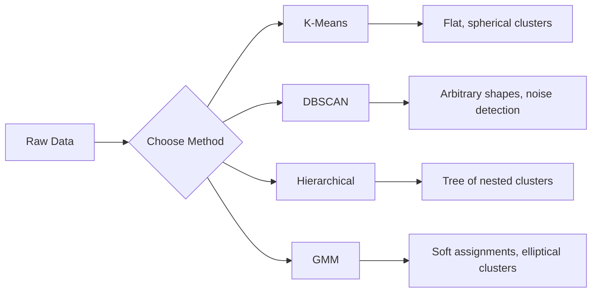

# Denetimsiz Öğrenme

> Etiket yok, öğretmen yok. Algoritma yapıyı kendi başına bulur.

**Tür:** Yapım
**Diller:** Python
**Önkoşullar:** Aşama 1 (Normlar ve Uzaklıklar, Olasılık ve Dağılımlar), Aşama 2 Dersler 1-6
**Süre:** ~90 dakika

## Öğrenme Hedefleri

- K-Means, DBSCAN ve Gaussian Karışım Modellerini sıfırdan uygulayın ve kümelenme davranışlarını karşılaştırın
- Optimum K'yı seçmek için siluet puanını ve dirsek yöntemini kullanarak küme kalitesini değerlendirin
- DBSCAN'ın K-Means'ten daha iyi performans gösterdiğini açıklayın ve hangi algoritmanın küresel olmayan kümeleri ve aykırı değerleri ele aldığını belirleyin
- Normal kalıplardan sapan noktaları işaretlemek için kümeleme yöntemlerini kullanarak bir anormallik tespit hattı oluşturun

## Sorun

Şu ana kadar her makine öğrenimi dersinde şu etiketli veriler varsayılmıştır: "işte bir girdi, işte doğru çıktı." Gerçek dünyada etiketler pahalıdır. Bir hastanenin milyonlarca hasta kaydı vardır ancak hiç kimse her birini manuel olarak bir hastalık kategorisiyle etiketlememiştir. Bir e-ticaret sitesinde milyonlarca kullanıcı oturumu vardır ancak hiç kimse müşteri segmentlerini elle etiketleyemez. Bir güvenlik ekibinin ağ günlükleri var ancak hiç kimse tüm anormallikleri işaretlemedi.

Denetimsiz öğrenme, ne arayacağını söylemeden kalıpları bulur. Benzer veri noktalarını gruplandırır, gizli yapıları keşfeder ve anormallikleri ortaya çıkarır. Denetimli öğrenme, cevap anahtarı olan bir ders kitabından öğrenmekse, denetimsiz öğrenme, modeller ortaya çıkana kadar ham verilere bakmaktır.

İşin püf noktası: Etiketler olmadan doğrudan "doğru" veya "yanlış"ı ölçemezsiniz. Algoritmanızın bulduğu yapının anlamlı olup olmadığını değerlendirmek için farklı araçlara ihtiyacınız vardır.

## Konsept

### Kümeleme: Benzer Şeyleri Birlikte Gruplama

Kümeleme, her veri noktasını bir gruba (kümeye) atar, böylece aynı grup içindeki noktalar, diğer gruplardaki noktalardan daha çok birbirine benzer. Soru her zaman şudur: "Benzer" ne anlama geliyor?



### K-Anlamı: Beygir

K-Means, verileri tam olarak K kümeye ayırır. Her kümenin bir ağırlık merkezi (kütle merkezi) vardır ve her nokta en yakın ağırlık merkezine aittir.

Lloyd'un algoritması:

1. Başlangıç ağırlık merkezleri olarak K rastgele noktayı seçin
2. Her veri noktasını en yakın merkez noktasına atayın
3. Her ağırlık merkezini kendisine atanan noktaların ortalaması olarak yeniden hesaplayın
4. Atamaların değişmesi durana kadar 2-3. adımları tekrarlayın

Amaç fonksiyonu (atalet), her bir noktanın kendisine atanan merkez noktasına olan toplam mesafenin karesini ölçer. K-Means bunu en aza indirir, ancak yalnızca yerel bir minimum bulur. Farklı başlatmalar farklı sonuçlar verebilir.

### K'yi Seçmek

İki standart yöntem:

**Dirsek yöntemi:** K = 1, 2, 3, ..., n için K-Ortalamalarını çalıştırın. Eylemsizliğin K'ye karşı grafiğini çizin. Daha fazla küme eklemenin eylemsizliği önemli ölçüde azaltmayı durdurduğu "dirsek"i arayın.

**Siluet puanı:** Her nokta için, kendi kümesine (a) ve en yakın diğer kümeye (b) ne kadar benzer olduğunu ölçün. Siluet katsayısı (b - a) / max(a, b) olup -1 (yanlış küme) ile +1 (iyi kümelenmiş) arasında değişir. Küresel bir puan için tüm puanların ortalaması.

### DBSCAN: Yoğunluğa Dayalı Kümeleme

K-Means, kümelerin küresel olduğunu varsayar ve K'yi önceden seçmenizi gerektirir. DBSCAN her iki varsayımda da bulunmaz. Kümeleri seyrek bölgelerle ayrılmış yoğun bölgeler olarak bulur.

İki parametre:
- **eps**: bir mahallenin yarıçapı
- **min_samples**: yoğun bir bölge oluşturmak için gereken minimum nokta sayısı

Üç tür nokta:
- **Çekirdek noktası**: eps mesafesi dahilinde en az min_samples noktasına sahip
- **Sınır noktası**: bir çekirdek noktanın eps'si dahilinde ancak kendisi bir çekirdek nokta değil
- **Gürültü noktası**: ne çekirdek ne de sınır. Bunlar aykırı değerlerdir.

DBSCAN, birbirinin eps'si dahilindeki çekirdek noktaları aynı kümeye bağlar. Sınır noktaları yakındaki bir merkez noktanın kümesine katılır. Gürültü noktaları hiçbir kümeye ait değildir.

Güçlü Yönler: Herhangi bir biçimdeki kümeleri bulur, küme sayısını otomatik olarak belirler, aykırı değerleri tanımlar. Zayıflık: değişen yoğunluktaki kümelerle mücadele eder.

### Hiyerarşik Kümeleme

İç içe kümelerden oluşan bir ağaç (dendrogram) oluşturur.

Aglomeratif (aşağıdan yukarıya):
1. Her noktanın kendi kümesi olarak başlayın
2. En yakın iki kümeyi birleştirin
3. Yalnızca bir küme kalana kadar tekrarlayın
4. K kümesini elde etmek için dendrogramı istenen seviyede kesin

Kümeler arasındaki "yakınlık" şu şekilde ölçülebilir:
- **Tek bağlantı**: iki kümedeki herhangi iki nokta arasındaki minimum mesafe
- **Tam bağlantı**: herhangi iki nokta arasındaki maksimum mesafe
- **Ortalama bağlantı**: tüm çiftler arasındaki ortalama mesafe
- **Ward'ın yöntemi**: toplam küme içi varyansta en küçük artışa neden olan birleştirme

### Gauss Karışım Modelleri (GMM)

K-Means zor görevler verir: her nokta tam olarak bir kümeye aittir. GMM yumuşak atamalar verir: her noktanın her kümeye ait olma olasılığı vardır.

GMM, verilerin her birinin kendi ortalaması ve kovaryansı olan K Gauss dağılımlarının bir karışımından üretildiğini varsayar. Beklenti Maksimizasyonu (EM) algoritması aşağıdakiler arasında geçiş yapar:

- **E-adım**: her noktanın her Gaussian'a ait olma olasılığını hesaplayın
- **M adımı**: Verilerin olasılığını en üst düzeye çıkarmak için her Gauss'un ortalamasını, kovaryansını ve karışım ağırlığını güncelleyin

GMM eliptik kümeleri (sadece K-Ortalamalar gibi küresel değil) modelleyebilir ve örtüşen kümeleri doğal olarak işleyebilir.

### Hangisi Ne Zaman Kullanılmalı

| Yöntem | Şunun için en iyisi | Ne zaman kaçının |
|--------|----------|------------|
| K-Araçları | Büyük dataset'ler, küresel kümeler, bilinen K | Düzensiz şekiller, aykırı değerler mevcut |
| DBSCAN | Bilinmeyen K, rastgele şekiller, aykırı değer tespiti | Değişen yoğunluklar, çok yüksek boyutlar |
| Hiyerarşik | Küçük dataset'ler, dendrograma ihtiyaç duyar, bilinmeyen K | Büyük dataset'ler (O(n^2) bellek) |
| GMM | Örtüşen kümeler, yumuşak atamalar gerekli | Çok büyük dataset'ler, çok fazla boyut |

### Kümeleme ile Anomali Tespiti

Kümeleme doğal olarak anormallik tespitini destekler:
- **K-Ortalamaları**: herhangi bir ağırlık merkezinden uzaktaki noktalar anormalliklerdir
- **DBSCAN**: gürültü noktaları tanım gereği anormalliklerdir
- **GMM**: tüm Gaussianlar altında düşük olasılığa sahip noktalar anormalliklerdir

```figure
kmeans-step
```

## İnşa Et

### Adım 1: Sıfırdan K-Anlamına gelir

```python
import math
import random


def euclidean_distance(a, b):
    return math.sqrt(sum((ai - bi) ** 2 for ai, bi in zip(a, b)))


def kmeans(data, k, max_iterations=100, seed=42):
    random.seed(seed)
    n_features = len(data[0])

    centroids = random.sample(data, k)

    for iteration in range(max_iterations):
        clusters = [[] for _ in range(k)]
        assignments = []

        for point in data:
            distances = [euclidean_distance(point, c) for c in centroids]
            nearest = distances.index(min(distances))
            clusters[nearest].append(point)
            assignments.append(nearest)

        new_centroids = []
        for cluster in clusters:
            if len(cluster) == 0:
                new_centroids.append(random.choice(data))
                continue
            centroid = [
                sum(point[j] for point in cluster) / len(cluster)
                for j in range(n_features)
            ]
            new_centroids.append(centroid)

        if all(
            euclidean_distance(old, new) < 1e-6
            for old, new in zip(centroids, new_centroids)
        ):
            print(f"  Converged at iteration {iteration + 1}")
            break

        centroids = new_centroids

    return assignments, centroids
```

### Adım 2: Dirsek yöntemi ve siluet puanı

```python
def compute_inertia(data, assignments, centroids):
    total = 0.0
    for point, cluster_id in zip(data, assignments):
        total += euclidean_distance(point, centroids[cluster_id]) ** 2
    return total


def silhouette_score(data, assignments):
    n = len(data)
    if n < 2:
        return 0.0

    clusters = {}
    for i, c in enumerate(assignments):
        clusters.setdefault(c, []).append(i)

    if len(clusters) < 2:
        return 0.0

    scores = []
    for i in range(n):
        own_cluster = assignments[i]
        own_members = [j for j in clusters[own_cluster] if j != i]

        if len(own_members) == 0:
            scores.append(0.0)
            continue

        a = sum(euclidean_distance(data[i], data[j]) for j in own_members) / len(own_members)

        b = float("inf")
        for cluster_id, members in clusters.items():
            if cluster_id == own_cluster:
                continue
            avg_dist = sum(euclidean_distance(data[i], data[j]) for j in members) / len(members)
            b = min(b, avg_dist)

        if max(a, b) == 0:
            scores.append(0.0)
        else:
            scores.append((b - a) / max(a, b))

    return sum(scores) / len(scores)


def find_best_k(data, max_k=10):
    print("Elbow method:")
    inertias = []
    for k in range(1, max_k + 1):
        assignments, centroids = kmeans(data, k)
        inertia = compute_inertia(data, assignments, centroids)
        inertias.append(inertia)
        print(f"  K={k}: inertia={inertia:.2f}")

    print("\nSilhouette scores:")
    for k in range(2, max_k + 1):
        assignments, centroids = kmeans(data, k)
        score = silhouette_score(data, assignments)
        print(f"  K={k}: silhouette={score:.4f}")

    return inertias
```

### Adım 3: Sıfırdan DBSCAN

```python
def dbscan(data, eps, min_samples):
    n = len(data)
    labels = [-1] * n
    cluster_id = 0

    def region_query(point_idx):
        neighbors = []
        for i in range(n):
            if euclidean_distance(data[point_idx], data[i]) <= eps:
                neighbors.append(i)
        return neighbors

    visited = [False] * n

    for i in range(n):
        if visited[i]:
            continue
        visited[i] = True

        neighbors = region_query(i)

        if len(neighbors) < min_samples:
            labels[i] = -1
            continue

        labels[i] = cluster_id
        seed_set = list(neighbors)
        seed_set.remove(i)

        j = 0
        while j < len(seed_set):
            q = seed_set[j]

            if not visited[q]:
                visited[q] = True
                q_neighbors = region_query(q)
                if len(q_neighbors) >= min_samples:
                    for nb in q_neighbors:
                        if nb not in seed_set:
                            seed_set.append(nb)

            if labels[q] == -1:
                labels[q] = cluster_id

            j += 1

        cluster_id += 1

    return labels
```

### Adım 4: Gauss Karışım Modeli (EM algoritması)

```python
def gmm(data, k, max_iterations=100, seed=42):
    random.seed(seed)
    n = len(data)
    d = len(data[0])

    indices = random.sample(range(n), k)
    means = [list(data[i]) for i in indices]
    variances = [1.0] * k
    weights = [1.0 / k] * k

    def gaussian_pdf(x, mean, variance):
        d = len(x)
        coeff = 1.0 / ((2 * math.pi * variance) ** (d / 2))
        exponent = -sum((xi - mi) ** 2 for xi, mi in zip(x, mean)) / (2 * variance)
        return coeff * math.exp(max(exponent, -500))

    for iteration in range(max_iterations):
        responsibilities = []
        for i in range(n):
            probs = []
            for j in range(k):
                probs.append(weights[j] * gaussian_pdf(data[i], means[j], variances[j]))
            total = sum(probs)
            if total == 0:
                total = 1e-300
            responsibilities.append([p / total for p in probs])

        old_means = [list(m) for m in means]

        for j in range(k):
            r_sum = sum(responsibilities[i][j] for i in range(n))
            if r_sum < 1e-10:
                continue

            weights[j] = r_sum / n

            for dim in range(d):
                means[j][dim] = sum(
                    responsibilities[i][j] * data[i][dim] for i in range(n)
                ) / r_sum

            variances[j] = sum(
                responsibilities[i][j]
                * sum((data[i][dim] - means[j][dim]) ** 2 for dim in range(d))
                for i in range(n)
            ) / (r_sum * d)
            variances[j] = max(variances[j], 1e-6)

        shift = sum(
            euclidean_distance(old_means[j], means[j]) for j in range(k)
        )
        if shift < 1e-6:
            print(f"  GMM converged at iteration {iteration + 1}")
            break

    assignments = []
    for i in range(n):
        assignments.append(responsibilities[i].index(max(responsibilities[i])))

    return assignments, means, weights, responsibilities
```

### Adım 5: Test verilerini oluşturun ve her şeyi çalıştırın

```python
def make_blobs(centers, n_per_cluster=50, spread=0.5, seed=42):
    random.seed(seed)
    data = []
    true_labels = []
    for label, (cx, cy) in enumerate(centers):
        for _ in range(n_per_cluster):
            x = cx + random.gauss(0, spread)
            y = cy + random.gauss(0, spread)
            data.append([x, y])
            true_labels.append(label)
    return data, true_labels


def make_moons(n_samples=200, noise=0.1, seed=42):
    random.seed(seed)
    data = []
    labels = []
    n_half = n_samples // 2
    for i in range(n_half):
        angle = math.pi * i / n_half
        x = math.cos(angle) + random.gauss(0, noise)
        y = math.sin(angle) + random.gauss(0, noise)
        data.append([x, y])
        labels.append(0)
    for i in range(n_half):
        angle = math.pi * i / n_half
        x = 1 - math.cos(angle) + random.gauss(0, noise)
        y = 1 - math.sin(angle) - 0.5 + random.gauss(0, noise)
        data.append([x, y])
        labels.append(1)
    return data, labels


if __name__ == "__main__":
    centers = [[2, 2], [8, 3], [5, 8]]
    data, true_labels = make_blobs(centers, n_per_cluster=50, spread=0.8)

    print("=== K-Means on 3 blobs ===")
    assignments, centroids = kmeans(data, k=3)
    print(f"  Centroids: {[[round(c, 2) for c in cent] for cent in centroids]}")
    sil = silhouette_score(data, assignments)
    print(f"  Silhouette score: {sil:.4f}")

    print("\n=== Elbow Method ===")
    find_best_k(data, max_k=6)

    print("\n=== DBSCAN on 3 blobs ===")
    db_labels = dbscan(data, eps=1.5, min_samples=5)
    n_clusters = len(set(db_labels) - {-1})
    n_noise = db_labels.count(-1)
    print(f"  Found {n_clusters} clusters, {n_noise} noise points")

    print("\n=== GMM on 3 blobs ===")
    gmm_assignments, gmm_means, gmm_weights, _ = gmm(data, k=3)
    print(f"  Means: {[[round(m, 2) for m in mean] for mean in gmm_means]}")
    print(f"  Weights: {[round(w, 3) for w in gmm_weights]}")
    gmm_sil = silhouette_score(data, gmm_assignments)
    print(f"  Silhouette score: {gmm_sil:.4f}")

    print("\n=== DBSCAN on moons (non-spherical clusters) ===")
    moon_data, moon_labels = make_moons(n_samples=200, noise=0.1)
    moon_db = dbscan(moon_data, eps=0.3, min_samples=5)
    n_moon_clusters = len(set(moon_db) - {-1})
    n_moon_noise = moon_db.count(-1)
    print(f"  Found {n_moon_clusters} clusters, {n_moon_noise} noise points")

    print("\n=== K-Means on moons (will fail to separate) ===")
    moon_km, moon_centroids = kmeans(moon_data, k=2)
    moon_sil = silhouette_score(moon_data, moon_km)
    print(f"  Silhouette score: {moon_sil:.4f}")
    print("  K-Means splits moons poorly because they are not spherical")

    print("\n=== Anomaly detection with DBSCAN ===")
    anomaly_data = list(data)
    anomaly_data.append([20.0, 20.0])
    anomaly_data.append([-5.0, -5.0])
    anomaly_data.append([15.0, 0.0])
    anomaly_labels = dbscan(anomaly_data, eps=1.5, min_samples=5)
    anomalies = [
        anomaly_data[i]
        for i in range(len(anomaly_labels))
        if anomaly_labels[i] == -1
    ]
    print(f"  Detected {len(anomalies)} anomalies")
    for a in anomalies[-3:]:
        print(f"    Point {[round(v, 2) for v in a]}")
```

## Kullan onu

Scikit-learn ile aynı algoritmalar tek satırlıktır:

```python
from sklearn.cluster import KMeans, DBSCAN, AgglomerativeClustering
from sklearn.mixture import GaussianMixture
from sklearn.metrics import silhouette_score as sklearn_silhouette

km = KMeans(n_clusters=3, random_state=42).fit(data)
db = DBSCAN(eps=1.5, min_samples=5).fit(data)
agg = AgglomerativeClustering(n_clusters=3).fit(data)
gmm_model = GaussianMixture(n_components=3, random_state=42).fit(data)
```

Sıfırdan sürümler size bu kitaplıkların tam olarak ne hesapladığını gösterir. K-Means, atama ve yeniden hesaplama arasında yineleme yapar. DBSCAN yoğun tohumlardan kümeler yetiştirir. GMM beklenti ve maksimizasyon arasında gidip gelir. Kitaplık sürümleri sayısal kararlılık, daha akıllı başlatma (K-Means++) ve GPU hızlandırma ekler ancak temel mantık aynıdır.

## Gönderin

Bu ders K-Means, DBSCAN ve GMM'nin sıfırdan çalışan uygulamalarını üretir. Kümeleme kodu, daha gelişmiş denetimsiz yöntemler için bir temel olarak yeniden kullanılabilir.

## Egzersizler

1. K-Means++ başlatmayı uygulayın: Rastgele ağırlık merkezleri seçmek yerine, ilkini rastgele ve sonraki her bir merkezi, mevcut en yakın merkeze olan mesafenin karesi ile orantılı olasılıkla seçin. Yakınsama hızını rastgele başlatmayla karşılaştırın.
2. Koda hiyerarşik toplayıcı kümelemeyi ekleyin. Ward bağlantısını uygulayın ve bir dendrogram üretin (iç içe geçmiş bir birleştirme listesi olarak). Farklı seviyelerde kesin ve K-Means sonuçlarıyla karşılaştırın.
3. Basit bir anormallik tespit hattı oluşturun: DBSCAN ve GMM'yi aynı veriler üzerinde çalıştırın, her iki yöntemin de aykırı değerler olduğu konusunda hemfikir olduğu noktaları işaretleyin (DBSCAN'de gürültü, GMM'de düşük olasılık). Örtüşmeyi ölçün ve yöntemlerin uyuşmadığı durumları tartışın.

## Anahtar Terimler

| Dönem | İnsanlar ne diyor | Aslında ne anlama geliyor |
|------|----------------|----------------------|
| Kümelenme | "Benzer şeyleri gruplandırma" | Belirli bir uzaklık ölçüsüyle ölçülen, grup içi benzerliğin gruplar arası benzerliği aştığı durumlarda verileri alt kümelere bölme |
| Merkez | "Bir kümenin merkezi" | Bir kümeye atanan tüm noktaların ortalaması; K-Means tarafından küme temsilcisi olarak kullanılıyor |
| Atalet | "Kümeler ne kadar sıkı" | Her noktadan kendisine atanan merkeze olan mesafelerin karelerinin toplamı; alt kısım daha sıkıdır |
| Siluet puanı | "Kümeler ne kadar iyi ayrılmış?" | Her nokta için (b - a) / max(a, b) burada a, küme içi ortalama mesafe ve b, en yakın küme mesafesi anlamına gelir |
| Çekirdek nokta | "Yoğun bir bölgede bir nokta" | DBSCAN |
| EM algoritması | "Yumuşak K-Araçları" | Beklenti-Maksimizasyon: üyelik olasılıklarını yinelemeli olarak hesaplayın (E-adım) ve dağıtım parametrelerini güncelleyin (M-adım) |
| Dendrogram | "Kümelerden oluşan bir ağaç" | Hiyerarşik kümelemede kümelerin birleştirildiği sırayı ve mesafeyi gösteren bir ağaç diyagramı |
| anormallik | "Bir aykırı değer" | Beklenen kalıba uymayan, DBSCAN tarafından gürültü veya GMM tarafından düşük olasılık olarak tanımlanan bir veri noktası |

## Daha Fazla Okuma

- [Stanford CS229 - Denetimsiz Öğrenme](https://cs229.stanford.edu/notes2022fall/main_notes.pdf) - Andrew Ng'nin kümeleme ve EM üzerine ders notları
- [scikit-learn Kümeleme Kılavuzu](https://scikit-learn.org/stable/modules/clustering.html) - tüm kümeleme algoritmalarının görsel örneklerle pratik karşılaştırması
- [DBSCAN orijinal makalesi (Ester ve diğerleri, 1996)](https://www.aaai.org/Papers/KDD/1996/KDD96-037.pdf) - yoğunluğa dayalı kümelemeyi tanıtan makale
