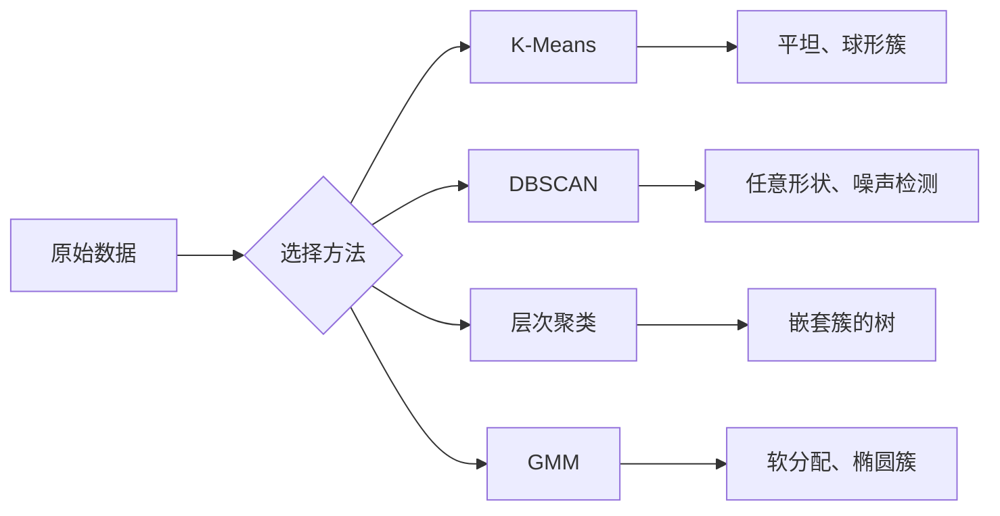

# 无监督学习（Unsupervised Learning）

> 没有标签，没有老师。算法自己发现结构。

**类型：** 构建
**语言：** Python
**前置知识：** 阶段 1（范数与距离、概率与分布）、阶段 2 第 1-6 课
**时间：** ~90 分钟

## 学习目标

- 从头实现 K 均值（K-Means）、DBSCAN 和高斯混合模型（Gaussian Mixture Models），并比较它们的聚类行为
- 使用轮廓系数（silhouette score）和肘部法（elbow method）评估聚类质量，以选择最优 K 值
- 解释何时 DBSCAN 优于 K-Means，并识别哪种算法能处理非球形簇和异常值
- 使用聚类方法构建异常检测（anomaly detection）流程，标记偏离正常模式的点

## 问题

到目前为止，每个机器学习课程都假设数据带有标签："这里是一个输入，这里是正确的输出。" 在现实世界中，标签是昂贵的。医院有数百万条患者记录，但没有人手动为每条记录标注疾病类别。电商网站有数百万用户会话，但没有人手动标记客户细分。安全团队有网络日志，但没有人标记每一个异常。

无监督学习无需被告知要寻找什么，就能发现模式。它把相似的数据点分组，发现隐藏的结构，并找出异常。如果说有监督学习（Supervised Learning）是使用带答案的教科书学习，那么无监督学习就是盯着原始数据，直到模式自己显现出来。

但问题是：没有标签，你无法直接衡量"对"或"错"。你需要不同的工具来评估你的算法找到的结构是否有意义。

## 概念

### 聚类（Clustering）：将相似的东西分组

聚类将每个数据点分配到一个组（簇），使得同一组内的点相互之间的相似度高于与其他组中点的相似度。问题始终是："相似"意味着什么？



### K-Means：主力算法

K-Means 将数据划分成正好 K 个簇。每个簇有一个质心（centroid，其质量中心），每个点属于最近的质心。

劳埃德算法（Lloyd's algorithm）：

1. 随机选取 K 个点作为初始质心
2. 将每个数据点分配到最近的质心
3. 将每个质心重新计算为其分配点的均值
4. 重复步骤 2-3 直到分配不再变化

目标函数（惯性，inertia）衡量每个点到其分配质心的距离平方和。K-Means 最小化这个值，但只能找到局部最小值。不同的初始化可能得到不同的结果。

### 选择 K 值

两种标准方法：

**肘部法（Elbow method）：** 对 K = 1, 2, 3, ..., n 运行 K-Means。绘制 inertia 与 K 的关系图。寻找"肘部"，即增加更多簇不再显著降低 inertia 的点。

**轮廓系数（Silhouette score）：** 对于每个点，测量它与其自身簇的相似度（a）与最近的其他簇的相似度（b）。轮廓系数为 (b - a) / max(a, b)，范围从 -1（错误簇）到 +1（良好聚类）。对所有点取平均得到全局分数。

### DBSCAN：基于密度的聚类

K-Means 假设簇是球形的，并且需要你事先指定 K 值。DBSCAN 不做这两种假设。它将簇定义为由稀疏区域分隔的稠密区域。

两个参数：
- **eps**：邻域的半径
- **min_samples**：形成稠密区域所需的最少点数

三种类型的点：
- **核心点（Core point）**：在 eps 距离内包含至少 min_samples 个点
- **边界点（Border point）**：在核心点的 eps 内，但本身不是核心点
- **噪声点（Noise point）**：既不是核心也不是边界。这些是异常值。

DBSCAN 将彼此在 eps 范围内的核心点连接到同一个簇。边界点加入附近核心点的簇。噪声点不属于任何簇。

优势：能发现任意形状的簇，自动确定簇的数量，识别异常值。弱点：难以处理密度变化较大的簇。

### 层次聚类（Hierarchical Clustering）

构建一个嵌套簇的树（树状图，dendrogram）。

凝聚式（自底向上）：
1. 从每个点作为一个单独的簇开始
2. 合并最近的两个簇
3. 重复直到只剩一个簇
4. 在所需的层次切割树状图，得到 K 个簇

簇之间的"接近度"可以通过以下方式衡量：
- **单链接（Single linkage）**：两个簇中任意两点之间的最小距离
- **全链接（Complete linkage）**：两个簇中任意两点之间的最大距离
- **平均链接（Average linkage）**：所有点对之间的平均距离
- **沃德法（Ward's method）**：能使总簇内方差增加最小的合并

### 高斯混合模型（Gaussian Mixture Models, GMM）

K-Means 给出硬分配：每个点只属于一个簇。GMM 给出软分配：每个点属于每个簇都有一个概率。

GMM 假设数据是由 K 个高斯分布的混合生成的，每个高斯分布有自己的均值和协方差。期望最大化（Expectation-Maximization, EM）算法在以下两步之间交替：

- **E 步**：计算每个点属于每个高斯的概率
- **M 步**：更新每个高斯的均值、协方差和混合权重，以最大化数据的似然

GMM 可以建模椭圆簇（不限于 K-Means 的球形），并自然处理重叠的簇。

### 何时使用哪种方法

| 方法 | 最适合 | 避免时 |
|------|--------|--------|
| K-Means | 大数据集、球形簇、已知 K 值 | 不规则形状、存在异常值 |
| DBSCAN | 未知 K 值、任意形状、异常检测 | 密度变化较大、非常高维 |
| 层次聚类 | 小数据集、需要树状图、未知 K 值 | 大数据集（O(n^2) 内存） |
| GMM | 重叠簇、需要软分配 | 非常大的数据集、维数过多 |

### 基于聚类的异常检测

聚类自然地支持异常检测：
- **K-Means**：远离任何质心的点是异常
- **DBSCAN**：噪声点本身就是异常
- **GMM**：在所有高斯分布下概率都很低的点是异常

## 构建它

### 步骤 1：从头实现 K-Means

```python
import math
import random


def euclidean_distance(a, b):
    return math.sqrt(sum((ai - bi) ** 2 for ai, bi in zip(a, b)))


def kmeans(data, k, max_iterations=100, seed=42):
    random.seed(seed)
    n_features = len(data[0])

    # 随机选择 k 个点作为初始质心
    centroids = random.sample(data, k)

    for iteration in range(max_iterations):
        # 分配步骤：将每个点分配到最近的质心
        clusters = [[] for _ in range(k)]
        assignments = []

        for point in data:
            distances = [euclidean_distance(point, c) for c in centroids]
            nearest = distances.index(min(distances))
            clusters[nearest].append(point)
            assignments.append(nearest)

        # 更新步骤：重新计算质心为簇的均值
        new_centroids = []
        for cluster in clusters:
            if len(cluster) == 0:
                new_centroids.append(random.choice(data))
                continue
            centroid = [
                sum(point[j] for point in cluster) / len(cluster)
                for j in range(n_features)
            ]
            new_centroids.append(centroid)

        # 检查收敛：如果质心变化很小则停止
        if all(
            euclidean_distance(old, new) < 1e-6
            for old, new in zip(centroids, new_centroids)
        ):
            print(f"  在第 {iteration + 1} 次迭代时收敛")
            break

        centroids = new_centroids

    return assignments, centroids
```

### 步骤 2：肘部法和轮廓系数

```python
def compute_inertia(data, assignments, centroids):
    total = 0.0
    for point, cluster_id in zip(data, assignments):
        total += euclidean_distance(point, centroids[cluster_id]) ** 2
    return total


def silhouette_score(data, assignments):
    n = len(data)
    if n < 2:
        return 0.0

    # 按簇分组索引
    clusters = {}
    for i, c in enumerate(assignments):
        clusters.setdefault(c, []).append(i)

    if len(clusters) < 2:
        return 0.0

    scores = []
    for i in range(n):
        own_cluster = assignments[i]
        own_members = [j for j in clusters[own_cluster] if j != i]

        if len(own_members) == 0:
            scores.append(0.0)
            continue

        # 计算点 i 到同簇其他点的平均距离 a
        a = sum(euclidean_distance(data[i], data[j]) for j in own_members) / len(own_members)

        # 计算点 i 到最近的其他簇的平均距离 b
        b = float("inf")
        for cluster_id, members in clusters.items():
            if cluster_id == own_cluster:
                continue
            avg_dist = sum(euclidean_distance(data[i], data[j]) for j in members) / len(members)
            b = min(b, avg_dist)

        if max(a, b) == 0:
            scores.append(0.0)
        else:
            scores.append((b - a) / max(a, b))

    return sum(scores) / len(scores)


def find_best_k(data, max_k=10):
    print("肘部法：")
    inertias = []
    for k in range(1, max_k + 1):
        assignments, centroids = kmeans(data, k)
        inertia = compute_inertia(data, assignments, centroids)
        inertias.append(inertia)
        print(f"  K={k}: inertia={inertia:.2f}")

    print("\n轮廓系数：")
    for k in range(2, max_k + 1):
        assignments, centroids = kmeans(data, k)
        score = silhouette_score(data, assignments)
        print(f"  K={k}: silhouette={score:.4f}")

    return inertias
```

### 步骤 3：从头实现 DBSCAN

```python
def dbscan(data, eps, min_samples):
    n = len(data)
    labels = [-1] * n  # -1 表示噪声
    cluster_id = 0

    # 区域查询：找到 eps 内的所有邻居
    def region_query(point_idx):
        neighbors = []
        for i in range(n):
            if euclidean_distance(data[point_idx], data[i]) <= eps:
                neighbors.append(i)
        return neighbors

    visited = [False] * n

    for i in range(n):
        if visited[i]:
            continue
        visited[i] = True

        neighbors = region_query(i)

        if len(neighbors) < min_samples:
            labels[i] = -1  # 标记为噪声
            continue

        # 新的簇
        labels[i] = cluster_id
        seed_set = list(neighbors)
        seed_set.remove(i)

        j = 0
        while j < len(seed_set):
            q = seed_set[j]

            if not visited[q]:
                visited[q] = True
                q_neighbors = region_query(q)
                if len(q_neighbors) >= min_samples:
                    # q 是核心点，将其邻居加入种子集
                    for nb in q_neighbors:
                        if nb not in seed_set:
                            seed_set.append(nb)

            # 如果 q 当前是噪声，将其加入簇
            if labels[q] == -1:
                labels[q] = cluster_id

            j += 1

        cluster_id += 1

    return labels
```

### 步骤 4：高斯混合模型（EM 算法）

```python
def gmm(data, k, max_iterations=100, seed=42):
    random.seed(seed)
    n = len(data)
    d = len(data[0])

    # 初始化均值、方差和权重
    indices = random.sample(range(n), k)
    means = [list(data[i]) for i in indices]
    variances = [1.0] * k
    weights = [1.0 / k] * k

    # 计算高斯概率密度
    def gaussian_pdf(x, mean, variance):
        d = len(x)
        coeff = 1.0 / ((2 * math.pi * variance) ** (d / 2))
        exponent = -sum((xi - mi) ** 2 for xi, mi in zip(x, mean)) / (2 * variance)
        return coeff * math.exp(max(exponent, -500))

    for iteration in range(max_iterations):
        # E 步：计算每个点属于每个高斯分布的责任度
        responsibilities = []
        for i in range(n):
            probs = []
            for j in range(k):
                probs.append(weights[j] * gaussian_pdf(data[i], means[j], variances[j]))
            total = sum(probs)
            if total == 0:
                total = 1e-300
            responsibilities.append([p / total for p in probs])

        old_means = [list(m) for m in means]

        # M 步：更新参数
        for j in range(k):
            r_sum = sum(responsibilities[i][j] for i in range(n))
            if r_sum < 1e-10:
                continue

            # 更新权重
            weights[j] = r_sum / n

            # 更新均值
            for dim in range(d):
                means[j][dim] = sum(
                    responsibilities[i][j] * data[i][dim] for i in range(n)
                ) / r_sum

            # 更新方差（共享对角协方差）
            variances[j] = sum(
                responsibilities[i][j]
                * sum((data[i][dim] - means[j][dim]) ** 2 for dim in range(d))
                for i in range(n)
            ) / (r_sum * d)
            variances[j] = max(variances[j], 1e-6)  # 避免方差为零

        # 检查收敛
        shift = sum(
            euclidean_distance(old_means[j], means[j]) for j in range(k)
        )
        if shift < 1e-6:
            print(f"  GMM 在第 {iteration + 1} 次迭代时收敛")
            break

    # 软分配：取最大责任度对应的簇
    assignments = []
    for i in range(n):
        assignments.append(responsibilities[i].index(max(responsibilities[i])))

    return assignments, means, weights, responsibilities
```

### 步骤 5：生成测试数据并运行所有算法

```python
def make_blobs(centers, n_per_cluster=50, spread=0.5, seed=42):
    random.seed(seed)
    data = []
    true_labels = []
    for label, (cx, cy) in enumerate(centers):
        for _ in range(n_per_cluster):
            x = cx + random.gauss(0, spread)
            y = cy + random.gauss(0, spread)
            data.append([x, y])
            true_labels.append(label)
    return data, true_labels


def make_moons(n_samples=200, noise=0.1, seed=42):
    random.seed(seed)
    data = []
    labels = []
    n_half = n_samples // 2
    for i in range(n_half):
        angle = math.pi * i / n_half
        x = math.cos(angle) + random.gauss(0, noise)
        y = math.sin(angle) + random.gauss(0, noise)
        data.append([x, y])
        labels.append(0)
    for i in range(n_half):
        angle = math.pi * i / n_half
        x = 1 - math.cos(angle) + random.gauss(0, noise)
        y = 1 - math.sin(angle) - 0.5 + random.gauss(0, noise)
        data.append([x, y])
        labels.append(1)
    return data, labels


if __name__ == "__main__":
    centers = [[2, 2], [8, 3], [5, 8]]
    data, true_labels = make_blobs(centers, n_per_cluster=50, spread=0.8)

    print("=== 在 3 个 blob 上运行 K-Means ===")
    assignments, centroids = kmeans(data, k=3)
    print(f"  质心