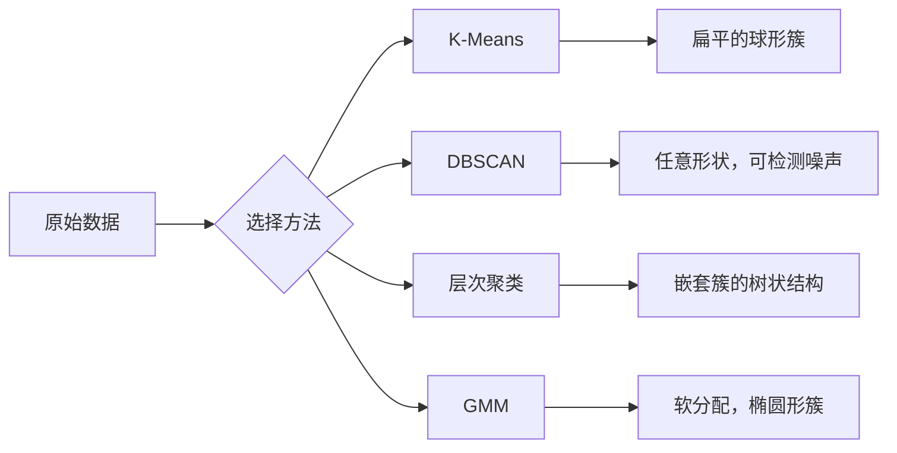

# 无监督学习（Unsupervised Learning）

> 译注：本文译自同目录 [`en.md`](./en.md)。术语遵循仓根 [TRANSLATION_GUIDE.md](../../../../TRANSLATION_GUIDE.md)。

> 没有标签，没有老师。算法自己找出结构。

**Type:** Build
**Languages:** Python
**Prerequisites:** Phase 1（Norms & Distances、Probability & Distributions）、Phase 2 第 1-6 课
**Time:** ~90 分钟

## 学习目标（Learning Objectives）

- 从零实现 K-Means、DBSCAN 和高斯混合模型（Gaussian Mixture Models, GMM），并对比它们的聚类行为
- 用 silhouette 分数和肘部法（elbow method）评估聚类质量，并选出最优 K
- 解释 DBSCAN 在哪些场景下优于 K-Means，并指出哪种算法更适合处理非球形簇和离群点
- 用聚类方法搭建一条异常检测流水线，把偏离正常模式的点标出来

## 问题（The Problem）

到目前为止，每节 ML 课都假设数据是带标签的：「这里是输入，这里是正确输出」。但现实里，标签很贵。一家医院手里有上百万份病历，没人会逐条手工标好疾病类别；一个电商网站有上百万次用户会话，也没人手工标过客群分类；安全团队的网络日志里，没人会把每一个异常都标出来。

无监督学习的特点是：不告诉算法该找什么，它自己找模式。它把相似的数据点聚成一组、发现隐藏结构、把异常点挑出来。如果把监督学习比作拿着标准答案看教科书，无监督学习就是盯着原始数据看到模式自己浮出水面。

代价是：没有标签，你没法直接判断「对」和「错」。你需要别的工具来评估算法找到的结构是否真的有意义。

## 概念（The Concept）

### 聚类：把相似的东西放到一起（Clustering: Grouping Similar Things Together）

聚类就是把每个数据点分配到一个组（簇）里，让同一个组里的点彼此之间比与其他组的点更相似。问题永远是同一个：「相似」到底怎么定义？



### K-Means：主力工具（K-Means: The Workhorse）

K-Means 把数据正好划分成 K 个簇。每个簇有一个 centroid（质心，即重心），每个点归到离它最近的 centroid。

Lloyd 算法：

1. 随机选 K 个点作为初始 centroid
2. 把每个数据点分配到最近的 centroid
3. 把每个 centroid 重新计算为它所属点的均值
4. 重复 2-3 步，直到分配不再变化

目标函数（inertia）衡量的是每个点到所属 centroid 距离的平方和。K-Means 最小化的是这个量，但只能找到局部最优解。不同的初始化会得到不同的结果。

### 怎么选 K（Choosing K）

两种标准做法：

**肘部法（Elbow method）：** 对 K = 1, 2, 3, ..., n 都跑一遍 K-Means，把 inertia 关于 K 画出来。找那个「肘部」——再加簇也几乎不再让 inertia 明显下降的位置。

**Silhouette 分数：** 对每个点，分别计算它和自己簇的相似度（a）以及与最近的另一个簇的相似度（b）。silhouette 系数定义为 (b - a) / max(a, b)，取值范围 -1（被分错簇）到 +1（聚得很好）。对所有点求平均得到全局分数。

### DBSCAN：基于密度的聚类（DBSCAN: Density-Based Clustering）

K-Means 假设簇是球形的，而且要求你提前选好 K。DBSCAN 这两点都不要求。它把簇定义为「被稀疏区域分隔开的稠密区域」。

两个参数：
- **eps**：邻域半径
- **min_samples**：构成稠密区域所需的最小点数

三类点：
- **核心点（Core point）**：在 eps 距离内至少有 min_samples 个点
- **边界点（Border point）**：在某个核心点的 eps 范围内，但自己不是核心点
- **噪声点（Noise point）**：既不是核心点也不是边界点。这就是离群点。

DBSCAN 把彼此在 eps 内的核心点连成同一个簇。边界点加入附近核心点的簇。噪声点不属于任何簇。

优点：能找到任意形状的簇，自动决定簇数，识别离群点。缺点：对密度差异较大的簇效果不好。

### 层次聚类（Hierarchical Clustering）

构造一棵嵌套簇的树（dendrogram，树状图）。

凝聚式（自底向上）：
1. 把每个点视为一个簇
2. 合并最近的两个簇
3. 重复，直到只剩一个簇
4. 在想要的层次切开树状图，得到 K 个簇

簇之间的「近」可以这样度量：
- **单链接（Single linkage）**：两个簇里任意两点距离的最小值
- **完全链接（Complete linkage）**：两个簇里任意两点距离的最大值
- **平均链接（Average linkage）**：所有点对距离的平均
- **Ward 法**：让簇内总方差增加最小的合并方式

### 高斯混合模型（Gaussian Mixture Models, GMM）

K-Means 给的是硬分配：每个点正好属于一个簇。GMM 给的是软分配：每个点属于每个簇的概率。

GMM 假设数据由 K 个高斯分布混合生成，每个分布有自己的均值和协方差。期望最大化（Expectation-Maximization, EM）算法在以下两步之间交替：

- **E-step**：计算每个点属于每个高斯的概率
- **M-step**：更新每个高斯的均值、协方差和混合权重，使数据似然最大

GMM 能建模椭圆形簇（不像 K-Means 只能建模球形），并自然地处理重叠的簇。

### 什么时候用哪个（When to Use Which）

| 方法 | 适合 | 不适合 |
|--------|----------|------------|
| K-Means | 大数据集、球形簇、已知 K | 形状不规则、有离群点 |
| DBSCAN | 未知 K、任意形状、离群点检测 | 密度差异大、维度非常高 |
| Hierarchical | 小数据集、需要 dendrogram、未知 K | 大数据集（O(n^2) 内存） |
| GMM | 簇有重叠、需要软分配 | 数据集非常大、维度过高 |

### 用聚类做异常检测（Anomaly Detection with Clustering）

聚类天然支持异常检测：
- **K-Means**：远离任何 centroid 的点就是异常
- **DBSCAN**：噪声点按定义就是异常
- **GMM**：在所有高斯下概率都很低的点就是异常

## 动手实现（Build It）

### Step 1：从零实现 K-Means

```python
import math
import random


def euclidean_distance(a, b):
    return math.sqrt(sum((ai - bi) ** 2 for ai, bi in zip(a, b)))


def kmeans(data, k, max_iterations=100, seed=42):
    random.seed(seed)
    n_features = len(data[0])

    centroids = random.sample(data, k)

    for iteration in range(max_iterations):
        clusters = [[] for _ in range(k)]
        assignments = []

        for point in data:
            distances = [euclidean_distance(point, c) for c in centroids]
            nearest = distances.index(min(distances))
            clusters[nearest].append(point)
            assignments.append(nearest)

        new_centroids = []
        for cluster in clusters:
            if len(cluster) == 0:
                new_centroids.append(random.choice(data))
                continue
            centroid = [
                sum(point[j] for point in cluster) / len(cluster)
                for j in range(n_features)
            ]
            new_centroids.append(centroid)

        if all(
            euclidean_distance(old, new) < 1e-6
            for old, new in zip(centroids, new_centroids)
        ):
            print(f"  Converged at iteration {iteration + 1}")
            break

        centroids = new_centroids

    return assignments, centroids
```

### Step 2：肘部法和 silhouette 分数

```python
def compute_inertia(data, assignments, centroids):
    total = 0.0
    for point, cluster_id in zip(data, assignments):
        total += euclidean_distance(point, centroids[cluster_id]) ** 2
    return total


def silhouette_score(data, assignments):
    n = len(data)
    if n < 2:
        return 0.0

    clusters = {}
    for i, c in enumerate(assignments):
        clusters.setdefault(c, []).append(i)

    if len(clusters) < 2:
        return 0.0

    scores = []
    for i in range(n):
        own_cluster = assignments[i]
        own_members = [j for j in clusters[own_cluster] if j != i]

        if len(own_members) == 0:
            scores.append(0.0)
            continue

        a = sum(euclidean_distance(data[i], data[j]) for j in own_members) / len(own_members)

        b = float("inf")
        for cluster_id, members in clusters.items():
            if cluster_id == own_cluster:
                continue
            avg_dist = sum(euclidean_distance(data[i], data[j]) for j in members) / len(members)
            b = min(b, avg_dist)

        if max(a, b) == 0:
            scores.append(0.0)
        else:
            scores.append((b - a) / max(a, b))

    return sum(scores) / len(scores)


def find_best_k(data, max_k=10):
    print("Elbow method:")
    inertias = []
    for k in range(1, max_k + 1):
        assignments, centroids = kmeans(data, k)
        inertia = compute_inertia(data, assignments, centroids)
        inertias.append(inertia)
        print(f"  K={k}: inertia={inertia:.2f}")

    print("\nSilhouette scores:")
    for k in range(2, max_k + 1):
        assignments, centroids = kmeans(data, k)
        score = silhouette_score(data, assignments)
        print(f"  K={k}: silhouette={score:.4f}")

    return inertias
```

### Step 3：从零实现 DBSCAN

```python
def dbscan(data, eps, min_samples):
    n = len(data)
    labels = [-1] * n
    cluster_id = 0

    def region_query(point_idx):
        neighbors = []
        for i in range(n):
            if euclidean_distance(data[point_idx], data[i]) <= eps:
                neighbors.append(i)
        return neighbors

    visited = [False] * n

    for i in range(n):
        if visited[i]:
            continue
        visited[i] = True

        neighbors = region_query(i)

        if len(neighbors) < min_samples:
            labels[i] = -1
            continue

        labels[i] = cluster_id
        seed_set = list(neighbors)
        seed_set.remove(i)

        j = 0
        while j < len(seed_set):
            q = seed_set[j]

            if not visited[q]:
                visited[q] = True
                q_neighbors = region_query(q)
                if len(q_neighbors) >= min_samples:
                    for nb in q_neighbors:
                        if nb not in seed_set:
                            seed_set.append(nb)

            if labels[q] == -1:
                labels[q] = cluster_id

            j += 1

        cluster_id += 1

    return labels
```

### Step 4：高斯混合模型（EM 算法）

```python
def gmm(data, k, max_iterations=100, seed=42):
    random.seed(seed)
    n = len(data)
    d = len(data[0])

    indices = random.sample(range(n), k)
    means = [list(data[i]) for i in indices]
    variances = [1.0] * k
    weights = [1.0 / k] * k

    def gaussian_pdf(x, mean, variance):
        d = len(x)
        coeff = 1.0 / ((2 * math.pi * variance) ** (d / 2))
        exponent = -sum((xi - mi) ** 2 for xi, mi in zip(x, mean)) / (2 * variance)
        return coeff * math.exp(max(exponent, -500))

    for iteration in range(max_iterations):
        responsibilities = []
        for i in range(n):
            probs = []
            for j in range(k):
                probs.append(weights[j] * gaussian_pdf(data[i], means[j], variances[j]))
            total = sum(probs)
            if total == 0:
                total = 1e-300
            responsibilities.append([p / total for p in probs])

        old_means = [list(m) for m in means]

        for j in range(k):
            r_sum = sum(responsibilities[i][j] for i in range(n))
            if r_sum < 1e-10:
                continue

            weights[j] = r_sum / n

            for dim in range(d):
                means[j][dim] = sum(
                    responsibilities[i][j] * data[i][dim] for i in range(n)
                ) / r_sum

            variances[j] = sum(
                responsibilities[i][j]
                * sum((data[i][dim] - means[j][dim]) ** 2 for dim in range(d))
                for i in range(n)
            ) / (r_sum * d)
            variances[j] = max(variances[j], 1e-6)

        shift = sum(
            euclidean_distance(old_means[j], means[j]) for j in range(k)
        )
        if shift < 1e-6:
            print(f"  GMM converged at iteration {iteration + 1}")
            break

    assignments = []
    for i in range(n):
        assignments.append(responsibilities[i].index(max(responsibilities[i])))

    return assignments, means, weights, responsibilities
```

### Step 5：生成测试数据并跑通全部算法

```python
def make_blobs(centers, n_per_cluster=50, spread=0.5, seed=42):
    random.seed(seed)
    data = []
    true_labels = []
    for label, (cx, cy) in enumerate(centers):
        for _ in range(n_per_cluster):
            x = cx + random.gauss(0, spread)
            y = cy + random.gauss(0, spread)
            data.append([x, y])
            true_labels.append(label)
    return data, true_labels


def make_moons(n_samples=200, noise=0.1, seed=42):
    random.seed(seed)
    data = []
    labels = []
    n_half = n_samples // 2
    for i in range(n_half):
        angle = math.pi * i / n_half
        x = math.cos(angle) + random.gauss(0, noise)
        y = math.sin(angle) + random.gauss(0, noise)
        data.append([x, y])
        labels.append(0)
    for i in range(n_half):
        angle = math.pi * i / n_half
        x = 1 - math.cos(angle) + random.gauss(0, noise)
        y = 1 - math.sin(angle) - 0.5 + random.gauss(0, noise)
        data.append([x, y])
        labels.append(1)
    return data, labels


if __name__ == "__main__":
    centers = [[2, 2], [8, 3], [5, 8]]
    data, true_labels = make_blobs(centers, n_per_cluster=50, spread=0.8)

    print("=== K-Means on 3 blobs ===")
    assignments, centroids = kmeans(data, k=3)
    print(f"  Centroids: {[[round(c, 2) for c in cent] for cent in centroids]}")
    sil = silhouette_score(data, assignments)
    print(f"  Silhouette score: {sil:.4f}")

    print("\n=== Elbow Method ===")
    find_best_k(data, max_k=6)

    print("\n=== DBSCAN on 3 blobs ===")
    db_labels = dbscan(data, eps=1.5, min_samples=5)
    n_clusters = len(set(db_labels) - {-1})
    n_noise = db_labels.count(-1)
    print(f"  Found {n_clusters} clusters, {n_noise} noise points")

    print("\n=== GMM on 3 blobs ===")
    gmm_assignments, gmm_means, gmm_weights, _ = gmm(data, k=3)
    print(f"  Means: {[[round(m, 2) for m in mean] for mean in gmm_means]}")
    print(f"  Weights: {[round(w, 3) for w in gmm_weights]}")
    gmm_sil = silhouette_score(data, gmm_assignments)
    print(f"  Silhouette score: {gmm_sil:.4f}")

    print("\n=== DBSCAN on moons (non-spherical clusters) ===")
    moon_data, moon_labels = make_moons(n_samples=200, noise=0.1)
    moon_db = dbscan(moon_data, eps=0.3, min_samples=5)
    n_moon_clusters = len(set(moon_db) - {-1})
    n_moon_noise = moon_db.count(-1)
    print(f"  Found {n_moon_clusters} clusters, {n_moon_noise} noise points")

    print("\n=== K-Means on moons (will fail to separate) ===")
    moon_km, moon_centroids = kmeans(moon_data, k=2)
    moon_sil = silhouette_score(moon_data, moon_km)
    print(f"  Silhouette score: {moon_sil:.4f}")
    print("  K-Means splits moons poorly because they are not spherical")

    print("\n=== Anomaly detection with DBSCAN ===")
    anomaly_data = list(data)
    anomaly_data.append([20.0, 20.0])
    anomaly_data.append([-5.0, -5.0])
    anomaly_data.append([15.0, 0.0])
    anomaly_labels = dbscan(anomaly_data, eps=1.5, min_samples=5)
    anomalies = [
        anomaly_data[i]
        for i in range(len(anomaly_labels))
        if anomaly_labels[i] == -1
    ]
    print(f"  Detected {len(anomalies)} anomalies")
    for a in anomalies[-3:]:
        print(f"    Point {[round(v, 2) for v in a]}")
```

## 用起来（Use It）

用 scikit-learn，这些算法都是一行调用：

```python
from sklearn.cluster import KMeans, DBSCAN, AgglomerativeClustering
from sklearn.mixture import GaussianMixture
from sklearn.metrics import silhouette_score as sklearn_silhouette

km = KMeans(n_clusters=3, random_state=42).fit(data)
db = DBSCAN(eps=1.5, min_samples=5).fit(data)
agg = AgglomerativeClustering(n_clusters=3).fit(data)
gmm_model = GaussianMixture(n_components=3, random_state=42).fit(data)
```

从零写一遍能让你看清这些库到底在算什么。K-Means 在「分配」和「重算」之间循环。DBSCAN 从稠密种子开始扩张簇。GMM 在 expectation 和 maximization 之间交替。库里的版本多了数值稳定性、更聪明的初始化（K-Means++）和 GPU 加速，但核心逻辑是一样的。

## 上线部署（Ship It）

本节产出 K-Means、DBSCAN 和 GMM 三种算法的可运行实现。这些聚类代码可以作为更高级无监督方法的基础复用。

## 练习（Exercises）

1. 实现 K-Means++ 初始化：不再随机选取所有 centroid，而是先随机选第一个，后续每个 centroid 以「与最近已有 centroid 距离的平方」为概率被选中。对比它和随机初始化的收敛速度。
2. 给代码加上层次凝聚聚类。实现 Ward 链接，并产出一个 dendrogram（用嵌套列表记录合并过程）。在不同层次切开，与 K-Means 结果做对比。
3. 搭一条简单的异常检测流水线：在同一份数据上跑 DBSCAN 和 GMM，标出两种方法都认为是离群点的点（DBSCAN 的噪声点，GMM 下概率很低的点）。统计重叠度，并讨论两者意见不一致的场景。

## 关键术语（Key Terms）

| 术语 | 大家口头怎么说 | 它真正的含义 |
|------|----------------|----------------------|
| Clustering | 「把相似的东西分组」 | 用某个具体的距离度量，把数据划分成若干子集，让组内相似度高于组间相似度 |
| Centroid | 「簇的中心」 | 簇里所有点的均值；K-Means 用它代表整个簇 |
| Inertia | 「簇有多紧」 | 每个点到所属 centroid 距离的平方和；越小越紧 |
| Silhouette score | 「簇分得有多开」 | 对每个点计算 (b - a) / max(a, b)，其中 a 是簇内平均距离，b 是到最近其他簇的平均距离 |
| Core point | 「稠密区里的点」 | DBSCAN 中，eps 半径内邻居数至少为 min_samples 的点 |
| EM algorithm | 「软 K-Means」 | 期望最大化：迭代地计算成员归属概率（E-step）并更新分布参数（M-step） |
| Dendrogram | 「簇组成的树」 | 一棵展示层次聚类合并顺序和距离的树状图 |
| Anomaly | 「离群点」 | 不符合预期模式的数据点；DBSCAN 把它判为噪声，GMM 把它判为低概率点 |

## 延伸阅读（Further Reading）

- [Stanford CS229 - Unsupervised Learning](https://cs229.stanford.edu/notes2022fall/main_notes.pdf) - Andrew Ng 关于聚类与 EM 的讲义
- [scikit-learn Clustering Guide](https://scikit-learn.org/stable/modules/clustering.html) - 所有聚类算法的实操对比与可视化示例
- [DBSCAN original paper (Ester et al., 1996)](https://www.aaai.org/Papers/KDD/1996/KDD96-037.pdf) - 引入基于密度聚类的原始论文
