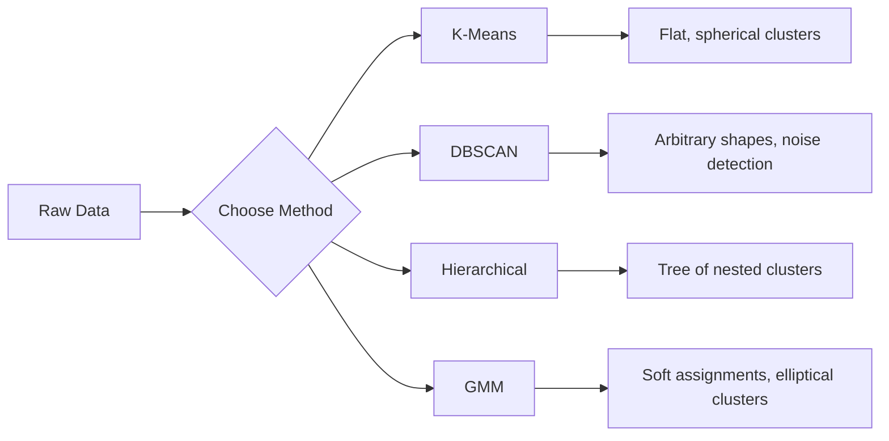

# 07 · 无监督学习

> 没有标签，没有老师。算法自行发现数据中的结构。

**类型：** 构建
**语言：** Python
**前置：** 阶段 1（范数与距离、概率与分布）、阶段 2 第 1-6 课
**时长：** 约 90 分钟

## 学习目标

- 从零实现 K-Means、DBSCAN 与高斯混合模型（Gaussian Mixture Models），并对比它们的聚类行为
- 使用「轮廓系数（silhouette score）」和「肘部法（elbow method）」评估聚类质量，从而选择最优的 K
- 解释 DBSCAN 何时优于 K-Means，并识别哪种算法能处理非球形簇与离群点
- 利用聚类方法构建一个「异常检测（anomaly detection）」流水线，用于标记偏离正常模式的数据点

## 问题所在

到目前为止，每一节 ML 课程都假设我们拥有带标签的数据：「这是一个输入，这是对应的正确输出。」但在现实世界中，标签的代价高昂。一家医院拥有数百万份患者病历，却没有人手动为每一份标注疾病类别。一个电商网站拥有数百万次用户会话，却没有人手工标注客户分群。一个安全团队拥有海量网络日志，却没有人逐一标记出每一个异常。

无监督学习能在无人告知该寻找什么的情况下发现模式。它把相似的数据点归为一组，发现隐藏的结构，并浮现出异常。如果说监督学习是看着带答案的教科书学习，那么无监督学习就是盯着原始数据看，直到模式自己显现出来。

但这里有个难点：没有标签，你就无法直接衡量「对」与「错」。你需要不同的工具来评估算法所发现的结构是否真正有意义。

## 核心概念

### 聚类：把相似的事物归在一起

「聚类（Clustering）」会把每个数据点分配到某个组（簇）中，使得同一组内的点彼此之间比与其他组的点更相似。问题始终在于：「相似」到底意味着什么？



### K-Means：主力算法

K-Means 将数据精确划分为 K 个簇。每个簇都有一个「质心（centroid）」（即其质量中心），每个点都归属于离它最近的质心。

劳埃德算法（Lloyd's algorithm）：

1. 随机选取 K 个点作为初始质心
2. 将每个数据点分配给最近的质心
3. 将每个质心重新计算为其所分配点的均值
4. 重复第 2-3 步，直到分配不再变化

目标函数（「惯量（inertia）」）衡量的是每个点到其所属质心的平方距离之和。K-Means 最小化该目标，但只能找到局部最小值。不同的初始化可能给出不同的结果。

### 如何选择 K

两种标准方法：

**肘部法：** 对 K = 1, 2, 3, ..., n 分别运行 K-Means。绘制惯量随 K 变化的曲线。寻找那个「肘部」，即继续增加簇数后惯量不再显著下降的拐点。

**轮廓系数：** 对每个点，衡量它与自身所在簇的相似程度（a）相对于与最近的其他簇的相似程度（b）。轮廓系数为 (b - a) / max(a, b)，取值范围从 -1（被分错簇）到 +1（聚类良好）。对所有点取平均即可得到全局得分。

### DBSCAN：基于密度的聚类

K-Means 假设簇是球形的，并且要求你预先指定 K。DBSCAN 这两点都不假设。它把簇视为由稀疏区域分隔开的稠密区域。

两个参数：
- **eps**：邻域的半径
- **min_samples**：构成一个稠密区域所需的最小点数

三类点：
- **核心点（Core point）**：在 eps 距离内至少有 min_samples 个点
- **边界点（Border point）**：位于某个核心点的 eps 范围内，但自身不是核心点
- **噪声点（Noise point）**：既非核心点也非边界点。这些就是离群点。

DBSCAN 把彼此在 eps 距离内的核心点连接到同一个簇中。边界点会加入邻近核心点所属的簇。噪声点则不属于任何簇。

优点：能发现任意形状的簇，自动确定簇的数量，识别离群点。缺点：难以处理密度差异较大的簇。

### 层次聚类

构建一棵嵌套簇的树（「树状图（dendrogram）」）。

凝聚式（自底向上）：
1. 起初每个点各自成为一个簇
2. 合并最接近的两个簇
3. 重复直到只剩一个簇
4. 在所需的层级处剪切树状图，得到 K 个簇

簇与簇之间的「接近程度」可以用以下方式衡量：
- **单连接（Single linkage）**：两个簇中任意两点之间的最小距离
- **全连接（Complete linkage）**：任意两点之间的最大距离
- **平均连接（Average linkage）**：所有点对之间的平均距离
- **Ward 法（Ward's method）**：选择能使簇内总方差增加最小的那次合并

### 高斯混合模型（GMM）

K-Means 给出的是「硬分配（hard assignments）」：每个点恰好属于一个簇。GMM 给出的是「软分配（soft assignments）」：每个点都有一个隶属于各个簇的概率。

GMM 假设数据由 K 个高斯分布混合生成，每个高斯分布有各自的均值和协方差。「期望最大化（Expectation-Maximization, EM）」算法在以下两步之间交替进行：

- **E 步**：计算每个点隶属于各个高斯分布的概率
- **M 步**：更新每个高斯分布的均值、协方差和混合权重，以最大化数据的似然

GMM 可以建模椭圆形的簇（而不只是像 K-Means 那样的球形簇），并且天然能处理相互重叠的簇。

### 何时使用哪种方法

| 方法 | 适用场景 | 应避免的情况 |
|--------|----------|------------|
| K-Means | 大规模数据集、球形簇、已知 K | 不规则形状、存在离群点 |
| DBSCAN | 未知 K、任意形状、离群点检测 | 密度不一、维度非常高 |
| 层次聚类 | 小规模数据集、需要树状图、未知 K | 大规模数据集（O(n^2) 内存开销） |
| GMM | 重叠的簇、需要软分配 | 数据集非常大、维度过多 |

### 用聚类做异常检测

聚类天然支持异常检测：
- **K-Means**：远离所有质心的点即为异常
- **DBSCAN**：噪声点按定义即为异常
- **GMM**：在所有高斯分布下概率都很低的点即为异常

## 动手构建

### 第 1 步：从零实现 K-Means

```python
import math
import random


def euclidean_distance(a, b):
    return math.sqrt(sum((ai - bi) ** 2 for ai, bi in zip(a, b)))


def kmeans(data, k, max_iterations=100, seed=42):
    random.seed(seed)
    n_features = len(data[0])

    centroids = random.sample(data, k)

    for iteration in range(max_iterations):
        clusters = [[] for _ in range(k)]
        assignments = []

        for point in data:
            distances = [euclidean_distance(point, c) for c in centroids]
            nearest = distances.index(min(distances))
            clusters[nearest].append(point)
            assignments.append(nearest)

        new_centroids = []
        for cluster in clusters:
            if len(cluster) == 0:
                new_centroids.append(random.choice(data))
                continue
            centroid = [
                sum(point[j] for point in cluster) / len(cluster)
                for j in range(n_features)
            ]
            new_centroids.append(centroid)

        if all(
            euclidean_distance(old, new) < 1e-6
            for old, new in zip(centroids, new_centroids)
        ):
            print(f"  Converged at iteration {iteration + 1}")
            break

        centroids = new_centroids

    return assignments, centroids
```

### 第 2 步：肘部法与轮廓系数

```python
def compute_inertia(data, assignments, centroids):
    total = 0.0
    for point, cluster_id in zip(data, assignments):
        total += euclidean_distance(point, centroids[cluster_id]) ** 2
    return total


def silhouette_score(data, assignments):
    n = len(data)
    if n < 2:
        return 0.0

    clusters = {}
    for i, c in enumerate(assignments):
        clusters.setdefault(c, []).append(i)

    if len(clusters) < 2:
        return 0.0

    scores = []
    for i in range(n):
        own_cluster = assignments[i]
        own_members = [j for j in clusters[own_cluster] if j != i]

        if len(own_members) == 0:
            scores.append(0.0)
            continue

        a = sum(euclidean_distance(data[i], data[j]) for j in own_members) / len(own_members)

        b = float("inf")
        for cluster_id, members in clusters.items():
            if cluster_id == own_cluster:
                continue
            avg_dist = sum(euclidean_distance(data[i], data[j]) for j in members) / len(members)
            b = min(b, avg_dist)

        if max(a, b) == 0:
            scores.append(0.0)
        else:
            scores.append((b - a) / max(a, b))

    return sum(scores) / len(scores)


def find_best_k(data, max_k=10):
    print("Elbow method:")
    inertias = []
    for k in range(1, max_k + 1):
        assignments, centroids = kmeans(data, k)
        inertia = compute_inertia(data, assignments, centroids)
        inertias.append(inertia)
        print(f"  K={k}: inertia={inertia:.2f}")

    print("\nSilhouette scores:")
    for k in range(2, max_k + 1):
        assignments, centroids = kmeans(data, k)
        score = silhouette_score(data, assignments)
        print(f"  K={k}: silhouette={score:.4f}")

    return inertias
```

### 第 3 步：从零实现 DBSCAN

```python
def dbscan(data, eps, min_samples):
    n = len(data)
    labels = [-1] * n
    cluster_id = 0

    def region_query(point_idx):
        neighbors = []
        for i in range(n):
            if euclidean_distance(data[point_idx], data[i]) <= eps:
                neighbors.append(i)
        return neighbors

    visited = [False] * n

    for i in range(n):
        if visited[i]:
            continue
        visited[i] = True

        neighbors = region_query(i)

        if len(neighbors) < min_samples:
            labels[i] = -1
            continue

        labels[i] = cluster_id
        seed_set = list(neighbors)
        seed_set.remove(i)

        j = 0
        while j < len(seed_set):
            q = seed_set[j]

            if not visited[q]:
                visited[q] = True
                q_neighbors = region_query(q)
                if len(q_neighbors) >= min_samples:
                    for nb in q_neighbors:
                        if nb not in seed_set:
                            seed_set.append(nb)

            if labels[q] == -1:
                labels[q] = cluster_id

            j += 1

        cluster_id += 1

    return labels
```

### 第 4 步：高斯混合模型（EM 算法）

```python
def gmm(data, k, max_iterations=100, seed=42):
    random.seed(seed)
    n = len(data)
    d = len(data[0])

    indices = random.sample(range(n), k)
    means = [list(data[i]) for i in indices]
    variances = [1.0] * k
    weights = [1.0 / k] * k

    def gaussian_pdf(x, mean, variance):
        d = len(x)
        coeff = 1.0 / ((2 * math.pi * variance) ** (d / 2))
        exponent = -sum((xi - mi) ** 2 for xi, mi in zip(x, mean)) / (2 * variance)
        return coeff * math.exp(max(exponent, -500))

    for iteration in range(max_iterations):
        responsibilities = []
        for i in range(n):
            probs = []
            for j in range(k):
                probs.append(weights[j] * gaussian_pdf(data[i], means[j], variances[j]))
            total = sum(probs)
            if total == 0:
                total = 1e-300
            responsibilities.append([p / total for p in probs])

        old_means = [list(m) for m in means]

        for j in range(k):
            r_sum = sum(responsibilities[i][j] for i in range(n))
            if r_sum < 1e-10:
                continue

            weights[j] = r_sum / n

            for dim in range(d):
                means[j][dim] = sum(
                    responsibilities[i][j] * data[i][dim] for i in range(n)
                ) / r_sum

            variances[j] = sum(
                responsibilities[i][j]
                * sum((data[i][dim] - means[j][dim]) ** 2 for dim in range(d))
                for i in range(n)
            ) / (r_sum * d)
            variances[j] = max(variances[j], 1e-6)

        shift = sum(
            euclidean_distance(old_means[j], means[j]) for j in range(k)
        )
        if shift < 1e-6:
            print(f"  GMM converged at iteration {iteration + 1}")
            break

    assignments = []
    for i in range(n):
        assignments.append(responsibilities[i].index(max(responsibilities[i])))

    return assignments, means, weights, responsibilities
```

### 第 5 步：生成测试数据并运行全部算法

```python
def make_blobs(centers, n_per_cluster=50, spread=0.5, seed=42):
    random.seed(seed)
    data = []
    true_labels = []
    for label, (cx, cy) in enumerate(centers):
        for _ in range(n_per_cluster):
            x = cx + random.gauss(0, spread)
            y = cy + random.gauss(0, spread)
            data.append([x, y])
            true_labels.append(label)
    return data, true_labels


def make_moons(n_samples=200, noise=0.1, seed=42):
    random.seed(seed)
    data = []
    labels = []
    n_half = n_samples // 2
    for i in range(n_half):
        angle = math.pi * i / n_half
        x = math.cos(angle) + random.gauss(0, noise)
        y = math.sin(angle) + random.gauss(0, noise)
        data.append([x, y])
        labels.append(0)
    for i in range(n_half):
        angle = math.pi * i / n_half
        x = 1 - math.cos(angle) + random.gauss(0, noise)
        y = 1 - math.sin(angle) - 0.5 + random.gauss(0, noise)
        data.append([x, y])
        labels.append(1)
    return data, labels


if __name__ == "__main__":
    centers = [[2, 2], [8, 3], [5, 8]]
    data, true_labels = make_blobs(centers, n_per_cluster=50, spread=0.8)

    print("=== K-Means on 3 blobs ===")
    assignments, centroids = kmeans(data, k=3)
    print(f"  Centroids: {[[round(c, 2) for c in cent] for cent in centroids]}")
    sil = silhouette_score(data, assignments)
    print(f"  Silhouette score: {sil:.4f}")

    print("\n=== Elbow Method ===")
    find_best_k(data, max_k=6)

    print("\n=== DBSCAN on 3 blobs ===")
    db_labels = dbscan(data, eps=1.5, min_samples=5)
    n_clusters = len(set(db_labels) - {-1})
    n_noise = db_labels.count(-1)
    print(f"  Found {n_clusters} clusters, {n_noise} noise points")

    print("\n=== GMM on 3 blobs ===")
    gmm_assignments, gmm_means, gmm_weights, _ = gmm(data, k=3)
    print(f"  Means: {[[round(m, 2) for m in mean] for mean in gmm_means]}")
    print(f"  Weights: {[round(w, 3) for w in gmm_weights]}")
    gmm_sil = silhouette_score(data, gmm_assignments)
    print(f"  Silhouette score: {gmm_sil:.4f}")

    print("\n=== DBSCAN on moons (non-spherical clusters) ===")
    moon_data, moon_labels = make_moons(n_samples=200, noise=0.1)
    moon_db = dbscan(moon_data, eps=0.3, min_samples=5)
    n_moon_clusters = len(set(moon_db) - {-1})
    n_moon_noise = moon_db.count(-1)
    print(f"  Found {n_moon_clusters} clusters, {n_moon_noise} noise points")

    print("\n=== K-Means on moons (will fail to separate) ===")
    moon_km, moon_centroids = kmeans(moon_data, k=2)
    moon_sil = silhouette_score(moon_data, moon_km)
    print(f"  Silhouette score: {moon_sil:.4f}")
    print("  K-Means splits moons poorly because they are not spherical")

    print("\n=== Anomaly detection with DBSCAN ===")
    anomaly_data = list(data)
    anomaly_data.append([20.0, 20.0])
    anomaly_data.append([-5.0, -5.0])
    anomaly_data.append([15.0, 0.0])
    anomaly_labels = dbscan(anomaly_data, eps=1.5, min_samples=5)
    anomalies = [
        anomaly_data[i]
        for i in range(len(anomaly_labels))
        if anomaly_labels[i] == -1
    ]
    print(f"  Detected {len(anomalies)} anomalies")
    for a in anomalies[-3:]:
        print(f"    Point {[round(v, 2) for v in a]}")
```

## 实际应用

使用 scikit-learn 时，这些相同的算法都只需一行代码：

```python
from sklearn.cluster import KMeans, DBSCAN, AgglomerativeClustering
from sklearn.mixture import GaussianMixture
from sklearn.metrics import silhouette_score as sklearn_silhouette

km = KMeans(n_clusters=3, random_state=42).fit(data)
db = DBSCAN(eps=1.5, min_samples=5).fit(data)
agg = AgglomerativeClustering(n_clusters=3).fit(data)
gmm_model = GaussianMixture(n_components=3, random_state=42).fit(data)
```

从零实现的版本让你确切看到这些库到底在计算什么。K-Means 在「分配」与「重算」之间迭代。DBSCAN 从稠密的种子点出发生长出簇。GMM 在期望与最大化之间交替。库版本额外加入了数值稳定性、更聪明的初始化（K-Means++）以及 GPU 加速，但核心逻辑是一样的。

## 交付成果

本课产出了 K-Means、DBSCAN 和 GMM 三种算法从零实现的可运行版本。这些聚类代码可以作为更高级的无监督方法的基础被复用。

## 练习

1. 实现 K-Means++ 初始化：不再随机挑选质心，而是随机选取第一个质心，之后每个后续质心被选中的概率与它到最近的已有质心的平方距离成正比。比较其收敛速度与随机初始化的差异。
2. 为代码添加凝聚式层次聚类。实现 Ward 连接，并生成一棵树状图（用嵌套列表表示合并过程）。在不同层级处剪切，并与 K-Means 的结果进行比较。
3. 构建一个简单的异常检测流水线：在同一份数据上同时运行 DBSCAN 和 GMM，标记出两种方法都认定为离群点的数据点（在 DBSCAN 中为噪声，在 GMM 中为低概率）。衡量两者的重合度，并讨论两种方法在何时会产生分歧。

## 关键术语

| 术语 | 人们通常的说法 | 它的真正含义 |
|------|----------------|----------------------|
| 聚类（Clustering） | 「把相似的东西归到一起」 | 将数据划分为若干子集，使组内相似度高于组间相似度，相似度由某个特定的距离度量来衡量 |
| 质心（Centroid） | 「一个簇的中心」 | 分配到某个簇的所有点的均值；K-Means 用它作为该簇的代表 |
| 惯量（Inertia） | 「簇有多紧凑」 | 每个点到其所属质心的平方距离之和；越低越紧凑 |
| 轮廓系数（Silhouette score） | 「簇之间分得有多开」 | 对每个点，(b - a) / max(a, b)，其中 a 是平均簇内距离，b 是到最近邻簇的平均距离 |
| 核心点（Core point） | 「稠密区域中的一个点」 | 在 DBSCAN 中，在 eps 距离内至少有 min_samples 个邻居的点 |
| EM 算法（EM algorithm） | 「软版 K-Means」 | 期望最大化：迭代地计算隶属概率（E 步）并更新分布参数（M 步） |
| 树状图（Dendrogram） | 「一棵簇的树」 | 一种树形图，展示层次聚类中各个簇被合并的顺序与距离 |
| 异常（Anomaly） | 「一个离群点」 | 不符合预期模式的数据点，被 DBSCAN 识别为噪声，或被 GMM 识别为低概率 |

## 延伸阅读

- [Stanford CS229 - Unsupervised Learning](https://cs229.stanford.edu/notes2022fall/main_notes.pdf) —— Andrew Ng 关于聚类与 EM 的讲义
- [scikit-learn Clustering Guide](https://scikit-learn.org/stable/modules/clustering.html) —— 对所有聚类算法的实用对比，附可视化示例
- [DBSCAN original paper (Ester et al., 1996)](https://www.aaai.org/Papers/KDD/1996/KDD96-037.pdf) —— 提出基于密度聚类的原始论文
