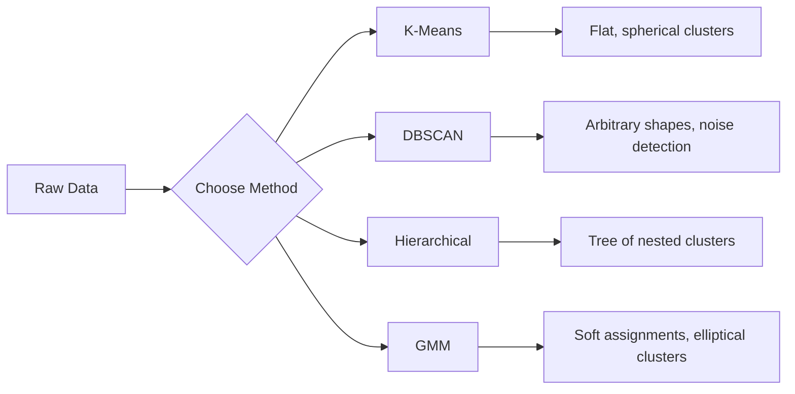

# Unsupervised Learning

> 没有标签，没有老师。该算法可以自己找到结构。

** 类型：** 构建
** 语言：** Python
** 先决条件：** 第1阶段（规范和距离、概率和分布），第2阶段课程1-6
** 时间：** ~90分钟

## Learning Objectives

- 从头开始实施K-Means、DBSCAN和高斯混合模型并比较它们的集群行为
- 使用轮廓评分和肘部法评估集群质量以选择最佳K
- 解释DBSCAN何时优于K-Means并确定哪种算法处理非球形集群和离群值
- 使用集群方法构建异常检测管道来标记偏离正常模式的点

## The Problem

到目前为止，每堂ML课程都假设有标签的数据：“这是输入，这是正确的输出。“在现实世界中，标签很贵。一家医院拥有数百万份患者记录，但没有人手动标记每一份记录的疾病类别。电子商务网站拥有数百万个用户会话，但没有人手工标记客户群。安全小组有网络日志，但没有人标记出每一个异常。

无监督学习在不被告知要寻找什么的情况下就能找到模式。它对相似的数据点进行分组，发现隐藏的结构并揭示异常。如果监督学习是从带有答案关键词的教科书中学习，那么无监督学习就是盯着原始数据，直到模式显露出来。

问题是：如果没有标签，你就无法直接衡量“对”或“错”。“您需要不同的工具来评估您的算法发现的结构是否有意义。

## The Concept

### Clustering: Grouping Similar Things Together

集群将每个数据点分配给一个组（集群），以便同一组中的点彼此之间比与其他组中的点更相似。问题始终是：“相似”是什么意思？



### K-Means: The Workhorse

K-Means将数据划分为恰好K个集群。每个集群都有一个重心（其质量中心），并且每个点都属于最近的重心。

劳埃德算法：

1. 选择K个随机点作为初始重心
2. 将每个数据点分配到最近的重心
3. 将每个重心重新计算为其指定点的平均值
4. 重复步骤2-3，直到作业停止更改

目标函数（惯性）测量从每个点到其指定重心的总平方距离。K-Means最小化了这一点，但只找到局部最小值。不同的初始化可以给出不同的结果。

### Choosing K

两种标准方法：

** 肘部方法：** 运行K均值，K = 1、2、3、.、n.情节惯性与K。寻找添加更多集群不会显着减少惯性的“肘部”。

** 剪影得分：** 对于每个点，测量它与自己的集群（a）与最近的其他集群（b）的相似程度。轮廓系数为（b-a）/ max（a，b），范围从-1（错误的集群）到+1（良好集群）。所有积分的平均值即可获得全球分数。

### DBSCAN: Density-Based Clustering

K-Means假设集群是球形的，并要求您预先选择K。DBSCAN没有做出任何假设。它发现集群是由稀疏区域分开的密集区域。

两个参数：
- **eps**：邻居的半径
- **min_samples**：形成密集区域所需的最小点数量

三种类型的点：
- ** 核心点 **：在eps距离内至少有min_samples点
- ** 边界点 **：在核心点的eps内，但本身不是核心点
- ** 噪音点 **：既不是核心，也不是边界。这些都是离群值。

DBSCAN将彼此之间的核心点连接到同一集群中。边界点加入附近核心点的集群。噪音点不属于集群。

优势：查找任何形状的集群，自动确定集群的数量，识别异常值。弱点：难以应对不同密度的集群。

### Hierarchical Clustering

构建嵌套聚类的树（树状图）。

聚集性（自下而上）：
1. 从每个点作为其自己的集群开始
2. 合并两个最近的聚类
3. 重复此步骤，直到只剩下一个集群
4. 在所需级别剪切树图以获得K个集群

集群之间的“接近度”可以测量为：
- ** 单一链接 **：两个集群中任何两点之间的最小距离
- ** 完整联动 **：任意两点之间的最大距离
- ** 平均联动 **：所有对之间的平均距离
- **Ward方法 **：导致集群内总方差增加最小的合并

### Gaussian Mixture Models (GMM)

K-Means给出了艰难的任务：每个点恰好属于一个集群。GMM给出软分配：每个点都有属于每个集群的概率。

GMM假设数据是由K个高斯分布的混合生成的，每个分布都有自己的均值和协方差。期望最大化（EM）算法在以下两种情况之间交替：

- ** E步 *：计算每个点属于每个高斯的概率
- ** M步 *：更新每个高斯的均值、协方差和混合权重，以最大化数据的可能性

GMM可以建模椭圆形集群（而不仅仅是像K-Means那样的球形集群），并自然地处理重叠集群。

### When to Use Which

| 方法 | 最适合 | Avoid when |
|--------|----------|------------|
| K-Means | 大型数据集、球形集群、已知K | 形状不规则，存在异常值 |
| DBSCAN | 未知K、任意形状、异常值检测 | 密度变化，维度非常高 |
| 分层 | 数据集小，需要树图，未知K | 大型数据集（O（n^2）内存） |
| GMM | 集群重叠，需要软作业 | 数据集非常大，维度太多 |

### Anomaly Detection with Clustering

集群自然支持异常检测：
- **K-Means**：远离任何重心的点都是异常
- **DBSCAN**：根据定义，噪音点是异常
- **GMM**：全高斯下概率低的点是异常

## Build It

### Step 1: K-Means from scratch

```python
import math
import random


def euclidean_distance(a, b):
    return math.sqrt(sum((ai - bi) ** 2 for ai, bi in zip(a, b)))


def kmeans(data, k, max_iterations=100, seed=42):
    random.seed(seed)
    n_features = len(data[0])

    centroids = random.sample(data, k)

    for iteration in range(max_iterations):
        clusters = [[] for _ in range(k)]
        assignments = []

        for point in data:
            distances = [euclidean_distance(point, c) for c in centroids]
            nearest = distances.index(min(distances))
            clusters[nearest].append(point)
            assignments.append(nearest)

        new_centroids = []
        for cluster in clusters:
            if len(cluster) == 0:
                new_centroids.append(random.choice(data))
                continue
            centroid = [
                sum(point[j] for point in cluster) / len(cluster)
                for j in range(n_features)
            ]
            new_centroids.append(centroid)

        if all(
            euclidean_distance(old, new) < 1e-6
            for old, new in zip(centroids, new_centroids)
        ):
            print(f"  Converged at iteration {iteration + 1}")
            break

        centroids = new_centroids

    return assignments, centroids
```

### Step 2: Elbow method and silhouette score

```python
def compute_inertia(data, assignments, centroids):
    total = 0.0
    for point, cluster_id in zip(data, assignments):
        total += euclidean_distance(point, centroids[cluster_id]) ** 2
    return total


def silhouette_score(data, assignments):
    n = len(data)
    if n < 2:
        return 0.0

    clusters = {}
    for i, c in enumerate(assignments):
        clusters.setdefault(c, []).append(i)

    if len(clusters) < 2:
        return 0.0

    scores = []
    for i in range(n):
        own_cluster = assignments[i]
        own_members = [j for j in clusters[own_cluster] if j != i]

        if len(own_members) == 0:
            scores.append(0.0)
            continue

        a = sum(euclidean_distance(data[i], data[j]) for j in own_members) / len(own_members)

        b = float("inf")
        for cluster_id, members in clusters.items():
            if cluster_id == own_cluster:
                continue
            avg_dist = sum(euclidean_distance(data[i], data[j]) for j in members) / len(members)
            b = min(b, avg_dist)

        if max(a, b) == 0:
            scores.append(0.0)
        else:
            scores.append((b - a) / max(a, b))

    return sum(scores) / len(scores)


def find_best_k(data, max_k=10):
    print("Elbow method:")
    inertias = []
    for k in range(1, max_k + 1):
        assignments, centroids = kmeans(data, k)
        inertia = compute_inertia(data, assignments, centroids)
        inertias.append(inertia)
        print(f"  K={k}: inertia={inertia:.2f}")

    print("\nSilhouette scores:")
    for k in range(2, max_k + 1):
        assignments, centroids = kmeans(data, k)
        score = silhouette_score(data, assignments)
        print(f"  K={k}: silhouette={score:.4f}")

    return inertias
```

### Step 3: DBSCAN from scratch

```python
def dbscan(data, eps, min_samples):
    n = len(data)
    labels = [-1] * n
    cluster_id = 0

    def region_query(point_idx):
        neighbors = []
        for i in range(n):
            if euclidean_distance(data[point_idx], data[i]) <= eps:
                neighbors.append(i)
        return neighbors

    visited = [False] * n

    for i in range(n):
        if visited[i]:
            continue
        visited[i] = True

        neighbors = region_query(i)

        if len(neighbors) < min_samples:
            labels[i] = -1
            continue

        labels[i] = cluster_id
        seed_set = list(neighbors)
        seed_set.remove(i)

        j = 0
        while j < len(seed_set):
            q = seed_set[j]

            if not visited[q]:
                visited[q] = True
                q_neighbors = region_query(q)
                if len(q_neighbors) >= min_samples:
                    for nb in q_neighbors:
                        if nb not in seed_set:
                            seed_set.append(nb)

            if labels[q] == -1:
                labels[q] = cluster_id

            j += 1

        cluster_id += 1

    return labels
```

### Step 4: Gaussian Mixture Model (EM algorithm)

```python
def gmm(data, k, max_iterations=100, seed=42):
    random.seed(seed)
    n = len(data)
    d = len(data[0])

    indices = random.sample(range(n), k)
    means = [list(data[i]) for i in indices]
    variances = [1.0] * k
    weights = [1.0 / k] * k

    def gaussian_pdf(x, mean, variance):
        d = len(x)
        coeff = 1.0 / ((2 * math.pi * variance) ** (d / 2))
        exponent = -sum((xi - mi) ** 2 for xi, mi in zip(x, mean)) / (2 * variance)
        return coeff * math.exp(max(exponent, -500))

    for iteration in range(max_iterations):
        responsibilities = []
        for i in range(n):
            probs = []
            for j in range(k):
                probs.append(weights[j] * gaussian_pdf(data[i], means[j], variances[j]))
            total = sum(probs)
            if total == 0:
                total = 1e-300
            responsibilities.append([p / total for p in probs])

        old_means = [list(m) for m in means]

        for j in range(k):
            r_sum = sum(responsibilities[i][j] for i in range(n))
            if r_sum < 1e-10:
                continue

            weights[j] = r_sum / n

            for dim in range(d):
                means[j][dim] = sum(
                    responsibilities[i][j] * data[i][dim] for i in range(n)
                ) / r_sum

            variances[j] = sum(
                responsibilities[i][j]
                * sum((data[i][dim] - means[j][dim]) ** 2 for dim in range(d))
                for i in range(n)
            ) / (r_sum * d)
            variances[j] = max(variances[j], 1e-6)

        shift = sum(
            euclidean_distance(old_means[j], means[j]) for j in range(k)
        )
        if shift < 1e-6:
            print(f"  GMM converged at iteration {iteration + 1}")
            break

    assignments = []
    for i in range(n):
        assignments.append(responsibilities[i].index(max(responsibilities[i])))

    return assignments, means, weights, responsibilities
```

### Step 5: Generate test data and run everything

```python
def make_blobs(centers, n_per_cluster=50, spread=0.5, seed=42):
    random.seed(seed)
    data = []
    true_labels = []
    for label, (cx, cy) in enumerate(centers):
        for _ in range(n_per_cluster):
            x = cx + random.gauss(0, spread)
            y = cy + random.gauss(0, spread)
            data.append([x, y])
            true_labels.append(label)
    return data, true_labels


def make_moons(n_samples=200, noise=0.1, seed=42):
    random.seed(seed)
    data = []
    labels = []
    n_half = n_samples // 2
    for i in range(n_half):
        angle = math.pi * i / n_half
        x = math.cos(angle) + random.gauss(0, noise)
        y = math.sin(angle) + random.gauss(0, noise)
        data.append([x, y])
        labels.append(0)
    for i in range(n_half):
        angle = math.pi * i / n_half
        x = 1 - math.cos(angle) + random.gauss(0, noise)
        y = 1 - math.sin(angle) - 0.5 + random.gauss(0, noise)
        data.append([x, y])
        labels.append(1)
    return data, labels


if __name__ == "__main__":
    centers = [[2, 2], [8, 3], [5, 8]]
    data, true_labels = make_blobs(centers, n_per_cluster=50, spread=0.8)

    print("=== K-Means on 3 blobs ===")
    assignments, centroids = kmeans(data, k=3)
    print(f"  Centroids: {[[round(c, 2) for c in cent] for cent in centroids]}")
    sil = silhouette_score(data, assignments)
    print(f"  Silhouette score: {sil:.4f}")

    print("\n=== Elbow Method ===")
    find_best_k(data, max_k=6)

    print("\n=== DBSCAN on 3 blobs ===")
    db_labels = dbscan(data, eps=1.5, min_samples=5)
    n_clusters = len(set(db_labels) - {-1})
    n_noise = db_labels.count(-1)
    print(f"  Found {n_clusters} clusters, {n_noise} noise points")

    print("\n=== GMM on 3 blobs ===")
    gmm_assignments, gmm_means, gmm_weights, _ = gmm(data, k=3)
    print(f"  Means: {[[round(m, 2) for m in mean] for mean in gmm_means]}")
    print(f"  Weights: {[round(w, 3) for w in gmm_weights]}")
    gmm_sil = silhouette_score(data, gmm_assignments)
    print(f"  Silhouette score: {gmm_sil:.4f}")

    print("\n=== DBSCAN on moons (non-spherical clusters) ===")
    moon_data, moon_labels = make_moons(n_samples=200, noise=0.1)
    moon_db = dbscan(moon_data, eps=0.3, min_samples=5)
    n_moon_clusters = len(set(moon_db) - {-1})
    n_moon_noise = moon_db.count(-1)
    print(f"  Found {n_moon_clusters} clusters, {n_moon_noise} noise points")

    print("\n=== K-Means on moons (will fail to separate) ===")
    moon_km, moon_centroids = kmeans(moon_data, k=2)
    moon_sil = silhouette_score(moon_data, moon_km)
    print(f"  Silhouette score: {moon_sil:.4f}")
    print("  K-Means splits moons poorly because they are not spherical")

    print("\n=== Anomaly detection with DBSCAN ===")
    anomaly_data = list(data)
    anomaly_data.append([20.0, 20.0])
    anomaly_data.append([-5.0, -5.0])
    anomaly_data.append([15.0, 0.0])
    anomaly_labels = dbscan(anomaly_data, eps=1.5, min_samples=5)
    anomalies = [
        anomaly_data[i]
        for i in range(len(anomaly_labels))
        if anomaly_labels[i] == -1
    ]
    print(f"  Detected {len(anomalies)} anomalies")
    for a in anomalies[-3:]:
        print(f"    Point {[round(v, 2) for v in a]}")
```

## Use It

对于scikit-learn，相同的算法都是一行程序：

```python
from sklearn.cluster import KMeans, DBSCAN, AgglomerativeClustering
from sklearn.mixture import GaussianMixture
from sklearn.metrics import silhouette_score as sklearn_silhouette

km = KMeans(n_clusters=3, random_state=42).fit(data)
db = DBSCAN(eps=1.5, min_samples=5).fit(data)
agg = AgglomerativeClustering(n_clusters=3).fit(data)
gmm_model = GaussianMixture(n_components=3, random_state=42).fit(data)
```

从头开始的版本向您展示了这些库的确切计算内容。K-Means在分配和重新计算之间迭代。DBSCAN从稠密的种子中生长出集群。GMM在期望和最大化之间交替。库版本添加了数字稳定性、更智能的初始化（K-Means++）和图形处理器加速，但核心逻辑是相同的。

## Ship It

本课从头开始制作K-Means、DBSCAN和GMM的工作实现。集群代码可以重复使用作为更高级的无监督方法的基础。

## Exercises

1. 实现K-Means++初始化：不要随机挑选第一个重心，而是随机挑选每个后续重心，概率与其与最近现有重心的平方距离成正比。将收敛速度与随机初始化进行比较。
2. 向代码添加分层凝聚集群。实现Ward的链接并生成树图（作为合并的嵌套列表）。以不同水平进行切割并与K均值结果进行比较。
3. 构建一个简单的异常检测管道：对相同的数据运行DBSCAN和GMM，两种方法一致认为的标记点是离群值（DBSCAN中的噪音，GMM中的概率低）。测量重叠并讨论方法不一致时。

## Key Terms

| Term | 别人怎么说 | 它实际上意味着什么 |
|------|----------------|----------------------|
| 聚类 | “删除类似的东西” | 将数据划分为组内相似性超过组间相似性（通过特定距离指标衡量）的子集 |
| 质心 | “集群的中心” | 分配给集群的所有点的平均值;由K-Means用作集群代表 |
| 惯性 | “集群有多紧密” | 每个点到其指定重心的距离平方和;越小越紧 |
| 剪影得分 | “集群的分离程度有多好” | 对于每个点，（b-a）/ max（a，b）其中a是平均簇内距离，b是平均最近簇距离 |
| 核心点 | “稠密区域中的一点” | DBSCAN中eps距离内至少有min_samples邻居的点 |
| EM算法 | “软K意味着” | 期望最大化：迭代计算隶属概率（E步）并更新分布参数（M步） |
| 树状图 | “集群树” | 显示分层集群中合并集群的顺序和距离的树图 |
| 异常 | “异常值” | 不符合预期模式的数据点，被DBSCAN识别为噪音或被GMM识别为低概率 |

## Further Reading

- [斯坦福CS 229-无监督学习]（https：//cs229.stanford.edu/notes2022fall/main_notes.pdf）- Andrew Ng关于集群和EM的课堂笔记
- [scikit-learn集群指南]（https：//scikit-learn.org/stable/modules/clustering.html）-所有集群算法与视觉示例的实际比较
- [DBSCAN原创论文（Ester等人，1996）]（https：//www.aaai.org/Papers/KDD/1996/KDD96-037.pdf）-引入基于密度的集群的论文
