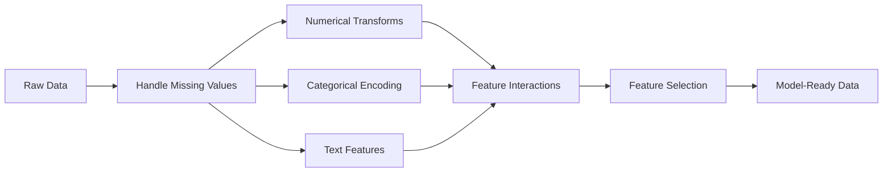

# 特徴量エンジニアリングと選択

> よい特徴量は、千個のデータ点に匹敵します。

**種類:** Build
**言語:** Python
**前提:** Phase 1 (Statistics for ML, Linear Algebra)、Phase 2 Lessons 1-7
**時間:** 約90分

## 学習目標

- 数値変換（standardization、min-max scaling、log transform、binning）を実装し、それぞれが適切な場面を説明する
- カテゴリ特徴量向けの one-hot、label、target encoding を構築し、target encoding における data leakage のリスクを見分ける
- TF-IDF vectorizer をゼロから構築し、テキスト分類で生の単語カウントより優れる理由を説明する
- filter-based feature selection（variance threshold、correlation、mutual information）を適用して次元を削減する

## 問題

データセットがあります。アルゴリズムを選び、学習させます。結果は平凡です。より凝ったアルゴリズムを試します。それでも平凡です。1 週間かけてハイパーパラメータを調整します。改善はわずかです。

その後、誰かが生データをよりよい特徴量に変換すると、単純な logistic regression が、調整済みの gradient-boosted ensemble を上回ります。

これは頻繁に起こります。古典的 ML では、アルゴリズムの選択よりもデータの表現が重要です。「延床面積」と「寝室数」を持つ住宅価格モデルは、「住所を生の文字列」として与えたモデルより、学習器がどれだけ高度でも優位になります。アルゴリズムは、与えられたものを使ってしか働けません。

特徴量エンジニアリングとは、生データを、モデルがパターンを見つけやすい表現に変換するプロセスです。特徴量選択とは、シグナルを増やさずノイズだけを増やす特徴量を捨てるプロセスです。この 2 つは、古典的 ML で最もレバレッジの高い作業です。

## コンセプト

### 特徴量パイプライン



### 数値特徴量

生の数値がそのままモデルに適していることはまれです。よく使う変換は次のとおりです。

**Scaling:** 距離ベースのアルゴリズム（K-Means、KNN、SVM）がすべての特徴量を公平に扱えるよう、特徴量を同じ範囲にそろえます。Min-max scaling は [0, 1] に写像します。Standardization（z-score）は mean=0、std=1 に写像します。

**Log transform:** 右に歪んだ分布（所得、人口、単語数）を圧縮します。乗法的な関係を加法的な関係に変換します。

**Binning:** 連続値をカテゴリに変換します。特徴量と target の関係が非線形だが段階的な場合（例: 年齢層）に有用です。

**Polynomial features:** x^2、x^3、x1*x2 の項を作ります。特徴量数が増える代わりに、線形モデルでも非線形関係を捉えられます。

### カテゴリ特徴量

モデルには数値が必要です。カテゴリには encoding が必要です。

**One-hot encoding:** 各カテゴリごとに二値列を作ります。"color = red/blue/green" は、is_red、is_blue、is_green の 3 列になります。cardinality の低い特徴量ではよく機能しますが、カテゴリが多いと列数が爆発します。

**Label encoding:** 各カテゴリを整数に対応付けます。red=0、blue=1、green=2 のようになります。偽の順序（モデルが green > blue > red と考える可能性）を導入します。個別値で分割する tree-based model にだけ適しています。

**Target encoding:** 各カテゴリを、そのカテゴリにおける target variable の平均で置き換えます。強力ですが危険です。data leakage のリスクが高いため、training data だけで計算し、test data に適用する必要があります。

### テキスト特徴量

**Count vectorizer:** 各単語が文書内に何回現れるかを数えます。"the cat sat on the mat" は {the: 2, cat: 1, sat: 1, on: 1, mat: 1} になります。

**TF-IDF:** Term Frequency-Inverse Document Frequency。単語が文書集合全体でどれだけ特徴的かに応じて重み付けします。"the" のような一般的な単語は低い重みになります。まれで識別力の高い単語は高い重みになります。

```
TF(word, doc) = count(word in doc) / total words in doc
IDF(word) = log(total docs / docs containing word)
TF-IDF = TF * IDF
```

### 欠損値

現実のデータには穴があります。戦略は次のとおりです。

- **Drop rows:** 欠損が少なく、ランダムな場合だけ使う
- **Mean/median imputation:** 単純で、分布の形を保ちやすい（median は外れ値に対してより頑健）
- **Mode imputation:** カテゴリ特徴量向け
- **Indicator column:** 補完前に "was_this_missing" という二値列を追加する。欠損しているという事実自体が情報になることがある
- **Forward/backward fill:** 時系列データ向け

### 特徴量の相互作用

関係が組み合わせに現れることがあります。"Height" と "weight" を別々に使うより、"BMI = weight / height^2" の方が予測力を持つ場合があります。特徴量の相互作用は特徴空間を増やすため、ドメイン知識を使って適切なものを選びます。

### 特徴量選択

特徴量が多ければよいとは限りません。無関係な特徴量はノイズを増やし、学習時間を延ばし、overfitting の原因になります。

**Filter methods (pre-model):**
- Correlation: 互いに高く相関する（冗長な）特徴量を削除する
- Mutual information: ある特徴量を知ることで target への不確実性がどれだけ減るかを測る
- Variance threshold: ほとんど変化しない特徴量を削除する

**Wrapper methods (model-based):**
- L1 regularization (Lasso): 無関係な特徴量の重みを正確にゼロへ押し込む
- Recursive feature elimination: 学習し、最も重要度の低い特徴量を削除し、繰り返す

**選択が重要な理由:** 10 個の良い特徴量だけを持つモデルは、たいてい 10 個の良い特徴量と 90 個のノイズ特徴量を持つモデルを上回ります。ノイズ特徴量は、汎化しない training data のパターンにモデルが過剰適合する機会を与えてしまいます。

## 実装する

### Step 1: 数値変換をゼロから実装する

```python
import math


def min_max_scale(values):
    min_val = min(values)
    max_val = max(values)
    if max_val == min_val:
        return [0.0] * len(values)
    return [(v - min_val) / (max_val - min_val) for v in values]


def standardize(values):
    n = len(values)
    mean = sum(values) / n
    variance = sum((v - mean) ** 2 for v in values) / n
    std = math.sqrt(variance) if variance > 0 else 1.0
    return [(v - mean) / std for v in values]


def log_transform(values):
    return [math.log(v + 1) for v in values]


def bin_values(values, n_bins=5):
    min_val = min(values)
    max_val = max(values)
    bin_width = (max_val - min_val) / n_bins
    if bin_width == 0:
        return [0] * len(values)
    result = []
    for v in values:
        bin_idx = int((v - min_val) / bin_width)
        bin_idx = min(bin_idx, n_bins - 1)
        result.append(bin_idx)
    return result


def polynomial_features(row, degree=2):
    n = len(row)
    result = list(row)
    if degree >= 2:
        for i in range(n):
            result.append(row[i] ** 2)
        for i in range(n):
            for j in range(i + 1, n):
                result.append(row[i] * row[j])
    return result
```

### Step 2: カテゴリ encoding をゼロから実装する

```python
def one_hot_encode(values):
    categories = sorted(set(values))
    cat_to_idx = {cat: i for i, cat in enumerate(categories)}
    n_cats = len(categories)

    encoded = []
    for v in values:
        row = [0] * n_cats
        row[cat_to_idx[v]] = 1
        encoded.append(row)

    return encoded, categories


def label_encode(values):
    categories = sorted(set(values))
    cat_to_int = {cat: i for i, cat in enumerate(categories)}
    return [cat_to_int[v] for v in values], cat_to_int


def target_encode(feature_values, target_values, smoothing=10):
    global_mean = sum(target_values) / len(target_values)

    category_stats = {}
    for feat, target in zip(feature_values, target_values):
        if feat not in category_stats:
            category_stats[feat] = {"sum": 0.0, "count": 0}
        category_stats[feat]["sum"] += target
        category_stats[feat]["count"] += 1

    encoding = {}
    for cat, stats in category_stats.items():
        cat_mean = stats["sum"] / stats["count"]
        weight = stats["count"] / (stats["count"] + smoothing)
        encoding[cat] = weight * cat_mean + (1 - weight) * global_mean

    return [encoding[v] for v in feature_values], encoding
```

### Step 3: テキスト特徴量をゼロから実装する

```python
def count_vectorize(documents):
    vocab = {}
    idx = 0
    for doc in documents:
        for word in doc.lower().split():
            if word not in vocab:
                vocab[word] = idx
                idx += 1

    vectors = []
    for doc in documents:
        vec = [0] * len(vocab)
        for word in doc.lower().split():
            vec[vocab[word]] += 1
        vectors.append(vec)

    return vectors, vocab


def tfidf(documents):
    n_docs = len(documents)

    vocab = {}
    idx = 0
    for doc in documents:
        for word in doc.lower().split():
            if word not in vocab:
                vocab[word] = idx
                idx += 1

    doc_freq = {}
    for doc in documents:
        seen = set()
        for word in doc.lower().split():
            if word not in seen:
                doc_freq[word] = doc_freq.get(word, 0) + 1
                seen.add(word)

    vectors = []
    for doc in documents:
        words = doc.lower().split()
        word_count = len(words)
        tf_map = {}
        for word in words:
            tf_map[word] = tf_map.get(word, 0) + 1

        vec = [0.0] * len(vocab)
        for word, count in tf_map.items():
            tf = count / word_count
            idf = math.log(n_docs / doc_freq[word])
            vec[vocab[word]] = tf * idf
        vectors.append(vec)

    return vectors, vocab
```

### Step 4: 欠損値補完をゼロから実装する

```python
def impute_mean(values):
    present = [v for v in values if v is not None]
    if not present:
        return [0.0] * len(values), 0.0
    mean = sum(present) / len(present)
    return [v if v is not None else mean for v in values], mean


def impute_median(values):
    present = sorted(v for v in values if v is not None)
    if not present:
        return [0.0] * len(values), 0.0
    n = len(present)
    if n % 2 == 0:
        median = (present[n // 2 - 1] + present[n // 2]) / 2
    else:
        median = present[n // 2]
    return [v if v is not None else median for v in values], median


def impute_mode(values):
    present = [v for v in values if v is not None]
    if not present:
        return values, None
    counts = {}
    for v in present:
        counts[v] = counts.get(v, 0) + 1
    mode = max(counts, key=counts.get)
    return [v if v is not None else mode for v in values], mode


def add_missing_indicator(values):
    return [0 if v is not None else 1 for v in values]
```

### Step 5: 特徴量選択をゼロから実装する

```python
def correlation(x, y):
    n = len(x)
    mean_x = sum(x) / n
    mean_y = sum(y) / n
    cov = sum((xi - mean_x) * (yi - mean_y) for xi, yi in zip(x, y)) / n
    std_x = math.sqrt(sum((xi - mean_x) ** 2 for xi in x) / n)
    std_y = math.sqrt(sum((yi - mean_y) ** 2 for yi in y) / n)
    if std_x == 0 or std_y == 0:
        return 0.0
    return cov / (std_x * std_y)


def mutual_information(feature, target, n_bins=10):
    feat_min = min(feature)
    feat_max = max(feature)
    bin_width = (feat_max - feat_min) / n_bins if feat_max != feat_min else 1.0
    feat_binned = [
        min(int((f - feat_min) / bin_width), n_bins - 1) for f in feature
    ]

    n = len(feature)
    target_classes = sorted(set(target))

    feat_bins = sorted(set(feat_binned))
    p_feat = {}
    for b in feat_bins:
        p_feat[b] = feat_binned.count(b) / n

    p_target = {}
    for t in target_classes:
        p_target[t] = target.count(t) / n

    mi = 0.0
    for b in feat_bins:
        for t in target_classes:
            joint_count = sum(
                1 for fb, tv in zip(feat_binned, target) if fb == b and tv == t
            )
            p_joint = joint_count / n
            if p_joint > 0:
                mi += p_joint * math.log(p_joint / (p_feat[b] * p_target[t]))

    return mi


def variance_threshold(features, threshold=0.01):
    n_features = len(features[0])
    n_samples = len(features)
    selected = []

    for j in range(n_features):
        col = [features[i][j] for i in range(n_samples)]
        mean = sum(col) / n_samples
        var = sum((v - mean) ** 2 for v in col) / n_samples
        if var >= threshold:
            selected.append(j)

    return selected


def remove_correlated(features, threshold=0.9):
    n_features = len(features[0])
    n_samples = len(features)

    to_remove = set()
    for i in range(n_features):
        if i in to_remove:
            continue
        col_i = [features[r][i] for r in range(n_samples)]
        for j in range(i + 1, n_features):
            if j in to_remove:
                continue
            col_j = [features[r][j] for r in range(n_samples)]
            corr = abs(correlation(col_i, col_j))
            if corr >= threshold:
                to_remove.add(j)

    return [i for i in range(n_features) if i not in to_remove]
```

### Step 6: 完全なパイプラインとデモ

```python
import random


def make_housing_data(n=200, seed=42):
    random.seed(seed)
    data = []
    for _ in range(n):
        sqft = random.uniform(500, 5000)
        bedrooms = random.choice([1, 2, 3, 4, 5])
        age = random.uniform(0, 50)
        neighborhood = random.choice(["downtown", "suburbs", "rural"])
        has_pool = random.choice([True, False])

        sqft_with_missing = sqft if random.random() > 0.05 else None
        age_with_missing = age if random.random() > 0.08 else None

        price = (
            50 * sqft
            + 20000 * bedrooms
            - 1000 * age
            + (50000 if neighborhood == "downtown" else 10000 if neighborhood == "suburbs" else 0)
            + (15000 if has_pool else 0)
            + random.gauss(0, 20000)
        )

        data.append({
            "sqft": sqft_with_missing,
            "bedrooms": bedrooms,
            "age": age_with_missing,
            "neighborhood": neighborhood,
            "has_pool": has_pool,
            "price": price,
        })
    return data


if __name__ == "__main__":
    data = make_housing_data(200)

    print("=== Raw Data Sample ===")
    for row in data[:3]:
        print(f"  {row}")

    sqft_raw = [d["sqft"] for d in data]
    age_raw = [d["age"] for d in data]
    prices = [d["price"] for d in data]

    print("\n=== Missing Value Handling ===")
    sqft_missing = sum(1 for v in sqft_raw if v is None)
    age_missing = sum(1 for v in age_raw if v is None)
    print(f"  sqft missing: {sqft_missing}/{len(sqft_raw)}")
    print(f"  age missing: {age_missing}/{len(age_raw)}")

    sqft_indicator = add_missing_indicator(sqft_raw)
    age_indicator = add_missing_indicator(age_raw)
    sqft_imputed, sqft_fill = impute_median(sqft_raw)
    age_imputed, age_fill = impute_mean(age_raw)
    print(f"  sqft filled with median: {sqft_fill:.0f}")
    print(f"  age filled with mean: {age_fill:.1f}")

    print("\n=== Numerical Transforms ===")
    sqft_scaled = standardize(sqft_imputed)
    age_scaled = min_max_scale(age_imputed)
    sqft_log = log_transform(sqft_imputed)
    age_binned = bin_values(age_imputed, n_bins=5)
    print(f"  sqft standardized: mean={sum(sqft_scaled)/len(sqft_scaled):.4f}, std={math.sqrt(sum(v**2 for v in sqft_scaled)/len(sqft_scaled)):.4f}")
    print(f"  age min-max: [{min(age_scaled):.2f}, {max(age_scaled):.2f}]")
    print(f"  age bins: {sorted(set(age_binned))}")

    print("\n=== Categorical Encoding ===")
    neighborhoods = [d["neighborhood"] for d in data]

    ohe, ohe_cats = one_hot_encode(neighborhoods)
    print(f"  One-hot categories: {ohe_cats}")
    print(f"  Sample encoding: {neighborhoods[0]} -> {ohe[0]}")

    le, le_map = label_encode(neighborhoods)
    print(f"  Label encoding map: {le_map}")

    te, te_map = target_encode(neighborhoods, prices, smoothing=10)
    print(f"  Target encoding: {({k: round(v) for k, v in te_map.items()})}")

    print("\n=== Text Features ===")
    descriptions = [
        "large modern house with pool",
        "small cozy cottage near downtown",
        "spacious family home with large yard",
        "modern apartment downtown with view",
        "rustic cabin in rural area",
    ]
    cv, cv_vocab = count_vectorize(descriptions)
    print(f"  Vocabulary size: {len(cv_vocab)}")
    print(f"  Doc 0 non-zero features: {sum(1 for v in cv[0] if v > 0)}")

    tf, tf_vocab = tfidf(descriptions)
    print(f"  TF-IDF vocabulary size: {len(tf_vocab)}")
    top_words = sorted(tf_vocab.keys(), key=lambda w: tf[0][tf_vocab[w]], reverse=True)[:3]
    print(f"  Doc 0 top TF-IDF words: {top_words}")

    print("\n=== Polynomial Features ===")
    sample_row = [sqft_scaled[0], age_scaled[0]]
    poly = polynomial_features(sample_row, degree=2)
    print(f"  Input: {[round(v, 4) for v in sample_row]}")
    print(f"  Polynomial: {[round(v, 4) for v in poly]}")
    print(f"  Features: [x1, x2, x1^2, x2^2, x1*x2]")

    print("\n=== Feature Selection ===")
    feature_matrix = [
        [sqft_scaled[i], age_scaled[i], float(sqft_indicator[i]), float(age_indicator[i])]
        + ohe[i]
        for i in range(len(data))
    ]

    print(f"  Total features: {len(feature_matrix[0])}")

    surviving_var = variance_threshold(feature_matrix, threshold=0.01)
    print(f"  After variance threshold (0.01): {len(surviving_var)} features kept")

    surviving_corr = remove_correlated(feature_matrix, threshold=0.9)
    print(f"  After correlation filter (0.9): {len(surviving_corr)} features kept")

    binary_prices = [1 if p > sum(prices) / len(prices) else 0 for p in prices]
    print("\n  Mutual information with target:")
    feature_names = ["sqft", "age", "sqft_missing", "age_missing"] + [f"neigh_{c}" for c in ohe_cats]
    for j in range(len(feature_matrix[0])):
        col = [feature_matrix[i][j] for i in range(len(feature_matrix))]
        mi = mutual_information(col, binary_prices, n_bins=10)
        print(f"    {feature_names[j]}: MI={mi:.4f}")

    print("\n  Correlation with price:")
    for j in range(len(feature_matrix[0])):
        col = [feature_matrix[i][j] for i in range(len(feature_matrix))]
        corr = correlation(col, prices)
        print(f"    {feature_names[j]}: r={corr:.4f}")
```

## 使ってみる

scikit-learn では、これらの変換を組み合わせ可能な pipeline として扱えます。

```python
from sklearn.preprocessing import StandardScaler, OneHotEncoder, PolynomialFeatures
from sklearn.impute import SimpleImputer
from sklearn.feature_extraction.text import TfidfVectorizer
from sklearn.feature_selection import mutual_info_classif, VarianceThreshold
from sklearn.compose import ColumnTransformer
from sklearn.pipeline import Pipeline

numeric_pipe = Pipeline([
    ("imputer", SimpleImputer(strategy="median")),
    ("scaler", StandardScaler()),
])

categorical_pipe = Pipeline([
    ("encoder", OneHotEncoder(sparse_output=False)),
])

preprocessor = ColumnTransformer([
    ("num", numeric_pipe, ["sqft", "age"]),
    ("cat", categorical_pipe, ["neighborhood"]),
])
```

ゼロから実装した版を見ると、各変換の内部で何が起きているかが正確にわかります。ライブラリ版は edge case の処理、sparse matrix 対応、pipeline の合成を追加しますが、数学は同じです。

## 成果物

このレッスンでは次を作ります。
- `outputs/prompt-feature-engineer.md` - 生データから体系的に特徴量を設計するためのプロンプト

## 演習

1. 数値変換に robust scaling（平均と標準偏差の代わりに median と interquartile range を使う）を追加してください。極端な外れ値を持つデータで standard scaling と比較してください。
2. leave-one-out target encoding を実装してください。各行について、その行自身の target 値を除外して target 平均を計算します。naive target encoding と比べて overfitting がどう減るかを示してください。
3. variance threshold、correlation filtering、mutual information ranking を組み合わせた自動特徴量選択パイプラインを構築してください。住宅データセットに適用し、全特徴量を使った場合と選択済み特徴量を使った場合のモデル性能（単純な linear regression を使用）を比較してください。

## 重要用語

| 用語 | よくある言い方 | 実際の意味 |
|------|----------------|----------------------|
| Feature engineering | 「新しい列を作る」 | 生データを、モデルにパターンを見えやすくする表現へ変換すること |
| Standardization | 「正規っぽくする」 | 平均を引いて標準偏差で割り、特徴量が mean=0、std=1 になるようにすること |
| One-hot encoding | 「ダミー変数を作る」 | カテゴリごとに二値列を 1 つ作り、各行でちょうど 1 列だけが 1 になるようにすること |
| Target encoding | 「答えを使って encoding する」 | 各カテゴリをそのカテゴリの平均 target 値で置き換え、overfitting を防ぐため smoothing を使うこと |
| TF-IDF | 「凝った単語カウント」 | Term Frequency と Inverse Document Frequency の積。corpus 全体でどれだけ特徴的かに応じて単語を重み付けする |
| Imputation | 「空欄を埋める」 | 欠損値を推定値（mean、median、mode、またはモデル予測値）で置き換えること |
| Feature selection | 「悪い列を捨てる」 | ノイズや冗長性を増やす特徴量を削除し、target に関するシグナルを持つものだけを残すこと |
| Mutual information | 「片方を知るともう片方がどれだけわかるか」 | 変数 X を観測することで変数 Y に関する不確実性がどれだけ減るかの尺度 |
| Data leakage | 「うっかりカンニングする」 | 予測時には利用できない情報を学習時に使ってしまい、過度に楽観的な結果を得ること |

## 参考資料

- [Feature Engineering and Selection (Max Kuhn & Kjell Johnson)](http://www.feat.engineering/) - 特徴量エンジニアリング全体を扱う無料オンライン書籍
- [scikit-learn Preprocessing Guide](https://scikit-learn.org/stable/modules/preprocessing.html) - 標準的な変換すべてに関する実用的なリファレンス
- [Target Encoding Done Right (Micci-Barreca, 2001)](https://dl.acm.org/doi/10.1145/507533.507538) - smoothing を用いた target encoding の原論文
