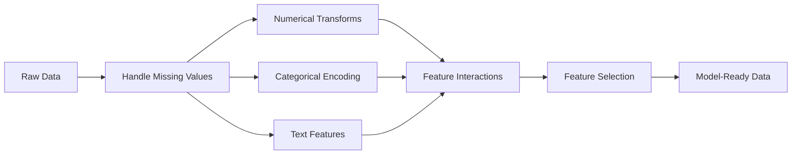

# Feature Engineering & Selection

> 一个好的功能胜过一千个数据点。

** 类型：** 构建
** 语言：** Python
** 先决条件：** 第1阶段（ML、线性代数的统计），第2阶段课程1-7
** 时间：** ~90分钟

## Learning Objectives

- 实施数字转换（标准化、最小-最大缩放、日志转换、分类）并解释每种转换何时合适
- 为类别特征构建一站式、标签和目标编码，并识别目标编码中的数据泄露风险
- 从头开始构建一个TF-IDF载体，并解释为什么它在文本分类中优于原始字数
- 应用基于过滤器的特征选择（方差阈值，相关性，互信息）来降低维度

## The Problem

您有一个数据集。你选择一个算法。你训练它。结果很平庸。你尝试一种更漂亮的算法。仍然平庸。您花了一周的时间调整超参数。边际改善。

然后有人将原始数据转换为更好的特征，简单的逻辑回归击败了您调整后的梯度增强集合。

这种情况不断发生。在经典ML中，数据的表示比算法的选择更重要。无论学习者有多复杂，具有“面积”和“卧室数量”的房价模型都将击败具有“地址作为原始字符串”的模型。该算法只能使用您提供的内容。

特征工程是将原始数据转换为使模型更容易找到模式的表示的过程。特征选择是丢弃添加噪音但不添加信号的特征的过程。它们加在一起是经典ML中杠杆率最高的活动。

## The Concept

### The Feature Pipeline



### Numerical Features

原始数据很少能用于模型。常见变换：

** 缩放：** 将特征置于同一范围内，以便基于距离的算法（K-Means、KNN、SV）平等地对待所有特征。最小-最大缩放映射到[0，1]。标准化（z得分）映射为平均值=0，std=1。

** 日志转换：** 压缩向右偏分布（收入、人口、字数）。将相乘关系变成相加关系。

** 分组：** 将连续值分配到类别中。当特征和目标之间的关系是非线性但逐步发展时有用（例如，年龄组）。

** 多项式特征：** 创建x^2，x^3，x1*x2项。让线性模型以牺牲更多特性为代价来捕捉非线性关系。

### Categorical Features

模特需要数字。类别需要编码。

** 一热编码：** 为每个类别创建二进制列。“Color = red/blue/green”变成三列：is_red、is_blue、is_green。适用于低基数功能，但在许多类别中激增。

** 标签编码：** 将每个类别映射到一个整数：red=0，blue=1，green=2。引入错误顺序（模型可能认为绿色>蓝色>红色）。仅适用于因个体价值观而分裂的基于树的模型。

** 目标编码：** 将每个类别替换为该类别的目标变量的平均值。功能强大但危险：数据泄露风险高。必须仅对训练数据进行计算并应用于测试数据。

### Text Features

** 计数vectorizer：** 计算每个单词在文档中出现的次数。“那只猫坐在垫子上”变成了{the：2，cat：1，sat：1，on：1，mat：1}。

**TF-IDF：** 词条频率-逆文档频率。根据单词在文档中的独特性来权衡单词。像“the”这样的常见词权重较低。罕见的、独特的单词具有很高的权重。

```
TF(word, doc) = count(word in doc) / total words in doc
IDF(word) = log(total docs / docs containing word)
TF-IDF = TF * IDF
```

### Missing Values

真实数据有漏洞。战略：

- ** 删除行：** 仅当缺失的数据是罕见和随机的时
- ** 均值/中位数插补：** 简单，保留分布形状（中位数对离群值更稳健）
- * * 模式插补：** 对于类别特征
- ** 指标列：** 在估算前添加二进制列“is_This_missing”。数据缺失的事实本身就可以提供信息
- ** 向前/向后填充：** 对于时间序列数据

### Feature Interaction

有时关系就在组合中。单独“身高”和“体重”的预测性不如“BMI =体重/身高' 2”。特征交互会增加特征空间，因此使用领域知识来选择正确的特征。

### Feature Selection

更多的功能并不总是更好。不相关的功能会增加噪音、增加训练时间，并可能导致过度适应。

** 过滤方法（模型前）：**
- 相关性：删除彼此高度相关的要素（冗余）
- 互信息：衡量了解某个特征的程度如何减少了目标的不确定性
- 方差阈值：删除几乎没有变化的要素

** 包装方法（基于模型）：**
- L1正规化（Lasso）：将不相关的特征权重驱动为恰好零
- 循环特征消除：训练，删除最不重要的特征，重复

** 为什么选择很重要：** 具有10个良好功能的型号通常会优于具有10个良好功能和90个有噪音功能的型号。有噪的特征使模型有机会过度适应不一般化的训练数据模式。

## Build It

### Step 1: Numerical transforms from scratch

```python
import math


def min_max_scale(values):
    min_val = min(values)
    max_val = max(values)
    if max_val == min_val:
        return [0.0] * len(values)
    return [(v - min_val) / (max_val - min_val) for v in values]


def standardize(values):
    n = len(values)
    mean = sum(values) / n
    variance = sum((v - mean) ** 2 for v in values) / n
    std = math.sqrt(variance) if variance > 0 else 1.0
    return [(v - mean) / std for v in values]


def log_transform(values):
    return [math.log(v + 1) for v in values]


def bin_values(values, n_bins=5):
    min_val = min(values)
    max_val = max(values)
    bin_width = (max_val - min_val) / n_bins
    if bin_width == 0:
        return [0] * len(values)
    result = []
    for v in values:
        bin_idx = int((v - min_val) / bin_width)
        bin_idx = min(bin_idx, n_bins - 1)
        result.append(bin_idx)
    return result


def polynomial_features(row, degree=2):
    n = len(row)
    result = list(row)
    if degree >= 2:
        for i in range(n):
            result.append(row[i] ** 2)
        for i in range(n):
            for j in range(i + 1, n):
                result.append(row[i] * row[j])
    return result
```

### Step 2: Categorical encoding from scratch

```python
def one_hot_encode(values):
    categories = sorted(set(values))
    cat_to_idx = {cat: i for i, cat in enumerate(categories)}
    n_cats = len(categories)

    encoded = []
    for v in values:
        row = [0] * n_cats
        row[cat_to_idx[v]] = 1
        encoded.append(row)

    return encoded, categories


def label_encode(values):
    categories = sorted(set(values))
    cat_to_int = {cat: i for i, cat in enumerate(categories)}
    return [cat_to_int[v] for v in values], cat_to_int


def target_encode(feature_values, target_values, smoothing=10):
    global_mean = sum(target_values) / len(target_values)

    category_stats = {}
    for feat, target in zip(feature_values, target_values):
        if feat not in category_stats:
            category_stats[feat] = {"sum": 0.0, "count": 0}
        category_stats[feat]["sum"] += target
        category_stats[feat]["count"] += 1

    encoding = {}
    for cat, stats in category_stats.items():
        cat_mean = stats["sum"] / stats["count"]
        weight = stats["count"] / (stats["count"] + smoothing)
        encoding[cat] = weight * cat_mean + (1 - weight) * global_mean

    return [encoding[v] for v in feature_values], encoding
```

### Step 3: Text features from scratch

```python
def count_vectorize(documents):
    vocab = {}
    idx = 0
    for doc in documents:
        for word in doc.lower().split():
            if word not in vocab:
                vocab[word] = idx
                idx += 1

    vectors = []
    for doc in documents:
        vec = [0] * len(vocab)
        for word in doc.lower().split():
            vec[vocab[word]] += 1
        vectors.append(vec)

    return vectors, vocab


def tfidf(documents):
    n_docs = len(documents)

    vocab = {}
    idx = 0
    for doc in documents:
        for word in doc.lower().split():
            if word not in vocab:
                vocab[word] = idx
                idx += 1

    doc_freq = {}
    for doc in documents:
        seen = set()
        for word in doc.lower().split():
            if word not in seen:
                doc_freq[word] = doc_freq.get(word, 0) + 1
                seen.add(word)

    vectors = []
    for doc in documents:
        words = doc.lower().split()
        word_count = len(words)
        tf_map = {}
        for word in words:
            tf_map[word] = tf_map.get(word, 0) + 1

        vec = [0.0] * len(vocab)
        for word, count in tf_map.items():
            tf = count / word_count
            idf = math.log(n_docs / doc_freq[word])
            vec[vocab[word]] = tf * idf
        vectors.append(vec)

    return vectors, vocab
```

### Step 4: Missing value imputation from scratch

```python
def impute_mean(values):
    present = [v for v in values if v is not None]
    if not present:
        return [0.0] * len(values), 0.0
    mean = sum(present) / len(present)
    return [v if v is not None else mean for v in values], mean


def impute_median(values):
    present = sorted(v for v in values if v is not None)
    if not present:
        return [0.0] * len(values), 0.0
    n = len(present)
    if n % 2 == 0:
        median = (present[n // 2 - 1] + present[n // 2]) / 2
    else:
        median = present[n // 2]
    return [v if v is not None else median for v in values], median


def impute_mode(values):
    present = [v for v in values if v is not None]
    if not present:
        return values, None
    counts = {}
    for v in present:
        counts[v] = counts.get(v, 0) + 1
    mode = max(counts, key=counts.get)
    return [v if v is not None else mode for v in values], mode


def add_missing_indicator(values):
    return [0 if v is not None else 1 for v in values]
```

### Step 5: Feature selection from scratch

```python
def correlation(x, y):
    n = len(x)
    mean_x = sum(x) / n
    mean_y = sum(y) / n
    cov = sum((xi - mean_x) * (yi - mean_y) for xi, yi in zip(x, y)) / n
    std_x = math.sqrt(sum((xi - mean_x) ** 2 for xi in x) / n)
    std_y = math.sqrt(sum((yi - mean_y) ** 2 for yi in y) / n)
    if std_x == 0 or std_y == 0:
        return 0.0
    return cov / (std_x * std_y)


def mutual_information(feature, target, n_bins=10):
    feat_min = min(feature)
    feat_max = max(feature)
    bin_width = (feat_max - feat_min) / n_bins if feat_max != feat_min else 1.0
    feat_binned = [
        min(int((f - feat_min) / bin_width), n_bins - 1) for f in feature
    ]

    n = len(feature)
    target_classes = sorted(set(target))

    feat_bins = sorted(set(feat_binned))
    p_feat = {}
    for b in feat_bins:
        p_feat[b] = feat_binned.count(b) / n

    p_target = {}
    for t in target_classes:
        p_target[t] = target.count(t) / n

    mi = 0.0
    for b in feat_bins:
        for t in target_classes:
            joint_count = sum(
                1 for fb, tv in zip(feat_binned, target) if fb == b and tv == t
            )
            p_joint = joint_count / n
            if p_joint > 0:
                mi += p_joint * math.log(p_joint / (p_feat[b] * p_target[t]))

    return mi


def variance_threshold(features, threshold=0.01):
    n_features = len(features[0])
    n_samples = len(features)
    selected = []

    for j in range(n_features):
        col = [features[i][j] for i in range(n_samples)]
        mean = sum(col) / n_samples
        var = sum((v - mean) ** 2 for v in col) / n_samples
        if var >= threshold:
            selected.append(j)

    return selected


def remove_correlated(features, threshold=0.9):
    n_features = len(features[0])
    n_samples = len(features)

    to_remove = set()
    for i in range(n_features):
        if i in to_remove:
            continue
        col_i = [features[r][i] for r in range(n_samples)]
        for j in range(i + 1, n_features):
            if j in to_remove:
                continue
            col_j = [features[r][j] for r in range(n_samples)]
            corr = abs(correlation(col_i, col_j))
            if corr >= threshold:
                to_remove.add(j)

    return [i for i in range(n_features) if i not in to_remove]
```

### Step 6: Full pipeline and demo

```python
import random


def make_housing_data(n=200, seed=42):
    random.seed(seed)
    data = []
    for _ in range(n):
        sqft = random.uniform(500, 5000)
        bedrooms = random.choice([1, 2, 3, 4, 5])
        age = random.uniform(0, 50)
        neighborhood = random.choice(["downtown", "suburbs", "rural"])
        has_pool = random.choice([True, False])

        sqft_with_missing = sqft if random.random() > 0.05 else None
        age_with_missing = age if random.random() > 0.08 else None

        price = (
            50 * sqft
            + 20000 * bedrooms
            - 1000 * age
            + (50000 if neighborhood == "downtown" else 10000 if neighborhood == "suburbs" else 0)
            + (15000 if has_pool else 0)
            + random.gauss(0, 20000)
        )

        data.append({
            "sqft": sqft_with_missing,
            "bedrooms": bedrooms,
            "age": age_with_missing,
            "neighborhood": neighborhood,
            "has_pool": has_pool,
            "price": price,
        })
    return data


if __name__ == "__main__":
    data = make_housing_data(200)

    print("=== Raw Data Sample ===")
    for row in data[:3]:
        print(f"  {row}")

    sqft_raw = [d["sqft"] for d in data]
    age_raw = [d["age"] for d in data]
    prices = [d["price"] for d in data]

    print("\n=== Missing Value Handling ===")
    sqft_missing = sum(1 for v in sqft_raw if v is None)
    age_missing = sum(1 for v in age_raw if v is None)
    print(f"  sqft missing: {sqft_missing}/{len(sqft_raw)}")
    print(f"  age missing: {age_missing}/{len(age_raw)}")

    sqft_indicator = add_missing_indicator(sqft_raw)
    age_indicator = add_missing_indicator(age_raw)
    sqft_imputed, sqft_fill = impute_median(sqft_raw)
    age_imputed, age_fill = impute_mean(age_raw)
    print(f"  sqft filled with median: {sqft_fill:.0f}")
    print(f"  age filled with mean: {age_fill:.1f}")

    print("\n=== Numerical Transforms ===")
    sqft_scaled = standardize(sqft_imputed)
    age_scaled = min_max_scale(age_imputed)
    sqft_log = log_transform(sqft_imputed)
    age_binned = bin_values(age_imputed, n_bins=5)
    print(f"  sqft standardized: mean={sum(sqft_scaled)/len(sqft_scaled):.4f}, std={math.sqrt(sum(v**2 for v in sqft_scaled)/len(sqft_scaled)):.4f}")
    print(f"  age min-max: [{min(age_scaled):.2f}, {max(age_scaled):.2f}]")
    print(f"  age bins: {sorted(set(age_binned))}")

    print("\n=== Categorical Encoding ===")
    neighborhoods = [d["neighborhood"] for d in data]

    ohe, ohe_cats = one_hot_encode(neighborhoods)
    print(f"  One-hot categories: {ohe_cats}")
    print(f"  Sample encoding: {neighborhoods[0]} -> {ohe[0]}")

    le, le_map = label_encode(neighborhoods)
    print(f"  Label encoding map: {le_map}")

    te, te_map = target_encode(neighborhoods, prices, smoothing=10)
    print(f"  Target encoding: {({k: round(v) for k, v in te_map.items()})}")

    print("\n=== Text Features ===")
    descriptions = [
        "large modern house with pool",
        "small cozy cottage near downtown",
        "spacious family home with large yard",
        "modern apartment downtown with view",
        "rustic cabin in rural area",
    ]
    cv, cv_vocab = count_vectorize(descriptions)
    print(f"  Vocabulary size: {len(cv_vocab)}")
    print(f"  Doc 0 non-zero features: {sum(1 for v in cv[0] if v > 0)}")

    tf, tf_vocab = tfidf(descriptions)
    print(f"  TF-IDF vocabulary size: {len(tf_vocab)}")
    top_words = sorted(tf_vocab.keys(), key=lambda w: tf[0][tf_vocab[w]], reverse=True)[:3]
    print(f"  Doc 0 top TF-IDF words: {top_words}")

    print("\n=== Polynomial Features ===")
    sample_row = [sqft_scaled[0], age_scaled[0]]
    poly = polynomial_features(sample_row, degree=2)
    print(f"  Input: {[round(v, 4) for v in sample_row]}")
    print(f"  Polynomial: {[round(v, 4) for v in poly]}")
    print(f"  Features: [x1, x2, x1^2, x2^2, x1*x2]")

    print("\n=== Feature Selection ===")
    feature_matrix = [
        [sqft_scaled[i], age_scaled[i], float(sqft_indicator[i]), float(age_indicator[i])]
        + ohe[i]
        for i in range(len(data))
    ]

    print(f"  Total features: {len(feature_matrix[0])}")

    surviving_var = variance_threshold(feature_matrix, threshold=0.01)
    print(f"  After variance threshold (0.01): {len(surviving_var)} features kept")

    surviving_corr = remove_correlated(feature_matrix, threshold=0.9)
    print(f"  After correlation filter (0.9): {len(surviving_corr)} features kept")

    binary_prices = [1 if p > sum(prices) / len(prices) else 0 for p in prices]
    print("\n  Mutual information with target:")
    feature_names = ["sqft", "age", "sqft_missing", "age_missing"] + [f"neigh_{c}" for c in ohe_cats]
    for j in range(len(feature_matrix[0])):
        col = [feature_matrix[i][j] for i in range(len(feature_matrix))]
        mi = mutual_information(col, binary_prices, n_bins=10)
        print(f"    {feature_names[j]}: MI={mi:.4f}")

    print("\n  Correlation with price:")
    for j in range(len(feature_matrix[0])):
        col = [feature_matrix[i][j] for i in range(len(feature_matrix))]
        corr = correlation(col, prices)
        print(f"    {feature_names[j]}: r={corr:.4f}")
```

## Use It

使用scikit-learn，这些转换是可组合的管道：

```python
from sklearn.preprocessing import StandardScaler, OneHotEncoder, PolynomialFeatures
from sklearn.impute import SimpleImputer
from sklearn.feature_extraction.text import TfidfVectorizer
from sklearn.feature_selection import mutual_info_classif, VarianceThreshold
from sklearn.compose import ColumnTransformer
from sklearn.pipeline import Pipeline

numeric_pipe = Pipeline([
    ("imputer", SimpleImputer(strategy="median")),
    ("scaler", StandardScaler()),
])

categorical_pipe = Pipeline([
    ("encoder", OneHotEncoder(sparse_output=False)),
])

preprocessor = ColumnTransformer([
    ("num", numeric_pipe, ["sqft", "age"]),
    ("cat", categorical_pipe, ["neighborhood"]),
])
```

从头开始的版本准确地显示了每次转换中发生的事情。库版本添加了边缘案例处理、稀疏矩阵支持和管道合成，但数学原理是一样的。

## Ship It

本课产生：
- '输出/prompt-feature-engineer.md '-从原始数据中系统地工程功能的提示

## Exercises

1. 向数字转换添加稳健的缩放（使用中位数和四分位距而不是平均值和标准差）。将其与具有极端异常值的数据的标准缩放进行比较。
2. 实施留一目标编码：对于每一行，计算目标平均值，排除该行自己的目标值。展示与原始目标编码相比，这如何减少过度匹配。
3. 构建结合方差阈值、相关性过滤和互信息排名的自动化特征选择管道。将其应用于住房数据集，并比较所有要素与选定要素的模型性能（使用简单的线性回归）。

## Key Terms

| Term | 别人怎么说 | 它实际上意味着什么 |
|------|----------------|----------------------|
| 特征工程 | “制作新专栏” | 将原始数据转换为向模型展示模式的表示 |
| 标准化 | “让一切正常化” | 减去平均值并除以标准差，使特征的平均值=0且标准差=1 |
| 独热编码 | “制作虚拟变量” | 每个类别创建一个二进制列，其中每一行恰好有一列为1 |
| 目标编码 | “使用答案来编码” | 将每个类别替换为该类别的平均目标值，并进行平滑处理以防止过度拟合 |
| TF-IDF | “花哨的词很重要” | 术语频率乘以逆文档频率：根据单词在整个文集中的独特性来加权 |
| 归责 | “填补空白” | 用估计值（平均值、中位数、模式或模型预测）替换缺失值 |
| 特征选择 | “扔掉坏专栏” | 删除添加噪声或冗余的特征，仅保留那些与目标有关的信号 |
| 互信息 | “一件事告诉你多少关于另一件事的信息” | 通过观察变量X获得的变量Y不确定性降低的衡量标准 |
| 数据泄露 | “意外作弊” | 训练期间使用预测时无法获得的信息，给出错误乐观的结果 |

## Further Reading

- [特征工程与选择（Max Kuhn & Kjell Johnson）]（http：//www.feat.engineering/）-涵盖特征工程全部领域的免费在线书籍
- [scikit-learn预处理指南]（https：//scikit-learn.org/stable/modules/preprocessing.html）-所有标准转换的实用参考
- [目标编码正确（Micci-Barreca，2001）]（https：//dl.acm.org/doi/10.1145/507533.507538）-关于带平滑的目标编码的原始论文
