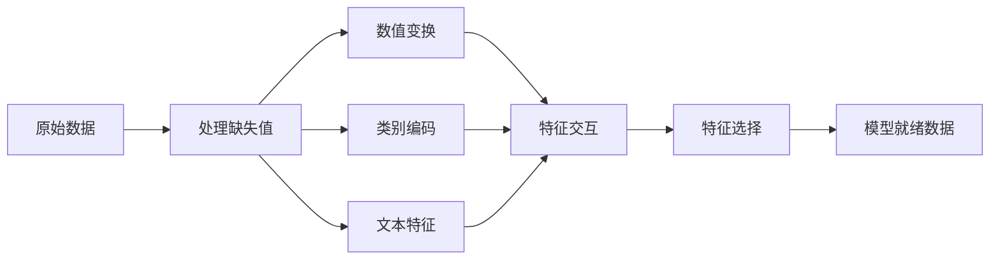

# 特征工程与特征选择（Feature Engineering & Selection）

> 一个好特征抵得上千个数据点。

**类型：** 构建（Build）
**语言：** Python
**前置条件：** 第一阶段（机器学习中的统计学、线性代数），第二阶段第1–7课
**时长：** 约90分钟

## 学习目标

- 实现数值变换（标准化、最小-最大缩放、对数变换、分箱）并解释每种方法的适用场景
- 为类别型特征构建独热编码（One-Hot Encoding）、标签编码（Label Encoding）和目标编码（Target Encoding），并识别目标编码中的数据泄漏（Data Leakage）风险
- 从头构建一个TF-IDF向量化器，并解释为什么它在文本分类中优于原始词频计数
- 应用基于过滤器的特征选择方法（方差阈值、相关性、互信息）来降低维度

## 问题

你有一个数据集。你选择一个算法。你训练它。结果平平。你尝试更高级的算法。依然平平。你花费一周时间调整超参数。微小的改进。

然后有人将原始数据转化为更好的特征，一个简单的逻辑回归就击败了你调优后的梯度提升集成模型。

这种情况经常发生。在经典机器学习中，数据的表示比算法的选择更重要。一个包含“平方英尺”和“卧室数量”的房价模型，无论学习器多么复杂，都会击败一个仅包含“原始地址字符串”的模型。算法只能处理你给它的数据。

特征工程是将原始数据转化为能让模型更容易发现模式的表示形式的过程。特征选择是丢弃那些只会增加噪声而不增加信号的特征的过程。两者结合是经典机器学习中最高杠杆率的活动。

## 概念

### 特征处理流程



### 数值特征

原始数值很少是模型就绪的。常用变换：

**缩放：** 将特征放到相同范围，使得基于距离的算法（K-Means、KNN、SVM）平等对待所有特征。最小-最大缩放映射到[0, 1]。标准化（z分数）映射到均值为0、标准差为1。

**对数变换：** 压缩右偏分布（收入、人口、词频）。将乘法关系转化为加法关系。

**分箱：** 将连续值转化为类别。当特征与目标之间的关系是非线性但分段式（如年龄段）时很有用。

**多项式特征：** 创建x²、x³、x1*x2等项。让线性模型能够捕捉非线性关系，代价是增加特征数量。

### 类别特征

模型需要数值。类别需要编码。

**独热编码：** 为每个类别创建一个二进制列。“color = red/blue/green”变成三列：is_red、is_blue、is_green。适用于低基数特征，但对于多类别特征会爆炸。

**标签编码：** 将每个类别映射为一个整数：red=0, blue=1, green=2。会引入虚假的排序（模型可能认为green > blue > red）。仅适用于在单个值上分裂的树模型。

**目标编码：** 用该类别目标变量的均值替换每个类别。强大但危险：数据泄漏风险高。必须仅在训练数据上计算并应用到测试数据。

### 文本特征

**词频向量化（Count Vectorizer）：** 统计每个单词在文档中出现的次数。“the cat sat on the mat”变为{the: 2, cat: 1, sat: 1, on: 1, mat: 1}。

**TF-IDF：** 词频-逆文档频率。根据单词在整个文档中的独特性来加权。常见词如“the”获得低权重。罕见且有区分度的词获得高权重。

```
TF(word, doc) = count(word in doc) / total words in doc
IDF(word) = log(total docs / docs containing word)
TF-IDF = TF * IDF
```

### 缺失值

真实数据存在空洞。策略：

- **删除行：** 仅当缺失数据稀少且随机时
- **均值/中位数填充：** 简单，保持分布形状（中位数对异常值更稳健）
- **众数填充：** 用于类别特征
- **指示列：** 在填充前添加一个二进制列“was_this_missing”。数据缺失这一事实本身可能具有信息量
- **前向/后向填充：** 用于时间序列数据

### 特征交互

有时关系存在于组合中。“身高”和“体重”单独预测力不如“BMI = 体重/身高²”。特征交互会成倍增加特征空间，因此请使用领域知识选择正确的交互。

### 特征选择

特征并非越多越好。无关特征会增加噪声、增加训练时间，并可能导致过拟合。

**过滤方法（模型之前）：**
- 相关性：移除彼此高度相关的特征（冗余）
- 互信息：衡量知道一个特征能减少目标不确定性的程度
- 方差阈值：移除几乎不变的 features

**包装方法（基于模型）：**
- L1正则化（Lasso）：将无关特征的权重精确驱动到零
- 递归特征消除：训练，移除最不重要的特征，重复

**为什么选择重要：** 一个包含10个好特征的模型通常优于一个包含10个好特征加上90个噪声特征的模型。噪声特征给模型提供了在训练数据模式上过拟合的机会，而这些模式无法泛化。

## 构建

### 步骤1：从头实现数值变换

```python
import math


def min_max_scale(values):
    min_val = min(values)
    max_val = max(values)
    if max_val == min_val:
        return [0.0] * len(values)
    return [(v - min_val) / (max_val - min_val) for v in values]


def standardize(values):
    n = len(values)
    mean = sum(values) / n
    variance = sum((v - mean) ** 2 for v in values) / n
    std = math.sqrt(variance) if variance > 0 else 1.0
    return [(v - mean) / std for v in values]


def log_transform(values):
    return [math.log(v + 1) for v in values]


def bin_values(values, n_bins=5):
    min_val = min(values)
    max_val = max(values)
    bin_width = (max_val - min_val) / n_bins
    if bin_width == 0:
        return [0] * len(values)
    result = []
    for v in values:
        bin_idx = int((v - min_val) / bin_width)
        bin_idx = min(bin_idx, n_bins - 1)
        result.append(bin_idx)
    return result


def polynomial_features(row, degree=2):
    n = len(row)
    result = list(row)
    if degree >= 2:
        for i in range(n):
            result.append(row[i] ** 2)
        for i in range(n):
            for j in range(i + 1, n):
                result.append(row[i] * row[j])
    return result
```

### 步骤2：从头实现类别编码

```python
def one_hot_encode(values):
    categories = sorted(set(values))
    cat_to_idx = {cat: i for i, cat in enumerate(categories)}
    n_cats = len(categories)

    encoded = []
    for v in values:
        row = [0] * n_cats
        row[cat_to_idx[v]] = 1
        encoded.append(row)

    return encoded, categories


def label_encode(values):
    categories = sorted(set(values))
    cat_to_int = {cat: i for i, cat in enumerate(categories)}
    return [cat_to_int[v] for v in values], cat_to_int


def target_encode(feature_values, target_values, smoothing=10):
    global_mean = sum(target_values) / len(target_values)

    category_stats = {}
    for feat, target in zip(feature_values, target_values):
        if feat not in category_stats:
            category_stats[feat] = {"sum": 0.0, "count": 0}
        category_stats[feat]["sum"] += target
        category_stats[feat]["count"] += 1

    encoding = {}
    for cat, stats in category_stats.items():
        cat_mean = stats["sum"] / stats["count"]
        weight = stats["count"] / (stats["count"] + smoothing)
        encoding[cat] = weight * cat_mean + (1 - weight) * global_mean

    return [encoding[v] for v in feature_values], encoding
```

### 步骤3：从头实现文本特征

```python
def count_vectorize(documents):
    vocab = {}
    idx = 0
    for doc in documents:
        for word in doc.lower().split():
            if word not in vocab:
                vocab[word] = idx
                idx += 1

    vectors = []
    for doc in documents:
        vec = [0] * len(vocab)
        for word in doc.lower().split():
            vec[vocab[word]] += 1
        vectors.append(vec)

    return vectors, vocab


def tfidf(documents):
    n_docs = len(documents)

    vocab = {}
    idx = 0
    for doc in documents:
        for word in doc.lower().split():
            if word not in vocab:
                vocab[word] = idx
                idx += 1

    doc_freq = {}
    for doc in documents:
        seen = set()
        for word in doc.lower().split():
            if word not in seen:
                doc_freq[word] = doc_freq.get(word, 0) + 1
                seen.add(word)

    vectors = []
    for doc in documents:
        words = doc.lower().split()
        word_count = len(words)
        tf_map = {}
        for word in words:
            tf_map[word] = tf_map.get(word, 0) + 1

        vec = [0.0] * len(vocab)
        for word, count in tf_map.items():
            tf = count / word_count
            idf = math.log(n_docs / doc_freq[word])
            vec[vocab[word]] = tf * idf
        vectors.append(vec)

    return vectors, vocab
```

### 步骤4：从头实现缺失值填充

```python
def impute_mean(values):
    present = [v for v in values if v is not None]
    if not present:
        return [0.0] * len(values), 0.0
    mean = sum(present) / len(present)
    return [v if v is not None else mean for v in values], mean


def impute_median(values):
    present = sorted(v for v in values if v is not None)
    if not present:
        return [0.0] * len(values), 0.0
    n = len(present)
    if n % 2 == 0:
        median = (present[n // 2 - 1] + present[n // 2]) / 2
    else:
        median = present[n // 2]
    return [v if v is not None else median for v in values], median


def impute_mode(values):
    present = [v for v in values if v is not None]
    if not present:
        return values, None
    counts = {}
    for v in present:
        counts[v] = counts.get(v, 0) + 1
    mode = max(counts, key=counts.get)
    return [v if v is not None else mode for v in values], mode


def add_missing_indicator(values):
    return [0 if v is not None else 1 for v in values]
```

### 步骤5：从头实现特征选择

```python
def correlation(x, y):
    n = len(x)
    mean_x = sum(x) / n
    mean_y = sum(y) / n
    cov = sum((xi - mean_x) * (yi - mean_y) for xi, yi in zip(x, y)) / n
    std_x = math.sqrt(sum((xi - mean_x) ** 2 for xi in x) / n)
    std_y = math.sqrt(sum((yi - mean_y) ** 2 for yi in y) / n)
    if std_x == 0 or std_y == 0:
        return 0.0
    return cov / (std_x * std_y)


def mutual_information(feature, target, n_bins=10):
    feat_min = min(feature)
    feat_max = max(feature)
    bin_width = (feat_max - feat_min) / n_bins if feat_max != feat_min else 1.0
    feat_binned = [
        min(int((f - feat_min) / bin_width), n_bins - 1) for f in feature
    ]

    n = len(feature)
    target_classes = sorted(set(target))

    feat_bins = sorted(set(feat_binned))
    p_feat = {}
    for b in feat_bins:
        p_feat[b] = feat_binned.count(b) / n

    p_target = {}
    for t in target_classes:
        p_target[t] = target.count(t) / n

    mi = 0.0
    for b in feat_bins:
        for t in target_classes:
            joint_count = sum(
                1 for fb, tv in zip(feat_binned, target) if fb == b and tv == t
            )
            p_joint = joint_count / n
            if p_joint > 0:
                mi += p_joint * math.log(p_joint / (p_feat[b] * p_target[t]))

    return mi


def variance_threshold(features, threshold=0.01):
    n_features = len(features[0])
    n_samples = len(features)
    selected = []

    for j in range(n_features):
        col = [features[i][j] for i in range(n_samples)]
        mean = sum(col) / n_samples
        var = sum((v - mean) ** 2 for v in col) / n_samples
        if var >= threshold:
            selected.append(j)

    return selected


def remove_correlated(features, threshold=0.9):
    n_features = len(features[0])
    n_samples = len(features)

    to_remove = set()
    for i in range(n_features):
        if i in to_remove:
            continue
        col_i = [features[r][i] for r in range(n_samples)]
        for j in range(i + 1, n_features):
            if j in to_remove:
                continue
            col_j = [features[r][j] for r in range(n_samples)]
            corr = abs(correlation(col_i, col_j))
            if corr >= threshold:
                to_remove.add(j)

    return [i for i in range(n_features) if i not in to_remove]
```

### 步骤6：完整流程与演示

```python
import random


def make_housing_data(n=200, seed=42):
    random.seed(seed)
    data = []
    for _ in range(n):
        sqft = random.uniform(500, 5000)
        bedrooms = random.choice([1, 2, 3, 4, 5])
        age = random.uniform(0, 50)
        neighborhood = random.choice(["downtown", "suburbs", "rural"])
        has_pool = random.choice([True, False])

        sqft_with_missing = sqft if random.random() > 0.05 else None
        age_with_missing = age if random.random() > 0.08 else None

        price = (
            50 * sqft
            + 20000 * bedrooms
            - 1000 * age
            + (50000 if neighborhood == "downtown" else 10000 if neighborhood == "suburbs" else 0)
            + (15000 if has_pool else 0)
            + random.gauss(0, 20000)
        )

        data.append({
            "sqft": sqft_with_missing,
            "bedrooms": bedrooms,
            "age": age_with_missing,
            "neighborhood": neighborhood,
            "has_pool": has_pool,
            "price": price,
        })
    return data


if __name__ == "__main__":
    data = make_housing_data(200)

    print("=== 原始数据样本 ===")
    for row in data[:3]:
        print(f"  {row}")

    sqft_raw = [d["sqft"] for d in data]
    age_raw = [d["age"] for d in data]
    prices = [d["price"] for d in data]

    print("\n=== 缺失值处理 ===")
    sqft_missing = sum(1 for v in sqft_raw if v is None)
    age_missing = sum(1 for v in age_raw if v is None)
    print(f"  sqft 缺失: {sqft_missing}/{len(sqft_raw)}")
    print(f"  age 缺失: {age_missing}/{len(age_raw)}")

    sqft_indicator = add_missing_indicator(sqft_raw)
    age_indicator = add_missing_indicator(age_raw)
    sqft_imputed, sqft_fill = impute_median(sqft_raw)
    age_imputed, age_fill = impute_mean(age_raw)
    print(f"  sqft 用中位数填充: {sqft_fill:.0f}")
    print(f"  age 用均值填充: {age_fill:.1f}")

    print("\n=== 数值变换 ===")
    sqft_scaled = standardize(sqft_imputed)
    age_scaled = min_max_scale(age_imputed)
    sqft_log = log_transform(sqft_imputed)
    age_binned = bin_values(age_imputed, n_bins=5)
    print(f"  sqft 标准化: mean={sum(sqft_scaled)/len