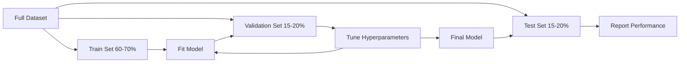

# モデル評価

> モデルの良し悪しは、それをどう測るかで決まります。

**種類:** Build
**言語:** Python
**前提:** Phase 1 (Probability & Distributions, Statistics for ML)、Phase 2 Lessons 1-8
**時間:** 約90分

## 学習目標

- K-fold と stratified K-fold cross-validation をゼロから実装し、imbalanced data で stratification が重要な理由を説明する
- precision、recall、F1、AUC-ROC、regression metrics（MSE、RMSE、MAE、R-squared）をゼロから計算する
- learning curve を解釈し、モデルが high bias または high variance に苦しんでいるか診断する
- data leakage、誤った metric 選択、test set contamination など、よくある評価ミスを見分ける

## 問題

モデルを学習しました。データ上で accuracy が 95% 出ています。これは良いモデルでしょうか？

そうかもしれませんし、そうでないかもしれません。データの 95% が 1 つのクラスに属しているなら、常にそのクラスを予測するだけの完全に役に立たないモデルでも 95% accuracy を出せます。学習に使ったのと同じデータで評価したなら、モデルが答えを暗記しただけなので 95% という数字に意味はありません。データセットに時間の要素があり、分割前にランダムシャッフルしたなら、モデルが未来のデータを使って過去を予測しているかもしれません。

多くの ML プロジェクトはモデル評価で失敗します。誤った metric は悪いモデルを良く見せます。誤った分割はモデルに不正を許します。誤った比較は、悪い方のモデルを選ばせます。評価を正しく行うことは任意ではありません。本番で機能するモデルと、実データを見た瞬間に失敗するモデルの分かれ目です。

## コンセプト

### Train、Validation、Test



3 つの分割には、それぞれ 3 つの目的があります。

- **Training set**: モデルがこのデータから学習します。学習中にこれらの例を見ます。
- **Validation set**: ハイパーパラメータ調整とモデル選択に使います。モデルはこのデータで学習しませんが、あなたの意思決定はこのデータの影響を受けます。
- **Test set**: 最終性能を報告するため、最後に一度だけ触れます。test performance を見てからモデルを変更したなら、それはもはや test set ではありません。2 つ目の validation set になっています。

test set は、報告した性能が本当に未知のデータに対するモデルの挙動を反映していることを保証する hold-out です。

### K-Fold Cross-Validation

小さなデータセットでは、単一の train/validation 分割はデータを無駄にし、推定も不安定になります。K-fold cross-validation は、すべてのデータを training と validation の両方に使います。

```mermaid
flowchart TB
    subgraph Fold1["Fold 1"]
        direction LR
        V1["Val"] --- T1a["Train"] --- T1b["Train"] --- T1c["Train"] --- T1d["Train"]
    end
    subgraph Fold2["Fold 2"]
        direction LR
        T2a["Train"] --- V2["Val"] --- T2b["Train"] --- T2c["Train"] --- T2d["Train"]
    end
    subgraph Fold3["Fold 3"]
        direction LR
        T3a["Train"] --- T3b["Train"] --- V3["Val"] --- T3c["Train"] --- T3d["Train"]
    end
    subgraph Fold4["Fold 4"]
        direction LR
        T4a["Train"] --- T4b["Train"] --- T4c["Train"] --- V4["Val"] --- T4d["Train"]
    end
    subgraph Fold5["Fold 5"]
        direction LR
        T5a["Train"] --- T5b["Train"] --- T5c["Train"] --- T5d["Train"] --- V5["Val"]
    end
    Fold1 --> R["Average scores"]
    Fold2 --> R
    Fold3 --> R
    Fold4 --> R
    Fold5 --> R
```



1. データを K 個の同じ大きさの fold に分割する
2. 各 fold について、K-1 個の fold で学習し、残り 1 個の fold で検証する
3. K 個の validation score を平均する

K=5 または K=10 が標準的な選択です。すべてのデータ点はちょうど 1 回 validation に使われます。平均スコアは、単一分割より安定した推定になります。

**Stratified K-fold**: 各 fold のクラス分布を保ちます。データセットが class A 70%、class B 30% なら、各 fold もおおむね同じ比率になります。random split では minority sample が 1 つの fold に偏る可能性があるため、imbalanced dataset では重要です。

### 分類指標

**Confusion matrix**: 基礎となる表です。binary classification では次のようになります。

|  | Predicted Positive | Predicted Negative |
|--|---|---|
| Actually Positive | True Positive (TP) | False Negative (FN) |
| Actually Negative | False Positive (FP) | True Negative (TN) |

この行列から、他のすべての metric が導けます。

- **Accuracy** = (TP + TN) / (TP + TN + FP + FN)。正解した予測の割合です。クラスが不均衡な場合は誤解を招きます。
- **Precision** = TP / (TP + FP)。positive と予測したもののうち、実際に positive だったものはいくつかを表します。false positive のコストが高い場合（例: スパムフィルタが本物のメールをスパム扱いする）に使います。
- **Recall** (sensitivity) = TP / (TP + FN)。実際の positive のうち、どれだけ捕捉できたかを表します。false negative のコストが高い場合（例: がん検診で腫瘍を見逃す）に使います。
- **F1 score** = 2 * precision * recall / (precision + recall)。precision と recall の調和平均です。どちらか一方が明確に優先されない場合に両者のバランスを取ります。
- **AUC-ROC**: Receiver Operating Characteristic curve の下の面積です。さまざまな分類 threshold における true positive rate と false positive rate をプロットします。AUC = 0.5 はランダム推測、AUC = 1.0 は完全分離を意味します。threshold に依存せず、選ぶ cutoff に関係なく、モデルが positive を negative よりどれだけ上位に並べられるかを測ります。

### 回帰指標

- **MSE** (Mean Squared Error) = mean((y_true - y_pred)^2)。大きな誤差を二乗で強く罰します。外れ値に敏感です。
- **RMSE** (Root Mean Squared Error) = sqrt(MSE)。target variable と同じ単位になります。MSE より解釈しやすいです。
- **MAE** (Mean Absolute Error) = mean(|y_true - y_pred|)。すべての誤差を線形に扱います。MSE より外れ値に頑健です。
- **R-squared** = 1 - SS_res / SS_tot。ここで SS_res = sum((y_true - y_pred)^2)、SS_tot = sum((y_true - y_mean)^2) です。モデルが説明する分散の割合です。R^2 = 1.0 は完全、R^2 = 0.0 は常に平均を予測するモデルと変わらないことを意味します。モデルが平均より悪い場合、R^2 は負になり得ます。

### Learning Curves

training set size の関数として training score と validation score をプロットします。

- **High bias (underfitting)**: 両方の曲線が低いスコアに収束します。データを増やしても役に立ちません。より複雑なモデルが必要です。
- **High variance (overfitting)**: training score は高いが validation score はかなり低く、差が大きい状態です。データを増やすと役に立つ可能性があります。

### Validation Curves

hyperparameter の関数として training score と validation score をプロットします。

- 複雑さが低い場合: 両方のスコアが低い（underfitting）
- 適切な複雑さの場合: 両方のスコアが高く、互いに近い
- 複雑さが高い場合: training score は高いままだが validation score は下がる（overfitting）

最適な hyperparameter 値は、validation score がピークになる位置です。

### よくある評価ミス

**Data leakage**: test set の情報が training に漏れることです。例: 分割前に全データセットで scaler を fit する、時系列予測で未来データを含める、target から派生した特徴量を使う。常に先に分割し、その後で前処理します。

**Class imbalance**: 取引の 99% が正当で、1% が不正だとします。常に「正当」と予測するモデルでも 99% accuracy を得ます。代わりに precision、recall、F1、AUC-ROC を使います。

**Wrong metric**: recall を最適化すべき場面（医療診断）で accuracy を最適化する、または外れ値が大きいデータで RMSE を最適化する（代わりに MAE を使う）ことです。

**Not using stratified splits**: imbalanced data では、random split によって validation fold に minority sample がほとんど入らず、推定が不安定になることがあります。

**Testing too often**: test performance を見て調整するたびに、test set に overfit します。test set は一度だけ使うものです。

## 実装する

### Step 1: Train/validation/test split

```python
import random
import math


def train_val_test_split(X, y, train_ratio=0.6, val_ratio=0.2, seed=42):
    random.seed(seed)
    n = len(X)
    indices = list(range(n))
    random.shuffle(indices)

    train_end = int(n * train_ratio)
    val_end = int(n * (train_ratio + val_ratio))

    train_idx = indices[:train_end]
    val_idx = indices[train_end:val_end]
    test_idx = indices[val_end:]

    X_train = [X[i] for i in train_idx]
    y_train = [y[i] for i in train_idx]
    X_val = [X[i] for i in val_idx]
    y_val = [y[i] for i in val_idx]
    X_test = [X[i] for i in test_idx]
    y_test = [y[i] for i in test_idx]

    return X_train, y_train, X_val, y_val, X_test, y_test
```

### Step 2: K-fold と stratified K-fold cross-validation

```python
def kfold_split(n, k=5, seed=42):
    random.seed(seed)
    indices = list(range(n))
    random.shuffle(indices)

    fold_size = n // k
    folds = []

    for i in range(k):
        start = i * fold_size
        end = start + fold_size if i < k - 1 else n
        val_idx = indices[start:end]
        train_idx = indices[:start] + indices[end:]
        folds.append((train_idx, val_idx))

    return folds


def stratified_kfold_split(y, k=5, seed=42):
    random.seed(seed)

    class_indices = {}
    for i, label in enumerate(y):
        class_indices.setdefault(label, []).append(i)

    for label in class_indices:
        random.shuffle(class_indices[label])

    folds = [{"train": [], "val": []} for _ in range(k)]

    for label, indices in class_indices.items():
        fold_size = len(indices) // k
        for i in range(k):
            start = i * fold_size
            end = start + fold_size if i < k - 1 else len(indices)
            val_part = indices[start:end]
            train_part = indices[:start] + indices[end:]
            folds[i]["val"].extend(val_part)
            folds[i]["train"].extend(train_part)

    return [(f["train"], f["val"]) for f in folds]


def cross_validate(X, y, model_fn, k=5, metric_fn=None, stratified=False):
    n = len(X)

    if stratified:
        folds = stratified_kfold_split(y, k)
    else:
        folds = kfold_split(n, k)

    scores = []
    for train_idx, val_idx in folds:
        X_train = [X[i] for i in train_idx]
        y_train = [y[i] for i in train_idx]
        X_val = [X[i] for i in val_idx]
        y_val = [y[i] for i in val_idx]

        model = model_fn()
        model.fit(X_train, y_train)
        predictions = [model.predict(x) for x in X_val]

        if metric_fn:
            score = metric_fn(y_val, predictions)
        else:
            score = sum(1 for yt, yp in zip(y_val, predictions) if yt == yp) / len(y_val)
        scores.append(score)

    return scores
```

### Step 3: Confusion matrix と分類指標

```python
def confusion_matrix(y_true, y_pred):
    tp = sum(1 for yt, yp in zip(y_true, y_pred) if yt == 1 and yp == 1)
    tn = sum(1 for yt, yp in zip(y_true, y_pred) if yt == 0 and yp == 0)
    fp = sum(1 for yt, yp in zip(y_true, y_pred) if yt == 0 and yp == 1)
    fn = sum(1 for yt, yp in zip(y_true, y_pred) if yt == 1 and yp == 0)
    return tp, tn, fp, fn


def accuracy(y_true, y_pred):
    tp, tn, fp, fn = confusion_matrix(y_true, y_pred)
    total = tp + tn + fp + fn
    return (tp + tn) / total if total > 0 else 0.0


def precision(y_true, y_pred):
    tp, tn, fp, fn = confusion_matrix(y_true, y_pred)
    return tp / (tp + fp) if (tp + fp) > 0 else 0.0


def recall(y_true, y_pred):
    tp, tn, fp, fn = confusion_matrix(y_true, y_pred)
    return tp / (tp + fn) if (tp + fn) > 0 else 0.0


def f1_score(y_true, y_pred):
    p = precision(y_true, y_pred)
    r = recall(y_true, y_pred)
    return 2 * p * r / (p + r) if (p + r) > 0 else 0.0


def roc_curve(y_true, y_scores):
    thresholds = sorted(set(y_scores), reverse=True)
    tpr_list = []
    fpr_list = []

    total_positives = sum(y_true)
    total_negatives = len(y_true) - total_positives

    for threshold in thresholds:
        y_pred = [1 if s >= threshold else 0 for s in y_scores]
        tp = sum(1 for yt, yp in zip(y_true, y_pred) if yt == 1 and yp == 1)
        fp = sum(1 for yt, yp in zip(y_true, y_pred) if yt == 0 and yp == 1)

        tpr = tp / total_positives if total_positives > 0 else 0.0
        fpr = fp / total_negatives if total_negatives > 0 else 0.0

        tpr_list.append(tpr)
        fpr_list.append(fpr)

    return fpr_list, tpr_list, thresholds


def auc_roc(y_true, y_scores):
    fpr_list, tpr_list, _ = roc_curve(y_true, y_scores)

    pairs = sorted(zip(fpr_list, tpr_list))
    fpr_sorted = [p[0] for p in pairs]
    tpr_sorted = [p[1] for p in pairs]

    area = 0.0
    for i in range(1, len(fpr_sorted)):
        width = fpr_sorted[i] - fpr_sorted[i - 1]
        height = (tpr_sorted[i] + tpr_sorted[i - 1]) / 2
        area += width * height

    return area
```

### Step 4: 回帰指標

```python
def mse(y_true, y_pred):
    n = len(y_true)
    return sum((yt - yp) ** 2 for yt, yp in zip(y_true, y_pred)) / n


def rmse(y_true, y_pred):
    return math.sqrt(mse(y_true, y_pred))


def mae(y_true, y_pred):
    n = len(y_true)
    return sum(abs(yt - yp) for yt, yp in zip(y_true, y_pred)) / n


def r_squared(y_true, y_pred):
    mean_y = sum(y_true) / len(y_true)
    ss_res = sum((yt - yp) ** 2 for yt, yp in zip(y_true, y_pred))
    ss_tot = sum((yt - mean_y) ** 2 for yt in y_true)
    if ss_tot == 0:
        return 0.0
    return 1.0 - ss_res / ss_tot
```

### Step 5: Learning curves

```python
def learning_curve(X, y, model_fn, metric_fn, train_sizes=None, val_ratio=0.2, seed=42):
    random.seed(seed)
    n = len(X)
    indices = list(range(n))
    random.shuffle(indices)

    val_size = int(n * val_ratio)
    val_idx = indices[:val_size]
    pool_idx = indices[val_size:]

    X_val = [X[i] for i in val_idx]
    y_val = [y[i] for i in val_idx]

    if train_sizes is None:
        train_sizes = [int(len(pool_idx) * r) for r in [0.1, 0.2, 0.4, 0.6, 0.8, 1.0]]

    train_scores = []
    val_scores = []

    for size in train_sizes:
        subset = pool_idx[:size]
        X_train = [X[i] for i in subset]
        y_train = [y[i] for i in subset]

        model = model_fn()
        model.fit(X_train, y_train)

        train_pred = [model.predict(x) for x in X_train]
        val_pred = [model.predict(x) for x in X_val]

        train_scores.append(metric_fn(y_train, train_pred))
        val_scores.append(metric_fn(y_val, val_pred))

    return train_sizes, train_scores, val_scores
```

### Step 6: テスト用の単純な分類器と完全なデモ

```python
class SimpleLogistic:
    def __init__(self, lr=0.1, epochs=100):
        self.lr = lr
        self.epochs = epochs
        self.weights = None
        self.bias = 0.0

    def sigmoid(self, z):
        z = max(-500, min(500, z))
        return 1.0 / (1.0 + math.exp(-z))

    def fit(self, X, y):
        n_features = len(X[0])
        self.weights = [0.0] * n_features
        self.bias = 0.0

        for _ in range(self.epochs):
            for xi, yi in zip(X, y):
                z = sum(w * x for w, x in zip(self.weights, xi)) + self.bias
                pred = self.sigmoid(z)
                error = yi - pred
                for j in range(n_features):
                    self.weights[j] += self.lr * error * xi[j]
                self.bias += self.lr * error

    def predict_proba(self, x):
        z = sum(w * xi for w, xi in zip(self.weights, x)) + self.bias
        return self.sigmoid(z)

    def predict(self, x):
        return 1 if self.predict_proba(x) >= 0.5 else 0


class SimpleLinearRegression:
    def __init__(self, lr=0.001, epochs=200):
        self.lr = lr
        self.epochs = epochs
        self.weights = None
        self.bias = 0.0

    def fit(self, X, y):
        n_features = len(X[0])
        self.weights = [0.0] * n_features
        self.bias = 0.0
        n = len(X)

        for _ in range(self.epochs):
            for xi, yi in zip(X, y):
                pred = sum(w * x for w, x in zip(self.weights, xi)) + self.bias
                error = yi - pred
                for j in range(n_features):
                    self.weights[j] += self.lr * error * xi[j] / n
                self.bias += self.lr * error / n

    def predict(self, x):
        return sum(w * xi for w, xi in zip(self.weights, x)) + self.bias


def standardize(values):
    n = len(values)
    mean = sum(values) / n
    var = sum((v - mean) ** 2 for v in values) / n
    std = math.sqrt(var) if var > 0 else 1.0
    return [(v - mean) / std for v in values], mean, std


def make_classification_data(n=300, seed=42):
    random.seed(seed)
    X = []
    y = []
    for _ in range(n):
        x1 = random.gauss(0, 1)
        x2 = random.gauss(0, 1)
        label = 1 if (x1 + x2 + random.gauss(0, 0.5)) > 0 else 0
        X.append([x1, x2])
        y.append(label)
    return X, y


def make_regression_data(n=200, seed=42):
    random.seed(seed)
    X = []
    y = []
    for _ in range(n):
        x1 = random.uniform(0, 10)
        x2 = random.uniform(0, 5)
        target = 3 * x1 + 2 * x2 + random.gauss(0, 2)
        X.append([x1, x2])
        y.append(target)
    return X, y


def make_imbalanced_data(n=300, minority_ratio=0.05, seed=42):
    random.seed(seed)
    X = []
    y = []
    for _ in range(n):
        if random.random() < minority_ratio:
            x1 = random.gauss(3, 0.5)
            x2 = random.gauss(3, 0.5)
            label = 1
        else:
            x1 = random.gauss(0, 1)
            x2 = random.gauss(0, 1)
            label = 0
        X.append([x1, x2])
        y.append(label)
    return X, y


if __name__ == "__main__":
    X_clf, y_clf = make_classification_data(300)

    print("=== Train/Validation/Test Split ===")
    X_train, y_train, X_val, y_val, X_test, y_test = train_val_test_split(X_clf, y_clf)
    print(f"  Train: {len(X_train)}, Val: {len(X_val)}, Test: {len(X_test)}")
    print(f"  Train class distribution: {sum(y_train)}/{len(y_train)} positive")
    print(f"  Val class distribution: {sum(y_val)}/{len(y_val)} positive")

    model = SimpleLogistic(lr=0.1, epochs=200)
    model.fit(X_train, y_train)

    print("\n=== Classification Metrics ===")
    y_pred = [model.predict(x) for x in X_test]
    tp, tn, fp, fn = confusion_matrix(y_test, y_pred)
    print(f"  Confusion matrix: TP={tp}, TN={tn}, FP={fp}, FN={fn}")
    print(f"  Accuracy:  {accuracy(y_test, y_pred):.4f}")
    print(f"  Precision: {precision(y_test, y_pred):.4f}")
    print(f"  Recall:    {recall(y_test, y_pred):.4f}")
    print(f"  F1 Score:  {f1_score(y_test, y_pred):.4f}")

    y_scores = [model.predict_proba(x) for x in X_test]
    auc = auc_roc(y_test, y_scores)
    print(f"  AUC-ROC:   {auc:.4f}")

    print("\n=== K-Fold Cross-Validation (K=5) ===")
    cv_scores = cross_validate(
        X_clf, y_clf,
        model_fn=lambda: SimpleLogistic(lr=0.1, epochs=200),
        k=5,
        metric_fn=accuracy,
    )
    mean_cv = sum(cv_scores) / len(cv_scores)
    std_cv = math.sqrt(sum((s - mean_cv) ** 2 for s in cv_scores) / len(cv_scores))
    print(f"  Fold scores: {[round(s, 4) for s in cv_scores]}")
    print(f"  Mean: {mean_cv:.4f} (+/- {std_cv:.4f})")

    print("\n=== Stratified K-Fold Cross-Validation (K=5) ===")
    strat_scores = cross_validate(
        X_clf, y_clf,
        model_fn=lambda: SimpleLogistic(lr=0.1, epochs=200),
        k=5,
        metric_fn=accuracy,
        stratified=True,
    )
    strat_mean = sum(strat_scores) / len(strat_scores)
    strat_std = math.sqrt(sum((s - strat_mean) ** 2 for s in strat_scores) / len(strat_scores))
    print(f"  Fold scores: {[round(s, 4) for s in strat_scores]}")
    print(f"  Mean: {strat_mean:.4f} (+/- {strat_std:.4f})")

    print("\n=== Imbalanced Data: Why Accuracy Lies ===")
    X_imb, y_imb = make_imbalanced_data(300, minority_ratio=0.05)
    positives = sum(y_imb)
    print(f"  Class distribution: {positives} positive, {len(y_imb) - positives} negative ({positives/len(y_imb)*100:.1f}% positive)")

    always_negative = [0] * len(y_imb)
    print(f"  Always-negative baseline:")
    print(f"    Accuracy:  {accuracy(y_imb, always_negative):.4f}")
    print(f"    Precision: {precision(y_imb, always_negative):.4f}")
    print(f"    Recall:    {recall(y_imb, always_negative):.4f}")
    print(f"    F1 Score:  {f1_score(y_imb, always_negative):.4f}")

    X_tr_i, y_tr_i, X_v_i, y_v_i, X_te_i, y_te_i = train_val_test_split(X_imb, y_imb)
    model_imb = SimpleLogistic(lr=0.5, epochs=500)
    model_imb.fit(X_tr_i, y_tr_i)
    y_pred_imb = [model_imb.predict(x) for x in X_te_i]
    print(f"\n  Trained model on imbalanced data:")
    print(f"    Accuracy:  {accuracy(y_te_i, y_pred_imb):.4f}")
    print(f"    Precision: {precision(y_te_i, y_pred_imb):.4f}")
    print(f"    Recall:    {recall(y_te_i, y_pred_imb):.4f}")
    print(f"    F1 Score:  {f1_score(y_te_i, y_pred_imb):.4f}")

    print("\n=== Regression Metrics ===")
    X_reg, y_reg = make_regression_data(200)

    col0 = [x[0] for x in X_reg]
    col1 = [x[1] for x in X_reg]
    col0_s, m0, s0 = standardize(col0)
    col1_s, m1, s1 = standardize(col1)
    X_reg_scaled = [[col0_s[i], col1_s[i]] for i in range(len(X_reg))]

    X_tr_r, y_tr_r, X_v_r, y_v_r, X_te_r, y_te_r = train_val_test_split(X_reg_scaled, y_reg)
    reg_model = SimpleLinearRegression(lr=0.01, epochs=500)
    reg_model.fit(X_tr_r, y_tr_r)
    y_pred_r = [reg_model.predict(x) for x in X_te_r]

    print(f"  MSE:       {mse(y_te_r, y_pred_r):.4f}")
    print(f"  RMSE:      {rmse(y_te_r, y_pred_r):.4f}")
    print(f"  MAE:       {mae(y_te_r, y_pred_r):.4f}")
    print(f"  R-squared: {r_squared(y_te_r, y_pred_r):.4f}")

    mean_baseline = [sum(y_tr_r) / len(y_tr_r)] * len(y_te_r)
    print(f"\n  Mean baseline:")
    print(f"    MSE:       {mse(y_te_r, mean_baseline):.4f}")
    print(f"    R-squared: {r_squared(y_te_r, mean_baseline):.4f}")

    print("\n=== Learning Curve ===")
    sizes, train_sc, val_sc = learning_curve(
        X_clf, y_clf,
        model_fn=lambda: SimpleLogistic(lr=0.1, epochs=200),
        metric_fn=accuracy,
    )
    print(f"  {'Size':>6} {'Train':>8} {'Val':>8}")
    for s, tr, va in zip(sizes, train_sc, val_sc):
        print(f"  {s:>6} {tr:>8.4f} {va:>8.4f}")

    print("\n=== Statistical Model Comparison ===")
    model_a_scores = cross_validate(
        X_clf, y_clf,
        model_fn=lambda: SimpleLogistic(lr=0.1, epochs=100),
        k=5, metric_fn=accuracy,
    )
    model_b_scores = cross_validate(
        X_clf, y_clf,
        model_fn=lambda: SimpleLogistic(lr=0.1, epochs=500),
        k=5, metric_fn=accuracy,
    )
    diffs = [a - b for a, b in zip(model_a_scores, model_b_scores)]
    mean_diff = sum(diffs) / len(diffs)
    std_diff = math.sqrt(sum((d - mean_diff) ** 2 for d in diffs) / len(diffs))
    t_stat = mean_diff / (std_diff / math.sqrt(len(diffs))) if std_diff > 0 else 0.0
    print(f"  Model A (100 epochs) mean: {sum(model_a_scores)/len(model_a_scores):.4f}")
    print(f"  Model B (500 epochs) mean: {sum(model_b_scores)/len(model_b_scores):.4f}")
    print(f"  Mean difference: {mean_diff:.4f}")
    print(f"  Paired t-statistic: {t_stat:.4f}")
    print(f"  (|t| > 2.78 for significance at p<0.05 with df=4)")
```

## 使ってみる

scikit-learn では、評価が workflow に組み込まれています。

```python
from sklearn.model_selection import cross_val_score, StratifiedKFold, learning_curve
from sklearn.metrics import (
    accuracy_score, precision_score, recall_score, f1_score,
    roc_auc_score, confusion_matrix, mean_squared_error, r2_score,
)
from sklearn.linear_model import LogisticRegression

model = LogisticRegression()
scores = cross_val_score(model, X, y, cv=StratifiedKFold(5), scoring="f1")
```

ゼロから実装した版を見ると、cross-validation が何をしているのか（魔法ではなく、for-loop と index tracking だけ）、各 metric がどう計算されるのか（TP/FP/TN/FN を数えるだけ）、そして stratification がなぜ重要なのか（各 fold のクラス比率を保つため）が正確にわかります。ライブラリ版は並列処理、より多くの scoring option、pipeline との統合を追加します。

## 成果物

このレッスンでは次を作ります。
- `outputs/skill-evaluation.md` - 分類モデルと回帰モデルの評価戦略を扱う skill

## 演習

1. precision-recall curve を実装してください。異なる threshold で precision と recall をプロットします。average precision（PR curve の下の面積）を計算してください。imbalanced dataset 上で PR curve と ROC curve を比較し、それぞれがどの場面でより情報量を持つか説明してください。
2. nested cross-validation loop を構築してください。外側の loop でモデル性能を評価し、内側の loop で hyperparameter を調整します。validation data を評価に漏らさず、2 つのモデルを公平に比較してください。
3. モデル比較のための permutation test を実装してください。label をシャッフルし、再学習して性能を測定します。100 回繰り返して null distribution を作ります。この分布に対する観測モデル性能の p-value を計算してください。

## 重要用語

| 用語 | よくある言い方 | 実際の意味 |
|------|----------------|----------------------|
| Overfitting | 「training data を暗記している」 | モデルが training data のノイズを捉えてしまい、training ではよく動くが未知データでは悪くなること |
| Cross-validation | 「異なる subset でテストする」 | データのどの部分を validation に使うかを体系的に入れ替え、すべての入れ替え結果を平均すること |
| Precision | 「positive と予測したもののうち正しい数」 | TP / (TP + FP)。positive 予測のうち実際に positive だった割合 |
| Recall | 「実際の positive をどれだけ見つけたか」 | TP / (TP + FN)。実際の positive のうち正しく識別された割合 |
| AUC-ROC | 「モデルがクラスをどれだけ分離できるか」 | すべての threshold にわたる true positive rate と false positive rate の曲線下面積。0.5（ランダム）から 1.0（完全）まで |
| R-squared | 「どれだけ分散を説明できるか」 | 1 - (残差平方和 / 全平方和)。target 分散のうちモデルが捉えた割合 |
| Data leakage | 「モデルがカンニングした」 | 予測時には利用できない情報を学習時に使ってしまい、楽観的な評価につながること |
| Learning curve | 「データを増やすと性能がどう変わるか」 | training set size に対する training score と validation score のプロット。underfitting や overfitting を明らかにする |
| Stratified split | 「クラス比率をそろえる」 | 各 subset がデータセット全体と同じクラス比率を持つように分割すること |

## 参考資料

- [scikit-learn Model Selection Guide](https://scikit-learn.org/stable/model_selection.html) - cross-validation、metrics、hyperparameter tuning に関する包括的なリファレンス
- [Beyond Accuracy: Precision and Recall (Google ML Crash Course)](https://developers.google.com/machine-learning/crash-course/classification/precision-and-recall) - インタラクティブな例を含む明快な説明
- [A Survey of Cross-Validation Procedures (Arlot & Celisse, 2010)](https://projecteuclid.org/journals/statistics-surveys/volume-4/issue-none/A-survey-of-cross-validation-procedures-for-model-selection/10.1214/09-SS054.full) - さまざまな CV 戦略がいつ、なぜ機能するかを厳密に扱った論文
