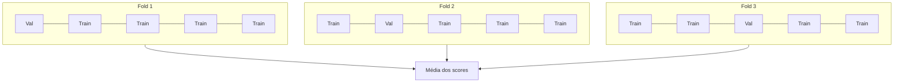

# Avaliação de Modelos

> Um modelo é tão bom quanto a forma como você o mede.

**Tipo:** Build
**Linguagens:** Python
**Pré-requisitos:** Fase 1 (Probabilidade e Distribuições, Estatística para ML), Fase 2 Aulas 1-8
**Tempo:** ~90 minutos

## Objetivos de Aprendizado

- Implementar validação cruzada K-fold e estratificada do zero e explicar por que a estratificação importa para dados desbalanceados
- Calcular precisão, recall, F1, AUC-ROC e métricas de regressão (MSE, RMSE, MAE, R-squared) do zero
- Interpretar curvas de aprendizado para diagnosticar se um modelo sofre de viés alto ou variância alta
- Identificar erros comuns de avaliação incluindo vazamento de dados, seleção errada de métrica e contaminação do conjunto de teste

## O Problema

Você treinou um modelo. Ele pega 95% de accuracy nos seus dados. É bom?

Talvez. Talvez não. Se 95% dos seus dados pertencem a uma classe, um modelo que sempre prevê essa classe pega 95% de accuracy sendo completamente inútil.

Avaliação de modelo é onde a maioria dos projetos de ML dá errado. A métrica errada faz um modelo ruim parecer bom. A divisão errada deixa um modelo trapacear.

## O Conceito

### Treino, Validação, Teste

Três divisões, três propósitos:

- **Conjunto de treino**: O modelo aprende destes dados. Ele vê estes exemplos durante o treino.
- **Conjunto de validação**: Usado para ajustar hiperparâmetros e selecionar entre modelos.
- **Conjunto de teste**: Tocado exatamente uma vez, no final, para reportar performance final.

### Validação Cruzada K-Fold



1. Divida os dados em K folds de tamanho igual
2. Para cada fold, treine em K-1 folds e valide no fold restante
3. Calcule a média dos K scores de validação

**K-Fold estratificado**: Preserva a distribuição de classes em cada fold.

### Métricas de Classificação

**Matriz de confusão**: a base. Para classificação binária:

|  | Previsto Positivo | Previsto Negativo |
|--|---|---|
| Realmente Positivo | Verdadeiro Positivo (VP) | Falso Negativo (FN) |
| Realmente Negativo | Falso Positivo (FP) | Verdadeiro Negativo (VN) |

- **Accuracy** = (VP + VN) / (VP + VN + FP + FN). Fração de previsões corretas.
- **Precisão** = VP / (VP + FP). De tudo que foi previsto positivo, quantos realmente eram?
- **Recall** = VP / (VP + FN). De tudo que realmente era positivo, quantos pegamos?
- **F1 Score** = 2 * precisão * recall / (precisão + recall). Média harmônica.
- **AUC-ROC**: Área sob a curva ROC. Independente de limiar.

### Métricas de Regressão

- **MSE** (Erro Quadrático Médio) = média((y_true - y_pred)^2)
- **RMSE** (Raiz do Erro Quadrático Médio) = sqrt(MSE)
- **MAE** (Erro Absoluto Médio) = média(|y_true - y_pred|)
- **R-squared** = 1 - SS_res / SS_tot

### Curvas de Aprendizado

Plote scores de treino e validação como função do tamanho do conjunto de treino:

- **Viés alto (subajuste)**: Ambas curvas convergem para um score baixo.
- **Variância alta (overajuste)**: Score de treino é alto mas validação muito menor.

### Erros Comuns de Avaliação

**Vazamento de dados**: Informação do conjunto de teste vaza pro treino. Sempre divida primeiro, depois pré-processe.

**Desbalanceamento de classes**: 99% de transações legítimas, 1% fraude. Um modelo que sempre prevê "legítimo" pega 99% de accuracy.

**Métrica errada**: Otimizar accuracy quando deveria otimizar recall (diagnóstico médico).

## Construa

### Passo 1: Divisão treino/validação/teste

```python
import random
import math

def train_val_test_split(X, y, train_ratio=0.6, val_ratio=0.2, seed=42):
    random.seed(seed)
    n = len(X)
    indices = list(range(n))
    random.shuffle(indices)

    train_end = int(n * train_ratio)
    val_end = int(n * (train_ratio + val_ratio))

    train_idx = indices[:train_end]
    val_idx = indices[train_end:val_end]
    test_idx = indices[val_end:]

    return ([X[i] for i in train_idx], [y[i] for i in train_idx],
            [X[i] for i in val_idx], [y[i] for i in val_idx],
            [X[i] for i in test_idx], [y[i] for i in test_idx])
```

### Passo 2: K-fold e validação cruzada estratificada

```python
def kfold_split(n, k=5, seed=42):
    random.seed(seed)
    indices = list(range(n))
    random.shuffle(indices)

    fold_size = n // k
    folds = []

    for i in range(k):
        start = i * fold_size
        end = start + fold_size if i < k - 1 else n
        val_idx = indices[start:end]
        train_idx = indices[:start] + indices[end:]
        folds.append((train_idx, val_idx))

    return folds
```

### Passo 3: Matriz de confusão e métricas de classificação

```python
def confusion_matrix(y_true, y_pred):
    tp = sum(1 for yt, yp in zip(y_true, y_pred) if yt == 1 and yp == 1)
    tn = sum(1 for yt, yp in zip(y_true, y_pred) if yt == 0 and yp == 0)
    fp = sum(1 for yt, yp in zip(y_true, y_pred) if yt == 0 and yp == 1)
    fn = sum(1 for yt, yp in zip(y_true, y_pred) if yt == 1 and yp == 0)
    return tp, tn, fp, fn

def accuracy(y_true, y_pred):
    tp, tn, fp, fn = confusion_matrix(y_true, y_pred)
    total = tp + tn + fp + fn
    return (tp + tn) / total if total > 0 else 0.0

def precision(y_true, y_pred):
    tp, tn, fp, fn = confusion_matrix(y_true, y_pred)
    return tp / (tp + fp) if (tp + fp) > 0 else 0.0

def recall(y_true, y_pred):
    tp, tn, fp, fn = confusion_matrix(y_true, y_pred)
    return tp / (tp + fn) if (tp + fn) > 0 else 0.0

def f1_score(y_true, y_pred):
    p = precision(y_true, y_pred)
    r = recall(y_true, y_pred)
    return 2 * p * r / (p + r) if (p + r) > 0 else 0.0
```

### Passo 4: Métricas de regressão

```python
def mse(y_true, y_pred):
    n = len(y_true)
    return sum((yt - yp) ** 2 for yt, yp in zip(y_true, y_pred)) / n

def rmse(y_true, y_pred):
    return math.sqrt(mse(y_true, y_pred))

def mae(y_true, y_pred):
    n = len(y_true)
    return sum(abs(yt - yp) for yt, yp in zip(y_true, y_pred)) / n

def r_squared(y_true, y_pred):
    mean_y = sum(y_true) / len(y_true)
    ss_res = sum((yt - yp) ** 2 for yt, yp in zip(y_true, y_pred))
    ss_tot = sum((yt - mean_y) ** 2 for yt in y_true)
    if ss_tot == 0:
        return 0.0
    return 1.0 - ss_res / ss_tot
```

## Exercícios

1. Implemente validação cruzada estratificada do zero e compare com a versão não estratificada num dataset desbalanceado.
2. Implemente a curva ROC e calcule o AUC. Compare com sklearn no mesmo dataset.
3. Gere dados de regressão com outliers. Compare MSE e MAE como métricas de avaliação.
4. Implemente curvas de aprendizado para um classificador simples. Identifique se o modelo tem viés alto ou variância alta.
