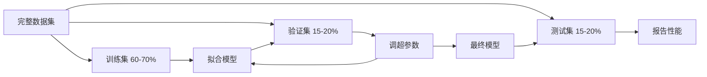

# 模型评估（Model Evaluation）

> 译注：本文译自同目录 [`en.md`](./en.md)。术语遵循仓根 [TRANSLATION_GUIDE.md](../../../../TRANSLATION_GUIDE.md)。

> 模型的好坏，取决于你怎么去衡量它。

**Type:** Build
**Languages:** Python
**Prerequisites:** Phase 1（Probability & Distributions、Statistics for ML），Phase 2 Lessons 1-8
**Time:** ~90 minutes

## 学习目标（Learning Objectives）

- 从零实现 K-fold 与 stratified K-fold 交叉验证（cross-validation），并解释为什么 stratification（分层）对不平衡数据很重要
- 从零计算 precision、recall、F1、AUC-ROC，以及回归指标（MSE、RMSE、MAE、R-squared）
- 通过学习曲线（learning curve）诊断模型是高偏置（high bias）还是高方差（high variance）
- 识别常见的评估错误，包括数据泄漏（data leakage）、指标选择错误、测试集污染

## 问题（Problem）

你训练了一个模型，它在你的数据上拿到了 95% 的 accuracy（准确率）。它好不好？

也许好，也许不好。如果你 95% 的数据都属于同一个类，那一个永远预测这个类的模型也能拿到 95% accuracy——但它毫无用处。如果你在训练用过的数据上做评估，那 95% 这个数字毫无意义，因为模型只是把答案背了下来。如果你的数据集有时间维度，而你随机 shuffle 之后再划分，那你的模型可能在用未来的数据预测过去。

模型评估是大多数 ML 项目翻车的地方。错的指标会让烂模型看起来很厉害；错的划分会让模型作弊；错的对比会让你挑出更差的那个模型。把评估做对不是可选项，它决定了一个模型究竟能上线、还是一上真实数据就崩。

## 概念（Concept）

### 训练集、验证集、测试集（Train, Validation, Test）



三种划分，三种用途：

- **训练集（Training set）**：模型从这份数据中学习。训练时它会看到这些样本。
- **验证集（Validation set）**：用于调超参数、在多个模型之间做选择。模型不会在这份数据上训练，但你的决策会被它影响。
- **测试集（Test set）**：只在最后碰一次，用来报告最终性能。如果你看了测试集结果再回去改模型，那它就不再是测试集了——它已经变成了第二个验证集。

测试集是你的「保留底牌」（hold-out），保证你报告的性能反映模型在真正没见过的数据上的表现。

### K 折交叉验证（K-Fold Cross-Validation）

数据集很小时，单一的 train/validation 划分既浪费数据，估计也很有噪声。K-fold cross-validation 把所有数据都用于训练和验证：


1. 把数据切成 K 个等大的 fold
2. 对每个 fold，用其余 K-1 个 fold 训练，在这一个 fold 上验证
3. 对 K 次验证分数求平均

K=5 或 K=10 是常用值。每个数据点恰好被用作验证一次。平均分比任何单次划分都更稳定。

**Stratified K-fold（分层 K 折）**：在每个 fold 里保留类别分布。如果数据集是 70% 类 A、30% 类 B，每个 fold 里也会保持差不多的比例。这对不平衡数据集尤其重要——随机划分可能把所有少数类样本都塞进同一个 fold。

### 分类指标（Classification Metrics）

**混淆矩阵（Confusion matrix）**：所有指标的基础。对二分类来说：

|  | Predicted Positive | Predicted Negative |
|--|---|---|
| Actually Positive | True Positive (TP) | False Negative (FN) |
| Actually Negative | False Positive (FP) | True Negative (TN) |

所有其他指标都从这张表派生：

- **Accuracy（准确率）** = (TP + TN) / (TP + TN + FP + FN)。预测正确的比例。在类别不平衡时具有误导性。
- **Precision（精确率）** = TP / (TP + FP)。在所有预测为正的样本里，有多少真的是正？当 false positive 代价高时使用（例如垃圾邮件过滤器把真实邮件标成垃圾）。
- **Recall（召回率，也叫 sensitivity 灵敏度）** = TP / (TP + FN)。在所有真实正样本里，我们抓到了多少？当 false negative 代价高时使用（例如癌症筛查漏掉了肿瘤）。
- **F1 score** = 2 \* precision \* recall / (precision + recall)。precision 和 recall 的调和平均。在两者都没明显占优时用来平衡。
- **AUC-ROC**：Receiver Operating Characteristic 曲线下的面积。在不同分类阈值下，画出 true positive rate 对 false positive rate 的曲线。AUC = 0.5 表示瞎猜，AUC = 1.0 表示完美分离。它是阈值无关的：衡量的是模型把正样本排在负样本前面的能力，与你选哪个阈值无关。

### 回归指标（Regression Metrics）

- **MSE（Mean Squared Error，均方误差）** = mean((y_true - y_pred)^2)。对大误差以平方惩罚。对离群点敏感。
- **RMSE（Root Mean Squared Error，均方根误差）** = sqrt(MSE)。和目标变量同单位，比 MSE 更易解读。
- **MAE（Mean Absolute Error，平均绝对误差）** = mean(|y_true - y_pred|)。所有误差线性对待，比 MSE 对离群点更鲁棒。
- **R-squared（R²，决定系数）** = 1 - SS_res / SS_tot，其中 SS_res = sum((y_true - y_pred)^2)、SS_tot = sum((y_true - y_mean)^2)。模型解释的方差比例。R² = 1.0 是完美。R² = 0.0 表示模型并不比永远输出均值更好。如果模型比均值还差，R² 可以是负的。

### 学习曲线（Learning Curves）

把训练分数和验证分数画成训练集大小的函数：

- **高偏置（High bias，欠拟合 underfitting）**：两条曲线都收敛到很低的分数。加更多数据也救不了，你需要更复杂的模型。
- **高方差（High variance，过拟合 overfitting）**：训练分数很高，验证分数低很多，两者差距很大。加更多数据应该有帮助。

### 验证曲线（Validation Curves）

把训练分数和验证分数画成某个超参数的函数：

- 复杂度低时：两个分数都低（欠拟合）
- 复杂度合适时：两个分数都高且相互接近
- 复杂度高时：训练分数还高，但验证分数掉下来（过拟合）

最优超参数取在验证分数达到峰值的位置。

### 常见评估错误（Common Evaluation Mistakes）

**数据泄漏（Data leakage）**：测试集的信息泄到训练里。比如：在划分前用整个数据集 fit scaler、在时间序列预测里把未来数据带进训练、用从目标变量派生出来的特征。**永远先划分，再做预处理**。

**类别不平衡（Class imbalance）**：99% 的交易是合法的，1% 是欺诈。一个永远预测「合法」的模型可以拿到 99% accuracy。改用 precision、recall、F1 或 AUC-ROC。

**指标错（Wrong metric）**：本该优化 recall（医疗诊断）的时候去优化 accuracy；数据有大量离群点时去优化 RMSE（应该改用 MAE）。

**没用 stratified 划分**：在不平衡数据上，随机划分可能把极少数的少数类样本放进验证 fold，导致估计极不稳定。

**测试得太勤**：每看一次测试集结果再调一次，你就在向测试集过拟合。**测试集是一次性的**。

## 动手实现（Build It）

### Step 1：训练 / 验证 / 测试划分

```python
import random
import math


def train_val_test_split(X, y, train_ratio=0.6, val_ratio=0.2, seed=42):
    random.seed(seed)
    n = len(X)
    indices = list(range(n))
    random.shuffle(indices)

    train_end = int(n * train_ratio)
    val_end = int(n * (train_ratio + val_ratio))

    train_idx = indices[:train_end]
    val_idx = indices[train_end:val_end]
    test_idx = indices[val_end:]

    X_train = [X[i] for i in train_idx]
    y_train = [y[i] for i in train_idx]
    X_val = [X[i] for i in val_idx]
    y_val = [y[i] for i in val_idx]
    X_test = [X[i] for i in test_idx]
    y_test = [y[i] for i in test_idx]

    return X_train, y_train, X_val, y_val, X_test, y_test
```

### Step 2：K-fold 与 stratified K-fold 交叉验证

```python
def kfold_split(n, k=5, seed=42):
    random.seed(seed)
    indices = list(range(n))
    random.shuffle(indices)

    fold_size = n // k
    folds = []

    for i in range(k):
        start = i * fold_size
        end = start + fold_size if i < k - 1 else n
        val_idx = indices[start:end]
        train_idx = indices[:start] + indices[end:]
        folds.append((train_idx, val_idx))

    return folds


def stratified_kfold_split(y, k=5, seed=42):
    random.seed(seed)

    class_indices = {}
    for i, label in enumerate(y):
        class_indices.setdefault(label, []).append(i)

    for label in class_indices:
        random.shuffle(class_indices[label])

    folds = [{"train": [], "val": []} for _ in range(k)]

    for label, indices in class_indices.items():
        fold_size = len(indices) // k
        for i in range(k):
            start = i * fold_size
            end = start + fold_size if i < k - 1 else len(indices)
            val_part = indices[start:end]
            train_part = indices[:start] + indices[end:]
            folds[i]["val"].extend(val_part)
            folds[i]["train"].extend(train_part)

    return [(f["train"], f["val"]) for f in folds]


def cross_validate(X, y, model_fn, k=5, metric_fn=None, stratified=False):
    n = len(X)

    if stratified:
        folds = stratified_kfold_split(y, k)
    else:
        folds = kfold_split(n, k)

    scores = []
    for train_idx, val_idx in folds:
        X_train = [X[i] for i in train_idx]
        y_train = [y[i] for i in train_idx]
        X_val = [X[i] for i in val_idx]
        y_val = [y[i] for i in val_idx]

        model = model_fn()
        model.fit(X_train, y_train)
        predictions = [model.predict(x) for x in X_val]

        if metric_fn:
            score = metric_fn(y_val, predictions)
        else:
            score = sum(1 for yt, yp in zip(y_val, predictions) if yt == yp) / len(y_val)
        scores.append(score)

    return scores
```

### Step 3：混淆矩阵与分类指标

```python
def confusion_matrix(y_true, y_pred):
    tp = sum(1 for yt, yp in zip(y_true, y_pred) if yt == 1 and yp == 1)
    tn = sum(1 for yt, yp in zip(y_true, y_pred) if yt == 0 and yp == 0)
    fp = sum(1 for yt, yp in zip(y_true, y_pred) if yt == 0 and yp == 1)
    fn = sum(1 for yt, yp in zip(y_true, y_pred) if yt == 1 and yp == 0)
    return tp, tn, fp, fn


def accuracy(y_true, y_pred):
    tp, tn, fp, fn = confusion_matrix(y_true, y_pred)
    total = tp + tn + fp + fn
    return (tp + tn) / total if total > 0 else 0.0


def precision(y_true, y_pred):
    tp, tn, fp, fn = confusion_matrix(y_true, y_pred)
    return tp / (tp + fp) if (tp + fp) > 0 else 0.0


def recall(y_true, y_pred):
    tp, tn, fp, fn = confusion_matrix(y_true, y_pred)
    return tp / (tp + fn) if (tp + fn) > 0 else 0.0


def f1_score(y_true, y_pred):
    p = precision(y_true, y_pred)
    r = recall(y_true, y_pred)
    return 2 * p * r / (p + r) if (p + r) > 0 else 0.0


def roc_curve(y_true, y_scores):
    thresholds = sorted(set(y_scores), reverse=True)
    tpr_list = []
    fpr_list = []

    total_positives = sum(y_true)
    total_negatives = len(y_true) - total_positives

    for threshold in thresholds:
        y_pred = [1 if s >= threshold else 0 for s in y_scores]
        tp = sum(1 for yt, yp in zip(y_true, y_pred) if yt == 1 and yp == 1)
        fp = sum(1 for yt, yp in zip(y_true, y_pred) if yt == 0 and yp == 1)

        tpr = tp / total_positives if total_positives > 0 else 0.0
        fpr = fp / total_negatives if total_negatives > 0 else 0.0

        tpr_list.append(tpr)
        fpr_list.append(fpr)

    return fpr_list, tpr_list, thresholds


def auc_roc(y_true, y_scores):
    fpr_list, tpr_list, _ = roc_curve(y_true, y_scores)

    pairs = sorted(zip(fpr_list, tpr_list))
    fpr_sorted = [p[0] for p in pairs]
    tpr_sorted = [p[1] for p in pairs]

    area = 0.0
    for i in range(1, len(fpr_sorted)):
        width = fpr_sorted[i] - fpr_sorted[i - 1]
        height = (tpr_sorted[i] + tpr_sorted[i - 1]) / 2
        area += width * height

    return area
```

### Step 4：回归指标

```python
def mse(y_true, y_pred):
    n = len(y_true)
    return sum((yt - yp) ** 2 for yt, yp in zip(y_true, y_pred)) / n


def rmse(y_true, y_pred):
    return math.sqrt(mse(y_true, y_pred))


def mae(y_true, y_pred):
    n = len(y_true)
    return sum(abs(yt - yp) for yt, yp in zip(y_true, y_pred)) / n


def r_squared(y_true, y_pred):
    mean_y = sum(y_true) / len(y_true)
    ss_res = sum((yt - yp) ** 2 for yt, yp in zip(y_true, y_pred))
    ss_tot = sum((yt - mean_y) ** 2 for yt in y_true)
    if ss_tot == 0:
        return 0.0
    return 1.0 - ss_res / ss_tot
```

### Step 5：学习曲线

```python
def learning_curve(X, y, model_fn, metric_fn, train_sizes=None, val_ratio=0.2, seed=42):
    random.seed(seed)
    n = len(X)
    indices = list(range(n))
    random.shuffle(indices)

    val_size = int(n * val_ratio)
    val_idx = indices[:val_size]
    pool_idx = indices[val_size:]

    X_val = [X[i] for i in val_idx]
    y_val = [y[i] for i in val_idx]

    if train_sizes is None:
        train_sizes = [int(len(pool_idx) * r) for r in [0.1, 0.2, 0.4, 0.6, 0.8, 1.0]]

    train_scores = []
    val_scores = []

    for size in train_sizes:
        subset = pool_idx[:size]
        X_train = [X[i] for i in subset]
        y_train = [y[i] for i in subset]

        model = model_fn()
        model.fit(X_train, y_train)

        train_pred = [model.predict(x) for x in X_train]
        val_pred = [model.predict(x) for x in X_val]

        train_scores.append(metric_fn(y_train, train_pred))
        val_scores.append(metric_fn(y_val, val_pred))

    return train_sizes, train_scores, val_scores
```

### Step 6：一个简单分类器用于测试，外加完整 demo

```python
class SimpleLogistic:
    def __init__(self, lr=0.1, epochs=100):
        self.lr = lr
        self.epochs = epochs
        self.weights = None
        self.bias = 0.0

    def sigmoid(self, z):
        z = max(-500, min(500, z))
        return 1.0 / (1.0 + math.exp(-z))

    def fit(self, X, y):
        n_features = len(X[0])
        self.weights = [0.0] * n_features
        self.bias = 0.0

        for _ in range(self.epochs):
            for xi, yi in zip(X, y):
                z = sum(w * x for w, x in zip(self.weights, xi)) + self.bias
                pred = self.sigmoid(z)
                error = yi - pred
                for j in range(n_features):
                    self.weights[j] += self.lr * error * xi[j]
                self.bias += self.lr * error

    def predict_proba(self, x):
        z = sum(w * xi for w, xi in zip(self.weights, x)) + self.bias
        return self.sigmoid(z)

    def predict(self, x):
        return 1 if self.predict_proba(x) >= 0.5 else 0


class SimpleLinearRegression:
    def __init__(self, lr=0.001, epochs=200):
        self.lr = lr
        self.epochs = epochs
        self.weights = None
        self.bias = 0.0

    def fit(self, X, y):
        n_features = len(X[0])
        self.weights = [0.0] * n_features
        self.bias = 0.0
        n = len(X)

        for _ in range(self.epochs):
            for xi, yi in zip(X, y):
                pred = sum(w * x for w, x in zip(self.weights, xi)) + self.bias
                error = yi - pred
                for j in range(n_features):
                    self.weights[j] += self.lr * error * xi[j] / n
                self.bias += self.lr * error / n

    def predict(self, x):
        return sum(w * xi for w, xi in zip(self.weights, x)) + self.bias


def standardize(values):
    n = len(values)
    mean = sum(values) / n
    var = sum((v - mean) ** 2 for v in values) / n
    std = math.sqrt(var) if var > 0 else 1.0
    return [(v - mean) / std for v in values], mean, std


def make_classification_data(n=300, seed=42):
    random.seed(seed)
    X = []
    y = []
    for _ in range(n):
        x1 = random.gauss(0, 1)
        x2 = random.gauss(0, 1)
        label = 1 if (x1 + x2 + random.gauss(0, 0.5)) > 0 else 0
        X.append([x1, x2])
        y.append(label)
    return X, y


def make_regression_data(n=200, seed=42):
    random.seed(seed)
    X = []
    y = []
    for _ in range(n):
        x1 = random.uniform(0, 10)
        x2 = random.uniform(0, 5)
        target = 3 * x1 + 2 * x2 + random.gauss(0, 2)
        X.append([x1, x2])
        y.append(target)
    return X, y


def make_imbalanced_data(n=300, minority_ratio=0.05, seed=42):
    random.seed(seed)
    X = []
    y = []
    for _ in range(n):
        if random.random() < minority_ratio:
            x1 = random.gauss(3, 0.5)
            x2 = random.gauss(3, 0.5)
            label = 1
        else:
            x1 = random.gauss(0, 1)
            x2 = random.gauss(0, 1)
            label = 0
        X.append([x1, x2])
        y.append(label)
    return X, y


if __name__ == "__main__":
    X_clf, y_clf = make_classification_data(300)

    print("=== Train/Validation/Test Split ===")
    X_train, y_train, X_val, y_val, X_test, y_test = train_val_test_split(X_clf, y_clf)
    print(f"  Train: {len(X_train)}, Val: {len(X_val)}, Test: {len(X_test)}")
    print(f"  Train class distribution: {sum(y_train)}/{len(y_train)} positive")
    print(f"  Val class distribution: {sum(y_val)}/{len(y_val)} positive")

    model = SimpleLogistic(lr=0.1, epochs=200)
    model.fit(X_train, y_train)

    print("\n=== Classification Metrics ===")
    y_pred = [model.predict(x) for x in X_test]
    tp, tn, fp, fn = confusion_matrix(y_test, y_pred)
    print(f"  Confusion matrix: TP={tp}, TN={tn}, FP={fp}, FN={fn}")
    print(f"  Accuracy:  {accuracy(y_test, y_pred):.4f}")
    print(f"  Precision: {precision(y_test, y_pred):.4f}")
    print(f"  Recall:    {recall(y_test, y_pred):.4f}")
    print(f"  F1 Score:  {f1_score(y_test, y_pred):.4f}")

    y_scores = [model.predict_proba(x) for x in X_test]
    auc = auc_roc(y_test, y_scores)
    print(f"  AUC-ROC:   {auc:.4f}")

    print("\n=== K-Fold Cross-Validation (K=5) ===")
    cv_scores = cross_validate(
        X_clf, y_clf,
        model_fn=lambda: SimpleLogistic(lr=0.1, epochs=200),
        k=5,
        metric_fn=accuracy,
    )
    mean_cv = sum(cv_scores) / len(cv_scores)
    std_cv = math.sqrt(sum((s - mean_cv) ** 2 for s in cv_scores) / len(cv_scores))
    print(f"  Fold scores: {[round(s, 4) for s in cv_scores]}")
    print(f"  Mean: {mean_cv:.4f} (+/- {std_cv:.4f})")

    print("\n=== Stratified K-Fold Cross-Validation (K=5) ===")
    strat_scores = cross_validate(
        X_clf, y_clf,
        model_fn=lambda: SimpleLogistic(lr=0.1, epochs=200),
        k=5,
        metric_fn=accuracy,
        stratified=True,
    )
    strat_mean = sum(strat_scores) / len(strat_scores)
    strat_std = math.sqrt(sum((s - strat_mean) ** 2 for s in strat_scores) / len(strat_scores))
    print(f"  Fold scores: {[round(s, 4) for s in strat_scores]}")
    print(f"  Mean: {strat_mean:.4f} (+/- {strat_std:.4f})")

    print("\n=== Imbalanced Data: Why Accuracy Lies ===")
    X_imb, y_imb = make_imbalanced_data(300, minority_ratio=0.05)
    positives = sum(y_imb)
    print(f"  Class distribution: {positives} positive, {len(y_imb) - positives} negative ({positives/len(y_imb)*100:.1f}% positive)")

    always_negative = [0] * len(y_imb)
    print(f"  Always-negative baseline:")
    print(f"    Accuracy:  {accuracy(y_imb, always_negative):.4f}")
    print(f"    Precision: {precision(y_imb, always_negative):.4f}")
    print(f"    Recall:    {recall(y_imb, always_negative):.4f}")
    print(f"    F1 Score:  {f1_score(y_imb, always_negative):.4f}")

    X_tr_i, y_tr_i, X_v_i, y_v_i, X_te_i, y_te_i = train_val_test_split(X_imb, y_imb)
    model_imb = SimpleLogistic(lr=0.5, epochs=500)
    model_imb.fit(X_tr_i, y_tr_i)
    y_pred_imb = [model_imb.predict(x) for x in X_te_i]
    print(f"\n  Trained model on imbalanced data:")
    print(f"    Accuracy:  {accuracy(y_te_i, y_pred_imb):.4f}")
    print(f"    Precision: {precision(y_te_i, y_pred_imb):.4f}")
    print(f"    Recall:    {recall(y_te_i, y_pred_imb):.4f}")
    print(f"    F1 Score:  {f1_score(y_te_i, y_pred_imb):.4f}")

    print("\n=== Regression Metrics ===")
    X_reg, y_reg = make_regression_data(200)

    col0 = [x[0] for x in X_reg]
    col1 = [x[1] for x in X_reg]
    col0_s, m0, s0 = standardize(col0)
    col1_s, m1, s1 = standardize(col1)
    X_reg_scaled = [[col0_s[i], col1_s[i]] for i in range(len(X_reg))]

    X_tr_r, y_tr_r, X_v_r, y_v_r, X_te_r, y_te_r = train_val_test_split(X_reg_scaled, y_reg)
    reg_model = SimpleLinearRegression(lr=0.01, epochs=500)
    reg_model.fit(X_tr_r, y_tr_r)
    y_pred_r = [reg_model.predict(x) for x in X_te_r]

    print(f"  MSE:       {mse(y_te_r, y_pred_r):.4f}")
    print(f"  RMSE:      {rmse(y_te_r, y_pred_r):.4f}")
    print(f"  MAE:       {mae(y_te_r, y_pred_r):.4f}")
    print(f"  R-squared: {r_squared(y_te_r, y_pred_r):.4f}")

    mean_baseline = [sum(y_tr_r) / len(y_tr_r)] * len(y_te_r)
    print(f"\n  Mean baseline:")
    print(f"    MSE:       {mse(y_te_r, mean_baseline):.4f}")
    print(f"    R-squared: {r_squared(y_te_r, mean_baseline):.4f}")

    print("\n=== Learning Curve ===")
    sizes, train_sc, val_sc = learning_curve(
        X_clf, y_clf,
        model_fn=lambda: SimpleLogistic(lr=0.1, epochs=200),
        metric_fn=accuracy,
    )
    print(f"  {'Size':>6} {'Train':>8} {'Val':>8}")
    for s, tr, va in zip(sizes, train_sc, val_sc):
        print(f"  {s:>6} {tr:>8.4f} {va:>8.4f}")

    print("\n=== Statistical Model Comparison ===")
    model_a_scores = cross_validate(
        X_clf, y_clf,
        model_fn=lambda: SimpleLogistic(lr=0.1, epochs=100),
        k=5, metric_fn=accuracy,
    )
    model_b_scores = cross_validate(
        X_clf, y_clf,
        model_fn=lambda: SimpleLogistic(lr=0.1, epochs=500),
        k=5, metric_fn=accuracy,
    )
    diffs = [a - b for a, b in zip(model_a_scores, model_b_scores)]
    mean_diff = sum(diffs) / len(diffs)
    std_diff = math.sqrt(sum((d - mean_diff) ** 2 for d in diffs) / len(diffs))
    t_stat = mean_diff / (std_diff / math.sqrt(len(diffs))) if std_diff > 0 else 0.0
    print(f"  Model A (100 epochs) mean: {sum(model_a_scores)/len(model_a_scores):.4f}")
    print(f"  Model B (500 epochs) mean: {sum(model_b_scores)/len(model_b_scores):.4f}")
    print(f"  Mean difference: {mean_diff:.4f}")
    print(f"  Paired t-statistic: {t_stat:.4f}")
    print(f"  (|t| > 2.78 for significance at p<0.05 with df=4)")
```

## 用起来（Use It）

用 scikit-learn，评估直接内建在工作流里：

```python
from sklearn.model_selection import cross_val_score, StratifiedKFold, learning_curve
from sklearn.metrics import (
    accuracy_score, precision_score, recall_score, f1_score,
    roc_auc_score, confusion_matrix, mean_squared_error, r2_score,
)
from sklearn.linear_model import LogisticRegression

model = LogisticRegression()
scores = cross_val_score(model, X, y, cv=StratifiedKFold(5), scoring="f1")
```

从零写的版本清楚地展示了：cross-validation 到底在做什么（没有魔法，只有 for 循环和索引追踪）、每个指标如何计算（只是数 TP/FP/TN/FN）、为什么 stratification 重要（让每个 fold 都保留类别比例）。库版本则额外提供并行、更多打分选项、与 pipeline 的集成。

## 上线部署（Ship It）

本课交付：
- `outputs/skill-evaluation.md` —— 一份关于分类与回归模型评估策略的 skill

## 练习（Exercises）

1. 实现 precision-recall 曲线：在不同阈值下画出 precision 对 recall 的曲线。计算平均 precision（PR 曲线下面积）。在不平衡数据集上对比 PR 曲线和 ROC 曲线，并解释什么时候哪一个更有信息量。
2. 实现嵌套（nested）cross-validation：外层评估模型性能，内层调超参数。用它公平地比较两个模型，避免验证数据泄到评估里。
3. 实现一个用于模型对比的置换检验（permutation test）：打乱标签、重新训练、衡量性能。重复 100 次构造零分布（null distribution）。计算观测到的模型性能在这个分布下的 p 值。

## 关键术语（Key Terms）

| Term | 大家怎么说 | 实际含义 |
|------|----------------|----------------------|
| Overfitting（过拟合） | 「把训练数据背下来了」 | 模型抓住了训练数据中的噪声，训练表现好但在未见数据上表现差 |
| Cross-validation（交叉验证） | 「在不同子集上测试」 | 系统性地轮换哪部分数据作为验证集，并对所有轮换的结果求平均 |
| Precision（精确率） | 「预测为正中有多少是对的」 | TP / (TP + FP)：在所有正预测里，真的是正的比例 |
| Recall（召回率） | 「真实正样本里我们找到了多少」 | TP / (TP + FN)：在所有真实正样本里被正确识别的比例 |
| AUC-ROC | 「模型把类别分开的能力」 | 在所有阈值下 true positive rate 对 false positive rate 曲线下的面积，从 0.5（随机）到 1.0（完美） |
| R-squared（R²） | 「解释了多少方差」 | 1 -（残差平方和 / 总平方和）：模型捕捉到的目标变量方差比例 |
| Data leakage（数据泄漏） | 「模型作弊了」 | 训练时使用了预测时拿不到的信息，导致评估结果过度乐观 |
| Learning curve（学习曲线） | 「数据更多时性能怎么变」 | 训练分数与验证分数随训练集大小变化的曲线，可揭示欠拟合或过拟合 |
| Stratified split（分层划分） | 「保持类别比例平衡」 | 划分数据时让每个子集的各类别比例与整体一致 |

## 延伸阅读（Further Reading）

- [scikit-learn Model Selection Guide](https://scikit-learn.org/stable/model_selection.html) —— 关于 cross-validation、指标和超参数调优的全面参考
- [Beyond Accuracy: Precision and Recall (Google ML Crash Course)](https://developers.google.com/machine-learning/crash-course/classification/precision-and-recall) —— 配交互式示例的清晰讲解
- [A Survey of Cross-Validation Procedures (Arlot & Celisse, 2010)](https://projecteuclid.org/journals/statistics-surveys/volume-4/issue-none/A-survey-of-cross-validation-procedures-for-model-selection/10.1214/09-SS054.full) —— 严谨地讨论何时、为何不同 CV 策略会奏效
