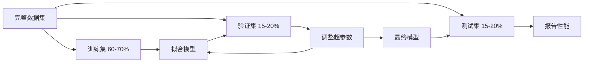

# 模型评估

> 一个模型的好坏取决于你如何衡量它。

**类型**：构建
**语言**：Python
**先修课程**：第1阶段（概率与分布，机器学习统计学），第2阶段课程1-8
**时间**：约90分钟

## 学习目标

- 从零实现K折交叉验证和分层K折交叉验证，并解释为什么分层对不平衡数据很重要
- 从零计算精确率、召回率、F1分数、AUC-ROC以及回归指标（均方误差、均方根误差、平均绝对误差、R平方）
- 解释学习曲线以诊断模型是否存在高偏差或高方差问题
- 识别常见的评估错误，包括数据泄露、错误的指标选择和测试集污染

## 问题

你训练了一个模型。在你的数据上它达到了95%的准确率。这算好吗？

也许算，也许不算。如果你的95%的数据属于一个类别，那么一个总是预测该类别的模型能达到95%的准确率，但却完全无用。如果你在训练数据上评估，95%这个数字是没有意义的，因为模型只是记住了答案。如果你的数据集有时间成分，并且在分割前随机打乱，你的模型可能会使用未来的数据来预测过去。

模型评估是大多数机器学习项目出错的地方。错误的指标会让一个糟糕的模型看起来很好。错误的分割会让模型作弊。错误的比较会让你选择更差的模型。正确地进行评估不是可选的。它决定了模型在生产环境中能正常工作还是在看到真实数据的那一刻就失败。

## 概念

### 训练集、验证集、测试集



三种分割，三种目的：

- **训练集**：模型从这些数据中学习。在训练过程中，模型会看到这些样本。
- **验证集**：用于调整超参数和选择模型。模型永远不会在这些数据上训练，但你的决策会受到它的影响。
- **测试集**：在最后阶段只接触一次，用于报告最终性能。如果你查看测试性能然后回去改变你的模型，它就不再是测试集了。它已经变成了第二个验证集。

测试集是你的保留保证，报告的性能反映了模型在真正未见数据上的表现。

### K折交叉验证

对于小数据集，单一的训练/验证分割会浪费数据并提供有噪声的估计。K折交叉验证将所有数据同时用于训练和验证：


1. 将数据分成K个大小相等的折
2. 对于每个折，在K-1个折上训练，在剩余的折上验证
3. 对K个验证分数取平均

K=5或K=10是标准选择。每个数据点恰好被用于验证一次。平均分数比任何单一分割都更稳定。

**分层K折**：在每个折中保持类别分布。如果你的数据集是70%的A类和30%的B类，每个折将有大致相同的比例。这对于不平衡数据集很重要，因为随机分割可能会把所有少数类样本放在一个折中。

### 分类指标

**混淆矩阵**：基础。对于二分类：

| | 预测为正例 | 预测为负例 |
|--|---|---|
| 实际为正例 | 真正例 (TP) | 假负例 (FN) |
| 实际为负例 | 假正例 (FP) | 真负例 (TN) |

从这个矩阵中，可以得出所有其他指标：

- **准确率** = (TP + TN) / (TP + TN + FP + FN)。正确预测的比例。当类别不平衡时会产生误导。
- **精确率** = TP / (TP + FP)。在所有被预测为正例的样本中，有多少实际上是正例？当假阳性代价很高时使用（例如，垃圾邮件过滤器将真实邮件标记为垃圾邮件）。
- **召回率**（敏感度）= TP / (TP + FN)。在所有实际为正例的样本中，我们成功捕获了多少？当假阴性代价很高时使用（例如，癌症筛查漏掉肿瘤）。
- **F1分数** = 2 * 精确率 * 召回率 / (精确率 + 召回率)。精确率和召回率的调和平均数。当两者没有明显优势时进行平衡。
- **AUC-ROC**：受试者工作特征曲线下面积。绘制不同分类阈值下的真正例率与假阳性率。AUC = 0.5表示随机猜测，AUC = 1.0表示完美分离。阈值无关：它衡量模型将正例排在负例之上的能力，无论你选择的阈值是多少。

### 回归指标

- **MSE**（均方误差）= mean((y_true - y_pred)^2)。以二次方式惩罚大误差。对异常值敏感。
- **RMSE**（均方根误差）= sqrt(MSE)。与目标变量相同的单位。比MSE更容易解释。
- **MAE**（平均绝对误差）= mean(|y_true - y_pred|)。线性处理所有误差。比MSE对异常值更稳健。
- **R平方** = 1 - SS_res / SS_tot，其中SS_res = sum((y_true - y_pred)^2)且SS_tot = sum((y_true - y_mean)^2)。模型解释的方差比例。R^2 = 1.0是完美的。R^2 = 0.0表示模型不比总是预测平均值更好。如果模型比平均值还差，R^2可以为负数。

### 学习曲线

绘制训练和验证分数作为训练集大小的函数：

- **高偏差（欠拟合）**：两条曲线都收敛到低分。添加更多数据不会有帮助。你需要一个更复杂的模型。
- **高方差（过拟合）**：训练分数高但验证分数低得多。它们之间的差距很大。添加更多数据应该会有帮助。

### 验证曲线

绘制训练和验证分数作为超参数的函数：

- 在低复杂度：两个分数都低（欠拟合）
- 在合适的复杂度：两个分数都高且接近
- 在高复杂度：训练分数保持高但验证分数下降（过拟合）

最优超参数值是验证分数达到峰值的地方。

### 常见评估错误

**数据泄露**：测试集的信息泄露到训练中。示例：在分割前在整个数据集上拟合缩放器，在时间序列预测中包含未来数据，使用从目标派生的特征。总是先分割，再预处理。

**类别不平衡**：99%的交易是合法的，1%是欺诈。一个总是预测"合法"的模型获得99%的准确率。应该使用精确率、召回率、F1或AUC-ROC。

**错误的指标**：应该在优化召回率时优化准确率（医疗诊断），或者在数据有严重异常值时优化RMSE（使用MAE代替）。

**不使用分层分割**：对于不平衡数据，随机分割可能在验证折中放入很少的少数类样本，导致估计不稳定。

**测试过于频繁**：每次查看测试性能并调整时，你都在过拟合测试集。测试集只能使用一次。

## 构建它

### 步骤1：训练/验证/测试分割

```python
import random
import math


def train_val_test_split(X, y, train_ratio=0.6, val_ratio=0.2, seed=42):
    random.seed(seed)
    n = len(X)
    indices = list(range(n))
    random.shuffle(indices)

    train_end = int(n * train_ratio)
    val_end = int(n * (train_ratio + val_ratio))

    train_idx = indices[:train_end]
    val_idx = indices[train_end:val_end]
    test_idx = indices[val_end:]

    X_train = [X[i] for i in train_idx]
    y_train = [y[i] for i in train_idx]
    X_val = [X[i] for i in val_idx]
    y_val = [y[i] for i in val_idx]
    X_test = [X[i] for i in test_idx]
    y_test = [y[i] for i in test_idx]

    return X_train, y_train, X_val, y_val, X_test, y_test
```

### 步骤2：K折和分层K折交叉验证

```python
def kfold_split(n, k=5, seed=42):
    random.seed(seed)
    indices = list(range(n))
    random.shuffle(indices)

    fold_size = n // k
    folds = []

    for i in range(k):
        start = i * fold_size
        end = start + fold_size if i < k - 1 else n
        val_idx = indices[start:end]
        train_idx = indices[:start] + indices[end:]
        folds.append((train_idx, val_idx))

    return folds


def stratified_kfold_split(y, k=5, seed=42):
    random.seed(seed)

    class_indices = {}
    for i, label in enumerate(y):
        class_indices.setdefault(label, []).append(i)

    for label in class_indices:
        random.shuffle(class_indices[label])

    folds = [{"train": [], "val": []} for _ in range(k)]

    for label, indices in class_indices.items():
        fold_size = len(indices) // k
        for i in range(k):
            start = i * fold_size
            end = start + fold_size if i < k - 1 else len(indices)
            val_part = indices[start:end]
            train_part = indices[:start] + indices[end:]
            folds[i]["val"].extend(val_part)
            folds[i]["train"].extend(train_part)

    return [(f["train"], f["val"]) for f in folds]


def cross_validate(X, y, model_fn, k=5, metric_fn=None, stratified=False):
    n = len(X)

    if stratified:
        folds = stratified_kfold_split(y, k)
    else:
        folds = kfold_split(n, k)

    scores = []
    for train_idx, val_idx in folds:
        X_train = [X[i] for i in train_idx]
        y_train = [y[i] for i in train_idx]
        X_val = [X[i] for i in val_idx]
        y_val = [y[i] for i in val_idx]

        model = model_fn()
        model.fit(X_train, y_train)
        predictions = [model.predict(x) for x in X_val]

        if metric_fn:
            score = metric_fn(y_val, predictions)
        else:
            score = sum(1 for yt, yp in zip(y_val, predictions) if yt == yp) / len(y_val)
        scores.append(score)

    return scores
```

### 步骤3：混淆矩阵和分类指标

```python
def confusion_matrix(y_true, y_pred):
    tp = sum(1 for yt, yp in zip(y_true, y_pred) if yt == 1 and yp == 1)
    tn = sum(1 for yt, yp in zip(y_true, y_pred) if yt == 0 and yp == 0)
    fp = sum(1 for yt, yp in zip(y_true, y_pred) if yt == 0 and yp == 1)
    fn = sum(1 for yt, yp in zip(y_true, y_pred) if yt == 1 and yp == 0)
    return tp, tn, fp, fn


def accuracy(y_true, y_pred):
    tp, tn, fp, fn = confusion_matrix(y_true, y_pred)
    total = tp + tn + fp + fn
    return (tp + tn) / total if total > 0 else 0.0


def precision(y_true, y_pred):
    tp, tn, fp, fn = confusion_matrix(y_true, y_pred)
    return tp / (tp + fp) if (tp + fp) > 0 else 0.0


def recall(y_true, y_pred):
    tp, tn, fp, fn = confusion_matrix(y_true, y_pred)
    return tp / (tp + fn) if (tp + fn) > 0 else 0.0


def f1_score(y_true, y_pred):
    p = precision(y_true, y_pred)
    r = recall(y_true, y_pred)
    return 2 * p * r / (p + r) if (p + r) > 0 else 0.0


def roc_curve(y_true, y_scores):
    thresholds = sorted(set(y_scores), reverse=True)
    tpr_list = []
    fpr_list = []

    total_positives = sum(y_true)
    total_negatives = len(y_true) - total_positives

    for threshold in thresholds:
        y_pred = [1 if s >= threshold else 0 for s in y_scores]
        tp = sum(1 for yt, yp in zip(y_true, y_pred) if yt == 1 and yp == 1)
        fp = sum(1 for yt, yp in zip(y_true, y_pred) if yt == 0 and yp == 1)

        tpr = tp / total_positives if total_positives > 0 else 0.0
        fpr = fp / total_negatives if total_negatives > 0 else 0.0

        tpr_list.append(tpr)
        fpr_list.append(fpr)

    return fpr_list, tpr_list, thresholds


def auc_roc(y_true, y_scores):
    fpr_list, tpr_list, _ = roc_curve(y_true, y_scores)

    pairs = sorted(zip(fpr_list, tpr_list))
    fpr_sorted = [p[0] for p in pairs]
    tpr_sorted = [p[1] for p in pairs]

    area = 0.0
    for i in range(1, len(fpr_sorted)):
        width = fpr_sorted[i] - fpr_sorted[i - 1]
        height = (tpr_sorted[i] + tpr_sorted[i - 1]) / 2
        area += width * height

    return area
```

### 步骤4：回归指标

```python
def mse(y_true, y_pred):
    n = len(y_true)
    return sum((yt - yp) ** 2 for yt, yp in zip(y_true, y_pred)) / n


def rmse(y_true, y_pred):
    return math.sqrt(mse(y_true, y_pred))


def mae(y_true, y_pred):
    n = len(y_true)
    return sum(abs(yt - yp) for yt, yp in zip(y_true, y_pred)) / n


def r_squared(y_true, y_pred):
    mean_y = sum(y_true) / len(y_true)
    ss_res = sum((yt - yp) ** 2 for yt, yp in zip(y_true, y_pred))
    ss_tot = sum((yt - mean_y) ** 2 for yt in y_true)
    if ss_tot == 0:
        return 0.0
    return 1.0 - ss_res / ss_tot
```

### 步骤5：学习曲线

```python
def learning_curve(X, y, model_fn, metric_fn, train_sizes=None, val_ratio=0.2, seed=42):
    random.seed(seed)
    n = len(X)
    indices = list(range(n))
    random.shuffle(indices)

    val_size = int(n * val_ratio)
    val_idx = indices[:val_size]
    pool_idx = indices[val_size:]

    X_val = [X[i] for i in val_idx]
    y_val = [y[i] for i in val_idx]

    if train_sizes is None:
        train_sizes = [int(len(pool_idx) * r) for r in [0.1, 0.2, 0.4, 0.6, 0.8, 1.0]]

    train_scores = []
    val_scores = []

    for size in train_sizes:
        subset = pool_idx[:size]
        X_train = [X[i] for i in subset]
        y_train = [y[i] for i in subset]

        model = model_fn()
        model.fit(X_train, y_train)

        train_pred = [model.predict(x) for x in X_train]
        val_pred = [model.predict(x) for x in X_val]

        train_scores.append(metric_fn(y_train, train_pred))
        val_scores.append(metric_fn(y_val, val_pred))

    return train_sizes, train_scores, val_scores
```

### 步骤6：一个简单的分类器用于测试，加上完整的演示

```python
class SimpleLogistic:
    def __init__(self, lr=0.1, epochs=100):
        self.lr = lr
        self.epochs = epochs
        self.weights = None
        self.bias = 0.0

    def sigmoid(self, z):
        z = max(-500, min(500, z))
        return 1.0 / (1.0 + math.exp(-z))

    def fit(self, X, y):
        n_features = len(X[0])
        self.weights = [0.0] * n_features
        self.bias = 0.0

        for _ in range(self.epochs):
            for xi, yi in zip(X, y):
                z = sum(w * x for w, x in zip(self.weights, xi)) + self.bias
                pred = self.sigmoid(z)
                error = yi - pred
                for j in range(n_features):
                    self.weights[j] += self.lr * error * xi[j]
                self.bias += self.lr * error

    def predict_proba(self, x):
        z = sum(w * xi for w, xi in zip(self.weights, x)) + self.bias
        return self.sigmoid(z)

    def predict(self, x):
        return 1 if self.predict_proba(x) >= 0.5 else 0


class SimpleLinearRegression:
    def __init__(self, lr=0.001, epochs=200):
        self.lr = lr
        self.epochs = epochs
        self.weights = None
        self.bias = 0.0

    def fit(self, X, y):
        n_features = len(X[0])
        self.weights = [0.0] * n_features
        self.bias = 0.0
        n = len(X)

        for _ in range(self.epochs):
            for xi, yi in zip(X, y):
                pred = sum(w * x for w, x in zip(self.weights, xi)) + self.bias
                error = yi - pred
                for j in range(n_features):
                    self.weights[j] += self.lr * error * xi[j] / n
                self.bias += self.lr * error / n

    def predict(self, x):
        return sum(w * xi for w, xi in zip(self.weights, x)) + self.bias


def standardize(values):
    n = len(values)
    mean = sum(values) / n
    var = sum((v - mean) ** 2 for v in values) / n
    std = math.sqrt(var) if var > 0 else 1.0
    return [(v - mean) / std for v in values], mean, std


def make_classification_data(n=300, seed=42):
    random.seed(seed)
    X = []
    y = []
    for _ in range(n):
        x1 = random.gauss(0, 1)
        x2 = random.gauss(0, 1)
        label = 1 if (x1 + x2 + random.gauss(0, 0.5)) > 0 else 0
        X.append([x1, x2])
        y.append(label)
    return X, y


def make_regression_data(n=200, seed=42):
    random.seed(seed)
    X = []
    y = []
    for _ in range(n):
        x1 = random.uniform(0, 10)
        x2 = random.uniform(0, 5)
        target = 3 * x1 + 2 * x2 + random.gauss(0, 2)
        X.append([x1, x2])
        y.append(target)
    return X, y


def make_imbalanced_data(n=300, minority_ratio=0.05, seed=42):
    random.seed(seed)
    X = []
    y = []
    for _ in range(n):
        if random.random() < minority_ratio:
            x1 = random.gauss(3, 0.5)
            x2 = random.gauss(3, 0.5)
            label = 1
        else:
            x1 = random.gauss(0, 1)
            x2 = random.gauss(0, 1)
            label = 0
        X.append([x1, x2])
        y.append(label)
    return X, y


if __name__ == "__main__":
    X_clf, y_clf = make_classification_data(300)

    print("=== 训练/验证/测试分割 ===")
    X_train, y_train, X_val, y_val, X_test, y_test = train_val_test_split(X_clf, y_clf)
    print(f"  训练集: {len(X_train)}, 验证集: {len(X_val)}, 测试集: {len(X_test)}")
    print(f"  训练集类别分布: {sum(y_train)}/{len(y_train)} 正例")
    print(f"  验证集类别分布: {sum(y_val)}/{len(y_val)} 正例")

    model = SimpleLogistic(lr=0.1, epochs=200)
    model.fit(X_train, y_train)

    print("\n=== 分类指标 ===")
    y_pred = [model.predict(x) for x in X_test]
    tp, tn, fp, fn = confusion_matrix(y_test, y_pred)
    print(f"  混淆矩阵: TP={tp}, TN={tn}, FP={fp}, FN={fn}")
    print(f"  准确率:  {accuracy(y_test, y_pred):.4f}")
    print(f"  精确率: {precision(y_test, y_pred):.4f}")
    print(f"  召回率:    {recall(y_test, y_pred):.4f}")
    print(f"  F1分数:  {f1_score(y_test, y_pred):.4f}")

    y_scores = [model.predict_proba(x) for x in X_test]
    auc = auc_roc(y_test, y_scores)
    print(f"  AUC-ROC:   {auc:.4f}")

    print("\n=== K折交叉验证 (K=5) ===")
    cv_scores = cross_validate(
        X_clf, y_clf,
        model_fn=lambda: SimpleLogistic(lr=0.1, epochs=200),
        k=5,
        metric_fn=accuracy,
    )
    mean_cv = sum(cv_scores) / len(cv_scores)
    std_cv = math.sqrt(sum((s - mean_cv) ** 2 for s in cv_scores) / len(cv_scores))
    print(f"  折分数: {[round(s, 4) for s in cv_scores]}")
    print(f"  平均值: {mean_cv:.4f} (+/- {std_cv:.4f})")

    print("\n=== 分层K折交叉验证 (K=5) ===")
    strat_scores = cross_validate(
        X_clf, y_clf,
        model_fn=lambda: SimpleLogistic(lr=0.1, epochs=200),
        k=5,
        metric_fn=accuracy,
        stratified=True,
    )
    strat_mean = sum(strat_scores) / len(strat_scores)
    strat_std = math.sqrt(sum((s - strat_mean) ** 2 for s in strat_scores) / len(strat_scores))
    print(f"  折分数: {[round(s, 4) for s in strat_scores]}")
    print(f"  平均值: {strat_mean:.4f} (+/- {strat_std:.4f})")

    print("\n=== 不平衡数据：为什么准确率具有欺骗性 ===")
    X_imb, y_imb = make_imbalanced_data(300, minority_ratio=0.05)
    positives = sum(y_imb)
    print(f"  类别分布: {positives} 正例, {len(y_imb) - positives} 负例 ({positives/len(y_imb)*100:.1f}% 正例)")

    always_negative = [0] * len(y_imb)
    print(f"  总是预测负例的基线:")
    print(f"    准确率:  {accuracy(y_imb, always_negative):.4f}")
    print(f"    精确率: {precision(y_imb, always_negative):.4f}")
    print(f"    召回率:    {recall(y_imb, always_negative):.4f}")
    print(f"    F1分数:  {f1_score(y_imb, always_negative):.4f}")

    X_tr_i, y_tr_i, X_v_i, y_v_i, X_te_i, y_te_i = train_val_test_split(X_imb, y_imb)
    model_imb = SimpleLogistic(lr=0.5, epochs=500)
    model_imb.fit(X_tr_i, y_tr_i)
    y_pred_imb = [model_imb.predict(x) for x in X_te_i]
    print(f"\n  在不平衡数据上训练的模型:")
    print(f"    准确率:  {accuracy(y_te_i, y_pred_imb):.4f}")
    print(f"    精确率: {precision(y_te_i, y_pred_imb):.4f}")
    print(f"    召回率:    {recall(y_te_i, y_pred_imb):.4f}")
    print(f"    F1分数:  {f1_score(y_te_i, y_pred_imb):.4f}")

    print("\n=== 回归指标 ===")
    X_reg, y_reg = make_regression_data(200)

    col0 = [x[0] for x in X_reg]
    col1 = [x[1] for x in X_reg]
    col0_s, m0, s0 = standardize(col0)
    col1_s, m1, s1 = standardize(col1)
    X_reg_scaled = [[col0_s[i], col1_s[i]] for i in range(len(X_reg))]

    X_tr_r, y_tr_r, X_v_r, y_v_r, X_te_r, y_te_r = train_val_test_split(X_reg_scaled, y_reg)
    reg_model = SimpleLinearRegression(lr=0.01, epochs=500)
    reg_model.fit(X_tr_r, y_tr_r)
    y_pred_r = [reg_model.predict(x) for x in X_te_r]

    print(f"  MSE:       {mse(y_te_r, y_pred_r):.4f}")
    print(f"  RMSE:      {rmse(y_te_r, y_pred_r):.4f}")
    print(f"  MAE:       {mae(y_te_r, y_pred_r):.4f}")
    print(f"  R平方: {r_squared(y_te_r, y_pred_r):.4f}")

    mean_baseline = [sum(y_tr_r) / len(y_tr_r)] * len(y_te_r)
    print(f"\n  平均值基线:")
    print(f"    MSE:       {mse(y_te_r, mean_baseline):.4f}")
    print(f"    R平方: {r_squared(y_te_r, mean_baseline):.4f}")

    print("\n=== 学习曲线 ===")
    sizes, train_sc, val_sc = learning_curve(
        X_clf, y_clf,
        model_fn=lambda: SimpleLogistic(lr=0.1, epochs=200),
        metric_fn=accuracy,
    )
    print(f"  {'大小':>6} {'训练':>8} {'验证':>8}")
    for s, tr, va in zip(sizes, train_sc, val_sc):
        print(f"  {s:>6} {tr:>8.4f} {va:>8.4f}")

    print("\n=== 统计模型比较 ===")
    model_a_scores = cross_validate(
        X_clf, y_clf,
        model_fn=lambda: SimpleLogistic(lr=0.1, epochs=100),
        k=5, metric_fn=accuracy,
    )
    model_b_scores = cross_validate(
