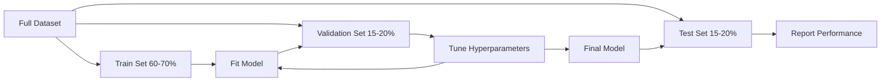

# Model Evaluation

> 模型的好坏取决于您衡量它的方式。

** 类型：** 构建
** 语言：** Python
** 先决条件：** 第1阶段（ML的概率和分布、统计数据），第2阶段课程1-8
** 时间：** ~90分钟

## Learning Objectives

- 从头开始实施K折叠和分层K折叠交叉验证，并解释为什么分层对不平衡数据很重要
- 从头开始计算精度、召回率、F1、AUC-ROC和回归指标（SSE、RSSE、MAE、R平方）
- 解释学习曲线以诊断模型是否存在高偏差或高方差
- 识别常见的评估错误，包括数据泄露、错误的指标选择和测试集污染

## The Problem

你训练了一个模特。它对您的数据有95%的准确性。好吗？

也许吧也许不是如果95%的数据属于一个类，那么总是预测该类的模型将获得95%的准确率，而完全无用。如果你对训练过的相同数据进行评估，那么95%这个数字是没有意义的，因为模型只是记住了答案。如果您的数据集有时间分量，并且您在拆分之前随机洗牌，则您的模型可能正在使用未来数据来预测过去。

模型评估是大多数ML项目出错的地方。错误的指标会让糟糕的模型看起来很好。错误的分割会让模特作弊。错误的比较会让你选择更差的模型。正确的评估不是可选的。这是在生产中工作的模型和在看到真实数据时失败的模型之间的区别。

## The Concept

### Train, Validation, Test



三次分裂，三个目的：

- ** 训练集 **：模型从此数据中学习。它在培训过程中看到了这些例子。
- ** 验证集 **：用于调整超参数并在模型之间进行选择。该模型从不根据这些数据进行训练，但您的决策会受到它的影响。
- ** 测试集 **：在最后仅触摸一次，以报告最终性能。如果您查看测试性能，然后回去更改您的模型，那么它将不再是测试集。它已成为第二个验证集。

测试集是您的持久保证，即报告的性能反映了模型在真正未见数据上的表现。

### K-Fold Cross-Validation

对于较小的数据集，单个训练/验证拆分会浪费数据并给出有噪音的估计。K-fold交叉验证使用所有数据进行训练和验证：

```mermaid
flowchart TB
    subgraph Fold1["Fold 1"]
        direction LR
        V1["Val"] --- T1a["Train"] --- T1b["Train"] --- T1c["Train"] --- T1d["Train"]
    end
    subgraph Fold2["Fold 2"]
        direction LR
        T2a["Train"] --- V2["Val"] --- T2b["Train"] --- T2c["Train"] --- T2d["Train"]
    end
    subgraph Fold3["Fold 3"]
        direction LR
        T3a["Train"] --- T3b["Train"] --- V3["Val"] --- T3c["Train"] --- T3d["Train"]
    end
    subgraph Fold4["Fold 4"]
        direction LR
        T4a["Train"] --- T4b["Train"] --- T4c["Train"] --- V4["Val"] --- T4d["Train"]
    end
    subgraph Fold5["Fold 5"]
        direction LR
        T5a["Train"] --- T5b["Train"] --- T5c["Train"] --- T5d["Train"] --- V5["Val"]
    end
    Fold1 --> R["Average scores"]
    Fold2 --> R
    Fold3 --> R
    Fold4 --> R
    Fold5 --> R
```



1. 将数据拆分为K个等大小的折痕
2. 对于每个折痕，在K-1折痕上训练并在剩余折痕上验证
3. 平均K验证分数

K=5或K=10是标准选择。每个数据点仅用于验证一次。平均分是比任何单一分裂更稳定的估计。

** 分层K折叠 **：保留每个折叠中的班级分布。如果您的数据集为70% A类和30% B类，则每个折叠的比例大致相同。这对于不平衡的数据集很重要，随机拆分可能会将所有少数族裔样本放在一个折叠中。

### Classification Metrics

** 混乱矩阵 **：基础。对于二进制分类：

|  | 预测的肯定 | 预测阴性 |
|--|---|---|
| 实际上积极 | 真阳性（TP） | 假阴性（FN） |
| 实际上存在负 | 假阳性（FP） | 真阴性（TN） |

根据此矩阵，所有其他指标如下：

- ** 准确度 ** =（TP + TN）/（TP + TN + FP + FN）。正确预测的分数。在阶级不平衡的时候误导。
- ** 精度 ** = TP /（TP + FP）。在所有预测积极的事情中，有多少实际上是积极的？当误报成本高昂时使用（例如，垃圾邮件过滤器将真实电子邮件标记为垃圾邮件）。
- ** 回忆 **（灵敏度）= TP /（TP + FN）。在所有实际的积极因素中，我们抓住了多少？当假阴性成本高昂时使用（例如，癌症筛查缺失肿瘤）。
- **F1得分 ** = 2 * 精确度 * 召回/（精确度+召回）。精确度和召回率的调和平均值。当两者都不明显占主导地位时，平衡两者。
- **AUC-ROC**：接受者工作特征曲线下面积。绘制不同分类阈值下的真阳性率与假阳性率。UC = 0.5意味着随机猜测，UC = 1.0意味着完美分离。独立于阈值：无论您选择的阈值如何，它衡量模型将积极因素与消极因素进行排名。

### Regression Metrics

- ** SSE **（均方误差）=平均值（（y_true - y_pred）#2）。对大错误进行二次惩罚。对异常值敏感。
- ** RSSE **（均方误差）= SQRT（SSE）。与目标变量相同的单位。比SSE更容易解释。
- **MAE**（平均绝对误差）=平均值（|y_true - y_pred|).线性处理所有错误。比SSE对离群值更稳健。
- ** R平方 ** = 1 - SS_res / SS_tot，其中SS_res = sum（（y_true - y_pred）#2），SS_tot = sum（（y_true - y_mean）#2）。模型解释的方差分数。R#2 = 1.0是完美的。R#2 = 0.0意味着模型并不比总是预测平均值更好。如果模型比平均值更差，R#2可能为负。

### Learning Curves

将训练和验证分数绘制为训练集大小的函数：

- ** 高偏差（欠匹配）**：两条曲线都收敛到低分。添加更多数据无济于事。您需要一个更复杂的模型。
- ** 高方差（过适应）**：训练分数很高，但验证分数要低得多。他们之间的差距很大。添加更多数据应该会有所帮助。

### Validation Curves

将训练和验证分数绘制为超参数的函数：

- 在低复杂性下：两个分数都很低（不适合）
- 在适当的复杂性下：两个分数都很高且接近
- 在高复杂性下：训练分数保持很高，但验证分数下降（过度匹配）

最佳超参数值是验证分数达到峰值的地方。

### Common Evaluation Mistakes

** 数据泄漏 **：来自测试集的信息泄漏到训练中。例子：使用从目标派生的特征，在拆分之前在完整数据集上安装缩放器，包括时间序列预测中的未来数据。始终先拆分，然后进行预处理。

** 班级失衡 **：99%的交易是合法的，1%是欺诈的。总是预测“合法”的模型具有99%的准确率。改用精确度、召回、F1或AUC-ROC。

** 指标错误 **：当你应该优化召回率（医学诊断）时优化准确性，或者当你的数据有严重的离群值时优化RMSE（使用MAE代替）。

** 不使用分层拆分 **：对于不平衡的数据，随机拆分可能会将很少的少数样本放入验证文件中，从而给出不稳定的估计。

** 测试太频繁 **：每次您查看测试性能并进行调整时，您都会过度适应测试集。该测试集为一次性使用。

## Build It

### Step 1: Train/validation/test split

```python
import random
import math


def train_val_test_split(X, y, train_ratio=0.6, val_ratio=0.2, seed=42):
    random.seed(seed)
    n = len(X)
    indices = list(range(n))
    random.shuffle(indices)

    train_end = int(n * train_ratio)
    val_end = int(n * (train_ratio + val_ratio))

    train_idx = indices[:train_end]
    val_idx = indices[train_end:val_end]
    test_idx = indices[val_end:]

    X_train = [X[i] for i in train_idx]
    y_train = [y[i] for i in train_idx]
    X_val = [X[i] for i in val_idx]
    y_val = [y[i] for i in val_idx]
    X_test = [X[i] for i in test_idx]
    y_test = [y[i] for i in test_idx]

    return X_train, y_train, X_val, y_val, X_test, y_test
```

### Step 2: K-fold and stratified K-fold cross-validation

```python
def kfold_split(n, k=5, seed=42):
    random.seed(seed)
    indices = list(range(n))
    random.shuffle(indices)

    fold_size = n // k
    folds = []

    for i in range(k):
        start = i * fold_size
        end = start + fold_size if i < k - 1 else n
        val_idx = indices[start:end]
        train_idx = indices[:start] + indices[end:]
        folds.append((train_idx, val_idx))

    return folds


def stratified_kfold_split(y, k=5, seed=42):
    random.seed(seed)

    class_indices = {}
    for i, label in enumerate(y):
        class_indices.setdefault(label, []).append(i)

    for label in class_indices:
        random.shuffle(class_indices[label])

    folds = [{"train": [], "val": []} for _ in range(k)]

    for label, indices in class_indices.items():
        fold_size = len(indices) // k
        for i in range(k):
            start = i * fold_size
            end = start + fold_size if i < k - 1 else len(indices)
            val_part = indices[start:end]
            train_part = indices[:start] + indices[end:]
            folds[i]["val"].extend(val_part)
            folds[i]["train"].extend(train_part)

    return [(f["train"], f["val"]) for f in folds]


def cross_validate(X, y, model_fn, k=5, metric_fn=None, stratified=False):
    n = len(X)

    if stratified:
        folds = stratified_kfold_split(y, k)
    else:
        folds = kfold_split(n, k)

    scores = []
    for train_idx, val_idx in folds:
        X_train = [X[i] for i in train_idx]
        y_train = [y[i] for i in train_idx]
        X_val = [X[i] for i in val_idx]
        y_val = [y[i] for i in val_idx]

        model = model_fn()
        model.fit(X_train, y_train)
        predictions = [model.predict(x) for x in X_val]

        if metric_fn:
            score = metric_fn(y_val, predictions)
        else:
            score = sum(1 for yt, yp in zip(y_val, predictions) if yt == yp) / len(y_val)
        scores.append(score)

    return scores
```

### Step 3: Confusion matrix and classification metrics

```python
def confusion_matrix(y_true, y_pred):
    tp = sum(1 for yt, yp in zip(y_true, y_pred) if yt == 1 and yp == 1)
    tn = sum(1 for yt, yp in zip(y_true, y_pred) if yt == 0 and yp == 0)
    fp = sum(1 for yt, yp in zip(y_true, y_pred) if yt == 0 and yp == 1)
    fn = sum(1 for yt, yp in zip(y_true, y_pred) if yt == 1 and yp == 0)
    return tp, tn, fp, fn


def accuracy(y_true, y_pred):
    tp, tn, fp, fn = confusion_matrix(y_true, y_pred)
    total = tp + tn + fp + fn
    return (tp + tn) / total if total > 0 else 0.0


def precision(y_true, y_pred):
    tp, tn, fp, fn = confusion_matrix(y_true, y_pred)
    return tp / (tp + fp) if (tp + fp) > 0 else 0.0


def recall(y_true, y_pred):
    tp, tn, fp, fn = confusion_matrix(y_true, y_pred)
    return tp / (tp + fn) if (tp + fn) > 0 else 0.0


def f1_score(y_true, y_pred):
    p = precision(y_true, y_pred)
    r = recall(y_true, y_pred)
    return 2 * p * r / (p + r) if (p + r) > 0 else 0.0


def roc_curve(y_true, y_scores):
    thresholds = sorted(set(y_scores), reverse=True)
    tpr_list = []
    fpr_list = []

    total_positives = sum(y_true)
    total_negatives = len(y_true) - total_positives

    for threshold in thresholds:
        y_pred = [1 if s >= threshold else 0 for s in y_scores]
        tp = sum(1 for yt, yp in zip(y_true, y_pred) if yt == 1 and yp == 1)
        fp = sum(1 for yt, yp in zip(y_true, y_pred) if yt == 0 and yp == 1)

        tpr = tp / total_positives if total_positives > 0 else 0.0
        fpr = fp / total_negatives if total_negatives > 0 else 0.0

        tpr_list.append(tpr)
        fpr_list.append(fpr)

    return fpr_list, tpr_list, thresholds


def auc_roc(y_true, y_scores):
    fpr_list, tpr_list, _ = roc_curve(y_true, y_scores)

    pairs = sorted(zip(fpr_list, tpr_list))
    fpr_sorted = [p[0] for p in pairs]
    tpr_sorted = [p[1] for p in pairs]

    area = 0.0
    for i in range(1, len(fpr_sorted)):
        width = fpr_sorted[i] - fpr_sorted[i - 1]
        height = (tpr_sorted[i] + tpr_sorted[i - 1]) / 2
        area += width * height

    return area
```

### Step 4: Regression metrics

```python
def mse(y_true, y_pred):
    n = len(y_true)
    return sum((yt - yp) ** 2 for yt, yp in zip(y_true, y_pred)) / n


def rmse(y_true, y_pred):
    return math.sqrt(mse(y_true, y_pred))


def mae(y_true, y_pred):
    n = len(y_true)
    return sum(abs(yt - yp) for yt, yp in zip(y_true, y_pred)) / n


def r_squared(y_true, y_pred):
    mean_y = sum(y_true) / len(y_true)
    ss_res = sum((yt - yp) ** 2 for yt, yp in zip(y_true, y_pred))
    ss_tot = sum((yt - mean_y) ** 2 for yt in y_true)
    if ss_tot == 0:
        return 0.0
    return 1.0 - ss_res / ss_tot
```

### Step 5: Learning curves

```python
def learning_curve(X, y, model_fn, metric_fn, train_sizes=None, val_ratio=0.2, seed=42):
    random.seed(seed)
    n = len(X)
    indices = list(range(n))
    random.shuffle(indices)

    val_size = int(n * val_ratio)
    val_idx = indices[:val_size]
    pool_idx = indices[val_size:]

    X_val = [X[i] for i in val_idx]
    y_val = [y[i] for i in val_idx]

    if train_sizes is None:
        train_sizes = [int(len(pool_idx) * r) for r in [0.1, 0.2, 0.4, 0.6, 0.8, 1.0]]

    train_scores = []
    val_scores = []

    for size in train_sizes:
        subset = pool_idx[:size]
        X_train = [X[i] for i in subset]
        y_train = [y[i] for i in subset]

        model = model_fn()
        model.fit(X_train, y_train)

        train_pred = [model.predict(x) for x in X_train]
        val_pred = [model.predict(x) for x in X_val]

        train_scores.append(metric_fn(y_train, train_pred))
        val_scores.append(metric_fn(y_val, val_pred))

    return train_sizes, train_scores, val_scores
```

### Step 6: A simple classifier for testing, plus the full demo

```python
class SimpleLogistic:
    def __init__(self, lr=0.1, epochs=100):
        self.lr = lr
        self.epochs = epochs
        self.weights = None
        self.bias = 0.0

    def sigmoid(self, z):
        z = max(-500, min(500, z))
        return 1.0 / (1.0 + math.exp(-z))

    def fit(self, X, y):
        n_features = len(X[0])
        self.weights = [0.0] * n_features
        self.bias = 0.0

        for _ in range(self.epochs):
            for xi, yi in zip(X, y):
                z = sum(w * x for w, x in zip(self.weights, xi)) + self.bias
                pred = self.sigmoid(z)
                error = yi - pred
                for j in range(n_features):
                    self.weights[j] += self.lr * error * xi[j]
                self.bias += self.lr * error

    def predict_proba(self, x):
        z = sum(w * xi for w, xi in zip(self.weights, x)) + self.bias
        return self.sigmoid(z)

    def predict(self, x):
        return 1 if self.predict_proba(x) >= 0.5 else 0


class SimpleLinearRegression:
    def __init__(self, lr=0.001, epochs=200):
        self.lr = lr
        self.epochs = epochs
        self.weights = None
        self.bias = 0.0

    def fit(self, X, y):
        n_features = len(X[0])
        self.weights = [0.0] * n_features
        self.bias = 0.0
        n = len(X)

        for _ in range(self.epochs):
            for xi, yi in zip(X, y):
                pred = sum(w * x for w, x in zip(self.weights, xi)) + self.bias
                error = yi - pred
                for j in range(n_features):
                    self.weights[j] += self.lr * error * xi[j] / n
                self.bias += self.lr * error / n

    def predict(self, x):
        return sum(w * xi for w, xi in zip(self.weights, x)) + self.bias


def standardize(values):
    n = len(values)
    mean = sum(values) / n
    var = sum((v - mean) ** 2 for v in values) / n
    std = math.sqrt(var) if var > 0 else 1.0
    return [(v - mean) / std for v in values], mean, std


def make_classification_data(n=300, seed=42):
    random.seed(seed)
    X = []
    y = []
    for _ in range(n):
        x1 = random.gauss(0, 1)
        x2 = random.gauss(0, 1)
        label = 1 if (x1 + x2 + random.gauss(0, 0.5)) > 0 else 0
        X.append([x1, x2])
        y.append(label)
    return X, y


def make_regression_data(n=200, seed=42):
    random.seed(seed)
    X = []
    y = []
    for _ in range(n):
        x1 = random.uniform(0, 10)
        x2 = random.uniform(0, 5)
        target = 3 * x1 + 2 * x2 + random.gauss(0, 2)
        X.append([x1, x2])
        y.append(target)
    return X, y


def make_imbalanced_data(n=300, minority_ratio=0.05, seed=42):
    random.seed(seed)
    X = []
    y = []
    for _ in range(n):
        if random.random() < minority_ratio:
            x1 = random.gauss(3, 0.5)
            x2 = random.gauss(3, 0.5)
            label = 1
        else:
            x1 = random.gauss(0, 1)
            x2 = random.gauss(0, 1)
            label = 0
        X.append([x1, x2])
        y.append(label)
    return X, y


if __name__ == "__main__":
    X_clf, y_clf = make_classification_data(300)

    print("=== Train/Validation/Test Split ===")
    X_train, y_train, X_val, y_val, X_test, y_test = train_val_test_split(X_clf, y_clf)
    print(f"  Train: {len(X_train)}, Val: {len(X_val)}, Test: {len(X_test)}")
    print(f"  Train class distribution: {sum(y_train)}/{len(y_train)} positive")
    print(f"  Val class distribution: {sum(y_val)}/{len(y_val)} positive")

    model = SimpleLogistic(lr=0.1, epochs=200)
    model.fit(X_train, y_train)

    print("\n=== Classification Metrics ===")
    y_pred = [model.predict(x) for x in X_test]
    tp, tn, fp, fn = confusion_matrix(y_test, y_pred)
    print(f"  Confusion matrix: TP={tp}, TN={tn}, FP={fp}, FN={fn}")
    print(f"  Accuracy:  {accuracy(y_test, y_pred):.4f}")
    print(f"  Precision: {precision(y_test, y_pred):.4f}")
    print(f"  Recall:    {recall(y_test, y_pred):.4f}")
    print(f"  F1 Score:  {f1_score(y_test, y_pred):.4f}")

    y_scores = [model.predict_proba(x) for x in X_test]
    auc = auc_roc(y_test, y_scores)
    print(f"  AUC-ROC:   {auc:.4f}")

    print("\n=== K-Fold Cross-Validation (K=5) ===")
    cv_scores = cross_validate(
        X_clf, y_clf,
        model_fn=lambda: SimpleLogistic(lr=0.1, epochs=200),
        k=5,
        metric_fn=accuracy,
    )
    mean_cv = sum(cv_scores) / len(cv_scores)
    std_cv = math.sqrt(sum((s - mean_cv) ** 2 for s in cv_scores) / len(cv_scores))
    print(f"  Fold scores: {[round(s, 4) for s in cv_scores]}")
    print(f"  Mean: {mean_cv:.4f} (+/- {std_cv:.4f})")

    print("\n=== Stratified K-Fold Cross-Validation (K=5) ===")
    strat_scores = cross_validate(
        X_clf, y_clf,
        model_fn=lambda: SimpleLogistic(lr=0.1, epochs=200),
        k=5,
        metric_fn=accuracy,
        stratified=True,
    )
    strat_mean = sum(strat_scores) / len(strat_scores)
    strat_std = math.sqrt(sum((s - strat_mean) ** 2 for s in strat_scores) / len(strat_scores))
    print(f"  Fold scores: {[round(s, 4) for s in strat_scores]}")
    print(f"  Mean: {strat_mean:.4f} (+/- {strat_std:.4f})")

    print("\n=== Imbalanced Data: Why Accuracy Lies ===")
    X_imb, y_imb = make_imbalanced_data(300, minority_ratio=0.05)
    positives = sum(y_imb)
    print(f"  Class distribution: {positives} positive, {len(y_imb) - positives} negative ({positives/len(y_imb)*100:.1f}% positive)")

    always_negative = [0] * len(y_imb)
    print(f"  Always-negative baseline:")
    print(f"    Accuracy:  {accuracy(y_imb, always_negative):.4f}")
    print(f"    Precision: {precision(y_imb, always_negative):.4f}")
    print(f"    Recall:    {recall(y_imb, always_negative):.4f}")
    print(f"    F1 Score:  {f1_score(y_imb, always_negative):.4f}")

    X_tr_i, y_tr_i, X_v_i, y_v_i, X_te_i, y_te_i = train_val_test_split(X_imb, y_imb)
    model_imb = SimpleLogistic(lr=0.5, epochs=500)
    model_imb.fit(X_tr_i, y_tr_i)
    y_pred_imb = [model_imb.predict(x) for x in X_te_i]
    print(f"\n  Trained model on imbalanced data:")
    print(f"    Accuracy:  {accuracy(y_te_i, y_pred_imb):.4f}")
    print(f"    Precision: {precision(y_te_i, y_pred_imb):.4f}")
    print(f"    Recall:    {recall(y_te_i, y_pred_imb):.4f}")
    print(f"    F1 Score:  {f1_score(y_te_i, y_pred_imb):.4f}")

    print("\n=== Regression Metrics ===")
    X_reg, y_reg = make_regression_data(200)

    col0 = [x[0] for x in X_reg]
    col1 = [x[1] for x in X_reg]
    col0_s, m0, s0 = standardize(col0)
    col1_s, m1, s1 = standardize(col1)
    X_reg_scaled = [[col0_s[i], col1_s[i]] for i in range(len(X_reg))]

    X_tr_r, y_tr_r, X_v_r, y_v_r, X_te_r, y_te_r = train_val_test_split(X_reg_scaled, y_reg)
    reg_model = SimpleLinearRegression(lr=0.01, epochs=500)
    reg_model.fit(X_tr_r, y_tr_r)
    y_pred_r = [reg_model.predict(x) for x in X_te_r]

    print(f"  MSE:       {mse(y_te_r, y_pred_r):.4f}")
    print(f"  RMSE:      {rmse(y_te_r, y_pred_r):.4f}")
    print(f"  MAE:       {mae(y_te_r, y_pred_r):.4f}")
    print(f"  R-squared: {r_squared(y_te_r, y_pred_r):.4f}")

    mean_baseline = [sum(y_tr_r) / len(y_tr_r)] * len(y_te_r)
    print(f"\n  Mean baseline:")
    print(f"    MSE:       {mse(y_te_r, mean_baseline):.4f}")
    print(f"    R-squared: {r_squared(y_te_r, mean_baseline):.4f}")

    print("\n=== Learning Curve ===")
    sizes, train_sc, val_sc = learning_curve(
        X_clf, y_clf,
        model_fn=lambda: SimpleLogistic(lr=0.1, epochs=200),
        metric_fn=accuracy,
    )
    print(f"  {'Size':>6} {'Train':>8} {'Val':>8}")
    for s, tr, va in zip(sizes, train_sc, val_sc):
        print(f"  {s:>6} {tr:>8.4f} {va:>8.4f}")

    print("\n=== Statistical Model Comparison ===")
    model_a_scores = cross_validate(
        X_clf, y_clf,
        model_fn=lambda: SimpleLogistic(lr=0.1, epochs=100),
        k=5, metric_fn=accuracy,
    )
    model_b_scores = cross_validate(
        X_clf, y_clf,
        model_fn=lambda: SimpleLogistic(lr=0.1, epochs=500),
        k=5, metric_fn=accuracy,
    )
    diffs = [a - b for a, b in zip(model_a_scores, model_b_scores)]
    mean_diff = sum(diffs) / len(diffs)
    std_diff = math.sqrt(sum((d - mean_diff) ** 2 for d in diffs) / len(diffs))
    t_stat = mean_diff / (std_diff / math.sqrt(len(diffs))) if std_diff > 0 else 0.0
    print(f"  Model A (100 epochs) mean: {sum(model_a_scores)/len(model_a_scores):.4f}")
    print(f"  Model B (500 epochs) mean: {sum(model_b_scores)/len(model_b_scores):.4f}")
    print(f"  Mean difference: {mean_diff:.4f}")
    print(f"  Paired t-statistic: {t_stat:.4f}")
    print(f"  (|t| > 2.78 for significance at p<0.05 with df=4)")
```

## Use It

通过scikit-learn，评估被内置到工作流程中：

```python
from sklearn.model_selection import cross_val_score, StratifiedKFold, learning_curve
from sklearn.metrics import (
    accuracy_score, precision_score, recall_score, f1_score,
    roc_auc_score, confusion_matrix, mean_squared_error, r2_score,
)
from sklearn.linear_model import LogisticRegression

model = LogisticRegression()
scores = cross_val_score(model, X, y, cv=StratifiedKFold(5), scoring="f1")
```

从头开始的版本准确地展示了交叉验证的作用（没有魔法，只是循环和索引跟踪）、如何计算每个指标（只计算TP/FP/TN/FN）以及为什么分层很重要（在每个折叠中保留类别比）。库版本添加了并行性、更多评分选项以及与管道的集成。

## Ship It

本课产生：
- '输出/skill-evaluation.md '-涵盖分类和回归模型评估策略的技能

## Exercises

1. 实现精确率-召回率曲线：绘制不同阈值下的精确率与召回率。计算平均精密度（PR曲线下面积）。比较PR曲线与不平衡数据集上的ROC曲线，并解释两者何时更有信息量。
2. 构建一个嵌套的交叉验证循环：外循环评估模型性能，内循环调整超参数。使用它可以公平地比较两个模型，而不会将验证数据泄露到评估中。
3. 实施模型比较的排列测试：洗牌标签、重新训练和衡量性能。重复100次以构建空分布。根据此分布计算观察到的模型性能的p值。

## Key Terms

| Term | 别人怎么说 | 它实际上意味着什么 |
|------|----------------|----------------------|
| 过拟合 | “简化训练数据” | 该模型捕获训练数据中的噪音，在训练中表现良好，但在未见数据中表现不佳 |
| 交叉验证 | “对不同子集进行测试” | 系统地轮换使用哪一部分数据进行验证，对所有轮换的结果求平均 |
| 精度 | “有多少预测的阳性是正确的” | TP /（TP + FP）：实际上是积极的积极预测的比例 |
| 召回 | “我们发现了多少实际的积极因素” | TP /（TP + FN）：正确识别的实际阳性分数 |
| AUC-ROC | “该模型如何很好地区分阶级” | 所有阈值下真阳性率与假阳性率的曲线下面积，从0.5（随机）到1.0（完美） |
| r平方 | “解释了多少差异” | 1 -（剩余平方和/总平方和）：模型捕获的目标方差的分数 |
| 数据泄露 | “模特作弊了” | 在训练期间使用预测时无法获得的信息，从而实现乐观的评估 |
| 学习曲线 | “性能如何随着更多数据而变化” | 训练和验证分数与训练集大小的图表，揭示了不足或过度适合 |
| 分层分裂 | “保持班级比例平衡” | 拆分数据，以便每个子集在每个类中的比例与完整数据集相同 |

## Further Reading

- [scikit-learn模型选择指南]（https：//scikit-learn.org/stable/model_selection.html）-关于交叉验证、指标和超参数调优的全面参考
- [超越准确性：精确与召回（Google ML速成课程）]（https：//developers.google.com/machine-learning/crash-course/classification/precision-and-recall）-具有交互式示例的清晰解释
- [交叉验证程序调查（Arlot & Celisse，2010）]（https：//projecteuclid.org/journals/Atlantics-surveillance/Volume-4/issue-one/A-surveillance-of-cross-validation-Procedures-for-model-selection/10.1214/09-SS054.full）-严格处理不同简历策略何时以及为何有效
