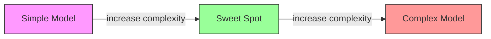
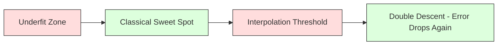
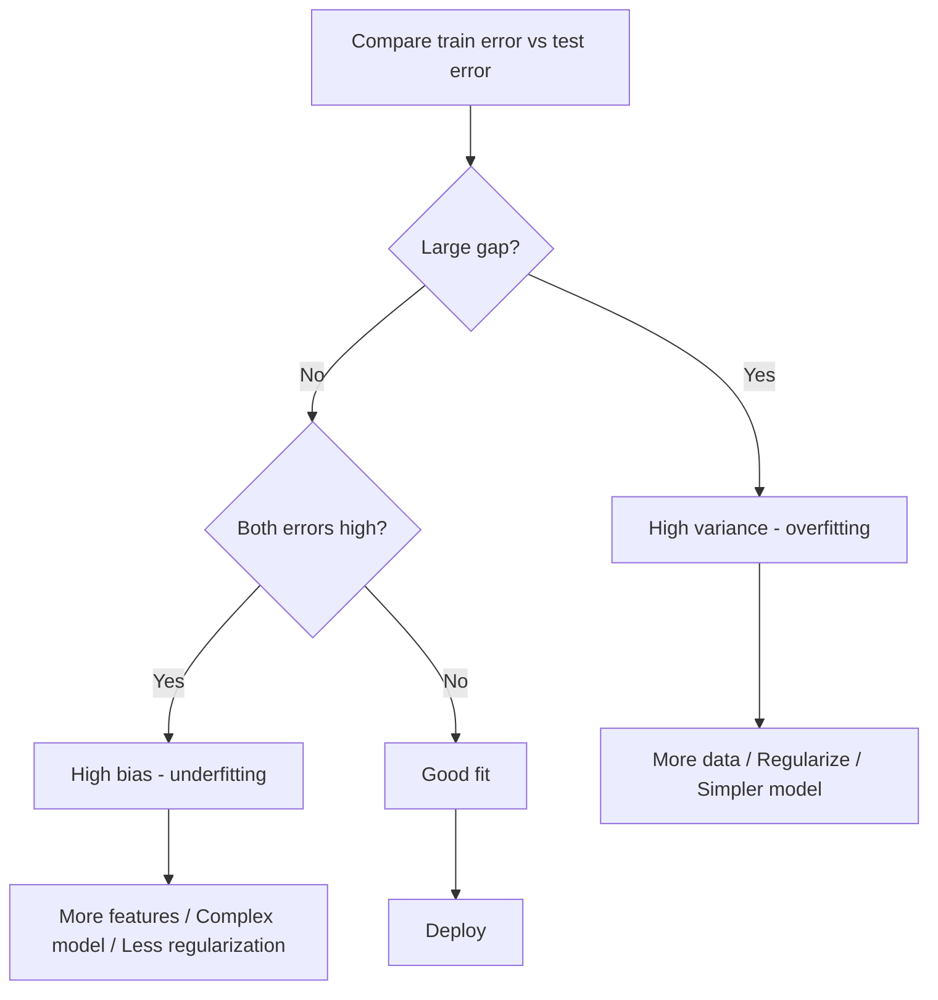
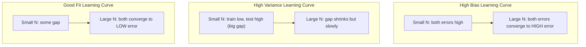
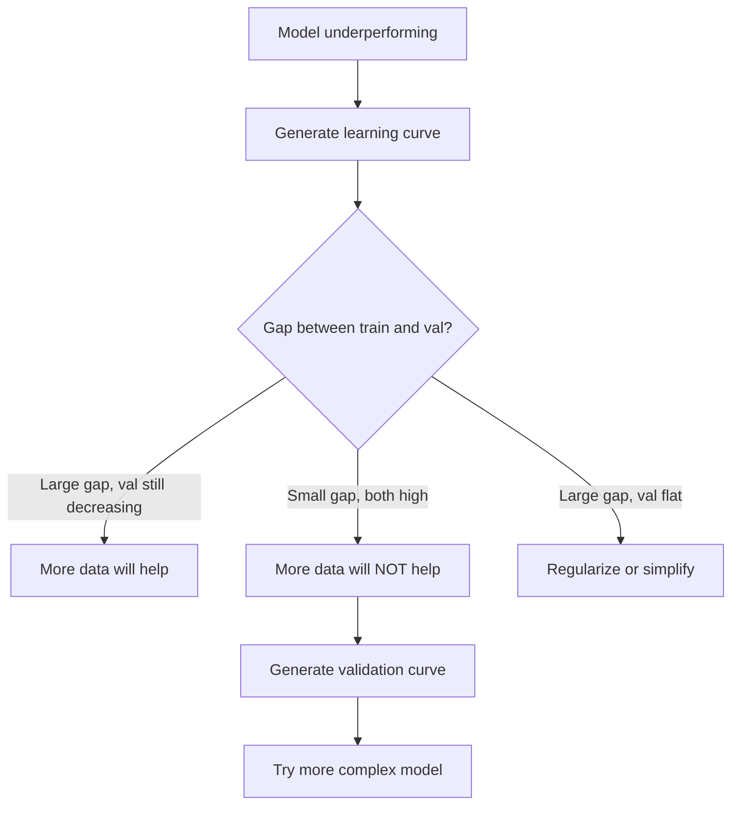

# バイアス-分散トレードオフ

> すべてのモデル誤差は、バイアス、分散、ノイズのいずれかから生まれます。制御できるのは最初の 2 つだけです。

**種類:** Learn
**言語:** Python
**前提:** Phase 2, Lessons 01-09 (ML basics, regression, classification, evaluation)
**時間:** 約75分

## 学習目標

- 期待予測誤差のバイアス-分散分解を導出し、既約ノイズの役割を説明する
- training error と test error のパターンから、モデルが high bias または high variance に苦しんでいるか診断する
- regularization 手法（L1、L2、dropout、early stopping）が bias と variance をどうトレードオフするか説明する
- 複雑さが増すモデル群に対して、バイアス-分散トレードオフを可視化する実験を実装する

## 問題

モデルを学習しました。test data 上で誤差があります。その誤差はどこから来るのでしょうか？

モデルが単純すぎる場合（曲線データに linear regression を当てるなど）、真のパターンを一貫して外します。これが bias です。モデルが複雑すぎる場合（15 個のデータ点に 20 次多項式を当てるなど）、training data には完璧に合いますが、新しいデータでは予測が大きくぶれます。これが variance です。

固定されたモデル容量では、両方を同時に最小化することはできません。bias を下げると variance が上がります。variance を下げると bias が上がります。このトレードオフを理解することは、機械学習で最も役に立つ診断スキルです。モデルをより複雑にするべきか、単純にするべきか、より多くのデータを集めるべきか、より良い特徴量を作るべきか、regularization を強めるべきか弱めるべきかを教えてくれます。

## コンセプト

### Bias: 系統的誤差

Bias は、モデルの平均予測が真の値からどれだけ離れているかを測ります。同じ分布から引いた多くの異なる training set で同じモデルを学習し、その予測を平均したとき、bias はその平均と真値の差です。

High bias は、モデルが硬すぎて実際のパターンを捉えられないことを意味します。放物線に直線を当てはめると、どれだけ多くのデータを与えても曲線を外します。これが underfitting です。

```
High bias (underfitting):
  Model always predicts roughly the same wrong thing.
  Training error: HIGH
  Test error: HIGH
  Gap between them: SMALL
```

### Variance: Training Data への感度

Variance は、異なるデータ部分集合で学習したときに予測がどれだけ変わるかを測ります。training set の小さな変化がモデルの大きな変化を引き起こすなら、variance は高いです。

High variance は、モデルが training data 内のノイズに合っており、背後にある信号に合っていないことを意味します。20 次多項式はすべての training point を通りますが、その間で激しく振動します。これが overfitting です。

```
High variance (overfitting):
  Model fits training data perfectly but fails on new data.
  Training error: LOW
  Test error: HIGH
  Gap between them: LARGE
```

### 分解

任意の点 x について、二乗損失のもとでの期待予測誤差は正確に次のように分解できます。

```
Expected Error = Bias^2 + Variance + Irreducible Noise

where:
  Bias^2   = (E[f_hat(x)] - f(x))^2
  Variance = E[(f_hat(x) - E[f_hat(x)])^2]
  Noise    = E[(y - f(x))^2]             (sigma^2)
```

- `f(x)` は真の関数です
- `f_hat(x)` はモデルの予測です
- `E[...]` は異なる training set にわたる期待値です
- `y` は観測されたラベル（真の関数にノイズを加えたもの）です

ノイズ項は既約です。ノイズを含むデータでは、どんなモデルも sigma^2 より良くはなれません。あなたの仕事は、bias^2 と variance の適切なバランスを見つけることです。

### モデル複雑度と誤差



古典的な U 字型の曲線です。

| 複雑度 | Bias | Variance | 総誤差 |
|-----------|------|----------|-------------|
| 低すぎる | HIGH | LOW | HIGH (underfitting) |
| ちょうど良い | MODERATE | MODERATE | LOWEST |
| 高すぎる | LOW | HIGH | HIGH (overfitting) |

### Bias-Variance 制御としての Regularization

Regularization は、variance を下げるために意図的に bias を増やします。モデルに制約をかけ、ノイズを追いかけられないようにします。

- **L2 (Ridge):** すべての重みをゼロに近づけます。すべての特徴量を残しつつ、その影響を弱めます。
- **L1 (Lasso):** 一部の重みを正確にゼロにします。feature selection を行います。
- **Dropout:** 学習中に neuron をランダムに無効化します。冗長な表現を強制します。
- **Early stopping:** モデルが training data に完全に合う前に学習を止めます。

regularization strength（lambda、dropout rate、epoch 数）は、バイアス-分散曲線上の位置を直接制御します。regularization を強めるほど bias は増え、variance は減ります。

### Double Descent: 現代的な見方

古典理論では、sweet spot を越えると、複雑さを増すほど必ず悪化するとされます。しかし 2019 年以降の研究は、予想外の現象を示しました。モデル容量を interpolation threshold（モデルが training data を完璧に当てはめるのに十分なパラメータを持つ地点）よりはるかに増やし続けると、test error は再び下がることがあります。



この「double descent」現象は、training example よりはるかに多いパラメータを持つ巨大な overparameterized neural network が、それでもうまく汎化する理由を説明します。古典的なバイアス-分散トレードオフは間違いではありませんが、現代的な領域では不完全です。

Double descent に関する重要な観察:
- linear model、decision tree、neural network で起きる
- interpolation 領域では、データを増やすことが実際には悪化につながる場合がある（sample-wise double descent）
- 学習 epoch を増やすことでも起きる場合がある（epoch-wise double descent）
- regularization はピークをなだらかにするが、消し去るわけではない

なぜこれが起きるのでしょうか。interpolation threshold では、モデルはすべての training point を当てはめるのにちょうど十分な容量を持っています。すべての点を通る非常に特定の解に押し込まれ、データの小さな揺らぎが fit の大きな変化を引き起こします。ここで variance がピークになります。threshold を越えると、データを完璧に当てはめる解が多数存在します。学習アルゴリズム（例: implicit regularization を伴う gradient descent）は、その中で最も単純な解を選ぶ傾向があります。この単純な解への implicit bias が、overparameterized model が汎化する理由です。

| 領域 | Parameters と Samples | 挙動 |
|--------|----------------------|----------|
| Underparameterized | p << n | 古典的なトレードオフが当てはまる |
| Interpolation threshold | p ~ n | variance がピークになり、test error が跳ね上がる |
| Overparameterized | p >> n | implicit regularization が働き、test error が下がる |

実務上は、neural network や大規模な tree ensemble を使っているなら interpolation threshold で止めないでください。十分に下に留まる（明示的な regularization を使う）か、十分に先まで進みます。最悪なのは threshold ちょうどにいることです。

### モデルを診断する



| 症状 | 診断 | 対処 |
|---------|-----------|-----|
| train error が高く、test error も高い | Bias | 特徴量を増やす、複雑なモデルを使う、regularization を弱める |
| train error が低く、test error が高い | Variance | データを増やす、regularization、より単純なモデル、dropout |
| train error が低く、test error も低い | Good fit | そのまま進める |
| train error が下がり、test error が上がっている | Overfitting 進行中 | Early stopping |

### 実践的な戦略

**bias が問題の場合:**
- polynomial feature や interaction feature を追加する
- より柔軟なモデルを使う（linear の代わりに tree ensemble など）
- regularization strength を下げる
- まだ収束していないなら、より長く学習する

**variance が問題の場合:**
- training data を増やす
- bagging を使う（Random Forest）
- regularization を強める（より高い lambda、より多い dropout）
- feature selection を行う（ノイズの多い特徴量を取り除く）
- cross-validation を使って早期に検出する

### Ensemble Method と Variance Reduction

Ensemble method は、variance と戦うための最も実用的な道具です。

**Bagging (Bootstrap Aggregating)** は、training data の異なる bootstrap sample 上で複数のモデルを学習し、その予測を平均します。個々のモデルは high variance でも、平均ははるかに低い variance を持ちます。Random Forest は decision tree に bagging を適用したものです。

数学的に機能する理由は、variance sigma^2 を持つ独立した予測 N 個を平均すると、平均の variance は sigma^2 / N になるからです。モデル同士は完全には独立していません（似たデータを見ているため）ので、削減量は 1/N より小さくなりますが、それでも大きな効果があります。

**Boosting** はモデルを逐次的に構築し、新しい各モデルがこれまでの ensemble の誤差に注目することで bias を減らします。主な例は Gradient Boosting と AdaBoost です。モデルを増やしすぎると boosting は overfit するため、early stopping や regularization が必要です。

| 手法 | 主な効果 | Bias の変化 | Variance の変化 |
|--------|---------------|-------------|-----------------|
| Bagging | variance を減らす | 変化なし | 減少 |
| Boosting | bias を減らす | 減少 | 増えることがある |
| Stacking | 両方を減らす | meta-learner に依存 | base model に依存 |
| Dropout | 暗黙的な bagging | わずかに増加 | 減少 |

**実践ルール:** base model が high variance（deep tree、high-degree polynomial）なら bagging を使います。base model が high bias（shallow stump、simple linear model）なら boosting を使います。

### Learning Curve

Learning curve は、training set size の関数として training error と validation error をプロットします。これは最も実用的な診断ツールです。単一の train/test 比較とは違い、learning curve はモデルの軌跡を示し、データを増やすことが役立つかを教えてくれます。



読み方:

| シナリオ | Training Error | Validation Error | Gap | 意味 | 対処 |
|----------|---------------|-----------------|-----|---------------|------------|
| High bias | 高い | 高い | 小さい | モデルがパターンを捉えられない | 特徴量を増やす、複雑なモデル、regularization を弱める |
| High variance | 低い | 高い | 大きい | モデルが training data を暗記している | データを増やす、regularization、より単純なモデル |
| Good fit | 中程度 | 中程度 | 小さい | モデルがよく汎化している | そのまま進める |
| High variance, improving | 低い | データ増加で低下 | 縮小 | データで直せる variance 問題 | データをさらに集める |
| High bias, flat | 高い | 高く平坦 | 小さく平坦 | データを増やしても役に立たない | model architecture を変える |

重要な洞察は、両方の曲線が plateau し、gap が小さいのに両方の error が高いなら、データを増やしても無駄だということです。より良いモデルが必要です。gap が大きく、まだ縮んでいるなら、データを増やすことが役に立ちます。

### Learning Curve の生成方法

2 つのアプローチがあります。

**アプローチ 1: training set size を変え、model は固定する。** モデルと hyperparameter を一定に保ちます。training data のサイズを段階的に増やしながら学習します。各サイズで training error と validation error を測ります。これが標準的な learning curve です。

**アプローチ 2: model complexity を変え、data は固定する。** データを一定に保ちます。複雑さのパラメータ（polynomial degree、tree depth、layer 数）を sweep します。各複雑度で training error と validation error を測ります。これは validation curve であり、バイアス-分散トレードオフを直接示します。

2 つのアプローチは互いに補完します。1 つ目は、データを増やすことが役立つかを教えます。2 つ目は、別のモデルが役立つかを教えます。次の一手を決める前に両方を実行してください。



## 作る

`code/bias_variance.py` のコードは、完全なバイアス-分散分解実験を実行します。手順は次の通りです。

### Step 1: 既知の関数から合成データを生成する

Gaussian noise を加えた `f(x) = sin(1.5x) + 0.5x` を使います。真の関数が分かっているため、正確な bias と variance を計算できます。

```python
def true_function(x):
    return np.sin(1.5 * x) + 0.5 * x

def generate_data(n_samples=30, noise_std=0.5, x_range=(-3, 3), seed=None):
    rng = np.random.RandomState(seed)
    x = rng.uniform(x_range[0], x_range[1], n_samples)
    y = true_function(x) + rng.normal(0, noise_std, n_samples)
    return x, y
```

### Step 2: Bootstrap Sampling と Polynomial Fitting

各 polynomial degree について、多数の bootstrap training set を引き、polynomial を fit し、固定された test grid 上の予測を記録します。これにより、各 test point における予測の分布が得られます。

```python
def fit_polynomial(x_train, y_train, degree, lam=0.0):
    X = np.column_stack([x_train ** d for d in range(degree + 1)])
    if lam > 0:
        penalty = lam * np.eye(X.shape[1])
        penalty[0, 0] = 0
        w = np.linalg.solve(X.T @ X + penalty, X.T @ y_train)
    else:
        w = np.linalg.lstsq(X, y_train, rcond=None)[0]
    return w
```

200 個の異なる bootstrap sample に fit します。各 bootstrap sample は同じ背後の分布から引かれますが、含まれる点は異なります。

### Step 3: Bias^2 と Variance Decomposition を計算する

各 test point で 200 セットの予測があるため、定義から直接分解を計算できます。

```python
mean_pred = predictions.mean(axis=0)
bias_sq = np.mean((mean_pred - y_true) ** 2)
variance = np.mean(predictions.var(axis=0))
total_error = np.mean(np.mean((predictions - y_true) ** 2, axis=1))
```

- `mean_pred` は bootstrap sample から推定した E[f_hat(x)] です
- `bias_sq` は平均予測と真値の差の二乗です
- `variance` は bootstrap sample 全体における予測の平均的な広がりです
- `total_error` は bias^2 + variance + noise におおよそ等しくなるはずです

### Step 4: Learning Curve

Learning curve は、model complexity を固定したまま training set size を sweep します。モデルが data-limited なのか capacity-limited なのかを示します。

```python
def demo_learning_curves():
    sizes = [10, 15, 20, 30, 50, 75, 100, 150, 200, 300]
    degree = 5

    for n in sizes:
        train_errors = []
        test_errors = []
        for seed in range(50):
            x_train, y_train = generate_data(n_samples=n, seed=seed * 100)
            w = fit_polynomial(x_train, y_train, degree)
            train_pred = predict_polynomial(x_train, w)
            train_mse = np.mean((train_pred - y_train) ** 2)
            test_pred = predict_polynomial(x_test, w)
            test_mse = np.mean((test_pred - y_test) ** 2)
            train_errors.append(train_mse)
            test_errors.append(test_mse)
        # Average over runs gives the learning curve point
```

high-variance model（小さいデータに対する degree 5）では、次のようになります。
- training error は低く始まり、データが増えて暗記しにくくなるにつれて上がる
- test error は高く始まり、モデルがより多くの信号を得るにつれて下がる
- データが増えるにつれて gap が縮む

high-bias model（degree 1）では、両方の error がすぐ同じ高い値に収束し、データを増やしても役に立ちません。

### Step 5: Regularization Sweep

コードには `demo_regularization_sweep()` も含まれています。これは high-degree polynomial（degree 15）を固定し、Ridge regularization strength を 0.001 から 100 まで sweep します。これは、model complexity を変える代わりに制約の強さを変えて、別の角度からバイアス-分散トレードオフを示します。

```python
def demo_regularization_sweep():
    alphas = [0.001, 0.005, 0.01, 0.05, 0.1, 0.5, 1.0, 5.0, 10.0, 50.0, 100.0]
    for alpha in alphas:
        results = bias_variance_decomposition([15], lam=alpha)
        r = results[15]
        print(f"alpha={alpha:.3f}  bias={r['bias_sq']:.4f}  var={r['variance']:.4f}")
```

低い alpha では、degree-15 polynomial はほぼ制約されていません。モデルが各 bootstrap sample のノイズを追いかけるため、variance が支配的になります。高い alpha では、penalty が強すぎて、モデルは実質的にほぼ定数関数になります。bias が支配的になります。最適な alpha はこの両極端の間にあります。

これは polynomial degree を変えたときと同じ U-curve ですが、離散的なつまみではなく連続的なつまみで制御されています。実務では、feature set を変えずに細かく制御できるため、regularization がトレードオフ制御の好ましい方法です。

## 使う

sklearn は `learning_curve` と `validation_curve` を提供しており、bootstrap loop を書かなくてもこれらの診断を自動化できます。

### Validation Curve: Model Complexity を Sweep する

```python
from sklearn.model_selection import validation_curve
from sklearn.pipeline import make_pipeline
from sklearn.preprocessing import PolynomialFeatures
from sklearn.linear_model import Ridge

degrees = list(range(1, 16))
train_scores_all = []
val_scores_all = []

for d in degrees:
    pipe = make_pipeline(PolynomialFeatures(d), Ridge(alpha=0.01))
    train_scores, val_scores = validation_curve(
        pipe, X, y, param_name="polynomialfeatures__degree",
        param_range=[d], cv=5, scoring="neg_mean_squared_error"
    )
    train_scores_all.append(-train_scores.mean())
    val_scores_all.append(-val_scores.mean())
```

これにより、バイアス-分散トレードオフ曲線が直接得られます。validation score が train score に比べて最も悪いところでは variance が支配的です。両方が悪いところでは bias が支配的です。

### Learning Curve: Training Set Size を Sweep する

```python
from sklearn.model_selection import learning_curve

pipe = make_pipeline(PolynomialFeatures(5), Ridge(alpha=0.01))
train_sizes, train_scores, val_scores = learning_curve(
    pipe, X, y, train_sizes=np.linspace(0.1, 1.0, 10),
    cv=5, scoring="neg_mean_squared_error"
)
train_mse = -train_scores.mean(axis=1)
val_mse = -val_scores.mean(axis=1)
```

`train_mse` と `val_mse` を `train_sizes` に対してプロットします。形状がモデルについて必要なことをすべて教えてくれます。

### Regularization Sweep を使った Cross-Validation

```python
from sklearn.model_selection import cross_val_score

alphas = [0.001, 0.01, 0.1, 1.0, 10.0, 100.0]
for alpha in alphas:
    pipe = make_pipeline(PolynomialFeatures(10), Ridge(alpha=alpha))
    scores = cross_val_score(pipe, X, y, cv=5, scoring="neg_mean_squared_error")
    print(f"alpha={alpha:>7.3f}  MSE={-scores.mean():.4f} +/- {scores.std():.4f}")
```

これは固定された model complexity に対して regularization strength を sweep します。同じバイアス-分散トレードオフが見えます。低い alpha は high variance、高い alpha は high bias を意味します。

### すべてをまとめる: 完全な診断ワークフロー

実務では、これらの診断を順番に実行します。

1. モデルを学習する。train error と test error を計算する。
2. 両方が高い場合: bias 問題がある。step 4 に進む。
3. train が低く test が高い場合: variance 問題がある。データを増やすことが役立つか確認するため learning curve を生成する。役立たないなら regularize する。
4. 主要な complexity parameter を sweep する validation curve を生成する。sweet spot を見つける。
5. sweet spot で learning curve を生成する。gap がまだ大きいなら、より多くのデータまたは regularization が必要。
6. `cross_val_score` を使い、異なる alpha 値で Ridge/Lasso を試す。cross-validation error が最も低い alpha を選ぶ。

ほとんどの tabular dataset では 10-15 分の計算で済み、何時間もの推測を省けます。

## 成果物

このレッスンは `outputs/prompt-model-diagnostics.md` を生成します。

## 演習

1. `noise_std=0`（ノイズなし）で分解を実行してください。既約誤差項はどうなりますか？最適な複雑度は変わりますか？

2. training set size を 30 から 300 に増やしてください。variance component はどう変わりますか？最適な polynomial degree は移動しますか？

3. 実験に L2 regularization（Ridge regression）を追加してください。固定された high-degree polynomial（degree 15）について、lambda を 0 から 100 まで sweep します。lambda の関数として bias^2 と variance をプロットしてください。

4. 真の関数を polynomial から `sin(x)` に変更してください。バイアス-分散分解はどう変わりますか？明確な最適 degree はまだありますか？

5. 単純な bootstrap aggregating（bagging）wrapper を実装してください。bootstrap sample 上で 10 個のモデルを学習し、予測を平均します。bias をあまり増やさずに variance が下がることを示してください。

## 重要語句

| 用語 | よく言われること | 実際の意味 |
|------|----------------|----------------------|
| Bias | 「モデルが単純すぎる」 | 誤った仮定から生じる系統的誤差。平均的なモデル予測と真値の差。 |
| Variance | 「モデルが overfit している」 | training data への感度から生じる誤差。異なる training set 間で予測がどれだけ変わるか。 |
| Irreducible error | 「データ内のノイズ」 | 真のデータ生成過程におけるランダム性から生じる誤差。どんなモデルも消せない。 |
| Underfitting | 「十分に学習していない」 | モデルが high bias を持つ。training data 上でさえ実際のパターンを外す。 |
| Overfitting | 「データを暗記している」 | モデルが high variance を持つ。training data 内の汎化しないノイズに合っている。 |
| Regularization | 「モデルに制約をかける」 | model complexity を下げる penalty を追加し、bias と引き換えに variance を下げること。 |
| Double descent | 「パラメータを増やすと役立つ場合がある」 | model capacity が interpolation threshold を大きく超えると、test error が再び下がること。 |
| Model complexity | 「モデルがどれだけ柔軟か」 | 任意のパターンに fit するモデルの容量。architecture、features、regularization で制御される。 |

## 参考文献

- [Hastie, Tibshirani, Friedman: Elements of Statistical Learning, Ch. 7](https://hastie.su.domains/ElemStatLearn/) -- バイアス-分散分解の決定版
- [Belkin et al., Reconciling modern machine learning practice and the bias-variance trade-off (2019)](https://arxiv.org/abs/1812.11118) -- double descent の論文
- [Nakkiran et al., Deep Double Descent (2019)](https://arxiv.org/abs/1912.02292) -- epoch-wise と sample-wise の double descent
- [Scott Fortmann-Roe: Understanding the Bias-Variance Tradeoff](http://scott.fortmann-roe.com/docs/BiasVariance.html) -- 分かりやすい視覚的説明
