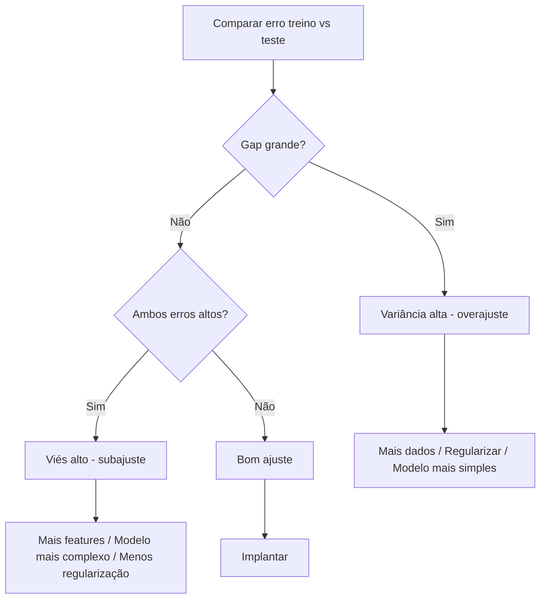
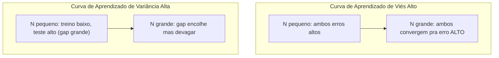

# Tradeoff Viés-Variância

> Todo erro de modelo vem de uma de três fontes: viés, variância ou ruído. Você só controla as duas primeiras.

**Tipo:** Learn
**Linguagens:** Python
**Pré-requisitos:** Fase 2, Aulas 01-09 (fundamentos de ML, regressão, classificação, avaliação)
**Tempo:** ~75 minutos

## Objetivos de Aprendizado

- Derivar a decomposição viés-variância do erro esperado de predição e explicar o papel do ruído irredutível
- Diagnosticar se um modelo sofre de viés alto ou variância alta usando padrões de erro de treino e teste
- Explicar como técnicas de regularização (L1, L2, dropout, early stopping) trocam viés por variância
- Implementar experimentos que visualizam o tradeoff viés-variância em modelos de complexidade crescente

## O Problema

Você treinou um modelo. Ele tem algum erro nos dados de teste. De onde vem esse erro?

Se seu modelo é simples demais (regressão linear num dataset curvo), ele vai consistentemente errar o padrão verdadeiro. Isso é viés. Se seu modelo é complexo demais (polinômio grau 20 em 15 pontos de dados), ele vai ajustar os dados de treino perfeitamente mas dar previsões completamente diferentes em dados novos. Isso é variância.

Você não pode minimizar ambos ao mesmo tempo para uma capacidade de modelo fixa. Empurre o viés pra baixo e a variância sobe. Empurre a variância pra baixo e o viés sobe.

## O Conceito

### Viés: Erro Sistemático

Viés mede o quão distante a previsão média do modelo está do valor verdadeiro.

```
Alto viés (subajuste):
  Modelo sempre prevê aproximadamente a mesma coisa errada.
  Erro de treino: ALTO
  Erro de teste: ALTO
  Gap entre eles: PEQUENO
```

### Variância: Sensibilidade aos Dados de Treino

Variância mede o quanto suas previsões mudam quando treina em subsets diferentes dos dados.

```
Alta variância (overajuste):
  Modelo ajusta dados de treino perfeitamente mas falha em dados novos.
  Erro de treino: BAIXO
  Erro de teste: ALTO
  Gap entre eles: GRANDE
```

### A Decomposição

```
Erro Esperado = Viés^2 + Variância + Ruído Irredutível
```

- O termo de ruído é irredutível. Nenhum modelo pode fazer melhor que sigma^2 em dados ruidosos.

### Complexidade do Modelo vs Erro


| Complexidade | Viés | Variância | Erro Total |
|-------------|------|-----------|------------|
| Muito baixa | ALTO | BAIXO | ALTO (subajuste) |
| Justa | MÉDIO | MÉDIO | MENOR |
| Muito alta | BAIXO | ALTO | ALTO (overajuste) |

### Regularização como Controle de Viés-Variância

Regularização aumenta deliberadamente viés pra reduzir variância.

- **L2 (Ridge):** Encolhe todos os pesos pra zero. Mantém todas features mas reduz influência.
- **L1 (Lasso):** Empurra alguns pesos exatamente pra zero. Faz seleção de features.
- **Dropout:** Desativa neurônios aleatoriamente durante treino.
- **Early stopping:** Para o treino antes do modelo ajustar completamente os dados de treino.

### Double Descent: A Perspectiva Moderna


Este fenômeno de "double descent" explica por que redes neurais massivamente superparametrizadas (com muito mais parâmetros que exemplos de treino) ainda generalizam bem.

| Regime | Parâmetros vs Amostras | Comportamento |
|--------|----------------------|---------------|
| Subparametrizado | p << n | Tradeoff clássico se aplica |
| Limiar de interpolação | p ~ n | Variância picos, erro de teste dispara |
| Superparametrizado | p >> n | Regularização implícita ativa, erro de teste cai |

### Diagnosticando Seu Modelo



| Sintoma | Diagnóstico | Correção |
|---------|-------------|----------|
| Erro treino alto, erro teste alto | Viés | Mais features, modelo mais complexo, menos regularização |
| Erro treino baixo, erro teste alto | Variância | Mais dados, regularização, modelo mais simples, dropout |
| Erro treino baixo, erro teste baixo | Bom ajuste | Implantar |
| Erro treino diminuindo, erro teste aumentando | Overajuste em andamento | Early stopping |

### Curvas de Aprendizado

As curvas de aprendizado são a ferramenta de diagnóstico mais prática.



## Construa

### Passo 1: Gere dados sintéticos de uma função conhecida

```python
def true_function(x):
    return np.sin(1.5 * x) + 0.5 * x

def generate_data(n_samples=30, noise_std=0.5, x_range=(-3, 3), seed=None):
    rng = np.random.RandomState(seed)
    x = rng.uniform(x_range[0], x_range[1], n_samples)
    y = true_function(x) + rng.normal(0, noise_std, n_samples)
    return x, y
```

### Passo 2: Amostragem bootstrap e ajuste polinomial

```python
def fit_polynomial(x_train, y_train, degree, lam=0.0):
    X = np.column_stack([x_train ** d for d in range(degree + 1)])
    if lam > 0:
        penalty = lam * np.eye(X.shape[1])
        penalty[0, 0] = 0
        w = np.linalg.solve(X.T @ X + penalty, X.T @ y_train)
    else:
        w = np.linalg.lstsq(X, y_train, rcond=None)[0]
    return w
```

### Passo 3: Calculando Decomposição Viés^2, Variância

```python
mean_pred = predictions.mean(axis=0)
bias_sq = np.mean((mean_pred - y_true) ** 2)
variance = np.mean(predictions.var(axis=0))
total_error = np.mean(np.mean((predictions - y_true) ** 2, axis=1))
```

## Use

sklearn fornece `learning_curve` e `validation_curve` pra automatizar esses diagnósticos.

```python
from sklearn.model_selection import validation_curve
from sklearn.pipeline import make_pipeline
from sklearn.preprocessing import PolynomialFeatures
from sklearn.linear_model import Ridge

degrees = list(range(1, 16))
for d in degrees:
    pipe = make_pipeline(PolynomialFeatures(d), Ridge(alpha=0.01))
    train_scores, val_scores = validation_curve(
        pipe, X, y, param_name="polynomialfeatures__degree",
        param_range=[d], cv=5, scoring="neg_mean_squared_error"
    )
```

## Exercícios

1. Rode a decomposição com `noise_std=0` (sem ruído). O que acontece com o termo de erro irredutível?
2. Aumente o tamanho do conjunto de treino de 30 para 300. Como isso afeta o componente de variância?
3. Adicione regularização L2 (regressão Ridge) ao experimento. Para um polinômio de grau fixo alto (grau 15), varie lambda de 0 a 100.
4. Modifique a função verdadeira de um polinômio para `sin(x)`. Como muda a decomposição viés-variância?
5. Implemente um wrapper simples de bagging: treine 10 modelos em amostras bootstrap e médie as previsões.
