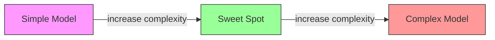
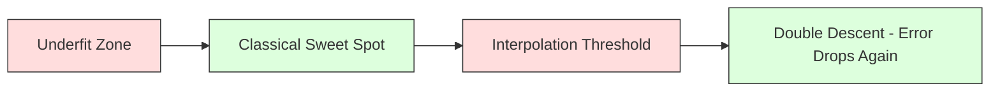
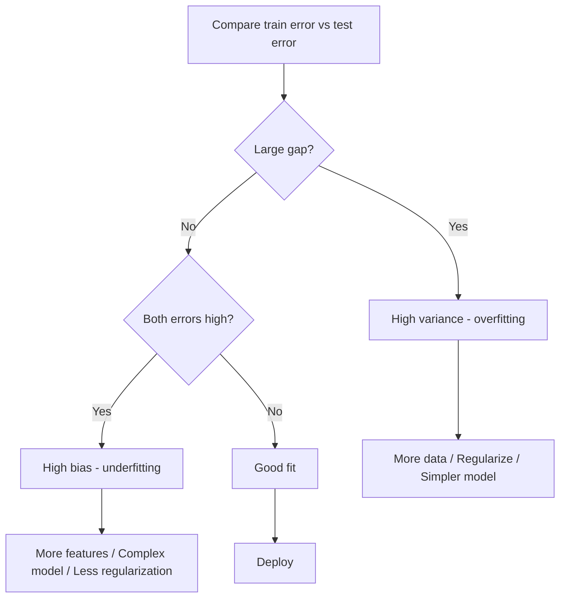
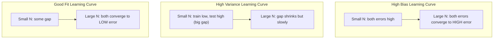
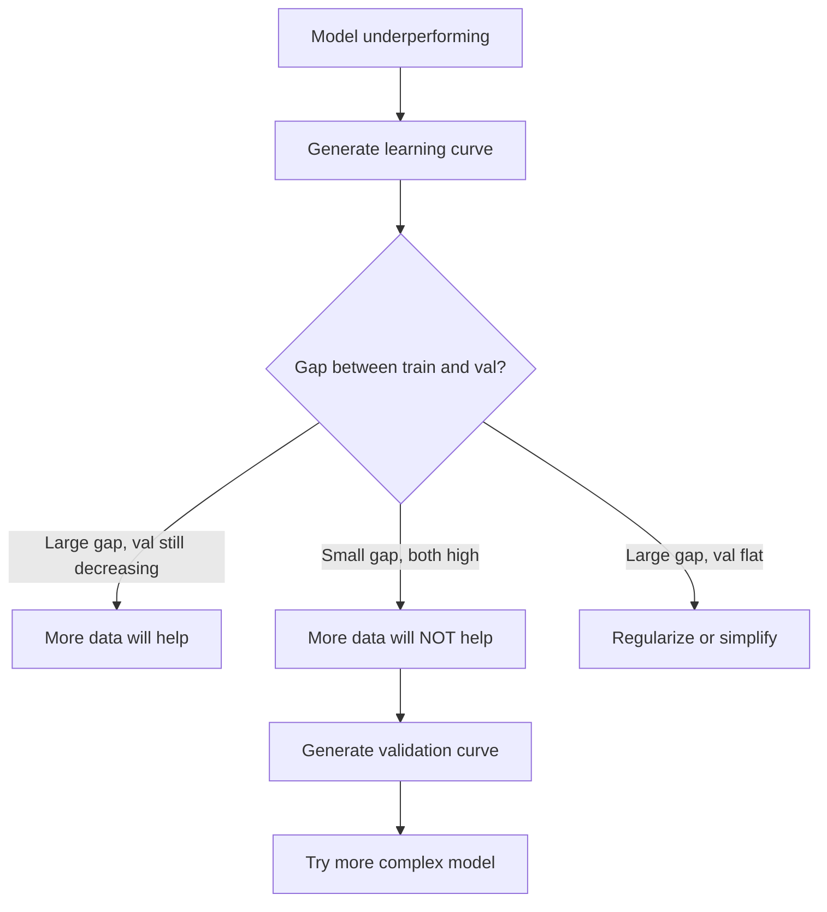

# Önyargı-Varyans Dengesi

> Her model hatası üç kaynaktan birinden gelir: yanlılık, varyans veya gürültü. Yalnızca ilk ikisini kontrol edebilirsiniz.

**Tür:** Öğren
**Dil:** Python
**Önkoşullar:** Aşama 2, Dersler 01-09 (ML temelleri, regresyon, sınıflandırma, değerlendirme)
**Süre:** ~75 dakika

## Öğrenme Hedefleri

- Beklenen tahmin hatasının yanlılık-varyans ayrıştırmasını türetin ve indirgenemez gürültünün rolünü açıklayın
- Eğitim ve test hata modellerini kullanarak bir modelin yüksek sapmadan mı yoksa yüksek varyanstan mı muzdarip olduğunu teşhis edin
- Düzenleme tekniklerinin (L1, L2, bırakma, erken durdurma) sapmayı varyansla nasıl değiştirdiğini açıklayın
- Artan karmaşıklığa sahip modeller arasında önyargı-varyans değişimini görselleştiren deneyler uygulayın

## Sorun

Bir model yetiştirdin. Test verilerinde bazı hatalar var. Bu hata nereden geliyor?

Modeliniz çok basitse (kavisli bir dataset üzerinde doğrusal regresyon), sürekli olarak gerçek modeli kaçıracaktır. Bu önyargıdır. Modeliniz çok karmaşıksa (15 veri noktasında 20 derecelik polinom), eğitim verilerine mükemmel şekilde uyacak ancak yeni veriler üzerinde son derece farklı tahminler verecektir. Bu varyanstır.

Sabit bir model kapasitesi için ikisini aynı anda küçültemezsiniz. Önyargıyı aşağı itin ve varyans artar. Varyansı aşağı ittiğinizde önyargı artar. Bu değiş tokuşu anlamak, machine learning'deki en kullanışlı teşhis becerisidir. Modelinizi daha karmaşık mı yoksa daha az karmaşık mı yapacağınızı, daha fazla veri mi alacağınızı yoksa daha iyi özellikler mi tasarlayacağınızı, daha fazla mı yoksa daha az mı düzenli hale getireceğinizi söyler.

## Konsept

### Önyargı: Sistematik Hata

Önyargı, modelinizin ortalama tahmininin gerçek değerden ne kadar uzakta olduğunu ölçer. Aynı modeli aynı dağılımdan alınan birçok farklı eğitim seti üzerinde eğittiyseniz ve tahminlerin ortalamasını aldıysanız önyargı, bu ortalama ile gerçek arasındaki boşluktur.

Yüksek önyargı, modelin gerçek modeli yakalayamayacak kadar katı olduğu anlamına gelir. Bir parabole sığdırılan düz bir çizgi, ona ne kadar veri verirseniz verin, her zaman eğriyi kaçıracaktır. Bu yetersiz bir durum.

```
High bias (underfitting):
  Model always predicts roughly the same wrong thing.
  Training error: HIGH
  Test error: HIGH
  Gap between them: SMALL
```

### Varyans: Eğitim Verilerine Duyarlılık

Varyans, farklı veri alt kümeleri üzerinde antrenman yaptığınızda tahminlerinizin ne kadar değiştiğini ölçer. Eğitim setindeki küçük değişiklikler modelde büyük değişikliklere neden oluyorsa varyans yüksektir.

Yüksek varyans, modelin temel sinyale değil eğitim verilerine gürültü uydurduğu anlamına gelir. Derece-20'lik bir polinom her eğitim noktasından geçecek, ancak aralarında çılgınca salınacaktır. Bu aşırı uygun.

```
High variance (overfitting):
  Model fits training data perfectly but fails on new data.
  Training error: LOW
  Test error: HIGH
  Gap between them: LARGE
```

### Ayrışma

Herhangi bir x noktası için, kare kaybı altında beklenen tahmin hatası tam olarak ayrışır:

```
Expected Error = Bias^2 + Variance + Irreducible Noise

where:
  Bias^2   = (E[f_hat(x)] - f(x))^2
  Variance = E[(f_hat(x) - E[f_hat(x)])^2]
  Noise    = E[(y - f(x))^2]             (sigma^2)
```

- `f(x)` gerçek fonksiyondur
- `f_hat(x)` modelinizin tahminidir
- `E[...]` farklı eğitim setlerinden beklentidir
- `y` gözlemlenen etikettir (gerçek işlev artı gürültü)

Gürültü terimi indirgenemez. Gürültülü verilerde hiçbir model sigma^2'den daha iyisini yapamaz. İşiniz önyargı^2 ile varyans arasında doğru dengeyi bulmaktır.

### Model Karmaşıklığı ve Hata



Klasik U şeklindeki eğri:

| Karmaşıklık | Önyargı | Varyans | Toplam Hata |
|-----------|------|----------|-------------|
| Çok düşük | YÜKSEK | DÜŞÜK | YÜKSEK (yetersiz uyum) |
| Tam olarak | ORTA | ORTA | EN DÜŞÜK |
| Çok yüksek | DÜŞÜK | YÜKSEK | YÜKSEK (aşırı uyum) |

### Önyargı-Varyans Kontrolü Olarak Düzenlileştirme

Düzenleme, varyansı azaltmak için kasıtlı olarak önyargıyı artırır. Modeli, gürültüyü takip edemeyecek şekilde kısıtlar.

- **L2 (Sırt):** Tüm ağırlıkları sıfıra doğru küçültür. Tüm özellikleri korur ancak etkilerini azaltır.
- **L1 (Kement):** Bazı ağırlıkları tam olarak sıfıra iter. Özellik seçimini gerçekleştirir.
- **Bırakma:** Eğitim sırasında nöronları rastgele devre dışı bırakır. Gereksiz temsilleri zorlar.
- **Erken durdurma:** Model, eğitim verilerine tam olarak uymadan önce eğitimi durdurur.

Düzenlileştirme gücü (lambda, bırakma oranı, dönem sayısı) önyargı-varyans eğrisinde nerede oturduğunuzu doğrudan kontrol eder. Daha fazla düzenleme, daha fazla önyargı, daha az varyans anlamına gelir.

### Çift İniş: Modern Perspektif

Klasik teori şunu söylüyor: Tatlı noktadan sonra daha fazla karmaşıklık her zaman zarar verir. Ancak 2019'dan bu yana yapılan araştırmalar beklenmedik bir şeyi gösterdi. Model kapasitesini enterpolasyon eşiğinin çok ötesine (modelin eğitim verilerine mükemmel uyum sağlamak için yeterli parametreye sahip olduğu) kadar arttırmaya devam ederseniz, test hatası tekrar azalabilir.



Bu "çift iniş" olgusu, neden büyük ölçüde aşırı parametrelendirilmiş neural network'lerin (eğitim örneklerinden çok daha fazla parametreye sahip) hala iyi bir şekilde genelleştirildiğini açıklıyor. Klasik önyargı-varyans değiş tokuşu yanlış değildir ancak modern rejim için eksiktir.

Çift inişle ilgili temel gözlemler:
- Doğrusal modellerde, karar ağaçlarında ve neural network'lerde gerçekleşir
- Enterpolasyon bölgesinde daha fazla veri aslında zarar verebilir (örnek bazında çift iniş)
- Daha fazla eğitim dönemi de buna neden olabilir (çağ bazında çift iniş)
- Düzenlileştirme zirveyi düzeltir ancak ortadan kaldırmaz

Bu neden oluyor? Enterpolasyon eşiğinde model, tüm eğitim noktalarına uymaya yetecek kapasiteye sahiptir. Her noktadan geçen çok özel bir çözüme zorlanır ve verilerdeki küçük bozulmalar uyumda büyük değişikliklere neden olur. Farklılığın zirve yaptığı yer burasıdır. Eşiği geçtikten sonra model, verilere mükemmel şekilde uyan birçok olası çözüme sahiptir. Öğrenme algoritması (e.g., örtülü düzenlemeyle gradient iniş) aralarında en basit olanı seçme eğilimindedir. Basit çözümlere yönelik bu örtülü önyargı, aşırı parametreli modellerin genelleştirilmesinin nedenidir.

| Rejim | Parametreler ve Örnekler | Davranış |
|--------|----------------------|----------|
| Yetersiz parametrelendirilmiş | p << n | Klasik ödünleşim geçerlidir |
| Enterpolasyon eşiği | p~n | Fark zirveleri, test hatalarında ani artışlar |
| Aşırı parametrelendirilmiş | p >> n | Örtük düzenleme devreye giriyor, test hataları düşüyor |

Pratik amaçlar için: neural network'leri veya büyük ağaç topluluklarını kullanıyorsanız enterpolasyon eşiğinde durmayın. Ya bunun çok altında kalın (açık bir düzenlemeyle) ya da onu çok iyi geçin. Olunacak en kötü yer eşiğin tam yanıdır.

### Modelinizi Teşhis Etme



| Belirti | Teşhis | Düzelt |
|---------|-----------|-----|
| Yüksek tren hatası, yüksek test hatası | Önyargı | Daha fazla özellik, karmaşık model, daha az düzenleme |
| Düşük tren hatası, yüksek test hatası | Varyans | Daha fazla veri, düzenleme, daha basit model, bırakma |
| Düşük tren hatası, düşük test hatası | İyi uyum | Gönderin |
| Tren hatası azalıyor, test hatası artıyor | Aşırı uyum devam ediyor | Erken durdurma |

### Pratik Stratejiler

**Sorun önyargı olduğunda:**
- Polinom veya etkileşim özellikleri ekleyin
- Daha esnek bir model kullanın (doğrusal yerine ağaç topluluğu)
- Düzenlileştirme gücünü azaltın
- Daha uzun süre eğitim alın (henüz bir araya gelmemişse)

**Sorun farklılık olduğunda:**
- Daha fazla eğitim verisi alın
- Torbalama kullanın (rastgele ormanlar)
- Düzenlemeyi artırın (daha yüksek lambda, daha fazla bırakma)
- Özellik seçimi (gürültülü özellikleri kaldırın)
- Erken tespit etmek için çapraz doğrulamayı kullanın

### Topluluk Yöntemleri ve Varyans Azaltma

Topluluk yöntemleri, varyansla mücadelede en pratik araçtır.

**Bagging (Bootstrap Aggregating)** birden fazla modeli eğitim verilerinin farklı önyükleme örnekleri üzerinde eğitir ve ardından tahminlerinin ortalamasını alır. Her bir modelin varyansı yüksektir, ancak ortalamanın varyansı çok daha düşüktür. Rastgele ormanlar karar ağaçlarına uygulanan torbalamadır.

Neden matematiksel olarak çalışıyor: Her birinin varyansı sigma^2 olan N bağımsız tahminin ortalamasını alırsanız, ortalamanın varyansı sigma^2 / N olur. Modeller gerçek anlamda bağımsız değildir (hepsi benzer verileri görür), dolayısıyla azalma 1/N'den azdır, ancak yine de önemlidir.

**Güçlendirme**, modelleri sırayla oluşturarak önyargıyı azaltır; burada her yeni model, topluluğun şu ana kadarki hatalarına odaklanır. Gradient artırma ve AdaBoost ana örneklerdir. Çok fazla model eklerseniz güçlendirme fazla sığabilir, bu nedenle erken durdurmanız veya düzenlemeniz gerekir.

| Yöntem | Birincil Etki | Önyargı Değişimi | Fark Değişimi |
|--------|---------------|-------------|-----------------|
| Torbalama | Farkı azaltır | Değişiklik yok | azalır |
| Artırma | Önyargıyı azaltır | azalır | Artabilir |
| İstifleme | Her ikisini de azaltır | Meta öğreniciye bağlıdır | Temel modellere bağlıdır |
| Bırakma | Örtülü torbalama | Hafif artış | azalır |

**Pratik kural:** Temel modelinizin varyansı yüksekse (derin ağaçlar, yüksek dereceli polinomlar), torbalamayı kullanın. Temel modelinizin önyargısı yüksekse (sığ kütükler, basit doğrusal modeller), yükseltmeyi kullanın.

### Öğrenme Eğrileri

Öğrenme eğrileri, eğitim seti boyutunun bir fonksiyonu olarak eğitim ve doğrulama hatasını çizer. Sahip olduğunuz en pratik teşhis aracıdırlar. Tek bir eğitim/test karşılaştırmasının aksine, öğrenme eğrileri size modelinizin gidişatını gösterir ve daha fazla verinin yardımcı olup olmayacağını söyler.



Bunları nasıl okuyabiliriz:

| Senaryo | Eğitim Hatası | Doğrulama Hatası | Boşluk | Ne Anlama Geliyor | Ne Yapmalı |
|----------|---------------|-----------------|-----|---------------|------------|
| Yüksek önyargı | Yüksek | Yüksek | Küçük | Model modeli yakalayamıyor | Daha fazla özellik, karmaşık model, daha az düzenleme |
| Yüksek varyans | Düşük | Yüksek | Büyük | Model, eğitim verilerini ezberler | Daha fazla veri, düzenleme, daha basit model |
| İyi uyum | Orta | Orta | Küçük | Model iyi genelliyor | Gönderin |
| Yüksek varyans, iyileştirme | Düşük | Daha fazla veriyle azalıyor | Küçülen | Verilerin düzeltebileceği sapma sorunu | Daha fazla veri toplayın |
| Yüksek önyargı, düz | Yüksek | Yüksek ve düz | Küçük ve düz | Daha fazla verinin faydası OLMAZ | Model mimarisini değiştirin |

Kritik içgörü: Eğer her iki eğri de sabitse ve fark küçükse ancak her iki hata da yüksekse, daha fazla veri işe yaramaz. Daha iyi bir modele ihtiyacınız var. Eğer fark büyükse ve hala daralmaya devam ediyorsa, daha fazla veri yardımcı olacaktır.

### Öğrenme Eğrileri Nasıl Oluşturulur

İki yaklaşım vardır:

**Yaklaşım 1: Eğitim seti boyutunu değiştirin, modeli sabitleyin.** Modeli ve hiperparametreleri sabit tutun. Eğitim verilerinin gittikçe büyüyen alt kümeleri üzerinde eğitim verin. Her boyutta eğitim hatasını ve doğrulama hatasını ölçün. Bu standart öğrenme eğrisidir.

**Yaklaşım 2: Model karmaşıklığını değiştirin, verileri sabitleyin.** Verileri sabit tutun. Bir karmaşıklık parametresini (polinom derecesi, ağaç derinliği, katman sayısı) tarayın. Her karmaşıklıktaki eğitim hatasını ve doğrulama hatasını ölçün. Bu bir doğrulama eğrisidir ve sapma-varyans değişimini doğrudan gösterir.

Her iki yaklaşım da birbirini tamamlamaktadır. İlki size daha fazla verinin yardımcı olup olmayacağını söyler. İkincisi size farklı bir modelin yardımcı olup olmayacağını söyler. Bir sonraki adımınız hakkında karar vermeden önce her ikisini de çalıştırın.



```figure
bias-variance
```

## İnşa Et

`code/bias_variance.py`'deki kod, tam yanlılık-varyans ayrıştırma deneyini çalıştırır. İşte adım adım yaklaşım.

### Adım 1: Bilinen Bir İşlevden Sentetik Veri Oluşturun

Gauss gürültüsüyle `f(x) = sin(1.5x) + 0.5x` kullanıyoruz. Gerçek işlevi bilmek, kesin sapmayı ve varyansı hesaplamamızı sağlar.

```python
def true_function(x):
    return np.sin(1.5 * x) + 0.5 * x

def generate_data(n_samples=30, noise_std=0.5, x_range=(-3, 3), seed=None):
    rng = np.random.RandomState(seed)
    x = rng.uniform(x_range[0], x_range[1], n_samples)
    y = true_function(x) + rng.normal(0, noise_std, n_samples)
    return x, y
```

### Adım 2: Önyükleme Örneklemesi ve Polinom Uydurma

Her polinom derecesi için birçok önyükleme eğitim seti çizeriz, polinomu yerleştiririz ve tahminleri sabit bir test ızgarasına kaydederiz. Bu bize her test noktasında tahminlerin bir dağılımını verir.

```python
def fit_polynomial(x_train, y_train, degree, lam=0.0):
    X = np.column_stack([x_train ** d for d in range(degree + 1)])
    if lam > 0:
        penalty = lam * np.eye(X.shape[1])
        penalty[0, 0] = 0
        w = np.linalg.solve(X.T @ X + penalty, X.T @ y_train)
    else:
        w = np.linalg.lstsq(X, y_train, rcond=None)[0]
    return w
```

200 farklı önyükleme örneğine uyuyoruz. Her önyükleme örneği aynı temel dağılımdan alınır ancak farklı noktalar içerir.

### Adım 3: Önyargı^2'nin Hesaplanması, Varyans Ayrışımı

Her test noktasındaki 200 tahmin seti ile ayrıştırmayı doğrudan tanımdan hesaplayabiliriz:

```python
mean_pred = predictions.mean(axis=0)
bias_sq = np.mean((mean_pred - y_true) ** 2)
variance = np.mean(predictions.var(axis=0))
total_error = np.mean(np.mean((predictions - y_true) ** 2, axis=1))
```

- `mean_pred`, önyükleme örneklerinden tahmin edilen E[f_hat(x)]'tir
- `bias_sq`, ortalama tahmin ile gerçek arasındaki kare farkıdır
- `variance`, önyükleme örnekleri arasındaki tahminlerin ortalama yayılımıdır
- `total_error` yaklaşık olarak önyargı^2 + varyans + gürültüye eşit olmalıdır

### Adım 4: Öğrenme Eğrileri

Öğrenme eğrileri, model karmaşıklığını sabit tutarken eğitim seti boyutunu tarar. Modelinizin veri sınırlı mı yoksa kapasite sınırlı mı olduğunu gösterirler.

```python
def demo_learning_curves():
    sizes = [10, 15, 20, 30, 50, 75, 100, 150, 200, 300]
    degree = 5

    for n in sizes:
        train_errors = []
        test_errors = []
        for seed in range(50):
            x_train, y_train = generate_data(n_samples=n, seed=seed * 100)
            w = fit_polynomial(x_train, y_train, degree)
            train_pred = predict_polynomial(x_train, w)
            train_mse = np.mean((train_pred - y_train) ** 2)
            test_pred = predict_polynomial(x_test, w)
            test_mse = np.mean((test_pred - y_test) ** 2)
            train_errors.append(train_mse)
            test_errors.append(test_mse)
        # Average over runs gives the learning curve point
```

Yüksek varyanslı bir model için (küçük verilerle derece 5) şunu görürsünüz:
- Eğitim hatası düşük başlar ve daha fazla veri ezberlemeyi zorlaştırdıkça artar
- Test hatası yüksek başlar ve model daha fazla sinyal aldıkça azalır
- Daha fazla veriyle aradaki fark küçülüyor

Yüksek sapmalı bir model için (derece 1), her iki hata da hızlı bir şekilde aynı yüksek değere yakınsar ve daha fazla veri yardımcı olmaz.

### Adım 5: Düzenlileştirme Taraması

Kod aynı zamanda yüksek dereceli bir polinomu (derece 15) sabitleyen ve Ridge düzenlileştirme gücünü 0,001'den 100'e kadar tarayan `demo_regularization_sweep()`'yi de içerir. Bu, yanlılık varyansı değişimini farklı bir açıdan gösterir: model karmaşıklığını değiştirmek yerine kısıtlama gücünü değiştiririz.

```python
def demo_regularization_sweep():
    alphas = [0.001, 0.005, 0.01, 0.05, 0.1, 0.5, 1.0, 5.0, 10.0, 50.0, 100.0]
    for alpha in alphas:
        results = bias_variance_decomposition([15], lam=alpha)
        r = results[15]
        print(f"alpha={alpha:.3f}  bias={r['bias_sq']:.4f}  var={r['variance']:.4f}")
```

Düşük alfada, derece-15 polinomu neredeyse sınırsızdır. Model her önyükleme örneğinde gürültüyü takip ettiğinden varyans hakimdir. Yüksek alfada ceza o kadar güçlüdür ki model etkin bir şekilde neredeyse sabit bir fonksiyon haline gelir. Önyargı hakimdir. Optimum alfa bu uç noktaların arasında yer alır.

Bu, değişen polinom derecelerinden gelen aynı U eğrisidir, ancak ayrık bir düğme yerine sürekli bir düğme tarafından kontrol edilir. Uygulamada, düzenlileştirme, özellik kümesini değiştirmeden ayrıntılı kontrole izin verdiğinden, ödünleşimi kontrol etmenin tercih edilen yoludur.

## Kullan onu

sklearn, önyükleme döngüleri yazmadan bu tanılamayı otomatikleştirmek için `learning_curve` ve `validation_curve` sağlar.

### Doğrulama Eğrisi: Tarama Modeli Karmaşıklığı

```python
from sklearn.model_selection import validation_curve
from sklearn.pipeline import make_pipeline
from sklearn.preprocessing import PolynomialFeatures
from sklearn.linear_model import Ridge

degrees = list(range(1, 16))
train_scores_all = []
val_scores_all = []

for d in degrees:
    pipe = make_pipeline(PolynomialFeatures(d), Ridge(alpha=0.01))
    train_scores, val_scores = validation_curve(
        pipe, X, y, param_name="polynomialfeatures__degree",
        param_range=[d], cv=5, scoring="neg_mean_squared_error"
    )
    train_scores_all.append(-train_scores.mean())
    val_scores_all.append(-val_scores.mean())
```

Bu size doğrudan önyargı-varyans değişim eğrisini verir. Doğrulama puanının tren puanına göre en kötü olduğu yerde varyans hakimdir. Her ikisinin de kötü olduğu yerde önyargı hakimdir.

### Öğrenme Eğrisi: Tarama Eğitim Seti Boyutu

```python
from sklearn.model_selection import learning_curve

pipe = make_pipeline(PolynomialFeatures(5), Ridge(alpha=0.01))
train_sizes, train_scores, val_scores = learning_curve(
    pipe, X, y, train_sizes=np.linspace(0.1, 1.0, 10),
    cv=5, scoring="neg_mean_squared_error"
)
train_mse = -train_scores.mean(axis=1)
val_mse = -val_scores.mean(axis=1)
```

`train_mse` ve `val_mse`'nin `train_sizes`'ye karşı grafiğini çizin. Şekil size modeliniz hakkında her şeyi anlatır.

### Düzenlileştirme Taraması ile Çapraz Doğrulama

```python
from sklearn.model_selection import cross_val_score

alphas = [0.001, 0.01, 0.1, 1.0, 10.0, 100.0]
for alpha in alphas:
    pipe = make_pipeline(PolynomialFeatures(10), Ridge(alpha=alpha))
    scores = cross_val_score(pipe, X, y, cv=5, scoring="neg_mean_squared_error")
    print(f"alpha={alpha:>7.3f}  MSE={-scores.mean():.4f} +/- {scores.std():.4f}")
```

Bu, sabit bir model karmaşıklığı için düzenleme gücünü ortadan kaldırır. Aynı önyargı-varyans değişimini göreceksiniz: düşük alfa, yüksek varyans anlamına gelir, yüksek alfa, yüksek önyargı anlamına gelir.

### Hepsini Bir Araya Getirmek: Eksiksiz Bir Teşhis İş Akışı

Pratikte bu teşhisleri sırayla çalıştırırsınız:

1. Modelinizi eğitin. Eğitim ve test hatasını hesaplayın.
2. Her ikisi de yüksekse: önyargı sorununuz var demektir. 4. adıma geçin.
3. Eğer tren düşük fakat test yüksekse: bir varyans sorununuz var demektir. Daha fazla verinin yardımcı olup olmayacağını görmek için bir öğrenme eğrisi oluşturun. Değilse, düzenlileştirin.
4. Ana karmaşıklık parametrenizi kapsayan bir doğrulama eğrisi oluşturun. Tatlı noktayı bulun.
5. Tatlı noktada bir öğrenme eğrisi oluşturun. Eğer boşluk hala büyükse, daha fazla veriye veya düzenlemeye ihtiyacınız var.
6. `cross_val_score` kullanarak Ridge/Lasso'yu farklı alfa değerleriyle deneyin. Çapraz doğrulanmış hatanın en düşük olduğu alfayı seçin.

Bu, tablo şeklindeki dataset'lerin çoğu için 10-15 dakikalık hesaplama gerektirir ve saatlerce tahmin yapmaktan tasarruf sağlar.

## Gönderin

Bu ders şunu üretir: `outputs/prompt-model-diagnostics.md`

## Egzersizler

1. Ayrıştırma işlemini `noise_std=0` ile çalıştırın (gürültü yok). İndirgenemez hata terimine ne olur? Optimum karmaşıklık değişiyor mu?

2. Eğitim seti boyutunu 30'dan 300'e çıkarın. Bu, varyans bileşenini nasıl etkiler? Optimum polinom derecesi değişiyor mu?

3. Deneye L2 düzenlileştirmesini (Ridge regresyonu) ekleyin. Sabit yüksek dereceli bir polinom için (derece 15), lambda'yı 0'dan 100'e kadar tarayın. Önyargı^2'yi ve varyansı lambda'nın fonksiyonları olarak çizin.

4. Gerçek fonksiyonu bir polinomdan `sin(x)` olarak değiştirin. Önyargı-varyans ayrıştırması nasıl değişir? Hala net bir optimal derece var mı?

5. Basit bir önyükleme toplama (torbalama) sarmalayıcısı uygulayın: önyükleme örnekleri ve ortalama tahminler üzerinde 10 model eğitin. Bunun önyargıyı fazla artırmadan varyansı azalttığını gösterin.

## Anahtar Terimler

| Dönem | İnsanlar ne diyor | Aslında ne anlama geliyor |
|------|----------------|----------------------|
| Önyargı | "Model çok basit" | Yanlış varsayımlardan kaynaklanan sistematik hata. Ortalama model tahmini ile gerçek arasındaki boşluk. |
| Varyans | "Model gereğinden fazla uyuyor" | Eğitim verilerine duyarlılıktan kaynaklanan hata. Farklı eğitim setlerinde tahminlerin ne kadar değiştiği. |
| İndirgenemez hata | "Verilerde gürültü" | Gerçek veri oluşturma sürecindeki rastgelelikten kaynaklanan hata. Hiçbir model bunu ortadan kaldıramaz. |
| Yetersiz uyum | "Yeterince öğrenmiyorum" | Model yüksek önyargıya sahiptir. Eğitim verilerinde bile gerçek modeli kaçırıyor. |
| Aşırı uyum | "Verilerin hafızaya alınması" | Modelin varyansı yüksektir. Genellemeyen eğitim verilerine gürültüyü sığdırır. |
| Düzenleme | "Modeli kısıtlama" | Model karmaşıklığını azaltmak için bir ceza eklemek, daha düşük varyans için önyargıyı değiştirmek. |
| Çift iniş | "Daha fazla parametre yardımcı olabilir" | Model kapasitesi enterpolasyon eşiğini çok aştığında test hatası tekrar azalır. |
| Model karmaşıklığı | "Model ne kadar esnek" | Bir modelin rastgele kalıplara uyma kapasitesi. Mimari, özellikler veya düzenleme tarafından kontrol edilir. |

## Daha Fazla Okuma

- [Hastie, Tibshirani, Friedman: İstatistiksel Öğrenmenin Unsurları, Bölüm. 7](https://hastie.su.domains/ElemStatLearn/) -- yanlılık-varyans ayrıştırmasının kesin tedavisi
- [Belkin ve diğerleri, Modern machine learning uygulamasını ve önyargılı varyans değişimini uzlaştırmak (2019)](https://arxiv.org/abs/1812.11118) -- çift iniş makalesi
- [Nakkiran ve diğerleri, Derin Çift İniş (2019)](https://arxiv.org/abs/1912.02292) -- çağ bazında ve örnek bazında çift iniş
- [Scott Fortmann-Roe: Önyargı-Varyans Dengesini Anlamak](http://scott.fortmann-roe.com/docs/BiasVariance.html) -- anlaşılır görsel açıklama
