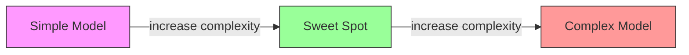
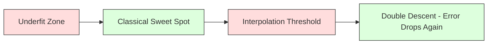
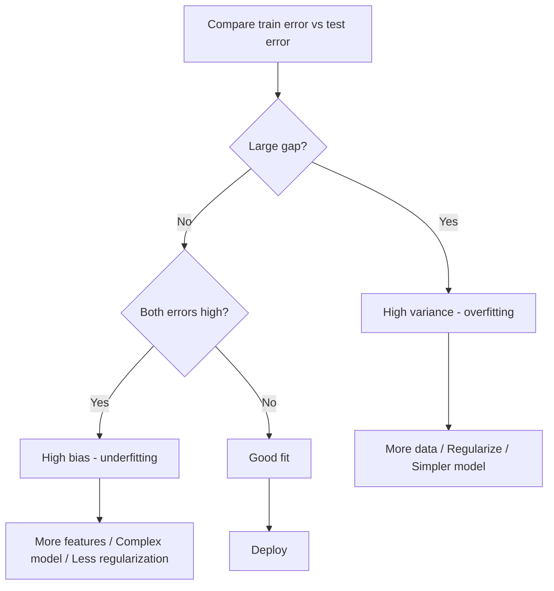
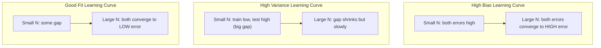
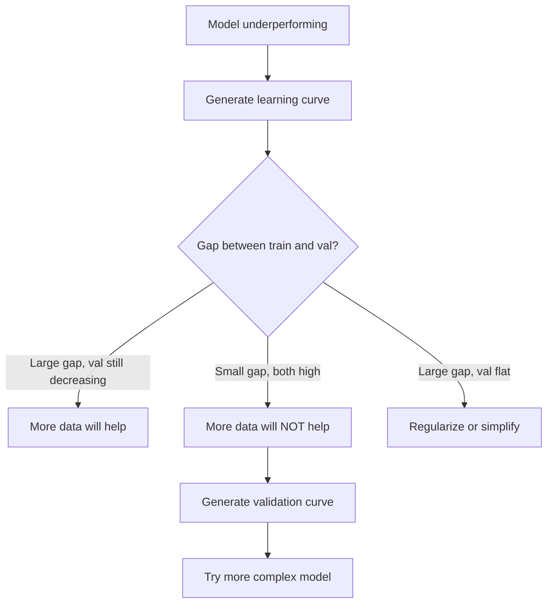

# Bias-Variance Tradeoff

> 每个模型误差都来自三个来源之一：偏差、方差或噪音。您只能控制前两个。

** 类型：** 学习
** 语言：** Python
** 先决条件：** 第2阶段，课程01-09（ML基础知识、回归、分类、评估）
** 时间：** ~75分钟

## Learning Objectives

- 推导出预期预测误差的偏差方差分解并解释不可约噪音的作用
- 使用训练和测试错误模式诊断模型是否存在高偏差或高方差
- 解释正规化技术（L1、L2、退出、提前停止）如何用偏差换取方差
- 实施实验，可视化复杂性不断增加的模型之间的偏差-方差权衡

## The Problem

你训练了一个模特。测试数据存在一些错误。这个错误从何而来？

如果您的模型太简单（曲线数据集上的线性回归），它将始终错过真实的模式。这就是偏见。如果您的模型太复杂（15个数据点上的20次多项），它将完全适合训练数据，但对新数据给出截然不同的预测。这就是方差。

对于固定的型号容量，您无法同时最小化两者。将偏差向下推，方差就会上升。降低方差，偏差就会上升。理解这种权衡是机器学习中最有用的诊断技能。它告诉您是让模型变得更复杂还是更不复杂，是获取更多数据还是设计更好的功能，是更多还是更少地规则化。

## The Concept

### Bias: Systematic Error

偏差衡量模型的平均预测与真实值的偏差有多远。如果您在从相同分布中提取的许多不同训练集上训练相同的模型，并对预测进行平均，那么偏差就是平均值和真相之间的差距。

高偏差意味着模型过于僵化，无法捕捉真实的模式。无论您提供多少数据，与曲线相匹配的直线总是会错过曲线。这是欠匹配的。

```
High bias (underfitting):
  Model always predicts roughly the same wrong thing.
  Training error: HIGH
  Test error: HIGH
  Gap between them: SMALL
```

### Variance: Sensitivity to Training Data

方差衡量的是当你在不同的数据子集上训练时，你的预测会发生多大的变化。如果训练集中的小变化导致模型中的大变化，则方差很高。

高方差意味着模型正在适应训练数据中的噪音，而不是基础信号。一个20次的多元性将穿过每个训练点，但在它们之间剧烈波动。这太合适了。

```
High variance (overfitting):
  Model fits training data perfectly but fails on new data.
  Training error: LOW
  Test error: HIGH
  Gap between them: LARGE
```

### The Decomposition

对于任何点x，平方损失下的预期预测误差精确分解：

```
Expected Error = Bias^2 + Variance + Irreducible Noise

where:
  Bias^2   = (E[f_hat(x)] - f(x))^2
  Variance = E[(f_hat(x) - E[f_hat(x)])^2]
  Noise    = E[(y - f(x))^2]             (sigma^2)
```

- ' f（x）'是真函数
- ' f_hat（x）'是模型的预测
- ' E[..]'是对不同训练集的期望
- “y”是观察到的标签（真实函数加噪音）

噪音项是不可简化的。没有模型能比西格玛' 2更好地处理有噪数据。您的工作是找到偏差' 2和方差之间的正确平衡。

### Model Complexity vs Error



经典的U形曲线：

| 复杂性 | 偏置 | 方差 | 总误差 |
|-----------|------|----------|-------------|
| 太低 | 高 | 低 | 高（不足） |
| 恰到好处 | 中度 | 中度 | 最低 |
| 太高 | 低 | 高 | 高（过度贴合） |

### Regularization as Bias-Variance Control

规则化故意增加偏差以减少方差。它约束模型，因此无法追逐噪音。

- **L2（山脊）：** 将所有权重收缩至零。保留所有功能，但减少其影响。
- **L1（Lasso）：** 将某些权重精确推至零。执行功能选择。
- ** 辍学：** 训练期间随机禁用神经元。强制冗余表示。
- ** 提前停止：** 在模型完全符合训练数据之前停止训练。

正则化强度（lambda，dropout rate，epochs的数量）直接控制你在偏差-方差曲线上的位置。更多的正则化意味着更多的偏差，更少的方差。

### Double Descent: The Modern Perspective

经典理论说：在最佳点之后，更多的复杂性总是会伤害。但2019年以来的研究显示了一些意想不到的事情。如果您继续增加模型容量，远远超过插值阈值（其中模型有足够的参数来完美匹配训练数据），测试误差可能会再次减少。



这种“双重下降”现象解释了为什么大规模过度参数化神经网络（参数比训练示例多得多）仍然能很好地概括。经典的偏差方差权衡并没有错误，但对于现代政权来说它是不完整的。

关于双重下降的关键观察：
- 它发生在线性模型、决策树和神经网络中
- 更多数据实际上可能会对插值区域造成伤害（样本级双下降）
- 更多的训练时代也可能导致这种情况（时代双重下降）
- 规则化可以消除峰值，但不会消除峰值

为什么会发生这种情况？在插值阈值处，模型的容量刚好足以适应所有训练点。它被迫进入一个非常具体的解决方案，贯穿每个点，数据中的微小扰动会导致配合的巨大变化。这是方差达到峰值的地方。超过阈值后，该模型有许多完全符合数据的可能解决方案。学习算法（例如，具有隐式正规化的梯度下降）倾向于选择其中最简单的一个。这种对简单解决方案的隐性偏见就是过度参数化模型普遍化的原因。

| 政权 | 参数与样品 | 行为 |
|--------|----------------------|----------|
| 参数化不足 | p < n | 经典权衡适用 |
| 插值阈值 | p ~ n | 方差峰值，测试误差峰值 |
| 过度参数化 | p >> n | 隐式正规化发挥作用，测试错误下降 |

出于实用目的：如果您正在使用神经网络或大型树集成，请不要在插值阈值处停止。要么远远低于它（使用显式正则化），要么远远超过它。最糟糕的地方是在阈值处。

### Diagnosing Your Model



| 症状 | 诊断 | 修复 |
|---------|-----------|-----|
| 高火车误差、高测试误差 | 偏置 | 功能更多，模型复杂，规则化更少 |
| 列车误差低，测试误差高 | 方差 | 更多数据、正规化、更简单的模型、辍学 |
| 列车误差低，测试误差低 | 很好的适合 | 把它运 |
| 列车误差减少，测试误差增加 | 过度装配正在进行中 | 提前停止 |

### Practical Strategies

** 当偏见成为问题时：**
- 添加多项或交互功能
- 使用更灵活的模型（树整体而不是线性）
- 降低正规化力度
- 训练时间更长（如果尚未收敛）

** 当差异成为问题时：**
- 获取更多训练数据
- 使用装袋（随机森林）
- 增加正规化（Lambda越高，脱落越多）
- 特征选择（删除有噪特征）
- 使用交叉验证来早期检测

### Ensemble Methods and Variance Reduction

包围方法是对抗差异的最实用的工具。

**Bagging（Bootstrap Aggregating）** 在训练数据的不同引导样本上训练多个模型，然后对它们的预测求平均值。每个模型的方差都很高，但平均值的方差要低得多。随机森林对决策树进行装袋。

数学原理：如果你平均N个独立的预测，每个预测的方差为sigma^2，平均值的方差为sigma^2 / N。这些模型并不是真正独立的（它们都看到类似的数据），因此减少的幅度小于1/N，但仍然很大。

**Boosting** 通过顺序构建模型来减少偏差，其中每个新模型都关注到迄今为止集成的误差。梯度增强和AdaBoost是主要示例。如果添加太多模型，助推可能会过度匹配，因此您需要提前停止或正规化。

| 方法 | 主要作用 | 偏置变化 | 方差变化 |
|--------|---------------|-------------|-----------------|
| 套袋 | 减少方差 | 没有变化 | 减小 |
| 提振 | 减少偏见 | 减小 | 可以增加 |
| 堆叠 | 降低了 | 取决于元学习者 | 取决于基本型号 |
| 辍学 | 隐性装袋 | 略有增加 | 减小 |

** 实用规则：** 如果您的基本模型具有高方差（深树、高次多项），请使用Bagging。如果您的基本模型具有高偏差（浅树桩、简单线性模型），请使用增强。

### Learning Curves

学习曲线将训练和验证误差绘制为训练集大小的函数。它们是您拥有的最实用的诊断工具。与单个训练/测试比较不同，学习曲线向您显示模型的轨迹，并告诉您更多数据是否会有所帮助。



如何阅读它们：

| 场景 | 训练误差 | 验证错误 | 间隙 | 意味着什么 | 该怎么做 |
|----------|---------------|-----------------|-----|---------------|------------|
| 高偏置 | 高 | 高 | 小 | 模型无法捕捉模式 | 功能更多，模型复杂，规则化更少 |
| 高方差 | 低 | 高 | 大 | 模型记忆训练数据 | 更多数据、正规化、更简单的模型 |
| 很好的适合 | 中度 | 中度 | 小 | 模型很好地概括 | 把它运 |
| 高方差，改善 | 低 | 随着更多数据而减少 | 萎缩 | 数据可以修复的差异问题 | 收集更多数据 |
| 高偏差、扁平 | 高 | 高而平 | 小型扁平 | 更多数据无济于事 | 更改模型架构 |

关键的见解：如果两条曲线都趋于平稳，并且差距很小，但两个误差都很高，那么更多的数据是无用的。你需要一个更好的模型。如果差距很大并且仍在缩小，更多数据将会有所帮助。

### How to Generate Learning Curves

有两种方法：

** 方法1：改变训练集大小，固定模型。**保持模型和超参数不变。在越来越大的训练数据子集上进行训练。测量每个尺寸的训练误差和验证误差。这是标准的学习曲线。

** 方法二：改变模型复杂度，固定数据。**保持数据不变。扫描复杂度参数（多项式次数，树深度，层数）。测量每个复杂度下的训练误差和验证误差。这是一条验证曲线，直接显示了偏倚-方差权衡。

这两种方法相辅相成。第一个告诉您更多数据是否有帮助。第二个告诉您不同的模型是否有帮助。在做出下一步决定之前运行这两个步骤。



## Build It

' code/bias_variance.py '中的代码运行完整的偏置方差分解实验。这是一步一步的方法。

### Step 1: Generate Synthetic Data from a Known Function

我们使用‘f（x）= sin（1.5x）+ 0.5x’和高斯噪音。了解真实函数可以让我们计算精确的偏差和方差。

```python
def true_function(x):
    return np.sin(1.5 * x) + 0.5 * x

def generate_data(n_samples=30, noise_std=0.5, x_range=(-3, 3), seed=None):
    rng = np.random.RandomState(seed)
    x = rng.uniform(x_range[0], x_range[1], n_samples)
    y = true_function(x) + rng.normal(0, noise_std, n_samples)
    return x, y
```

### Step 2: Bootstrap Sampling and Polynomial Fitting

对于每个多项项次数，我们绘制许多自举训练集、匹配多项项，并在固定的测试网格上记录预测。这为我们提供了每个测试点的预测分布。

```python
def fit_polynomial(x_train, y_train, degree, lam=0.0):
    X = np.column_stack([x_train ** d for d in range(degree + 1)])
    if lam > 0:
        penalty = lam * np.eye(X.shape[1])
        penalty[0, 0] = 0
        w = np.linalg.solve(X.T @ X + penalty, X.T @ y_train)
    else:
        w = np.linalg.lstsq(X, y_train, rcond=None)[0]
    return w
```

我们匹配了200个不同的引导样本。每个引导样本都从相同的基础分布中提取，但包含不同的点。

### Step 3: Computing Bias^2, Variance Decomposition

在每个测试点有200组预测，我们可以直接从定义中计算分解：

```python
mean_pred = predictions.mean(axis=0)
bias_sq = np.mean((mean_pred - y_true) ** 2)
variance = np.mean(predictions.var(axis=0))
total_error = np.mean(np.mean((predictions - y_true) ** 2, axis=1))
```

- “mean_pred”是根据自举样本估计的E[f_hat（x）]
- ' ias_sq '是平均预测与真相之间的平方差
- “方差”是引导样本中预测的平均分布
- “tall_错误”应该大约等于偏差#2+方差+噪音

### Step 4: Learning Curves

学习曲线席卷训练集大小，同时保持模型复杂性固定。它们显示您的模型是数据有限还是容量有限。

```python
def demo_learning_curves():
    sizes = [10, 15, 20, 30, 50, 75, 100, 150, 200, 300]
    degree = 5

    for n in sizes:
        train_errors = []
        test_errors = []
        for seed in range(50):
            x_train, y_train = generate_data(n_samples=n, seed=seed * 100)
            w = fit_polynomial(x_train, y_train, degree)
            train_pred = predict_polynomial(x_train, w)
            train_mse = np.mean((train_pred - y_train) ** 2)
            test_pred = predict_polynomial(x_test, w)
            test_mse = np.mean((test_pred - y_test) ** 2)
            train_errors.append(train_mse)
            test_errors.append(test_mse)
        # Average over runs gives the learning curve point
```

对于高方差模型（5级，数据较小），您可以看到：
- 训练错误一开始就很低，但随着更多的数据使记忆变得更加困难，训练错误会增加
- 测试误差开始很高，并随着模型获得更多信号而减少
- 数据越多，差距越缩小

对于高偏差模型（1级），两个误差都会迅速收敛到相同的高值，并且更多数据也无济于事。

### Step 5: Regularization Sweep

该代码还包括`demo_regularization_sweep（）`，它修复了一个高次多项式（15次），并将Ridge正则化强度从0.001扫描到100。这从不同的角度展示了偏差-方差权衡：我们改变约束强度，而不是改变模型复杂度。

```python
def demo_regularization_sweep():
    alphas = [0.001, 0.005, 0.01, 0.05, 0.1, 0.5, 1.0, 5.0, 10.0, 50.0, 100.0]
    for alpha in alphas:
        results = bias_variance_decomposition([15], lam=alpha)
        r = results[15]
        print(f"alpha={alpha:.3f}  bias={r['bias_sq']:.4f}  var={r['variance']:.4f}")
```

在低阿尔法时，15次的多项项几乎不受约束。方差占主导地位，因为模型会追逐每个自举样本中的噪音。在高阿尔法时，惩罚非常强，以至于模型实际上变成了一个近乎恒定的函数。偏见占主导地位。最佳阿尔法位于这些极端之间。

这是来自不同次数的相同U形曲线，但由连续旋钮而不是离散旋钮控制。在实践中，规则化是控制权衡的首选方法，因为它允许细粒度控制，而无需更改特征集。

## Use It

sklearn提供“learning_curve”和“validation_curve”来自动化这些诊断，而无需编写引导循环。

### Validation Curve: Sweep Model Complexity

```python
from sklearn.model_selection import validation_curve
from sklearn.pipeline import make_pipeline
from sklearn.preprocessing import PolynomialFeatures
from sklearn.linear_model import Ridge

degrees = list(range(1, 16))
train_scores_all = []
val_scores_all = []

for d in degrees:
    pipe = make_pipeline(PolynomialFeatures(d), Ridge(alpha=0.01))
    train_scores, val_scores = validation_curve(
        pipe, X, y, param_name="polynomialfeatures__degree",
        param_range=[d], cv=5, scoring="neg_mean_squared_error"
    )
    train_scores_all.append(-train_scores.mean())
    val_scores_all.append(-val_scores.mean())
```

这直接为您提供了偏差方差权衡曲线。当验证分数相对于训练分数最差时，方差占主导地位。当两者都不好时，偏见就会占主导地位。

### Learning Curve: Sweep Training Set Size

```python
from sklearn.model_selection import learning_curve

pipe = make_pipeline(PolynomialFeatures(5), Ridge(alpha=0.01))
train_sizes, train_scores, val_scores = learning_curve(
    pipe, X, y, train_sizes=np.linspace(0.1, 1.0, 10),
    cv=5, scoring="neg_mean_squared_error"
)
train_mse = -train_scores.mean(axis=1)
val_mse = -val_scores.mean(axis=1)
```

将“train_mse”和“val_mse”与“train_sizes”绘制。形状告诉您有关您模型的一切。

### Cross-Validation with Regularization Sweep

```python
from sklearn.model_selection import cross_val_score

alphas = [0.001, 0.01, 0.1, 1.0, 10.0, 100.0]
for alpha in alphas:
    pipe = make_pipeline(PolynomialFeatures(10), Ridge(alpha=alpha))
    scores = cross_val_score(pipe, X, y, cv=5, scoring="neg_mean_squared_error")
    print(f"alpha={alpha:>7.3f}  MSE={-scores.mean():.4f} +/- {scores.std():.4f}")
```

这席卷了固定模型复杂性的正规化强度。您会看到相同的偏差-方差权衡：低阿尔法意味着高方差，高阿尔法意味着高偏差。

### Putting It All Together: A Complete Diagnostic Workflow

在实践中，您将顺序运行这些诊断：

1. 训练你的模型。计算列车和测试错误。
2. 如果两者都很高：您有偏见问题。跳至步骤4。
3. 如果火车很低但测试很高：您遇到方差问题。生成学习曲线，看看更多数据是否有帮助。如果没有，请正规化。
4. 生成覆盖主要复杂性参数的验证曲线。找到最佳点。
5. 在最佳点，产生学习曲线。如果差距仍然很大，你需要更多的数据或正则化。
6. 使用“cross_val_score”尝试具有不同Alpha值的Ridge/Lasso。选择交叉验证误差最低的Alpha。

对于大多数表格数据集，这需要10-15分钟的计算时间，并节省了数小时的猜测。

## Ship It

本课产生：' output/prompt-model-diagnostics.md '

## Exercises

1. 使用“noise_std=0”（无噪音）运行分解。不可约误差项会发生什么？最佳复杂性会发生变化吗？

2. 将训练集大小从30增加到300。这对方差分量有何影响？最优多项式次数会发生变化吗？

3. 将L2正规化（岭回归）添加到实验中。对于固定的高次多元性（15次），从0扫描到100。将偏差' 2和方差绘制为拉姆达的函数。

4. 将真函数从多项修改为“sin（x）”。偏差方差分解如何变化？还有明确的最佳程度吗？

5. 实现一个简单的引导聚集（bagging）包装器：根据引导样本和平均预测训练10个模型。表明这会减少方差，而不会增加太多偏差。

## Key Terms

| Term | 别人怎么说 | 它实际上意味着什么 |
|------|----------------|----------------------|
| 偏置 | “模型太简单了” | 错误假设造成的系统性错误。平均模型预测与真实值之间的差距。 |
| 方差 | “这个模型过于合适了” | 来自训练数据敏感性的错误。不同训练集的预测变化有多大。 |
| 不可约的错误 | “数据中的噪音” | 真实数据生成过程中的随机性错误。没有模型可以消除它。 |
| 欠拟合 | “学得不够” | 模型具有高偏见。即使在训练数据上，它也错过了真正的模式。 |
| 过拟合 | “数据小型化” | 模型具有高方差。它拟合训练数据中的噪声，而这些噪声并不泛化。 |
| 正则化 | “约束模型” | 添加惩罚以降低模型复杂性，交易偏差以降低方差。 |
| 双重下降 | “更多参数可以有所帮助” | 当模型容量远远超过插值阈值时，测试误差再次降低。 |
| 模型复杂性 | “模型有多灵活” | 模型拟合任意模式的能力。由架构、特性或正则化控制。 |

## Further Reading

- [Hastie、Tibshirani、Friedman：统计学习要素，第7章]（https：//hastie.su.domains/ElemStatLearn/）--偏差方差分解的权威处理
- [贝尔金等人，现代机器学习实践和偏差方差权衡（2019）]（https：//arxiv.org/ab/1812.1118）--双下降论文
- [Nakkiran等人，深度双重血统（2019）]（https：//arxiv.org/ab/1912.02292）--时代和样本双重血统
- [Scott Fortmann-Roe：了解偏差方差权衡]（http：//scott.fortmann-roe.com/docs/BiasVariance.html）--清晰的视觉解释
