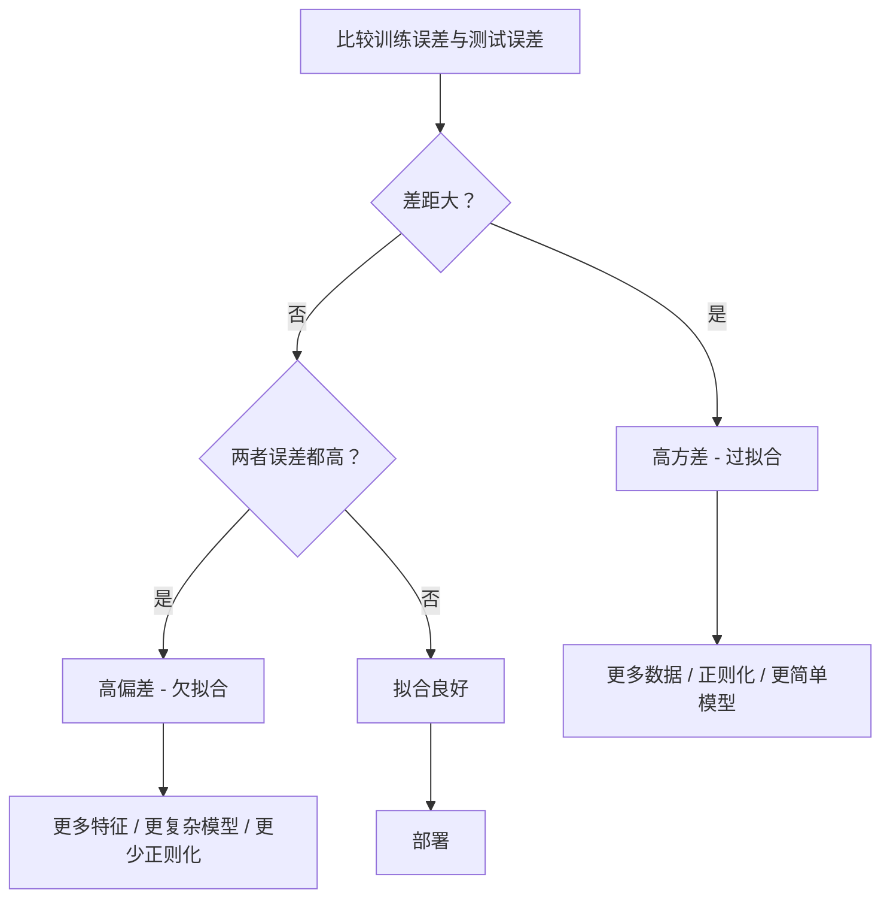
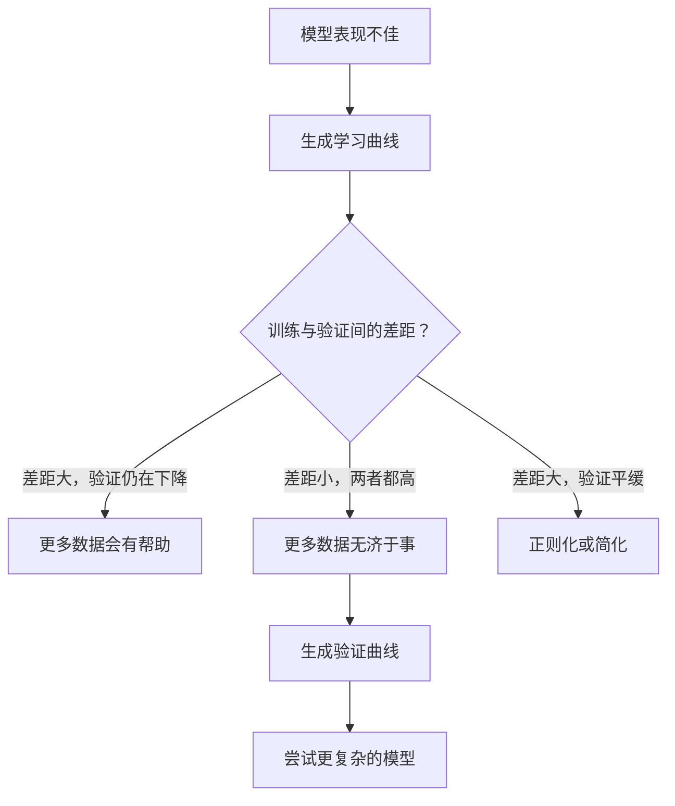

# 偏差-方差权衡

> 每个模型误差都来自三个来源之一：偏差、方差或噪声。你只能控制前两个。

**类型：** 学习
**语言：** Python
**先修知识：** 阶段2，第01-09课（机器学习基础、回归、分类、评估）
**时间：** 约75分钟

## 学习目标

- 推导期望预测误差的偏差-方差分解，并解释不可约噪声的作用
- 通过训练误差和测试误差的模式判断模型是否遭受高偏差或高方差
- 解释正则化技术（L1、L2、Dropout、早停）如何用偏差换取方差
- 实现实验，可视化不同复杂度模型下的偏差-方差权衡

## 问题

你训练了一个模型。它在测试数据上有一些误差。这个误差从何而来？

如果你的模型过于简单（在曲线数据集上使用线性回归），它会持续错过真实的模式。这就是偏差。如果你的模型过于复杂（在15个数据点上使用20次多项式），它会完美拟合训练数据，但在新数据上给出截然不同的预测。这就是方差。

对于固定的模型容量，你无法同时最小化两者。降低偏差，方差就会上升。降低方差，偏差就会上升。理解这种权衡是机器学习中最有用的诊断技能。它会告诉你：应该让模型更复杂还是更简单，应该获取更多数据还是设计更好的特征，应该增加还是减少正则化。

## 概念

### 偏差：系统性误差

偏差衡量模型平均预测值与真实值之间的差距。如果你用相同的模型在多个不同的训练集（来自同一分布）上训练，并平均这些预测，偏差就是该平均值与真实值之间的差距。

高偏差意味着模型过于僵化，无法捕捉真实模式。用直线拟合抛物线会始终错过曲线，无论你给它多少数据。这就是欠拟合。

```
高偏差（欠拟合）：
  模型始终预测大致相同的错误结果。
  训练误差：高
  测试误差：高
  两者间差距：小
```

### 方差：对训练数据的敏感性

方差衡量当你使用不同数据子集训练时，预测值变化的程度。如果训练集的微小变化导致模型发生巨大变化，则方差很高。

高方差意味着模型在拟合训练数据中的噪声，而不是潜在信号。一个20次多项式会穿过每一个训练点，但在它们之间剧烈振荡。这就是过拟合。

```
高方差（过拟合）：
  模型完美拟合训练数据，但在新数据上失败。
  训练误差：低
  测试误差：高
  两者间差距：大
```

### 分解

对任意点x，平方损失下的期望预测误差可以精确分解为：

```
期望误差 = 偏差^2 + 方差 + 不可约噪声

其中：
  偏差^2   = (E[f_hat(x)] - f(x))^2
  方差     = E[(f_hat(x) - E[f_hat(x)])^2]
  噪声     = E[(y - f(x))^2]             (sigma^2)
```

- `f(x)` 是真实函数
- `f_hat(x)` 是模型的预测
- `E[...]` 是对不同训练集的期望
- `y` 是观测到的标签（真实函数加噪声）

噪声项是不可约的。没有任何模型能在噪声数据上做得比 sigma^2 更好。你的任务是找到偏差^2 和方差之间的正确平衡。

### 模型复杂度 vs 误差


经典的U形曲线：

| 复杂度 | 偏差 | 方差 | 总误差 |
|--------|------|------|--------|
| 太低 | 高 | 低 | 高（欠拟合） |
| 正好 | 适中 | 适中 | 最低 |
| 太高 | 低 | 高 | 高（过拟合） |

### 正则化作为偏差-方差控制

正则化故意增加偏差以降低方差。它约束模型使其无法追逐噪声。

- **L2（岭回归）：** 将所有权重向零收缩。保留所有特征但减少它们的影响。
- **L1（套索回归）：** 将某些权重精确推到零。执行特征选择。
- **Dropout：** 训练时随机禁用神经元。强制冗余表示。
- **早停（Early stopping）：** 在模型完全拟合训练数据之前停止训练。

正则化强度（lambda、dropout率、训练轮数）直接控制你在偏差-方差曲线上的位置。正则化越强，偏差越大，方差越小。

### 双重下降：现代化视角

经典理论认为：过最优点后，复杂度越高总是越有害。但自2019年以来的研究显示了一些意想不到的现象。如果你持续增加模型容量，远超过插值阈值（模型拥有足够参数完美拟合训练数据），测试误差可能会再次下降。


这种"双重下降（Double Descent）"现象解释了为什么大规模过参数化的神经网络（参数远多于训练样本数量）仍然能泛化良好。经典的偏差-方差权衡并没有错，但对于现代情况来说是不完整的。

关于双重下降的关键观察：
- 它发生在线性模型、决策树和神经网络中
- 在插值区域内，更多数据实际上可能有害（样本维度双重下降）
- 更多训练轮数也可能引起它（轮次维度双重下降）
- 正则化能平滑峰值，但不能消除它

为什么会发生？在插值阈值处，模型恰好有足够的容量拟合所有训练点。它被迫采用一个非常具体的解，穿过每一个点，并且数据中的微小扰动会导致拟合结果的巨大变化。这是方差达到峰值的地方。超过阈值后，模型有许多可能的解可以完美拟合数据。学习算法（例如，具有隐式正则化的梯度下降）倾向于选择其中最简单的解。这种对简单解的隐式偏好解释了为什么过参数化模型能够泛化。

| 状态 | 参数 vs 样本 | 行为 |
|------|-------------|------|
| 欠参数化 | p << n | 经典权衡适用 |
| 插值阈值 | p ~ n | 方差达到峰值，测试误差飙升 |
| 过参数化 | p >> n | 隐式正则化生效，测试误差下降 |

对于实际应用：如果你使用神经网络或大型树集成，不要停在插值阈值处。要么通过显式正则化保持在阈值以下，要么远超过阈值。最糟糕的位置就是正好在阈值处。

### 诊断你的模型



| 症状 | 诊断 | 修复方法 |
|------|------|---------|
| 训练误差高，测试误差高 | 偏差 | 更多特征，复杂模型，减少正则化 |
| 训练误差低，测试误差高 | 方差 | 更多数据，正则化，更简单模型，Dropout |
| 训练误差低，测试误差低 | 拟合良好 | 发布吧 |
| 训练误差降低，测试误差升高 | 过拟合进行中 | 早停 |

### 实用策略

**当偏差是问题时：**
- 添加多项式或交互特征
- 使用更灵活的模型（树集成替换线性）
- 降低正则化强度
- 训练更长时间（如果尚未收敛）

**当方差是问题时：**
- 获取更多训练数据
- 使用装袋（Bagging）（随机森林）
- 增加正则化（更高的lambda，更多Dropout）
- 特征选择（去除噪声特征）
- 使用交叉验证及早检测

### 集成方法与方差降低

集成方法是对抗方差最实用的工具。

**装袋（Bagging，Bootstrap Aggregating）** 在训练数据的不同自助采样（Bootstrap Sample）上训练多个模型，然后平均它们的预测。每个单独模型具有高方差，但平均值的方差要低得多。随机森林是应用于决策树的装袋。

数学原理：如果你平均N个独立预测，每个方差为sigma^2，则平均值的方差为sigma^2 / N。模型并非完全独立（它们都看到相似的数据），因此降低幅度小于1/N，但仍然显著。

**提升（Boosting）** 通过顺序构建模型来降低偏差，每个新模型关注到目前为止集成模型的误差。梯度提升（Gradient Boosting）和AdaBoost是主要例子。如果添加过多模型，提升可能过拟合，因此需要早停或正则化。

| 方法 | 主要效果 | 偏差变化 | 方差变化 |
|------|---------|---------|---------|
| 装袋 | 降低方差 | 不变 | 减小 |
| 提升 | 降低偏差 | 减小 | 可能增加 |
| 堆叠 | 降低两者 | 取决于元学习器 | 取决于基模型 |
| Dropout | 隐式装袋 | 略微增加 | 减小 |

**实用规则：** 如果基模型方差高（深层树、高次多项式），使用装袋。如果基模型偏差高（浅层树桩、简单线性模型），使用提升。

### 学习曲线

学习曲线将训练误差和验证误差绘制为训练集大小的函数。它们是你拥有的最实用的诊断工具。与单一的训练/测试比较不同，学习曲线展示了模型的轨迹，并告诉你更多数据是否会有所帮助。


如何解读它们：

| 场景 | 训练误差 | 验证误差 | 差距 | 含义 | 做法 |
|------|---------|---------|-----|------|------|
| 高偏差 | 高 | 高 | 小 | 模型无法捕捉模式 | 更多特征，复杂模型，减少正则化 |
| 高方差 | 低 | 高 | 大 | 模型记忆训练数据 | 更多数据，正则化，更简单模型 |
| 良好拟合 | 适中 | 适中 | 小 | 模型泛化良好 | 发布吧 |
| 高方差，正在改善 | 低 | 随数据增加而下降 | 缩小 | 可用数据解决的方差问题 | 收集更多数据 |
| 高偏差，平缓 | 高 | 高且平缓 | 小且平缓 | 更多数据无济于事 | 改变模型架构 |

关键洞察：如果两条曲线都已趋于平稳，且差距小但两者误差都高，则更多数据是无用的。你需要更好的模型。如果差距大且仍在缩小，则更多数据会有所帮助。

### 如何生成学习曲线

有两种方法：

**方法1：改变训练集大小，固定模型。** 保持模型和超参数不变。在逐渐增大的训练数据子集上训练。在每个大小上测量训练误差和验证误差。这是标准的学习曲线。

**方法2：改变模型复杂度，固定数据。** 保持数据不变。扫描复杂度参数（多项式次数、树深度、层数）。在每个复杂度上测量训练误差和验证误差。这是验证曲线，直接显示偏差-方差权衡。

两种方法相辅相成。第一种告诉你更多数据是否有帮助。第二种告诉你不同的模型是否有帮助。在就下一步行动做出决定之前，先运行两者。



## 动手构建

代码位于 `code/bias_variance.py`，运行完整的偏差-方差分解实验。以下是逐步方法。

### 第1步：从已知函数生成合成数据

我们使用 `f(x) = sin(1.5x) + 0.5x` 并添加高斯噪声。知道真实函数使我们能够精确计算偏差和方差。

```python
def true_function(x):
    return np.sin(1.5 * x) + 0.5 * x

def generate_data(n_samples=30, noise_std=0.5, x_range=(-3, 3), seed=None):
    rng = np.random.RandomState(seed)
    x = rng.uniform(x_range[0], x_range[1], n_samples)
    y = true_function(x) + rng.normal(0, noise_std, n_samples)
    return x, y
```

### 第2步：自助采样与多项式拟合

对于每个多项式次数，我们抽取多个自助训练集，拟合多项式，并记录在固定测试网格上的预测。这为我们提供了每个测试点上预测值的分布。

```python
def fit_polynomial(x_train, y_train, degree, lam=0.0):
    X = np.column_stack([x_train ** d for d in range(degree + 1)])
    if lam > 0:
        penalty = lam * np.eye(X.shape[1])
        penalty[0, 0] = 0
        w = np.linalg.solve(X.T @ X + penalty, X.T @ y_train)
    else:
        w = np.linalg.lstsq(X, y_train, rcond=None)[0]
    return w
```

我们在200个不同的自助样本上拟合。每个自助样本来自相同的底层分布，但包含不同的点。

### 第3步：计算偏差^2、方差分解

有了每个测试点上的200组预测，我们可以直接从定义计算分解：

```python
mean_pred = predictions.mean(axis=0)
bias_sq = np.mean((mean_pred - y_true) ** 2)
variance = np.mean(predictions.var(axis=0))
total_error = np.mean(np.mean((predictions - y_true) ** 2, axis=1))
```

- `mean_pred` 是通过自助样本估计的 E[f_hat(x)]
- `bias_sq` 是平均预测与真实值之间的平方差距
- `variance` 是预测值在自助样本间的平均分散程度
- `total_error` 应约等于偏差^2 + 方差 + 噪声

### 第4步：学习曲线

学习曲线在固定模型复杂度的同时扫描训练集大小。它们显示你的模型是受数据限制还是受容量限制。

```python
def demo_learning_curves():
    sizes = [10, 15, 20, 30, 50, 75, 100, 150, 200, 300]
    degree = 5

    for n in sizes:
        train_errors = []
        test_errors = []
        for seed in range(50):
            x_train, y_train = generate_data(n_samples=n, seed=seed * 100)
            w = fit_polynomial(x_train, y_train, degree)
            train_pred = predict_polynomial(x_train, w)
            train_mse = np.mean((train_pred - y_train) ** 2)
            test_pred = predict_polynomial(x_test, w)
            test_mse = np.mean((test_pred - y_test) ** 2)
            train_errors.append(train_mse)
            test_errors.append(test_mse)
        # 多次运行的平均值给出学习曲线点
```

对于高方差模型（5次多项式，小数据），你会看到：
- 训练误差开始时较低，随着更多数据使记忆变得更难而增加
- 测试误差开始时较高，随着模型获得更多信号而降低
- 随着数据增多，