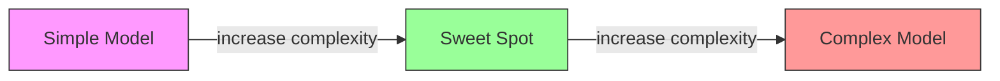
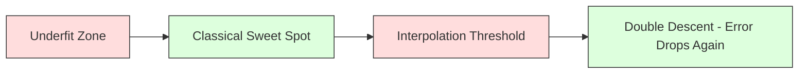
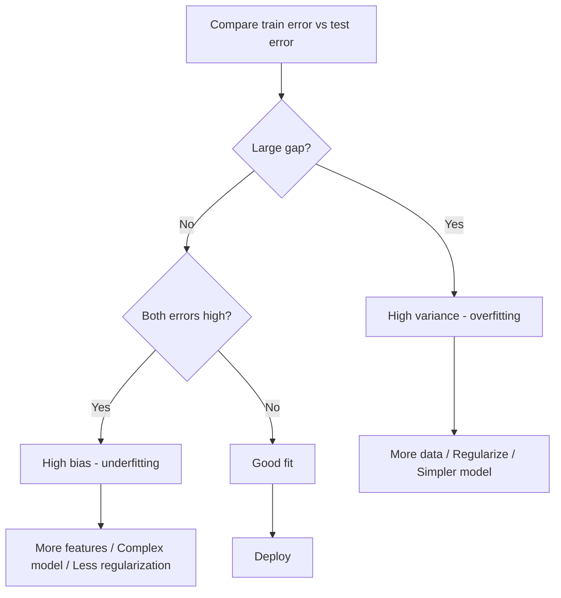
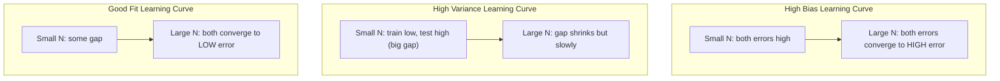
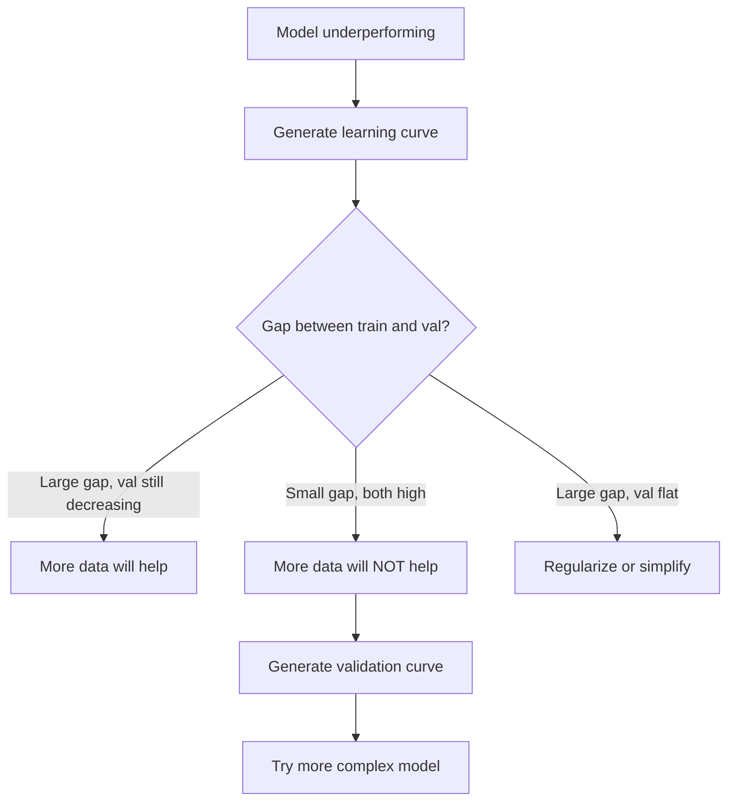

# 10 · 偏差-方差权衡

> 模型的每一份误差都来自三个来源之一：偏差、方差或噪声。你只能控制其中前两者。

**类型：** 学习
**语言：** Python
**前置：** 第 2 阶段，第 01-09 课（机器学习基础、回归、分类、评估）
**时长：** 约 75 分钟

## 学习目标

- 推导期望预测误差的「偏差-方差分解（bias-variance decomposition）」，并解释「不可约噪声（irreducible noise）」所起的作用
- 利用训练误差与测试误差的模式，诊断模型是高偏差还是高方差
- 解释正则化技术（L1、L2、dropout、提前停止）如何以偏差换取方差
- 实现实验，将随复杂度递增的一系列模型上的偏差-方差权衡可视化

## 问题所在

你训练了一个模型，它在测试数据上有一定误差。这个误差从何而来？

如果模型太简单（在弯曲的数据集上做线性回归），它会持续地偏离真实模式，这就是「偏差（bias）」。如果模型太复杂（在 15 个数据点上拟合 20 次多项式），它会完美拟合训练数据，却在新数据上给出截然不同的预测，这就是「方差（variance）」。

对于固定的模型容量，你无法同时最小化两者。压低偏差，方差就会上升；压低方差，偏差就会上升。理解这一权衡，是机器学习中最有用的单一诊断技能。它告诉你应该让模型更复杂还是更简单、应该获取更多数据还是设计更好的特征、应该加大还是减小正则化。

## 概念

### 偏差：系统性误差

偏差衡量的是模型的平均预测与真实值之间偏离了多远。如果你在来自同一分布的许多不同训练集上训练同一个模型，并对预测取平均，那么偏差就是这个平均值与真值之间的差距。

高偏差意味着模型过于僵化，无法捕捉真实模式。一条直线去拟合一条抛物线，无论给它多少数据，都永远会错过那条曲线。这就是「欠拟合（underfitting）」。

```
High bias (underfitting):
  Model always predicts roughly the same wrong thing.
  Training error: HIGH
  Test error: HIGH
  Gap between them: SMALL
```

### 方差：对训练数据的敏感度

方差衡量的是当你在不同数据子集上训练时，预测变化有多大。如果训练集的微小变化会引起模型的巨大变化，那么方差就很高。

高方差意味着模型拟合的是训练数据中的噪声，而非底层信号。一个 20 次多项式会穿过每一个训练点，却在它们之间剧烈震荡。这就是「过拟合（overfitting）」。

```
High variance (overfitting):
  Model fits training data perfectly but fails on new data.
  Training error: LOW
  Test error: HIGH
  Gap between them: LARGE
```

### 分解

对于任意一点 x，平方损失下的期望预测误差可以精确分解：

```
Expected Error = Bias^2 + Variance + Irreducible Noise

where:
  Bias^2   = (E[f_hat(x)] - f(x))^2
  Variance = E[(f_hat(x) - E[f_hat(x)])^2]
  Noise    = E[(y - f(x))^2]             (sigma^2)
```

- `f(x)` 是真实函数
- `f_hat(x)` 是模型的预测
- `E[...]` 是在不同训练集上取的期望
- `y` 是观测到的标签（真实函数值加噪声）

噪声项是不可约的。在含噪声的数据上，没有任何模型能做得比 sigma^2 更好。你的任务是在 bias^2 与 variance 之间找到合适的平衡。

### 模型复杂度 vs 误差



经典的 U 形曲线：

| 复杂度 | 偏差 | 方差 | 总误差 |
|-----------|------|----------|-------------|
| 太低 | HIGH | LOW | HIGH（欠拟合） |
| 恰到好处 | MODERATE | MODERATE | LOWEST |
| 太高 | LOW | HIGH | HIGH（过拟合） |

### 正则化作为偏差-方差的调控手段

正则化通过刻意增加偏差来降低方差。它约束模型，使其无法追逐噪声。

- **L2（Ridge，岭回归）：** 将所有权重收缩向零。保留全部特征，但削弱它们的影响。
- **L1（Lasso）：** 将部分权重直接压到零。实现特征选择。
- **Dropout：** 在训练期间随机禁用神经元。迫使模型形成冗余表示。
- **提前停止（Early stopping）：** 在模型完全拟合训练数据之前停止训练。

正则化强度（lambda、dropout 比率、训练轮数）直接决定了你处在偏差-方差曲线上的哪个位置。正则化越强，意味着偏差越大、方差越小。

### 双下降：现代视角

经典理论说：越过最佳点之后，复杂度越高总是越糟。但自 2019 年以来的研究揭示了一个出人意料的现象。如果你把模型容量持续增大，远远越过「插值阈值（interpolation threshold）」（即模型拥有足够的参数来完美拟合训练数据的那个点），测试误差竟然会再次下降。



这种「双下降（double descent）」现象解释了为什么参数量远超训练样本的、严重过参数化的神经网络仍然能良好泛化。经典的偏差-方差权衡并没有错，但对于现代场景而言，它是不完整的。

关于双下降的关键观察：

- 它出现在线性模型、决策树和神经网络中
- 在插值区域，更多数据反而可能有害（样本维度的双下降，sample-wise double descent）
- 更多的训练轮数也可能引发它（轮次维度的双下降，epoch-wise double descent）
- 正则化会平滑掉那个峰值，但不会将其消除

为什么会发生这种现象？在插值阈值处，模型恰好拥有刚好能拟合所有训练点的容量。它被逼入一个非常特定的、穿过每一个点的解，而数据中的微小扰动会引起拟合结果的巨大变化。这正是方差达到峰值的地方。越过这个阈值后，模型拥有许多能够完美拟合数据的可能解。学习算法（例如带有隐式正则化的梯度下降）倾向于在其中挑选最简单的那个。这种偏向简单解的隐式偏差，正是过参数化模型能够泛化的原因。

| 场景 | 参数量 vs 样本量 | 行为 |
|--------|----------------------|----------|
| 欠参数化 | p << n | 经典权衡成立 |
| 插值阈值 | p ~ n | 方差达到峰值，测试误差骤升 |
| 过参数化 | p >> n | 隐式正则化开始起作用，测试误差下降 |

实践要点：如果你在使用神经网络或大型树集成模型，不要停在插值阈值处。要么远远停在它下方（配合显式正则化），要么远远越过它。最糟糕的位置就是恰好停在阈值上。

### 诊断你的模型



| 症状 | 诊断 | 修复方法 |
|---------|-----------|-----|
| 训练误差高、测试误差高 | 偏差 | 更多特征、更复杂的模型、更少的正则化 |
| 训练误差低、测试误差高 | 方差 | 更多数据、正则化、更简单的模型、dropout |
| 训练误差低、测试误差低 | 拟合良好 | 直接上线 |
| 训练误差下降、测试误差上升 | 正在过拟合 | 提前停止 |

### 实用策略

**当偏差是问题时：**

- 添加多项式特征或交互特征
- 使用更灵活的模型（用树集成替代线性模型）
- 减小正则化强度
- 训练更久（如果尚未收敛）

**当方差是问题时：**

- 获取更多训练数据
- 使用 bagging（随机森林）
- 增大正则化（更高的 lambda、更多的 dropout）
- 特征选择（移除噪声特征）
- 使用交叉验证尽早发现它

### 集成方法与方差缩减

集成方法是对抗方差最实用的工具。

**Bagging（Bootstrap Aggregating，自助聚合）** 在训练数据的不同自助（bootstrap）样本上训练多个模型，然后对它们的预测取平均。每个单独的模型方差都很高，但平均之后方差会大幅降低。随机森林就是把 bagging 应用到决策树上。

它在数学上为什么有效：如果你对 N 个独立的预测取平均，每个预测的方差为 sigma^2，那么平均值的方差为 sigma^2 / N。这些模型并非真正独立（它们都看到相似的数据），所以缩减幅度小于 1/N，但仍然相当可观。

**Boosting（提升法）** 通过顺序地构建模型来降低偏差，其中每个新模型都聚焦于当前集成模型的误差。梯度提升（gradient boosting）和 AdaBoost 是主要代表。如果加入过多模型，boosting 也可能过拟合，因此你需要提前停止或正则化。

| 方法 | 主要作用 | 偏差变化 | 方差变化 |
|--------|---------------|-------------|-----------------|
| Bagging | 降低方差 | 不变 | 减小 |
| Boosting | 降低偏差 | 减小 | 可能增大 |
| Stacking | 两者都降低 | 取决于元学习器 | 取决于基模型 |
| Dropout | 隐式 bagging | 略微增大 | 减小 |

**实用法则：** 如果基模型方差高（深树、高次多项式），用 bagging；如果基模型偏差高（浅决策桩、简单线性模型），用 boosting。

### 学习曲线

「学习曲线（learning curve）」将训练误差和验证误差绘制为训练集大小的函数。它们是你手头最实用的诊断工具。与单次的训练/测试对比不同，学习曲线展示了模型的变化轨迹，并告诉你更多数据是否会有帮助。



如何解读它们：

| 场景 | 训练误差 | 验证误差 | 差距 | 含义 | 应对方法 |
|----------|---------------|-----------------|-----|---------------|------------|
| 高偏差 | 高 | 高 | 小 | 模型无法捕捉模式 | 更多特征、更复杂的模型、更少的正则化 |
| 高方差 | 低 | 高 | 大 | 模型在死记训练数据 | 更多数据、正则化、更简单的模型 |
| 拟合良好 | 中等 | 中等 | 小 | 模型泛化良好 | 直接上线 |
| 高方差，正在改善 | 低 | 随数据增多而下降 | 收缩中 | 数据可解决的方差问题 | 收集更多数据 |
| 高偏差，曲线平坦 | 高 | 高且平坦 | 小且平坦 | 更多数据无济于事 | 更换模型架构 |

关键洞见：如果两条曲线都已趋于平台、差距很小但两个误差都很高，那么更多数据是无用的，你需要一个更好的模型；如果差距很大且仍在缩小，那么更多数据会有帮助。

### 如何生成学习曲线

有两种做法：

**做法 1：改变训练集大小，固定模型。** 保持模型和超参数不变，在越来越大的训练数据子集上训练，在每个规模下测量训练误差和验证误差。这就是标准的学习曲线。

**做法 2：改变模型复杂度，固定数据。** 保持数据不变，扫描一个复杂度参数（多项式次数、树深度、层数），在每个复杂度下测量训练误差和验证误差。这是「验证曲线（validation curve）」，能直接展示偏差-方差权衡。

这两种做法相辅相成。第一种告诉你更多数据是否有帮助，第二种告诉你换一个模型是否有帮助。在决定下一步行动之前，两者都跑一遍。



## 动手构建

`code/bias_variance.py` 中的代码运行完整的偏差-方差分解实验。下面逐步介绍这套做法。

### 第 1 步：从已知函数生成合成数据

我们使用 `f(x) = sin(1.5x) + 0.5x` 并加上高斯噪声。知道真实函数，就能精确计算偏差和方差。

```python
def true_function(x):
    return np.sin(1.5 * x) + 0.5 * x

def generate_data(n_samples=30, noise_std=0.5, x_range=(-3, 3), seed=None):
    rng = np.random.RandomState(seed)
    x = rng.uniform(x_range[0], x_range[1], n_samples)
    y = true_function(x) + rng.normal(0, noise_std, n_samples)
    return x, y
```

### 第 2 步：自助采样与多项式拟合

对每个多项式次数，我们抽取许多自助训练集，拟合多项式，并记录在一个固定测试网格上的预测。这样我们就在每个测试点得到了一个预测的分布。

```python
def fit_polynomial(x_train, y_train, degree, lam=0.0):
    X = np.column_stack([x_train ** d for d in range(degree + 1)])
    if lam > 0:
        penalty = lam * np.eye(X.shape[1])
        penalty[0, 0] = 0
        w = np.linalg.solve(X.T @ X + penalty, X.T @ y_train)
    else:
        w = np.linalg.lstsq(X, y_train, rcond=None)[0]
    return w
```

我们在 200 个不同的自助样本上进行拟合。每个自助样本都从同一底层分布抽取，但包含不同的点。

### 第 3 步：计算 Bias^2、方差分解

在每个测试点拥有 200 组预测后，我们就能直接按定义计算分解：

```python
mean_pred = predictions.mean(axis=0)
bias_sq = np.mean((mean_pred - y_true) ** 2)
variance = np.mean(predictions.var(axis=0))
total_error = np.mean(np.mean((predictions - y_true) ** 2, axis=1))
```

- `mean_pred` 是由自助样本估计出的 E[f_hat(x)]
- `bias_sq` 是平均预测与真值之间差距的平方
- `variance` 是预测在各自助样本间的平均离散程度
- `total_error` 应当约等于 bias^2 + variance + noise

### 第 4 步：学习曲线

学习曲线在保持模型复杂度固定的同时扫描训练集大小。它们展示你的模型是受限于数据，还是受限于容量。

```python
def demo_learning_curves():
    sizes = [10, 15, 20, 30, 50, 75, 100, 150, 200, 300]
    degree = 5

    for n in sizes:
        train_errors = []
        test_errors = []
        for seed in range(50):
            x_train, y_train = generate_data(n_samples=n, seed=seed * 100)
            w = fit_polynomial(x_train, y_train, degree)
            train_pred = predict_polynomial(x_train, w)
            train_mse = np.mean((train_pred - y_train) ** 2)
            test_pred = predict_polynomial(x_test, w)
            test_mse = np.mean((test_pred - y_test) ** 2)
            train_errors.append(train_mse)
            test_errors.append(test_mse)
        # 在多次运行上取平均，得到学习曲线上的一个点
```

对于一个高方差模型（小数据上的 5 次多项式），你会看到：

- 训练误差从低开始，随着数据增多、死记变难而上升
- 测试误差从高开始，随着模型获得更多信号而下降
- 差距随数据增多而缩小

对于一个高偏差模型（1 次多项式），两个误差都迅速收敛到同一个较高的值，更多数据无济于事。

### 第 5 步：正则化扫描

代码中还包含 `demo_regularization_sweep()`，它固定一个高次多项式（15 次），并将 Ridge 正则化强度从 0.001 扫描到 100。这从另一个角度展示了偏差-方差权衡：不是改变模型复杂度，而是改变约束强度。

```python
def demo_regularization_sweep():
    alphas = [0.001, 0.005, 0.01, 0.05, 0.1, 0.5, 1.0, 5.0, 10.0, 50.0, 100.0]
    for alpha in alphas:
        results = bias_variance_decomposition([15], lam=alpha)
        r = results[15]
        print(f"alpha={alpha:.3f}  bias={r['bias_sq']:.4f}  var={r['variance']:.4f}")
```

在低 alpha 时，15 次多项式几乎不受约束。方差占主导，因为模型在每个自助样本中都追逐噪声。在高 alpha 时，惩罚强到模型实际上变成了一个近乎常数的函数，偏差占主导。最优 alpha 位于这两个极端之间。

这与改变多项式次数得到的 U 形曲线是同一条，只不过由一个连续旋钮而非离散旋钮来控制。在实践中，正则化是控制这一权衡的首选方式，因为它无需改变特征集即可实现细粒度控制。

## 实际运用

sklearn 提供了 `learning_curve` 和 `validation_curve`，无需编写自助循环即可自动完成这些诊断。

### 验证曲线：扫描模型复杂度

```python
from sklearn.model_selection import validation_curve
from sklearn.pipeline import make_pipeline
from sklearn.preprocessing import PolynomialFeatures
from sklearn.linear_model import Ridge

degrees = list(range(1, 16))
train_scores_all = []
val_scores_all = []

for d in degrees:
    pipe = make_pipeline(PolynomialFeatures(d), Ridge(alpha=0.01))
    train_scores, val_scores = validation_curve(
        pipe, X, y, param_name="polynomialfeatures__degree",
        param_range=[d], cv=5, scoring="neg_mean_squared_error"
    )
    train_scores_all.append(-train_scores.mean())
    val_scores_all.append(-val_scores.mean())
```

这能直接给出偏差-方差权衡曲线。验证得分相对训练得分最差的地方，方差占主导；两者都很差的地方，偏差占主导。

### 学习曲线：扫描训练集大小

```python
from sklearn.model_selection import learning_curve

pipe = make_pipeline(PolynomialFeatures(5), Ridge(alpha=0.01))
train_sizes, train_scores, val_scores = learning_curve(
    pipe, X, y, train_sizes=np.linspace(0.1, 1.0, 10),
    cv=5, scoring="neg_mean_squared_error"
)
train_mse = -train_scores.mean(axis=1)
val_mse = -val_scores.mean(axis=1)
```

将 `train_mse` 和 `val_mse` 对 `train_sizes` 作图。曲线的形状会告诉你关于模型的一切。

### 配合正则化扫描的交叉验证

```python
from sklearn.model_selection import cross_val_score

alphas = [0.001, 0.01, 0.1, 1.0, 10.0, 100.0]
for alpha in alphas:
    pipe = make_pipeline(PolynomialFeatures(10), Ridge(alpha=alpha))
    scores = cross_val_score(pipe, X, y, cv=5, scoring="neg_mean_squared_error")
    print(f"alpha={alpha:>7.3f}  MSE={-scores.mean():.4f} +/- {scores.std():.4f}")
```

这针对固定的模型复杂度扫描正则化强度。你会看到同样的偏差-方差权衡：低 alpha 意味着高方差，高 alpha 意味着高偏差。

### 串联起来：完整的诊断工作流

在实践中，你按顺序运行这些诊断：

1. 训练你的模型，计算训练误差和测试误差。
2. 如果两者都高：你遇到了偏差问题，直接跳到第 4 步。
3. 如果训练误差低但测试误差高：你遇到了方差问题。生成学习曲线，看看更多数据是否有帮助。如果没帮助，就正则化。
4. 生成一条验证曲线，扫描你的主要复杂度参数，找到最佳点。
5. 在最佳点处生成一条学习曲线。如果差距仍然很大，你需要更多数据或正则化。
6. 用 `cross_val_score` 尝试不同 alpha 值的 Ridge/Lasso。选取交叉验证误差最低的那个 alpha。

对于大多数表格数据集，这只需 10-15 分钟的计算时间，却能省下数小时的瞎猜。

## 交付成果

本课产出：`outputs/prompt-model-diagnostics.md`

## 练习

1. 在 `noise_std=0`（无噪声）的情况下运行分解。不可约误差项会怎样？最优复杂度会改变吗？

2. 将训练集大小从 30 增加到 300。这对方差分量有何影响？最优多项式次数会变化吗？

3. 在实验中加入 L2 正则化（岭回归）。对于一个固定的高次多项式（15 次），将 lambda 从 0 扫描到 100。把 bias^2 和 variance 作为 lambda 的函数画出来。

4. 把真实函数从多项式改为 `sin(x)`。偏差-方差分解会如何变化？是否仍然存在一个清晰的最优次数？

5. 实现一个简单的自助聚合（bagging）封装：在自助样本上训练 10 个模型并对预测取平均。证明这能降低方差而不会过多增加偏差。

## 关键术语

| 术语 | 人们怎么说 | 它实际的含义 |
|------|----------------|----------------------|
| 偏差（Bias） | 「模型太简单了」 | 来自错误假设的系统性误差。模型平均预测与真值之间的差距。 |
| 方差（Variance） | 「模型在过拟合」 | 来自对训练数据敏感的误差。预测在不同训练集间变化有多大。 |
| 不可约误差（Irreducible error） | 「数据里的噪声」 | 来自真实数据生成过程中随机性的误差。任何模型都无法消除它。 |
| 欠拟合（Underfitting） | 「学得不够」 | 模型偏差高。即便在训练数据上也错过真实模式。 |
| 过拟合（Overfitting） | 「在死记数据」 | 模型方差高。拟合了训练数据中无法泛化的噪声。 |
| 正则化（Regularization） | 「约束模型」 | 加入惩罚项来降低模型复杂度，以偏差换取更低的方差。 |
| 双下降（Double descent） | 「更多参数反而有帮助」 | 当模型容量远超插值阈值时，测试误差再次下降。 |
| 模型复杂度（Model complexity） | 「模型有多灵活」 | 模型拟合任意模式的容量。由架构、特征或正则化控制。 |

## 延伸阅读

- [Hastie, Tibshirani, Friedman: Elements of Statistical Learning, Ch. 7](https://hastie.su.domains/ElemStatLearn/) —— 偏差-方差分解的权威论述
- [Belkin et al., Reconciling modern machine learning practice and the bias-variance trade-off (2019)](https://arxiv.org/abs/1812.11118) —— 双下降论文
- [Nakkiran et al., Deep Double Descent (2019)](https://arxiv.org/abs/1912.02292) —— 轮次维度与样本维度的双下降
- [Scott Fortmann-Roe: Understanding the Bias-Variance Tradeoff](http://scott.fortmann-roe.com/docs/BiasVariance.html) —— 清晰的可视化讲解
