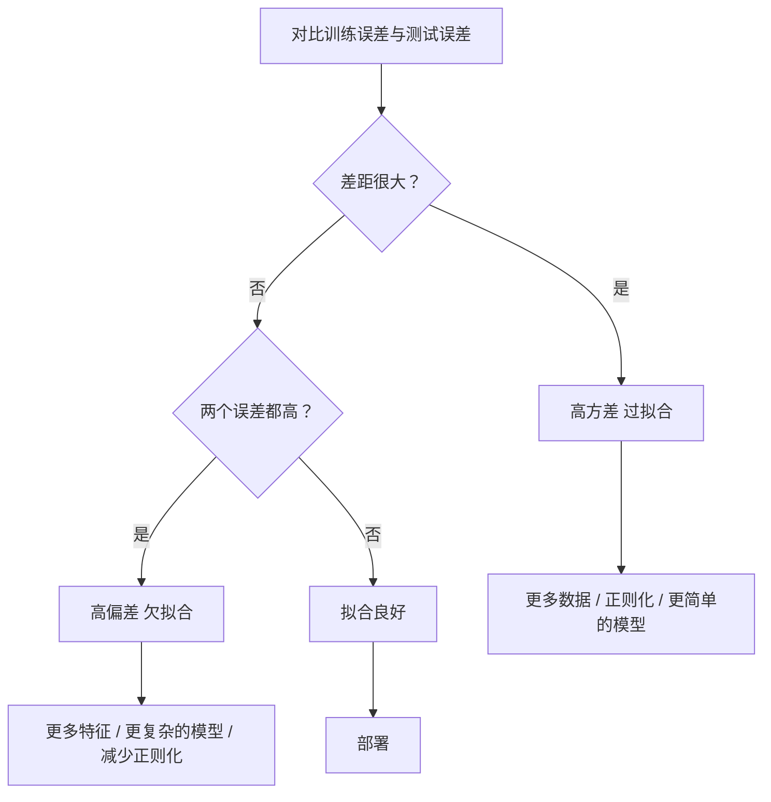
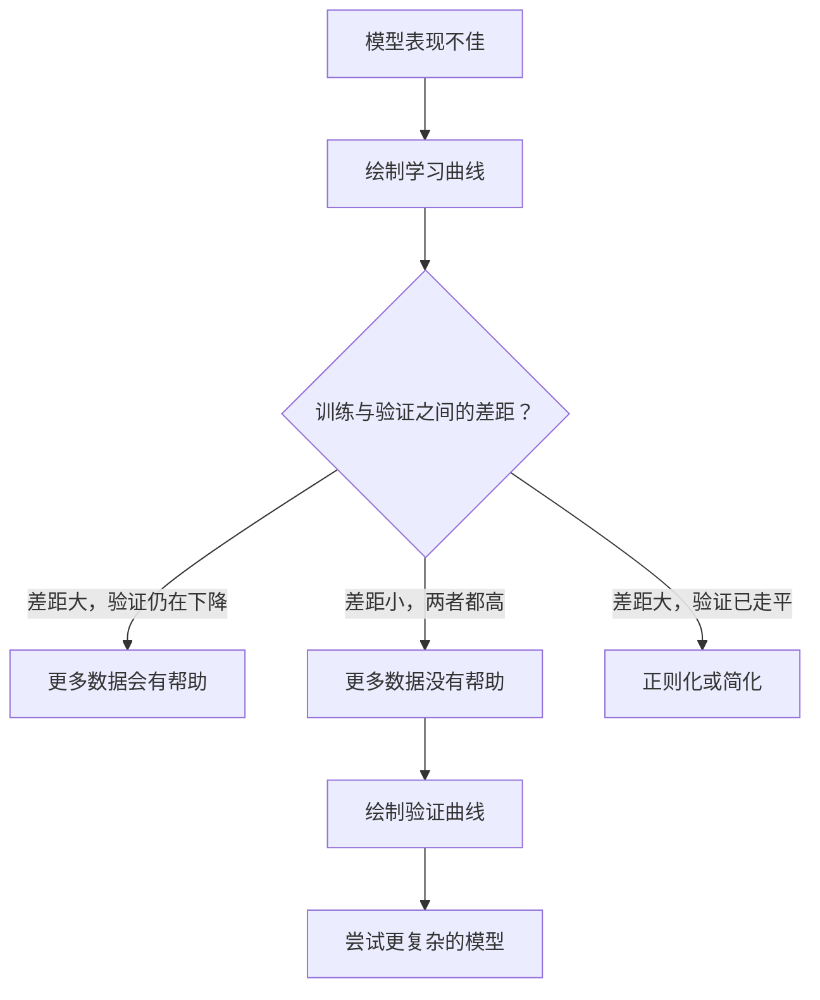

# 偏差-方差权衡（Bias-Variance Tradeoff）

> 译注：本文译自同目录 [`en.md`](./en.md)。术语遵循仓根 [TRANSLATION_GUIDE.md](../../../../TRANSLATION_GUIDE.md)。

> 模型的每一份误差都来自三个源头之一：偏差（bias）、方差（variance）或噪声。你只能控制前两个。

**Type:** Learn
**Language:** Python
**Prerequisites:** Phase 2, Lessons 01-09 (ML basics, regression, classification, evaluation)
**Time:** ~75 minutes

## 学习目标（Learning Objectives）

- 推导预期预测误差的偏差-方差分解，并解释不可约噪声（irreducible noise）的作用
- 通过训练误差与测试误差的形态，诊断模型究竟是高偏差还是高方差
- 解释正则化技术（L1、L2、dropout、early stopping）是如何用偏差换方差的
- 在不同复杂度的模型上，实现可视化偏差-方差权衡的实验

## 问题（The Problem）

你训练了一个模型，它在测试集上有一些误差。这些误差到底从哪儿来？

如果模型太简单（用线性回归去拟合一条曲线），它会一贯地错过真实的规律——这就是偏差。如果模型太复杂（用 20 次多项式去拟合 15 个数据点），它会完美拟合训练数据，但在新数据上给出大相径庭的预测——这就是方差。

在固定的模型容量下，你没法同时把这两者都压到最低。压低偏差，方差就上去；压低方差，偏差就上去。理解这个权衡，是机器学习里最有用的一项诊断技能。它会告诉你：是该把模型变复杂还是变简单？是该多搞点数据还是设计更好的特征？是正则多一点还是少一点？

## 概念（The Concept）

### 偏差：系统性误差（Bias: Systematic Error）

偏差衡量的是：模型预测的「平均值」距离真实值有多远。如果你用同分布抽出来的多个训练集分别训练同一个模型，再把它们的预测平均一下，偏差就是这个平均值与真值之间的差距。

高偏差意味着模型太僵硬，无法捕捉真实规律。一条直线去拟合抛物线，无论给它多少数据，它永远错过那条曲线。这就是欠拟合（underfitting）。

```
High bias (underfitting):
  Model always predicts roughly the same wrong thing.
  Training error: HIGH
  Test error: HIGH
  Gap between them: SMALL
```

### 方差：对训练数据的敏感性（Variance: Sensitivity to Training Data）

方差衡量的是：当训练数据稍有变化时，预测会改变多少。如果训练集里小小的扰动就让模型剧烈变化，那方差就高。

高方差意味着模型在拟合训练数据中的噪声，而不是真正的信号。20 次多项式会穿过每一个训练点，但在点与点之间剧烈震荡。这就是过拟合（overfitting）。

```
High variance (overfitting):
  Model fits training data perfectly but fails on new data.
  Training error: LOW
  Test error: HIGH
  Gap between them: LARGE
```

### 分解（The Decomposition）

对任意一点 x，平方损失下的预期预测误差可以被精确分解：

```
Expected Error = Bias^2 + Variance + Irreducible Noise

where:
  Bias^2   = (E[f_hat(x)] - f(x))^2
  Variance = E[(f_hat(x) - E[f_hat(x)])^2]
  Noise    = E[(y - f(x))^2]             (sigma^2)
```

- `f(x)` 是真实函数
- `f_hat(x)` 是模型的预测
- `E[...]` 是在不同训练集上的期望
- `y` 是观测到的标签（真实函数加噪声）

噪声项是不可约的。在带噪声的数据上，没有任何模型能做得比 sigma^2 更好。你的工作是在 bias^2 和 variance 之间找到合适的平衡。

### 模型复杂度 vs 误差（Model Complexity vs Error）


经典的 U 形曲线：

| 复杂度 | 偏差 | 方差 | 总误差 |
|-----------|------|----------|-------------|
| 太低 | HIGH | LOW | HIGH（欠拟合） |
| 刚刚好 | MODERATE | MODERATE | LOWEST |
| 太高 | LOW | HIGH | HIGH（过拟合） |

### 正则化作为偏差-方差控制（Regularization as Bias-Variance Control）

正则化（regularization）有意地增加偏差，以换取方差的降低。它对模型施加约束，让它无法去追逐噪声。

- **L2 (Ridge)：** 把所有权重往零的方向收缩。保留所有特征，但削弱它们的影响力。
- **L1 (Lasso)：** 把一部分权重直接推到零。等价于做特征选择。
- **Dropout：** 训练时随机失活一部分神经元。逼迫模型形成冗余表征。
- **Early stopping：** 在模型完全拟合训练数据之前提前停止训练。

正则化强度（lambda、dropout 比例、训练轮数）直接决定了你坐在偏差-方差曲线上的哪一点。正则化越强，偏差越大，方差越小。

### 双下降：现代视角（Double Descent: The Modern Perspective）

经典理论说：过了最佳点，复杂度越高总误差越糟。但 2019 年以来的研究揭示了一个意料之外的现象：如果你把模型容量继续推得远超「插值阈值」（interpolation threshold，即模型参数刚好够完美拟合训练数据的临界点），测试误差反而会再次下降。


这个「双下降」（double descent）现象解释了为什么参数远多于训练样本的超参数化神经网络仍然能很好地泛化。经典的偏差-方差权衡并没错，只是在现代场景下不够完整。

关于双下降的几个关键观察：
- 它出现在线性模型、决策树和神经网络中
- 在插值区，更多数据反而可能让效果变差（样本维度的双下降，sample-wise double descent）
- 训练轮数过多也会触发它（轮数维度的双下降，epoch-wise double descent）
- 正则化能磨平这个尖峰，但消除不了

为什么会这样？在插值阈值处，模型的容量正好够拟合所有训练点。它被迫落到一个非常特殊的解上——这个解必须穿过每一个点——于是数据上的小扰动会引起拟合的大变化。这正是方差达到峰值的地方。一旦超过阈值，能完美拟合数据的解就有很多，而学习算法（比如带隐式正则化的梯度下降）倾向于在其中挑最简单的那一个。这种对简单解的隐式偏好（implicit bias），就是超参数化模型能泛化的原因。

| Regime | 参数 vs 样本 | 行为 |
|--------|----------------------|----------|
| Underparameterized（欠参数化） | p << n | 经典权衡成立 |
| Interpolation threshold（插值阈值） | p ~ n | 方差到顶，测试误差飙升 |
| Overparameterized（超参数化） | p >> n | 隐式正则化生效，测试误差下降 |

实践上的建议：如果你在用神经网络或大型树集成，不要停在插值阈值上。要么远离它（用显式正则化），要么远超过它。最糟糕的位置就是阈值正中间。

### 诊断你的模型（Diagnosing Your Model）



| 症状 | 诊断 | 处方 |
|---------|-----------|-----|
| 训练误差高，测试误差也高 | 偏差 | 增加特征、用复杂模型、减少正则化 |
| 训练误差低，测试误差高 | 方差 | 增加数据、加强正则化、用更简单的模型、加 dropout |
| 训练误差低，测试误差也低 | 拟合得好 | 上线 |
| 训练误差在降，测试误差在升 | 正在过拟合 | early stopping |

### 实战策略（Practical Strategies）

**当问题是偏差时：**
- 增加多项式特征或交互特征
- 换更灵活的模型（用树集成代替线性模型）
- 减小正则化强度
- 训练更久（如果尚未收敛）

**当问题是方差时：**
- 收集更多训练数据
- 用 bagging（如随机森林）
- 加强正则化（更大的 lambda、更多的 dropout）
- 做特征选择（剔除噪声特征）
- 用交叉验证及早发现

### 集成方法与方差缩减（Ensemble Methods and Variance Reduction）

集成方法（ensemble methods）是对付方差最实用的工具。

**Bagging（Bootstrap Aggregating，自助聚合）** 在训练数据的不同 bootstrap 样本上训练多个模型，再把它们的预测平均。每个单一模型方差很高，但平均后的方差要低得多。随机森林就是把 bagging 套到决策树上。

为什么数学上有效：如果你把 N 个独立的预测平均，每个方差是 sigma^2，那平均后的方差就是 sigma^2 / N。这些模型并不真正独立（它们看到相似的数据），所以缩减幅度不到 1/N，但仍然非常可观。

**Boosting** 通过串行构建模型来降低偏差，每个新模型都聚焦于到目前为止整个集成的错误上。Gradient boosting 和 AdaBoost 是主要代表。Boosting 如果加太多模型也会过拟合，所以需要 early stopping 或正则化。

| 方法 | 主要效果 | 偏差变化 | 方差变化 |
|--------|---------------|-------------|-----------------|
| Bagging | 缩减方差 | 不变 | 下降 |
| Boosting | 缩减偏差 | 下降 | 可能上升 |
| Stacking | 都缩减 | 取决于元学习器 | 取决于基模型 |
| Dropout | 隐式 bagging | 略升 | 下降 |

**实践规则：** 如果你的基模型是高方差的（深树、高次多项式），用 bagging。如果基模型是高偏差的（浅树桩、简单线性模型），用 boosting。

### 学习曲线（Learning Curves）

学习曲线把训练误差和验证误差画成训练集规模的函数。它是你手上最实用的诊断工具。比起单点的训练/测试对比，学习曲线展示的是模型的「轨迹」（trajectory），告诉你「再加数据有没有用」。


怎么读：

| 场景 | 训练误差 | 验证误差 | 差距 | 含义 | 怎么办 |
|----------|---------------|-----------------|-----|---------------|------------|
| 高偏差 | 高 | 高 | 小 | 模型抓不住规律 | 增加特征、复杂模型、减少正则化 |
| 高方差 | 低 | 高 | 大 | 模型在背训练数据 | 增加数据、正则化、简化模型 |
| 拟合得好 | 中等 | 中等 | 小 | 模型泛化良好 | 上线 |
| 高方差且在改善 | 低 | 随数据增多在降 | 在缩 | 数据能解决的方差问题 | 收集更多数据 |
| 高偏差且平 | 高 | 高且平 | 小且平 | 加更多数据没用 | 换模型架构 |

最关键的洞见：如果两条曲线都已经平台化、差距小但误差都偏高，那再加数据也没用——你需要的是一个更好的模型。如果差距大且还在收缩，加数据会有帮助。

### 怎么生成学习曲线（How to Generate Learning Curves）

有两种做法：

**做法 1：变训练集规模，固定模型。** 模型和超参数保持不变，在越来越大的训练数据子集上训练。每个规模点上记录训练误差和验证误差。这是标准的学习曲线。

**做法 2：变模型复杂度，固定数据。** 数据保持不变，扫描某个复杂度参数（多项式次数、树深度、层数）。在每个复杂度上记录训练误差和验证误差。这叫验证曲线（validation curve），它直接展现了偏差-方差权衡。

两种做法互补。第一种告诉你「加数据有没有用」，第二种告诉你「换模型有没有用」。在做下一步决策之前，两条都跑一下。



## 动手实现（Build It）

`code/bias_variance.py` 中的代码完整地跑了一遍偏差-方差分解实验。下面一步步介绍思路。

### 第 1 步：从已知函数生成合成数据（Generate Synthetic Data from a Known Function）

我们用 `f(x) = sin(1.5x) + 0.5x` 加高斯噪声。已知真实函数，就能精确计算偏差和方差。

```python
def true_function(x):
    return np.sin(1.5 * x) + 0.5 * x

def generate_data(n_samples=30, noise_std=0.5, x_range=(-3, 3), seed=None):
    rng = np.random.RandomState(seed)
    x = rng.uniform(x_range[0], x_range[1], n_samples)
    y = true_function(x) + rng.normal(0, noise_std, n_samples)
    return x, y
```

### 第 2 步：Bootstrap 采样与多项式拟合（Bootstrap Sampling and Polynomial Fitting）

对每一个多项式次数，我们抽取多组 bootstrap 训练集，分别拟合多项式，并在固定的测试网格上记录预测。这样我们就在每个测试点上得到了一个预测的分布。

```python
def fit_polynomial(x_train, y_train, degree, lam=0.0):
    X = np.column_stack([x_train ** d for d in range(degree + 1)])
    if lam > 0:
        penalty = lam * np.eye(X.shape[1])
        penalty[0, 0] = 0
        w = np.linalg.solve(X.T @ X + penalty, X.T @ y_train)
    else:
        w = np.linalg.lstsq(X, y_train, rcond=None)[0]
    return w
```

我们用了 200 个不同的 bootstrap 样本来拟合。每个 bootstrap 样本都来自同一个底层分布，但包含的点不同。

### 第 3 步：计算 Bias^2 与方差分解（Computing Bias^2, Variance Decomposition）

每个测试点上有 200 组预测，我们就能直接按定义计算分解：

```python
mean_pred = predictions.mean(axis=0)
bias_sq = np.mean((mean_pred - y_true) ** 2)
variance = np.mean(predictions.var(axis=0))
total_error = np.mean(np.mean((predictions - y_true) ** 2, axis=1))
```

- `mean_pred` 是用 bootstrap 估计出的 E[f_hat(x)]
- `bias_sq` 是「平均预测」与真值之间差距的平方
- `variance` 是预测在 bootstrap 样本之间的平均散布
- `total_error` 应当近似等于 bias^2 + variance + noise

### 第 4 步：学习曲线（Learning Curves）

学习曲线在固定模型复杂度的情况下扫描训练集规模，能告诉你模型是受限于数据，还是受限于容量。

```python
def demo_learning_curves():
    sizes = [10, 15, 20, 30, 50, 75, 100, 150, 200, 300]
    degree = 5

    for n in sizes:
        train_errors = []
        test_errors = []
        for seed in range(50):
            x_train, y_train = generate_data(n_samples=n, seed=seed * 100)
            w = fit_polynomial(x_train, y_train, degree)
            train_pred = predict_polynomial(x_train, w)
            train_mse = np.mean((train_pred - y_train) ** 2)
            test_pred = predict_polynomial(x_test, w)
            test_mse = np.mean((test_pred - y_test) ** 2)
            train_errors.append(train_mse)
            test_errors.append(test_mse)
        # Average over runs gives the learning curve point
```

对一个高方差模型（degree 5 + 小数据集），你会看到：
- 训练误差从低开始，随着数据增多，因记忆变难而上升
- 测试误差从高开始，随着模型获得更多信号而下降
- 两者之间的差距随数据增多在缩小

而对一个高偏差模型（degree 1），两条误差很快就收敛到同一个高位，加更多数据也无济于事。

### 第 5 步：正则化扫描（Regularization Sweep）

代码里还有 `demo_regularization_sweep()`，它固定一个高次多项式（degree 15），把 Ridge 正则化强度从 0.001 扫到 100。这是从另一个角度展示偏差-方差权衡：不变模型复杂度，而是变约束强度。

```python
def demo_regularization_sweep():
    alphas = [0.001, 0.005, 0.01, 0.05, 0.1, 0.5, 1.0, 5.0, 10.0, 50.0, 100.0]
    for alpha in alphas:
        results = bias_variance_decomposition([15], lam=alpha)
        r = results[15]
        print(f"alpha={alpha:.3f}  bias={r['bias_sq']:.4f}  var={r['variance']:.4f}")
```

alpha 很小时，degree-15 多项式几乎不受约束，方差占主导——模型在每个 bootstrap 样本中都去追逐噪声。alpha 很大时，惩罚项太强，模型几乎退化成一个近常数函数，偏差占主导。最优 alpha 就在两端之间。

这和扫描多项式次数得到的 U 形曲线是同一回事，只不过现在是用一个连续的旋钮在控制，而不是离散的开关。实践中，更倾向于用正则化来控制权衡，因为它能在不改变特征集的前提下做精细调节。

## 用起来（Use It）

sklearn 提供了 `learning_curve` 和 `validation_curve`，无需自己写 bootstrap 循环就能自动做这些诊断。

### 验证曲线：扫描模型复杂度（Validation Curve: Sweep Model Complexity）

```python
from sklearn.model_selection import validation_curve
from sklearn.pipeline import make_pipeline
from sklearn.preprocessing import PolynomialFeatures
from sklearn.linear_model import Ridge

degrees = list(range(1, 16))
train_scores_all = []
val_scores_all = []

for d in degrees:
    pipe = make_pipeline(PolynomialFeatures(d), Ridge(alpha=0.01))
    train_scores, val_scores = validation_curve(
        pipe, X, y, param_name="polynomialfeatures__degree",
        param_range=[d], cv=5, scoring="neg_mean_squared_error"
    )
    train_scores_all.append(-train_scores.mean())
    val_scores_all.append(-val_scores.mean())
```

这条曲线直接呈现偏差-方差权衡。验证分数相对训练分数最差的地方，是方差主导；两边都差的地方，是偏差主导。

### 学习曲线：扫描训练集规模（Learning Curve: Sweep Training Set Size）

```python
from sklearn.model_selection import learning_curve

pipe = make_pipeline(PolynomialFeatures(5), Ridge(alpha=0.01))
train_sizes, train_scores, val_scores = learning_curve(
    pipe, X, y, train_sizes=np.linspace(0.1, 1.0, 10),
    cv=5, scoring="neg_mean_squared_error"
)
train_mse = -train_scores.mean(axis=1)
val_mse = -val_scores.mean(axis=1)
```

把 `train_mse` 和 `val_mse` 画在 `train_sizes` 上。曲线的形状会告诉你关于模型的一切。

### 交叉验证 + 正则化扫描（Cross-Validation with Regularization Sweep）

```python
from sklearn.model_selection import cross_val_score

alphas = [0.001, 0.01, 0.1, 1.0, 10.0, 100.0]
for alpha in alphas:
    pipe = make_pipeline(PolynomialFeatures(10), Ridge(alpha=alpha))
    scores = cross_val_score(pipe, X, y, cv=5, scoring="neg_mean_squared_error")
    print(f"alpha={alpha:>7.3f}  MSE={-scores.mean():.4f} +/- {scores.std():.4f}")
```

这是在固定模型复杂度的前提下扫描正则化强度。你会看到同样的偏差-方差权衡：alpha 小则方差高，alpha 大则偏差高。

### 串起来：完整诊断流程（Putting It All Together: A Complete Diagnostic Workflow）

实践中，你会按顺序跑这些诊断：

1. 训练模型，计算训练误差与测试误差。
2. 如果两者都高：偏差问题。直接跳到第 4 步。
3. 如果训练低、测试高：方差问题。生成学习曲线，看加数据有没有用。如果没用，就上正则化。
4. 沿主要复杂度参数扫描，生成验证曲线，找到最佳点（sweet spot）。
5. 在最佳点上再生成一条学习曲线。如果差距还很大，那就需要更多数据或者更强正则化。
6. 用 `cross_val_score` 在不同 alpha 下试 Ridge/Lasso，挑交叉验证误差最低的那个 alpha。

对大多数表格类数据集来说，这套流程总共花 10–15 分钟算力，但能省下你几个小时的瞎猜。

## 上线部署（Ship It）

本课产出物：`outputs/prompt-model-diagnostics.md`

## 练习（Exercises）

1. 把 `noise_std=0`（无噪声）跑一遍分解。不可约误差项怎么变？最优复杂度会变吗？

2. 把训练集从 30 增加到 300。这会怎么影响方差分量？最优多项式次数会发生偏移吗？

3. 给实验加上 L2 正则化（Ridge regression）。固定一个高次多项式（degree 15），把 lambda 从 0 扫到 100。把 bias^2 和 variance 画成 lambda 的函数。

4. 把真实函数从多项式改成 `sin(x)`。偏差-方差分解会怎么变？还有没有清晰的最优次数？

5. 实现一个简单的 bootstrap aggregating（bagging）包装器：在 bootstrap 样本上训练 10 个模型并对预测求平均。说明这种做法能在偏差不怎么增加的情况下显著降低方差。

## 关键术语（Key Terms）

| 术语 | 大家会怎么说 | 它真正的意思 |
|------|----------------|----------------------|
| Bias（偏差） | "模型太简单了" | 来自错误假设的系统性误差。模型平均预测与真值之间的差距。 |
| Variance（方差） | "模型过拟合了" | 来自对训练数据敏感性的误差。预测在不同训练集之间变化的幅度。 |
| Irreducible error（不可约误差） | "数据有噪声" | 来自真实数据生成过程中随机性的误差。任何模型都消不掉。 |
| Underfitting（欠拟合） | "学得不够" | 模型偏差高。即使在训练数据上也抓不住真实规律。 |
| Overfitting（过拟合） | "在背数据" | 模型方差高。它拟合了训练数据中无法泛化的噪声。 |
| Regularization（正则化） | "约束模型" | 通过加惩罚项降低模型复杂度，用偏差换更低的方差。 |
| Double descent（双下降） | "更多参数反而更好" | 当模型容量远超插值阈值时，测试误差再次下降。 |
| Model complexity（模型复杂度） | "模型有多灵活" | 模型拟合任意规律的能力。由架构、特征或正则化共同决定。 |

## 延伸阅读（Further Reading）

- [Hastie, Tibshirani, Friedman: Elements of Statistical Learning, Ch. 7](https://hastie.su.domains/ElemStatLearn/) —— 偏差-方差分解的权威论述
- [Belkin et al., Reconciling modern machine learning practice and the bias-variance trade-off (2019)](https://arxiv.org/abs/1812.11118) —— 双下降的奠基论文
- [Nakkiran et al., Deep Double Descent (2019)](https://arxiv.org/abs/1912.02292) —— 轮数维度与样本维度的双下降
- [Scott Fortmann-Roe: Understanding the Bias-Variance Tradeoff](http://scott.fortmann-roe.com/docs/BiasVariance.html) —— 清晰的可视化讲解
