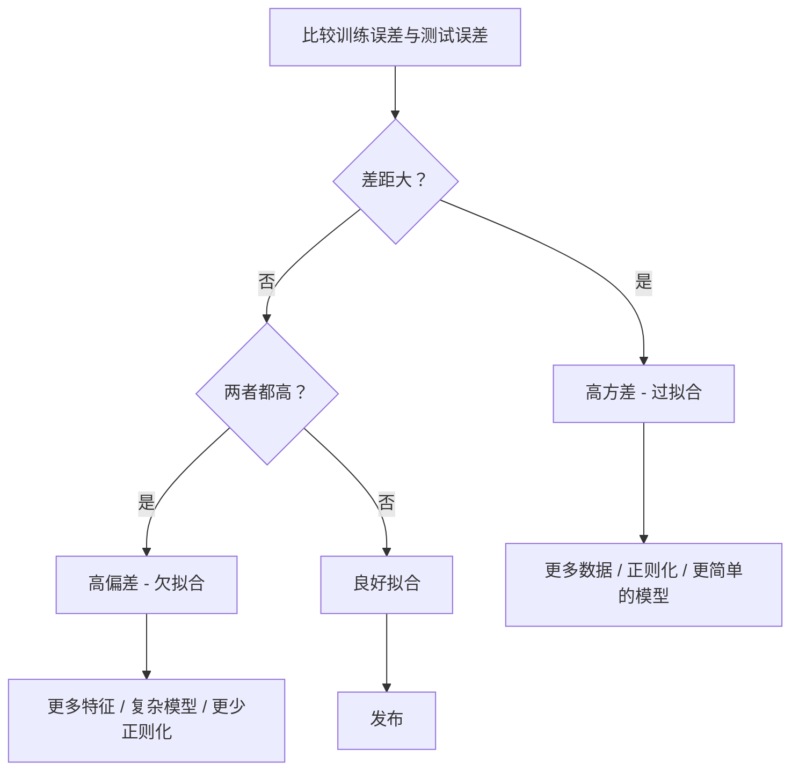
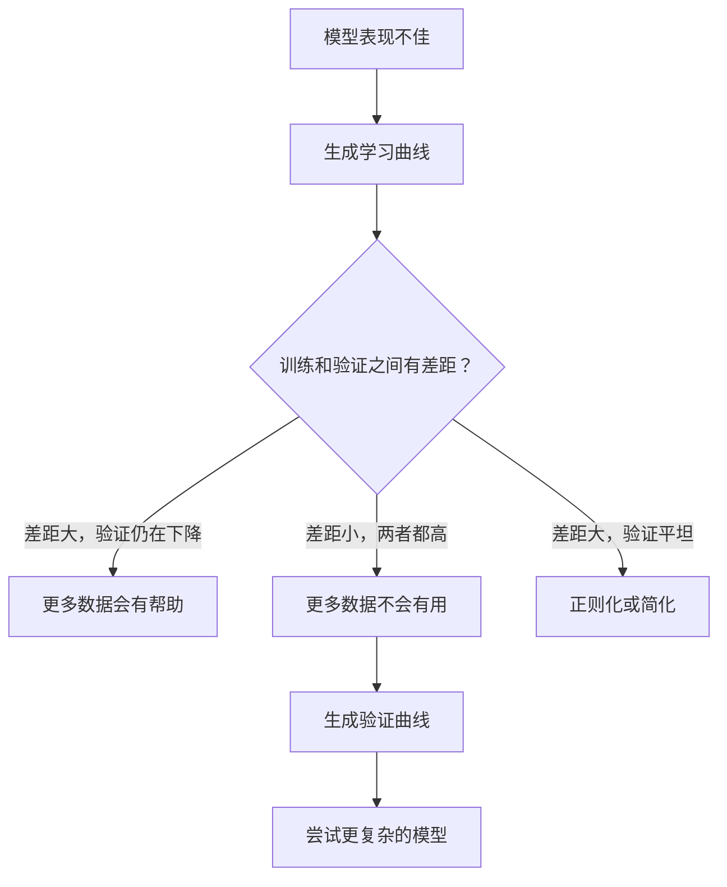

# 偏差-方差权衡

> 每个模型误差都来自三个来源之一：偏差、方差或噪声。你只能控制前两个。

**类型：** 学习
**语言：** Python
**前置要求：** 第二阶段，第01-09课（ML 基础、回归、分类、评估）
**时间：** ~75分钟

## 学习目标

- 推导期望预测误差的偏差-方差分解，并解释不可约噪声的作用
- 使用训练和测试误差模式诊断模型是否存在高偏差或高方差
- 解释正则化技术（L1、L2、dropout、早停）如何用偏差换取方差
- 实现可视化偏差-方差权衡的实验，覆盖不同复杂度的模型

## 问题

你训练了一个模型。它在测试数据上有一些误差。这些误差从何而来？

如果你的模型太简单（在弯曲数据集上的线性回归），它会一直错过真实的模式。这就是偏差（bias）。如果你的模型太复杂（15个数据点上的20次多项式），它会完美拟合训练数据，但在新数据上给出截然不同的预测。这就是方差（variance）。

对于固定的模型容量，你不能同时最小化两者。压低偏差时方差上升。压低方差时偏差上升。理解这种权衡是机器学习中最有用的诊断技能。它告诉你应该使模型更复杂还是更简单，应该获取更多数据还是设计更好的特征，应该更多还是更少地正则化。

## 概念

### 偏差：系统性误差

偏差衡量模型的平均预测与真实值之间的差距。如果你在许多来自同一分布的不同训练集上训练同一个模型并对预测求平均，偏差就是该平均值与真实值之间的差距。

高偏差意味着模型过于僵化，无法捕捉真实模式。用直线拟合抛物线总会错过曲线，无论你给它多少数据。这就是欠拟合。

```
高偏差（欠拟合）：
  模型总是大致预测同一个错误的东西。
  训练误差：高
  测试误差：高
  两者间差距：小
```

### 方差：对训练数据的敏感度

方差衡量当你用不同数据子集训练时，你的预测变化有多大。如果训练集中的小变化导致模型的大变化，方差就高。

高方差意味着模型在拟合训练数据中的噪声，而不是潜在信号。一个20次多项式会穿过每个训练点，但在它们之间剧烈振荡。这就是过拟合。

```
高方差（过拟合）：
  模型完美拟合训练数据但在新数据上失败。
  训练误差：低
  测试误差：高
  两者间差距：大
```

### 分解

对于任何点 x，平方损失下的期望预测误差可以精确分解：

```
期望误差 = 偏差² + 方差 + 不可约噪声

其中：
  偏差²   = (E[f_hat(x)] - f(x))²
  方差    = E[(f_hat(x) - E[f_hat(x)])²]
  噪声    = E[(y - f(x))²]             (sigma²)
```

- `f(x)` 是真实函数
- `f_hat(x)` 是你的模型的预测
- `E[...]` 是对不同训练集的期望
- `y` 是观察到的标签（真实函数加噪声）

噪声项是不可约的。在带噪声的数据上，没有模型能比 sigma² 做得更好。你的工作是找到偏差²和方差之间的正确平衡。

### 模型复杂度 vs 误差


```mermaid
graph LR
    A[简单模型] -->|增加复杂度| B[最佳点]
    B -->|增加复杂度| C[复杂模型]

    style A fill:#f9f,stroke:#333
    style B fill:#9f9,stroke:#333
    style C fill:#f99,stroke:#333
```

经典的 U 形曲线：

| 复杂度 | 偏差 | 方差 | 总误差 |
|-----------|------|----------|-------------|
| 太低 | 高 | 低 | 高（欠拟合） |
| 恰到好处 | 中等 | 中等 | 最低 |
| 太高 | 低 | 高 | 高（过拟合） |

### 正则化作为偏差-方差控制

正则化有意增加偏差以减少方差。它约束模型使其不能追逐噪声。

- **L2（Ridge）：** 将所有权重向零收缩。保留所有特征但减少其影响。
- **L1（Lasso）：** 将一些权重精确推到零。执行特征选择。
- **Dropout：** 在训练期间随机禁用神经元。强制冗余表示。
- **早停（Early stopping）：** 在模型完全拟合训练数据之前停止训练。

正则化强度（lambda、dropout 率、训练轮数）直接控制你在偏差-方差曲线上的位置。更多正则化意味着更多偏差、更少方差。

### 双重下降：现代视角

经典理论说：超过最佳点后，更多复杂度总是有害的。但自 2019 年以来的研究显示了意想不到的现象。如果你继续将模型容量推到远超插值阈值（模型有足够参数完美拟合训练数据的点），测试误差可能再次下降。


```mermaid
graph LR
    A[欠拟合区] --> B[经典最佳点]
    B --> C[插值阈值]
    C --> D[双重下降 - 误差再次下降]

    style A fill:#fdd,stroke:#333
    style B fill:#dfd,stroke:#333
    style C fill:#fdd,stroke:#333
    style D fill:#dfd,stroke:#333
```

这种"双重下降"现象解释了为什么过度参数化的神经网络（参数远多于训练样本）仍然能良好泛化。经典的偏差-方差权衡没有错，但对于现代体系来说是不完整的。

关于双重下降的关键观察：
- 它在线性模型、决策树和神经网络中都会发生
- 在插值区域，更多数据实际上可能有害（样本级双重下降）
- 更多训练轮次也可能导致它（轮次级双重下降）
- 正则化平滑了峰值但不能消除它

为什么会发生？在插值阈值处，模型有刚好足够的容量来拟合所有训练点。它被迫进入一个非常特定的解，穿过每个点，数据中的小扰动会导致拟合的巨大变化。这就是方差达到峰值的地方。超过阈值后，模型有许多可能的解都能完美拟合数据。学习算法（例如，具有隐式正则化的梯度下降）倾向于在其中选择最简单的那个。偏向简单解的隐式偏置是过度参数化模型能泛化的原因。

| 区间 | 参数 vs 样本 | 行为 |
|--------|----------------------|----------|
| 欠参数化 | p << n | 经典权衡适用 |
| 插值阈值 | p ~ n | 方差达到峰值，测试误差飙升 |
| 过参数化 | p >> n | 隐式正则化生效，测试误差下降 |

实际建议：如果你使用神经网络或大型树集成，不要停在插值阈值。要么远低于它（使用显式正则化），要么远超过它。最糟糕的位置就是刚好在阈值处。

### 诊断你的模型


```mermaid
flowchart TD
    A[比较训练误差与测试误差] --> B{差距大？}
    B -->|是| C[高方差 - 过拟合]
    B -->|否| D{两者都高？}
    D -->|是| E[高偏差 - 欠拟合]
    D -->|否| F[良好拟合]

    C --> G[更多数据 / 正则化 / 更简单的模型]
    E --> H[更多特征 / 复杂模型 / 更少正则化]
    F --> I[发布]
```

| 症状 | 诊断 | 修复 |
|---------|-----------|-----|
| 高训练误差、高测试误差 | 偏差 | 更多特征、复杂模型、更少正则化 |
| 低训练误差、高测试误差 | 方差 | 更多数据、正则化、更简单模型、dropout |
| 低训练误差、低测试误差 | 良好拟合 | 发布 |
| 训练误差下降、测试误差上升 | 过拟合进行中 | 早停 |

### 实用策略

**当偏差是问题时：**
- 添加多项式或交互特征
- 使用更灵活的模型（树集成代替线性）
- 降低正则化强度
- 训练更长时间（如果尚未收敛）

**当方差是问题时：**
- 获取更多训练数据
- 使用 bagging（随机森林）
- 增加正则化（更高的 lambda、更多 dropout）
- 特征选择（移除噪声特征）
- 使用交叉验证及早发现

### 集成方法与方差减少

集成方法是对抗方差的最实用工具。

**Bagging（Bootstrap 聚合）** 在训练数据的不同 bootstrap 样本上训练多个模型，然后平均它们的预测。每个单独的模型有高方差，但平均值的方差低得多。随机森林是将 bagging 应用于决策树。

为什么数学上有效：如果你平均 N 个独立的预测，每个有方差 sigma²，平均值的方差是 sigma² / N。模型不是真正独立的（它们都看到相似的数据），所以减少量小于 1/N，但仍然显著。

**Boosting** 通过顺序构建模型来减少偏差，每个新模型关注当前集成的错误。梯度提升和 AdaBoost 是主要示例。如果你添加太多模型，Boosting 可能会过拟合，所以你需要早停或正则化。

| 方法 | 主要效果 | 偏差变化 | 方差变化 |
|--------|---------------|-------------|-----------------|
| Bagging | 减少方差 | 不变 | 减少 |
| Boosting | 减少偏差 | 减少 | 可能增加 |
| Stacking | 两者都减少 | 取决于元学习器 | 取决于基模型 |
| Dropout | 隐式 bagging | 轻微增加 | 减少 |

**实用规则：** 如果你的基模型方差高（深树、高次多项式），使用 bagging。如果你的基模型偏差高（浅桩、简单线性模型），使用 boosting。

### 学习曲线

学习曲线绘制训练和验证误差随训练集大小的变化。它们是你拥有的最实用的诊断工具。与单次训练/测试比较不同，学习曲线展示了模型的轨迹，并告诉你更多数据是否有帮助。


```mermaid
flowchart TD
    subgraph HB["高偏差学习曲线"]
        direction LR
        HB1["小 N：两者误差都高"]
        HB2["大 N：两者收敛到高误差"]
        HB1 --> HB2
    end

    subgraph HV["高方差学习曲线"]
        direction LR
        HV1["小 N：训练低、测试高（差距大）"]
        HV2["大 N：差距缩小但缓慢"]
        HV1 --> HV2
    end

    subgraph GF["良好拟合学习曲线"]
        direction LR
        GF1["小 N：有些差距"]
        GF2["大 N：两者收敛到低误差"]
        GF1 --> GF2
    end
```

如何解读它们：

| 场景 | 训练误差 | 验证误差 | 差距 | 含义 | 怎么做 |
|----------|---------------|-----------------|-----|---------------|------------|
| 高偏差 | 高 | 高 | 小 | 模型无法捕捉模式 | 更多特征、复杂模型、更少正则化 |
| 高方差 | 低 | 高 | 大 | 模型记住了训练数据 | 更多数据、正则化、更简单模型 |
| 良好拟合 | 中等 | 中等 | 小 | 模型泛化良好 | 发布 |
| 高方差，改善中 | 低 | 随数据增加而下降 | 缩小 | 数据可修复的方差问题 | 收集更多数据 |
| 高偏差，平坦 | 高 | 高且平坦 | 小平坦 | 更多数据不会有用 | 改变模型架构 |

关键洞察：如果两条曲线都已趋于平稳且差距小但两者误差都高，更多数据是无用的。你需要更好的模型。如果差距大且仍在缩小，更多数据会有帮助。

### 如何生成学习曲线

有两种方法：

**方法1：改变训练集大小，固定模型。** 保持模型和超参数不变。在训练数据的递增子集上训练。在每个大小测量训练误差和验证误差。这是标准的学习曲线。

**方法2：改变模型复杂度，固定数据。** 保持数据不变。扫描复杂度参数（多项式次数、树深度、层数）。在每个复杂度测量训练误差和验证误差。这是一个验证曲线，直接显示了偏差-方差权衡。

两种方法互为补充。第一个告诉你更多数据是否有帮助。第二个告诉你不同的模型是否有帮助。在就下一步做出决定之前，运行两者。


```mermaid
flowchart TD
    A[模型表现不佳] --> B[生成学习曲线]
    B --> C{训练和验证之间有差距？}
    C -->|差距大，验证仍在下降| D[更多数据会有帮助]
    C -->|差距小，两者都高| E[更多数据不会有用]
    C -->|差距大，验证平坦| F[正则化或简化]
    E --> G[生成验证曲线]
    G --> H[尝试更复杂的模型]
```

```figure
bias-variance
```

## 动手实现

`code/bias_variance.py` 中的代码运行完整的偏差-方差分解实验。以下是逐步方法。

### 第1步：从已知函数生成合成数据

我们使用 `f(x) = sin(1.5x) + 0.5x` 并添加高斯噪声。知道真实函数使我们能计算精确的偏差和方差。

```python
def true_function(x):
    return np.sin(1.5 * x) + 0.5 * x

def generate_data(n_samples=30, noise_std=0.5, x_range=(-3, 3), seed=None):
    rng = np.random.RandomState(seed)
    x = rng.uniform(x_range[0], x_range[1], n_samples)
    y = true_function(x) + rng.normal(0, noise_std, n_samples)
    return x, y
```

### 第2步：Bootstrap 采样和多项式拟合

对每个多项式次数，我们抽取许多 bootstrap 训练集，拟合多项式，并记录在固定测试网格上的预测。这给出了每个测试点上的预测分布。

```python
def fit_polynomial(x_train, y_train, degree, lam=0.0):
    X = np.column_stack([x_train ** d for d in range(degree + 1)])
    if lam > 0:
        penalty = lam * np.eye(X.shape[1])
        penalty[0, 0] = 0
        w = np.linalg.solve(X.T @ X + penalty, X.T @ y_train)
    else:
        w = np.linalg.lstsq(X, y_train, rcond=None)[0]
    return w
```

我们在 200 个不同的 bootstrap 样本上拟合。每个 bootstrap 样本来自相同的底层分布，但包含不同的点。

### 第3步：计算偏差²和方差分解

在每个测试点上有 200 组预测后，我们可以直接从定义计算分解：

```python
mean_pred = predictions.mean(axis=0)
bias_sq = np.mean((mean_pred - y_true) ** 2)
variance = np.mean(predictions.var(axis=0))
total_error = np.mean(np.mean((predictions - y_true) ** 2, axis=1))
```

- `mean_pred` 是从 bootstrap 样本估计的 E[f_hat(x)]
- `bias_sq` 是平均预测与真实值之间的平方差距
- `variance` 是 bootstrap 样本间预测的平均分散程度
- `total_error` 应大致等于偏差² + 方差 + 噪声

### 第4步：学习曲线

学习曲线在保持模型复杂度固定的情况下扫描训练集大小。它们显示你的模型是数据受限还是容量受限。

```python
def demo_learning_curves():
    sizes = [10, 15, 20, 30, 50, 75, 100, 150, 200, 300]
    degree = 5

    for n in sizes:
        train_errors = []
        test_errors = []
        for seed in range(50):
            x_train, y_train = generate_data(n_samples=n, seed=seed * 100)
            w = fit_polynomial(x_train, y_train, degree)
            train_pred = predict_polynomial(x_train, w)
            train_mse = np.mean((train_pred - y_train) ** 2)
            test_pred = predict_polynomial(x_test, w)
            test_mse = np.mean((test_pred - y_test) ** 2)
            train_errors.append(train_mse)
            test_errors.append(test_mse)
        # 在多次运行中平均给出学习曲线点
```

对于高方差模型（小数据时的5次多项式），你会看到：
- 训练误差开始低，随着更多数据使记忆更难而增加
- 测试误差开始高，随着模型获得更多信号而降低
- 差距随更多数据而缩小

对于高偏差模型（1次多项式），两个误差迅速收敛到相同的高值，更多数据无济于事。

### 第5步：正则化扫描

代码还包含 `demo_regularization_sweep()`，它固定一个高次多项式（15次），并从 0.001 到 100 扫描 Ridge 正则化强度。这从不同角度展示了偏差-方差权衡：不是改变模型复杂度，而是改变约束强度。

```python
def demo_regularization_sweep():
    alphas = [0.001, 0.005, 0.01, 0.05, 0.1, 0.5, 1.0, 5.0, 10.0, 50.0, 100.0]
    for alpha in alphas:
        results = bias_variance_decomposition([15], lam=alpha)
        r = results[15]
        print(f"alpha={alpha:.3f}  bias={r['bias_sq']:.4f}  var={r['variance']:.4f}")
```

在低 alpha 时，15次多项式几乎不受约束。方差主导，因为模型在每个 bootstrap 样本中追逐噪声。在高 alpha 时，惩罚如此强烈，以至于模型实际上变成了一个近乎常数的函数。偏差主导。最优 alpha 位于这两个极端之间。

这就是与改变多项式次数相同的 U 形曲线，但由一个连续旋钮而非离散旋钮控制。在实践中，正则化是控制权衡的首选方式，因为它允许在不改变特征集的情况下进行精细控制。

## 使用它

sklearn 提供了 `learning_curve` 和 `validation_curve` 来自动化这些诊断，无需编写 bootstrap 循环。

### 验证曲线：扫描模型复杂度

```python
from sklearn.model_selection import validation_curve
from sklearn.pipeline import make_pipeline
from sklearn.preprocessing import PolynomialFeatures
from sklearn.linear_model import Ridge

degrees = list(range(1, 16))
train_scores_all = []
val_scores_all = []

for d in degrees:
    pipe = make_pipeline(PolynomialFeatures(d), Ridge(alpha=0.01))
    train_scores, val_scores = validation_curve(
        pipe, X, y, param_name="polynomialfeatures__degree",
        param_range=[d], cv=5, scoring="neg_mean_squared_error"
    )
    train_scores_all.append(-train_scores.mean())
    val_scores_all.append(-val_scores.mean())
```

这直接给出了偏差-方差权衡曲线。当验证分数相对于训练分数最差时，方差主导。当两者都差时，偏差主导。

### 学习曲线：扫描训练集大小

```python
from sklearn.model_selection import learning_curve

pipe = make_pipeline(PolynomialFeatures(5), Ridge(alpha=0.01))
train_sizes, train_scores, val_scores = learning_curve(
    pipe, X, y, train_sizes=np.linspace(0.1, 1.0, 10),
    cv=5, scoring="neg_mean_squared_error"
)
train_mse = -train_scores.mean(axis=1)
val_mse = -val_scores.mean(axis=1)
```

绘制 `train_mse` 和 `val_mse` 相对于 `train_sizes` 的图。形状告诉你关于模型的一切。

### 带正则化扫描的交叉验证

```python
from sklearn.model_selection import cross_val_score

alphas = [0.001, 0.01, 0.1, 1.0, 10.0, 100.0]
for alpha in alphas:
    pipe = make_pipeline(PolynomialFeatures(10), Ridge(alpha=alpha))
    scores = cross_val_score(pipe, X, y, cv=5, scoring="neg_mean_squared_error")
    print(f"alpha={alpha:>7.3f}  MSE={-scores.mean():.4f} +/- {scores.std():.4f}")
```

这为固定模型复杂度扫描正则化强度。你会看到相同的偏差-方差权衡：低 alpha 意味着高方差，高 alpha 意味着高偏差。

### 整合：完整的诊断工作流

在实践中，你按顺序运行这些诊断：

1. 训练模型。计算训练和测试误差。
2. 如果两者都高：你有偏差问题。跳到第4步。
3. 如果训练低但测试高：你有方差问题。生成学习曲线看更多数据是否有帮助。如果没有，正则化。
4. 生成验证曲线，扫描主要复杂度参数。找到最佳点。
5. 在最佳点，生成学习曲线。如果差距仍然大，你需要更多数据或正则化。
6. 使用 `cross_val_score` 尝试不同 alpha 值的 Ridge/Lasso。选择交叉验证误差最低的 alpha。

对于大多数表格数据集，这需要 10-15 分钟的计算，节省了数小时的猜测。

## 交付使用

本课程产出：`outputs/prompt-model-diagnostics.md`

## 练习题

1. 以 `noise_std=0`（无噪声）运行分解。不可约误差项会发生什么？最佳复杂度会改变吗？
2. 将训练集大小从 30 增加到 300。这如何影响方差分量？最佳多项式次数会移动吗？
3. 在实验中添加 L2 正则化（Ridge 回归）。对于固定的高次多项式（15次），从 0 到 100 扫描 lambda。绘制偏差²和方差作为 lambda 的函数。
4. 将真实函数从多项式修改为 `sin(x)`。偏差-方差分解如何变化？是否仍然有清晰的最佳次数？
5. 实现一个简单的 bootstrap 聚合（bagging）包装器：在 bootstrap 样本上训练 10 个模型并平均预测。证明这能在不显著增加偏差的情况下减少方差。

## 关键术语

| 术语 | 人们怎么说 | 实际含义 |
|------|----------------|----------------------|
| 偏差（Bias） | "模型太简单" | 来自错误假设的系统性误差。平均模型预测与真实值之间的差距 |
| 方差（Variance） | "模型过拟合" | 来自对训练数据敏感性的误差。不同训练集之间预测的变化程度 |
| 不可约误差（Irreducible error） | "数据中的噪声" | 来自真实数据生成过程中的随机性的误差。没有模型能消除它 |
| 欠拟合（Underfitting） | "学习不足" | 模型偏差高。即使在训练数据上也错过了真实模式 |
| 过拟合（Overfitting） | "记住数据" | 模型方差高。拟合了不能泛化的训练数据中的噪声 |
| 正则化（Regularization） | "约束模型" | 添加惩罚以减少模型复杂度，用偏差换取更低的方差 |
| 双重下降（Double descent） | "更多参数可能有帮助" | 当模型容量远超过插值阈值时，测试误差再次下降 |
| 模型复杂度（Model complexity） | "模型的灵活性" | 模型拟合任意模式的能力。由架构、特征或正则化控制 |

## 延伸阅读

- [Hastie, Tibshirani, Friedman: Elements of Statistical Learning, Ch. 7](https://hastie.su.domains/ElemStatLearn/) -- 偏差-方差分解的权威论述
- [Belkin et al., Reconciling modern machine learning practice and the bias-variance trade-off (2019)](https://arxiv.org/abs/1812.11118) -- 双重下降论文
- [Nakkiran et al., Deep Double Descent (2019)](https://arxiv.org/abs/1912.02292) -- 轮次级和样本级双重下降
- [Scott Fortmann-Roe: Understanding the Bias-Variance Tradeoff](http://scott.fortmann-roe.com/docs/BiasVariance.html) -- 清晰的可视化解释
