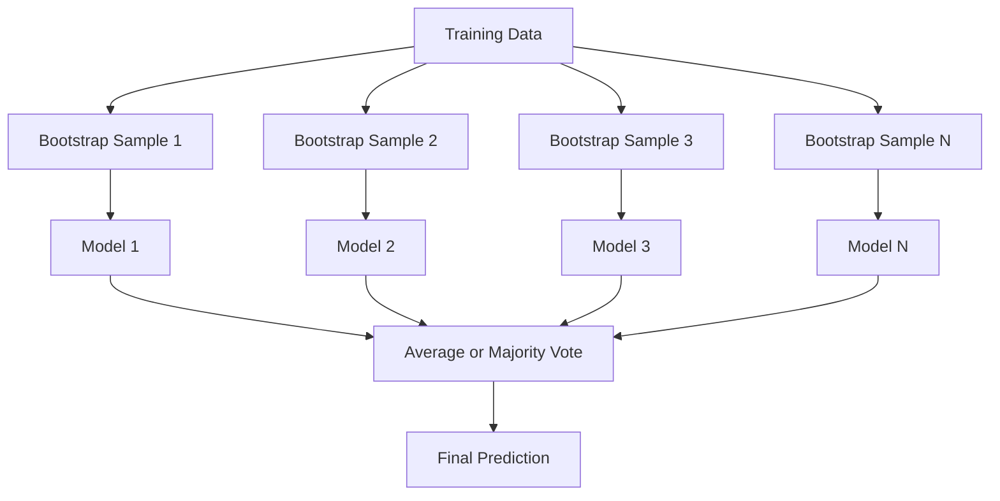
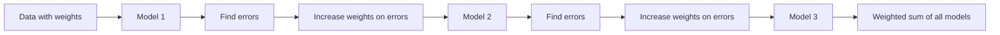
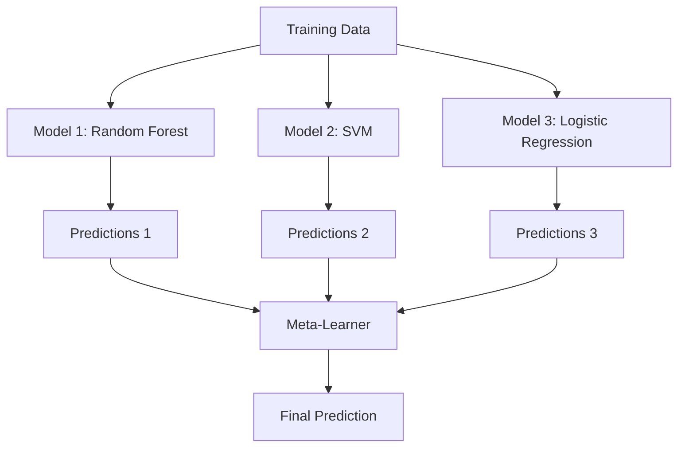

# アンサンブル手法

> 弱い学習器の集まりも、正しく組み合わせれば強い学習器になります。これは比喩ではありません。定理です。

**種類:** Build
**言語:** Python
**前提:** Phase 2, Lesson 10 (Bias-Variance Tradeoff)
**時間:** 約120分

## 学習目標

- AdaBoost と gradient boosting をゼロから実装し、boosting が bias を逐次的に減らす仕組みを説明する
- bagging ensemble を構築し、相関の低いモデルを平均することで bias を増やさずに variance が下がることを示す
- bagging、boosting、stacking を、それぞれが狙う error component の観点で比較する
- ensemble diversity を評価し、独立した weak learner が増えるほど majority voting の accuracy が改善する理由を説明する

## 問題

単一の decision tree は学習が速く解釈しやすい一方で、overfit します。単一の linear model は複雑な境界で underfit します。完璧な model architecture を作るために何日も feature engineering することもできます。あるいは、不完全なモデルを多数組み合わせ、個々のどれよりも良いものを得ることもできます。

Ensemble method はまさにこれを行います。tabular data の Kaggle competition で勝つための最も信頼できる技術であり、多くの production ML system を支え、バイアス-分散トレードオフを実際に示します。Bagging は variance を下げます。Boosting は bias を下げます。Stacking は、どの入力でどのモデルを信頼すべきかを学習します。

## コンセプト

### Ensemble が機能する理由

accuracy p > 0.5 を持つ独立した classifier が N 個あるとします。majority vote の accuracy は次のようになります。

```
P(majority correct) = sum over k > N/2 of C(N,k) * p^k * (1-p)^(N-k)
```

accuracy が 60% の classifier が 21 個あると、majority vote の accuracy は約 74% です。101 個なら 84% まで上がります。モデルが異なる間違いをする場合、誤りが打ち消し合います。

重要な条件は **diversity** です。すべてのモデルが同じ誤りをするなら、組み合わせても何の役にも立ちません。Ensemble が機能するのは、次の方法で多様なモデルを作るからです。

- 異なる training subset（bagging）
- 異なる feature subset（Random Forest）
- 逐次的な error correction（boosting）
- 異なる model family（stacking）

### Bagging (Bootstrap Aggregating)

Bagging は、training data の異なる bootstrap sample 上で各モデルを学習することで diversity を作ります。



bootstrap sample は元データから復元抽出で引かれ、サイズは元データと同じです。各 bootstrap には一意な sample の約 63.2% が現れます。残りの 36.8%（out-of-bag sample）は、無料の validation set になります。

Bagging は bias をあまり増やさずに variance を下げます。個々の tree は bootstrap sample に overfit しますが、overfitting の仕方が tree ごとに違うため、平均化によってノイズが打ち消されます。

**Random Forest** は、bagging に追加の工夫を加えたものです。各 split で、特徴量の random subset だけを候補にします。これにより tree 間の diversity がさらに強制されます。候補特徴量の典型的な数は、classification では `sqrt(n_features)`、regression では `n_features / 3` です。

### Boosting (Sequential Error Correction)

Boosting はモデルを逐次的に学習します。各新しいモデルは、以前のモデルが間違えた example に注目します。



Boosting は bias を下げます。各新しいモデルは、それまでの ensemble の系統的誤差を修正します。最終予測はすべてのモデルの weighted sum であり、より良いモデルほど大きな重みを得ます。

トレードオフとして、boosting は round 数が多すぎると overfit することがあります。より難しい example に合わせ続けるため、その一部が noise である場合があるからです。

### AdaBoost

AdaBoost（Adaptive Boosting）は最初の実用的な boosting algorithm です。任意の base learner と組み合わせられますが、典型的には decision stump（depth-1 tree）を使います。

アルゴリズム:

```
1. Initialize sample weights: w_i = 1/N for all i

2. For t = 1 to T:
   a. Train weak learner h_t on weighted data
   b. Compute weighted error:
      err_t = sum(w_i * I(h_t(x_i) != y_i)) / sum(w_i)
   c. Compute model weight:
      alpha_t = 0.5 * ln((1 - err_t) / err_t)
   d. Update sample weights:
      w_i = w_i * exp(-alpha_t * y_i * h_t(x_i))
   e. Normalize weights to sum to 1

3. Final prediction: H(x) = sign(sum(alpha_t * h_t(x)))
```

error が低いモデルほど高い alpha を得ます。誤分類された sample は重みが増え、次のモデルがそれらに注目します。

### Gradient Boosting

Gradient boosting は boosting を任意の loss function に一般化します。sample の重みを変える代わりに、各新しいモデルを現在の ensemble の residual（loss の負の勾配）に fit します。

```
1. Initialize: F_0(x) = argmin_c sum(L(y_i, c))

2. For t = 1 to T:
   a. Compute pseudo-residuals:
      r_i = -dL(y_i, F_{t-1}(x_i)) / dF_{t-1}(x_i)
   b. Fit a tree h_t to the residuals r_i
   c. Find optimal step size:
      gamma_t = argmin_gamma sum(L(y_i, F_{t-1}(x_i) + gamma * h_t(x_i)))
   d. Update:
      F_t(x) = F_{t-1}(x) + learning_rate * gamma_t * h_t(x)

3. Final prediction: F_T(x)
```

squared error loss の場合、pseudo-residual は実際の residual そのものです: `r_i = y_i - F_{t-1}(x_i)`。各 tree は文字通り、前の ensemble の誤差に fit します。

learning rate（shrinkage）は、各 tree の寄与量を制御します。小さい learning rate ではより多くの tree が必要になりますが、汎化性能は良くなります。典型的な値は 0.01 から 0.3 です。

### XGBoost: Tabular Data で強い理由

XGBoost（eXtreme Gradient Boosting）は、速く、正確で、overfitting に強くする engineering optimization を備えた gradient boosting です。

- **Regularized objective:** leaf weight に対する L1 と L2 penalty により、個々の tree が過度に自信を持つのを防ぐ
- **Second-order approximation:** loss の一次導関数と二次導関数の両方を使い、より良い split decision を行う
- **Sparsity-aware splits:** 各 split で missing data の最適な方向を学習し、missing value を native に扱う
- **Column subsampling:** Random Forest のように、各 split で特徴量を sample して diversity を作る
- **Weighted quantile sketch:** distributed data 上の continuous feature の split point を効率的に見つける
- **Cache-aware block structure:** CPU cache line 向けに最適化された memory layout

tabular data では、XGBoost（および後継の LightGBM）は neural network を一貫して上回ります。これは当面変わりません。データが行と列を持つ表に収まるなら、gradient boosting から始めてください。

### Stacking (Meta-Learning)

Stacking は、複数の base model の予測を meta-learner の特徴量として使います。



meta-learner は、どの入力でどの base model を信頼するべきかを学習します。特定の領域では Random Forest が優れ、別の領域では SVM が優れているなら、meta-learner はそれに応じて振り分けることを学びます。

data leakage を避けるため、base model の予測は training set 上の cross-validation で生成する必要があります。同じデータで base model を学習し、meta-feature を生成してはいけません。

### Voting

最も単純な ensemble です。予測を直接組み合わせるだけです。

- **Hard voting:** class label に対する majority vote。
- **Soft voting:** 予測確率を平均し、平均確率が最も高い class を選びます。confidence 情報を使うため、通常はこちらの方が優れます。

## 作る

### Step 1: Decision Stump (Base Learner)

`code/ensembles.py` のコードは、すべてをゼロから実装しています。まずは decision stump、つまり単一 split の tree から始めます。

```python
class DecisionStump:
    def __init__(self):
        self.feature_idx = None
        self.threshold = None
        self.polarity = 1
        self.alpha = None

    def fit(self, X, y, weights):
        n_samples, n_features = X.shape
        best_error = float("inf")

        for f in range(n_features):
            thresholds = np.unique(X[:, f])
            for thresh in thresholds:
                for polarity in [1, -1]:
                    pred = np.ones(n_samples)
                    pred[polarity * X[:, f] < polarity * thresh] = -1
                    error = np.sum(weights[pred != y])
                    if error < best_error:
                        best_error = error
                        self.feature_idx = f
                        self.threshold = thresh
                        self.polarity = polarity

    def predict(self, X):
        n = X.shape[0]
        pred = np.ones(n)
        idx = self.polarity * X[:, self.feature_idx] < self.polarity * self.threshold
        pred[idx] = -1
        return pred
```

### Step 2: AdaBoost をゼロから実装する

```python
class AdaBoostScratch:
    def __init__(self, n_estimators=50):
        self.n_estimators = n_estimators
        self.stumps = []
        self.alphas = []

    def fit(self, X, y):
        n = X.shape[0]
        weights = np.full(n, 1 / n)

        for _ in range(self.n_estimators):
            stump = DecisionStump()
            stump.fit(X, y, weights)
            pred = stump.predict(X)

            err = np.sum(weights[pred != y])
            err = np.clip(err, 1e-10, 1 - 1e-10)

            alpha = 0.5 * np.log((1 - err) / err)
            weights *= np.exp(-alpha * y * pred)
            weights /= weights.sum()

            stump.alpha = alpha
            self.stumps.append(stump)
            self.alphas.append(alpha)

    def predict(self, X):
        total = sum(a * s.predict(X) for a, s in zip(self.alphas, self.stumps))
        return np.sign(total)
```

### Step 3: Gradient Boosting をゼロから実装する

```python
class GradientBoostingScratch:
    def __init__(self, n_estimators=100, learning_rate=0.1, max_depth=3):
        self.n_estimators = n_estimators
        self.lr = learning_rate
        self.max_depth = max_depth
        self.trees = []
        self.initial_pred = None

    def fit(self, X, y):
        self.initial_pred = np.mean(y)
        current_pred = np.full(len(y), self.initial_pred)

        for _ in range(self.n_estimators):
            residuals = y - current_pred
            tree = SimpleRegressionTree(max_depth=self.max_depth)
            tree.fit(X, residuals)
            update = tree.predict(X)
            current_pred += self.lr * update
            self.trees.append(tree)

    def predict(self, X):
        pred = np.full(X.shape[0], self.initial_pred)
        for tree in self.trees:
            pred += self.lr * tree.predict(X)
        return pred
```

### Step 4: sklearn と比較する

コードは、ゼロからの実装が sklearn の `AdaBoostClassifier` と `GradientBoostingClassifier` に近い accuracy を出すことを確認し、すべての手法を横並びで比較します。

## 使う

### 各手法をいつ使うか

| 手法 | 減らすもの | 最適な用途 | 注意点 |
|--------|---------|----------|---------------|
| Bagging / Random Forest | Variance | ノイズの多いデータ、多数の特徴量 | bias には効かない |
| AdaBoost | Bias | ノイズの少ないデータ、simple base learner | outlier と noise に敏感 |
| Gradient Boosting | Bias | 表形式データ、competition | 学習が遅く、tuning なしでは overfit しやすい |
| XGBoost / LightGBM | 両方 | 本番の tabular ML | hyperparameter が多い |
| Stacking | 両方 | 最後の 1-2% の accuracy を取りに行く | 複雑で、meta-learner が overfit するリスク |
| Voting | Variance | 多様なモデルの素早い組み合わせ | モデルが多様な場合にしか役立たない |

### Tabular Data 向け本番スタック

ほとんどの tabular prediction problem では、この順序で試します。

1. default parameter の **LightGBM または XGBoost**
2. n_estimators、learning_rate、max_depth、min_child_weight を調整する
3. 最後の 0.5% が必要なら、3-5 個の多様なモデルで stacking ensemble を作る
4. 全体を通して cross-validation を使う

tabular data に対する neural network は、研究が続いているにもかかわらず、ほとんど常に gradient boosting より悪くなります。TabNet、NODE、および類似 architecture は、たまにうまく tuning された XGBoost に匹敵しますが、めったに上回りません。

## 成果物

このレッスンは `outputs/prompt-ensemble-selector.md` を生成します。これは、与えられた dataset に対して適切な ensemble method を選ぶための prompt です。データ（size、feature type、noise level、class balance）と解いている問題を説明してください。この prompt は decision checklist を進め、手法を推奨し、starting hyperparameter を提案し、その手法でよくあるミスを警告します。さらに完全な選択ガイドとして `outputs/skill-ensemble-builder.md` も生成します。

## 演習

1. AdaBoost 実装を変更し、各 round 後の training accuracy を追跡してください。accuracy と estimator 数をプロットします。いつ収束しますか？

2. regression tree に random feature subsampling を追加し、Random Forest をゼロから実装してください。`max_features=sqrt(n_features)` で 100 個の tree を学習し、予測を平均します。単一 tree と比べて variance reduction を比較してください。

3. gradient boosting 実装に early stopping を追加してください。各 round 後に validation loss を追跡し、10 round 連続で改善しなければ停止します。実際に必要な tree は何本ですか？

4. 3 つの base model（logistic regression、decision tree、k-nearest neighbors）と logistic regression meta-learner で stacking ensemble を構築してください。5-fold cross-validation を使って meta-feature を生成します。各 base model 単体と比較してください。

5. 同じ dataset で default parameter の XGBoost を実行してください。accuracy をゼロから実装した gradient boosting と比較します。両方の時間を計測してください。速度差はどれくらい大きいですか？

## 重要語句

| 用語 | よく言われること | 実際の意味 |
|------|----------------|----------------------|
| Bagging | 「random subset で学習する」 | Bootstrap aggregating: bootstrap sample 上でモデルを学習し、予測を平均して variance を減らす |
| Boosting | 「難しい example に注目する」 | モデルを逐次的に学習し、各モデルがそれまでの ensemble の誤差を修正して bias を減らす |
| AdaBoost | 「データを reweight する」 | sample weight update による boosting。誤分類された点は次の learner でより高い重みを持つ |
| Gradient boosting | 「residual に fit する」 | 各新しいモデルを loss function の負の勾配に fit する boosting |
| XGBoost | 「Kaggle weapon」 | regularization、second-order optimization、systems-level speed trick を備えた gradient boosting |
| Stacking | 「モデルの上にモデルを重ねる」 | base model の予測を meta-learner の input feature として使う |
| Random forest | 「多数の randomized tree」 | decision tree による bagging。各 split で random feature subsampling を加えて diversity を作る |
| Ensemble diversity | 「違う間違いをする」 | ensemble が個々のモデルを上回るには、モデルの error が無相関である必要がある |
| Out-of-bag error | 「無料の validation」 | bootstrap draw に含まれない sample（約 36.8%）を holdout なしの validation set として使う |

## 参考文献

- [Schapire & Freund: Boosting: Foundations and Algorithms](https://mitpress.mit.edu/9780262526036/) -- AdaBoost の開発者による本
- [Friedman: Greedy Function Approximation: A Gradient Boosting Machine (2001)](https://statweb.stanford.edu/~jhf/ftp/trebst.pdf) -- original gradient boosting paper
- [Chen & Guestrin: XGBoost (2016)](https://arxiv.org/abs/1603.02754) -- XGBoost paper
- [Wolpert: Stacked Generalization (1992)](https://www.sciencedirect.com/science/article/abs/pii/S0893608005800231) -- original stacking paper
- [scikit-learn Ensemble Methods](https://scikit-learn.org/stable/modules/ensemble.html) -- practical reference
