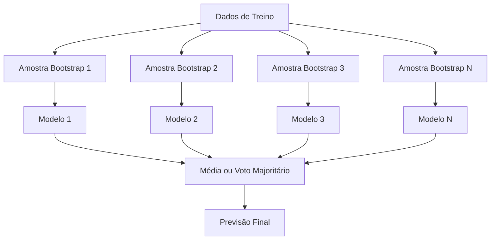
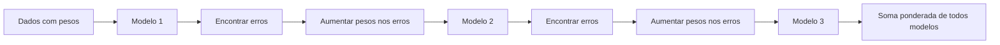
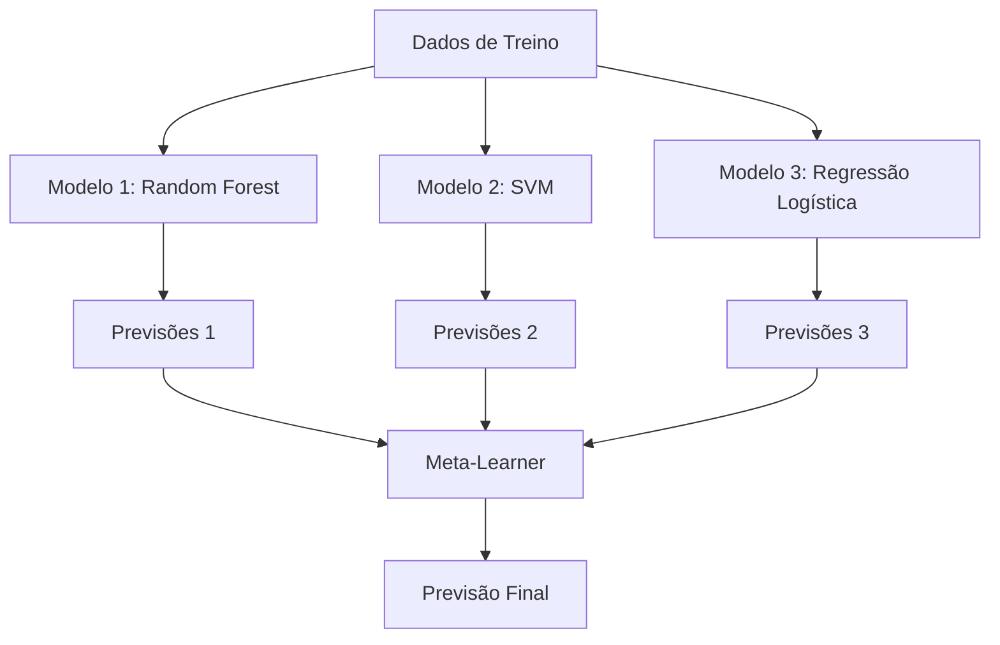

# Métodos Ensemble

> Um grupo de aprendizes fracos, combinados corretamente, se torna um aprendiz forte. Isso não é metáfora. É um teorema.

**Tipo:** Build
**Linguagens:** Python
**Pré-requisitos:** Fase 2, Aula 10 (Tradeoff Viés-Variância)
**Tempo:** ~120 minutos

## Objetivos de Aprendizado

- Implementar AdaBoost e gradient boosting do zero e explicar como boosting reduz viés sequencialmente
- Construir um ensemble bagging e demonstrar como média de modelos descorrelacionados reduz sem aumentar viés
- Comparar bagging, boosting e stacking em termos de qual componente de erro cada método ataca
- Avaliar diversidade de ensemble e explicar por que acurácia de voto majoritário melhora com mais aprendizes fracos independentes

## O Problema

Uma única árvore de decisão é rápida pra treinar e fácil de interpretar, mas faz overfitting. Um único modelo linear subajusta em fronteiras complexas. Você poderia gastar dias projetando a arquitetura perfeita do modelo. Ou poderia combinar um monte de modelos imperfeitos e conseguir algo melhor que qualquer um individualmente.

Métodos ensemble fazem exatamente isso.

## O Conceito

### Por Que Ensembles Funcionam

Suponha que você tem N classificadores independentes, cada um com acurácia p > 0.5. A acurácia do voto majoritário é:

```
P(maioria correta) = soma sobre k > N/2 de C(N,k) * p^k * (1-p)^(N-k)
```

Para 21 classificadores cada com 60% de acurácia, a acurácia do voto majoritário é cerca de 74%. Com 101 classificadores, sobe pra 84%.

O requisito-chave é **diversidade**. Se todos os modelos fazem os mesmos erros, combiná-los não ajuda nada.

### Bagging (Agregação Bootstrap)



Bagging reduz variância sem aumentar viés muito.

**Random Forests** são bagging com um toque extra: a cada divisão, apenas um subconjunto aleatório de features é considerado.

### Boosting (Correção Sequencial de Erros)

Boosting treina modelos sequencialmente. Cada novo modelo foca nos exempulos que os modelos anteriores erraram.



### AdaBoost

O primeiro algoritmo de boosting prático.

```
1. Inicializar pesos das amostras: w_i = 1/N para todo i

2. Para t = 1 até T:
   a. Treinar aprendiz fraco h_t nos dados com pesos
   b. Calcular erro ponderado:
      err_t = soma(w_i * I(h_t(x_i) != y_i)) / soma(w_i)
   c. Calcular peso do modelo:
      alpha_t = 0.5 * ln((1 - err_t) / err_t)
   d. Atualizar pesos das amostras:
      w_i = w_i * exp(-alpha_t * y_i * h_t(x_i))
   e. Normalizar pesos para somar 1

3. Previsão final: H(x) = sign(soma(alpha_t * h_t(x)))
```

### Gradient Boosting

Gradient boosting generaliza boosting para funções de perda arbitrárias. Em vez de reponderar amostras, ajusta cada novo modelo aos resíduos (gradiente negativo da perda) do ensemble atual.

```python
# Para perda de erro quadrático, os pseudo-resíduos são os resíduos reais:
# r_i = y_i - F_{t-1}(x_i)
# Cada árvore literalmente ajusta os erros do ensemble anterior.
```

### XGBoost: Por Que Domina Dados Tabulares

- **Objetivo regularizado:** Penalidades L1 e L2 nos pesos das folhas
- **Aproximação de segunda ordem:** Usa primeira e segunda derivadas da perda
- **Divisões conscientes de esparsidade:** Lida com valores faltantes nativamente
- **Subamostragem de colunas:** Amostra features a cada divisão

Para dados tabulares, XGBoost (e seu sucessor LightGBM) consistentemente supera redes neurais.

### Stacking (Meta-Learning)



## Construa

### Passo 1: Decision Stump (Aprendiz Base)

```python
class DecisionStump:
    def __init__(self):
        self.feature_idx = None
        self.threshold = None
        self.polarity = 1
        self.alpha = None

    def fit(self, X, y, weights):
        n_samples, n_features = X.shape
        best_error = float("inf")

        for f in range(n_features):
            thresholds = np.unique(X[:, f])
            for thresh in thresholds:
                for polarity in [1, -1]:
                    pred = np.ones(n_samples)
                    pred[polarity * X[:, f] < polarity * thresh] = -1
                    error = np.sum(weights[pred != y])
                    if error < best_error:
                        best_error = error
                        self.feature_idx = f
                        self.threshold = thresh
                        self.polarity = polarity
```

### Passo 2: AdaBoost Do Zero

```python
class AdaBoostScratch:
    def __init__(self, n_estimators=50):
        self.n_estimators = n_estimators
        self.stumps = []
        self.alphas = []

    def fit(self, X, y):
        n = X.shape[0]
        weights = np.full(n, 1 / n)

        for _ in range(self.n_estimators):
            stump = DecisionStump()
            stump.fit(X, y, weights)
            pred = stump.predict(X)

            err = np.sum(weights[pred != y])
            err = np.clip(err, 1e-10, 1 - 1e-10)

            alpha = 0.5 * np.log((1 - err) / err)
            weights *= np.exp(-alpha * y * pred)
            weights /= weights.sum()

            stump.alpha = alpha
            self.stumps.append(stump)
            self.alphas.append(alpha)

    def predict(self, X):
        total = sum(a * s.predict(X) for a, s in zip(self.alphas, self.stumps))
        return np.sign(total)
```

### Passo 3: Gradient Boosting Do Zero

```python
class GradientBoostingScratch:
    def __init__(self, n_estimators=100, learning_rate=0.1, max_depth=3):
        self.n_estimators = n_estimators
        self.lr = learning_rate
        self.max_depth = max_depth
        self.trees = []
        self.initial_pred = None

    def fit(self, X, y):
        self.initial_pred = np.mean(y)
        current_pred = np.full(len(y), self.initial_pred)

        for _ in range(self.n_estimators):
            residuals = y - current_pred
            tree = SimpleRegressionTree(max_depth=self.max_depth)
            tree.fit(X, residuals)
            update = tree.predict(X)
            current_pred += self.lr * update
            self.trees.append(tree)

    def predict(self, X):
        pred = np.full(X.shape[0], self.initial_pred)
        for tree in self.trees:
            pred += self.lr * tree.predict(X)
        return pred
```

## Use

### Quando Usar Qual Método

| Método | Reduz | Melhor para | Cuidado |
|--------|-------|-------------|---------|
| Bagging / Random Forest | Variância | Dados ruidosos, muitas features | Não ajuda com viés |
| AdaBoost | Viés | Dados limpos, aprendizes base simples | Sensível a outliers e ruído |
| Gradient Boosting | Viés | Dados tabulares, competições | Lento pra treinar, fácil de overfit |
| XGBoost / LightGBM | Ambos | ML tabular em produção | Muitos hiperparâmetros |
| Stacking | Ambos | Conseguir últimos 1-2% de accuracy | Complexo, risco de overfit no meta-learner |

## Exercícios

1. Modifique a implementação do AdaBoost pra rastrear accuracy de treino a cada rodada.
2. Implemente uma random forest do zero adicionando subamostragem aleatória de features à árvore de regressão.
3. No gradient boosting, adicione early stopping: rastreie a loss de validação a cada rodada e pare quando não melhorar por 10 rodadas consecutivas.
4. Construa um ensemble stacking com três modelos base e um meta-learner de regressão logística.
5. Rode XGBoost no mesmo dataset com parâmetros padrão. Compare accuracy com seu gradient boosting do zero.
