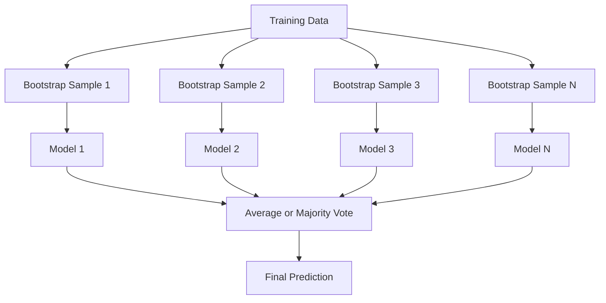
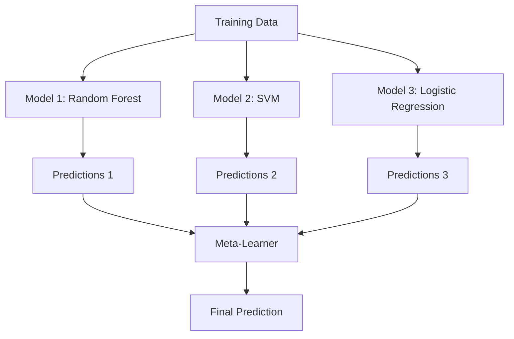

# Topluluk Yöntemleri

> Bir grup zayıf öğrenci, doğru şekilde bir araya getirildiğinde güçlü bir öğrenci haline gelir. Bu bir metafor değil. Bu bir teoremdir.

**Tür:** Yapım
**Dil:** Python
**Önkoşullar:** Aşama 2, Ders 10 (Önyargı-Varyans Dengesi)
**Süre:** ~120 dakika

## Öğrenme Hedefleri

- AdaBoost ve gradient yükseltmeyi sıfırdan uygulayın ve artırmanın önyargıyı nasıl sırayla azalttığını açıklayın
- Bir torbalama topluluğu oluşturun ve ilişkisizleştirilmiş modellerin ortalamasının önyargıyı artırmadan varyansı nasıl azalttığını gösterin
- Her yöntemin hedeflediği hata bileşeni açısından torbalama, yükseltme ve istiflemeyi karşılaştırın
- Topluluk çeşitliliğini değerlendirin ve daha bağımsız, zayıf öğrenenlerle çoğunluk oylama doğruluğunun neden arttığını açıklayın

## Sorun

Tek bir karar ağacının eğitilmesi hızlıdır ve yorumlanması kolaydır, ancak gereğinden fazla uyum sağlar. Tek bir doğrusal model karmaşık sınırlara uymaz. Mükemmel model mimarisini tasarlamak için günlerinizi harcayabilirsiniz. Ya da bir grup kusurlu modeli birleştirerek tek tek hepsinden daha iyi bir şey elde edebilirsiniz.

Topluluk yöntemleri tam olarak bunu yapar. Tablo verileri üzerinde Kaggle yarışmalarını kazanmanın en güvenilir tekniğidirler, çoğu üretim makine öğrenimi sistemine güç verirler ve önyargı-varyans değişimini eylem halinde gösterirler. Torbalama varyansı azaltır. Yükseltme önyargıyı azaltır. Yığınlama, hangi modellere hangi girdilere güvenileceğini öğrenir.

## Konsept

### Topluluklar Neden Çalışır?

Her birinin doğruluğu p > 0,5 olan N adet bağımsız sınıflandırıcınız olduğunu varsayalım. Çoğunluk oyu doğrudur:

```
P(majority correct) = sum over k > N/2 of C(N,k) * p^k * (1-p)^(N-k)
```

Her biri %60 doğruluğa sahip 21 sınıflandırıcı için çoğunluk oyunun doğruluğu yaklaşık %74'tür. 101 sınıflandırıcıyla bu oran %84’e çıkıyor. Modeller farklı hatalar yaptığında hatalar ortadan kalkar.

Temel gereksinim **çeşitliliktir**. Tüm modeller aynı hataları yapıyorsa bunları birleştirmenin hiçbir faydası olmaz. Topluluklar aşağıdakiler aracılığıyla çeşitli modeller ürettikleri için çalışır:

- Farklı eğitim alt kümeleri (torbalama)
- Farklı özellik alt kümeleri (rastgele ormanlar)
- Sıralı hata düzeltme (artırma)
- Farklı model aileleri (istifleme)

### Torbalama (Önyükleme Toplama)

Torbalama, her modeli eğitim verilerinin farklı bir önyükleme örneği üzerinde eğiterek çeşitlilik yaratır.



Orijinal verilerden, orijinal verilerle aynı boyutta değiştirilerek bir önyükleme örneği çizilir. Benzersiz örneklerin yaklaşık %63,2'si her önyüklemede görünür. Geriye kalan %36,8'lik kısım (torba dışı numuneler) ücretsiz doğrulama seti sağlar.

Torbalama, önyargıyı fazla artırmadan varyansı azaltır. Her bir ağaç kendi önyükleme örneğine fazla uyum sağlar, ancak aşırı uyum her ağaç için farklıdır, dolayısıyla ortalama alma gürültüyü ortadan kaldırır.

**Rastgele Ormanlar** ekstra bir değişiklikle paketlenir: her bölmede yalnızca rastgele bir özellik alt kümesi dikkate alınır. Bu da ağaçlar arasında çeşitliliğin daha da artmasına neden oluyor. Aday özelliklerin tipik sayısı sınıflandırma için `sqrt(n_features)` ve regresyon için `n_features / 3`'dir.

### Yükseltme (Sıralı Hata Düzeltme)

Tren modellerinin sıralı olarak güçlendirilmesi. Her yeni model, önceki modellerin yanlış yaptığı örneklere odaklanıyor.


Yükseltme önyargıyı azaltır. Her yeni model, topluluğun şimdiye kadarki sistematik hatalarını düzeltiyor. Nihai tahmin, daha iyi modellerin daha yüksek ağırlık aldığı tüm modellerin ağırlıklı toplamıdır.

Takas: Çok fazla tur koşarsanız güçlendirme fazla uyum sağlayabilir, çünkü bazıları gürültü olabilecek daha zor örneklere uymaya devam eder.

### AdaBoost

AdaBoost (Adaptive Boosting), ilk pratik güçlendirme algoritmasıdır. Herhangi bir temel öğreniciyle, genellikle karar kütükleriyle (derinlik-1 ağaçları) çalışır.

Algoritma:

```
1. Initialize sample weights: w_i = 1/N for all i

2. For t = 1 to T:
   a. Train weak learner h_t on weighted data
   b. Compute weighted error:
      err_t = sum(w_i * I(h_t(x_i) != y_i)) / sum(w_i)
   c. Compute model weight:
      alpha_t = 0.5 * ln((1 - err_t) / err_t)
   d. Update sample weights:
      w_i = w_i * exp(-alpha_t * y_i * h_t(x_i))
   e. Normalize weights to sum to 1

3. Final prediction: H(x) = sign(sum(alpha_t * h_t(x)))
```

Daha düşük hataya sahip modeller daha yüksek alfa alır. Yanlış sınıflandırılan örnekler daha yüksek ağırlıklara sahip olduğundan bir sonraki model bunlara odaklanır.

### Gradient Artırılıyor

Gradient artırma, yükseltmeyi rastgele loss function'lere genelleştirir. Numuneleri yeniden ağırlıklandırmak yerine, her yeni modeli mevcut topluluğun artıklarına (kaybın negatif gradient) sığdırır.

```
1. Initialize: F_0(x) = argmin_c sum(L(y_i, c))

2. For t = 1 to T:
   a. Compute pseudo-residuals:
      r_i = -dL(y_i, F_{t-1}(x_i)) / dF_{t-1}(x_i)
   b. Fit a tree h_t to the residuals r_i
   c. Find optimal step size:
      gamma_t = argmin_gamma sum(L(y_i, F_{t-1}(x_i) + gamma * h_t(x_i)))
   d. Update:
      F_t(x) = F_{t-1}(x) + learning_rate * gamma_t * h_t(x)

3. Final prediction: F_T(x)
```

Kare hata kaybı için, sözde artıklar yalnızca gerçek artıklardır: `r_i = y_i - F_{t-1}(x_i)`. Her ağaç tam anlamıyla önceki topluluğun hatalarına uyuyor.

Öğrenme oranı (büzülme), her ağacın ne kadar katkıda bulunduğunu kontrol eder. Daha küçük öğrenme oranları daha fazla ağaç gerektirir ancak daha iyi genelleme yapar. Tipik değerler: 0,01 ila 0,3.

### XGBoost: Tablo Verilerine Neden Hakim Oluyor?

XGBoost (eXtreme Gradient Boosting), gradient'yi hızlı, doğru ve aşırı yüklemeye karşı dirençli hale getiren mühendislik optimizasyonlarıyla güçlendiriyor:

- **Düzenlendirilmiş hedef:** Yaprak ağırlıklarına uygulanan L1 ve L2 cezaları, ağaçların kendilerine fazla güvenmelerini önler
- **İkinci dereceden yaklaşım:** Kaybın hem birinci hem de ikinci türevlerini kullanarak daha iyi bölünme kararları verir
- **Yetersizliğe duyarlı bölmeler:** Her bölmede eksik veriler için en iyi yönü öğrenerek eksik değerleri yerel olarak işler
- **Sütun alt örneklemesi:** Rastgele ormanlar gibi, çeşitlilik için her bölmedeki özellikleri örnekler
- **Ağırlıklı niceliksel çizim:** Dağıtılmış verilerdeki sürekli özellikler için bölünme noktalarını verimli bir şekilde bulur
- **Önbelleğe duyarlı blok yapısı:** CPU önbellek hatları için optimize edilmiş bellek düzeni

Tablo verileri açısından XGBoost (ve halefi LightGBM), sürekli olarak neural network'lerden daha iyi performans gösteriyor. Bu yakın zamanda değişmeyecek. Verileriniz satırlar ve sütunlar içeren bir tabloya sığıyorsa gradient artırmayla başlayın.

### Yığınlama (Meta-Öğrenim)

Yığınlama, bir meta-öğrenici için özellik olarak birden fazla temel modelin tahminlerini kullanır.



Meta-öğrenen, hangi girdiler için hangi temel modele güveneceğini öğrenir. Rastgele orman belirli bölgelerde ve SVM diğerlerinde daha iyiyse, meta-öğrenici buna göre yönlendirmeyi öğrenecektir.

Veri sızıntısını önlemek için temel model tahminlerinin eğitim seti üzerinde çapraz doğrulama yoluyla oluşturulması gerekir. Hiçbir zaman temel modelleri eğitmez ve aynı veriler üzerinde meta özellikler oluşturmazsınız.

### Oylama

En basit topluluk. Sadece tahminleri doğrudan birleştirin.

- **Zorunlu oylama:** Sınıf etiketlerinde çoğunluk oyu.
- **Yumuşak oylama:** Ortalama tahmin edilen olasılıklar, en yüksek ortalama olasılığa sahip sınıfı seçin. Genellikle daha iyidir çünkü güven bilgisini kullanır.

## İnşa Et

### Adım 1: Karar Güdüğü (Temel Öğrenci)

`code/ensembles.py`'deki kod her şeyi sıfırdan uygular. Bir karar kütüğüyle başlıyoruz: tek parçalı bir ağaç.

```python
class DecisionStump:
    def __init__(self):
        self.feature_idx = None
        self.threshold = None
        self.polarity = 1
        self.alpha = None

    def fit(self, X, y, weights):
        n_samples, n_features = X.shape
        best_error = float("inf")

        for f in range(n_features):
            thresholds = np.unique(X[:, f])
            for thresh in thresholds:
                for polarity in [1, -1]:
                    pred = np.ones(n_samples)
                    pred[polarity * X[:, f] < polarity * thresh] = -1
                    error = np.sum(weights[pred != y])
                    if error < best_error:
                        best_error = error
                        self.feature_idx = f
                        self.threshold = thresh
                        self.polarity = polarity

    def predict(self, X):
        n = X.shape[0]
        pred = np.ones(n)
        idx = self.polarity * X[:, self.feature_idx] < self.polarity * self.threshold
        pred[idx] = -1
        return pred
```

### Adım 2: Sıfırdan AdaBoost

```python
class AdaBoostScratch:
    def __init__(self, n_estimators=50):
        self.n_estimators = n_estimators
        self.stumps = []
        self.alphas = []

    def fit(self, X, y):
        n = X.shape[0]
        weights = np.full(n, 1 / n)

        for _ in range(self.n_estimators):
            stump = DecisionStump()
            stump.fit(X, y, weights)
            pred = stump.predict(X)

            err = np.sum(weights[pred != y])
            err = np.clip(err, 1e-10, 1 - 1e-10)

            alpha = 0.5 * np.log((1 - err) / err)
            weights *= np.exp(-alpha * y * pred)
            weights /= weights.sum()

            stump.alpha = alpha
            self.stumps.append(stump)
            self.alphas.append(alpha)

    def predict(self, X):
        total = sum(a * s.predict(X) for a, s in zip(self.alphas, self.stumps))
        return np.sign(total)
```

### Adım 3: Gradient Sıfırdan Yükseltme

```python
class GradientBoostingScratch:
    def __init__(self, n_estimators=100, learning_rate=0.1, max_depth=3):
        self.n_estimators = n_estimators
        self.lr = learning_rate
        self.max_depth = max_depth
        self.trees = []
        self.initial_pred = None

    def fit(self, X, y):
        self.initial_pred = np.mean(y)
        current_pred = np.full(len(y), self.initial_pred)

        for _ in range(self.n_estimators):
            residuals = y - current_pred
            tree = SimpleRegressionTree(max_depth=self.max_depth)
            tree.fit(X, residuals)
            update = tree.predict(X)
            current_pred += self.lr * update
            self.trees.append(tree)

    def predict(self, X):
        pred = np.full(X.shape[0], self.initial_pred)
        for tree in self.trees:
            pred += self.lr * tree.predict(X)
        return pred
```

### 4. Adım: Sklearn ile karşılaştırın

Kod, sıfırdan uygulamalarımızın sklearn'in `AdaBoostClassifier` ve `GradientBoostingClassifier` ile benzer doğruluk ürettiğini doğrular ve tüm yöntemleri yan yana karşılaştırır.

## Kullan onu

### Her Yöntem Ne Zaman Kullanılmalı

| Yöntem | azaltır | Şunun için en iyisi | Dikkat edin |
|--------|---------|----------|---------------|
| Paketleme / Rastgele Orman | Varyans | Gürültülü veriler, birçok özellik | Önyargıya yardımcı olmaz |
| AdaBoost | Önyargı | Temiz veriler, basit temel öğrenenler | Aykırı değerlere ve gürültüye karşı duyarlı |
| Gradient Artırma | Önyargı | Tablo verileri, yarışmalar | Eğitilmesi yavaş, ayar gerektirmeden kolayca takılabilir |
| XGBoost / LightGBM | Her ikisi de | Üretim tablosu ML | Birçok hiperparametre |
| İstifleme | Her ikisi de | Son %1-2'lik doğruluğu elde etme | Karmaşık, meta-öğreniciye aşırı uyum riski |
| Oylama | Varyans | Çeşitli modellerin hızlı kombinasyonu | Yalnızca modeller çeşitliyse yardımcı olur |

### Tablo Verileri için Üretim Yığını

Tablo şeklindeki tahmin problemlerinin çoğu için denenecek sıra şu şekildedir:

1. Varsayılan parametrelerle **LightGBM veya XGBoost**
2. N_tahmin edicileri, öğrenme_oranını, maksimum_derinliği, minimum_çocuk_ağırlığını ayarlayın
3. Son %0,5'e ihtiyacınız varsa, 3-5 farklı modelden oluşan bir istifleme grubu oluşturun
4. Çapraz doğrulamayı baştan sona kullanın

Devam eden araştırma girişimlerine rağmen, tablo verileri üzerindeki Neural network'ler neredeyse her zaman gradient güçlendirmesinden daha kötüdür. TabNet, NODE ve benzer mimariler zaman zaman iyi ayarlanmış bir XGBoost ile eşleşir ancak nadiren onu yener.

## Gönderin

Bu ders, belirli bir dataset için doğru birleştirme yöntemini seçmenize yardımcı olan bir prompt olan `outputs/prompt-ensemble-selector.md`'yi üretir. Verilerinizi (boyut, özellik türleri, gürültü düzeyi, sınıf dengesi) ve çözdüğünüz sorunu açıklayın. prompt bir karar kontrol listesinin üzerinden geçer, bir yöntem önerir, hiperparametrelerin başlatılmasını önerir ve bu yönteme ilişkin yaygın hatalar konusunda uyarır. Ayrıca tam seçim kılavuzuyla birlikte `outputs/skill-ensemble-builder.md` üretir.

## Egzersizler

1. Her turdan sonra eğitimin doğruluğunu izlemek için AdaBoost uygulamasını değiştirin. Grafik doğruluğu ve tahmin edicilerin sayısı. Ne zaman birleşir?

2. Regresyon ağacına rastgele özellik alt örneklemesi ekleyerek sıfırdan rastgele bir orman uygulayın. `max_features=sqrt(n_features)` ve ortalama tahminlerle 100 ağacı eğitin. Varyans azaltmayı tek bir ağaçla karşılaştırın.

3. gradient artırma uygulamasında erken durdurmayı ekleyin: doğrulama kaybını her turdan sonra izleyin ve art arda 10 tur boyunca iyileşme olmadığında durun. Aslında kaç ağaca ihtiyacı var?

4. Üç temel model (lojistik regresyon, karar ağacı, k-en yakın komşular) ve bir lojistik regresyon meta-öğrenicisinden oluşan bir yığın topluluğu oluşturun. Meta özellikler oluşturmak için 5 kat çapraz doğrulama kullanın. Her temel modelle tek başına karşılaştırın.

5. XGBoost'u aynı dataset üzerinde varsayılan parametrelerle çalıştırın. Doğruluğunu sıfırdan gradient güçlendirmenizle karşılaştırın. Her ikisi de zaman. Hız farkı ne kadar?

## Anahtar Terimler

| Dönem | İnsanlar ne diyor | Aslında ne anlama geliyor |
|------|----------------|----------------------|
| Torbalama | "Rastgele alt kümeler üzerinde eğitim alın" | Önyükleme toplama: önyükleme örnekleri üzerinde modelleri eğitme, varyansı azaltmak için ortalama tahminler |
| Artırma | "Zor örneklere odaklanın" | Önyargıyı azaltmak için modelleri sırayla eğitin; her biri topluluğun şu ana kadarki hatalarını düzeltir |
| AdaBoost | "Verileri yeniden ağırlıklandırın" | Numune ağırlığı güncellemeleriyle artırma; Yanlış sınıflandırılan puanlar bir sonraki öğrenci için daha fazla ağırlık kazanır |
| Gradient artırılıyor | "Kalanları sığdır" | Her yeni modeli loss function'nin negatif gradient'sine uydurarak güçlendirme |
| XGBoost | "Kaggle silahı" | Gradient düzenleme, ikinci dereceden optimizasyon ve sistem düzeyinde hız hileleriyle güçlendirme |
| İstifleme | "Modellerin üstünde modeller" | Bir meta-öğrenici için temel model tahminlerini girdi özellikleri olarak kullanın |
| Rastgele orman | "Birçok rastgele ağaç" | Karar ağaçlarıyla paketleme, çeşitlilik için her bölmeye rastgele özellik alt örneklemesi ekleme |
| Topluluk çeşitliliği | "Farklı hatalar yapın" | Topluluğun bireylere göre gelişmesi için modellerin hatalarında korelasyon olmaması gerekir |
| Çanta dışı hatası | "Ücretsiz doğrulama" | Önyükleme çekilişinde yer almayan örnekler (~%36,8) uzatmaya ihtiyaç duymadan doğrulama seti görevi görür |

## Daha Fazla Okuma

- [Schapire & Freund: Boosting: Foundations and Algorithms](https://mitpress.mit.edu/9780262526036/) -- AdaBoost'un yaratıcılarının yazdığı kitap
- [Friedman: Açgözlü Fonksiyon Yaklaşımı: A Gradient Artırma Makinesi (2001)](https://statweb.stanford.edu/~jhf/ftp/trebst.pdf) -- orijinal gradient artırma kağıdı
- [Chen ve Guestrin: XGBoost (2016)](https://arxiv.org/abs/1603.02754) -- XGBoost makalesi
- [Wolpert: Stacked Generalization (1992)](https://www.sciencedirect.com/science/article/abs/pii/S0893608005800231) -- orijinal istifleme kağıdı
- [scikit-learn Topluluk Yöntemleri](https://scikit-learn.org/stable/modules/ensemble.html) -- pratik referans
