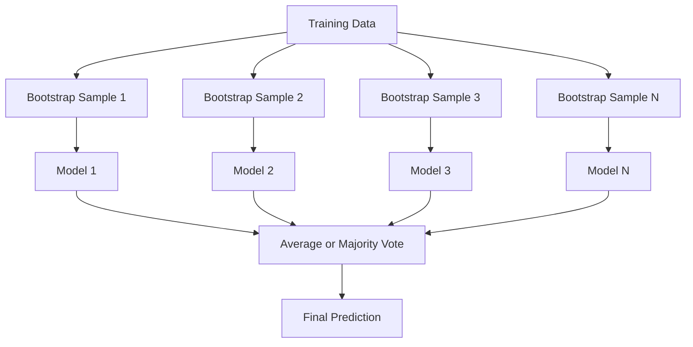
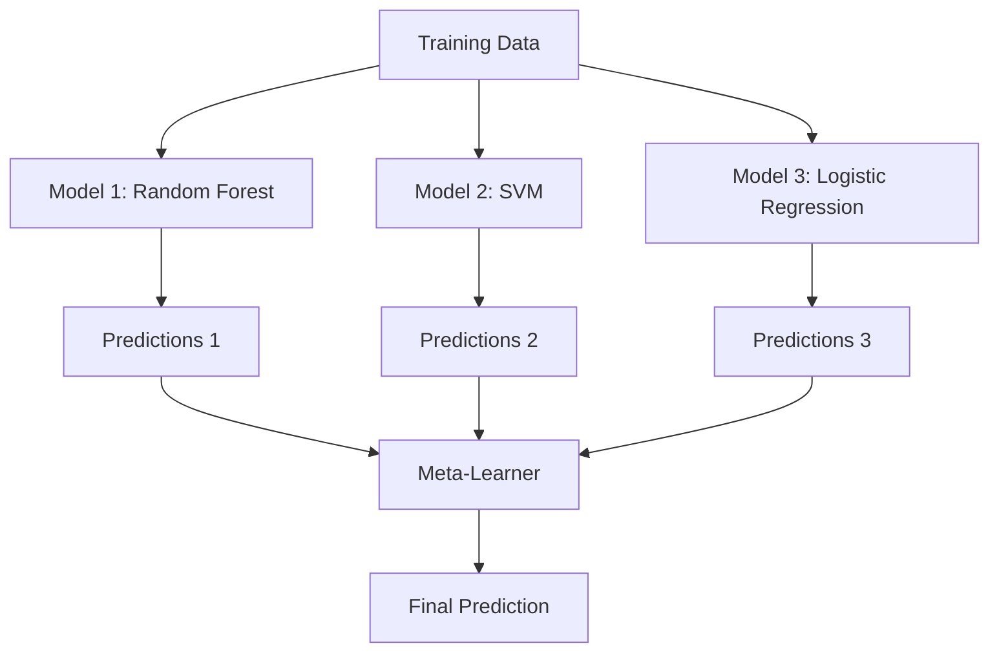

# 11 · 集成方法

> 一群弱学习器，若组合得当，便会成为一个强学习器。这不是比喻，而是一条定理。

**类型：** 实战
**语言：** Python
**前置：** 第 2 阶段，第 10 课（偏差-方差权衡）
**时长：** 约 120 分钟

## 学习目标

- 从零实现 AdaBoost 与梯度提升（gradient boosting），并解释提升（boosting）如何通过序列化训练逐步降低偏差
- 构建一个装袋（bagging）集成，演示对去相关后的模型取平均如何在不增加偏差的前提下降低方差
- 从「各方法分别针对哪一种误差成分」的角度比较装袋、提升与堆叠（stacking）
- 评估集成多样性，并解释为什么独立弱学习器越多，多数投票的准确率就越高

## 问题所在

单棵决策树训练快、易解释，但容易过拟合。单个线性模型在复杂边界上又会欠拟合。你可以花上好几天去打磨完美的模型架构；或者，你也可以把一堆并不完美的模型组合起来，得到比其中任何一个都更好的结果。

集成方法做的正是后者。它们是在表格数据的 Kaggle 竞赛中夺冠最可靠的技术，支撑着大多数生产级 ML 系统，并且把偏差-方差权衡（bias-variance tradeoff）活生生地展现了出来。装袋降低方差；提升降低偏差；堆叠则学习在哪种输入上该信任哪些模型。

## 核心概念

### 集成为何有效

假设你有 N 个相互独立的分类器，每个的准确率 p > 0.5。多数投票的准确率为：

```
P(majority correct) = sum over k > N/2 of C(N,k) * p^k * (1-p)^(N-k)
```

对于 21 个准确率均为 60% 的分类器，多数投票的准确率约为 74%。当分类器增至 101 个时，准确率升至 84%。只要模型犯的错误各不相同，这些错误就会相互抵消。

关键前提是**多样性（diversity）**。如果所有模型都犯同样的错误，组合它们毫无帮助。集成之所以有效，是因为它能通过以下方式产生多样化的模型：

- 不同的训练子集（装袋）
- 不同的特征子集（随机森林）
- 序列化的误差修正（提升）
- 不同的模型族（堆叠）

### 装袋（自助聚合，Bootstrap Aggregating）

装袋通过让每个模型在训练数据的不同自助（bootstrap）样本上训练来制造多样性。



自助样本是从原始数据中有放回地抽取得到的，规模与原始数据相同。每个自助样本中约有 63.2% 的唯一样本出现。剩下的 36.8%（袋外样本，out-of-bag samples）则免费提供了一份验证集。

装袋在不显著增加偏差的情况下降低方差。每棵树都会过拟合到自己的自助样本上，但每棵树过拟合的方式各不相同，因此取平均后噪声相互抵消。

**随机森林（Random Forests）**是装袋的进阶版：在每次分裂时，只考虑一个随机的特征子集。这迫使树与树之间产生更大的多样性。候选特征数的典型取值是分类用 `sqrt(n_features)`、回归用 `n_features / 3`。

### 提升（序列化误差修正）

提升按顺序训练模型。每个新模型都聚焦于此前模型出错的样本。


提升降低偏差。每个新模型都修正目前为止整个集成的系统性误差。最终预测是所有模型的加权和，其中更好的模型获得更高的权重。

代价在于：如果迭代轮数太多，提升可能会过拟合，因为它会不断去拟合越来越难的样本，而其中一些可能本就是噪声。

### AdaBoost

AdaBoost（自适应提升，Adaptive Boosting）是第一个实用的提升算法。它可以配合任意基学习器使用，通常是决策树桩（decision stumps，深度为 1 的树）。

算法流程：

```
1. Initialize sample weights: w_i = 1/N for all i

2. For t = 1 to T:
   a. Train weak learner h_t on weighted data
   b. Compute weighted error:
      err_t = sum(w_i * I(h_t(x_i) != y_i)) / sum(w_i)
   c. Compute model weight:
      alpha_t = 0.5 * ln((1 - err_t) / err_t)
   d. Update sample weights:
      w_i = w_i * exp(-alpha_t * y_i * h_t(x_i))
   e. Normalize weights to sum to 1

3. Final prediction: H(x) = sign(sum(alpha_t * h_t(x)))
```

误差越低的模型，获得的 alpha 越大。被错误分类的样本权重会增大，从而让下一个模型聚焦于它们。

### 梯度提升

梯度提升把提升推广到任意损失函数。它不再对样本重新加权，而是让每个新模型去拟合当前集成的残差（损失的负梯度）。

```
1. Initialize: F_0(x) = argmin_c sum(L(y_i, c))

2. For t = 1 to T:
   a. Compute pseudo-residuals:
      r_i = -dL(y_i, F_{t-1}(x_i)) / dF_{t-1}(x_i)
   b. Fit a tree h_t to the residuals r_i
   c. Find optimal step size:
      gamma_t = argmin_gamma sum(L(y_i, F_{t-1}(x_i) + gamma * h_t(x_i)))
   d. Update:
      F_t(x) = F_{t-1}(x) + learning_rate * gamma_t * h_t(x)

3. Final prediction: F_T(x)
```

对于平方误差损失，伪残差（pseudo-residuals）就是实际残差：`r_i = y_i - F_{t-1}(x_i)`。每棵树实实在在地拟合上一个集成所犯的误差。

学习率（learning rate，又称收缩率 shrinkage）控制每棵树的贡献程度。学习率越小，所需的树越多，但泛化能力更好。典型取值：0.01 到 0.3。

### XGBoost：它为何称霸表格数据

XGBoost（极致梯度提升，eXtreme Gradient Boosting）是带有工程优化的梯度提升，这些优化使其快速、准确且抗过拟合：

- **正则化目标函数：** 对叶子权重施加 L1 与 L2 惩罚，防止单棵树过于自信
- **二阶近似：** 同时使用损失函数的一阶与二阶导数，从而做出更优的分裂决策
- **稀疏感知分裂（sparsity-aware splits）：** 原生处理缺失值，在每次分裂时学习缺失数据应走的最佳方向
- **列子采样（column subsampling）：** 与随机森林类似，在每次分裂时对特征采样以增加多样性
- **加权分位数草图（weighted quantile sketch）：** 在分布式数据上高效地为连续特征寻找分裂点
- **缓存感知的块结构：** 内存布局针对 CPU 缓存行进行了优化

在表格数据上，XGBoost（及其后继 LightGBM）始终优于神经网络。这一格局短期内不会改变。如果你的数据能装进带有行和列的表格，那就从梯度提升开始。

### 堆叠（元学习，Meta-Learning）

堆叠把多个基模型的预测作为特征，喂给一个元学习器（meta-learner）。



元学习器学习的是：针对哪种输入该信任哪个基模型。如果随机森林在某些区域更优、SVM 在另一些区域更优，元学习器就会学会相应地进行路由。

为避免数据泄漏（data leakage），基模型的预测必须通过在训练集上做交叉验证来生成。绝不能用同一份数据既训练基模型又生成元特征。

### 投票

最简单的集成方式，直接把各模型的预测组合起来即可。

- **硬投票（Hard voting）：** 对类别标签进行多数投票。
- **软投票（Soft voting）：** 对预测概率取平均，选取平均概率最高的类别。通常效果更好，因为它利用了置信度信息。

## 动手构建

### 第 1 步：决策树桩（基学习器）

`code/ensembles.py` 中的代码从零实现了一切。我们从决策树桩开始：一棵只有单次分裂的树。

```python
class DecisionStump:
    def __init__(self):
        self.feature_idx = None
        self.threshold = None
        self.polarity = 1
        self.alpha = None

    def fit(self, X, y, weights):
        n_samples, n_features = X.shape
        best_error = float("inf")

        for f in range(n_features):
            thresholds = np.unique(X[:, f])
            for thresh in thresholds:
                for polarity in [1, -1]:
                    pred = np.ones(n_samples)
                    pred[polarity * X[:, f] < polarity * thresh] = -1
                    error = np.sum(weights[pred != y])
                    if error < best_error:
                        best_error = error
                        self.feature_idx = f
                        self.threshold = thresh
                        self.polarity = polarity

    def predict(self, X):
        n = X.shape[0]
        pred = np.ones(n)
        idx = self.polarity * X[:, self.feature_idx] < self.polarity * self.threshold
        pred[idx] = -1
        return pred
```

### 第 2 步：从零实现 AdaBoost

```python
class AdaBoostScratch:
    def __init__(self, n_estimators=50):
        self.n_estimators = n_estimators
        self.stumps = []
        self.alphas = []

    def fit(self, X, y):
        n = X.shape[0]
        weights = np.full(n, 1 / n)

        for _ in range(self.n_estimators):
            stump = DecisionStump()
            stump.fit(X, y, weights)
            pred = stump.predict(X)

            err = np.sum(weights[pred != y])
            err = np.clip(err, 1e-10, 1 - 1e-10)

            alpha = 0.5 * np.log((1 - err) / err)
            weights *= np.exp(-alpha * y * pred)
            weights /= weights.sum()

            stump.alpha = alpha
            self.stumps.append(stump)
            self.alphas.append(alpha)

    def predict(self, X):
        total = sum(a * s.predict(X) for a, s in zip(self.alphas, self.stumps))
        return np.sign(total)
```

### 第 3 步：从零实现梯度提升

```python
class GradientBoostingScratch:
    def __init__(self, n_estimators=100, learning_rate=0.1, max_depth=3):
        self.n_estimators = n_estimators
        self.lr = learning_rate
        self.max_depth = max_depth
        self.trees = []
        self.initial_pred = None

    def fit(self, X, y):
        self.initial_pred = np.mean(y)
        current_pred = np.full(len(y), self.initial_pred)

        for _ in range(self.n_estimators):
            residuals = y - current_pred
            tree = SimpleRegressionTree(max_depth=self.max_depth)
            tree.fit(X, residuals)
            update = tree.predict(X)
            current_pred += self.lr * update
            self.trees.append(tree)

    def predict(self, X):
        pred = np.full(X.shape[0], self.initial_pred)
        for tree in self.trees:
            pred += self.lr * tree.predict(X)
        return pred
```

### 第 4 步：与 sklearn 对比

代码会验证我们从零实现的版本能否产生与 sklearn 的 `AdaBoostClassifier` 和 `GradientBoostingClassifier` 相近的准确率，并把所有方法并排比较。

## 实际应用

### 各方法何时使用

| 方法 | 降低的误差 | 最适合 | 需当心 |
|--------|---------|----------|---------------|
| 装袋 / 随机森林 | 方差 | 噪声数据、特征众多 | 对偏差无济于事 |
| AdaBoost | 偏差 | 干净数据、简单基学习器 | 对离群点和噪声敏感 |
| 梯度提升 | 偏差 | 表格数据、竞赛 | 训练慢，不调参易过拟合 |
| XGBoost / LightGBM | 两者皆有 | 生产级表格 ML | 超参数众多 |
| 堆叠 | 两者皆有 | 榨取最后 1-2% 的准确率 | 复杂，元学习器有过拟合风险 |
| 投票 | 方差 | 快速组合多样化模型 | 仅当模型多样化时才有帮助 |

### 表格数据的生产级技术栈

对于大多数表格预测问题，建议按以下顺序尝试：

1. 用默认参数的 **LightGBM 或 XGBoost**
2. 调优 n_estimators、learning_rate、max_depth、min_child_weight
3. 如果还需要榨取最后的 0.5%，用 3-5 个多样化模型构建一个堆叠集成
4. 全程使用交叉验证

尽管学界不断尝试，表格数据上的神经网络几乎总是不如梯度提升。TabNet、NODE 等同类架构偶尔能打平，但很少能击败一个调优良好的 XGBoost。

## 交付成果

本课会产出 `outputs/prompt-ensemble-selector.md`——一个帮你为给定数据集挑选合适集成方法的提示词。描述你的数据（规模、特征类型、噪声水平、类别均衡度）以及要解决的问题，该提示词会带你走完一份决策清单，推荐一种方法，给出起始超参数建议，并提示该方法常见的错误。本课还会产出 `outputs/skill-ensemble-builder.md`，内含完整的选型指南。

## 练习

1. 修改 AdaBoost 实现，记录每一轮之后的训练准确率。绘制「准确率 vs. 估计器数量」曲线。它在何时收敛？

2. 通过给回归树添加随机特征子采样，从零实现一个随机森林。用 `max_features=sqrt(n_features)` 训练 100 棵树并对预测取平均。把方差的下降幅度与单棵树进行比较。

3. 在梯度提升实现中加入早停（early stopping）：记录每一轮之后的验证损失，当连续 10 轮没有改善时停止。它实际需要多少棵树？

4. 用三个基模型（逻辑回归、决策树、k 近邻）和一个逻辑回归元学习器构建一个堆叠集成。使用 5 折交叉验证来生成元特征。与每个基模型单独使用时进行比较。

5. 在同一数据集上用默认参数运行 XGBoost。把它的准确率与你从零实现的梯度提升进行比较。给两者计时，速度差距有多大？

## 关键术语

| 术语 | 人们常说 | 它实际的含义 |
|------|----------------|----------------------|
| 装袋（Bagging） | "在随机子集上训练" | 自助聚合：在自助样本上训练模型，对预测取平均以降低方差 |
| 提升（Boosting） | "聚焦难样本" | 序列化训练模型，每个都修正目前为止整个集成的误差，以降低偏差 |
| AdaBoost | "给数据重新加权" | 通过更新样本权重来提升；被错误分类的点在下一个学习器中获得更高权重 |
| 梯度提升 | "拟合残差" | 通过让每个新模型拟合损失函数的负梯度来提升 |
| XGBoost | "Kaggle 神器" | 带有正则化、二阶优化和系统级加速技巧的梯度提升 |
| 随机森林 | "许多随机化的树" | 用决策树做装袋，并在每次分裂时加入随机特征子采样以增加多样性 |
| 集成多样性 | "犯不同的错误" | 模型在误差上必须互不相关，集成才能比单个模型更优 |
| 袋外误差（Out-of-bag error） | "免费的验证" | 未被某次自助抽样选中的样本（约 36.8%）充当验证集，无需另留保留集 |

## 延伸阅读

- [Schapire & Freund：《Boosting: Foundations and Algorithms》](https://mitpress.mit.edu/9780262526036/) —— AdaBoost 作者所著的专著
- [Friedman：《Greedy Function Approximation: A Gradient Boosting Machine》(2001)](https://statweb.stanford.edu/~jhf/ftp/trebst.pdf) —— 梯度提升的原始论文
- [Chen & Guestrin：《XGBoost》(2016)](https://arxiv.org/abs/1603.02754) —— XGBoost 论文
- [Wolpert：《Stacked Generalization》(1992)](https://www.sciencedirect.com/science/article/abs/pii/S0893608005800231) —— 堆叠的原始论文
- [scikit-learn 集成方法](https://scikit-learn.org/stable/modules/ensemble.html) —— 实用参考
