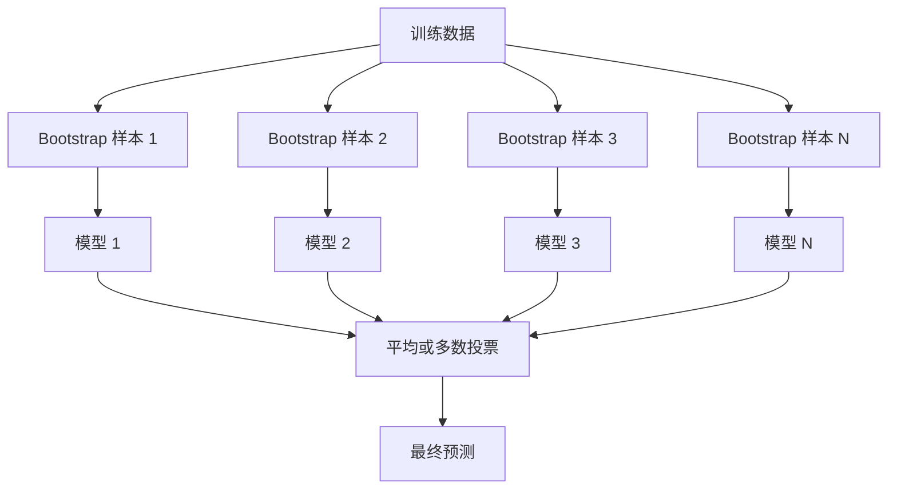
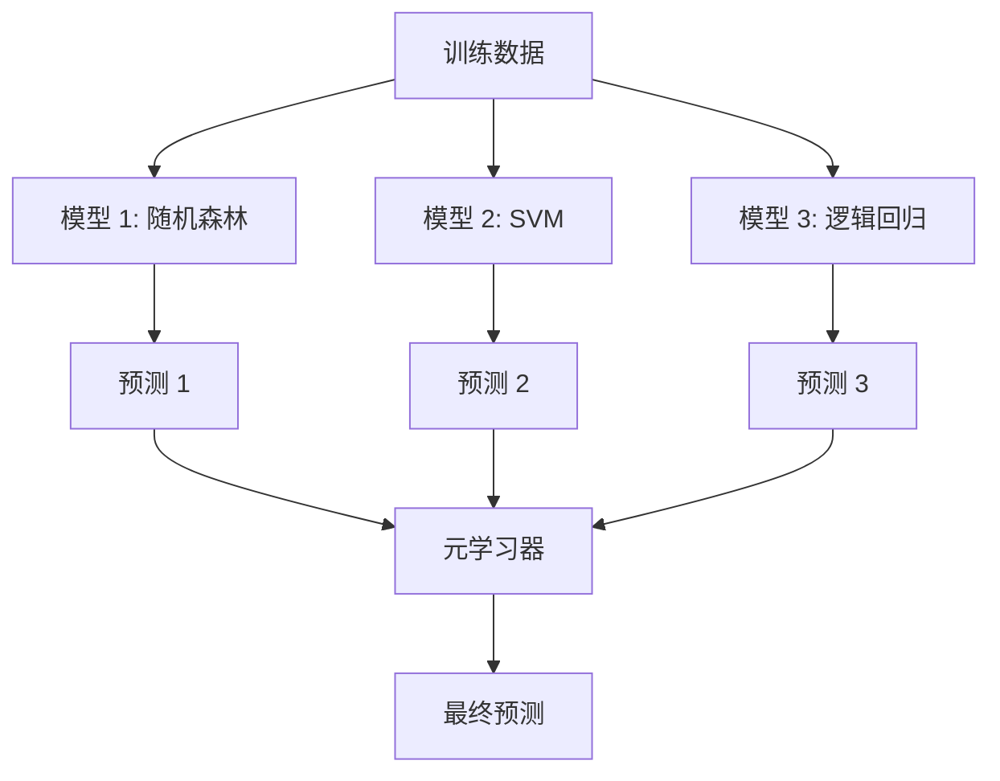

# 集成方法

> 一群弱学习器经过正确组合，就能变成强学习器。这不是比喻，而是一个定理。

**类型：** 构建  
**语言：** Python  
**前置要求：** 第二阶段，第10课（偏置-方差权衡）  
**时长：** 约 120 分钟

## 学习目标

- 从头实现 AdaBoost 和梯度提升，并解释提升如何逐步降低偏置
- 构建一个装袋集成，并演示平均去相关模型如何在不增加偏置的情况下降低方差
- 从每种方法所针对的误差成分角度，比较装袋、提升和堆叠
- 评估集成多样性，并解释为什么随着更多独立弱学习器的加入，多数投票准确率会提高

## 问题

单棵决策树训练快、易于解释，但会过拟合。单一的线性模型在复杂边界上会欠拟合。你可以花几天时间精心设计完美的模型架构，也可以组合一堆不完美的模型，得到比其中任何一个都更好的结果。

集成方法正是做这件事。它们是赢得表格数据 Kaggle 竞赛最可靠的技术，驱动着大多数生产级机器学习系统，并生动地展示了偏置-方差权衡的实际运作。装袋降低方差，提升降低偏置，堆叠则学习在哪些输入上信任哪些模型。

## 概念

### 为什么集成有效

假设有 N 个独立的分类器，每个准确率为 p > 0.5。多数投票的准确率为：

```
P(多数正确) = 对 k > N/2 求和 C(N,k) * p^k * (1-p)^(N-k)
```

对于 21 个准确率均为 60% 的分类器，多数投票准确率约为 74%。当分类器数量增加到 101 个时，准确率升至 84%。当模型犯不同的错误时，错误会相互抵消。

关键要求是**多样性**。如果所有模型都犯同样的错误，组合它们毫无用处。集成之所以有效，是因为它们通过以下方式产生多样的模型：

- 不同的训练子集（装袋）
- 不同的特征子集（随机森林）
- 顺序误差纠正（提升）
- 不同的模型族（堆叠）

### 装袋（Bootstrap 聚合）

装袋通过在训练数据的不同 bootstrap 样本上训练每个模型来创造多样性。



bootstrap 样本是从原始数据中有放回地抽取，大小与原始数据相同。每个 bootstrap 中包含约 63.2% 的独特样本。剩下的 36.8%（袋外样本）提供了一个免费的验证集。

装袋能在不显著增加偏置的情况下降低方差。每棵单独的树都对其 bootstrap 样本过拟合，但每棵树的过拟合方式不同，因此平均操作抵消了噪声。

**随机森林**是装袋的一个变体，额外添加了一个技巧：在每个分裂点，只考虑随机子集的特征。这迫使树之间更加多样化。分类任务中典型的候选特征数量为 `sqrt(n_features)`，回归任务中为 `n_features / 3`。

### 提升（顺序误差纠正）

提升按顺序训练模型。每个新模型都专注于之前模型出错的样本。


提升降低偏置。每个新模型都在纠正当前集成系统的误差。最终预测是所有模型的加权和，表现更好的模型获得更高的权重。

权衡之处在于：如果运行太多轮次，提升可能会过拟合，因为它不断拟合更难（可能包含噪声）的样本。

### AdaBoost

AdaBoost（自适应提升）是第一个实用的提升算法。它可以与任何基学习器配合使用，通常选择决策桩（深度为 1 的树）。

算法如下：

```
1. 初始化样本权重：w_i = 1/N 对所有 i

2. 对 t = 1 到 T：
   a. 在加权数据上训练弱学习器 h_t
   b. 计算加权误差：
      err_t = sum(w_i * I(h_t(x_i) != y_i)) / sum(w_i)
   c. 计算模型权重：
      alpha_t = 0.5 * ln((1 - err_t) / err_t)
   d. 更新样本权重：
      w_i = w_i * exp(-alpha_t * y_i * h_t(x_i))
   e. 归一化权重使总和为 1

3. 最终预测：H(x) = sign(sum(alpha_t * h_t(x)))
```

误差越低的模型获得越高的 alpha。被误分类的样本获得更高的权重，以便下一个模型重点关注它们。

### 梯度提升

梯度提升将提升推广到任意损失函数。它不是重新加权样本，而是将每个新模型拟合到当前集成系统的残差（损失函数的负梯度）上。

```
1. 初始化：F_0(x) = argmin_c sum(L(y_i, c))

2. 对 t = 1 到 T：
   a. 计算伪残差：
      r_i = -dL(y_i, F_{t-1}(x_i)) / dF_{t-1}(x_i)
   b. 拟合一棵树 h_t 到残差 r_i
   c. 找到最优步长：
      gamma_t = argmin_gamma sum(L(y_i, F_{t-1}(x_i) + gamma * h_t(x_i)))
   d. 更新：
      F_t(x) = F_{t-1}(x) + 学习率 * gamma_t * h_t(x)

3. 最终预测：F_T(x)
```

对于平方误差损失，伪残差就是实际残差：`r_i = y_i - F_{t-1}(x_i)`。每棵树实际上是在拟合前一个集成系统的误差。

学习率（收缩）控制每棵树的贡献程度。较小的学习率需要更多棵树，但泛化能力更好。典型值：0.01 到 0.3。

### XGBoost：为什么它统治了表格数据

XGBoost（极端梯度提升）是带有工程优化（使其快速、准确且抗过拟合）的梯度提升：

- **正则化目标函数：** 对叶子权重施加 L1 和 L2 惩罚，防止单棵树的预测过于自信
- **二阶近似：** 同时使用损失函数的一阶和二阶导数，给出更好的分裂决策
- **稀疏感知分裂：** 通过在每个分裂点为缺失数据学习最佳方向，原生处理缺失值
- **列采样：** 类似随机森林，在每个分裂点采样特征以增加多样性
- **加权分位数草图：** 在分布式数据上高效找到连续特征的分裂点
- **缓存感知块结构：** 内存布局针对 CPU 缓存行优化

对于表格数据，XGBoost（及其后继者 LightGBM）始终优于神经网络。这种情况短期内不会改变。如果你的数据能以行和列的表格形式容纳，那么从梯度提升开始。

### 堆叠（元学习）

堆叠将多个基模型的预测作为元学习器的特征。



元学习器学习在哪些输入上信任哪个基模型。如果随机森林在某些区域表现更好而 SVM 在其他区域更优，元学习器会学习相应地路由。

为了避免数据泄露，基模型的预测必须通过在训练集上进行交叉验证来生成。绝不能在相同的数据上既训练基模型又生成元特征。

### 投票

最简单的集成方法。直接组合预测结果。

- **硬投票：** 对类别标签进行多数投票。
- **软投票：** 平均预测概率，选择平均概率最高的类别。通常更好，因为它利用了置信度信息。

## 构建

### 步骤 1：决策桩（基学习器）

`code/ensembles.py` 中的代码从头实现了所有内容。我们从决策桩开始：一棵只有一次分裂的树。

```python
class DecisionStump:
    def __init__(self):
        self.feature_idx = None
        self.threshold = None
        self.polarity = 1
        self.alpha = None

    def fit(self, X, y, weights):
        n_samples, n_features = X.shape
        best_error = float("inf")

        for f in range(n_features):
            thresholds = np.unique(X[:, f])
            for thresh in thresholds:
                for polarity in [1, -1]:
                    pred = np.ones(n_samples)
                    pred[polarity * X[:, f] < polarity * thresh] = -1
                    error = np.sum(weights[pred != y])
                    if error < best_error:
                        best_error = error
                        self.feature_idx = f
                        self.threshold = thresh
                        self.polarity = polarity

    def predict(self, X):
        n = X.shape[0]
        pred = np.ones(n)
        idx = self.polarity * X[:, self.feature_idx] < self.polarity * self.threshold
        pred[idx] = -1
        return pred
```

### 步骤 2：从头实现 AdaBoost

```python
class AdaBoostScratch:
    def __init__(self, n_estimators=50):
        self.n_estimators = n_estimators
        self.stumps = []
        self.alphas = []

    def fit(self, X, y):
        n = X.shape[0]
        weights = np.full(n, 1 / n)

        for _ in range(self.n_estimators):
            stump = DecisionStump()
            stump.fit(X, y, weights)
            pred = stump.predict(X)

            err = np.sum(weights[pred != y])
            err = np.clip(err, 1e-10, 1 - 1e-10)

            alpha = 0.5 * np.log((1 - err) / err)
            weights *= np.exp(-alpha * y * pred)
            weights /= weights.sum()

            stump.alpha = alpha
            self.stumps.append(stump)
            self.alphas.append(alpha)

    def predict(self, X):
        total = sum(a * s.predict(X) for a, s in zip(self.alphas, self.stumps))
        return np.sign(total)
```

### 步骤 3：从头实现梯度提升

```python
class GradientBoostingScratch:
    def __init__(self, n_estimators=100, learning_rate=0.1, max_depth=3):
        self.n_estimators = n_estimators
        self.lr = learning_rate
        self.max_depth = max_depth
        self.trees = []
        self.initial_pred = None

    def fit(self, X, y):
        self.initial_pred = np.mean(y)
        current_pred = np.full(len(y), self.initial_pred)

        for _ in range(self.n_estimators):
            residuals = y - current_pred
            tree = SimpleRegressionTree(max_depth=self.max_depth)
            tree.fit(X, residuals)
            update = tree.predict(X)
            current_pred += self.lr * update
            self.trees.append(tree)

    def predict(self, X):
        pred = np.full(X.shape[0], self.initial_pred)
        for tree in self.trees:
            pred += self.lr * tree.predict(X)
        return pred
```

### 步骤 4：与 sklearn 对比

代码验证了我们从头实现的版本与 sklearn 的 `AdaBoostClassifier` 和 `GradientBoostingClassifier` 产生的准确率相近，并横向比较了所有方法。

## 使用

### 何时使用每种方法

| 方法 | 降低什么 | 最适合 | 注意问题 |
|------|----------|--------|----------|
| 装袋 / 随机森林 | 方差 | 噪声数据、大量特征 | 对偏置无帮助 |
| AdaBoost | 偏置 | 干净数据、简单基学习器 | 对异常值和噪声敏感 |
| 梯度提升 | 偏置 | 表格数据、竞赛 | 训练慢，不调优容易过拟合 |
| XGBoost / LightGBM | 两者 | 生产级表格机器学习 | 超参数多 |
| 堆叠 | 两者 | 获取最后 1-2% 准确率 | 复杂，元学习器有过拟合风险 |
| 投票 | 方差 | 快速组合多样模型 | 仅当模型多样时才有帮助 |

### 表格数据生产栈

对于大多数表格预测问题，建议尝试以下顺序：

1. **LightGBM 或 XGBoost** 使用默认参数
2. 调优 n_estimators、learning_rate、max_depth、min_child_weight
3. 如果还需要最后 0.5% 的提升，使用 3-5 个多样模型构建堆叠集成
4. 全程使用交叉验证

尽管研究不断尝试，但神经网络在表格数据上几乎总是比梯度提升差。TabNet、NODE 等架构偶尔能持平，但很少能击败调优良好的 XGBoost。

## 交付

本课程产出 `outputs/prompt-ensemble-selector.md` —— 一个帮助你为给定数据集选择正确集成方法的提示词。描述你的数据（规模、特征类型、噪声水平、类别平衡）以及要解决的问题。该提示词引导你完成一个决策检查清单，推荐方法，建议起始超参数，并警告该方法的常见错误。同时还产出 `outputs/skill-ensemble-builder.md`，包含完整的选择指南。

## 练习

1. 修改 AdaBoost 实现，跟踪每轮后的训练准确率。绘制准确率 vs. 估计器数量的曲线。它在什么时候收敛？

2. 通过向回归树添加随机特征子采样，从头实现一个随机森林。训练 100 棵树，设置 `max_features=sqrt(n_features)` 并平均预测。与单棵树比较方差减少情况。

3. 在梯度提升实现中添加早停法：跟踪每轮后的验证损失，当连续 10 轮没有改善时停止。实际需要多少棵树？

4. 构建一个堆叠集成，包含三个基模型（逻辑回归、决策树、K 近邻）和一个逻辑回归元学习器。使用 5 折交叉验证生成元特征。与每个基模型单独比较。

5. 在同一数据集上使用默认参数运行 XGBoost。将其准确率与你从头实现的梯度提升进行比较。记录两者的运行时间。速度差异有多大？

## 关键术语

| 术语 | 人们说的 | 实际含义 |
|------|----------|----------|
| 装袋（Bagging） | “在随机子集上训练” | Bootstrap 聚合：在 bootstrap 样本上训练模型，平均预测以降低方差 |
| 提升（Boosting） | “专注于困难样本” | 顺序训练模型，每个模型纠正当前集成的错误，以降低偏置 |
| AdaBoost | “重新加权数据” | 通过样本权重更新实现提升；被误分类的点获得更高权重用于下一个学习器 |
| 梯度提升（Gradient boosting） | “拟合残差” |